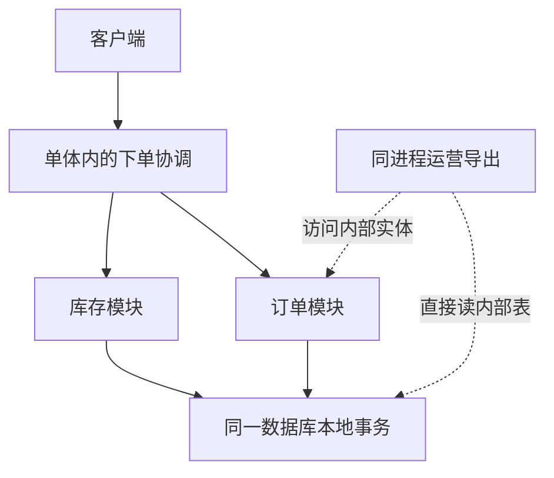
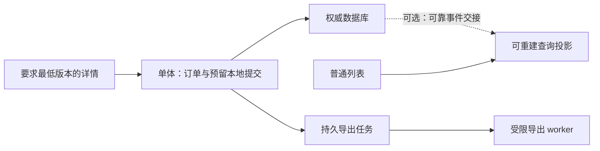
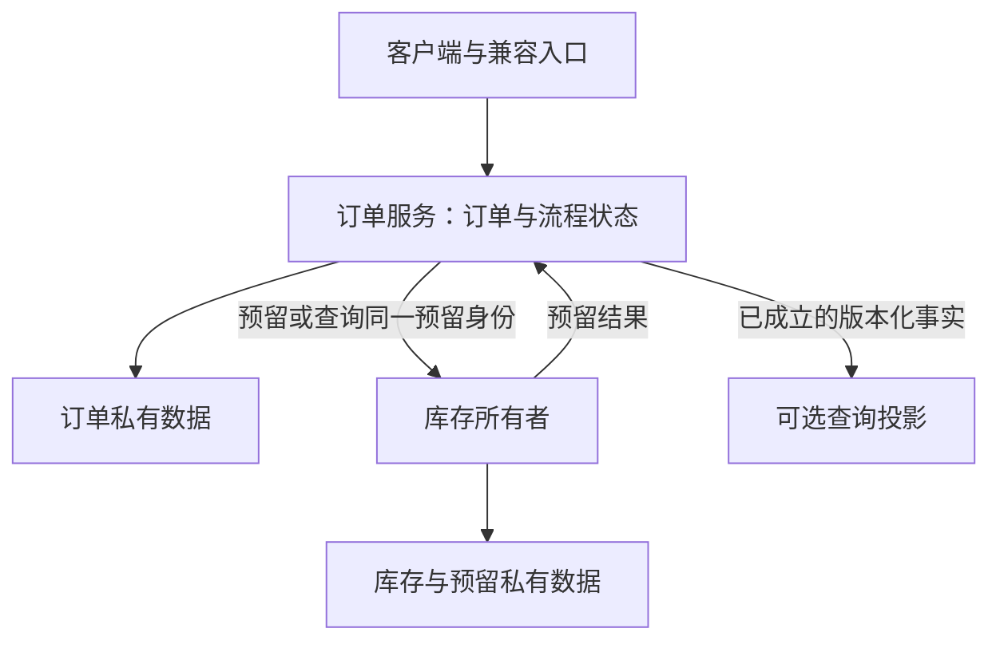
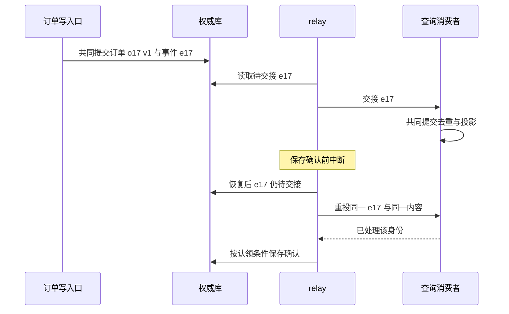
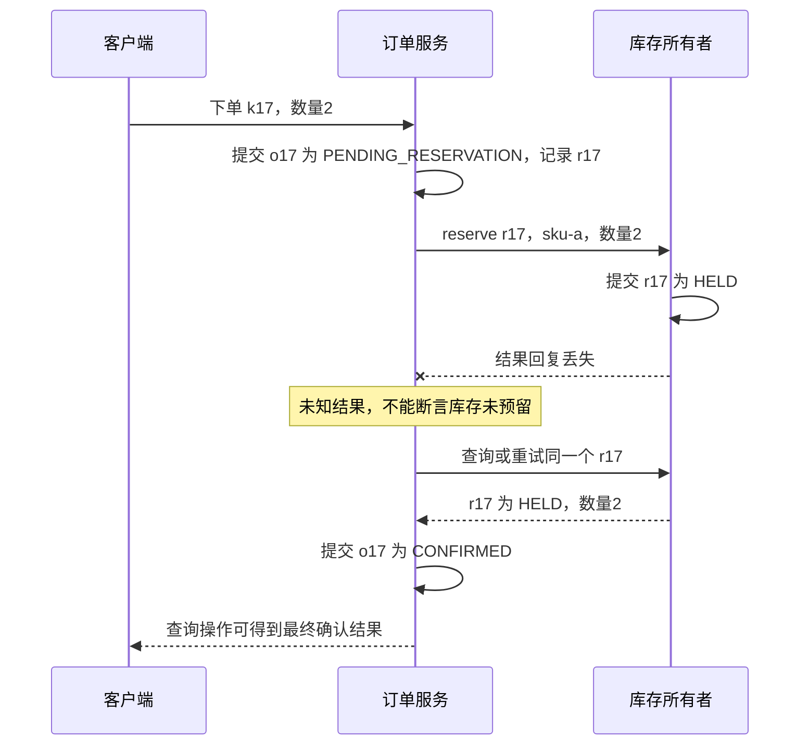
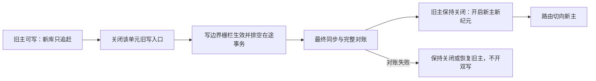

# 订单模块要不要拆成服务：从不拆的理由到可回退的迁移

订单代码越来越多，发布常被别的功能拖住，运营导出又会拖慢下单。把订单拆成服务，似乎能一次解决三个问题。但代码多、发布慢、资源争抢可能来自三个不同原因；新增一个网络边界，也可能把一次本地事务变成一条需要恢复的业务流程。

**本案例的建议是先不拆订单写服务。** 先让模块有可执行的边界，保留订单与库存预留的本地提交；测量之后，如果主要问题确实在导出或查询，再有选择地隔离它们。只有独立交付的收益、稳定的数据边界和团队运维能力都成立，才进入独立订单服务的迁移分支。

这不是把“不拆”当成永久原则。读完应能交出一份可被证据推翻的决定：为何现在这样选，哪些事实会改变选择，做到哪一步可以停，以及新系统写入数据后还能怎样退。

- 只想选方案：读[题面与约束](#scenario)、[决策矩阵](#decision-matrix)和[完整 ADR](#adr)
- 准备实施：读[边界约束](#module-boundary)、[协议兼容](#compatibility)和[渐进迁移](#migration)
- 准备评审：读[失败与补偿](#failure)、[轻量校验](#model)和[综合任务](#review)

::: info 证据边界
业务、团队、规模、成本预算和 SLO 数值都是本页为推理设置的教学条件，不是某家公司的生产故事，也不是性能实测。文末 Python 模型已实际运行，验证的是十三个顺序内存模型用例。没有启动新服务、数据库、broker 或集群，也没有重跑站内既有数据库实验。
:::

<a id="scenario"></a>

## 1. 先把“想拆”改写成一个能检验的问题

### 1.1 教学题面：卖实物，但这次只谈下单与预留

假设有一个线上商店，由六名后端工程师组成同一个交付团队。两人主要维护订单，其他人维护商品、库存和运营功能；部署流水线与值班仍由全队共享。单体里有下单、订单、库存和报表代码，使用一个关系数据库。订单成立与库存占用目前能在一次事务中提交。

产品有三个诉求：订单变更尽量不等报表发布；大型导出不影响下单；以后能单独增加订单处理能力。题面没有给出“微服务是目标”，也没有证据证明瓶颈已在订单进程。

为了让推理具体，设定以下需求候选，真实项目必须由测量和业务确认替换：

| 条件 | 教学设定 | 对设计的直接影响 |
| --- | --- | --- |
| 下单请求 | 峰值待验证假设为每秒 120 次 | 用于构造负载，不直接推出必须拆服务 |
| 查询与导出 | 普通查询每秒 1,200 次；导出偶发且较重 | 先分清交互查询和批量扫描，不能只看总 QPS |
| 成立语义 | 返回 `CONFIRMED` 时，订单与有效库存预留都已成立 | 不能把“已受理”偷偷改称“下单成功” |
| 普通订单列表 | 产品候选允许 5 秒内出现新订单 | 可以评估异步读模型；超时行为还要约定 |
| 刚创建后的详情 | 必须看见响应中的订单版本 | 需要权威读，或最低版本校验与有界等待 |
| 运维投入 | 当前无订单独立值班；每周额外维护预算候选为 4 人时 | 新服务不能依靠“以后补运维”获得批准 |
| 变更期限 | 下一个迭代先缓解导出影响 | 全量拆库不是该短期目标的必经步骤 |

这里没有测得的 p99、故障率或交付等待时长。合理的第一张工单是补上这些基线，而不是先把 `orders` 表复制到新库。

### 1.2 先写不变量，再谈质量目标

不变量描述不能被破坏的业务事实。质量目标描述希望在什么成本和时间内完成事情。两者不能用一个加权总分互相抵销。

本案例要求：

1. 同一租户、同一业务下单身份只产生一个有效订单；相同操作键却带不同请求内容时，必须报告冲突
2. 每张已确认订单对应一份有效库存预留；库存可用量不为负。同一个预留不能被重复释放
3. 对同一订单的权威写入，在任意时刻只能由一个被授权的所有者完成
4. 只有权威事实能改变订单状态；报表投影和缓存不能因为“查不到”而决定重新下单
5. 已提交但尚未完成的工作必须可发现，例如待确认的预留、待交接事件或待核对的取消

本例不处理支付、退款、发货、优惠券跨单限额、跨仓库存和地域容灾。尤其不能从“预留可释放”推导“发货也能无损回滚”。后者改变业务约束，必须重开设计。

### 1.3 三个常被混为一谈的边界

- **模块边界**：谁能调用谁，哪些类型和表属于内部实现
- **部署边界**：哪些代码可独立发布、扩缩容和回退
- **事务边界**：哪些状态能在同一次提交中共同成立

模块化单体可以有清楚的数据归属，却共享部署与本地事务。独立服务新增部署边界，不自动获得清楚的模块边界；若它还随意写单体表，所谓独立很可能只剩端口号。

[Microservice Architecture](https://microservices.io/patterns/microservices.html)同时讨论独立交付的收益和复杂交互、运行时耦合等成本。这里将它们转成具体的评审条件，不把“服务更小”当成结论。

<a id="options"></a>

## 2. 先看三个方案怎样改变系统

### 2.1 起点：一个进程并不等于一个良好模块



文字说明：下单协调把“写订单”和“预留库存”放进同一提交；导出复用了内部表和实体。导出既可能消耗进程 CPU，也可能消耗数据库连接和扫描能力。把它换个进程，只能解决前一类竞争，不能自动解决后一类。

### 2.2 A：模块化单体，先保留本地提交

下单协调只调用 `Orders` 和 `Inventory` 的公开接口；订单模块拥有订单表，库存模块拥有预留表。协调层决定一次业务操作的事务范围，各模块方法加入这次事务。禁止报表直接引用订单内部实体，允许先通过专用查询接口返回稳定 DTO。

这样仍是一套部署、一套主要运行时，没有远程预留的未知结果。但边界违规能在评审和测试里被发现，未来替换实现时有接缝。

**它不解决什么？** 不能单独发布订单进程，也没有进程级故障隔离。若所有模块共享线程池、连接池且没有资源预算，目录分得再漂亮也挡不住导出耗尽资源。

### 2.3 B：只抽离确实需要隔离的查询或异步能力

B 不是固定组件套餐，有两种增量可以独立选择：

- **B1，异步导出**：保留权威写入，新增持久任务记录和受限 worker。用户提交导出任务，稍后下载结果。先考虑限流、分页、索引、查询超时和低峰调度；足以解决问题时无需新进程
- **B2，查询投影**：仅在源库读压力、查询形态或隔离诉求值得时，建立可重建的只读模型。写服务仍是唯一事实源，普通列表允许滞后，刚创建的详情不盲目读取投影



文字说明：B1 和 B2 不是必须一起出现。任务表可以与业务表同库，worker 仍可运行在原应用；独立查询进程也不必承载任何订单写命令。选择增加的每一份状态，都要写明如何重试、追赶和清理。

### 2.4 C：独立订单服务，承认跨边界协作已经改变



文字说明：订单服务不能直接更新库存表；库存成功而订单尚未确认，是现在必须表示的中间状态。网络超时也不等于库存没有提交。C 获得了独立部署的可能性，却新增了协议、重试、状态机和运维责任。

每个服务拥有私有数据，不要求每个服务立即购买一台独立数据库服务器。私有表或 schema 也能表达所有权；物理共置仍共享容量与故障域。这里采用的是 [Database per Service](https://microservices.io/patterns/data/database-per-service.html)的数据封装思想，不把物理实例数当作成熟度。

<a id="ownership"></a>

## 3. 边界从谁负责事实开始，而非从表名开始

| 数据或状态 | A、B 中的所有者 | C 中的所有者 | 其他组件允许做什么 | 迁移时必须带走什么 |
| --- | --- | --- | --- | --- |
| 订单与订单版本 | 单体内订单模块 | 订单服务 | 调公开查询接口；订阅所需事实 | 完整状态、版本、业务唯一身份、必要历史 |
| 库存与预留 | 库存模块 | 库存所有者，未必这轮再拆服务 | 按预留身份申请、查询、释放 | 若其归属未迁移，不复制为第二个写主 |
| 下单操作结果 | 下单入口的持久操作记录 | 订单服务或明确的命令入口所有者 | 同键获取原结果 | 作用域、请求指纹、结果、保留边界 |
| 跨服务流程进度 | 不需要跨服务流程时不存在 | 订单流程协调者 | 查当前状态；执行被授权的下一步 | 未完成步骤、重试与补偿身份、错误证据 |
| 待交接事件 | 产生事实的模块 | 产生事实的服务 | relay 认领、交接、带条件确认 | 未完成责任和原事件身份，不能只搬业务表 |
| 投影及消费去重 | 查询能力所有者 | 查询能力所有者 | 展示和重建；不能改权威订单 | 两者共同恢复的边界与重放水位 |
| 缓存 | 读取层，属于可丢副本 | 同左 | 加速读取，过期或版本不足时回源 | 通常重建，而非提升为事实源 |

“订单模块拥有订单表”并不意味着所有相关字段都应放进去。例如客户当前地址由客户系统维护，而订单上的收货地址是本次交易的快照。若每次展示历史订单都查客户的当前地址，拆分前就有语义错误；多一个服务不能修正它。本页不传输真实个人信息，示例载荷也省略此类字段。

还有一个更难的边界测试：**一个业务不变量是否必须跨所有者立即成立？** 如果业务要求“确认时订单与预留必须共同成立”，A 可以在本地事务中维护它；C 则需要明确中间状态和确认协议。如果产品不接受中间状态、团队也不能实现可恢复协议，应否决这次拆分，或重新选择把强一致动作放在同一所有者内。不能先切库，再让前端解释状态为什么不对。

<a id="decision-matrix"></a>

## 4. 决策矩阵：先过硬门槛，再比较代价

### 4.1 不给没有数据的选项打“综合 92 分”

| 比较维度 | A：模块化单体 | B：仅抽离查询或异步能力 | C：独立订单服务 |
| --- | --- | --- | --- |
| 订单与预留共同提交 | 可继续本地事务 | 可继续本地事务 | 需明确跨边界语义，不能默认保留 |
| 订单独立发布 | 不能，但可改善测试与发布流程 | 写路径仍不能；导出或查询可独立 | 可能，但共享库表和锁步协议会抵销收益 |
| 资源隔离 | 需线程、连接、查询预算 | 可针对真正争抢的能力隔离 | 进程可隔离，数据库与下游仍可能共享 |
| 数据读取新鲜度 | 权威读较直接 | 投影产生延迟与回源压力 | 本服务权威读直接，跨服务查询更复杂 |
| 故障排查 | 本地调用链较短 | 新增任务/投影责任链 | 新增网络未知结果与业务恢复链 |
| 测试重心 | 业务不变量、模块约束、SQL边界 | 加任务重复、事件重投和追赶 | 再加协议混合版本、部分失败和所有权切换 |
| 团队责任 | 一套主要运行与值班 | 需明确 worker/投影负责人 | 需独立发布、容量、告警、数据恢复负责人 |
| 撤销决定 | 多数为代码结构调整 | 停读副本、停接新任务；仍要处理积压 | 有新写入后需反向同步和语义兼容 |

本题先选 A，因为存在至少三个充分的暂缓理由：

1. **收益没有归因。** 发布等待可能来自共享测试、审批或数据库迁移；变成两个仓库不一定缩短它
2. **事务语义还没有替代。** 当前已确认订单与预留共同提交，而 C 所需的中间状态、补偿和旧客户端行为尚未通过业务评审
3. **运维责任尚未分开。** 同样六个人维护更多运行单元，若没有自动化和明确值班，只会把问题转移到夜间

[Monolith First](https://martinfowler.com/bliki/MonolithFirst.html)提醒人们重视边界探索与多服务的额外成本；这是经验性论述，不是“所有项目必须先单体”的定理。本题结论来自题面约束，而不是作者名气。

### 4.2 什么时候 B 值得，什么时候 C 才值得

若测得下单变慢主要伴随导出扫描、连接占用或进程 CPU 饱和，而且限流与查询优化仍不能满足目标，B 才有明确收益。若瓶颈是同一热门库存行的竞争，订单多开一个服务并不会消除那个串行点。

进入 C 之前，至少要拿出四类证据：

- 订单团队确实需要且能够独立交付，变更记录显示等待主要来自部署耦合，而不是需求未定
- 公共接口与数据所有权在多次真实变更中保持稳定，跨模块内部引用已被禁止
- 产品认可异步受理或等价的同步兼容方案；预留失败、未知结果和取消已有完整合同
- 部署、回退、权限、告警、追踪、值班与数据恢复由明确的人负责，并有可执行演练

不要求所有组织满足同一规模或同一个人头阈值。四人熟练团队可能能维护少量服务，二十人团队也可能没有准备好。评审应看能力证据，而不是拿“工程师人数大于十”当分割线。

### 4.3 成本先做可检查的账，不先给性能排名

先按“持续运行、请求路径、交付维护、迁移临时成本”四栏列账。订单服务新增副本、连接池、日志索引、仪表盘、告警轮值、证书和接口版本，都有人付出时间或资源。旧系统也不会在第一天消失，迁移期常是两份基础成本加一份同步成本。

例如仅用于容量审核的教学配置：旧应用 4 个副本，每个连接池上限 20；新订单 3 个副本，每个 15；两个 worker 各 5。连接池配置上限之和为 `4×20 + 3×15 + 2×5 = 135`。若数据库总连接预算假设为 120，并要保留 20 给维护，那么应用侧可用预算只有 100。方案连静态预算都未满足，应先缩减和分配连接上限，不能等压测“运气好没有全开”。

这不是说 135 个连接会同时存在，也不是用连接数预测吞吐。它指出了扩容后最坏占用可能越界。下一步要测活跃连接、等待队列、持有时长、慢查询和数据库余量，而不是把三个池的平均值相加当峰值保证。代码模块拆开后总内存也可能增加，只有实测工作集和垃圾回收行为才能确认。

<a id="module-boundary"></a>

## 5. A 怎样落地：边界应能被测试打破

推荐的最小结构是 `checkout → orders.api` 和 `checkout → inventory.api`，由下单协调层管理本地用例。订单模块不依赖库存内部仓储，库存模块也不反向查询订单实体；查询 DTO 与持久化实体分开。协调层不是“无所不包的通用服务”，它只承担这个业务用例。

模块私有数据仍允许在同一数据库事务里协作：协调层开始事务，各模块经公开接口用同一个事务上下文完成自己的写入。需要审查事务传播、自调用、连接归属和异常回滚语义，可对照[本地服务边界案例](/cases/orders/local-service-boundary.html)。公开接口若偷偷另开独立事务，就已经改变了这里的前提。

| 约束 | 正例 | 应失败的反例 | 真正落地时的测试 |
| --- | --- | --- | --- |
| 只依赖公开接口 | checkout 调 `orders.api` | reporting 引用 `orders.internal.OrderEntity` | 编译结构或字节码依赖测试 |
| 模块依赖无环 | checkout 分别依赖 orders、inventory | orders 调 inventory，inventory 又回调 orders | 模块依赖图判环 |
| 写入有唯一所有者 | 订单仓储更新订单表 | 导出脚本修改订单状态 | SQL审查与使用生产等价角色的权限负例 |
| 本地提交共同成立 | 订单与预留共同提交 | 订单提交后预留回滚 | 真实数据库故障注入与状态断言 |
| 公共接口不泄漏实现 | 返回订单摘要 DTO | 返回可被外部直接持久化的实体 | 接口签名规则与调用方测试 |

Spring 项目可以评估 [Spring Modulith 的结构验证](https://docs.spring.io/spring-modulith/reference/verification.html)，它提供模块环、内部包访问和允许依赖检查。本文只引用这些能力，没有引入该依赖，也没有声称已在某个 Spring 版本上跑过模块验证。现有构建工具或自定义架构测试能表达约束时，不必为了一个模式先换工具。

结构测试能挡住内部类型引用，挡不住反射、拼接 SQL、共享账号或人工脚本。A 若以同一数据库账号和事务访问多模块的表，数据库无法识别是哪段代码发出的 SQL，不能靠表权限证明模块隔离；此时主要靠结构约束、SQL 审查与业务测试。独立的 B/C 进程可以再使用各自数据角色，增加实际权限负例。运行时调用和数据对账也要分别检查。反过来，把所有模块都配置成可自由访问，也能让规则全绿，但相当于取消了约束。

<a id="async-boundary"></a>

## 6. B 怎样落地：先问是否真的需要 Outbox

### 6.1 导出任务可以比事件总线简单

如果需求只是“用户稍后拿到导出结果”，最小方案可以是持久任务表：保存任务身份、查询条件快照、状态、尝试次数、结果位置和错误；worker 按预算认领任务。没有需要与订单提交原子关联的事件，就不必先设计一套订单事件总线。

同一个导出任务重复执行时，结果文件应有稳定任务身份，发布结果时带认领令牌做条件更新。租约过期只允许别人接手，不会神奇终止旧 worker；后者仍可能生成文件，所以不能让“两个 worker 都跑过”变成“给用户发布两份矛盾结果”。如果查询仍扫描原库，要继续限制并发、SQL执行时间和扫描范围。

### 6.2 何时 Outbox 才成为必要的候选

若订单每次成功提交都必须推进外部投影，就出现两个动作：保存订单，交接事件。先提交再直接发送，进程可能在中间退出；先发送再提交，下游可能观察到最终回滚的订单。

Outbox 的解决范围是：在业务本地事务里一起保存**已成立事实和待交接责任**，之后由 relay 重试交接。它不把下游投影塞进原事务，也不让网络交付自动只发生一次。[Transactional Outbox](https://microservices.io/patterns/data/transactional-outbox.html)明确包含重复发布的可能；本站[Outbox 与消费去重](/knowledge/distributed/events/transactional-outbox.html)进一步展示提交前后窗口。



文字说明：恢复时保留 `event_id` 与内容，消费者保存该逻辑消费者的去重身份。这里约束的是本地投影效果；邮件、第三方扣款等外部动作不属于它的事务，不能由这一张去重表保证全局只执行一次。

只有列表允许滞后时才把它切到投影。详情携带 `min_version=3` 时，投影版本 2 不满足合同；可在预算内查询权威入口或明确返回暂不可用。直接缓存投影只会缓存一份可能落后的数据，TTL 不能代替传播新鲜度，见[缓存新鲜度与失效](/knowledge/data/cache/invalidation-freshness.html)。

<a id="failure"></a>

## 7. C 的失败语义：超时之后，不能假装知道结果

以下只是 **C 获批后的设计分支**，不是本题主方案必须实现的功能。为了聚焦，库存预留与释放由库存所有者按 `reservation_id` 幂等处理，确认的预留不会自行过期；若引入自动过期，还必须新增续期、过期通知与确认竞态协议，不能复用下述推理而省略它。

### 7.1 一条具体的失败过程

订单 `o17` 要预留 `sku-a` 两件，操作身份为 `tenant-7:create:k17`，库存预留身份为 `r17`。



文字说明：中间状态存的是未完成责任。不能看到超时就生成 `r18` 再预留，也不能直接把订单删掉；库存那边可能已经占用了两件。如果服务重启，这份流程责任仍要能被扫描出来。本页内存模型不验证这种持久恢复。

最小状态合同可以是：

| 订单状态 | 已知事实 | 合法的下一步 | 不允许做的事 |
| --- | --- | --- | --- |
| `PENDING_RESERVATION` | 订单请求已保存，预留结果尚未确认 | 同身份查询/重试；确认 HELD 后进入 CONFIRMED；明确拒绝后 REJECTED；受理取消时转 CANCEL_PENDING | 把网络超时当库存拒绝 |
| `CONFIRMED` | 订单已确认，对应预留有效 | 受理取消进入 CANCEL_PENDING | 因投影缺失再次创建订单 |
| `CANCEL_PENDING` | 已受理取消，但释放结果尚未确认 | 同身份查询/重试释放，确认后 CANCELLED | 告诉用户库存已经释放 |
| `CANCELLED` | 取消成立且预留已释放或已明确从未成立 | 返回最终结果，保留审计 | 再次增加可用库存 |
| `REJECTED` | 库存明确拒绝，且不存在有效预留 | 返回拒绝原因 | 因晚到旧消息误改为已确认 |

若在 `PENDING_RESERVATION` 时受理取消，必须处理“释放先到，预留后到”：库存可以保存该预留身份的取消墓碑，后续 `reserve r17` 不得重新占用；另一选择是串行确认预留结果后再释放。不能对“没找到 r17”立即返回永久释放成功，再允许迟到的预留创建它。本例若开放这一阶段的取消，选择取消墓碑协议；库存侧先持久记住取消意图，再允许回复释放完成。订单侧还要按当前状态与版本做条件更新：取消已在进行中时，迟到的 HELD 结果只能推进释放或核对，不能把订单重新确认。这些交错都应成为独立的合同测试，而不是隐藏在一句“补偿一下”里。

### 7.2 Saga 处理业务恢复，不是远程数据库回滚

当业务需要多个所有者的本地动作共同推进时，可以用 Saga 描述这条可恢复流程。本例若只涉及订单与库存两步，明确的持久状态机加扫描重试就可能足够，不必一开始引入工作流平台。步骤增多、长等待、人工介入和可观测性要求增加时，再评估专门运行时。

[Saga 模式](https://microservices.io/patterns/data/saga.html)指出补偿需要应用设计，且不自动拥有数据库事务的隔离性。对本例而言，“释放预留”是一条新的业务动作：有自己的身份、失败、重试与审计；它不能消除用户曾看见的“已确认”，也不能让外部世界退回从未发生过。

本例倾向由订单流程持久记录当前步骤，便于回答“谁还欠着什么”。如果采用事件协作，也必须能从事件和状态重建这条责任链。选择不是“集中一定坏，事件一定解耦”；两步流程里增加许多只转发状态的订阅者，反而可能把排错成本拉高。

本地事务能满足需求时，保留本地事务是更简单的替代。确实需要跨边界且允许中间状态时，才承担上述代价。Outbox 解决其中的可靠交接，Saga 解决业务步骤和补偿，两者不互相替代，也不必须随微服务成套出现。

<a id="compatibility"></a>

## 8. 协议版本化：JSON 能解析，不代表语义兼容

### 8.1 先固定操作身份与响应含义

以下是**拟议接口示例，未运行 HTTP 服务**。标识符均为教学值。原 `v1` 接口成功只表示订单已经确认：

```http
POST /v1/orders
Idempotency-Key: k17
Content-Type: application/json

{"business_id":"purchase-17","sku":"sku-a","quantity":2}
```

成功响应示例：

```json
{"order_id":"o17","state":"CONFIRMED","version":1}
```

服务端按已认证的租户、操作类型与键构成作用域，保存规范化请求指纹及原结果。相同身份、相同内容返回原结果；相同身份、不同数量返回明确冲突。保留期必须覆盖承诺的重试窗口，业务唯一身份也不能因幂等记录清理而失效。详细机制见[幂等与未知结果](/knowledge/distributed/reliable-interactions/idempotency.html)。

如果 C 将接受“先受理、后确认”，应提供新合同，例如 `v2` 的 `202` 与操作查询：

```json
{"operation_id":"op17","order_id":"o17","state":"PENDING_RESERVATION","status_url":"/v2/operations/op17"}
```

`202` 不算“确认成功”。旧客户端若只懂 `CONFIRMED/REJECTED`，不能把新状态当普通枚举扩展直接发送过去。本题保留旧 `v1` 路径及原语义，直到客户端升级；或者实现有界等待的兼容适配，但等待耗尽后的未知结果也必须是旧合同能处理的行为。无法兼容时，就不能把该客户端切到新路径。

一般性的兼容原则可参考 [AIP-180](https://google.aip.dev/180)：兼容涉及可观察行为，而不只有字段名称。这里的 `v1/v2`、状态与错误策略是本案例自定合同，不是 AIP 对所有 HTTP 系统的强制规范。

### 8.2 事件的 schema 版本与业务版本是两回事

完整快照事件示例：

```json
{
  "event_id":"e17-v3",
  "event_type":"OrderSnapshotChanged",
  "schema_version":1,
  "order_id":"o17",
  "version":3,
  "state":"CANCELLED",
  "quantity":2
}
```

- `schema_version` 说明载荷怎样解释；`version` 说明这是该订单的第几版事实
- 重试同一事件必须使用同一 `event_id` 和相同内容；修正业务事实应有新身份与新版本
- 完整快照可拒绝较旧版本覆盖较新版本；同版本却内容不同必须报警，不能悄悄取最后一次。要核对已被新版本覆盖的历史，需保留 `(order_id, version)` 的内容指纹或从权威记录审计；仅比较当前行不够
- 增量事件如“库存减二”不能因为版本更旧就随手跳过，否则可能漏掉必要动作
- 新增可选字段只有在消费者确实容忍未知字段且默认语义不变时才安全；未知 schema 或状态应隔离并记录责任，而不是成功确认后丢弃

### 8.3 用混合版本矩阵代替“大家同时发版”

| 组合 | 必须证明的行为 |
| --- | --- |
| 旧客户端 × 新兼容入口 | 成功语义、错误分类和必需字段不变 |
| 新客户端 × 旧入口 | 新特性有明确能力检查或禁用，不假设服务器已升级 |
| 旧消费者 × 新增可选字段 | 能忽略已约定的扩展，原字段含义不变 |
| 旧消费者 × 新状态/schema | 不误处理；保留隔离与升级/转换路径 |
| 新消费者 × 历史事件 | 回放可以解释保留期内的旧事实 |
| 回退版本 × 迁移后数据 | 能读写新出现的状态和字段；不能只证明程序能启动 |

一个稳妥顺序是：先让读者接受新旧表示，再让写者产生新表示，最后在确认旧读者退场和恢复窗口结束后移除旧表示。若双发 v1/v2 事件，二者必须有明确的逻辑事件关联与订阅规则，防止同一业务效果被重复处理；本案例不默认采用双发。

<a id="migration"></a>

## 9. 渐进迁移：每一步先说明怎样停止

[Strangler Fig](https://martinfowler.com/bliki/StranglerFigApplication.html)强调逐步替换与迁移中的临时结构；[Sam Newman 的原书目录](https://samnewman.io/books/monolith-to-microservices/)把目标、数据库拆分、组织和增长后的问题放在同一迁移过程里。下面的阶段和验收是本案例原创方案，不是照搬一套固定迁移流水线。

### 9.1 第一段：即使最终不拆，也有价值

| 阶段 | 做什么、产出什么 | 进入下一阶段前的证据 | 此时停止或退回怎样做 |
| --- | --- | --- | --- |
| 0，建立基线 | 画真实调用与写表依赖；按入口测延迟、资源和发布等待原因 | 能指出一个待验证的主要瓶颈，且有同口径采样 | 没证据就不扩组件；继续定位 |
| 1，补强模块边界 | 公开接口、DTO、所有权表、依赖与事务反例测试 | 没有新增越界依赖；本地不变量不变 | 留在模块化单体就是有效终点 |
| 2，针对性改善 | 先限流、查询优化；确有需要才加 B1/B2 | 可比较的同负载实验与线上基线；责任有负责人 | 若足够满足目标，不再拆写服务 |
| 3，影子读 | 对相同授权上下文做只读比较，仍返回旧结果 | 解释版本、字段、分页、删除语义与错误差异 | 关闭影子入口，不影响权威写入 |
| 4，小范围读切流 | 固定租户或查询入口逐步使用新读路径 | 延迟与正确性满足本页合同，回源不耗尽源库 | 切回权威读前确认容量；暂停新投影流量，保留追赶责任 |

影子请求不是无成本复制：先确认无副作用、不会发送通知或写“已读”状态，保持相同授权，并剔除不需要的敏感字段；按预算采样，不能把原查询压力翻倍后再说“新架构更慢”。比较时要对齐业务版本，不能把正常的异步时差当作内容错误，也不能因为允许 5 秒滞后就忽略永远缺失的订单。

后台任务的回退还要区分“不再接新任务”与“已有任务消失”。已经承诺的导出应完成、明确失败或迁移责任；关闭 worker 但保留用户永远等待，不算成功回退。

### 9.2 第二段：只有 C 重新获批，才迁移写所有权

在读切流成功以后仍可停止。只有第 4 节的 C 门槛满足，才开始下面的写迁移。以一个可枚举的租户组为迁移单元，避免把每次 HTTP 请求随机分到不同写主；已有订单按稳定归属路由，新订单在入口以租户与业务身份确定归属，重试必须保持同一决定。



文字说明：新主开启前，旧主必须已经不能提交该单元的新写入。路由切换只改变请求到哪里，不负责阻止旧进程、批处理或迟到请求继续写库。切换可有短暂写入不可用，题面必须允许这个窗口；不能用“零停机”口号跳过一致性门。

具体执行清单如下：

1. **先兼容，再复制。** 新旧程序都认识迁移期字段与状态；新库保留业务唯一约束。先部署兼容代码，不立即启用新语义
2. **建立可恢复的回填与增量追赶。** 选择有明确定义的快照和变更位置，或带版本水位的复制协议。回填不能覆盖更晚更新；删除需墓碑或等价机制。不能用单个时间戳猜“某时刻之后应该都复制到了”
3. **复制的不只有 orders。** 操作键、请求指纹、原响应、流程进度、尚未交接事件与必要关联都在迁移清单中；记录每类数据的水位与完整性校验
4. **建立写入栅栏并排空。** 在真正提交写入的边界禁止旧主继续写该单元；覆盖 API、定时任务、管理脚本及在途事务。若依靠数据库 gate 行，不能只做“同事务中普通 SELECT 一次”：业务写入必须先取得与关闭 gate 更新相冲突的同一行锁，校验状态，并持锁至本次业务事务提交；或使用经证明等价的串行化机制。关闭方等待已有持锁事务结束，后续事务取得 gate 后看到关闭便拒绝；死锁或串行化失败要回滚、按预算重试，不能绕过检查继续写
5. **最终对账后移交所有权。** 核对内容、版本、唯一身份和未完成责任；确认新主能处理混合版本；持久记录新的所有者与纪元。新主开放后旧主保持只读，旧令牌必须被拒绝
6. **路由跟随归属。** 路由滞后应产生可恢复的拒绝或引导，不应让旧主重新接受写。切流后重试原操作必须返回原订单；不能因为请求到了新库就生成第二个订单
7. **观察并保留恢复材料。** 对账、错误预算、操作滞留、预留差异和回退兼容性持续可见。只有确认恢复窗口结束，才进入旧结构清理

普通快照读与锁定读取不是同一个保证。以 PostgreSQL 18 为例，[事务隔离文档](https://www.postgresql.org/docs/18/transaction-iso.html)说明普通 SELECT 的快照行为，[行锁文档](https://www.postgresql.org/docs/18/explicit-locking.html#LOCKING-ROWS)说明冲突锁的等待与持有边界。实现要核对所用数据库、隔离级别及锁模式，不能照抄 SQL 关键字就声称安全。跨库移交还必须先确认旧侧关闭已经耐久、在途写已经排空，才开放新侧；恢复时若这些结果不明，保持关闭并查证。

这里的“纪元”是所有权变更的代号，例如从 7 到 8，不是一个放到请求里就自动安全的数字。在两个独立数据库之间实现这道门，需要经过评审的单主交接协议与实际故障测试。**本页模型把栅栏检查与写入视为原子动作，未证明生产系统能实现该前提。** 若无法可靠阻止旧写主，应停止移交，而非用更多重试掩盖问题。

### 9.3 回退的红线：路由回来，数据不会跟着回来

设旧库有 `o17 v1`。新主启用后产生了 `o18`，并把 `o17` 取消为 v2。现在把网关切回旧版本，它可能既看不到 `o18`，又把 `o17` 当成未取消。程序回滚成功，业务事实却倒退了。

| 所处阶段 | 可以怎样退 | 不能做什么 |
| --- | --- | --- |
| 新系统只有影子读 | 关闭影子读 | 无需把只读比较夸大为写回退演练 |
| 查询已切流，写主仍旧 | 在确认源库余量后恢复旧读；投影继续修复或停用 | 一次性把所有流量打回已无余量的源库 |
| 新写主已产生新数据 | 先关闭并排空新写，反向同步含操作结果与取消等状态，验证旧版可解释后再交接 | 只改路由；只复制 orders 行数；同时开放两边 |
| 已删除旧字段或引入旧版无法表示的状态 | 走前向修复或专门的数据转换与恢复计划 | 把“部署旧镜像”称为无损回退 |

删除列、清理历史事件、缩短去重保留期以及产生不可降级的新状态，都是可能跨过可逆边界的动作，应有单独批准和恢复验证。数据库备份也不是自动答案：恢复整库可能覆盖迁移期间其他模块的合法写入，必须核对恢复范围、丢失窗口与业务处置。

<a id="observability"></a>

## 10. 怎样知道迁移有价值，怎样决定停下

### 10.1 基线、目标与观测窗口分开记录

下表全部数值都是**待业务确认、待负载与故障演练验证的教学候选**。没有一项声称已经达到。

| 指标 | 口径 | 候选目标或检查 | 当前证据状态 |
| --- | --- | --- | --- |
| 下单技术可用性 | 合法请求得到合同内确定结果或明确可查询操作状态的比例；库存不足不是系统故障 | 28 天窗口 99.9%，但另计异步终态 | 待测 |
| 确认终态时延 | 从受理到 CONFIRMED/REJECTED；未终结请求不能从样本消失 | p99 ≤ 2 秒，另看超过 30 秒仍未终结数量 | 待测，业务可接受性待确认 |
| 同步入口时延 | 从边缘入口收到请求到响应，分旧/新、成功/失败统计 | p99 ≤ 300 毫秒，不以 202 快速返回冒充确认变快 | 待测 |
| 普通列表新鲜度 | 对已提交事实核查投影何时可见，包含始终缺失的记录 | 99.9% 在 5 秒内可见；超过 30 秒仍缺失立即调查 | 待测 |
| 正确性 | 重复有效订单、无预留确认、错误释放、同版本内容冲突 | 任何确认违规都冻结扩流并进入处置 | 未进行真实系统验证 |
| 交付改善 | 订单变更从可发布到实际发布的等待，标注原因 | 对比至少两个可比迭代，避免混入需求等待 | 尚无基线 |
| 运维代价 | 告警处理、重放、版本兼容、人工对账人时 | 核对题面每周 4 人时预算是否现实 | 尚无基线 |

SLI 是测量口径，SLO 是目标；先有分母、窗口和观察位置，才谈数字。可参照 [Google SRE 的 SLO 章节](https://sre.google/sre-book/service-level-objectives/)。本题不能把下单入口的 99.9% 和确认终态的 99.9% 当作同一个承诺，也不以一个短时灰度窗口证明 28 天目标已经实现。

### 10.2 灰度门与停止条件

在业务高峰、导出、取消、重试等代表性流量里收集同口径基线。灰度先选能完整对账的小迁移单元，覆盖同一订单的创建、重复提交、查询、取消和恢复；样本少时延长观察或做受控验证，不能因零失败就计算出可靠性保证。

- 发现双写主、重复有效订单、同版本内容冲突或权限边界泄漏：停止扩流，保留证据，限制受影响路径；先判定数据安全，再决定回退还是前向修复
- 新入口快了但未完成操作持续积压：不能宣布成功。查最老年龄、失败类别、处理速率和恢复容量
- 数据库连接或写等待明显挤压原业务：停止扩容尝试，回到资源预算；服务副本不是免费的吞吐
- B 已经达到目标，C 只能提供没有测得的收益：停在 B，不为完成架构图继续拆分
- 独立发布仍要求多个团队锁步变更：重审边界与协议，先修耦合，不继续增加服务数
- 新写已经越过旧版数据兼容边界：暂停“一键回退”的承诺，按第 9 节做数据恢复决策

为每条告警指定负责人、查询入口和升级路径。需要记录租户范围、操作身份、订单版本、事件身份和路由纪元，但不要把所有业务载荷或凭据原样写入日志。最老待办年龄、隔离记录与缺失版本能说明欠账在哪里；“服务进程都健康”说明不了订单是否最终成立。

<a id="adr"></a>

## 11. 完整 ADR 范例：决定先不拆订单写服务

下面是一份**教学 ADR**，没有真实组织批准含义。它刻意允许“不拆”成为有期限、有证据入口的决定，而不是一张只写最终组件的架构图。

### ADR-ORDER-001：先模块化并隔离导出，暂不迁移订单写所有权

**日期与状态**：2026-10-02，教学范例中的“拟采纳”，等待真实项目的业务与技术评审。负责人角色为订单负责人、库存负责人和运行负责人；本页不虚构人名签字。

**背景**：订单与库存预留目前可在一个事务中共同提交。发布等待与导出影响已被提出，但尚未获得可归因的基线。团队共享值班，没有独立订单服务的恢复演练。普通列表候选允许短暂滞后，确认语义不能静默改变。

**要解决的事**：先减少导出对下单的影响，让订单变更边界可检查，并保留以后独立部署的可能性。非目标是更换全部技术栈、全量拆库、引入支付流程或承诺零停机迁移。

**硬约束**：同业务身份不重复下单；CONFIRMED 必须对应有效预留；任何时刻单写主；旧接口成功语义不变；未知结果和未完成任务可恢复；新增运维工作有人负责。

**考虑过的选项**：

1. 维持当前实现，只增加副本：改动小，但没有治理导出扫描和内部依赖；可能扩大连接竞争，因此不作为主要方案
2. A，模块化单体：保留简单提交边界，建立公共接口与反例测试；暂时不能独立发布订单
3. B，仅隔离导出或查询：对已证实的资源争抢有针对性；产生任务、投影及恢复责任，必须由测量决定采用哪部分
4. C，独立订单服务：可支持独立交付和资源伸缩；当前缺少跨服务状态语义、兼容合同、写主移交与运维证据

**决定**：先执行阶段 0 与 1。优先做导出限流、SQL与资源预算；若同口径证据表明仍不足，再做 B1。B2 仅在查询隔离的收益大于新鲜度与维护成本时采用。此次不授权迁移订单写主，也不默认引入 broker 或 Saga 平台。

**理由**：A 的产出无论日后拆不拆都能降低越界依赖；B 可以针对导出痛点验证收益；C 当前改变的业务与运行责任超过已证明的收益。保持本地提交并非拒绝演进，而是在缺少替代协议时维护现有保证。

**接受的代价**：订单仍共享发布和部分故障域；模块化要投入测试与重构时间；导出可能需要排队，产品要给用户明确状态。团队不能把这些代价隐藏为“技术债以后再说”。

**验证与复评**：补齐指标基线，做真实数据库事务与权限负例、导出高峰资源实验；若采用异步能力，再补交接/消费恢复测试。至少两个可比迭代后核对等待原因和维护成本；若需求、团队结构或资源瓶颈显著改变，提前复评。

**重新考虑 C 的触发条件**：独立交付收益可归因；边界与所有权通过多次变化检验；客户端与库存支持完整状态协议；混合版本、单写主移交、反向同步和在途恢复已有实际测试；运行负责人接受新增责任与预算。

**回退与保留**：A 可保留为长期结构。B 停新任务不等于删除旧任务责任；读回退先验证源库容量。若未来 C 获批，新的 ADR 必须描述写主栅栏、数据追赶、不可逆操作和停机预算，不复用“开关关掉即可”。

**未决问题**：导出主要争抢 CPU、连接还是数据库 IO？列表 5 秒候选是否被产品认可？所有写表脚本能否纳入边界？谁承担历史事件重放与隔离记录？这四项没有答案前，不将候选数值写成承诺。

**依据**：本页的约束、所有权表、决策矩阵与阶段计划；文中的一手模式资料用于核对机制。Python 模型只校验有限协议反例，不能替代上述真实系统验收。

<a id="model"></a>

## 12. 轻量校验：让三个危险说法当场失败

[下载单文件 Python 模型](/examples/order-extraction-protocol-model.py)，只需标准库：

```bash
python3 order-extraction-protocol-model.py
```

它检查的不是“微服务拆分成功率”，而是三个可讨论的协议断言：

1. **操作身份**：响应丢失后重试仍返回原结果；同键改内容或换键重复业务身份被拒绝；移交写主必须复制操作记录，不能只复制订单
2. **事件快照**：相同事件重投不改结果；相同身份改内容被拒绝；完整快照不倒退；当前或已保留指纹的历史业务版本冲突、新 schema、新状态不可静默吞掉
3. **所有权移交与模块约束夹具**：未关闭旧写主不能激活新写主；关闭后、移交前连当前令牌也不能再写，且拒绝不改变存储；旧令牌无效；新写后不能直接切回落后旧库；声明式模块图的内部访问与环被检测

其中一个故意设计的反例很小：

```python
migration.fence("old", 1)
migration.copy_from_owner("new")
migration.activate("new")
migration.create("new", 2, "k2", {"business_id": "purchase-17", "quantity": 2})
migration.fence("new", 2)
migration.activate("old")  # 拒绝：旧库缺少新订单及操作结果
```

输入是新主接收一笔数量 2 的新下单；预期输出是 `Rejected: orders AND operation results must match`。测试会捕获这个拒绝，再执行反向复制、激活旧主并同键重试，断言返回原订单。它说明为什么改路由不能代替数据回退。

真实运行记录为 Python 3.12.14、十三项 `unittest` 通过，结果摘要是 `Ran 13 tests` 和 `OK`。创建测试使用固定订单 ID、CONFIRMED 状态、版本、数量和操作记录作为预期，再检查重放与第二个业务身份，避免仅把第一次错误结果当作第二次的标准答案。测试名和完整输出见[本次模型结果](/examples/order-extraction-model-results.txt)。其中“拒绝错误迁移”是预期通过条件，不是错误方案通过了安全检查。

### 模型没有证明什么

模型使用内存字典与顺序调用，把若干动作当成不可分割的状态转移。它没有持久存储、线程并发、网络、真实时钟、权限系统和生产数据，也没有真实复制协议。`copy_from_owner` 直接复制内存状态，不是可以投产的回填程序；依赖检查读取声明夹具，不会扫描任何业务仓库。

历史版本检查也有明确边界：模型只对本进程见过且仍保留指纹的 `(order_id, version)` 比较已定义的快照字段；指纹在演示期间不清理、也不持久化。它不会知道从未见过的权威历史。真实实现若清理指纹，必须按重放窗口定义覆盖范围，或转向权威日志核查，并把指纹、去重和投影纳入共同恢复边界。

因此十三项通过只说明给定输入和反例符合这个模型。真实实现仍需验证：提交与栅栏的原子性、在途写排空、断连和重启、复制水位与删除、请求指纹规范化、幂等保留期、流程恢复、数据权限、混合版本和负载。本站[一致性恢复案例](/cases/orders/consistency-recovery.html)已有受控数据库实验可作为进一步练习，那里也明确不包含真实 broker 或集群保证；本页不重复计数它的执行结果。

<a id="review"></a>

## 13. 综合任务与有理由的参考答案

### 任务一：把团队从“服务数”拉回问题

评审会上有人说：“订单代码最多，应该先拆；拆完每个服务只管自己的表，性能自然更好。”请写一页答复，至少列出三项要补的证据、一个不拆的理由和一个可以立即做的小步骤。

**参考答案要点**：需要按入口的资源与延迟基线、按原因分类的交付等待、真实写表/事务依赖。代码量不能说明网络边界在哪；若订单确认依赖同事务库存预留且未允许中间状态，先拆会改变保证。立即做的步骤可以是导出限流与查询采样，也可以是公共接口及越界依赖测试，取决于当前已有证据。只说“先做 DDD”而不说明要检查哪些依赖，仍不够可执行。

### 任务二：需求改变以后，推翻本页的一部分建议

新增条件：“客服和用户列表都必须在创建成功后立即看到订单，不接受‘稍后出现’。”是否仍该做异步查询投影？

**参考答案要点**：不能把允许 5 秒的前提继续使用。可先保留权威查询、优化索引和分页；或设计已确认满足最低版本的读取与受限回源，但要验证源库容量、列表合并和分页语义。异步投影可以服务其他允许滞后的查询，却不能直接满足这个新合同。结论不必是彻底禁止投影，而是拒绝将其陈旧结果伪装为强新鲜读取。

### 任务三：回退演练找漏项

新订单服务切流后出现问题。旧库与新库的 `orders` 行数相同，负责人准备恢复旧应用。请指出还要检查什么。

**参考答案要点**：行数相同不能证明同一订单、同一版本和同一内容；要核对取消、删除、唯一身份、操作结果、未完成预留/释放、待交接事件及旧程序能否解释新状态。先关闭并排空新写，完成反向同步并验证旧主，再移交。若旧程序根本不能表示 `CANCEL_PENDING`，不能用数据拷贝掩盖语义不兼容，应前向修复或做经评审的转换。

### 任务四：让“应该拆”也成为可辩护的答案

把题面改为：订单与库存团队已经分开，独立值班成熟；订单可接受明确的异步受理；订单发布长期被无关模块阻塞；边界与协议已有稳定测试。请提出选择 C 的 ADR，并解释仍不能省掉什么。

**参考答案要点**：C 现在可能有明确的组织和交付收益，可以选择独立订单服务。仍要验证收益归因、资源预算、未知结果、取消竞态、旧客户端兼容、单写主移交、历史重放与数据回退。数据库可以先逻辑隔离，不必同时换存储。成熟值班减少运维门槛，不能替代业务协议或让网络变成本地事务。

### 交付物与评审标准

交一份包含目标与非目标、三个备选项、数据所有权、失败时序、版本矩阵、资源账、迁移门和停止条件的 ADR，并附一个能击中错误方案的测试。篇幅不计分；只画最终架构、只列模式名、只给乐观路径，均不算完成。

评审看的是推理链是否闭合：证据支持哪个问题，方案改变哪个机制，新责任归谁，失败时如何发现，何时拒绝继续，以及约束改变后能否修改原决定。它训练综合设计能力，不承诺读完文章对应某个职级。

## 14. 模式与知识之间的真实关系

| 关系 | 本例中的因果 | 继续阅读的目的 |
| --- | --- | --- |
| 替代 | 模块化单体与独立服务都能组织订单职责，但部署与提交边界不同 | 回看第 4 节，以约束选择，不按流行度排序 |
| 新增问题 | 独立订单写入使预留调用出现部分完成与未知结果 | 读[幂等](/knowledge/distributed/reliable-interactions/idempotency.html)，建立操作身份与结果查询 |
| 解决一个后果 | 可靠异步投影需要业务提交与事件责任一致 | 读[Outbox](/knowledge/distributed/events/transactional-outbox.html)，不要把它等同 Saga |
| 不同层次可组合 | Saga 决定业务步骤与补偿，Outbox 保护步骤产生的交接责任 | 回看第 6、7 节，明确二者各自不能保证什么 |
| 约束叠加 | 查询投影可能滞后，缓存又增加一层观察状态 | 读[缓存新鲜度](/knowledge/data/cache/invalidation-freshness.html)，检查端到端版本而非仅 TTL |
| 共同验收 | 单独页面的局部正确性不能证明迁移整体完整 | 读[一致性恢复](/cases/orders/consistency-recovery.html)，联合核对事实与未完成责任 |

最后的问题不是“我们用了几个模式”，而是：现在这组边界，让需要一起变化和一起成立的事情更容易处理了吗？如果答案尚不清楚，留下模块化的单体、补齐证据，然后停止扩展，完全可以是一份成熟的架构决定。
