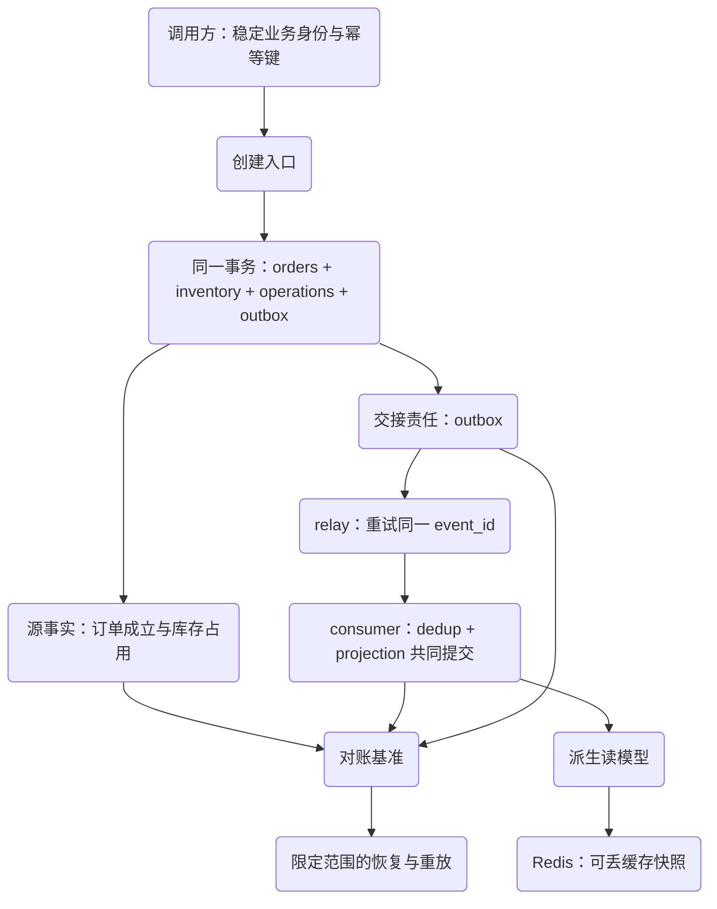
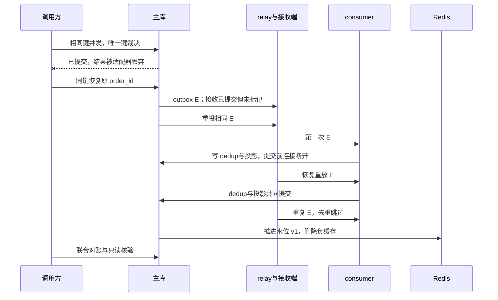
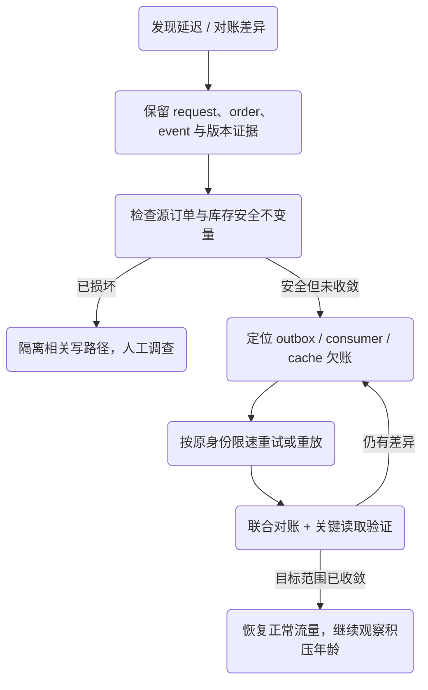

# 一致性恢复演练：订单、库存、事件与读模型如何对账

一次创建请求重复到达，第一次响应又恰好丢失；relay 已经交接事件，却来不及保存确认；消费者处理中断，缓存仍认为订单不存在。每个组件的“重试一下”单独看都很合理，组合起来却可能重复扣库存、漏投影，或一直把旧读结果交给用户。

本文不引入另一套分布式事务百科。我们只用库存不变量、幂等、Outbox 与缓存新鲜度这些已经定义的机制，把这次故障从发现走到恢复，最后回答一个可审查的问题：**谁欠着什么，依据哪些持久事实，可以停止恢复？**

## 进入评审以前，应当已经具备什么

你需要完成[库存不变量](/knowledge/data/transactions/inventory-invariants.html)、[操作幂等](/knowledge/distributed/reliable-interactions/idempotency.html)、[outbox 与消费去重](/knowledge/distributed/events/transactional-outbox.html)、[缓存新鲜度](/knowledge/data/cache/invalidation-freshness.html)。本案例不依赖未来文章，也不要求同时掌握 Spring 与 Go。

[共同实验项目](/examples/data-consistency.zip)的 `bash run.sh d5` 执行两项综合用例：六类故障的单数据集恢复，以及 v1/v2 完整快照兼容。`bash run.sh all` 才是包含各机制正反例的全部二十三项基础用例。只运行恢复案例不能替代各机制的反例验证。

本节实验已在文中所列范围运行；源码下载及历史验证记录见文末附录。


## 1. 先把事实所有权和责任分开

源订单决定“订单是否成立”；库存表决定“还有多少能预留”；operations 保存“这个调用身份得到什么结果”；outbox 保存“哪些已成立事件仍需交接”；消费去重和投影保存“这个消费者已经应用哪些事件”；缓存只是可丢的读取加速。



实验中的缓存场景直接对源订单版本演示机制，图中的投影缓存是常见部署选择。设计时必须选定实际读取源：若缓存由异步投影填充，即使 Redis 完全新鲜，也可能只是“忠实缓存了一份落后的投影”。不能只修缓存而跳过上游传播延迟。

不变量分两组。任何时候都必须成立的安全条件是库存非负、库存守恒、稳定业务订单唯一、已成功订单有对应 outbox、相同消费身份不产生重复 effect。恢复完成时还需成立的收敛条件是应交接事件已被消费、投影版本和内容追上源订单、要求新鲜的读取不再使用旧值。

处理中缺少投影是未完成责任，不必立即当成库存错误。超过承诺延迟后仍缺少，才转化为需要告警和恢复的违约。把安全条件与收敛条件混成一个“最终一致”标签，会让监控既容易误报，也容易漏掉真正的数据损坏。

## 2. 一页 ADR：同步提交什么，异步推进什么

**背景。** 创建订单必须维护本地库存与订单身份；查询投影和缓存可以稍后生成。实验只处理预留，不包含支付、取消、发货、跨仓事务和高可用复制。

**决定。** 创建响应以主库本地提交为界，事务同时写库存、订单、操作结果与 outbox。普通列表使用异步投影，刚创建的详情读取使用源订单或最低版本约束。relay 可重投，消费者将去重与投影一起提交，缓存可删除与重建。

**代价。** 增加 outbox 存储、后台工作、去重保留、投影追赶和对账运维；查询需要表达“已创建但列表仍在更新”。不把数据库连接持有到远程交接完成，也不承诺每一份缓存立刻可见。

**相反方案何时更好。** 在读负载小、查询模型简单、传播延迟不可接受的服务中，直接查询源表、减少异步投影和缓存，可能更简单可靠。若所有写入都在同一数据库且查询能满足容量目标，不必为了套架构图引入消息交接。若真的要求跨系统同步完成，则要重新讨论业务语义和协议，不能把本章局部原子性扩写成全局事务。

ADR 的价值在于留下可推翻的条件。未来测量发现主库读容量充足、异步维护成本过高，应允许删去某个组件；反过来添加组件时，也要为它增加失败与恢复责任。

## 3. 六种故障叠加到同一数据集

综合用例初始 `sku-a` 库存三。两个连接使用相同作用域、幂等键和 business_id；A 先占有操作唯一键，B 确认进入真实锁等待后，A 提交并丢弃返回结果。然后逐步恢复交接、消费和缓存。

| 故障 | 调用方或读者看到什么 | 持久责任在哪里 | 恢复要保持什么 |
| --- | --- | --- | --- |
| 并发重复下单 | 第二次等待同键裁决 | operations / 业务唯一键 | 只有一张订单、一份库存占用 |
| 提交后响应丢失 | 调用方 unknown | 保存的操作结果 | 同键返回原结果，不重新扣减 |
| relay 发布后未标记 | 本地仍显示待交接 | outbox，接收端已留一条 | 重投同一 event_id |
| consumer 提交前中断 | 读模型仍缺失 | 已接收事件，消费事务回滚 | dedup 与副作用一起重做 |
| 缓存保留旧负结果 | 查询显示不存在 | 源订单已存在，失效尚未推进 | 不能因旧缓存再次创建订单 |
| 恢复后再次重放 | 事件再来一遍 | 已提交 dedup / 版本 | effect 不增，投影不倒退 |



这里的丢响应和发布后中断是受控故障适配器；消费提交前由 `KILL CONNECTION` 实现。它验证提交边界，不等于真实 HTTP 链路、进程掉电、broker 复制或 Redis 故障切换。范围写窄，证据才有意义。

## 4. 对账查询必须能发现“局部成功、整体仍坏”

项目 `sql/reconcile.sql` 有五组返回违例的查询：库存守恒；订单缺少对应版本 outbox；同事件 effect 重复；outbox 缺少目标消费者 dedup；源订单与投影的版本/数量/状态不一致。

其中库存守恒以每个 SKU 聚合；订单/outbox 匹配同时使用订单身份与版本；投影比较不只数行。不能把 `COUNT(orders)=COUNT(projection)` 当作内容一致的充分条件，两边完全可能各缺一张不同订单。

```sql
SELECT o.order_id, o.version, p.version AS projected_version
FROM orders o
LEFT JOIN order_projection p ON p.order_id=o.order_id
WHERE p.order_id IS NULL OR p.version<>o.version
   OR p.quantity<>o.quantity OR p.state<>o.state;
```

下面是综合演练最终核验的聚焦片段。预期一张订单、两次交付、一次 effect、库存二，并且五组查询都没有剩余差异。显式检查不会因 Python 优化选项而被删除；执行入口也拒绝优化模式。

```python steps
# !step(1:2) 先确认全套对账没有剩余违例，再重放所有已接收事件；每条都应被识别为重复。
# !step(3:4) 检查真实副作用记录和库存，不能只看消费者返回 duplicate。
# !step(5:7) 独立查询订单与交付数量，证明重复停留在交接层，没有变成第二个业务订单。
require(not any(self.reconcile().values()))
for receipt in receipts: require(self.consume(receipt) == "duplicate")
require(self.scalar("SELECT COUNT(*) FROM effect_log") == "1")
require(self.scalar("SELECT available FROM inventory WHERE sku='sku-a'") == "2")
orders = int(self.scalar("SELECT COUNT(*) FROM orders"))
deliveries = int(self.scalar("SELECT COUNT(*) FROM delivery_receipts"))
require(orders == 1 and deliveries == 2)
```

数据库对账不能单独证明所有缓存都新鲜，所以演练还检查本次订单缓存水位、拒绝旧负值回填，并成功填入新版本。对账也不能发现测试从未描述的业务规则；如果加入订单取消，就必须扩展状态模型、守恒式与事件合同。

## 5. 恢复运行手册：先定位责任，再执行有限动作



第一步是缩小目标集合：哪个订单、哪段版本、哪个消费者、哪个部署版本受到影响。保留请求/操作标识、event_id、attempt、connection ID、投影版本和失效时间；不用生产客户载荷作为公开证据。

第二步按事实决定动作。源订单成立且 outbox 待发时恢复 relay；事件已交接但消费失败时修复消费者并重放原事件；仅缓存陈旧则推进水位或删除已知缓存。源库存守恒已损坏时，不能靠盲目重投继续写；要暂停相关范围、调查原始事务和审计，再经过业务确认做修正。

第三步限制恢复流量。为重放设最大并发、批量、单次总预算与停止条件，观察在线请求延迟、连接池等待和数据库负载。不要把历史积压一次灌进恢复中的系统；“重试次数越多越努力”不是恢复目标。

第四步核验结束条件：目标事件已完成、违例查询清空、关键读取符合合同、最老积压年龄开始下降，且没有把故障转移到别的消费者。服务进程启动成功、日志没有红字、某个 sent 字段变一，都不足以替代这些检查。

## 6. SLO、报警与回滚必须有边界

可以为设计评审提出“正常可用条件下绝大多数投影在数秒内追平”的目标，但必须同时给出测量起止点与故障排除条件。本项目没有负载数据，不提供虚构的 p99、QPS 或线上 SLO 达标率。

实际需要区分创建成功率、未知结果恢复率、最老未交接年龄、消费滞后、隔离消息数、投影差异数、缓存版本落后与回源并发。安全不变量出现非零差异应立即调查；短暂传播落后则按业务允许窗口和增长趋势告警。用平均延迟掩盖少数永久卡住的订单不合格。

发布回滚也不等于数据回滚。新 producer 已写入的事件不会因代码回滚自动变旧；删掉 outbox、幂等记录或去重表更不是“恢复干净状态”。必须确认旧消费者仍能读取已产生的数据，保留接管者与重放身份，并让回滚脚本只处理有明确定义的范围。实验清理会删除本次隔离容器，不是生产恢复方法。

## 7. 一个具体迁移：给完整快照增加可选原因字段

v1 事件包含 `schema_version、order_id、quantity、state、version`。v2 增加 `state_reason`，含义是状态原因，原字段语义保持不变。迁移顺序是先部署同时理解 v1/v2 的消费者，再允许 producer 写 v2；先观察后停旧 producer，保留旧消息可重放的期限。

`D5.schema_v2_backwards_compatible_snapshot` 使用受控接收端投递 v2，再投递更旧的 v1。消费者接受两个格式，但只有较新 aggregate version 更新投影，所以最终仍为版本二。两个不同事件身份各产生一条本地审计记录；再次重放 v2 必须跳过。v2 事件是直接插入接收表的解码夹具，源订单仍为 v1；这个 case 不执行完整联合对账，也不证明 source→outbox→consumer 的全链迁移一致性。它只覆盖解码、完整快照乱序与去重，不代表线上滚动发布已验证，也不能证明增量事件可以丢弃旧步骤。

如果重建读模型，优先写入隔离的新投影，再比较内容和版本，完成后切换读取。新重建任务可以有独立消费命名空间，但不得连带执行收费、发货等外部副作用。直接清空线上 dedup 然后重放历史事件，会把旧事件重新赋予执行权；在混合消费者里尤其危险。完整快照投影能否重建与某个外部动作能否再执行，是两份不同合同。

综合机制来源仍是各知识主题明确的边界：[MySQL 8.4 的本地事务提交](https://dev.mysql.com/doc/refman/8.4/en/commit.html)、[唯一约束](https://dev.mysql.com/doc/refman/8.4/en/constraint-primary-key.html)与 [Redis 脚本原子执行](https://redis.io/docs/latest/develop/programmability/eval-intro/)。联合恢复流程和 ADR 是基于这些机制设计的实验合同，不是这些产品提供的跨系统保证。

## 8. 最终评审：交付证据，而不是保证职级

**修复题。** 给你一份“outbox 全部 sent=1、消费者日志无异常”的恢复报告，请补出能反驳它的两种持久状态和查询。参考方向：已确认交接但消费尚未发生；dedup 单独提交却无投影。答案必须落到表、键和版本，不能只说“多看监控”。

**设计答辩。** 提交一页 ADR、六故障矩阵、对账 SQL、限速重放手册、SLO/报警设计、迁移与回滚约束。再提出一个更简单的替代方案，并说明何时应删去缓存或异步投影。评分看不变量是否可检查、未知结果是否有恢复入口、外部边界是否诚实、失败反例能否识别错误实现，以及容量与人工介入是否清楚。

**运行验收。** 记录精确镜像身份、环境版本、源文件 SHA-256、运行命令、全部 case 名称、退出码、原始 trace 与清理结果。源代码压缩包不包含私有证据、令牌或内部路径。未来重跑若未执行真实服务或只跑部分章节，必须如实记录；本次的受控接收替身也始终不等于真实 broker，不能靠一个绿色徽章抹掉这些范围差异。

走完这条路径的产物，是一份能预测、能反证、能诊断、能恢复、能接受他人评审的设计。它是高级工程工作的训练方向，不是读完即可获得某个职级的承诺；当系统出现本章范围外的复制、跨库或外部副作用时，下一步应是扩展合同与证据，而不是扩大已有结论。


<details class="verification-appendix">
<summary>实验附录：运行方法、历史记录与未覆盖范围</summary>

本案例两项综合用例与各机制反例合计二十三项均已通过真实 MySQL 8.4.7 + Redis 7.4.7 CI，并完成原始证据复核。范围是单节点服务、受控 MySQL 接收替身与完整快照迁移夹具，不包含生产可靠性或真实 broker 保证。 绑定 [CI run 36991587537](https://github.com/weilhuang/wiki/actions/runs/36991587537)，精确源码、镜像身份、二十三项结果与已核验警告见[持久验证摘要](/examples/data-consistency-verification.json)。这是一次有界实验通过，不是压力、复制、故障切换或外部副作用认证。

下载包保留源码冻结时的 `README` / `RESULT-CONTRACT`，其中的 **NOT_RUN 是历史状态**。冻结源码随后完成了这次 CI；包内文件与 ZIP 没有因状态更新而修改。请结合本摘要阅读，不要把包内旧说明当作当前结果，也不要把真实 CI 的结果外推到未测范围。

本次实际执行的是 PR 合并快照 `c88fcd0096e16c94775b03b0926ecd04c8136acb`；它与 PR head 是不同身份，完整绑定见摘要。运行、日志采集、容器清单和精确项目清理均以零退出码完成。三项主动 `KILL CONNECTION` 用例在随后关闭阶段各产生一次约二十五秒的等待上限警告，已逐条与断线、回滚结果和恢复数据核对；这是约七十五秒的清理路径开销，不是“完全无警告”，也不能据此忽略未来其他关闭错误。

</details>
