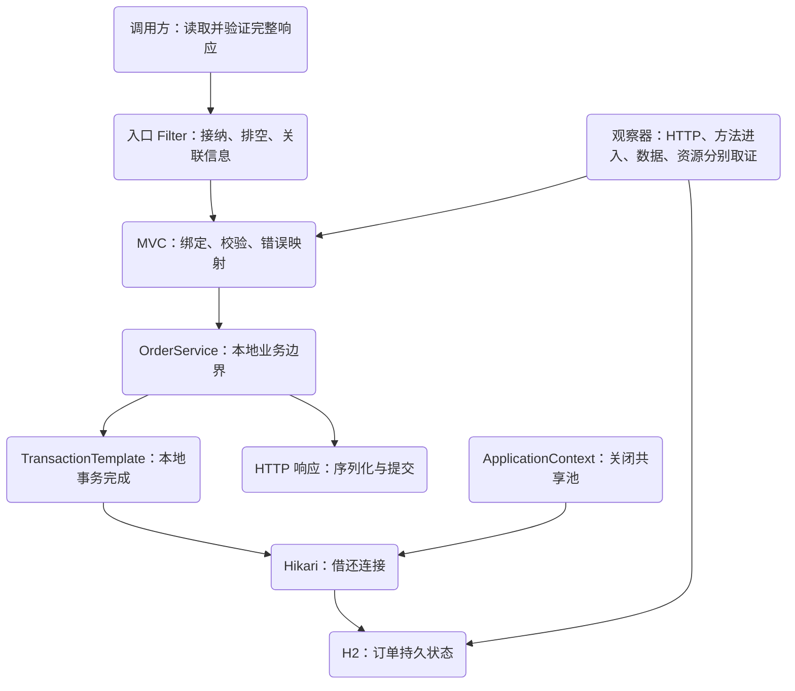
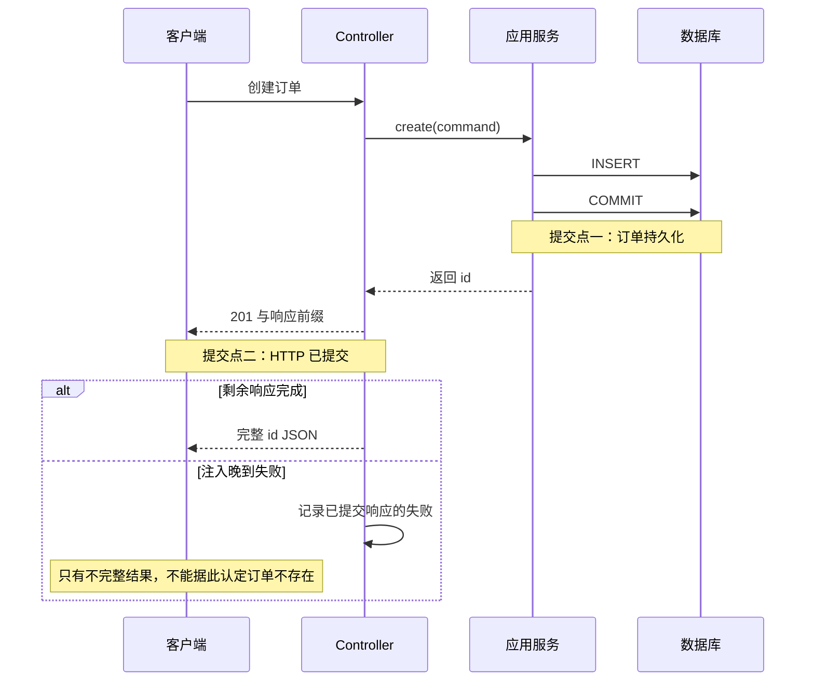
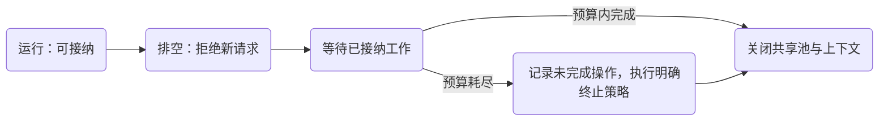

# 订单服务评审：把对象、HTTP、事务和资源合同接起来

现在有一个能创建订单的接口：输入验证、事务、异常处理和连接池都配置好了。它是否已经可靠？不能靠配置项数量判断。需要把一个失败放进系统里，看每一层留下了什么，再检查这些结果是否符合对调用方的承诺。

这是一个跨机制的综合案例。相关主题分别回答对象归谁管理、HTTP 如何完成、事务如何生效、连接为什么被占住；这里把答案接起来，产物是一份别人能复核的设计与证据包。

## 评审入口与验收边界

先完成[对象所有权](/knowledge/frameworks/spring-container/bean-lifecycle.html)、[MVC 完成链](/knowledge/frameworks/spring-mvc/request-pipeline.html)、[事务代理](/knowledge/frameworks/spring-transactions/proxy-call-chain.html)和[连接预算](/knowledge/frameworks/data-access/connection-budget.html)。无需先学习消息或分布式事务，这个本地服务评审可以独立完成；遇到跨进程未知结果，应明确标记合同缺口，而不是用没学过的组件名掩盖它。

使用[同一个实验项目](/examples/spring-service-boundaries.zip)：

```sh
gradle run --args=all
```

本轮四组生命周期、五组资源场景和八条 HTTP 请求的断言已运行通过；源码入口、固定版本、运行记录和指纹随包提供。这里的服务运行在本机真实 Tomcat 上，数据库为 H2；六类故障都在这个范围内检查。它没有商品目录、支付、真实库存、用户身份或消息系统，因此不能把测试通过描述成“生产订单系统已完成”。

## 1. 先写合同，再选注解

本地创建合同可以写成四句话：

1. 只有合法的 sku 与正数量才能进入创建方法；输入失败不产生订单
2. 一次应用服务调用中的订单写入在声明的本地事务里完成；提交前业务拒绝不留部分记录
3. 201 与完整 id 响应表示本次接口成功完成；响应缺失或不完整时不能仅凭客户端感受推断数据库结果
4. 进入排空阶段后拒绝新工作；已接纳工作按明确上限完成，之后再关闭其共享资源

第三句不是“只要数据库提交就一定把成功送给客户端”。两个系统之间无法通过一次本地 SQL 提交消除网络窗口。当前实验没有操作查询键，客户端遇到未知结果时无法安全自动重试，这必须作为已知限制写进评审结论。



领域不变量也要与示例范围一致。当前表只存订单 id、sku、quantity；它不维护“库存不为负”，因为没有库存表。若评审要求防超卖，就必须补 schema、并发条件更新或锁策略以及真实目标数据库实验，不能从这里的单表事务推出库存正确性。

## 2. 对比两个设计，而不是只交一个正确答案

方案甲让 Controller 开启事务，然后执行远程检查、保存订单、生成响应。好处是初看路径集中、调用少；问题是 HTTP 细节与数据库边界绑在一起，外部等待占住连接，响应写失败也容易被误读成事务失败。Controller 如果 `catch` 后返回正常对象，还可能改变原本希望传播到事务边界的异常。

方案乙让 Controller 负责 HTTP 适配，应用服务用短事务完成本地写入，响应构建在事务返回之后。好处是业务边界可从其他入口复用，资源持有更短，失败证据更容易分层；代价是必须明确处理“已经提交但响应没有完整送达”。该窗口在方案甲中也不会神奇消失，只是更容易被长方法隐藏。

```java steps
// !step(1:3) 进入应用服务后显式建立本地事务；本例用模板使边界在代码中可见，并不否定声明式事务。
// !step(4:5) 本地 SQL 和提交前业务拒绝处于同一边界；测试在拒绝后独立查询数据库。
// !step(6:8) execute 返回意味着本地完成路径已结束，之后 Controller 才构建响应；不要把 HTTP 成功等同于这一步。
// !focus(3:7)
String create(CreateOrder command) {
    return tx.execute(status -> {
        String id = UUID.randomUUID().toString();
        jdbc.update("insert into orders(id, sku, quantity) values (?, ?, ?)", id, command.sku(), command.quantity());
        if (command.sku().equals("FAIL")) throw new DomainFailure();
        return id;
    });
}
```

这里的 `FAIL` 是明确标出的测试故障开关，不是商品命名规则。程序化事务减少了本实验对代理入口的额外配置；如果换成跨 Bean 的声明式事务，应保留[事务主文](/knowledge/frameworks/spring-transactions/proxy-call-chain.html)的代理入口与回滚规则回归。换一种写法不能成为删除原断言的理由。

什么时候方案甲更合理？对于非常小、没有外部等待的单进程内部工具，把编排保留在一个入口可能更省维护成本。即便如此，仍要把事务提交和响应提交分开解释，并保留测试。评审不是强迫所有小应用套多层目录，而是要求复杂度与风险相匹配。

## 3. 两个提交点之间，失败不会消失



实验的晚到失败在 `flushBuffer()` 之后注入，专用异常解析器确认响应已经提交，再保留前缀和诊断。数据库独立查询得到新增订单；客户端拿到 201，但 JSON 只有 `{"id":`。这是一个很小却足够有力的反例：任何“HTTP 有错误就一定没有写入”的判断都会被它推翻。

这个案例要求读者能识别该窗口、禁止盲目重试，并提出操作查询或幂等合同。完整实现可继续读[未知结果下的幂等](/knowledge/distributed/reliable-interactions/idempotency.html)。数据库和事件还存在另一个交接窗口，见[数据库与事件交接](/knowledge/distributed/events/transactional-outbox.html)。本章没有消息发送，不声称已经验证跨服务一致性。

## 4. 六类故障必须同时检查三份证据

每个场景既记录也断言：HTTP 状态、媒体类型与完整 DTO/精确错误 code；Controller 进入增量和处理链事件的存在、次数、顺序与缺失；结束后的数据库内容。成功响应 id 必须对应独立查询得到的唯一新增行，且 sku、quantity 与请求相符；早期拒绝和业务回滚比较完整行快照。资源实验另记池状态和关闭结果。我们比较的是**一次操作的增量**，不是假设每次都在空数据库开始。

| 故障类别与注入点 | HTTP 可观察结果 | 数据增量 | 关键独立证据 |
| --- | --- | ---: | --- |
| 正常创建 | 201，完整 id | +1 | 方法进入 1，服务提交事件 |
| 绑定/校验失败 | 400 | 0 | 方法进入 0，但拦截器 pre 已执行 |
| 业务异常，插入后提交前 | 409 | 0 | 方法进入 1，缺少服务提交事件 |
| 池中唯一连接被测试持有 | 503 | 0 | Controller 已进入，借连接失败，无 SQL 成果 |
| 数据库提交后、响应开始后失败 | 201，不完整 JSON | +1 | isCommitted 为 true，晚到解析记录 |
| 排空中到来的新请求 | 503，draining | 0 | 在 Filter 返回，未进入 MVC 方法 |

排空场景还配一个对照：先接纳一条慢请求，让它停在事务之前；切换接纳状态后，新请求被拒绝；释放旧请求，它仍完成 201 和一次写入。这样验证的是“新旧工作有区分”，而不只是看关闭方法是否返回。

哪些证据不够？一个 500 不能证明回滚；一条 `commit` 日志不能证明客户端读到了结果；线程数下降不能证明资源都已关闭；服务进程退出不能证明未完成操作安全重试。评审时应先指出这些推理跳跃，再要求最小新增证据，而不是补更多概念图。

### 本轮基线观察

完整运行应依次得到：正常创建后总行数 1；非法输入、业务拒绝和连接耗尽后仍为 1；晚到响应故障后为 2；排空新请求不改变它，已接纳请求完成后为 3。最后断言池已关闭。修订后的回归还运行三个真实源码变异：把成功体写坏、把错误 code 改成 success、取消消费者销毁回调，要求它们分别因完整响应、错误合同和缺失销毁事件而失败。不能把“测试运行过”替代为“错误实现会被测试抓住”。不同运行的订单 UUID 可以不同，因果顺序与增量合同不能变。

## 5. 关闭责任需要单独评审



```java steps
// !step(1:2) 首先确保慢请求已被接纳，避免只测试到两个都被拒绝的情况。
// !step(3:4) 切换入口状态后发新请求；完整测试随后断言精确 draining 错误、进入次数不增加且数据不变。
// !step(5:6) 这里只展示释放和等待旧请求；完整测试随后校验返回 id 对应新增行，并在 finally 关闭 context、断言池已关闭。
// !mark(3:3)
var inflight = client.sendAsync(request(base, "drain-inflight", json("SLOW", 1)), HttpResponse.BodyHandlers.ofString());
PoolLab.await(state.slowEntered);
state.accepting.set(false);
var rejected = client.send(request(base, "drain-new", json("BOOK", 1)), HttpResponse.BodyHandlers.ofString());
state.slowRelease.countDown();
var finished = inflight.get(5, TimeUnit.SECONDS);
```

这段是应用接纳与排空协议的最小实验。它随后正常关闭 context 并检查池关闭；**没有**向独立 JVM 发 SIGTERM，也没有证明容器编排平台摘流、负载均衡连接和所有后台任务都已排空。虽然示例设置了 Boot graceful shutdown，配置存在不是进程信号测试证据。[Boot 优雅停机说明](https://docs.spring.io/spring-boot/3.5/reference/web/graceful-shutdown.html)应与部署平台合同一起核对。

生产实现还需要同步“检查是否接纳”和“登记已接纳工作”的竞态；单独的 AtomicBoolean 只能表达本实验被 latch 固定的顺序。若允许后台任务，必须登记、等待并定义超期策略。容器拥有连接池，应用服务借用它；不能先关池再让在途事务尝试提交。

## 6. 一页 ADR：本地订单创建边界

| 项目 | 本次决策 |
| --- | --- |
| 问题 | 在明确输入与本地写入合同下控制连接占用，区分业务失败和响应未知 |
| 选择 | MVC 适配输入/错误；应用服务短事务；事务返回后构建响应 |
| 资源责任 | context 关闭共享池；每次 JDBC 使用遵循 Spring 资源接入；应用入口负责接纳与排空 |
| 接受的成本 | 更多可观察边界；需要单独处理提交后响应失败；故障测试比只测成功更复杂 |
| 放弃的简化 | 不在 Controller 长事务中包入远程等待；不根据任意客户端错误盲目重试 |
| 当前缺口 | 无身份/库存/幂等查询/消息交接；无真实数据库锁、网络故障与进程信号证据 |
| 复审条件 | 引入独立事务、后台任务、远程调用、流式响应或多实例写入时重新评审 |

这是一份局部决策，而不是通用架构模板。若需求改变为“必须在接口返回前完成第三方支付”，需要重新定义未知结果、补偿与对账。不能只把支付调用放进现有事务，期待本地数据库替远端撤销副作用。

## 7. 观测、回归与部署清单

观测字段建议分层保留：operation/request ID、handler、输入校验结果、事务结果、池等待与连接持有时长、响应是否已提交、响应完成状态、故障点和关闭阶段。不要记录完整请求中的隐私字段、认证头或数据库凭据。ID 进入日志/追踪；指标标签只保留有界分类。

回归至少覆盖：合法与非法输入；提交前异常；池耗尽；提交后响应缺失；排空中新旧请求；初始化部分失败；prototype 清理；跨线程副作用；超时发现位置。更换事务写法、升级框架、添加 Advice 或 Filter 顺序调整，都应重跑相关合同，而不是只验证“服务能启动”。

部署时先检查实际解析版本与配置值，再验证新版本对旧调用方错误合同的兼容性。回退应用代码不等于回退已经提交的数据；若改 schema，必须单列兼容策略和数据迁移责任。本实验没有 schema 迁移流程，不应给出未经测试的一键回滚承诺。

### 综合练习：提交可复查的评审包

要求提交四项：一页 ADR；含六类故障的矩阵；至少一份失败日志与修复后日志；一张标明资源所有者、数据库提交点和响应提交点的图。再提出一个与本文不同的合理方案，并说明在什么规模或约束下它更简单。

参考评分：合同清晰 25 分；失败证据 30 分；资源与关闭责任 20 分；替代方案和演进成本 15 分；版本与可复跑性 10 分。以下为硬性不通过：把 HTTP 错误等同于回滚、把 H2 结果推广为 MySQL 锁行为、把测试开关当生产 API、或用不存在的运行证据宣称通过。

加分不是堆组件。更有价值的答案会指出当前接纳布尔值的并发缺口、晚到失败缺少操作查询键、幂等保留期带来的数据增长，以及某种场景完全不应自动重试。能清楚说出“这个证据只能证明到这里”，也是服务设计能力。

## 来源与下一步

本案例复用容器、MVC、事务与连接预算的固定版本机制，并由 `HttpLab` 的真实回环场景组合验证。源码审查入口为 [DispatcherServlet v6.2.19](https://github.com/spring-projects/spring-framework/blob/v6.2.19/spring-webmvc/src/main/java/org/springframework/web/servlet/DispatcherServlet.java)、[TransactionTemplate v6.2.19](https://github.com/spring-projects/spring-framework/blob/v6.2.19/spring-tx/src/main/java/org/springframework/transaction/support/TransactionTemplate.java)和 [Boot WebServerGracefulShutdownLifecycle v3.5.16](https://github.com/spring-projects/spring-boot/blob/v3.5.16/spring-boot-project/spring-boot/src/main/java/org/springframework/boot/web/context/WebServerGracefulShutdownLifecycle.java)。最后一项用于理解后续进程测试需要覆盖的生命周期，并非已执行该源码全部分支。

完成这份评审后，得到的是一套能解释、验证和诊断本地服务边界的方法。进入更复杂的架构时，把同样的问题继续问下去：哪个状态已经持久化，哪个参与者仍可能失败，谁负责发现、恢复和结束资源。
