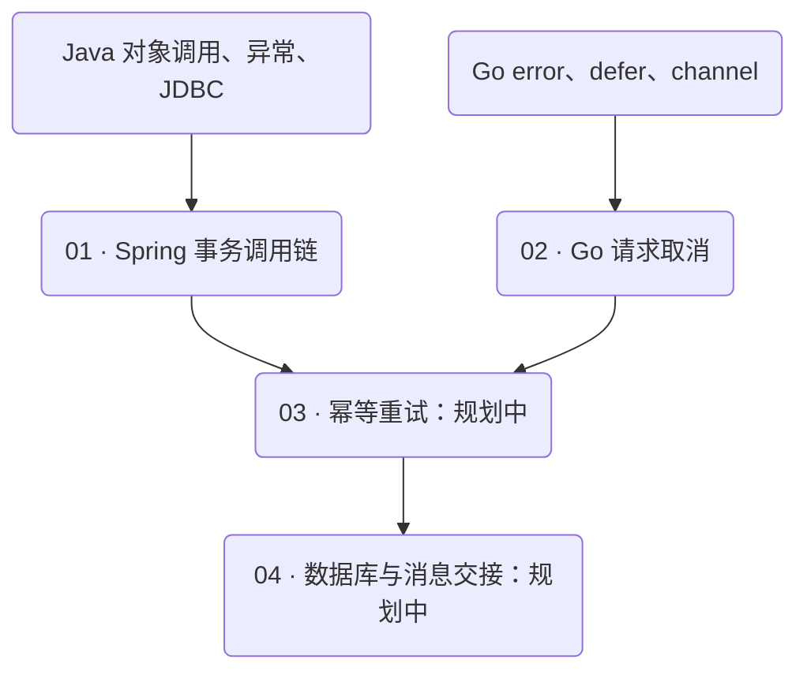

# 后端知识地图与阅读路径

这里沿着一次请求组织后端知识：代码如何执行，框架如何接管，数据在哪里提交，跨进程以后会发生哪些失败，最后怎样通过证据定位问题。

目前有两篇可阅读文章。第一篇已经展开为带完整实验的系统章节；其他专题在下文明确标为规划，不用空页面充当完成进度。

## 正在写的系列：请求失败以后，数据怎么样了

主线从单进程事务走向请求取消，再延伸到重试和消息。每一步都先问“已经做完了什么”，再讨论补救方式。

| 章节 | 核心问题 | 先修 | 阅读状态 |
| --- | --- | --- | --- |
| 01 · Spring 事务调用链 | 注解在哪里生效，哪些 SQL 共用同一事务？ | Bean、Java 异常、提交与回滚 | [阅读章节](/blog/spring-transaction-proxy)，含十场景完整实验 |
| 02 · Go 请求取消 | 调用方不再等待时，已经写入的数据怎么办？ | 函数、error、defer、channel | [阅读文章](/blog/go-context-cancellation)，含取消时序示例 |
| 03 · 超时后的幂等重试 | 上一次结果未知，怎样避免再做一遍？ | 前两章、唯一约束、并发请求 | 规划中 |
| 04 · 数据库与消息的交接 | 数据已经提交，消息还没发出怎么办？ | 本地事务、消息确认与重投 | 规划中 |

先读 01 或 02 都可以，两篇不要求精通另一门语言。需要比较时，再回到共同问题：事务管理的是一组数据操作，取消信号管理的是工作生命周期，响应结果还受网络影响。它们之间的关系要靠明确的执行顺序建立。

下面这张图只表达依赖，不代表每个节点都已有文章。虚线节点是后续专题。

Spring 读者可以从代理和数据库连接入手；Go 读者可以先弄清父子 context。两条路径最终都会遇到“客户端没拿到成功响应，服务端却可能已经做完”的问题，再进入幂等和跨服务协作就有了具体背景。

## 按手头的问题找入口

### 方法抛异常，数据却留在表里

读 [Spring 章节的直接调用与自调用部分](/blog/spring-transaction-proxy#call-paths)。先画出谁持有代理、谁在调用 `this`，再确认 SQL 用的连接。不要先把所有方法都改成独立事务。

实验中最值得对照的三行是 `direct`、`self` 和 `self-catch`：看似相近的 Java 控制流，对应不同的代理边界。先预测最终行，再运行验证。

### 已经 catch，为什么还有 UnexpectedRollbackException

直接读 [共享事务与回滚标记](/blog/spring-transaction-proxy#shared-rollback)。重点是异常在被业务代码捕获以前，有没有先经过内层代理。读完要能区分“标记只能回滚”和“数据库已经执行回滚”。

### 请求超时，后台还在执行

从 [Go context 取消](/blog/go-context-cancellation)开始。把父 context、下游调用、取消观察点和数据提交点标到一条时间线上，再检查这几个时刻谁先谁后。

如果操作不能及时响应取消，另开 goroutine 只改变了等待方式，资源和副作用仍需要有人负责。重试之前先确认上一笔结果如何查询。

## 五层知识放在什么位置

这五层是整理内容的坐标，不要求从第一层全部读完才能做项目。缺哪一层，就补会影响当前判断的那一部分。

### 基础：能解释一段代码的执行结果

要能跟随异常或 error 找到处理者，分清共享状态与局部状态，理解资源何时获取和释放。数据库先掌握提交、回滚、唯一约束、索引与锁的基本含义。

后续基础专题会优先补线程与 goroutine 的生命周期、HTTP 请求与连接、JDBC 连接和事务。验证方式尽量小：一个程序、一个明确时序、一个能够反驳错误猜测的结果。

### 框架与中间件：知道规则在哪里真正执行

当前的 Spring 与 Go 文章都在这一层。后续规划包括 MySQL 执行计划与锁等待、Redis 热点与缓存更新、Kafka/RocketMQ 的确认与消费状态。

这些专题会分别给出版本与使用条件。确认点、锁粒度、数据可见性需要按具体实现检查，不能把一种产品的行为直接套到另一种产品上。

### 分布式与云：给未知结果留出处理路径

先修是本地事务、并发、一次 RPC 或消息调用。规划中的主题包括超时预算、重试放大、幂等、持久化任务、优雅停机和 Kubernetes 生命周期。

每篇会选择一个故障边界来验证：请求已经执行但响应丢失、消费者处理后重启、服务退出时仍有请求执行。只看到进程启动或健康检查通过，不能证明这些路径正确。

### 可观测性与身份安全：沿证据定位，也检查权限边界

先修是服务调用链与 HTTP。规划将从延迟、错误率、日志关联、链路断点入手，再进入令牌校验、授权决策和服务间信任。

希望读者能从一条失败请求找到具体依赖，并说明为何排除另一种解释。权限测试同时覆盖允许和拒绝路径；调试日志不能以泄露令牌和个人数据为代价。

### 工程实践：让别人能复查这个结论

这一层贯穿所有章节：依赖版本是否固定，示例能否独立运行，测试是否替业务补上了不该存在的条件，线上结论是否超出了实验范围。

每篇的源码和实验只是起点。修改一个条件，例如入口、线程、传播方式或数据库，再观察结果是否按预测变化。能够说明“换了什么，所以哪里变了”，比记住某张结论表更有用。
