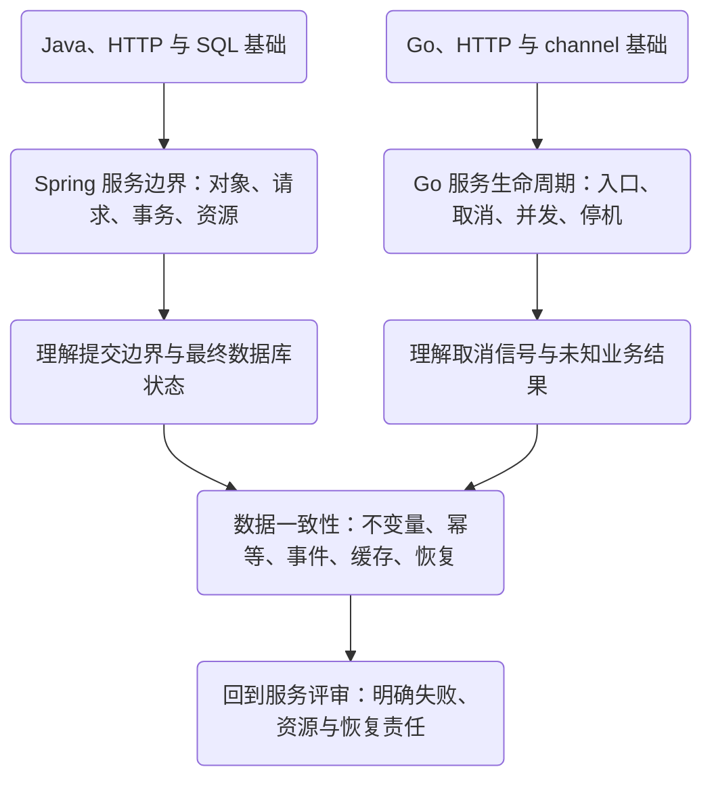

# 后端工程知识地图

后端知识不适合只按框架名称排列。同一次请求会经过对象、线程或协程、网络、连接、事务和持久状态；故障经常发生在两层交接处。先认清每层负责什么，再决定需要深入哪个实现。

## 首批路径的先修关系

Java 与 Go 是两条可选入口；事务/提交边界是进入数据一致性的共同基础。图中箭头表示理解上的依赖，不表示必须先完成全部语言课程。

- [Spring 服务边界](/learn/spring-service-boundaries/)：适合从 Java 服务进入，沿容器、MVC、事务和连接解释请求结果
- [Go 服务生命周期](/learn/go-service-lifecycle/)：适合从 Go 服务进入，沿入口、工作所有权和进程退出解释收尾责任
- [数据一致性](/learn/data-consistency/)：把调用失败放回持久状态，处理重试、交接、缓存和恢复

## 九个主题怎样分工

“当前入口”表示已经展开的局部知识，不代表整行领域都有完整课程。没有链接的内容属于[后续规划](/guide/roadmap)。

| 主题 | 需要先理解什么 | 当前入口与能检查的产物 | 尚未展开 |
| --- | --- | --- | --- |
| 运行时与并发 | 函数、内存和阻塞 | [Go 所有权](/learn/go-service-lifecycle/bounded-concurrency-ownership)：并发上界、退出与 join 证据 | JVM/GC/JMM、Go 调度和内存模型专题 |
| 应用框架与服务边界 | 对象、异常、HTTP | [Spring 路径](/learn/spring-service-boundaries/)：生命周期和请求失败矩阵 | 框架扩展点、完整数据访问生态 |
| 数据存储与一致性 | SQL、唯一约束、事务 | [数据路径](/learn/data-consistency/)：不变量、交错反例和对账 | 索引优化、备份恢复、存储选型 |
| 消息与事件系统 | 本地提交、重复与恢复 | [outbox 与去重](/learn/data-consistency/outbox-consumer-dedup)：崩溃点和持久状态表 | 真实 Kafka/RocketMQ、分区、顺序、offset |
| 分布式系统 | 失败不确定性、网络时延 | [幂等](/learn/data-consistency/idempotency-unknown-outcomes)与[调用预算](/learn/go-service-lifecycle/http-client-budgets)：重试合同和放大上限 | 复制、共识、跨服务任务和治理 |
| 云原生与交付 | 进程、连接、关闭责任 | [Go 停机](/learn/go-service-lifecycle/graceful-shutdown-review)：本机进程运行手册 | 容器网络、Kubernetes、发布和容量 |
| 可观测性与性能 | 时间线、资源队列、业务状态 | [连接预算](/learn/spring-service-boundaries/connection-budget-timeouts)：等待证据和修复对照 | 指标体系、追踪、profile、压测与 SLO |
| 身份与安全 | 信任边界、输入与数据分类 | 本批只标识入口信任边界和日志脱敏责任 | 认证、授权、服务身份、密钥与威胁建模 |
| 架构与工程方法 | 需求、不变量和失败证据 | 三条路径的终章：ADR、失败矩阵和回归计划 | 系统演进、组织约束、成本与迁移专题 |

## 从理解到评审

同一个知识点需要在不同层面接受检验。能解释一个成功例子，是起点；能指出结论什么时候失效，才有条件做设计。

| 能力 | 用什么证明 |
| --- | --- |
| 解释 | 运行前预测调用顺序、状态和资源变化，并注明前提 |
| 验证 | 用最小实验区分两个解释，保留一个错误实现作为反例 |
| 诊断 | 根据观察排除假设，再选择下一项验证；修复后回归 |
| 设计 | 维护不变量，比较至少两个方案，交代延迟、容量、失败和恢复成本 |
| 评审 | 找出缺失证据与隐含前提，给出可执行的补证和演进计划 |

这些产物用于检验理解，不保证职位或职级。每章的机制练习与设计评审题，都应回到实际代码、图中的状态变化和实验范围。[实验与评审](/guide/practice)给出具体例子。
