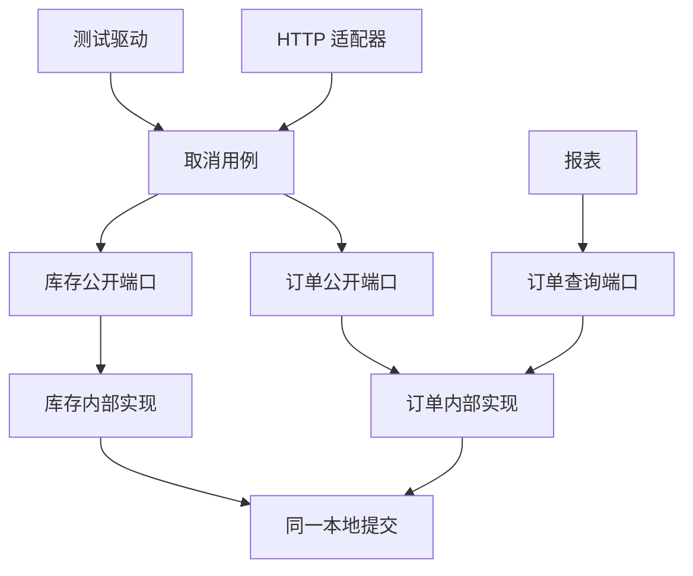

# 模块边界如何抵抗变化：依赖、数据与测试

取消订单原来只改一个状态。现在规则变成：只有当前所有者或有效的单订单客服授权可以取消；取消完成时库存预留必须已经释放。需要改几个地方，才算边界设计得好？

答案不是“只改一个文件”。身份、订单规则、库存事实和返回语义本来就是不同责任。更有用的判断是：**哪些修改是这条需求必然要求的，哪些只是内部表示泄漏造成的；修改后，又由什么检查证明这些责任仍然相容。**

再加两个变化：把订单列表换成专用查询，把大导出移出在线请求。三次变化碰到的边界不同。目录、接口、数据库和进程各能限制一部分牵连，却不能互相代替。本页建立比较方法；[订单演进评审](/cases/orders/reliability-review.html)把方法填成具体决定。

## 1. 先画清四种边界 {#four-boundaries}

| 边界 | 约束谁 | 取消订单时要问什么 | 常见误判 |
| --- | --- | --- | --- |
| 代码依赖 | 哪个模块可引用哪些类型 | 协调层调用库存公开能力，还是直接拿内部仓储 | 文件夹不同就互不耦合 |
| 数据所有权 | 谁解释并修改权威事实 | 谁能释放预留，谁判断订单已取消 | 同一个数据库就谁都能写 |
| 事务 | 哪些结果共同提交、共同失败 | 订单状态和预留是否一同成立 | 两个方法都标事务就共同提交 |
| 部署与运行 | 哪些组件独立发布、占资源、失败 | 导出是否仍耗尽同一连接池 | 多一个进程就有独立容量 |

订单、库存两个模块可以共享一个部署和一次本地事务；订单服务、报表服务也可能仍共享一个被无上限扫描压垮的数据库。边界可能重合，也可能不重合，不能只按进程数判断好坏。

“拥有数据”包含定义含义、控制合法写入、提供恢复依据三项责任。订单模块拥有订单状态，库存模块拥有预留是否有效。协调者可以安排公开动作共同进入事务，但不能因此随意写两个模块的内部字段。



箭头是允许的调用方向，底部才是提交边界。实现端口不代表自动加入同一事务；连接、传播方式及实际代理入口仍要核对。

## 2. 四种组织方式解决不同问题 {#choices}

### 分层：让一次请求容易追踪

简单后台可从三层开始：HTTP处理输入输出，用例层做权限与业务协调，数据层执行查询和写入。调用顺序短，事务范围集中，适合业务简单、适配器少、团队共用发布节奏的阶段。

容易出现的裂缝是横向大杂烩：所有用例共用一个万能Service，所有表都放进公共Repository目录。任一业务都能拿另一业务的实体，一次订单字段改名就牵动导出、消息、接口返回和测试夹具。这是内部表示外泄，不是层数不够。

先按orders、inventory、reports划分业务，再在各自内部保留必要层次，往往比新增统一manager层更直接。不必把每个getter都抽接口；没有稳定语义、没有实际替换或验证需求的接口，可能只是多一个跳转位置。

### 端口与适配器：把变化留在外部接缝

端口是一场有目的的业务交谈，例如“按期望版本取消订单并返回确定结果”，不是“执行任意SQL”。HTTP、批处理、数据库适配器负责在各自表示与业务语义之间翻译。用例依赖需要的能力，具体实现适配该能力。[Cockburn的2005年原文](https://alistair.cockburn.us/hexagonal-architecture)强调内外分离与可替换测试驱动，不要求恰好六个接口。

运行调用和源码依赖不同：用例运行时调用存储实现，源码只依赖端口；SQL实现反过来依赖端口定义。HTTP字段改名可止于入站适配器，SQL列名改动可止于出站适配器。取消资格变化仍会改用例，这是应该发生的业务变化。

代价是端口契约、DTO映射、错误分类与适配器测试。若端口原样暴露ORM实体、连接和数据库异常，调用者仍被实现绑定。若端口只叫save却未约定版本冲突、原子范围和重放，形式上的依赖倒置也保护不了正确性。

### 模块化单体：给业务边界加可执行约束

公开能力与内部实现分开，跨模块依赖受限，表有写入所有者，仍可以只有一套部署。模块内部可以分层，也可以在少数易变处用端口。它们可以叠加，不能排成互斥的四选一升级阶梯。

[Spring Modulith1.4结构检查](https://docs.spring.io/spring-modulith/reference/1.4/verification.html)能查模块环、跨模块内部类型访问与显式允许的依赖；开放模块有例外，要连同配置一起读。本页只用这些思想写声明模型，没有运行Modulith，更没有把Python声明表称为Java字节码扫描。

边界检查的作用是让破坏边界的修改显式出现。若每次变更都增加忽略项，测试可能全绿而边界已失效。应说明例外缘由、代价和退出条件，不能把ignore列表当作修复。

### 服务拆分：新增部署能力，也新增失败状态

把库存端口换成HTTP调用，不是没有语义变化的适配器替换。本地异常原本可随事务回滚；远端超时可能意味着库存已释放、回复却未到达。接口必须表达未知结果、稳定操作身份、查询与恢复，订单可能要增加CANCEL_PENDING。

独立服务需要私有写入权、版本兼容和运行责任。若仍共享一个可写所有表的账号，或每次双方都必须一起发布，原耦合只是搬到了网络上。部署自由的成本包括容量、证书、告警、重试、积压、混合版本测试与数据恢复。

## 3. 用具体变更估计牵连 {#change-cost}

下表描述设计责任，不是项目统计，不能据此声称某方案节省多少人天。

| 变化 | 简单分层 | 端口与模块化单体 | 独立服务 |
| --- | --- | --- | --- |
| 增加单订单客服取消权 | 清楚的用例层可集中改策略；Controller各写一份易漏入口 | 改统一策略、授权输入和端口测试，后台入口仍须接入 | 每个改变事实的入口都要验证可信主体与受限服务身份 |
| 预留表增加代次 | 内部表被广泛读取时，改动会散开 | 主要落在库存内部与契约测试；语义未变时调用者不用懂列名 | 私有存储可内部发布；协议新增必填字段仍需兼容旧调用者 |
| 导出占满在线资源 | 限流、专用查询与池预算可能足够 | 模块帮助明确查询责任；运行预算仍要另管 | 可隔离进程CPU，但共享数据库与多套池仍可能超额 |

需求真的改变跨模块不变量时，牵动双方是正常成本。“取消完成必须已释放”改变了交谈的含义；无法靠把接口藏深一点免去协商。好的边界限制无关牵连，不承诺所有变化都局部化。

判断变化是否局部，可收集：哪些公开契约要改、哪些读写者必须同步发布、什么测试证明兼容、新增哪些无法立即确定结果的窗口。提交文件数只能提供线索，不能代替这些问题。

## 4. 沿着读、写、恢复检查所有权 {#data-ownership}

所有权不要求数据成为孤岛。单体里的报表可经只读查询端口取得投影；复杂查询也可开放版本化数据库视图，但必须承认它成为需要维护的接口。查询便利与演进自由之间有真实交换。

| 信息 | 权威所有者 | 外部得到什么 | 不能据此做什么 |
| --- | --- | --- | --- |
| 订单状态、版本、owner | 订单模块 | 脱离内部实体的结果或版本化事实 | 用过期查询跳过当前授权 |
| 预留与释放凭据 | 库存模块 | 指定预留身份的结果 | 订单模块直接改库存数量 |
| 取消操作结果 | 命令所有者 | 同作用域、同键、同载荷的结果 | 超时后换身份再做一次 |
| 待交接事件 | 产生事实的模块 | relay需要的受限载荷与身份 | 返回成功后只放内存队列 |
| 搜索或报表投影 | 查询模块 | 有版本与新鲜度含义的展示 | 因查不到推断未提交 |

跨模块本地事务可由用例协调公开API共同加入，各模块仍封装写入。事务能力要成为端口约定，并在真实适配器中验证；共享内部实体不是事务契约。拆成分别提交后，应显式表示流程进度，不能继续依赖旧的“异常自动全部回滚”。

[Transactional Outbox](https://microservices.io/patterns/data/transactional-outbox.html)将业务更新与交接责任放进同一本地提交，处理一类双写缺口；relay仍可能重复交接，接收端还需要重复处理规则。有Outbox表并未定义什么叫取消完成。

## 5. 测试切面分别证明什么 {#test-slices}

内存列表不会自动产生数据库锁等待；普通对象调用不会证明事务代理经过了正确入口。测试替身省掉了什么，正是解释绿色结果时需要写明的范围。

| 切面 | 能揭示的错误 | 观察什么 | 不能代替什么 |
| --- | --- | --- | --- |
| 纯规则/用例 | 成员、对象、动作与状态判断错误 | 返回、拒绝理由、完整业务状态、调用副作用 | 签名验证、权限数据的新鲜度 |
| 模块结构 | 内部类型引用、环、禁用依赖 | 实际应用图或明确声明图 | 动态SQL、反射及所有运行时调用 |
| 适配器契约 | 版本冲突没报告、事务半提交 | 提交后的行、操作结果、事件责任与回滚 | 远端另一端的原子性 |
| 框架装配 | 持有目标而非代理、选错Bean | 实际对象、拦截器进入、业务副作用 | 全部生产配置 |
| 跨进程/混合版本 | 丢响应、重投、旧载荷不兼容 | 各端持久事实与稳定身份 | 生产容量、任意分区、灾难恢复 |

[Spring6.2代理文档](https://docs.spring.io/spring-framework/reference/6.2/core/aop/proxying.html)说明目标内部self invocation不会再次经过代理通知。“方法有注解”因此不是原子性结果。应通过真实容器入口注入失败，再检查订单与Outbox是否共同回滚；可对照[代理分派](/knowledge/frameworks/spring-aop/proxy-dispatch.html)及[事务调用链](/knowledge/frameworks/spring-transactions/proxy-call-chain.html)。本包没有重跑这些实验。

数据库方面，“曾经读到owner=Alice”不是提交时的权限依据。MySQL RR一致性读会复用视图；写入裁决需要合适的锁、条件更新及行数检查，还要覆盖独立成员关系的变化。只比较订单version也不够，因为成员撤销可能不改订单。[一致性读](https://dev.mysql.com/doc/refman/8.4/en/innodb-consistent-read.html) · [锁定读](https://dev.mysql.com/doc/refman/8.4/en/innodb-locking-reads.html)

### 让违反边界的声明真的失败

下载包检查显式输入的模块引用与写表声明，不从源码发现引用。漏填的边不会被发现，所以适合先定义禁止什么，不能直接当真实仓库守卫。下面是完整运行入口，反例改变合法输入的语义，没有制造语法错误。

<!-- snippet: architecture-a.boundaries-walk -->
```python steps
# !step(3:4) 基线只有允许的公开调用与表所有者写入，错误列表为空。
# !step(6:7) 报表直接写订单表，返回foreign-write；没有新增import也可能破坏数据边界。
# !step(9:10) 报表只读却引用内部表示，返回internal-access；读权限不是内部访问权。
# !step(12:13) 订单反向依赖协调者，两个方向都被显式允许仍形成环，返回module-cycle。
from boundaries import changed, fixture, inspect

design = fixture()
print(inspect(design))

export_writes_order = changed(design, "foreign-write")
print(inspect(export_writes_order))

export_reads_internal = changed(design, "internal-import")
print(inspect(export_reads_internal))

back_reference = changed(design, "cycle")
print(inspect(back_reference))
```

对应结果为 `[]`、`['foreign-write:reports->orders']`、`['internal-access:reports->orders']`、`['module-cycle']`。完整验证检查错误身份和列表；脚本不能启动不算发现边界违规。

## 6. 关键约束改变，选择也应能改变 {#counterfactual}

**题面A：一个交付团队，共享关系数据库，取消必须当场完成。** 选择模块化单体；用例协调订单与库存公开能力共同提交，适配器契约测试验证回滚。保留简单层次，只在实际易变边界增加端口。代价是共享部署和故障域；接受它，因为目前没有独立部署收益的证据。

**题面B：库存已经由独立团队运营，不能加入订单本地事务；产品接受先受理、随后完成。** 业务模块边界可以保留，提交和部署边界却已改变。独立库存协议、持久交接、明确状态机与运维责任成为合理选择。代价是待完成状态、重试、兼容和前向修复。同名接口无法把它们抹平。

如果只改变“订单可能变多”，没有找到瓶颈，也没改变事务或交付约束，A仍可能是更便宜的起点。先看查询、索引、任务接纳与连接预算；只需隔离导出时，可以选受限后台任务，不必搬走订单写路径。

可反驳决定需要重开条件：多次真实变更仍广泛泄漏内部表示，就先修模块；故障归因证明共享进程是主要隔离障碍且责任具备，再评审拆分；只有慢SQL证据时先修查询。不能用“规模大了再说”代替证据和下一步，更不能靠加权总分掩盖硬约束不成立。

## 7. 练习与参考推理 {#exercises}

**报表只读内部表，不写，为什么仍值得管？** 它没有破坏写权限，但绑定了字段、过滤规则和新鲜度。可以开放查询端口或版本化视图并维护兼容；一次性离线分析也可在明确范围内接受耦合，不必伪装成永久独立模块。

**接口都抽好了，为什么取消还只提交一半？** 接口限制源码引用，没有规定共同提交。检查真实代理入口、连接与事务传播、异常处理，再对“订单变了、库存没变”的状态做反例。只检查异常类型会假绿。

**给每个模块分库能强制所有权吗？** 独立凭据与权限会强化写入隔离，也新增跨库提交、备份与恢复成本。同库公开API、代码检查与受限账号可能先够用。安全和故障假设改变时再升级。

**何时可以停止架构升级？** 需求有明确事实所有者，关键越界能检查，资源与交付目标满足，独立运行没有额外收益证据，就可停在A。继续观察与修复，不等于必须继续增加接口、事件和服务。

## 验证附录 {#verification}

[下载完整源码与评审样板](/examples/architecture-review-lab.zip)。代码、图和题面为原创；上游仅链接，没有复制第三方源码或图。MIT只覆盖本包原创材料。

<details>
<summary>重建版本、复现入口与未覆盖范围</summary>

A-r3沿用环境替换后重建的r2底稿，并补齐独审指出的状态检查；不声称与已丢失r1逐字相同。执行证据只绑定r3的新源码与命令。解压后运行 `python3 -B walk_boundaries.py` 或 `python3 -B verify.py --output local-results.json`；作者环境CPython3.12.14、标准库，每条运行有10秒外层上限。

声明检查不扫描真实应用；模型不运行Java、Spring、数据库、消息系统、网络或线程。来源阅读、有限模型运行、Code Hike/Mermaid静态检查分别登记；未完成项目以not-run或blocked记录。[结果摘要](/examples/architecture-review-results.json)不代替真实适配器、全站、浏览器或部署验收。

</details>
