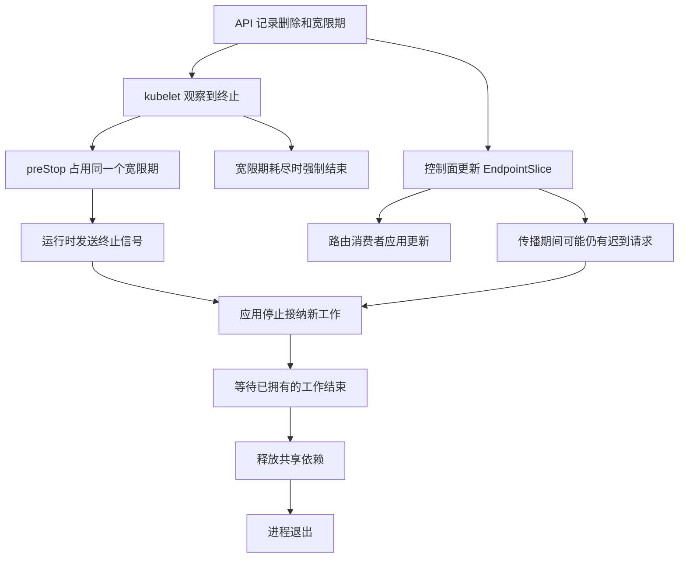

# 就绪与排空：发布期间谁还接请求

一个订单查询在旧 Pod 上执行到一半。发布开始，Pod 被标记为终止。此时入口代理仍缓存着旧端点，客户端还保留着长连接，新 Pod 刚启动但尚未加载配置。

把旧 Pod 的 readiness 改为失败，能否保证下一次请求一定去新 Pod？不能把这个状态变化当成全链路同步屏障。**路由组件获知状态、停止选择旧端点、应用停止接纳，以及旧请求真正结束，是不同事件。**

本篇依据 Kubernetes 1.34 的版本文档，端点条件另核对固定 `v1.34.0` 源码。没有运行集群；文中的时序数值是教学输入。应用内部如何等待 handler、后台任务与特殊连接，沿用[已有 Go 优雅停机页](/knowledge/go/lifecycle/graceful-shutdown.html)的证据，本篇只补它与平台之间的边界。

## 1. 先分清三个探针的问题 {#probe-responsibility}

容器进程存在，并不表示已经能正确接请求。反过来，下游短时故障也未必需要重启进程。

| 探针 | 问的问题 | 失败到达阈值后的作用 | 设计代价 |
| --- | --- | --- | --- |
| startup | 这次启动是否已经完成 | 未成功前阻止 liveness/readiness 开始；持续失败触发容器重启流程 | 启动预算过短造成反复启动；过长延迟发现真正无法启动 |
| readiness | 此刻是否适合接纳这类流量 | 容器未就绪，影响 Pod 就绪与匹配 Service 的端点选择 | 对共享依赖过敏，可能让所有副本一起退出可用集合 |
| liveness | 进程是否陷入需要重启才能恢复的状态 | 触发该容器重启流程，依相应策略处理 | 把负载或短暂下游故障当死锁，可能加剧故障 |

readiness 失败本身不会执行应用的排空函数，也不会因为这一点重启容器。startup 成功一次后，其启动保护结束；不能用它持续反映后续接纳状态。HTTP 探针看的是定义好的响应状态，监听端口打开或永远返回 200 的路径，并不能自动证明业务已经准备好。[1.34 探针文档](https://v1-34.docs.kubernetes.io/docs/tasks/configure-pod-container/configure-liveness-readiness-startup-probes/)

假设订单读取需要本地配置、路由表和一个必要连接池。启动完成条件可包含前两者；readiness 根据本实例能履行哪些请求决定是否接纳；liveness 检查本进程是否仍能推进。若一个可选推荐服务失败，订单读取仍可返回完整结果，就不应机械地让 readiness 跟着推荐服务变红。

如果共享数据库故障，所有副本的 readiness 都失败，流量并没有因此获得健康的去处。可以选择明确失败响应、局部降级或限制接纳，但要说明哪种响应仍满足服务承诺，不能把降级成功写成完整成功。这个选择应与[服务目标定义](../observability/service-level-signals.md#event-boundary)一致。

## 2. 端点状态是给消费者的信息，不是应用的锁 {#endpoint-conditions}

对于通常由控制器管理、关联 Pod 的 EndpointSlice，三个条件表达不同事实：

| 条件 | 要表达的状态 | 终止期间为什么保留 |
| --- | --- | --- |
| `serving` | Pod 当前就绪状态所表达的服务能力 | 某些排空消费者仍需要知道它能否处理存量工作 |
| `terminating` | Pod 已有删除时间戳 | 让消费者知道这个目标正在退出 |
| `ready` | 通常相当于 serving 且没有 terminating | 供常规流量选择继续使用兼容语义 |

默认场景中，终止端点的 `ready=false`，它不一定立即从 EndpointSlice 对象消失。**但有一个明确例外：Service 配置 `publishNotReadyAddresses: true` 时，控制器会把 ready 置为 true。** 不能套用“删除以后 ready 永远是 false”的无条件口诀。[EndpointSlice 条件](https://v1-34.docs.kubernetes.io/docs/concepts/services-networking/endpoint-slices/#conditions) · [v1.34.0 的 podToEndpoint 实现](https://github.com/kubernetes/kubernetes/blob/v1.34.0/staging/src/k8s.io/endpointslice/utils.go)

下面把固定源码的关系改写成真值表，不是复制上游代码：

| Pod 就绪 | 已终止标记 | publishNotReadyAddresses | ready | serving | terminating |
| --- | --- | --- | --- | --- | --- |
| 是 | 否 | 否 | 是 | 是 | 否 |
| 是 | 是 | 否 | 否 | 是 | 是 |
| 否 | 是 | 否 | 否 | 否 | 是 |
| 否 | 是 | 是 | 是 | 否 | 是 |

读表还不够。EndpointSlice 更新之后，消费者仍需观察并应用它。kube-proxy、Ingress、服务网格、外部负载均衡器和客户端缓存，并不是同一个状态机。直接访问 Pod IP 的流量也不由匹配 Service 的就绪选择保护。

另外，kube-proxy 不是简单地永久排除所有终止端点。固定 v1.34.0 的 `CategorizeEndpoints` 在集群可选集合没有 Ready 端点时，可回退到 `serving && terminating`；本地集合没有本地 Ready 端点时，也可回退到本地的 serving 且 terminating 端点。文档特别说明 `Local` 策略如何支持外部负载均衡排空。要核对实际策略和消费者，不能把 ready=false 当成所有代理都绝不再转发的保证。[v1.34.0 的端点分类实现](https://github.com/kubernetes/kubernetes/blob/v1.34.0/pkg/proxy/topology.go) · [1.34 Service proxy 说明](https://v1-34.docs.kubernetes.io/docs/reference/networking/virtual-ips/#traffic-to-terminating-endpoints)

## 3. 删除引出的两条链会同时推进 {#termination-order}

以下聚焦一个普通应用容器、正宽限期、默认终止信号、没有特殊 sidecar 顺序的删除过程：



文字版：图的左右分支并行，不承诺路由更新先于 TERM，也不承诺 TERM 先于端点更新。应用的责任是在迟到请求与已接纳工作并存时，仍有明确的接纳边界。

正常终止会先运行符合条件的 preStop，再请求容器运行时向进程发送终止信号；镜像的 `STOPSIGNAL` 或已启用的自定义信号配置可能改变具体信号。不能只确认程序写了 SIGTERM handler，还要确认实际入口进程收到并处理了对应信号。[1.34 Pod 终止过程与信号](https://v1-34.docs.kubernetes.io/docs/concepts/workloads/pods/pod-lifecycle/#pod-termination-flow)

**preStop 不是额外赠送的一段时间。** 它与应用退出共享 `terminationGracePeriodSeconds`。总宽限 30 秒，hook 花掉 20 秒，后面就没有另一个完整的 30 秒排空窗口。文档描述 hook 超期时一次很小的 2 秒延长，这属于终止实现细节，不应作为常规预算。[生命周期 hook 执行时序](https://v1-34.docs.kubernetes.io/docs/concepts/containers/container-lifecycle-hooks/#hook-handler-execution)

hook 也可能失败、重复触发，或在进程已结束时无法执行。把停止接纳设计成可重复的单向状态变更；重复处理不能把入口重新打开。依赖最终回收要有所有者，不能在 hook 和信号处理函数里各关一次。[hook 交付说明](https://v1-34.docs.kubernetes.io/docs/concepts/containers/container-lifecycle-hooks/#hook-delivery-guarantees)

## 4. 一条有数字的排空路线 {#budget-timeline}

下面是一份需要实测才能采用的候选设计，不是 Kubernetes 给出的时延保证：

| 相对时间 | 候选动作 | 尚未被证明的条件 |
| --- | --- | --- |
| 0 秒 | API 标记旧 Pod 终止，开始 30 秒预算 | kubelet 与路由消费者何时看到它 |
| 0–5 秒 | preStop 留出传播时间；应用仍可处理迟到请求 | 5 秒是否覆盖该部署链实际传播尾部 |
| 5 秒附近 | hook 返回，应用收到信号，关闭业务接纳入口 | 所有入口、已有连接新请求、后台投递是否都受同一状态约束 |
| 接纳关闭后至第 23 秒前 | 已接纳工作有界排空，最多再用 18 秒 | 残余工作真的有截止时间并能被等待 |
| 第 23–25 秒 | 释放依赖，结束进程 | 释放动作能在 2 秒内完成 |
| 剩余 5 秒 | 给调度与观察抖动留余量 | 不是额外工作预算或承诺必能退出 |

粗略上界是 `W + D + C + M <= G`：终止前置等待 W、停止接纳后的残余工作 D、清理 C、安全余量 M，要装进总宽限 G。路由传播 P 与 W 可能重叠；只有独立证据支持 `P <= W` 时，等待 W 才能减少相应迟到窗口。它依然不是全网同步证明。

更长的 preStop 会压缩排空时间；更长的宽限期会增加新旧副本同时存在的资源开销，也延迟失败退出。持续流、WebSocket、长事务或后台任务可能远大于这个窗口，必须单独定义协议关闭、持久交接或可恢复检查点。把 G 无限制加大，没有解决工作所有权。

另一种选择是先主动进入准备退出，使 readiness 失败，观察流量变化后再发起删除；准备期不必全挤进删除宽限。但这需要显式发布流程以及安全的管理入口，仍须处理观察迟滞和准备期故障。对无法合理等待的服务，也可以更早停止接纳，接受一段可见拒绝，再用有预算、满足幂等条件的重试吸收部分影响。两种选择都应以用户事件与资源成本评估。

### 配置表达意图，应用必须实现对应状态

下面是 Pod `spec` 的**配置片段**，故意不含镜像和完整资源声明；不能直接当作可部署清单。路径由应用实现。镜像若没有 `/bin/sh` 和 `sleep`，该 hook 也不可用。

```yaml
terminationGracePeriodSeconds: 30
containers:
  - name: orders
    ports:
      - name: http
        containerPort: 8080
    startupProbe:
      httpGet:
        path: /startupz
        port: http
      periodSeconds: 2
      timeoutSeconds: 1
      failureThreshold: 30
    readinessProbe:
      httpGet:
        path: /readyz
        port: http
      periodSeconds: 2
      timeoutSeconds: 1
      failureThreshold: 1
      successThreshold: 1
    livenessProbe:
      httpGet:
        path: /livez
        port: http
      periodSeconds: 10
      timeoutSeconds: 1
      failureThreshold: 3
    lifecycle:
      preStop:
        exec:
          command: ["/bin/sh", "-c", "sleep 5"]
```

`30 × 2` 表达约一分钟的启动失败容忍量，但实际探针调度与执行不是精密计时器；不要拿参数乘积断言在精确第 60 秒必然重启。readiness 的周期、连续失败阈值和超时也会影响发现时间，随后仍有状态传播。字段依据[1.34 探针配置](https://v1-34.docs.kubernetes.io/docs/tasks/configure-pod-container/configure-liveness-readiness-startup-probes/#configure-probes)和[hook 实现类型](https://v1-34.docs.kubernetes.io/docs/concepts/containers/container-lifecycle-hooks/#hook-handler-implementations)复核，没有执行 kubectl apply 或 API 校验。

这个 sleep 不发出全链路已摘流确认，也不关闭应用入口。删除路径的端点更新与它并行；应用仍需在收到终止信号时停止业务接纳并排空。非删除触发的重启路径也不能假装已提前完成所有路由更新。

## 5. 用一个迟到请求暴露三个不同边界 {#finite-model}

在教学模型里，应用拥有接纳开关，路由器拥有独立端点缓存，工作集合只有有限事件。模型按指定顺序推进，不测真实时间或网络。

<!-- snippet: cloud.draining-walk -->
```python steps
# !step(3:5) 启动完成后接收 old；它成为应用必须等待的工作，未完成时依赖不能先关闭。
# !step(6:8) 删除和端点发布把 ready 变为 false；路由器还没刷新，所以它仍可能选到旧目标。
# !step(9:12) 应用关闭接纳后拒绝 late；路由器刷新后 new 不再到达应用。这两种结果属于不同边界。
# !step(13:17) old 完成后依赖关闭一次，再正常退出；输出显式保留完成和拒绝，不能只看退出成功。
from lifecycle import Process

p = Process()
p.startup_complete()
assert p.admit("old") == "accepted"
p.delete(now=0, grace=10)
p.publish_endpoint()
assert not p.endpoint["ready"] and p.router_has_endpoint
p.stop_admission()
assert p.admit("late") == "rejected"
p.refresh_router()
assert p.admit("new") == "not-routed"
assert p.finish("old") == "completed"
assert p.close_dependency() == "closed"
assert p.exit_clean() == "clean"
print({"completed": p.completed, "rejected": p.rejected,
       "close_count": p.close_count, "forced": p.forced})
```

输出：`{'completed': ['old'], 'rejected': ['late'], 'close_count': 1, 'forced': False}`。这是完整原创演示脚本，需与包内 `lifecycle.py` 同目录；不是 Kubernetes 实现或可部署服务。

测试还特意从已有连接入口送入新请求：即使路由已刷新，它仍可能到达应用。因此接纳控制不能只按新 TCP 连接计数。HTTP/2 多路复用、连接复用和特殊长连接的停止机制取决于协议与服务器；模型只表达这条旁路也要处理的责任，不实现这些协议。

再改一个条件：总宽限 10，hook 在逻辑时刻 6 返回。模型在时刻 10 强制结束，未完成请求记为 `uncertain`，不会到时刻 16 才认为预算耗尽，也不会记为正常排空。真实世界中，响应未完成还不能判断业务写入有没有提交；恢复要按业务事实对账，[幂等操作页](/knowledge/distributed/reliable-interactions/idempotency.html)讨论这种重试边界。

错误变体分别尝试：发布端点即认为路由同步、活跃工作结束前关闭依赖、重复关闭、重复停止反而重新开放入口、hook 后重获完整宽限、强制退出冒充正常完成、忽略终止条件、忽略 publishNotReadyAddresses 例外。每个变体都必须被对应状态断言拒绝，不能拿无关异常当失败证明。

模型不模拟 kubelet 的 2 秒延长、信号投递、连接状态或 sidecar 顺序。其强制结束只是显式状态转换；它证明选定时序对模型的影响，**没有证明任何集群能在该时间内排空**。

## 6. 发布配置解决容量衔接，不代替请求完成 {#rollout-conditions}

副本数为 3，选择 `maxUnavailable: 0`、`maxSurge: 1`，表达滚动更新期间的副本替换约束。它依赖新副本能被调度、启动并达到可用状态；资源没有余量时，发布可能停在等待。`minReadySeconds` 可要求新 Pod 持续 Ready 一段时间才算 available，但它不是流量验证，也不是旧请求排空计时器。[1.34 Deployment 的滚动更新与可用定义](https://v1-34.docs.kubernetes.io/docs/concepts/workloads/controllers/deployment/)

新实例探针很快变绿，但缓存未就绪或数据版本不兼容，副本数字依然可能好看。旧实例正确排空时，仍占 CPU、内存、连接与外部配额。容量评估要为重叠期留位置，不能只看最终期望副本数。

发布应有具体成立条件：新实例能完成代表性动作；新旧版本可在重叠期共享依赖；全部接纳入口都能关闭；已接纳工作有残余上界；路由传播有实测；强制结束后有恢复路径。条件缺一个，就保留对应失败窗口。

## 7. 失败窗口怎样被看见 {#failure-windows}

| 窗口 | 用户或系统会看到什么 | 需要什么证据 |
| --- | --- | --- |
| 新实例过早 Ready | 新流量抵达未准备好的业务路径 | 启动阶段与业务准备的对应关系 |
| readiness 已变，路由未刷新 | 迟到请求继续到旧实例 | 实际路由层的端点观察、选择与请求事件 |
| 接纳停止，存量尚未完成 | 新工作被拒绝，旧工作仍使用依赖 | 拒绝结果、活跃集合与依赖关闭顺序 |
| handler 返回，后台仍运行 | HTTP 看似空闲，副作用仍未结束 | 后台所有权、持久接纳事实或有界 join |
| hook 用光宽限 | 应用收到信号后没有足够排空时间 | 删除、hook、信号、终态的时间关系 |
| 节点失联或强制删除 | API 对象消失与进程停止不再等价 | 节点/运行时状态及业务资源的保护与恢复 |

强制删除不等待 kubelet 确认旧进程已经终止，API 中看不到 Pod 不足以证明旧工作不再运行。普通优雅退出也不能覆盖断电、崩溃和强制结束；业务需要持久化、幂等或资源端协调保护恢复。[1.34 强制终止语义](https://v1-34.docs.kubernetes.io/docs/concepts/workloads/pods/pod-lifecycle/#forced-pod-termination)

真实验证应让请求停在可控制阶段，再触发一次有限发布：分别观察旧请求能否完成、新请求怎样被处理、连接复用路径、后台工作结束、依赖关闭、超期强制结束与事后业务事实。关联标识要受控，不记录凭据或原始用户数据。单看 Ready、退出码或一次无错发布，覆盖不了这张表。

这里没有运行这套集群实验。它是未来部署验证需要收集的证据清单；当前只有官方语义复核与有边界的顺序模型。

## 推理练习 {#practice}

1. EndpointSlice 已有 `ready=false`，客户端还通过旧 HTTP/2 连接创建新 stream。应用只关闭 listener 够不够？
2. G=30、preStop=20、停止接纳后残余工作最多 15、清理最多 2。能否用“应用 Shutdown 超时设成 30”解决？
3. preStop 调用两次，第二次把 draining 布尔值取反。第一次测试通过，能否认为发布安全？
4. 新副本 Ready 了 10 秒，旧副本还挂着长事务。`minReadySeconds: 10` 证明了什么？

<details>
<summary>展开参考推理</summary>

1. 不够。监听停止覆盖新连接入口，已有连接上的新工作需要协议或应用层接纳策略；既有工作仍需等待结束。路由传播不自动关闭这些流。
2. 不能。20+15+2 超过总宽限，内层超时不能延长外层预算。应调整等待、残余工作、总预算或交接方案，并保留余量。
3. 不能。重复停止应维持单向状态，取反会重新开放接纳。需明确重入行为以及副作用只发生一次的资源所有权。
4. 新副本满足相应持续就绪条件才能计为 available；它没证明旧事务结束、旧依赖可关闭、路由已传播或业务版本兼容。继续查旧工作的完成事实。

</details>

## 验证附录 {#verification}

[下载固定样本与时序模型源码](/examples/cloud-reliability-lab.zip)。与前篇共用一个小型源码包，不需要容器、集群或网络。已有 Go 进程实验只在[原页的范围](/knowledge/go/lifecycle/graceful-shutdown.html)内引用，不重新计为本篇的 Kubernetes 实测。

<details>
<summary>展开来源身份、运行方式和未执行项</summary>

- `source-reviewed`：2026-10-03 实读 Kubernetes v1.34 官方文档快照的 probes、Pod termination、hooks、EndpointSlices、Service proxies 与 Deployment；固定 `v1.34.0` 的 `staging/src/k8s.io/endpointslice/utils.go` 核对 `podToEndpoint`，`pkg/proxy/topology.go` 核对 `CategorizeEndpoints`；不混用后续版本特性
- 版本文档网站称为静态快照；仍保留访问日期，不声称 URL 具有源码 commit 级别的字节不可变性。未把本次核对升级为完整源码审计
- `executed`：CPython 3.12.14，`timeout 10s python3 -B verify.py`；单进程、有限集合和逻辑时间，无 sleep、网络、信号、真实服务或调度竞争
- 模型覆盖普通 ready 路由的迟滞、已有连接入口、正常完成、过早释放、重复动作、单一终止预算与强制结束未决状态；代理回退、探针行为、sidecar 等仅来源复核，未在模型中实现
- 配置仅做字段语义与文本检查，未通过 Kubernetes API、准入控制器或实际镜像校验；部署/探针/EndpointSlice 的运行记录保持 `not-run`
- 未执行 Kubernetes/Docker/代理或监控安装、发布、故障注入；未测得传播上界或生产零错误发布，没有由模型推导生产可用性

</details>
