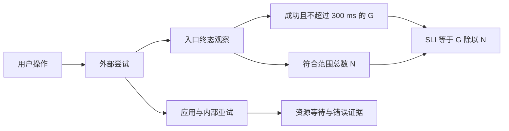

# 延迟与错误怎样变成服务目标：RED、USE 与 SLO

订单查询返回 200，用户却等了两秒。另一个请求在入口超时，应用没有留下完成日志。如果仪表盘只统计应用的 200 响应，第二次尝试连分母都没有，服务看起来可能比实际更好。

先不要选仪表盘。先写清：**谁发起了什么动作，在什么边界观测，什么结果才算完成得好**。指标实现只是把这个定义转成可计算的事实。

## 1. 把一次尝试记成一个事件 {#event-boundary}

本文设一个教学目标：在受控入口观察订单查询，每次符合范围的外部 HTTP 尝试，只有“成功返回所需结果，且耗时不超过 300 ms”才算好事件。观察窗口是明确的一段时间。300 ms 和后文的 99% 都是演算参数，不是由实验推导出的业务承诺。

这份定义仍需要补完：

| 要确定的项 | 本文的选择 | 改变选择会发生什么 |
| --- | --- | --- |
| 事件单位 | 入口收到的一次外部尝试 | 一次用户操作可能重试多次，尝试成功率不等于操作成功率 |
| 计数位置 | 入口观察者为尝试记录一个终态 | 应用日志看不到入口前失败；客户端观测又包含用户网络影响 |
| 范围 | 指定查询动作；排除独立标识的探针流量 | 不得因为请求失败，才临时把它改为“不符合范围” |
| 终态 | 完整响应或入口截止时间耗尽 | 应用后来完成，不撤销客户端已经遭遇的超时 |
| 好事件 | 业务上成功，并且 `duration <= 300 ms` | 200 携带业务错误不算成功；快速 500 也不算好 |
| 时间归属 | 按该观察者记录终态的时间归入窗口 | 跨窗长请求要有一致规则，不能开始和结束各算一次 |

健康检查、无效输入、鉴权失败是否排除，必须在观测前按服务责任定义。例如合法用户因服务错误被误判为未授权，就不能用“所有 4xx 都排除”把它藏掉。入口还应保留收到量、未决量与终态量，发现记录遗漏；只统计已完成的快请求，会形成幸存者偏差。

SLI 是测到的服务表现；SLO 是“在约定窗口内，SLI 至少达到某个目标”的约定。事件型 SLI 常写成 `好事件数 / 符合范围的总事件数`。业务也可能需要新鲜度、正确性或用户操作成功率，不能拿 HTTP 成功替代这些目标。[Google SRE 的事件比例定义](https://sre.google/workbook/implementing-slos/)



文字版：先确定外部事件的身份，再从同一批事件求分子和分母。内部请求可以有自己的 SLI，但与入口 SLI 是两个边界，不应把两层次数相加。

## 2. 同一份样本，为什么会得到三种成功率 {#fixed-sample}

有两个实例处理了一小段合成流量，另有 5 次探针访问被明确排除：

| 实例 | 100 ms 成功 | 400 ms 成功 | 1,000 ms 入口超时 | 符合范围总数 | 好事件 |
| --- | ---: | ---: | ---: | ---: | ---: |
| A | 90 | 8 | 2 | 100 | 90 |
| B | 1 | 0 | 9 | 10 | 1 |
| 合计 | 91 | 8 | 11 | 110 | 91 |

只看可用性，成功是 `99/110 = 90%`。要求成功且 300 ms 内完成，好事件比例是 `91/110 ≈ 82.73%`。只问“成功响应中有多少够快”，则是 `91/99 ≈ 91.92%`。三个数各自回答不同问题；最后一个不能冒充第一个或第二个。

再看实例聚合。A 的好事件比例是 90%，B 是 10%，直接平均得到 50%。但 A 处理的量是 B 的十倍。整体比例要先加事件：`(90+1)/(100+10)`。按对应分母加权平均比例，在口径一致时等价；**不带流量权重的实例平均改变了问题**。

下面是实验包中的完整演示脚本；统计函数和合成输入位于同包的 `signals.py`。这是原创教学应用代码，导入模块后可直接运行，不是监控产品源码。

<!-- snippet: cloud.signals-walk -->
```python steps
# !step(4:7) 固定输入有 115 条，其中 5 条探针不符合范围；分子 91 与分母 110 来自同一观察边界。
# !step(8:10) 将 19 个坏事件与 99% 教学目标比较；用 Fraction 保留精确分数，避免四舍五入提前改变判断。
# !step(11:12) 输出的比例和消耗倍数只描述这组人工样本，不是生产服务目标的达成证据。
from fractions import Fraction
from signals import budget, fixture, measure

events = fixture()
result = measure(events)
assert result["total"] == 110 and result["good"] == 91
assert result["ratio"] == Fraction(91, 110)
cost = budget(result["total"], result["total"] - result["good"])
assert cost["allowed"] == Fraction(11, 10)
assert cost["burn"] == Fraction(190, 11)
print({"total": result["total"], "good": result["good"],
       "ratio": str(result["ratio"]), "burn": str(cost["burn"])})
```

输出：`{'total': 110, 'good': 91, 'ratio': '91/110', 'burn': '190/11'}`。把 `<=` 错写成 `<`，会把正好 300 ms 的成功请求错误排除；独立的 `[250, 300, 301]` 样本要求好事件恰好为 2。

## 3. RED 问用户遭遇了什么，USE 查资源在等什么 {#red-use}

RED 按服务观察请求速率、失败和耗时分布；速率需要明确时间单位，失败既看个数也看占比。USE 按资源检查利用程度、饱和等待与错误。它们是选择问题的方法，不是一套必须安装的工具。[RED 原始方法介绍](https://grafana.com/blog/the-red-method-how-to-instrument-your-services/) · [USE 作者对资源与饱和的定义](https://www.brendangregg.com/usemethod.html#Summary)

| 观察对象 | 要回答的问题 | 一个具体信号 | 不能独立推出的结论 |
| --- | --- | --- | --- |
| 入口请求 | 用户是否更慢、更常失败 | 请求量、坏事件比例、耗时分布 | 哪一个资源导致故障 |
| 数据库连接池 | 可用连接是否被占满 | 在用数/上限、等待数、获取超时数 | 数据库 CPU 一定很高 |
| CPU | 任务是否缺少执行时间 | 忙碌时间、可运行队列、限额节流 | 低平均 CPU 就没有短时排队 |
| 任务执行器 | 工作是否积压 | 活跃任务、有界队列长度、拒绝数 | 加大队列就能改善延迟 |

例如入口流量没有明显增加，但延迟和连接获取超时上升。在用连接到达上限、等待队列变长，支持“请求正在等连接”的判断。它还不能区分慢 SQL、长事务、连接未归还，或下游调用占着事务连接。下一步要关联连接占用区间、具体调用与数据库证据，见[连接等待排障](/troubleshooting/connection-waiting.html)。

反过来，CPU 从 40% 涨到 70%，入口体验没有变化，也没有排队证据，不能仅凭这个数宣布服务违约。平均值还会抹平突发；要对齐观察窗口和资源边界。Google 的黄金信号同样区分延迟、流量、错误、饱和，并提醒把用户可见症状与内部原因分开。[监控问题与黄金信号](https://sre.google/sre-book/monitoring-distributed-systems/)

## 4. 百分位保存了位置，丢掉了整份分布 {#quantiles}

把一组耗时从小到大排序。本文使用明确的 nearest-rank 定义：p95 取第 `ceil(0.95 × N)` 个值，序号从 1 开始。别的库可能使用插值；小样本比较前必须先核对定义。

另取一组特别容易手算的输入：实例 A 有 100 次 100 ms，B 有 10 次 1,000 ms。A 的 p95 是 100，B 的 p95 是 1,000。整体 110 次的第 105 个值却是 1,000：

- 实例 p95 普通平均为 550 ms，错误
- 按实例请求量给 p95 加权为 `2000/11 ≈ 181.82 ms`，仍错误
- 合并原始事件后求 p95 为 1,000 ms

为什么加权也不行？p95 是排序位置上的值，不是可加的总量。每个实例只交出一个 p95，就丢掉了其余位置的信息；给这个数乘权重无法恢复。均值可以通过总耗时与总次数合并，百分位需要可合并的分布表示。[Prometheus 对摘要分位与直方图聚合的区分](https://prometheus.io/docs/practices/histograms/#quantiles)

### 桶可以相加，桶里的位置仍需承认未知

让两个实例使用相同的经典累积桶：`<=100 ms`、`<=300 ms`、`<=1,000 ms`。

| 累积上界 | A | B | 合计 |
| --- | ---: | ---: | ---: |
| 100 ms | 100 | 0 | 100 |
| 300 ms | 100 | 0 | 100 |
| 1,000 ms | 100 | 10 | 110 |

这三行不是互斥区间，不能相加成 310 次；最后一行才覆盖这份有限样本的总量。真实经典直方图还需要覆盖全部观测的 `+Inf` 桶。跨实例按同一上界加计数后，可以直接得到 300 ms 内的比例 `100/110`；因为恰好有这个边界，无需猜桶内位置。

但只拿这三个桶求 p95，只能确定它在 `(300, 1,000] ms`。本例知道原始样本，才知道精确值是 1,000。若把十个慢请求全部改成 500 ms，桶计数不变，p95 却变为 500。桶内插值是估计，不是测出了每个请求。[经典桶边界与估计误差](https://prometheus.io/docs/practices/histograms/#bucketing)

实现时还要满足这些条件：

- 各实例的事件定义、单位、时间范围与桶布局一致；某实例缺了 300 ms 桶，不能静默漏加它的分子
- 对按进程累积的计数器先处理重启重置、再按同维度聚合；原始累积值相减不是普遍安全的速率算法
- 标签聚合保留服务、动作等目标维度；把不同服务或地区混在一起，可能让高流量组掩盖小组失败

这里选经典桶是为了手算，不是在比较监控产品或推荐某种存储实现。原生直方图另有布局、精度与兼容规则，本文未运行和验证这些规则。

## 5. 错误预算是坏事件额度，不是允许随便停机的分钟数 {#error-budget}

在同一个已经观测完整的窗口中，目标比例为 `S`，事件总量为 `N`，坏事件为 `B`：

- 允许坏事件量为 `(1-S) × N`
- 余量为 `(1-S) × N - B`
- 同口径窗口的消耗速率倍数为 `(B/N)/(1-S)`，通常称 burn rate

用本例 `S=99%`、`N=110`、`B=19`，允许量是 1.1，余量是 -17.9，消耗倍数是 `190/11 ≈ 17.27`。事件实际是整数，1.1 的含义是这份样本最多允许 1 个坏事件，2 个就不达标。它没有生成“可以故障 1.1 次”的操作许可。

假设另一个完整周期有 10,000 个符合范围事件，99% 对应 100 个坏事件。这与“一个月容许多少分钟停机”不能直接互换：流量集中在一天的服务，繁忙时一分钟损失的请求可能远多于深夜一小时。按时间定义的可用性目标与按事件定义的目标，是两种计量方法。

短窗口高消耗能提示风险，但不能在不知道完整周期事件量时，声称它已经花掉全月某个精确比例。长窗口显示累计影响，短窗口显示是否仍在恶化；低流量时还必须一起看绝对坏事件量。告警的时间窗、阈值、升级动作要由响应成本和用户影响决定。

预算策略还需要写出：谁负责判断，出现数据缺口时如何处理，什么条件暂停风险变更，恢复到什么证据才继续。示例算式本身不会自动赋予发布策略。[SLO 与错误预算策略](https://sre.google/workbook/implementing-slos/)

## 6. 数据越少，不确定性越不能被涂成绿色 {#low-traffic}

一个窗口 1 次请求，失败 1 次，失败率就是 100%；另一个窗口 1,000 次失败 10 次，是 1%。前者的百分比更高，但不能仅凭比例判断哪个影响更大，也不能据此估计长期可靠性。

当 `N=0` 时，`G/N` 未定义。实验返回 `ratio=None` 和 `status=no-traffic`，不会填成 100%。还要把以下两种“没有数”分开：

| 状态 | 已知什么 | 合理下一步 |
| --- | --- | --- |
| 完整观测但零流量 | 该窗口没有符合范围事件 | 显示无流量；按业务判断是否异常，必要时用独立合成检查 |
| 采集链路断开或缺数据 | 总数和好事件数都不可信 | 标记未知，检查数据管道；不能靠补零宣称服务正常 |

合成检查回答的是固定脚本是否能成功，不是替真实用户补出一个分母。若为了稳定图形而自动延长窗口，应同时显示窗口变化；否则本来短时间内的故障被平均掉，读者却以为比较的是同一尺度。

### 采样追踪适合找原因，不能随便还原总体比例

设实际有 90 次成功、10 次失败。为了排障，保存全部 10 次失败，但只保留 10 次成功。存下的追踪里失败占 `10/20=50%`，真实失败比例却是 `10/100=10%`。这是抽样规则造成的选择偏差，不是算术错误。

头部采样在追踪开始时决定，尾部采样可以依据完整或部分完成的追踪选择错误、慢请求；后者提高问题样本可见性，也会改变所保留总体。若要从样本估计总体，必须知道选择概率、丢失机制和统计假设，不能仅用“采样率 10%”把每个桶乘十。[OpenTelemetry 的头部与尾部采样说明](https://opentelemetry.io/docs/concepts/sampling/)

一种清楚的职责分工是：为 SLI 保留受控维度的事件计数与分布，为诊断保留有明确采样规则的追踪；同时监测两条采集链路的完整性。本实验只验证上述固定选择偏差，没实现概率估计器或真实采样器。

## 7. 标签和记录字段，也是资源与隐私设计 {#cardinality-privacy}

如果有 20 个动作模板、5 种结果、4 个地区，每个实例最多出现 400 种组合；再加 10,000 个用户 ID，理论组合就乘到 4,000,000。实际出现的组合可能更少，但还会乘以实例数、桶数和时间变化。**组合数决定的是潜在序列规模，不是单条记录有多少字段**。每个标签集合都会带来存储与处理成本。[Prometheus 对标签基数的说明](https://prometheus.io/docs/practices/instrumentation/#do-not-overuse-labels)

订单查询可先保留受控维度：动作模板 `/orders/{id}`、结果类别、地区、服务版本。不要把原始 URL、订单号、用户 ID、trace ID 放进普通指标标签。确实需要单次诊断时，可在受访问控制的日志/追踪中用有限保留期的关联标识，再明确到指标的跳转机制。

隐私又是另一条检查线：低基数字段也可能敏感。记录一个只有少数取值的疾病状态，基数低并不意味着适合收集。优先使用字段允许列表，避免请求正文、Cookie、Authorization、完整查询串和会话令牌；哈希不会自动把可关联的标识变成匿名数据。采集 SDK、代理与导出器各层都要核对。[OpenTelemetry 的数据最小化与敏感字段处理](https://opentelemetry.io/docs/security/handling-sensitive-data/) · [认证凭据边界](/knowledge/security/authentication/authentication-boundaries.html)

## 用四个变化检验定义 {#practice}

1. 入口尝试第一次超时，客户端重试成功；内部还重试了两次。本文 SLI 分母增加几次？用户操作成功率又需要什么？
2. A/B 的请求量互换，而各自好事件比例保持 90%/10%。整体会怎样？
3. 只知道累积桶为 `[100,100,110]`，能否认定 p95 就是 1,000 ms？
4. 发布期间新请求被排空入口拒绝，能否一律排除，以免“发布影响 SLO”？

<details>
<summary>展开参考推理</summary>

1. 两次符合范围的外部尝试，各有一个终态，分母增加 2；内部重试是另一个边界。操作成功率需要可信的操作关联、结束条件和总耗时定义，不能用请求数直接代替。
2. `(9+10)/(10+100)=19/110≈17.27%`。普通平均仍是 50%，说明它没有表达流量结构的变化。
3. 不能。p95 位于最后一个区间；500 和 1,000 ms 的慢请求能产生相同桶。若目标阈值正好是 300 ms，阈值内占比则可直接计算。
4. 不能事后按失败原因调整分母。若这些是服务承诺接纳的有效尝试，发布拒绝就是可见坏事件；应该用结果评估排空和重试方案。特殊维护窗口若属于目标定义，需事先说明范围及对用户的意义。

</details>

## 验证附录 {#verification}

[下载固定样本与时序模型源码](/examples/cloud-reliability-lab.zip)。包内的固定样本可完整复算；结果不来自用户请求、生产日志或压测。复核入口是 `timeout 10s python3 -B verify.py`，不需要安装任何 Python 包。

<details>
<summary>展开运行身份、错误变体和未覆盖范围</summary>

- 运行：CPython 3.12.14，Linux，标准库；全部场景在同一个进程内顺序执行，外部总超时 10 秒，无线程、子进程、网络或忙循环
- 算术覆盖：范围过滤、合并比例、边界包含、零流量与数据未知、事件预算、nearest-rank、累积桶和固定非均匀样本
- 错误变体：把探针算入范围、丢掉超时、平均实例比例、排除阈值相等、零流量填满分、缺数据当零、用目标比例作为预算、普通/加权平均百分位、平均桶计数、用保留样本冒充总体
- 拒绝证据同时匹配断言身份、预期值与实际值；运行异常、无失败、错误断言和错误数值都不能冒充目标反例。完整摘要见包内 `results.json`
- 来源分别标记 `source-reviewed`，算术和时序模型标记 `executed`；Prometheus/OpenTelemetry 在线文档记录 2026-10-03 核对日期，未把动态文档当不可变软件发布版本
- 未执行真实监控查询、采集器、计数器重置/抓取丢失、生产 SLO、告警或容量实验；这些方法说明不能升级为产品环境运行结论

</details>
