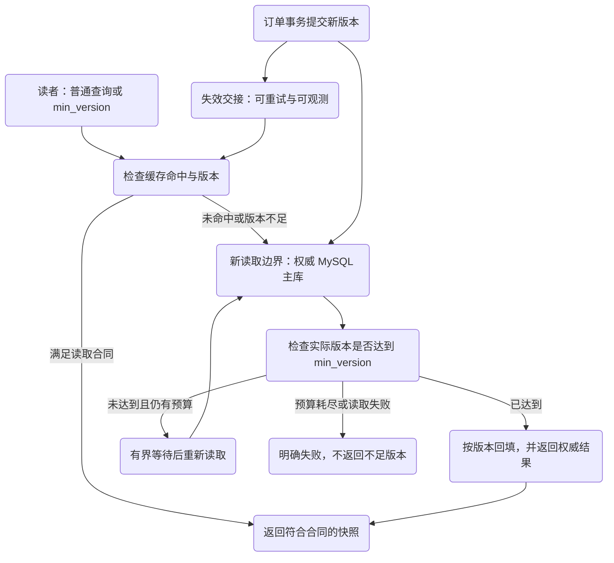
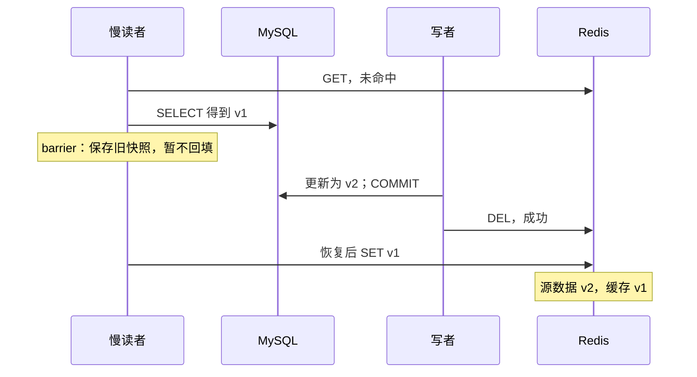
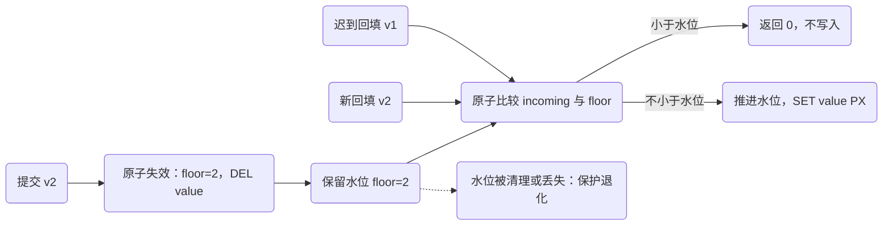

# 缓存新鲜度与失效：数据库已经新了，读者为什么仍看见旧值

数据库里订单已经是版本二，缓存却还在返回版本一。团队可能先检查“写完以后有没有删缓存”，然后发现删除确实成功了。矛盾来自另一个尚未完成的读请求：它早就读到了旧数据库快照，却在删除之后才把旧值放回缓存。

本章不寻找一个没有前提的“万能双删”。先定义调用方能接受怎样的读取，再用交错证明每个修复的范围。缓存提高读取效率，却给源数据之外增加了一份可能落后的观察状态；必须有人负责发现与消除这份落后。

## 先修与可复现环境

先理解[快照和当前写入的区别](/knowledge/data/transactions/inventory-invariants.html)，以及[outbox 的持久交接责任](/knowledge/distributed/events/transactional-outbox.html)。共同场景仍是订单查询，不用商品价格或金融余额引入额外业务约束。

[下载共同实验](/examples/data-consistency.zip)，运行 `bash run.sh d4`。镜像来自既有台账：MySQL 8.4.7、Redis 7.4.7-alpine3.21。Redis 为独立单节点、`noeviction`、不启用持久化；只有实验容器内部访问。它不是线上部署建议，也不覆盖主从复制、Sentinel、Cluster 或故障切换。

本节实验已在文中所列范围运行；源码下载及历史验证记录见文末附录。

## 1. 先决定哪条读取必须新鲜

订单创建成功后，用户刷新详情，是否必须立即看到刚创建的订单？后台列表可否短暂缺少它？这两个问题可以有不同答案。

一种明确合同是：创建响应返回权威 order_id 与版本；刚创建后的详情查询可携带 `min_version`，缓存版本不足就绕过缓存查询主库。普通列表允许一个经测量的异步延迟，并显示处理中状态。这里的 `min_version` 是建议的 API 设计，实验不实现 HTTP，也不把携带数字本身当权限凭证。访问主库本身仍不足以满足它：不能复用已经过旧的 RR 快照，应在合适的新读取边界取得权威数据，再检查实际版本。版本仍不足时只可有界等待或明确失败，不返回不足版本，也不无限循环查询。



“最终一致”没有说明何时、谁来推进、故障时怎么办。更可执行的合同应包含：允许落后的读入口、权威数据源、目标传播时延、超时后的降级行为，以及无法满足时返回旧数据还是返回明确不可用。不能把这项产品选择交给缓存 SDK 的默认超时替你决定。

## 2. 后删也有窗口：旧读者还没回来

cache-aside 的常见读路径是缓存未命中→读取数据库→写缓存。写路径是提交数据库→删除缓存。删除发生在提交以后，消除了“先删时读者还能读到未更新数据库”的明显窗口，但没有阻止更早开始的读取迟到。



`D4.stale_refill` 不靠把线程 sleep 一会儿碰碰运气。测试先完成旧值查询，再完成数据库更新和 DEL，最后才执行旧 SET，因果顺序由执行屏障确定。预期源版本二、缓存版本一，反例才算被成功识别。

先删后写也有风险：缓存删除到数据库提交之间，读者可以把旧数据库结果重新放回。延迟双删能降低某些迟到回填的概率，但如果没有旧请求最长存活时间、数据库读取延迟和失效可靠交付的上界，就没有一个固定延迟能无条件覆盖所有交错。把五百毫秒写成“保证一致”是不完整的论证。

## 3. TTL 测量的是缓存驻留时间，不是源数据年龄

Redis 的过期机制会让具有超时的键在期限后不可作为有效值继续读取；过期删除有主动与访问触发的路径。命令语义见 [EXPIRE](https://redis.io/docs/latest/commands/expire/) 与 [SET 的过期选项](https://redis.io/docs/latest/commands/set/)。本实验使用 SET PX，并通过反复查询 EXISTS 观察键消失，不假定清理线程恰好在哪一毫秒物理删除键。

假设数据库旧快照在零时刻读出，慢请求直到十秒后才将它缓存并设一秒 TTL。这个值在回填时就已经旧了十秒。TTL 最多限定这次写入后的驻留，并不能凭空把源版本年龄变成一秒。

若要推导“最旧不超过某个时长”，至少要约束源读取的新鲜程度、读到回填的最长延迟、缓存驻留、失效交接延迟和读取副本滞后。长事务旧快照或无限暂停的请求会破坏这些前提。对严格读取可以绕过缓存或做权威版本校验，但需要接受主库请求量与延迟成本。

还有一个操作细节：覆盖值时不能假定旧 TTL 自动保留。实验把版本判断和带 PX 的 SET 放进同一 Lua 脚本，避免“值写好了，设置过期前退出”留下永久值。Redis 文档是随当前产品维护的页面，本章只使用在固定 7.4.7 版本存在的命令；对应实现可核对 [7.4.7 的 expire.c](https://github.com/redis/redis/blob/7.4.7/src/expire.c)，最终以固定镜像输出为证据。

## 4. 版本水位：让迟到者证明自己没有倒退

只把版本号放在 value 内还不够。如果新版本缓存被删除，旧读者看到“键不存在”仍可能重新插入旧版本。我们为每个订单保留两个键：短期的 value，以及不会跟随 value 过期的版本水位 floor。

写者提交 v2 后执行一个原子失效脚本：把 floor 推进到二并删除 value。读者回填 v1 时，如果低于 floor 则拒绝；回填 v2 可以通过。回填本身也推进 floor，因此较旧失效事件不应删除已经更新的 value。



`lua/fill.lua` 的核心很短，重要的是比较与写入不可被其他客户端命令插入：

```lua
local incoming = tonumber(ARGV[1])
local floor = tonumber(redis.call('GET', KEYS[1]) or '0')
if incoming < floor then return 0 end
redis.call('SET', KEYS[1], tostring(incoming))
redis.call('SET', KEYS[2], ARGV[2], 'PX', ARGV[3])
return 1
```

Lua 脚本的原子执行针对 Redis 内这一段命令，不包含 MySQL 提交，也不等于脚本发生错误后会自动回滚之前的写入。脚本须短小、参数类型可预先校验，并处理内存不足等错误，不能据此制造跨存储事务。[Redis Lua 执行说明](https://redis.io/docs/latest/develop/programmability/eval-intro/)与 [EVAL 命令合同](https://redis.io/docs/latest/commands/eval/)是这个范围的来源。

下面是项目验证水位的关键次序，Code Hike 聚焦每个返回值的意义。测试在非过期场景使用六十秒 TTL，避免把 CI 排队偶然跨过短 TTL 误当成协议问题。

```python steps
# !step(1:2) 先建立 v1，再确认 v2 失效脚本执行成功；保证只从这个确认点以后成立。
# !step(3:4) 迟到 v1 必须返回拒绝，删除后的 value 仍应为空。
# !step(5:7) v2 可以回填；再次到来的 v1 仍不应把 v2 覆盖。
require(self.cache_fill("guard", 1, "v1") == 1)
require(self.invalidate("guard", 2) == 1)
require(self.cache_fill("guard", 1, "late-v1") == 0)
require(self.redis("GET", key) == "")
require(self.cache_fill("guard", 2, "v2") == 1)
require(self.cache_fill("guard", 1, "late-v1-again") == 0)
require(self.redis("GET", key) == "v2")
```

实验版本很小，可精确转换为 Lua number。生产 BIGINT 若可能超过 `2^53-1`，不能直接用 `tonumber` 比较；需要固定宽度字符串比较或其他不会损失整数精度的编码。两个 key 使用相同 hash tag 只是为未来同槽实现留下结构，不代表已经测试 Redis Cluster。

## 5. 水位没有关闭哪些窗口

最重要的剩余窗口是数据库已经提交，而失效脚本尚未成功执行。此时 Redis 仍可能只有 v1 的水位和值；一个 v1 回填当然不会被拒绝。版本只能对已知更新排序，不能告诉缓存它从未收到的消息。

`D4.invalidation_delivery_loss` 因此先缓存 v1，再提交数据库 v2，然后抑制一次失效命令。预期缓存仍为 v1；补发失效后才消失。这是命令交付失败模型，不是 Redis 真正宕机测试。结合 [Outbox 的交接责任](/knowledge/distributed/events/transactional-outbox.html)，可以把“需要推进缓存版本”的责任写入 outbox，由可靠重试与对账推进；传播期间仍须遵守读接口的陈旧合同。

水位丢失是另一条边界。`D4.expiry_and_watermark_loss` 使用三百毫秒 value TTL，等待 EXISTS 变零，验证 floor 仍在、v1 回填仍被拒绝。随后仅删除本次实验 floor，旧 v1 又能被接受。这只证明丢失状态会撤销门槛，不声称复现了真实 Redis failover。

永久保留每个对象的水位会增长内存；本项目 `noeviction` 避免隐式淘汰，却会在内存不足时拒绝写入。生产若要回收水位，需证明旧请求/旧事件不会在回收后再出现，或引入可信的代际与权威校验。重启、淘汰和故障切换之后应怎样重新建立保护，是部署合同，不能用“Redis 很快”略过。

### 单调版本的前提也需要有人维护

水位比较假定“更大的版本表示更新的同一对象状态”，并且同一版本对应不变快照。假如写路径修改 state 却忘了增加 version，旧新两个值都标为二，脚本允许同版本覆盖就无法识别回退。增加版本必须与源状态修改处于同一事务；版本来源不能是各应用实例自由生成的本机时间。

删除和重新创建也必须定义身份。若订单删除后复用相同 order_id，并把版本从一重新计数，旧水位可能永久拒绝新对象，或者清掉水位后接纳上一代旧请求。可以禁止复用身份，或把稳定代际纳入缓存键和版本合同，但需要设计存量请求的兼容路径。简单地把 TTL 缩短无法补齐这些语义。

本实验的并发回填专门在 floor 已确认为二后同时释放两个 Python 线程，让版本一和二竞争。预期返回值分别为零和一，最终值为二；不能只观察最终二就说保护有效，因为错误实现也可能恰好让新版最后写入。相反，显式断言旧版被拒绝，才说明结果来自版本规则而不是调度运气。反例、原子机制和观测字段要彼此对应，这也是把小实验迁移到真实服务时最值得保留的部分。

## 6. 缓存故障会把一致性问题变成容量问题

缓存不可用时全部直读主库，通常能减少旧读，却可能把原来很少的 miss 放大成全部请求。若请求率为 R、平时命中率为 H，正常数据库读流量约为 `R × (1-H)`；全量回源接近 R。这个估算还没包含重试放大、复杂查询和后台重建，不能直接当容量保证。

可用手段包括有界回源并发、每 key 合并并发 miss、热点预热、随机化 TTL、队列上限和有条件的旧值兜底。进程内 singleflight 只能合并该进程的请求；跨进程门闩同样需要所有者、超时和失败恢复。允许旧值兜底是否合适，要由业务读取合同决定，不能悄悄用于要求刚写可见的入口。

诊断时同时记录源版本、缓存版本、请求最低版本、回填拒绝数、失效年龄与主库回源并发。只看 Redis 命中率可能完全看不见“高命中但全是旧值”。如果读到旧数据，先确认源到底是订单主表还是本身就落后的投影，再判断缓存版本；不能把每一次列表延迟都归罪于 Redis。

## 7. 练习：说清代价，比增加一次删除更难

**机制练习。** 去掉独立 floor，把版本仅存入有 TTL 的 value。先写 v2，让 value 过期，再释放暂停中的 v1 回填。参考答案必须预测旧值被接纳，并写出能区分两个实现的测试。加长 TTL 只改变出现窗口，不是一般性修复。

**设计练习。** 为“创建后详情必须读到自己写入，普通列表允许延迟”的需求比较两个方案：所有详情直读主库；版本感知缓存加有限回源。提交读合同、传播监控、缓存不可用时的并发预算、水位回收条件和降级响应。评分不要求总选同一方案，而要求给出其不适用条件，明确哪些容量数字是测量值，哪些只是待验证目标。

综合案例把订单、库存、outbox、消费投影与缓存放进同一次[恢复演练](/cases/orders/consistency-recovery.html)。重点不再是每个组件能否单独成功，而是故障以后还有哪些责任尚未完成、该用什么证据宣布恢复。


<details class="verification-appendix">
<summary>实验附录：运行方法、历史记录与未覆盖范围</summary>

本章五个 MySQL 8.4.7 + Redis 7.4.7 用例已通过，覆盖旧值回填、实际 Lua 水位判断、失效抑制、过期与并发回填。失效丢失和水位删除是显式故障模型，不是 Redis failover 实测。 绑定 [CI run 36991587537](https://github.com/weilhuang/wiki/actions/runs/36991587537)，精确源码、镜像身份、二十三项结果与已核验警告见[持久验证摘要](/examples/data-consistency-verification.json)。这是一次有界实验通过，不是压力、复制、故障切换或外部副作用认证。

下载包保留源码冻结时的 `README` / `RESULT-CONTRACT`，其中的 **NOT_RUN 是历史状态**。冻结源码随后完成了这次 CI；包内文件与 ZIP 没有因状态更新而修改。请结合本摘要阅读，不要把包内旧说明当作当前结果，也不要把真实 CI 的结果外推到未测范围。

</details>
