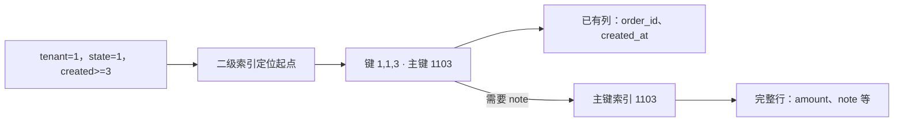

# 组合索引与访问路径：执行计划说明了什么

订单页想显示“租户 1、状态 1、创建序号至少为 3”的订单。表上已经有 `(tenant_id, state, created_at)` 索引，于是很容易得出两个过快的判断：查询有这三列就会很快；计划中出现索引名就说明已经优化好了。

先把问题拆开：从哪里开始找，扫过多少候选项，在哪里筛选，是否再取完整行，怎样得到要求的顺序，为什么优化器选择这条路。**“用了索引”只回答了其中一部分。**

本篇用固定的 36 行数据走完整条路。示例中的“应返回”先给出可手算的结果要求，再用一次真实 MySQL 8.4.7 运行核对。下面明确标注的实测只适用于本数据、源码、镜像与 linux/amd64 平台；计划选择会随条件和数据分布改变。[完整实验源码](/examples/mysql-mechanisms-lab.zip)与[已独审的执行摘要](/examples/mysql-mechanisms-verification.json)分别提供源码和运行身份，结果表见末尾。

## 1. 索引排列的是哪一组键

`orders` 的主键是 `order_id`，二级组合索引是 `(tenant_id, state, created_at)`。`created_at` 在这个教学表中是整数序号，不是时区日期，以便只讨论访问路径。`state` 的数字也仅为固定输入。

```sql
CREATE TABLE orders (
  order_id INT NOT NULL PRIMARY KEY,
  tenant_id INT NOT NULL,
  state TINYINT NOT NULL,
  created_at INT NOT NULL,
  amount INT NOT NULL,
  note VARCHAR(64) NOT NULL,
  KEY idx_tenant_state_created (tenant_id, state, created_at)
) ENGINE=InnoDB;
```

这是完整实验 `sql/schema.sql` 中的订单表定义，原创教学 SQL。种子数据把 `tenant_id ∈ {1,2}`、`state ∈ {0,1,2}`、`created_at ∈ {1,…,6}` 做笛卡尔组合。主键计算为 `tenant_id × 1000 + state × 100 + created_at`；例如 `(1,1,3)` 的订单为 `1103`。

在 InnoDB 中，聚簇索引的叶记录包含行数据，二级索引记录带有主键值。沿二级索引读到 `1103` 后，可以再用该主键定位完整行。不要把这里的“回表”理解为按文件偏移取行，也不要把主键太长对每个二级索引的空间影响漏掉。[聚簇索引与二级索引](https://dev.mysql.com/doc/refman/8.4/en/innodb-index-types.html)



图表示两条可能的取值路径。是否真的只读二级索引，还要考虑查询列和事务可见性，不能由“列都在索引里”推导每种并发状态下都完全不访问聚簇记录。

## 2. 等值前缀怎样变成一个连续区间 {#equality-prefix}

这个索引按元组顺序排列：先比较租户，租户相同再比较状态，状态也相同才比较创建序号。把租户和状态固定后，剩余的创建序号是连续有序的一段。这是左前缀能支持定位的原因。[组合索引](https://dev.mysql.com/doc/refman/8.4/en/multiple-column-indexes.html)

本例的局部顺序是：

| 二级键 | 主键 | 与查询的关系 |
| --- | --- | --- |
| `(1,0,6)` | 1006 | 状态不同，在目标区间之前 |
| `(1,1,1)` | 1101 | 创建序号太小 |
| `(1,1,2)` | 1102 | 创建序号太小 |
| `(1,1,3)` 到 `(1,1,6)` | 1103 到 1106 | 目标区间 |
| `(1,2,1)` | 1201 | 状态不同，在目标区间之后 |

因此固定前缀 `(1,1)`、下界 `created_at>=3` 时，可以定位到这段的开头，再顺序读到前缀结束。这里不需要先扫完租户 1 的所有状态。至于实际执行是否选择这个区间，需要再看优化器。

下面三个完整 SELECT 来自 `sql/access_paths.sql`。第一个保留正常选择；后两个**人为限制为指定索引**，用来比较覆盖列与新增列，不代表推荐把 FORCE INDEX 写入所有业务查询。

<!-- snippet: mysql-mechanisms.access-paths -->
```sql steps
-- !step(1:4) 先让优化器自由选择；输入是同一固定数据，结果要求是1103到1106及其创建序号。
-- !step(6:9) 人为约束候选索引，便于对照访问结构；它不能证明正常查询本来就会选择这条路径。
-- !step(11:14) 增加索引未保存的note；逻辑行集不变，但取值通常还要访问聚簇记录。
SELECT order_id, created_at
FROM orders
WHERE tenant_id = 1 AND state = 1 AND created_at >= 3
ORDER BY created_at, order_id;

SELECT order_id, created_at
FROM orders FORCE INDEX (idx_tenant_state_created)
WHERE tenant_id = 1 AND state = 1 AND created_at >= 3
ORDER BY created_at, order_id;

SELECT order_id, created_at, note
FROM orders FORCE INDEX (idx_tenant_state_created)
WHERE tenant_id = 1 AND state = 1 AND created_at >= 3
ORDER BY created_at, order_id;
```

前两条必须得到 `1103/3、1104/4、1105/5、1106/6`；第三条还分别包含 `t1-s1-d3` 到 `t1-s1-d6`。实验逐值检查，而不是只看命令是否退出成功。去掉第一条的租户条件会额外出现租户 2 的记录，这是一个真正改变结果的错误 SQL；没有“更漂亮”的执行计划能修复这个语义错误。

本次三条查询的实际行集都符合上述要求。无 hint 的第一条自然选择 `idx_tenant_state_created` 的 `range`，`used_key_parts` 包含三列，`using_index=true`，没有额外 filesort；后两条的 FORCE INDEX 约束仍须保留在解释中，不能反过来拿它们证明优化器的自由选择。[本次结果与计划](/examples/mysql-mechanisms-observations.json)

## 3. 范围之后的列仍然有作用 {#range-and-filter}

将条件改成：

```sql
SELECT order_id
FROM orders FORCE INDEX (idx_tenant_state_created)
WHERE tenant_id=1 AND state>=1 AND created_at=3
ORDER BY order_id;
```

能沿索引限制到租户 1、状态至少 1 的区域，但这块区域包含 `(1,1,1)` 到 `(1,1,6)`，也包含 `(1,2,1)` 到 `(1,2,6)`。`created_at=3` 不会神奇地把它们排成一个没有空隙的连续小区间；本例结果应只有 `1103、1203`。

对于这类 BTREE 范围构造，前面的等值部分可继续展开键，遇到范围比较后，后续键通常不再用于同一个范围的进一步边界构造。**不再参与这个定位边界，不等于条件失效**。它仍必须被检查。[多列范围构造](https://dev.mysql.com/doc/refman/8.4/en/range-optimization.html)

筛选发生在哪一层则是另一个问题：

- 范围扫描先枚举候选索引项
- 能只用二级索引字段判断的部分，在满足适用条件时可经 ICP 下推给存储引擎，减少读取完整行
- 其余条件在取得所需列后检查；不符合的候选项不会进入最终结果

ICP 常用于还需要取完整行的二级索引访问。它不是把索引重新排列，也不是让范围之后的列重新成为连续定位前缀。本篇的 `range-residual` 查询只选已有列，不能因为它含“范围后的条件”就预告一定出现 `Using index condition`。[ICP 的条件与步骤](https://dev.mysql.com/doc/refman/8.4/en/index-condition-pushdown-optimization.html)

再删掉租户条件，查询 `state=1 AND created_at=3`。匹配项分散在每个租户段中，不具有普通左前缀的一次连续定位形状。不过执行器仍可能扫描完整索引；符合严格适用条件时还可能采用 skip scan，为不同前导值做子范围查找。skip scan 受查询形状、覆盖列、范围条件与成本影响，**不是任意缺前缀查询的保证**。本实验记录该普通查询的实际选择，只断言其结果为 `1103、2103`，没有把“必须全表扫”设成测试答案。[Skip Scan 适用条件](https://dev.mysql.com/doc/refman/8.4/en/range-optimization.html#range-access-skip-scan)

真实记录给出了这个边界的具体例子：`range-residual` 的 `used_key_parts` 是 `tenant_id、state`，`created_at` 留在 `attached_condition`；缺 tenant 的普通查询则出现了 `using_index_for_skip_scan=true`，返回 `1103、2103`。两者都有 filesort。前者的 `key_length` 仍为 9，尤其不能只按这个长度推断每个条件都构成了精确定位边界；后者说明“缺左前缀必然不使用组合索引”过于绝对。这里只观察到这一份小数据上的选择，没有证明其他缺前缀查询也会 skip scan。[完整计划字段](/examples/mysql-mechanisms-observations.json)

## 4. 覆盖、ICP、排序分别在节省什么 {#covering-and-sort}

| 机制 | 本例中的问题 | 不说明什么 |
| --- | --- | --- |
| 索引定位 | 能否较直接到达租户 1 / 状态 1 的起点 | 不能说明候选数很少 |
| 覆盖机会 | SELECT、过滤和排序所需值能否从所用索引取得 | 不能无条件保证无聚簇访问或无物理 I/O |
| ICP | 在读完整行前能否先淘汰索引条件不匹配项 | 不等于覆盖读取 |
| 利用索引顺序 | 读出次序是否满足明确的 ORDER BY | 不说明 WHERE 已全部过滤完 |
| 额外排序 | 对候选结果安排要求的顺序 | filesort 这个名字本身不证明已经写磁盘 |

固定 `tenant_id=1 AND state=1` 后，索引剩余顺序可对应 `created_at,order_id`，因为二级项含主键。如果改成 `tenant_id=1 AND state>=1 ORDER BY created_at,order_id`，扫描次序先走状态 1 的 1…6，再走状态 2 的 1…6；要求的次序却是日期 1 的两个状态，再日期 2 的两个状态。**按状态分段有序，不等于跨状态按日期有序**。这解释了为什么同一个索引可帮助过滤，却未必消除排序。[ORDER BY 优化](https://dev.mysql.com/doc/refman/8.4/en/order-by-optimization.html)

查询增加 `note` 时，所选二级索引没有该值，需要额外取行；若命中范围很大，大量这类访问也许比直接读表再排序成本高。覆盖索引能降低部分取值成本，但把所有大字段都塞进索引，会扩大索引、占用缓存，并增加修改时的维护工作。是否值得，要从真实查询集合与写入频率判断。[InnoDB 索引布局](https://dev.mysql.com/doc/refman/8.4/en/innodb-index-types.html)

本次强制非覆盖查询确实出现 `index_condition`，而前两条覆盖查询为 `using_index=true`。这支持把 ICP 与覆盖分开阅读；记录没有测量聚簇页访问次数或物理 I/O，因此不能由这几个字段计算“回表到底多贵”。跨 state 的普通查询也确实出现 filesort，返回顺序为 `1101、1201、1102、1202……1106、1206`。[本次字段与行序](/examples/mysql-mechanisms-observations.json)

还有事务可见性这个限制：即使所需用户列都在二级索引中，某些删除标记或较新修改状态仍需要访问聚簇记录并检查版本。“覆盖”因此适合描述可从索引取得列的访问机会，而不是对所有事务情形的物理访问次数承诺。[二级索引与 MVCC](https://dev.mysql.com/doc/refman/8.4/en/innodb-multi-versioning.html) · [读取边界](../transactions/mvcc-read-views.md)

## 5. 读执行计划时先提出五个问题 {#read-plan}

实验对每条查询执行 `EXPLAIN FORMAT=JSON`，原始 JSON 保留，不只截取 `key`。读者可以按下面顺序检查：[EXPLAIN 字段](https://dev.mysql.com/doc/refman/8.4/en/explain-output.html)

1. 访问方法是什么：表扫描、完整索引扫描、ref、range，还是其他方式？`index` 可表示完整索引扫描，并非“只碰到了几条”
2. 选择了哪个索引，哪些键部分构成访问边界？`possible_keys` 是候选线索；`key` 是这次选择；`key_len` 不是“每个 WHERE 条件都已精确定位”的证明
3. 哪些条件留在扫描中或扫描之后检查？把范围缩小与过滤淘汰分开
4. 哪些列从索引取得，是否需要其他取值，是否另有排序操作？
5. 估计会读、产出多少行？估计来自输入与统计，不是实际计数

`rows`、`filtered` 或 JSON 中的估计行数字段，不是执行结果。反过来，结果只有四行，也不说明执行只访问了四条候选记录。完整扫描再过滤可以产生完全相同的四行。

实验另执行 `EXPLAIN ANALYZE`，它会真的运行隔离表上的 SELECT，返回迭代器的实际行数、循环次数及时间。树中父节点时间包含子节点工作，不能简单把所有节点时间相加；多次循环的数字也须按其定义理解。不要在未知代价或有副作用的生产语句上把 ANALYZE 当作“只查看计划”。[EXPLAIN ANALYZE 的执行与指标定义](https://dev.mysql.com/doc/refman/8.4/en/explain.html#explain-analyze)

本次 ANALYZE 运行的是带 FORCE INDEX 的覆盖 SELECT。树中覆盖索引范围扫描及其上方过滤节点都显示估计 `rows=1`、实际 `rows=4`、`loops=1`；普通无 hint 查询的 JSON 估计则是 4 行。这里已经能看到“估计”和“观察”的区别。原始树保留在[结果表](/examples/mysql-mechanisms-observations.json)，其中微小耗时和估算 cost 不用于性能排名，也不足以判定估计差异的唯一内部成因。

## 6. 可用的索引，为什么没有被选择 {#optimizer-choice}

结构允许某条访问路径，只说明它是候选。优化器还需要比较预计成本。以下改变都值得重新观察：租户 1 的占比从很小变成大多数；条件由单个状态变成几乎全部状态；SELECT 增加未覆盖的大字段；LIMIT 与排序组合变化；统计信息发生更新。

本实验种子只有 36 行，优化器选择扫描也可能合理。`ANALYZE TABLE orders` 用于刷新教学数据的统计，随后保留 `SHOW INDEX` 和普通查询的计划，但**不把统计估计、采样结果或一次最优选择写成永久定律**。持久统计通常提高跨启动稳定性，也不消除数据分布变化与估计偏差。[持久优化器统计](https://dev.mysql.com/doc/refman/8.4/en/innodb-persistent-stats.html)

FORCE INDEX 改变优化器可选空间。若受约束查询比普通查询显得“更符合教材图”，这个差异本身就是应当解释的观察，而不能删掉普通计划。MySQL 8.4 的部分形状甚至可能因 FORCE INDEX 而改变索引探测估计的处理；因此受约束计划不是普通计划的无成本同义写法。[范围估计与 FORCE INDEX](https://dev.mysql.com/doc/refman/8.4/en/range-optimization.html)

可以用一个具体决策来替代“最左匹配口诀”：业务最常见的是按租户与状态取最近记录，就评估这个前缀；如果常按跨状态日期取记录，也评估 `(tenant_id, created_at, …)` 的候选，并考虑原查询损益、索引空间与写入成本。实验没有添加第二个索引或测量两者性能，这只是下一步可证伪的设计问题。

## 7. 改变条件练习 {#exercises}

**题 1：** 原查询结果只有四行。能否推出 `rows_examined` 也一定是四？

<details>
<summary>参考推理</summary>

不能。结果行数在过滤之后；执行可能扫描更多候选项。先看访问路径、残余条件，再看真实执行的迭代器计数。索引缺少边界条件、排序或可见性处理都使“返回四行”不足以解释访问量。

</details>

**题 2：** 将 `state=1` 改成 `state>=1`，仍要求 `ORDER BY created_at,order_id`，为什么需要重新检查排序？

<details>
<summary>参考推理</summary>

状态不再是常量。索引按状态分段，段内日期有序，跨段不满足全局日期顺序。观察实际计划是否额外排序，并核对真实结果顺序：1101、1201、1102、1202……而不是1101到1106后接1201到1206。

</details>

**题 3：** 去掉 tenant 条件后，计划仍显示同一个索引名，可以算优化成功吗？

<details>
<summary>参考推理</summary>

先检查语义。原请求只属于租户1，漏条件会返回租户2的数据。索引无法弥补授权或过滤条件缺失。实验变体须因真实行集多出2103至2106而触发指定断言；SQL语法错误和数据库未启动不能作为这个反例的成功证据。

</details>

**题 4：** 增加 `note` 后为保持覆盖而把 note 加入索引，一定值得吗？

<details>
<summary>参考推理</summary>

不一定。评估note宽度、更新频率、命中范围、查询频率、缓存与存储预算。可以先减少查询列、缩小范围、分页，或接受有限回表。不能用这份36行教学数据做生产性能排序。

</details>

## 验证状态与复现附录 {#verification}

**本次真实执行已通过独立证据审计；正文仍处于 review。**[run 37102894207 / attempt 1](https://github.com/weilhuang/wiki/actions/runs/37102894207)在标准 GitHub Ubuntu runner 上运行官方 MySQL 8.4.7，平台 linux/amd64。以下是固定 36 行输入的观察，不是对其他数据或版本的计划承诺。[可长期随教材保存的执行摘要](/examples/mysql-mechanisms-verification.json)与[逐值结果表](/examples/mysql-mechanisms-observations.json)绑定同一运行。

| 查询记录 | 实际返回 | 本次执行计划观察 |
| --- | --- | --- |
| ordinary-covering，无 hint | 1103/3、1104/4、1105/5、1106/6 | 自然 range；三个 used_key_parts；using_index=true；无 filesort |
| constrained-covering，FORCE INDEX | 与普通查询相同四行 | range、覆盖、无 filesort；ANALYZE 估计1、实际4、loops=1 |
| constrained-noncovering，FORCE INDEX | 同四行，加 t1-s1-d3 至 t1-s1-d6 | range；有 index_condition；需要索引未保存的 note |
| range-residual，FORCE INDEX | 1103、1203 | used_key_parts 为 tenant_id/state；created_at 在 attached_condition；有 filesort |
| missing-left-prefix，无 hint | 1103、2103 | range；using_index_for_skip_scan=true；有 filesort |
| cross-state-sort，无 hint | 1101、1201、1102、1202……1106、1206 | range；有 filesort；实际顺序按创建序号交错 |

漏租户变体实际返回八行：`1103/3、2103/3、1104/4、2104/4、1105/5、2105/5、1106/6、2106/6`，在 `index.ordinary-covering.rows` 被精确拒绝并退出42。故意拼成 `SELEC` 的控制单独产生 MySQL 1064、`SQL_FAILURE`、退出43；它没有业务断言，未计作语义反例。

<details>
<summary>完整源码、执行身份与未覆盖项</summary>

[下载源码 ZIP](/examples/mysql-mechanisms-lab.zip)，包含SQL、有限Python驱动、声明式单节点环境、源SHA清单与MIT许可，不含数据库镜像、数据卷或运行日志。Code Hike 两组SQL直接绑定下载包文件。原 ZIP 的16个成员已逐字核对冻结 harness-r4、源SHA及已审远端 Git blob，见[源码 ZIP 绑定清单](/examples/mysql-mechanisms-source-binding.json)。包内 README/source-manifest 的 not-run 是运行前冻结时的状态，特意保留原字节；当前执行状态以独立绑定的公开摘要为准。

本次实际 checkout 为 `44a2821a2782057b039e5511dd84f092c745be2c`，冻结源 manifest SHA256 为 `e787bedb50929fd0a05c11c7c52ec643896a271129da27c3cfe3bc2ca8460e0f`。请求标签 `mysql:8.4.7`，本次实际镜像 RepoDigest 为 `mysql@sha256:0426ec38c7a10aa45ba383887df7878f74ee70e2fd589c7b69207f3577901903`；标签本身不是不可变 digest 锁定。完整 head/base、镜像 ID、trace SHA 与19条命令的结果范围在公开摘要中。

本轮无主机端口、内部网络、随机专用项目，1 GiB / 1 CPU / 256 pids，有命令和总时限。正常模式39条业务断言通过，三个指定语义变体退出42，语法控制退出43；所有会话正常关闭，该项目的容器、卷、网络清理后查询为空。执行证据批准不替代正文审查或站点验收。

源码 ZIP SHA256 是 `3af92ecbaadbd5a1db4a22612d92e5b21a7cc63bb6d91a085e899fb474d11f1e`；CI证据 ZIP SHA256 是 `6b2ce2dc761d863e7f30675c4a1c397e806e993f9ed04c7a6d0b682cf5d22ffa`。两者用途和内容不同。审计时 GitHub artifact 的到期时间为2026-10-06 06:24:02 UTC，临时下载不能当作永久档案；教材内的摘要和逐值结果表保留已核对的必要事实，详细原始日志仍由本次CI证据追溯。

本篇不验证统计采样的所有路径、所有skip scan条件、页级物理I/O、缓存冷热差异、性能排名、主从复制、分区、崩溃恢复或跨版本计划稳定性。

</details>
