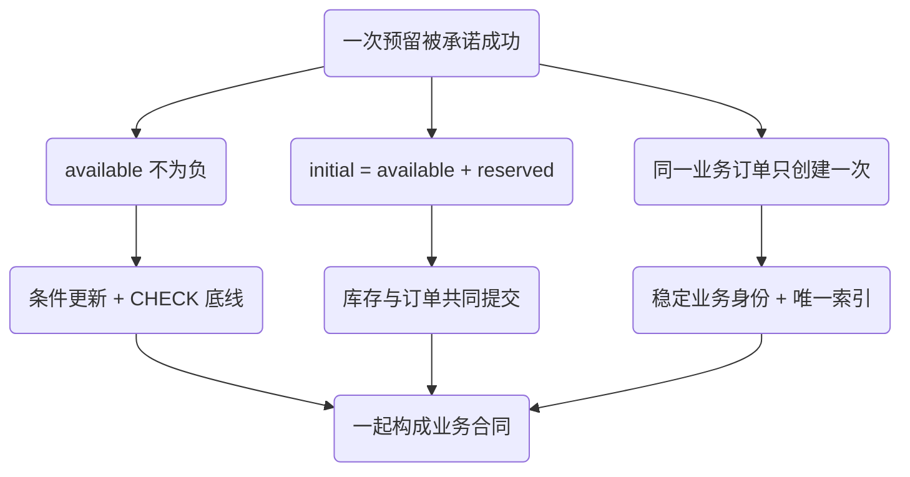
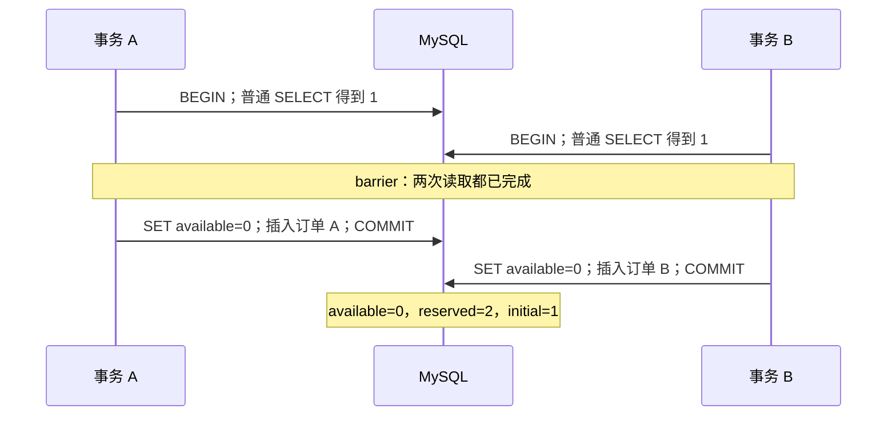
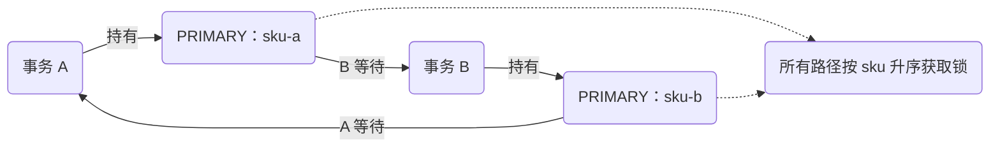

# 并发不变量与隔离：库存为什么会被两个请求同时看见

库存只有一件，两个请求都返回“预留成功”，数据库里的库存却没有负数。这不是一个只有在高并发压测中才能遇到的谜题。两个会话、两次读取和两次提交，就足以稳定构造它。

判断事务是否正确，不能只问“有没有开启事务”，也不能只看 `available >= 0`。本章先把业务承诺变成数据库可以检查的命题，再逐个选择读取和写入机制。目标是能预测交错、构造反例、解释修复覆盖的边界，而不是记住“库存要加锁”这个答案。

## 阅读准备与证据边界

需要会写 SQL、知道提交与回滚、能区分两个独立连接。若事务入口由框架管理，可先读 [Spring 事务调用链](/knowledge/frameworks/spring-transactions/proxy-call-chain.html)；本章不重复代理与线程绑定。

实验固定为版本台账中的 **MySQL 8.4.7、InnoDB、REPEATABLE READ**。每个会话显式设置隔离级别与 `autocommit=1`，需要事务时执行 `START TRANSACTION`。普通读的比较条件不借用 H2、SQLite 或内存字典来证明。Redis 在本章不参与结论。

[下载路径共同实验](/examples/data-consistency.zip)，在解压目录运行 `bash run.sh d1`。需要已获准使用的 Docker Engine、Compose V2、Bash 和 Python 3.11+；脚本不替你安装工具。它只创建随机命名的独立容器，不映射数据库端口，完成后清理本次项目。完整入口、参数、原始日志与清理方式见项目 README。

本节实验已在文中所列范围运行；源码下载及历史验证记录见文末附录。

## 1. 正确性先有名字，才有可选机制

共同模型只有 `inventory`、`orders` 和后续章节使用的操作与事件表。初始库存 `initial_qty=1`，订单成功意味着预留一件。当前实验没有补货、取消、退款或跨仓转移，因此需要同时维护：

- 非负：任一 SKU 的可用库存不小于零
- 守恒：初始库存 = 可用库存 + 所有 `reserved` 订单的数量之和
- 唯一：一个稳定业务订单只能被创建一次；订单与库存变化必须共同提交

第三条的重试协议在[相关机制](/knowledge/distributed/reliable-interactions/idempotency.html)实现。本章先使用不同业务订单，排除“只是同一请求重试”的解释。



`CHECK (available >= 0)` 很有用，但它无法检查另一张表里已经许诺出去多少件。把可用库存写成零两次都满足 CHECK；它不会理解第二张订单已经超卖。这就是为什么“表里没有负数”只是局部证据。

共同项目的 `sql/reconcile.sql` 以左连接汇总订单，检查守恒。左连接和 `COALESCE` 不能省：没有订单的 SKU 也要接受检查。生产模型若加入取消与补货，应先改守恒式，明确哪些状态算占用，而不是机械套用本章查询。

## 2. 最短反例：每条 SQL 都成功，业务仍然失败

错误实现把读取的库存放到应用变量 `old`，判断充足后执行 `UPDATE ... SET available=old-1`。两个普通 SELECT 都读到一，随后分别写入零，并各自插入一张订单。



这不是“更新完全没加锁”。InnoDB 写入会获取相关锁，两个 UPDATE 仍然先后执行；问题在于第二个写入表达式已经把旧观察变成了常量零。写入时的互斥没有重新验证业务决定。把数据库隔离从 READ COMMITTED 改成 REPEATABLE READ，也不会自动替应用重新算一次 `old-1`。

`D1.naive_lost_update` 明确等两个 SELECT 都返回之后才释放后续写入。其成功条件恰恰是检测到坏结果 `available=0, reserved=2`。如果测试只断言两个请求都没有异常，它会把反例误判为正确。

## 3. 普通读取的“可重复”，并不意味着库存仍可出售

在本实验 RR 事务内，首次一致性读取建立快照；后续普通 SELECT 通常继续读该快照，并能看到事务自身的写入。它回答“这个视图里有什么”，不是替当前预留占有库存。RC 则为每次一致性读取建立较新的视图。这些边界来自 [MySQL 8.4 一致性非锁定读取文档](https://dev.mysql.com/doc/refman/8.4/en/innodb-consistent-read.html)。

`D1.snapshot_vs_current` 先让 A 读到一，另一个连接把库存更新为零并提交。A 的普通 SELECT 仍预期得到一，随后 `SELECT ... FOR UPDATE` 预期得到零。两个结果出现在同一事务内，不意味着数据库随机返回数据，而是访问机制不同。

业务代码尤其不能把先前普通 SELECT 的结果当作随后 UPDATE 必须使用的全局事实。即使你选择 RC，在读取返回与写入开始之间，另一个请求仍可能提交；更“新”的快照不会消除这段时间。

需要基于读取结果再修改时，可在显式事务内选择锁定读。其锁在提交或回滚时释放；如果把 SELECT 与 UPDATE 分在两次自动提交语句里，SELECT 的保护不会横跨应用判断。锁定读的前提与 `NOWAIT`、`SKIP LOCKED` 的适用范围见 [MySQL 8.4 Locking Reads](https://dev.mysql.com/doc/refman/8.4/en/innodb-locking-reads.html)。本章没有把跳过被锁记录当成“库存不存在”。

## 4. 两种修复，各自把判断放在哪里

### 方案一：条件与扣减成为一条写语句

核心 SQL 是 `UPDATE inventory SET available=available-1 WHERE sku='sku-a' AND available>=1`。真正的裁决是影响行数：一行才代表拿到库存，零行意味着条件未满足，不能继续插单。

下面是完整项目 `D1.conditional_update` 的关键片段。Code Hike 步骤突出控制点；连接创建、异常处理和结果记录都在下载项目里，无需拼装此片段。

```python steps
# !step(1:2) A 先修改库存并持有事务锁；影响一行才允许后面的订单写入。
# !step(3:5) B 发出同一条件更新，但测试不靠 sleep 猜它是否阻塞，而是等待真实引擎等待边。
# !step(6:8) A 把订单与扣减一起提交；B 继续后影响零行，必须结束失败分支，不得插入订单。
a.query("START TRANSACTION")
require(a.query("UPDATE inventory SET available=available-1 WHERE sku='sku-a' AND available>=1; SELECT ROW_COUNT()") == ["1"])
b.query("START TRANSACTION")
b.send("UPDATE inventory SET available=available-1 WHERE sku='sku-a' AND available>=1; SELECT ROW_COUNT()")
self.wait_for_lock(b.cid)
a.query("INSERT INTO orders VALUES ('ca','conditional','ca','sku-a',1,'reserved',1); COMMIT")
require(b.receive() == ["0"])
b.query("ROLLBACK")
```

这是一件 SKU、一个简单条件下的好方案：往返少、判断和写入靠近。不过不要把它扩写成“任何复杂订单只需一条 UPDATE”。多 SKU、促销额度、用户限购等不变量可能跨多行，需要共同锁顺序、唯一约束或更完整的事务设计。

### 方案二：先锁住，再根据当前值决策

`D1.locking_read` 让 A 用主键等值 `FOR UPDATE` 读到一；B 同样的读取必须等待。A 插单与扣减一起提交后，B 预期读到零并拒绝。这个方式允许你在锁内检查多个相关字段，代价是多一次往返、应用判断期间持锁，以及更容易无意夹带远程调用。

“先锁”并不等于“越早越好”。锁内只放维护本地不变量必需的工作；查询商品图片、发送通知、调用支付都不属于本实验的原子边界。锁持有时间放大时，线程池和连接池可能先于数据库 CPU 耗尽。

## 5. 锁的是索引访问，不是 WHERE 的中文含义

本章 schema 的 `sku` 是主键，因此精确命中已有 SKU 的等值锁定读，与扫描库存区间不是同一个锁范围。缺索引、非唯一条件或范围扫描可能接触更多索引记录；在 RR 下还要考虑 next-key / gap 的作用。不要只凭 SQL 看上去“只查一个商品”就预测锁数量，需把 schema、执行计划与实际锁记录放在一起。细节可核对 [不同 SQL 设置的 InnoDB 锁](https://dev.mysql.com/doc/refman/8.4/en/innodb-locks-set.html)。



死锁实验先让双方各持有一行，再确认 A 等待 B，最后让 B 请求 A。测试只要求恰有一个 `1213`，不假定总是 B 被选中。固定锁顺序可以减少这类环，却不免除处理死锁的义务：其他索引、外键检查、其他事务路径也会参与等待。

默认锁等待超时与死锁的回滚范围并不应混为一谈。本项目捕获异常后显式回滚整个业务事务，不在残留事务状态上继续插单；重试需要重走完整读取与写入，并有次数、总时限与业务幂等约束。[InnoDB 错误处理](https://dev.mysql.com/doc/refman/8.4/en/innodb-error-handling.html)区分语句回滚与事务回滚，[死锁处理建议](https://dev.mysql.com/doc/refman/8.4/en/innodb-deadlocks-handling.html)说明了短事务和一致访问顺序的作用。

## 6. 从故障现象走到下一条证据

看到“请求很慢”，先保留请求标识、connection ID、事务开始时间和正在执行的 SQL。若 `data_lock_waits` 有对应等待边，先定位持有者及其事务内工作；若没有，不能直接宣布没有数据库问题，还应检查连接池排队、执行计划与 I/O。实验中的等待证明来自 [Performance Schema 的 data_lock_waits](https://dev.mysql.com/doc/refman/8.4/en/performance-schema-data-lock-waits-table.html)，不是应用线程停在 JDBC 就算锁等待。

看到库存没有负数但订单数量异常，优先跑守恒查询，再检查原子条件是否读取了影响行数、订单是否与扣减共用事务、稳定业务身份是否缺失。看到 1213，保留死锁图并按资源顺序还原循环；单纯延长超时不消除循环。

`results/<run-id>/trace.jsonl` 保存语句、行数和等待证据；`result.json` 保存用例判定；容器日志与 `SHOW ENGINE INNODB STATUS` 帮助检查失败分支。日志仅含实验生成数据，不能把生产订单、凭据或客户资料拷进公开证据包。

### 在改 SQL 之前，把实验输入固定下来

一次可比较的运行至少固定四件事：初始库存和订单集合、两个连接的事务设置、表的主键与二级索引、双方到达屏障的次序。项目入口记录版本、自动提交、`SHOW CREATE TABLE` 和各 case 夹具装载前的基线 `EXPLAIN`；这份基线不代表每个具体交错在已装载数据上的执行计划。等待用例另外记录实际锁对象与索引；进一步比较锁范围时，应在相同已装载数据上补采执行计划。若某次实验悄悄少了索引，等待范围改变以后，就不能把性能差异全部归因于隔离级别。

不要把观察查询混进业务事务来“帮助同步”。如果测试偷偷先执行了一次 `FOR UPDATE`，再声称普通 SELECT 的实现没有超卖，实际上已经换了被测算法。项目中名为 observer 的连接是独立的辅助会话：在锁等待用例中查询引擎等待边和最终数据；在 `D1.snapshot_vs_current` 中，它还按预定步骤执行第二个写入者的 UPDATE，提交库存变化后再让 A 比较两种读取。它不是全程只读连接。这些动作不向被测业务事务额外加入锁定读；使用等待屏障的用例也只有在对应连接的真实等待关系出现后才释放持锁者。

还要区分安全与公平。条件更新保证剩余库存不足时不继续预留，却不承诺每个排队请求都按到达顺序获得库存。热点行上持续有新请求时，延迟与饥饿风险要另外测量。把全部请求串行化能降低某些交错复杂度，但也可能成为吞吐瓶颈；只增加应用线程数通常会增加等待者，而不是增加那一行能被修改的速度。

最后检查影响行数的业务解释。本例成功扣减一件必然改变 available，所以一行与零行含义明确。如果改成可能不改变值的 UPDATE，客户端“匹配行数”和“实际改变行数”的选项差异也要进入合同，不能把本章的判断机械移植到任意更新语句。

## 7. 练习：从会解释，到能评审

**机制练习。** 把错误实现改成 `available=available-1`，却保留先前普通 SELECT 的充足判断，删掉 UPDATE 的条件。预测第二次写入会发生什么，再写能识别该错误的测试。参考推理：旧判断仍失效；本 schema 的非负 CHECK 应使第二次扣减失败，不能把约束错误吃掉后照样返回成功。评分看是否同时断言异常、订单数与事务回滚，而不是只预测库存值。

**设计练习。** 一个订单预留三个 SKU，两个请求的输入顺序相反。提交 ADR 比较“统一排序逐行锁定”与“逐条条件更新、任一步失败整体回滚”。写出锁顺序、失败响应、完整事务重试预算，以及热点 SKU 的延迟成本。合格答案必须承认两个方案都需要幂等边界，并指出哪些远程工作要移出事务；不能用“加分布式锁”跳过本地不变量。

本章结束时，你应能交出不变量、最短反例时序、两种修复与实际证据包。接下来面对更难的情况：数据库已经正确提交，但调用方没收到结果，此时[幂等协议](/knowledge/distributed/reliable-interactions/idempotency.html)才决定第二次请求能不能安全进入这些 SQL。


<details class="verification-appendix">
<summary>实验附录：运行方法、历史记录与未覆盖范围</summary>

MySQL 8.4.7 / InnoDB / REPEATABLE READ 的五个用例已通过，覆盖朴素更新反例、条件更新、锁定读、快照对照和死锁；正文的预期值已与本次原始结果核对。没有把 H2 或内存模拟当作数据库证据。 绑定 [CI run 36991587537](https://github.com/weilhuang/wiki/actions/runs/36991587537)，精确源码、镜像身份、二十三项结果与已核验警告见[持久验证摘要](/examples/data-consistency-verification.json)。这是一次有界实验通过，不是压力、复制、故障切换或外部副作用认证。

下载包保留源码冻结时的 `README` / `RESULT-CONTRACT`，其中的 **NOT_RUN 是历史状态**。冻结源码随后完成了这次 CI；包内文件与 ZIP 没有因状态更新而修改。请结合本摘要阅读，不要把包内旧说明当作当前结果，也不要把真实 CI 的结果外推到未测范围。

</details>
