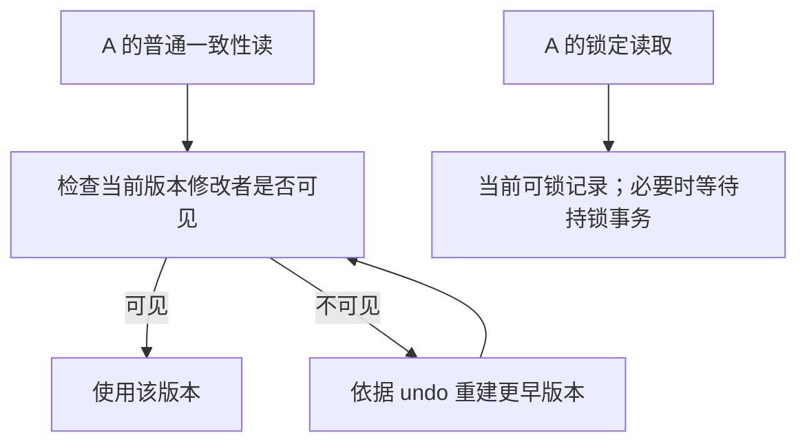
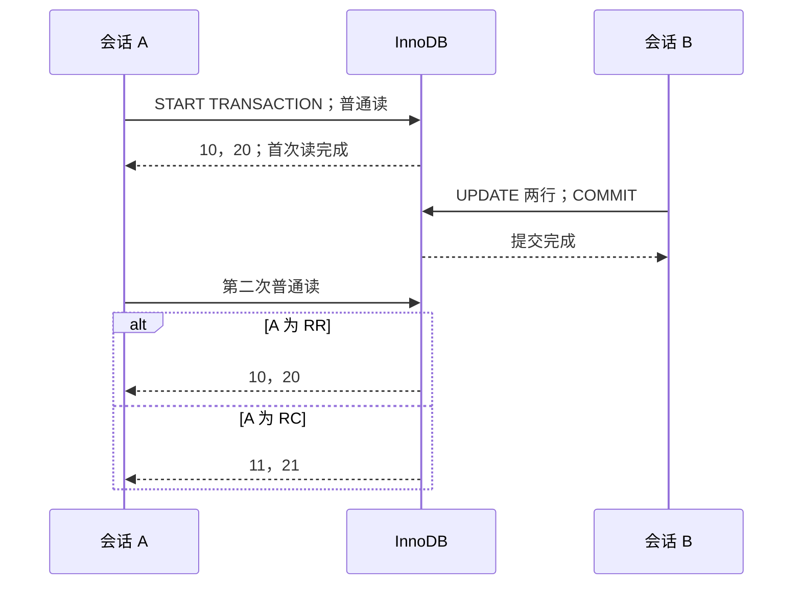

# MVCC 的读取边界：快照、当前读与写入

事务 A 先读库存 10。事务 B 把库存减到 7 并提交。A 再执行一次普通 SELECT，仍看到 10；如果 A 改为 `SELECT ... FOR UPDATE`，可能读到 7。接着 A 写入减 2，再普通读，看到的又是 5。

这些结果并不矛盾：**同一事务里的不同操作不一定使用同一种读规则**。理解 MVCC 不是把“事务开始时拍照，之后永远不变”背下来，而是问这条语句使用哪个视图、遇到哪一个版本、是否加锁，以及本事务有没有写过它。

本篇先推导结果，再用明确的会话顺序核对一次真实 MySQL 8.4.7 运行。下面标注的实测限定于本源码、镜像、linux/amd64 平台和两行库存；教学图及内部事务号例子仍是机制模型。SQL、会话驱动与断言在[完整实验包](/examples/mysql-mechanisms-lab.zip)中，[独审执行摘要](/examples/mysql-mechanisms-verification.json)与[逐值结果表](/examples/mysql-mechanisms-observations.json)保留本次运行事实。

## 1. 视图决定可见性，undo 提供旧内容 {#read-view-and-undo}

一条记录被修改后，旧值不必立即失去读取机会。InnoDB 聚簇记录的事务标识与回滚指针，配合 undo，允许为一致性读重建需要的较早版本。这里有两个不同的问题：[InnoDB 多版本机制](https://dev.mysql.com/doc/refman/8.4/en/innodb-multi-versioning.html)

- Read View 判断某次修改对这个读者是否可见
- undo 中的信息帮助重建更早版本；它不是为每个事务复制一份整表



文字版：视图是可见性规则，版本链是找旧内容的路径。图只表示逻辑过程，未声称实验直接读取了内部字段或测量了遍历多少条 undo。

为什么不能只保存“当前最大的事务号”？因为更早分配事务号的事务可能仍未提交，而较晚分配号的另一个事务已提交。顺序并不等于提交顺序。`mysql-8.4.7` 的 `ReadView::changes_visible` 将创建者、两个边界与建立视图时的活跃读写事务集合组合判断。[固定标签 ReadView 源码](https://github.com/mysql/mysql-server/blob/mysql-8.4.7/storage/innobase/include/read0types.h)

可以用一个**教学抽象，非实际采集的内部状态**练习：活跃集合含100、108；低侧边界100，高侧边界120；当前读者自己的事务号111。修改者95在低边界前可见；100和108属于当时活跃者，不可见；105在两边界之间且不在活跃集合，可见；120及之后不可见；111走自己的修改例外。事务号用于理解判定，不是墙钟时间，也不能把每次 BEGIN 理解为立即按开始先后分配读写事务号。

源码字段 `m_up_limit_id` 与 `m_low_limit_id` 的英文命名容易读反。读代码时以比较式和注释为准：前者用于低侧“更小者可见”边界，后者用于高侧“达到或超过者不可见”边界。本文没有复制 GPL 源码片段，下载包中的SQL/Python均为原创；源码链接只支持这段机制解释。

## 2. 先固定实验输入和连接身份

库存表两行：`sku=1, available=10` 与 `sku=2, available=20`。有主键与 `available>=0` 检查约束。A、B 是两个持续存在的 MySQL 客户端连接，observer 是第三个独立观察连接。

所有读取两行库存的查询都明确 `ORDER BY sku`，从而行序可逐值比较。每个案例先回滚前一事务并重新设置隔离级别，再重置输入。连接的 `CONNECTION_ID()`、每条 SQL、返回行和屏障顺序都进入记录；重新启动CLI代替原连接会丢失事务状态，所以驱动不会对每一条SQL另开一次连接。

本篇中的“先后”是**前一步收到 MySQL 的完成响应后才发下一步**。B的COMMIT返回，才是A下一次读之前的提交屏障。一个固定 sleep、两个命令打印的时间戳或“应该已经执行了”，都不足以建立这个条件。

本次正常模式的真实 `CONNECTION_ID()` 为 observer=9、A=10、B=11；三个客户端在各案例之间持续存在。基线共记录125个SQL请求和对应响应。连接数字只是本轮身份，复现时可以不同；要核对的是三个连接确实不同、每个事务沿同一连接继续，以及响应和提交的顺序。

## 3. BEGIN 和第一次一致性读不是一回事 {#first-consistent-read}

默认 RR 下，普通事务的第一次一致性读建立后续一致性读使用的视图。事务开始时间与首次读的时间可能相隔很久。[一致性非锁定读](https://dev.mysql.com/doc/refman/8.4/en/innodb-consistent-read.html)

第一组安排中，A从未先读库存：

| 步骤 | A | B | 本次A的观察 |
| --- | --- | --- | --- |
| 1 | 设置RR，START TRANSACTION | 空闲 | 尚未读取 |
| 2 | 保持事务 | 把两行改为11、21并COMMIT | 尚未读取 |
| 3 | 第一次普通SELECT | 已提交 | 11、21 |
| 4 | ROLLBACK | 空闲 | 本例A无写入 |

如果把步骤1改为 `START TRANSACTION WITH CONSISTENT SNAPSHOT`，在RR中显式建立一致性快照，再让B提交同样修改，A第一次SELECT应得到10、20。不要将这个选项理解为把任意隔离级别强行改成RR；它不会改变隔离级别，其支持和效果取决于隔离设置。[事务开始与 WITH CONSISTENT SNAPSHOT](https://dev.mysql.com/doc/refman/8.4/en/commit.html)

本次普通 START 的首次读确为11、21（`begin.first-read-after-B`）；独立重置后，显式快照的首次读确为10、20（`explicit-snapshot.before-B`）。两组B更新都实际改变两行，`ROW_COUNT()` 为2，且收到提交响应后才读取。[对应断言](/examples/mysql-mechanisms-observations.json)

实际应用里，一条框架初始化查询如果恰好读取了InnoDB业务数据，可能改变“首次一致性读到底是哪条”的判断。排查时应查看完整SQL边界，不能只看业务代码中显眼的那个SELECT。另一方面，读取连接ID等元信息不能自动当作已经读过目标InnoDB表。

## 4. RR 与 RC 改变的是视图的复用边界 {#rr-and-rc}

第二组先让A真正读取10、20，再让B提交11、21：



图中的两条分支是独立重置数据后的两次实验。不是同一个正在进行的事务中途切换隔离级别。

| A隔离级别 | 本次第一次普通读 | 本次B提交后第二次普通读 | 结束事务后的检查范围 |
| --- | --- | --- | --- |
| REPEATABLE READ | 10、20 | 10、20 | A提交后实际再读11、21 |
| READ COMMITTED | 10、20 | 11、21 | A回滚；本案例未追加结束后读取 |

RR复用的是事务里普通一致性读的视图；RC为每条一致性读获取新视图。RC也不是“返回期间随时看到任意更新”：同一条一致性读仍有其语句视图。RR则不意味着所有种类语句都看同一历史数据，更不等同整个事务可串行化。[隔离级别说明](https://dev.mysql.com/doc/refman/8.4/en/innodb-transaction-isolation-levels.html)

实验中的错误变体把A的真实隔离级别从RR改成RC，但保留RR的结果要求。它必须在 `rr.repeat` 得到11、21而非10、20，才算击中这条断言。若MySQL没启动、会话丢失或SQL拼错，结果必须归为执行失败，不能算“证明RR和RC不同”。这也说明[验证反例](../../foundations/testing/assertion-counterexamples.md)要改变机制输入，而不只是抛一个异常。

本次变体确实在 `rr.repeat` 观察到11、21并退出42，正常RR则仍为10、20；两份记录都保留实际隔离设置、事务开始与B提交完成的帧。RC结束后若没有其他写入，新的普通读仍应看到11、21，这是机制推论，本次没有额外执行该读取。

## 5. 锁定读取不会把旧视图整体推进 {#locking-read}

第三组让A在RR中先读10、20。B把两行分别改为7、17并提交。A对sku1做主键锁定读取：

```sql
SELECT available FROM inventory WHERE sku=1 FOR UPDATE;
```

它应看到当前可锁记录的7。若目标被另一个未结束事务锁住，通常需要等待；历史版本不能被这样锁住。锁定读取依赖事务范围，获得的锁到COMMIT或ROLLBACK释放。[锁定读](https://dev.mysql.com/doc/refman/8.4/en/innodb-locking-reads.html)

此时A没有写入，只拿到了sku1的锁。如果再普通SELECT两行，应仍是10、20。FOR UPDATE不等于“把事务的所有快照更新到现在”。把这个结果代入一个检查流程：先普通读判断“够不够”，隔了很久才锁定行但不重读和复核，判断就可能已经过期。锁定后应依据锁定读取的值决定动作，或直接把约束放进原子更新。

本次按此顺序实际得到锁定读7，紧随的普通读仍为10、20，分别命中 `current.locking-value` 和 `current.does-not-refresh-view`。这里验证的是同一连接在尚未写入时的两种读规则，并未直接采样内部 Read View 字段。

“当前读”是方便的教学分类，不是“查询必然瞬间取得全库最新数据”的API。访问路径、锁范围、隔离级别和同时发生的写入都会影响它。本文只覆盖主键单行锁交接，没有把所有范围锁、间隙锁和phantom行为纳入实验。RC中UPDATE的半一致性检查还具有自己的细节，不能把一个简单SELECT模型搬到所有DML。[DML与隔离级别](https://dev.mysql.com/doc/refman/8.4/en/innodb-transaction-isolation-levels.html)

## 6. 自己写入以后，普通读不再像一张完整旧照片 {#own-writes}

在刚才A已锁住sku1=7的状态下，执行以下完整片段，来自 `sql/current_write.sql`：

<!-- snippet: mysql-mechanisms.current-write -->
```sql steps
-- !step(1:3) 在当前可写记录上减2；sku1当前为7，所以新值应为5，库存条件与修改放在同一条语句。
-- !step(4:4) 紧接更新读取本语句的ROW_COUNT，预期实际改变一行；不是靠无异常推断写入发生。
UPDATE inventory
SET available = available - 2
WHERE sku = 1 AND available >= 2;
SELECT ROW_COUNT();
```

现在A再普通SELECT：sku1应为5，sku2仍是20。这是**自己的最新修改，加上未被自己修改行的旧视图版本**。B已提交时的组合是7、17；A写完当前数据库里的组合是5、17；A看到的5、20可以不是数据库曾整体存在过的状态。[自己修改的可见性例外](https://dev.mysql.com/doc/refman/8.4/en/innodb-consistent-read.html)

| 操作完成后 | 本次A的普通读 | 本次另一个连接的普通读 |
| --- | --- | --- |
| A初次读取，随后B提交7、17 | 初次读10、20 | 此步未额外读取；B更新的ROW_COUNT为2 |
| A仅对sku1 FOR UPDATE读到7 | 再读10、20 | 此步未额外读取 |
| A把sku1从7减到5，未提交 | 5、20 | B读7、17 |
| A ROLLBACK | 未追加A读取 | observer读7、17 |
| A在新事务把sku1从7减到5并COMMIT | 未追加A读取 | B读5、17 |

表中只列实际发出的读取。回滚或新事务提交后，A若再开启新的普通读且无人继续修改，机制上也应看到对应的7、17或5、17；这两项没有冒充本次额外采集的结果。两次A相对更新的 `ROW_COUNT()` 都实际为1。

读自己的写入并不允许B读到A未提交值；“自己可见”和“提交后他人可见”是两个边界。实验必须分别检查，不用一个连接的结果替代另一个连接的观察。

这里还有一个关键反例：若A拿第一次读到的10，在应用内算出8，然后执行 `SET available = 8`，它可能成功覆盖B的修改。MVCC没有替你把业务计算自动变成“基于当前值减2”。实验的 `mutant-stale-write` 实际把表达式改成 `10 - 2`，必须在 `own.mixed-view` 观察到8、20而失败。使用行内相对更新、版本条件或锁后重读哪一种，取决于业务不变量；请继续[库存并发不变量](./inventory-invariants.md)。

本次错误变体确实写出8，`ROW_COUNT()` 仍为1，随后 `own.mixed-view` 返回8、20而被拒绝，退出42。它说明“更新成功且改变一行”不足以证明扣减依据正确；正常模式相同位置实际得到5、20。[正常与错误变体的逐值对照](/examples/mysql-mechanisms-observations.json)

`ROW_COUNT()=1`在本例里证明这条有值变化的更新改变一行；它不是整个业务流程成功的万能标志。条件不满足可能返回0，写入相同值的计数语义也应单独处理；应用驱动配置可能区分匹配行与实际改变行，不能混用它们。[ROW_COUNT 的定义](https://dev.mysql.com/doc/refman/8.4/en/information-functions.html#function_row-count)

## 7. 锁等待需要服务器事实来建立顺序 {#lock-handoff}

第四组重置为10、20。A锁定sku1，B尝试把它减3。实验不会等固定若干毫秒后就宣称“B已经阻塞”，而是由observer查询 `performance_schema.data_lock_waits`，把等待线程和持锁线程映射到B、A的连接ID。

| 已证实的步骤 | 本次实际观察 |
| --- | --- |
| A的FOR UPDATE完成 | 返回10 |
| B发出UPDATE，尚未收到该SQL完整响应 | observer按B=11、A=10筛选锁等待，COUNT=1 |
| A执行减2并COMMIT | ROW_COUNT为1；提交响应已到 |
| B的待执行UPDATE继续 | ROW_COUNT为1；B自己的事务里读到5 |
| B ROLLBACK | observer最终看到8、20 |

最后是8而非5，因为A的减2已经提交，B的减3被回滚。这个结尾同时检验：B等待期间没有用旧值10算出7；A的提交确实释放了锁；B的写入可以被自己的回滚撤销。仅仅“B最后返回了”不能支持这些结论。

原始事件299记录服务器锁屏障，304是A的COMMIT完成响应，305才接收B更新的完成响应；随后B读到5，回滚后observer读到8、20。驱动按这个顺序收取响应并检查值，不据此声称采样了服务器内部每条指令的完成时刻。[锁交接的有限原始帧](/examples/mysql-mechanisms-observations.json)

轮询有截止时间，锁等待也有上限；看不到预期等待关系会把案例标为基础设施/顺序建立失败，而不会凭经过时间强行PASS。该实验不制造死锁循环；死锁牺牲者、重试幂等、超时回滚范围需要另设案例，不能从这里的单向交接推出。

## 8. 什么时候选用哪条边界

需要在事务中多次观察同一历史视图，可使用RR的一致性读语义；需要每条查询接纳此前新提交的变化，RC更贴近这个读取需求。但无论哪种，**读到一个值不等于保留修改它的权利**。涉及库存、余额等不变量时，要把并发约束落实到写入或锁范围。

长时间保留视图还会使某些旧版本仍有潜在读者，影响purge清理；这不是“undo永远不清理”。同时，长事务或等待锁的请求持续占用连接，连接池扩大并不能自动解除资源依赖。应同时观察事务生命周期与[连接预算](../../frameworks/data-access/connection-budget.md)。[Undo与清理边界](https://dev.mysql.com/doc/refman/8.4/en/innodb-multi-versioning.html)

MVCC也不覆盖业务的所有一致性要求。两次外部服务调用、缓存读、消息消费和数据库普通读取没有自动共享一个Read View；副本上的延迟更是另一个来源。先标出每次事实读取来自哪里，再决定隔离、锁、约束或幂等各自负责什么。

## 9. 改变顺序练习 {#exercises}

**题1：** A先BEGIN，B提交11、21，A才第一次普通读。把A的第二次读改为FOR UPDATE，可以证明BEGIN时就已有快照吗？

<details>
<summary>参考推理</summary>

不能。第一条普通读在B提交后建立视图，预期已是11、21；之后锁定读取使用另一类规则。要检验开始时建立视图的区别，应分别比较普通START TRANSACTION与RR下WITH CONSISTENT SNAPSHOT，并保留相同提交屏障。

</details>

**题2：** RR中A普通读10、20，B提交7、17，A锁定sku1读到7。A接着普通读sku2应是17吗？

<details>
<summary>参考推理</summary>

应按旧视图得到20，锁定读取没有整体更新普通读的视图。若A结束事务后重新读取，则可以观察17。若A自己修改了sku2，则需要把自己的修改例外加入分析。

</details>

**题3：** A读到5、20，而B读到7、17，是否说明B读到了脏数据？

<details>
<summary>参考推理</summary>

不是。A在未提交状态下读到自己的5，sku2沿旧视图仍是20；B看到已经提交的7、17。应分别注明连接、隔离级别、视图时机与写入归属。A回滚后新的读取回到7、17。

</details>

**题4：** B更新语句超时了，能否当成“数据库确实保护了A的锁”的证据并把实验标通过？

<details>
<summary>参考推理</summary>

不能。原案例要求观察确切B等待A的关系、A提交后B继续、B写出的值和回滚后的最终值。超时可能发生在不同阶段，还遗漏了解锁后行为。它必须单独归类为失败，不能替代预期的业务结果。

</details>

## 验证状态与复现附录 {#verification}

**真实 MySQL executed = pass，已独审；正文仍为 review。**[run 37102894207 / attempt 1](https://github.com/weilhuang/wiki/actions/runs/37102894207)在官方 MySQL 8.4.7、linux/amd64 上完成，基线六个案例的39条固定值断言全部通过。以下摘要绑定这一次有限执行，没有把模型、静态检查或旧库存实验计入真实结果。

| 案例 | 关键实际结果 | 证据定位 |
| --- | --- | --- |
| 普通BEGIN与显式快照 | B提交后首次读分别11、21与10、20 | begin.first-read-after-B / explicit-snapshot.before-B |
| RR复用 | 10、20 → 10、20；A提交后11、21 | rr.first / rr.repeat / rr.after-commit |
| RC刷新 | 10、20 → 11、21 | rc.first / rc.refresh |
| 锁定读与旧视图 | 锁定sku1得到7；普通读仍10、20 | current.locking-value / current.does-not-refresh-view |
| 自己写入与他人观察 | A改变1行，自己读5、20；B读7、17；A回滚后observer读7、17；另一次提交后B读5、17 | own.affected / own.mixed-view / own.uncommitted-hidden / own.rollback-restores / own.commit-visible |
| 锁交接 | B等待A；A改1行并提交；B改1行且读5；B回滚后observer读8、20 | B_waits_for_A_engine_lock / lock.* |

三个实际业务变体分别在漏租户行集、`rr.repeat` 和 `own.mixed-view` 被指定语义断言拒绝，均退出42。另一个 `SELEC` 控制只产生 MySQL 1064、`SQL_FAILURE` 和退出43，没有业务断言；启动失败、语法错误和超时没有被充当业务反例。见[独审公开摘要](/examples/mysql-mechanisms-verification.json)和[完整39条断言、计划及锁帧](/examples/mysql-mechanisms-observations.json)。

<details>
<summary>如何核对完整运行，而不把日志当教材主体</summary>

[源码 ZIP](/examples/mysql-mechanisms-lab.zip)含MIT教学代码、SQL、source-manifest和有界执行器。`cases.py`依次运行BEGIN时机、RR、RC、当前锁定读和自己写入、引擎锁交接；源码中的阶段与本文表格一一对应。每条SQL的完成标记只用于划清响应帧；任何ERROR仍会进入失败分类，不因客户端启用force而忽略。

原源码ZIP的16个成员逐字等于冻结 harness-r4，并匹配已独审的远端源码身份，见[独立于执行摘要的源码绑定清单](/examples/mysql-mechanisms-source-binding.json)。源码包内 README/source-manifest 的 not-run 记录运行前冻结状态，保持原字节供核对；运行后的结果存入单独的执行台账与摘要。

本次所有连接显式回滚并正常退出。19条受控命令的正常/预期拒绝退出均匹配，且同一随机项目的容器、卷、网络清理后查询为空。清理只针对本轮拥有的资源，未声称检查整个runner；若清理失败，整轮就不能通过。漏租户条件变体由[索引页](../indexes/composite-index-access-paths.md)解释。

本次 checkout 为 `44a2821a2782057b039e5511dd84f092c745be2c`，源manifest SHA256 为 `e787bedb50929fd0a05c11c7c52ec643896a271129da27c3cfe3bc2ca8460e0f`，实际镜像 RepoDigest 为 `mysql@sha256:0426ec38c7a10aa45ba383887df7878f74ee70e2fd589c7b69207f3577901903`。请求使用官方版本标签，记录的是实际解析出的digest，没有把标签当作不可变镜像身份。公开摘要包含head/base、实际版本、镜像ID、每个mode的连接与trace SHA。

源码 ZIP SHA256 为 `3af92ecbaadbd5a1db4a22612d92e5b21a7cc63bb6d91a085e899fb474d11f1e`；CI证据 ZIP SHA256 为 `6b2ce2dc761d863e7f30675c4a1c397e806e993f9ed04c7a6d0b682cf5d22ffa`。独立执行审计核验后者，源码ZIP另作逐成员绑定，不互换digest。GitHub artifact审计时的到期时间为2026-10-06 06:24:02 UTC；教材内摘要和逐值结果表用于保留必要事实，详细日志由本次CI原始产物追溯。执行通过没有替代文章审查、整站构建或浏览器验收。

未验证：READ UNCOMMITTED / SERIALIZABLE、DDL与隐式提交边界、所有范围锁与phantom、死锁重试、复制与分布式事务、崩溃恢复、内部Read View字段采样、undo链长度及性能。源码语义核对与SQL级观察是不同种类的证据。

</details>
