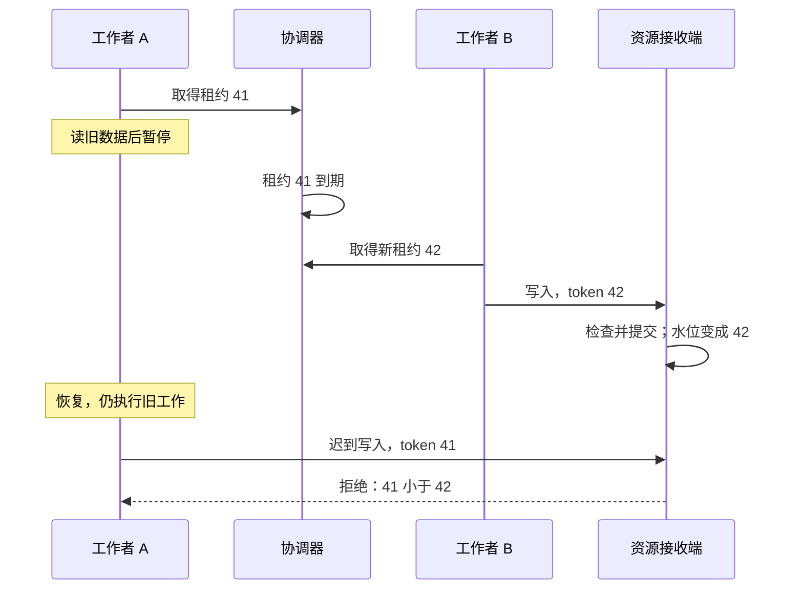

# 租约过期以后：旧持有者为什么仍需 fencing

工作者 A 拿到订单分片的租约，读完旧数据，准备把结果写回存储。它暂停了五秒。协调器认为租约已过期，让 B 接管；B 写入了新结果。A 恢复后继续执行暂停前的下一行，把旧结果覆盖回去。

租约系统可能完全按规定工作：到期后它确实只承认 B。问题在于，目标存储没有参与这个判断，它只看到了两个看起来都合法的写请求。**协调器决定可以让谁开始；接收端还得决定哪个迟到请求可以改变资源。**

本文把后一个责任叫 fencing：给每次有效接管分配有序代次，让资源端保存已见水位并拒绝较旧代次。本文的模型使用逻辑时钟和保留的 JSON 快照，不运行 etcd、Redis、时钟同步或多节点共识；它验证一组明确交错下的资源结果，不能证明某种真实锁服务的可用性。

## 租约约束协调器，暂停约束不了已经发出的工作 {#lease-gap}

租约是带期限的所有权安排。etcd v3.6 的 lease 可以绑定 key；若未在规定期限内持续保活，到期后关联 key 被删除。[etcd Lease API](https://etcd.io/docs/v3.6/dev-guide/api_reference_v3/#service-lease-apietcdserverpbrpcproto)

把三个位置的状态写在一张表里，就能发现“只有一个持有者”这句话缺了范围：

| 时刻 | 协调器认可的持有者 | A 的本地状态 | 资源已经见过什么 |
| --- | --- | --- | --- |
| t0 | A，代次 41 | 已检查租约，准备写 | 水位 41 |
| t1 | A 暂停，随后租约到期 | 停在原指令位置，尚未观察到过期 | 仍只有 41 |
| t2 | B，代次 42 | 仍暂停 | B 写入后水位推进至 42 |
| t3 | B | A 恢复，迟到请求带 41 | 应拒绝 41，不改变 B 的结果 |



图中的关键不是租约有多短，而是 B 的写入已让接收端记住 42。没有最后的比较，即使协调器从未同时授予两个有效租约，也无法阻止旧客户端继续跑。

在每次写前重新查一次租约也有窗口：A 查到仍有效，然后在实际写入前暂停；或者请求已经离开 A，网络把它延迟到 B 提交之后。本地“我已取消”“我的 session 已结束”也撤不回接收端正在处理的请求。[取消为何不裁决外部结果](/knowledge/go/concurrency/context-cancellation.html)

### fencing 也不是按时钟立即撤权

将时序改成：B 已取得 42，**但 B 还没有联系资源端**；A 的 41 先到，而资源水位仍是 41。只做单调水位比较的接收端可以接受 A。

这不是例外，而是保证的准确范围：资源端在接受更高代次以后，才拒绝较低代次。若业务要求“B 取得租约这一刻起，任何 A 的写都不可接受”，需要更强的跨边界协议。例如 B 先向资源提交一次新代次激活，再开始受保护工作，并把这个激活点定义为接管生效点；或者把所有权检查和业务更新放进同一权威事务。单独增加 TTL 或一次线性一致读，不会消除读与外部写之间的间隔。

下载包的 `before-new-fence` 特意保留这一观察：过期 A 在新水位出现前加 1，被接受；B 随后加 10，结果 11；A 再加 100 被拒绝，结果仍为 11。把这个场景删掉，会把模型讲成它没有提供的实时撤销保证。

## 令牌要表示一次接管，而不是一串看起来随机的字符 {#token-origin}

用于 fencing 的代次必须能反映同一保护域内的接管顺序。UUID 适合区分身份，却不能凭其随机大小判断新旧。客户端本机计数器会随进程重启重置，墙上时钟还会受到时钟回拨与不同主机偏差影响。我们需要的是可信协调协议分配的有序代次，以及接收端一致的比较规则。

etcd 为修改 keyspace 的操作分配递增 revision，同一事务内的修改共享一个 revision；这个逻辑顺序与任意主机的当前时间不同。[etcd API guarantees：Revision](https://etcd.io/docs/v3.6/learning/api_guarantees/#revision)

固定 `etcd v3.6.0` 的 `client/v3/concurrency/mutex.go` 提供了值得逐步追踪的实现入口：

1. `tryAcquire` 为 session 构造锁 key，通过事务判断 key 是否已创建，并把新 key 绑定到 lease
2. 竞争顺序使用锁 key 的创建 revision；已有同一 session key 时读取它原来的创建 revision，不把一次重试当新接管
3. `Lock` 等待更早候选消失，再核查自己的 key 仍存在
4. `IsOwner` 返回“该 key 的创建 revision 仍等于本次保存值”的比较条件

这四步是源码阅读指引，不是本文 Python 模型的实现来源；未复制或裁剪 Go 源码。[固定 mutex.go 的 tryAcquire、Lock 与 IsOwner](https://github.com/etcd-io/etcd/blob/v3.6.0/client/v3/concurrency/mutex.go)

`IsOwner` 能作为 etcd 事务的比较条件，与 **同一个 etcd 事务里的写**共同裁决。先用它查一次，再发 SQL 或对象存储请求，就又跨出了原子域。也不要直接把某次响应 `Header.Revision` 或 `LeaseID` 当通用 fencing token：需确认它代表哪次锁 key 创建、session 重用时是否稳定、是否真正绑定到该资源的接管。较大的数字本身不是所有权证明。

`session.go` 的保活循环和 session context/done 信号帮助客户端观察失去保活的状态；它们没有让任意外部数据库自动识别旧请求。[固定 session.go](https://github.com/etcd-io/etcd/blob/v3.6.0/client/v3/concurrency/session.go)。实际接入时还需设计授予证据怎样可信地到达资源端，不能把一个可被客户端随意填写的整数头当成完整协议。

## 接收端究竟保存什么 {#receiver}

考虑资源键 `shop-a/order-7:g1`。其中租户和资源 ID 确定对象，`g1` 表示这次对象生命周期，避免删除后重建的同名对象误接旧请求。本模型为它保存三类状态：

| 状态 | 例子 | 要回答的问题 |
| --- | --- | --- |
| 可信授予关系 | epoch=1、token=42 绑定 worker-B 与资源键 | 这个主体的代次能否用于这个对象？ |
| 资源水位 | 该键已接受的最大 token=42 | 是否比已生效的持有者更旧？ |
| 操作结果表与业务值 | `(资源键, op-1)` 对应加 5 后结果 5 | 是否为同一次业务操作重放？ |

其中，授予来源与主体认证是输入前提。模型用受信任 `Authority.issued` 集合模拟已核验授予，并校验 principal、scope、epoch；它不是密码学签名、OIDC 或真实授权服务。授予历史保留过期 grant，**不会提前把旧 token 都过滤掉**，这样资源水位才真正承担拒绝旧写的工作。

业务存储必须让水位检查、水位推进、操作裁决与受保护变更处于同一串行化或原子提交范围。本文用一整份快照替换来假设这个条件。如果先在内存查 `token >= watermark`，释放锁后才异步写磁盘，两个请求仍可能在检查之后逆序落地，fencing 只写在门口却没有保护最终动作。

可以把资源端的一次调用按以下规则读懂：

1. 校验可信主体、资源键、动作与授予来源，拒绝伪造或跨域授予
2. 校验被资源端认可的 epoch，再读取该资源的最大 token
3. token 小于水位，拒绝，既不写业务值，也不生成成功结果
4. token 不小于水位，按资源键与 operation_id 查已保存结果；同键不同业务载荷拒绝
5. 相同操作返回原结果；新操作提交业务变化、结果表与水位。同一租约中的不同合法操作可以继续使用同一个 token

新代次重放一个旧操作时，结果仍可复用，同时把水位推进到新代次。旧代次在水位推进后即使重放一个已有结果，也先得到 stale；若业务要查询既有结果，应通过当前有权主体的独立查询入口，不绕过租户与主体检查。

### 为什么相同 token 既能合法，又能重复

token 42 描述一次所有权代次，并不描述只允许执行一条语句。

| 请求 | 是否改变业务值 | 返回意义 |
| --- | --- | --- |
| `(42, op-1, +5)` 首次 | 0 → 5 | applied，结果 5 |
| `(42, op-1, +5)` 重放 | 不再改变 | replayed，保存的结果 5 |
| `(42, op-2, +7)` 新操作 | 5 → 12 | applied，结果 12 |
| `(42, op-1, +999)` 改载荷 | 不改变 | conflict |
| `(41, late, +99)` 旧持有者 | 不改变 | stale |

若把规则写成“一律拒绝 `token <= watermark`”，第一条成功以后，同一租约下的第二次合法操作也被拒绝。若改成允许相等，却没有 operation_id 裁决，`op-1` 重放又会加一次 5。**代次排序与操作去重必须各有自己的身份。**

下面是完整的教学调用代码，和前文表格对应。`restart()` 保留的是模型已提交的水位、操作结果与业务值；真实资源必须具有相应持久性，不能在进程重启时将水位归零。

<!-- snippet: messaging.fencing-walk -->
```python steps
# !step(3:7) A 的逻辑租约到期，B 得到新 token；资源接收端独立存在，还没有见过任何写。
# !step(9:12) B 首次加 5，丢掉本地对象后重放同一操作，结果仍为 5；同 token 的另一个操作再加 7。
# !step(13:22) A 的迟到写被资源水位拒绝；最终快照不变，副作用恰好两条。
from protocol_model import Authority, Resource

authority = Authority()
old = authority.acquire("shop-a/order-7:g1", "worker-A")
authority.advance(5)
new = authority.acquire(old.scope, "worker-B")
resource = Resource(authority)

first = resource.write("worker-B", new, new.scope, "op-1", 5)
resource = Resource(authority, resource.store.restart())
replay = resource.write("worker-B", new, new.scope, "op-1", 5)
second = resource.write("worker-B", new, new.scope, "op-2", 7)
before = resource.store.committed
stale = resource.write("worker-A", old, old.scope, "late", 99)

assert first == {"status": "applied", "value": 5}
assert replay == {"status": "replayed", "value": 5}
assert second == {"status": "applied", "value": 12}
assert stale == {"status": "stale"}
assert resource.store.committed == before
assert len(resource.store.read()["effects"]) == 2
print({"token": new.token, "replay": replay, "second": second, "old": stale})
```

此处故意没有写 `if authority.valid_now(grant)` 再执行变更。那会让“过期 grant 被协调器拒绝”掩盖真正要检验的资源端单调性。实验先让旧 grant 通过可信发行历史检查，再要求水位拒绝它。

## 水位的作用域与恢复决定它还能否保护资源 {#scope-recovery}

### 不相关资源不能共享一个错误的大门槛

假设 R 的有效 token 是 5，S 的有效 token 是 100。如果资源端只保存一个全局最大值 100，就会错误拒绝 R 的合法请求。即使 token 来自全局递增分配器，保护对象彼此独立，也应按各自保护域保存水位；反过来，一个租约要保护一组资源，就必须明确组键、全部写入入口与组成员变动的规则。

`resource-scope` 先让 S 的较高 token 写入，再让 R 的较低 token 写入，R 仍应成功。随后使用正确 token 但错误主体、跨租户键、错误资源生命周期键以及伪造大 token，全部必须无副作用地拒绝。水位数字不能代替授权。[主体、对象与动作授权](/knowledge/security/authorization/object-tenant-authorization.html)

### 资源重启不能忘掉“已经见过谁”

只保留业务值 10，却把最大 token=42 丢掉，会让带 41 的旧请求重新通过。如果水位写入和业务写入不一起恢复，一份看似正常的业务备份也可能把保护撤掉。模型 `retained-watermark` 重建资源后验证旧 token 仍被拒绝；错误版本 `forget-watermark` 保留业务值却清空水位，旧请求把值写成 109，精确命中水位回退断言。

同理，只保留水位而忘掉 operation_id 结果，不能防同 token 或新 token 的业务操作重放。去重记录清理必须结合最长重试/回放窗口或更长期的业务唯一约束；永久不清理则有存储代价。这部分与 [幂等保留期](/knowledge/distributed/reliable-interactions/idempotency.html)是同一个责任，fencing 不会让它消失。

### 发行器重建不能悄悄开始另一套数字

如果接收端仍保留 1000，而发行器恢复后从 1 开始，正确拒绝旧数字会导致新持有者长期写不进去。简单清空接收端水位又会允许旧世界里的请求回来。不能仅把“恢复可用”当成“恢复了原安全条件”。

本模型给出一个**离线恢复前提**：先停止并隔离旧写入者，为新发行器选择受信任的新 epoch，将该 epoch 安装到全部相关资源接收端，保留业务与操作事实，然后才开放新写入。接收端拒绝旧 epoch，即使数字碰巧相同也无效；新 epoch 内的 counter 可以重新计数。`issuer-reset` 检验的是这套前提给定之后的结果，不是自动证明现实中已隔离所有旧写入者。

新 epoch 不能由任意请求自行声明。实际系统需要可信的恢复控制、资源清单与失败处理；多地域或多发行器也必须共同定义比较域和切换规则。若无法证明这些前提，恢复期间应停止危险写入，而不是删水位试试看。

## 幂等、租约、fencing 各自能回答哪一问 {#comparison}

| 机制 | 核心问题 | 单独使用仍留下什么 |
| --- | --- | --- |
| 幂等 | 同一逻辑操作是否已经裁决？ | 旧持有者换一个 operation_id，仍可能合法进入 |
| 租约 | 协调器目前允许谁继续持有，何时可让别人接管？ | 暂停恢复者、在途请求和外部资源不自动失效 |
| 资源端 fencing | 该写入是否比资源已接受的代次更旧？ | 同 token 重放、授权、内容冲突与实时租约有效期 |
| 对象授权 | 当前主体能否对这个租户对象做这个动作？ | 业务重放与所有权代次的先后关系 |

一个任务框架可以同时需要这四个判断。比如 Outbox relay 用租约减少同时发送者，但一条已在途消息无法由租约撤回，消费端仍需稳定事件身份去重；如果旧 relay 会修改某个共享发布进度，那个进度的接收端还需条件版本或 fencing。不要为每个消息都加一把分布式锁，再假设重复与顺序已经解决。

### 更简单的选择可能就在存储边界内

如果所有受保护事实都在一个支持事务和条件更新的数据库中，可以先评估把认领版本与变更放在同一事务内，或者以预期业务版本作条件更新。这样少了“协调器与外部资源”的跨系统间隙。它仍要处理锁等待、事务冲突、重试与授权，但不必为了“分布式”三个字先增加另一个锁服务。

若目标只是低风险缓存重建，偶尔重复计算可接受，也可能只需要有预算的竞争抑制。若目标是不可重复的外部动作，而提供方不接受版本或稳定操作键，前置锁不能凭空制造安全接口；需要目标端能力、持久任务交接、对账或人工处理来补足结果裁决。

fencing 的代价包括每次变更携带并校验代次、资源端持久水位、统一全部写路径以及恢复时保持比较域。任何“管理员直写”“老版本客户端不传 token”“异步队列绕过校验”的旁路，都要在保证里明确排除或补上同样约束。

## 用反例检查自己的设计 {#reasoning}

1. B 得到 token 42 后还没访问存储，A 的 41 先到。仅靠水位比较应该返回什么？如何改变接管生效点？
2. token 42 下两个不同操作需要顺序执行，是否应该拒绝相等 token？若两个操作本身也必须严格排序，还缺什么？
3. 写入总量与 watermark 已恢复，operation_id 表没有恢复。哪类重复会重新发生？
4. 一个客户端知道更大的 token=999999，可否因此写入另一个租户对象？
5. issuer 换新集群后 token 从 1 开始。为什么“清空所有 watermark”不是足够的恢复步骤？

<details>
<summary>展开参考推理</summary>

1. 若水位仍为 41，可信的 41 请求可被接受。可以让 B 先完成资源端代次激活，把那个提交点定义为接管生效；要求更强的实时条件则需要所有权与业务写入共同裁决。
2. 不应为了 fencing 拒绝相等代次；op-1 重放与 op-2 新操作由操作身份区分。同一租约内部的操作顺序还需业务序号、串行执行或条件版本检查，token 只提供跨持有者代次顺序。
3. 同 token 重试可能再次产生副作用；新 token 重放相同业务操作也一样。水位保护的是旧代次，去重记录保护的是一次操作，必须按需要共同恢复。
4. 不可以。首先验证发行证据、主体、资源与动作。未经验证的大数字还可能恶意推进水位，令合法写入全部受阻。
5. 旧请求和旧授予证据仍可能存在，归零会重新接纳它们。需要保留单调域，或经过可信停写/隔离与 epoch 切换；业务结果与操作事实也不能一起随手清空。

</details>

## 验证与源码阅读附录 {#verification}

[下载消息与协调模型源码](/examples/messaging-coordination-lab.zip)，运行 `python3 -B walk_fencing.py` 和 `python3 -B verify.py`；[结果文件](/examples/messaging-coordination-results.json)保留接收端最终值、水位、操作结果、每条副作用及错误实现的实际破坏状态。

<details>
<summary>展开执行范围、模型前提与来源身份</summary>

本次 CPython 3.12.14/Linux 运行安排固定顺序，没有用 sleep 猜测调度：逻辑时钟推进表示 A 暂停期间协调器时间经过；grant 历史表示已核验的发行证据；整体 JSON 快照提交表示资源原子性与逻辑持久性。真正的租约保活、签名、身份认证、etcd quorum、Redis、跨地域、磁盘故障与数据库条件写入均未执行。

接管场景断言新写 10 后旧写 99 被拒绝、快照保持不变。相同 token 场景核对重放结果 5、新操作结果 12、同键异载荷拒绝，以及新持有者重放后水位推进但副作用不增加。资源范围场景核对独立键不误伤，以及错误主体、租户、资源代次与伪造 token 的拒绝。重启/重置场景分别检验保留水位和显式安装新 epoch 的结果。

错误版本包括不检查水位、拒绝相等 token、缺少操作去重、先产生副作用后保存操作结果、全局错误水位、信任任意 token、重建时忘掉水位；还专门让两个版本返回正确的 stale/conflict，却偷偷执行旧写或同操作的改载荷写入。快照与副作用断言能发现这类“返回值正确”的假绿。验证器只接受确切业务失败原因与非空状态证据，不把启动失败、任意异常或错误码子串当成功验证。全部受控子进程正常结束；没有真实持锁服务或待清理租约。

etcd 源码参考固定于 tag `v3.6.0` 的 `client/v3/concurrency/mutex.go` 与 `session.go`，原项目为 Apache-2.0；本文只解释调用关系，不复制源码。API 文档限定 v3.6 产品语义，在线页核对日期为 2026-10-03。本文代码为原创 MIT 教学模型，不能当生产 fencing 服务部署。

</details>
