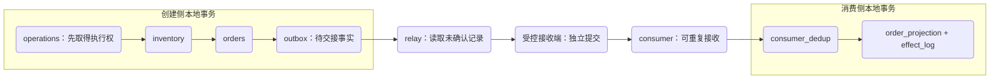
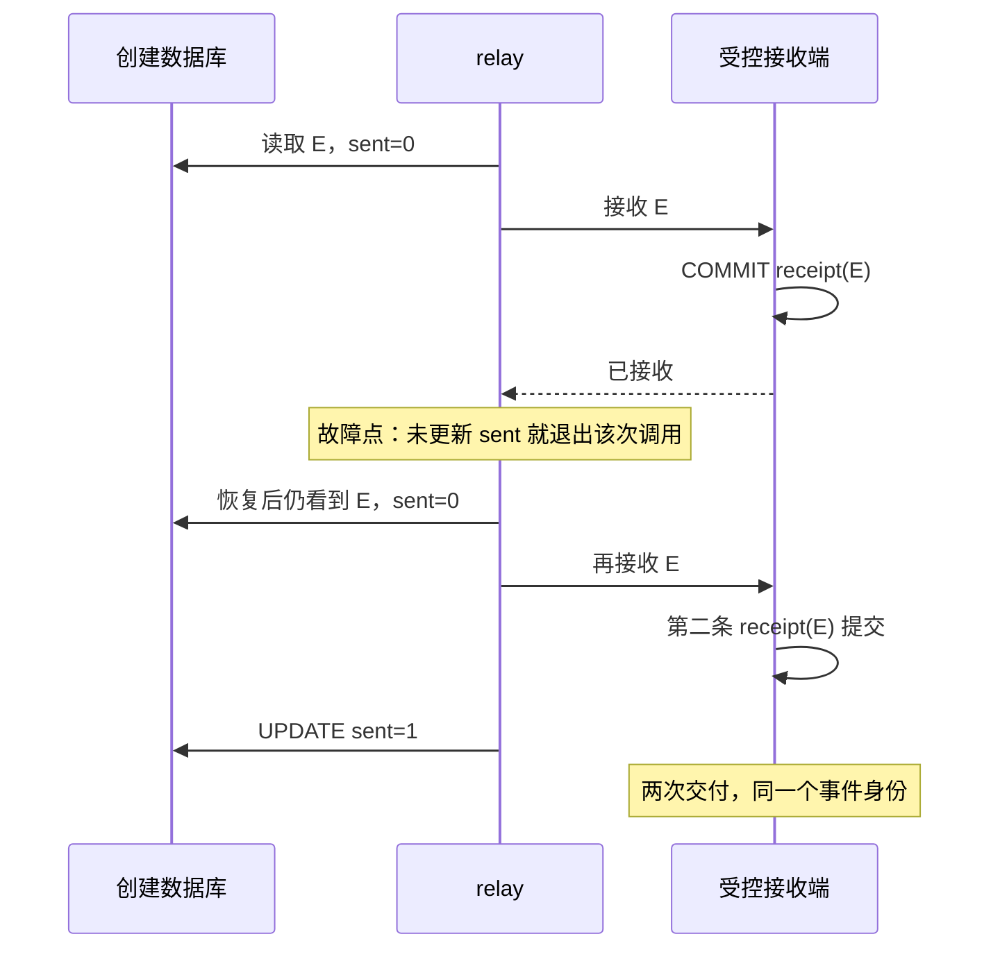
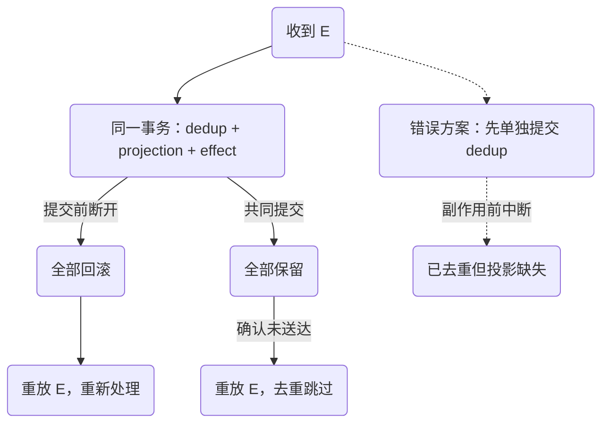

# 数据库与事件交接：outbox、重投与消费去重

订单表里已经有记录，查询系统却一直找不到它。创建接口没有报错，消息发送也“放在了提交后”。问题恰好在这两个词之间：提交之后，进程仍可能在发送之前退出。

反过来先发消息也不自动正确。如果事件已经被接收，订单事务随后回滚，下游就看到了从未成立的订单。把两个动作换顺序，只是移动了失败窗口。本章用一个持久的交接记录明确谁欠着下一步，再证明重复交付为什么是恢复机制的一部分。

## 阅读与实验边界

先读[库存不变量](/knowledge/data/transactions/inventory-invariants.html)和[未知结果下的幂等](/knowledge/distributed/reliable-interactions/idempotency.html)。本章沿用相同 schema、订单身份与库存扣减入口；HTTP、事务代理和外部支付都不重新实现。

运行[共同实验](/examples/data-consistency.zip)中的 `bash run.sh d3`。MySQL 8.4.7 保存 outbox、可控接收记录和消费侧表。接收端用另一个连接独立提交 `delivery_receipts`，刻意允许相同 event_id 多次出现；它是教学协议替身，**不是 Kafka 或 RocketMQ**，不测试 producer ack、offset、重平衡、复制或真实网络重连。

本节实验已在文中所列范围运行；源码下载及历史验证记录见文末附录。

## 1. 原子覆盖的是“发生过”和“需要通知”，不是远程接收

订单创建的同一事务内写四类事实：库存减少、订单成立、幂等操作结果、待发送事件。outbox 的含义不是“消息已经发出”，而是“这件事已成立，而且系统欠一次事件交接”。这四类写入依靠同一数据库事务一起提交；远程交付仍在边界外。



这里有两个局部原子性，没有一个横跨所有框的原子提交。实验把表放在同一 MySQL 实例便于检查，但接收与消费使用独立连接和独立提交；它不能证明物理跨数据库部署的故障行为。

`outbox` 的主键 `event_id` 表示事件身份，`(order_id, aggregate_version)` 唯一约束表示本模型每个订单版本只有一条完整快照事件。若一个版本要发布多种事件，唯一键还需纳入事件类型或事件序号，不能原样照搬。本地提交的边界与连接终止时的处理可核对 [MySQL 8.4 事务控制](https://dev.mysql.com/doc/refman/8.4/en/commit.html)及 [autocommit、提交与回滚](https://dev.mysql.com/doc/refman/8.4/en/innodb-autocommit-commit-rollback.html)。

## 2. relay 发出以后为什么还可能重发

本项目先实现一个串行 relay：读取 `sent=0` 的事件，增加尝试次数，交给接收端；接收端独立提交后，再将 outbox 标为 sent。顺序选得很有意图：绝不能在交付前先标 sent，否则中断以后将无事可重试。



发送端无法只靠本地 `sent` 字段消除“远端已接受、本地不知道”的窗口。为了不丢掉尚未确认的事件，恢复时必须允许重投；每次重投保留原 event_id，不生成一个新身份。否则消费者的去重记录根本无法识别它们属于同一事件。

这可以构成至少一次交接的设计，但活性有前提：outbox 未被提前清理、relay 持续重试、接收端最终可用，且失败记录没有被永远丢进无人处理的角落。数据库里留着一行不能自动保证“最终总会成功”，运维责任也是协议的一部分。

`D3.publish_before_mark` 在接收端提交后故意省略 sent 更新，再恢复 relay。预期 `delivery_receipts` 有两行，event_id 相同。仅断言 outbox 最终 sent=1 不足以发现重复，必须同时数接收记录和最终消费副作用。

## 3. 消费去重的提交边界，比表名重要

正确的消费处理是：在一个事务里插入 `(consumer_name, event_id)`，应用投影变化，记录副作用审计，然后一起提交。发生重复键时，回滚本次事务并结束；其他 SQL 错误必须继续报告。

去重键包含 consumer_name，因为“订单查询投影已经处理”不代表“另一个业务订阅者已经处理”。如果不同逻辑消费者共用一个无作用域去重表，先处理的一方可能压掉另一方的合法工作。

```python steps
# !step(1:3) 去重记录在消费事务中获取执行权，重复交付由唯一索引裁决。
# !step(4:8) 只有确切重复键可跳过；回滚后退出，不能把其他数据库错误当成已处理。
# !step(9:11) 去重成功后才写投影与审计，并在同一连接提交，外部动作不在这个边界内。
session.query("START TRANSACTION")
try:
    session.query(f"INSERT INTO consumer_dedup VALUES ('orders-v1',{q(event_id)})")
except SqlError as error:
    session.query("ROLLBACK")
    if only_sql_error(error.lines, 1062):
        return "duplicate"
    raise
session.query(f"INSERT INTO order_projection VALUES ({q(order_id)},1,'reserved',1)")
session.query(f"INSERT INTO effect_log(event_id,order_id) VALUES ({q(event_id)},{q(order_id)})")
session.query("COMMIT")
```

这是新订单首次投影的简化聚焦片段。完整 `consume` 还校验 schema、读取已有版本，只在版本更新时覆盖完整快照，并支持前后提交故障注入。示例 SQL 都来自封闭实验值；生产服务应使用驱动参数绑定，而不是把本章字符串拼接当作通用数据访问层。



项目专门保留错误实现 `D3.split_commit_negative_control`：先单独插入 dedup，然后模拟副作用前中断。恢复消费者命中 duplicate，投影却仍为空。这样测试能够区分“建立了去重表”和“真正维护了去重不变量”。

如果副作用是发送邮件、扣第三方余额或发货，本地 dedup 与外部动作无法按此方式共同提交。应把新的交接责任再次持久化，或使用对方明确支持的业务幂等协议，并处理未知结果；不要直接把 `send()` 塞进数据库事务就称跨系统只执行一次。

## 4. 用持久状态表逐个检查崩溃点

| 注入点 | outbox | 接收记录 | dedup / 投影 / effect | 恢复后必须检查 |
| --- | --- | --- | --- | --- |
| 业务提交后，relay 未启动 | 待交接 | 无 | 都无 | relay 恢复能找到事件 |
| 接收端提交后，sent 未更新 | 待交接 | 一条 | 尚未处理 | 重投两条交付，副作用一份 |
| 消费事务提交前断开 | 已交接 | 已有 | 都回滚 | 重放重新处理，不漏投影 |
| 消费提交后，确认丢失 | 已交接 | 已有 | 都保留 | 重放命中去重，不重复副作用 |
| 错误地先提交 dedup | 已交接 | 已有 | dedup 有，其他无 | 对账必须识别永久缺口 |

本实验的前提交中断使用 `KILL CONNECTION` 终止独立 MySQL 会话；后提交窗口通过受控控制流异常模拟，所有恢复动作重新进入正常入口。它没有终止 mysqld，也没有模拟机器断电，故不能据此声称校验了磁盘持久性配置与崩溃恢复时长。

每个恢复断言要检查内容，而不只是数量：投影应对应正确 order_id、quantity、state 和 version；去重不能错用另一个事件的键。[一致性恢复中的联合对账](/cases/orders/consistency-recovery.html)把这些字段联系起来。

## 5. 多 worker、顺序与毒消息，需要另外的合同

串行 relay 容易解释与验证，但吞吐会受一条慢交付拖累。扩成多个 worker 有两种常见选择：短事务认领后带租约发送，或持锁读取一批待发记录直到交付结束。后者简单，却把网络等待变成数据库长事务；前者减少持锁时间，但必须处理过期接管和旧 worker 的迟到确认。

租约方案至少需要 owner token、到期时间和带 token 的条件完成更新。租约过期不是“旧 worker 不可能继续发送”的证明；它仍可能恢复并产生重复。租约因此用于协调工作，不替代 event_id 和消费去重。`SKIP LOCKED` 可以帮助工作队列避免等待，但它给出不完整视图，不能用它做业务一致性查询；相关限制见 [MySQL Locking Reads](https://dev.mysql.com/doc/refman/8.4/en/innodb-locking-reads.html)。这些多 worker 设计没有在本项目实现或通过测试。

同样，`ORDER BY created_at,event_id` 只是这个串行查询的读取顺序，不是跨分区、跨进程的全局顺序保证。订单投影使用完整快照和单调版本，可以拒绝较旧快照覆盖较新状态；若事件表示“库存再减一”这样的增量，跳过旧版本可能永久丢步骤，必须额外检测序号缺口、等待缺失事件或重建权威状态。

遇到不能解析的 schema 或违反领域约束的事件，消费者应记录隔离证据并停止把它当成功确认。需要决定阻塞同一订单后续事件，还是把该订单隔离而让其他订单前进。无期限地立刻重试会耗尽连接与 CPU；盲目丢弃会破坏承诺。人工重放必须保留原 event_id，不能借“换一个 ID”绕过去重。

### 身份不变，还要求事件内容不变

去重按 event_id 裁决，有一个容易漏掉的前提：同一身份永远表示同一件已成立的事实。若修复脚本保留 event_id，却把 quantity 从一改成二，消费者可能因为已经处理过而跳过新载荷；另一个从未处理过的消费者却会看到修改后的内容，两边将分叉。不能把“重放”当成原地编辑历史事件。

本项目的事件由固定入口生成，恢复时重用已保存的 payload；没有实现跨信任边界的签名、完整 payload 指纹冲突校验或历史修订协议。生产接收外部事件时，应校验身份与内容的一致关系，遇到冲突保留证据并隔离。需要纠正业务事实时，通常新增有独立身份、明确因果关系的纠正事件，而不是偷偷重写原事件。

清理策略也应按责任分别评审。sent 仅表示发送侧已获得其约定的交接确认，不等于所有消费者都不再需要历史。投影备份若比去重表旧，恢复后可能出现“记录说处理过，投影却丢了”的状态；反过来去重备份更旧，则可能再次执行已产生的副作用。备份恢复计划必须维护两者的共同边界，不能只给每张表单独写一个保留天数。这部分需要真实部署备份演练，本实验不冒充已覆盖。

## 6. 诊断与容量：积压是欠账，年龄比总数更关键

查询不到订单时，按 order_id 查源订单和对应版本 outbox，再看尝试次数、是否接收、去重与投影。源订单无事件是创建事务合同失效；事件待发是 relay 交接延迟；已接收无 dedup 是消费尚未完成；dedup 有却没有对应投影则优先调查提交拆分或错误清理。

告警至少包括最老未交接事件年龄、每分钟新生/完成数量、重试分布、隔离消息数、投影落后版本与数据库存储增长。积压稳定却最老年龄持续上升，可能是一小批坏消息永远饿死，而不是系统“追平了”。

恢复时限制重放批量和并发，给在线写入保留容量。投影成功率恢复不代表历史缺口消失，应重新跑对账；清理 outbox 与 dedup 时要共同考虑保留期、重放来源和下游恢复时间。删除去重表再重放所有消息，对于含外部副作用的消费者尤其危险。

## 7. 练习与评审交付

**机制练习。** 将 relay 改为先标 sent 再调用接收端，并在二者间中断。写一个测试，要求源订单存在、outbox 被错误标记、接收端却无事件时失败。参考推理应定位“责任提前清除”，而不是归因于消息中间件不可靠。再恢复原顺序，解释为什么允许重复比静默丢失更可恢复。

**设计练习。** 在串行实现之外提出一个两 worker 认领协议，列出旧 worker 停顿超过租约、接管者发送成功、旧 worker 恢复三种交错。评分看条件更新是否带 token、是否保留原事件身份、是否限制积压、是否承认仍会重复，并明确需要补的真实 broker 测试。没有这些证据，不应把图中的“交接成功”写成端到端 exactly-once。

本章交付的不是一个消息产品选型结论，而是一份可检查的崩溃矩阵、交接责任与消费去重合同。即使投影已经正确提交，读取层仍可能返回旧缓存；[相关机制](/knowledge/data/cache/invalidation-freshness.html)继续追踪这段可见性边界。


<details class="verification-appendix">
<summary>实验附录：运行方法、历史记录与未覆盖范围</summary>

本章五个真实 MySQL 用例已通过，验证本地事务、受控接收端重投与消费去重。接收端仍是 MySQL 持久化替身，不是 Kafka/RocketMQ；没有真实 broker ack、offset 或重平衡证明。 绑定 [CI run 36991587537](https://github.com/weilhuang/wiki/actions/runs/36991587537)，精确源码、镜像身份、二十三项结果与已核验警告见[持久验证摘要](/examples/data-consistency-verification.json)。这是一次有界实验通过，不是压力、复制、故障切换或外部副作用认证。

下载包保留源码冻结时的 `README` / `RESULT-CONTRACT`，其中的 **NOT_RUN 是历史状态**。冻结源码随后完成了这次 CI；包内文件与 ZIP 没有因状态更新而修改。请结合本摘要阅读，不要把包内旧说明当作当前结果，也不要把真实 CI 的结果外推到未测范围。

</details>
