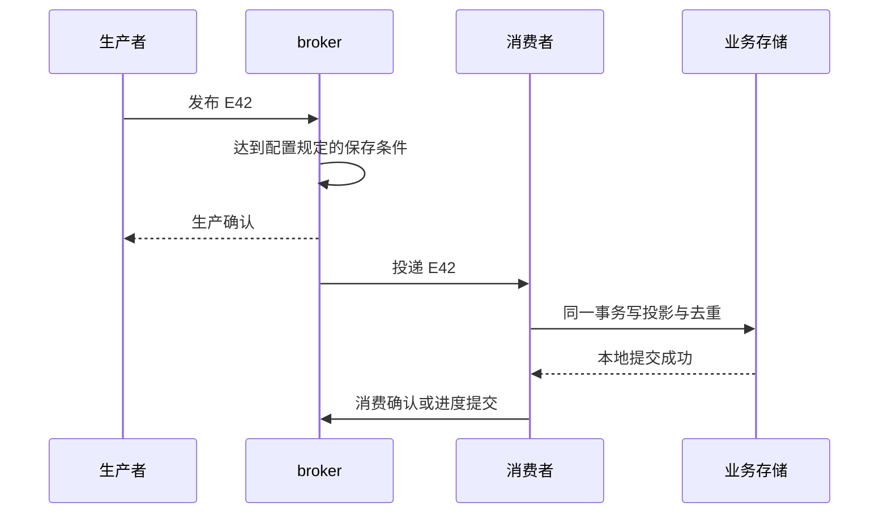
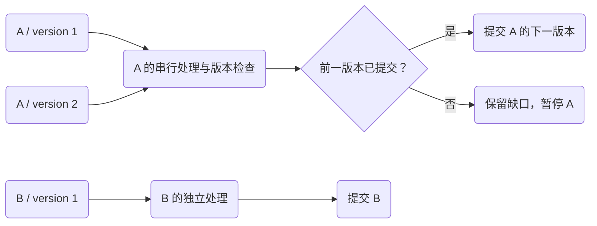

# 确认了什么：投递、重投、顺序与消费提交

订单事件 E42 已经收到“发送成功”，查询投影却没更新。过了一会儿，投影又把同一个数量加了两遍。两种现象都不必意味着 broker 违背了约定：发送端、broker、消费者可能在确认三件不同的事。

先固定一个问题：创建服务发布 `E42 = 为订单 O7 增加 5 件预留量`，投影服务要把总量从 0 变成 5。我们关心的是这个外部可读结果，以及实现它发生了几次副作用。日志里出现几次“success”只是线索。

本文以官方产品语义解释真实边界，以原创受控模型安排失败窗口。**这里没有运行 RabbitMQ、Kafka 或真实数据库**；模型中的“提交”是保留 JSON 状态快照的一步，不能证明副本、重平衡、磁盘故障或网络分区行为。已有 [Outbox 正文](/knowledge/distributed/events/transactional-outbox.html)负责解释订单提交与待发送责任，这里从交接之后继续走。

## 一条消息至少跨过四个判断 {#boundaries}

“生产成功”这个说法需要补齐主语和条件。下面是一种业务流程的分层，不是所有产品共享的一套 API 名字。

| 观察点 | 已知什么 | 仍不能推出什么 |
| --- | --- | --- |
| 生产端调用返回，或字节进入本机缓冲 | 应用/客户端接纳了请求 | 远端已收到、更不能推出落盘 |
| broker 发出生产确认 | 达到该产品与配置规定的接收/保存条件 | 业务订阅者已收到或处理 |
| 消费者取得一条投递 | 这次处理获得了消息内容 | 业务事务提交、外部动作完成 |
| 消费侧事务提交 | 该事务内的投影、去重记录等已成为事实 | broker 已知道可以停止这次重投 |
| 消费确认/进度提交被接收 | broker/组进度按其规则向前推进 | 任意数据库与它原子提交，或邮件、支付恰好执行一次 |



生产确认向左回答交接问题，消费确认向上游回答本次投递是否可以结束。中间的本地事务是第三个责任边界。三个参与者的事实可以暂时不一致，恢复协议要解释这些中间状态。

### RabbitMQ：confirm 与 consumer ack 各认一段

在 RabbitMQ 4.1 的 AMQP 0-9-1 语义里，两类确认彼此独立。对于可路由消息，publisher confirm 要等待目标队列接受；持久消息到 durable 队列的确认包含规定的持久化条件，quorum queue 的条件则涉及多数副本接受。一个 **不可路由** 的消息也可能得到 confirm；需要同时处理 `mandatory` 对应的 `basic.return`，不能只等正确认便认定业务队列已收到。[确认时机与不可路由情况](https://www.rabbitmq.com/docs/4.1/confirms#when-will-published-messages-be-confirmed-by-the-broker)

因此，“durable queue”只是队列定义的一部分，生产者还要明确消息属性、队列类型、路由结果及确认策略。不要把“发到了 exchange”和“留在目标队列”当成同一句话。RabbitMQ 4.1 的队列文档区分 durable 队列与 persistent 消息；恢复语义不能只靠其中一个开关推断。[队列持久性](https://www.rabbitmq.com/docs/4.1/queues#durability)

消费侧使用手动确认时，channel/连接关闭会使尚未确认的投递重新入队。delivery tag 是 **channel 内的投递标识**，要在原 channel 确认；它不是 E42 的稳定业务身份。生产确认也有自己的序号，不能拿它与消费 delivery tag 配对。[消费者失败与 delivery tag](https://www.rabbitmq.com/docs/4.1/confirms)

### Kafka：日志位置与业务完成分开保存

Kafka 的分区是可按 offset 读取的日志，消费者提交的是某个组、某个分区恢复时使用的进度。`poll` 推进的当前位置与已提交位置不同；常规批处理里，提交值表示 **下一条应读取的位置**，不是“最后完成的 offset 原值”。[Kafka 4.0.2 KafkaConsumer API](https://kafka.apache.org/40/javadoc/org/apache/kafka/clients/consumer/KafkaConsumer.html)

生产端 `acks=0` 不等待 broker 确认；`acks=1` 等 leader 本地日志写入；`acks=all` 等当前 ISR 的确认，ISR 是当前同步副本集合，不能把 `all` 理解成配置中所有副本无条件在线。要与 topic 的 `min.insync.replicas` 和副本故障假设一起阅读：例如副本数 3、最小 ISR 2，明确用较低写入可用性换取所需的复制条件。它不等于“消费者已经完成”，也不能直接翻译成每个节点本次都执行了磁盘 `fsync`。[生产端 acks](https://kafka.apache.org/40/configuration/producer-configs/#acks)、[topic 最小同步副本](https://kafka.apache.org/40/configuration/topic-level-configs/#min.insync.replicas)

这里比较的是两个产品的职责边界。RabbitMQ 的单次投递确认和 Kafka 的分区进度提交不是可互换命令；下面的受控队列模型也不伪装成 Kafka offset 实现。

## 丢了确认，缺少的是知识还是事实 {#lost-confirm}

让 E42 的交接过程停在两个位置，生产者都可能只看到超时：

| 受控时序 | broker 保留状态 | 生产者观察 | 安全的下一步 |
| --- | --- | --- | --- |
| 发布尚未被接纳，连接中断 | 没有 E42 | 未知 | 在预算内保留身份重试 |
| 已接纳 E42，确认途中丢失 | 已有 E42 | 未知 | 仍保留身份重试，同时容忍重复 |

“未知”属于生产者的观察，不表示 broker 处于一种叫 unknown 的第三种提交状态。把超时直接当未提交，再为 E42 换一个事件 ID，会破坏消费去重的基础。

模型 `lost-confirm` 明确选择第二行：第一次发布已经把 E1 写入逻辑持久快照，但返回 `unknown`；第二次重发保留相同 event_id，broker 中出现两条接收记录。两次消费者调用的结果必须是 `applied, duplicate`；最终总量是 5、副作用表恰有一条、两个投递都已结束。只检查“最后消费成功”会漏掉这个最核心的区别。

这不是对所有生产重试都重复的预测。Kafka 的幂等生产者用自己的生产者身份和序列处理协议内重试；固定 `4.0.2` 的 `KafkaProducer` 源码文档明确限定会话范围，并提醒应用自己重新 `send` 的新发送不能靠该机制自动去重。业务事件身份仍有独立用途。[固定 KafkaProducer 源码](https://github.com/apache/kafka/blob/4.0.2/clients/src/main/java/org/apache/kafka/clients/producer/KafkaProducer.java#L155-L179)

应用设计上要同时回答“客户端库在重试哪次发送”和“业务在恢复哪件已发生的事实”。Outbox relay 在另一次进程运行中重发同一事件，不能只凭启用了一个 producer 选项就删掉消费幂等。

## 先确认与后确认，各自留下什么窗口 {#commit-window}

对 E42 的投影更新有两种直觉排列：

1. 先确认消息，再提交业务：若两步之间退出，broker 已不再欠这次投递，但总量仍为 0
2. 先提交业务，再确认消息：若两步之间退出，总量已为 5，但 broker 仍可能重投

第二种排列保留了恢复机会，但需要在消费侧把 `(逻辑消费者, event_id)` 的去重裁决与投影变化一起提交。若先加 5，下一次事务才写“处理过 E42”，在这两个事务之间退出仍会变成 10。重复投递只是触发器；真正的漏洞是副作用和裁决不在同一原子边界。

下面是下载包中的完整教学调用代码，导入同包 `protocol_model.py` 即可运行。快照重建只模拟对象丢失以后重新读取已提交状态，**没有终止真实进程或数据库连接**。查看每一步时，先找副作用条数，再找 broker 尚欠的投递。

<!-- snippet: messaging.delivery-walk -->
```python steps
# !step(3:9) E1 已被 broker 接纳；消费提交后，投影和 inbox 同时存在，但还没确认投递。
# !step(11:16) 关闭模型 channel 并从已提交快照恢复；第二次调用读到同一事件，返回 duplicate，业务状态逐字节等价。
# !step(17:23) 确认重投，并同时检查两次投递、一次副作用和没有悬挂 delivery tag。
from protocol_model import Broker, Consumer, event

broker, consumer = Broker(), Consumer()
serial, confirmed = broker.publish(event())
delivery, message = broker.take(serial)
first = consumer.apply(message)
saved = consumer.store.read()
assert confirmed == "confirmed" and first == "applied"
assert len(saved["effects"]) == 1 and len(saved["inbox"]) == 1

broker.close_channel()
consumer = Consumer(consumer.store.restart())
broker = Broker(broker.store.restart(), channel="ch-2")
delivery, message = broker.take(serial)
second = consumer.apply(message)
assert second == "duplicate" and consumer.store.read() == saved
broker.settle(delivery)

assert broker.store.read()["records"][0]["attempts"] == 2
assert broker.store.read()["records"][0]["state"] == "done"
assert not broker.tags
print({"first": first, "replay": second, "total": saved["totals"],
       "effects": len(saved["effects"]), "deliveries": 2})
```

两个 `Store` 独立：broker 的已确认状态不能顺带提交消费投影，消费投影也不能替 broker 标记完成。模型 `commit-before-ack` 记录故障前与恢复后的完整快照，错误版本 `ack-before-commit` 得到总量缺失，`effect-before-receipt` 得到总量 10；它们都由明确业务断言拒绝，而不是被退出码碰巧挡住。

Kafka 也有类似的业务窗口，不过表现为进度值：假设分区里的连续输入 offset 100、101、102，其中 101 仍在异步处理，102 已完成。此时提交 103 会让恢复越过 101。需要维护“没有空洞的已完成前缀”，不能按最快完成任务的最大 offset 提交。这个例子是应用算法推导；真实日志可能有 offset 空洞，生产代码应依据已投递记录和 API 的下一位置，不能假设每个整数必有一条业务记录。[消费者位置与手动提交](https://kafka.apache.org/40/javadoc/org/apache/kafka/clients/consumer/KafkaConsumer.html)

Kafka 的事务能把输出 topic 与消费 offset 纳入同一 Kafka 事务，配合正确的消费者隔离与恢复逻辑，覆盖一类读、处理、再写 Kafka 的流水线。把 SQL、邮件或第三方 API 放在事务代码块里，并不会让它们自动加入这个边界。外部结果仍需目标系统配合，例如把消费身份与数据库变更共同提交，或用稳定外部操作键查询与重试。[Kafka 消息语义与外部输出](https://kafka.apache.org/40/design/design/#message-delivery-semantics)

## 顺序要写清是哪一个键、哪一种动作 {#ordering}

“队列先进先出”回答的是入队和取出，不必等于业务完成。假设订单 A 的 `A1: 创建预留` 和 `A2: 扣减预留` 先后到达，两个 worker 并行运行，A1 等待数据库，A2 很快完成：输入顺序仍是 1、2，提交顺序已是 2、1。



这张图说明业务上希望的按键调度。它没有承诺一个 Kafka 分区能因 A 被暂停而天然继续交付同分区 B；若应用要自行分发到按键队列，还要解决进度空洞、内存上限和重新分配后的恢复。

在 RabbitMQ 4.1，单 channel 发布的入队顺序、单消费者初次投递顺序都有规定范围；多 channel 交错、多消费者处理、重投与优先级都会改变能依赖的顺序。[RabbitMQ 顺序条件](https://www.rabbitmq.com/docs/4.1/queues#message-ordering-in-rabbitmq)。在 Kafka 默认按键分区策略下，同键通常被映射到同一分区；显式分区、自定义分区器、忽略 key 或扩分区都会改变这个前提，消费后自己并行处理也会失去提交顺序。[分区器与键配置](https://kafka.apache.org/40/configuration/producer-configs/#partitioner.class)

因此先写业务规则：

- 键选为带租户的订单 ID，还是整个店铺？键越大，串行瓶颈与故障影响越大
- 事件是“加 5”的增量，还是“版本 8 的完整快照”？增量缺一条就不能随意跳过；完整快照在满足版本和内容条件时可选择覆盖旧版本
- 谁生成连续业务版本？多个生产者仅用同一 key，并不会凭空获得一份已裁决的业务顺序
- 消费者换主后旧请求是否还会到达数据库？组的重新分配或租约失效，不等于外部写操作已被取消，接着看 [资源端 fencing](../coordination/lease-fencing.md)

这里的 `event_id` 回答是不是同一事件，`aggregate_version` 回答是不是合法下一步，分区/队列键回答怎样调度。把三个字段合并成一个“唯一 ID”，通常会让某一种责任丢失。

## 毒消息不是无限重试的理由 {#poison}

把 A1 改成无法解析的旧格式。网络已经恢复，再投一百次也不会让代码突然理解它。一个有限恢复策略可以是：临时故障按预算延迟重试；永久格式错误保留原载荷与原因，移到隔离区；需要连续增量的 A2 继续等待 A1 被修复或经过业务裁决，B1 可独立完成。

模型 `poison-and-order` 精确安排以下状态：A1 两次处理均返回 poison；隔离记录提交后，消费确认被丢弃；第三次投递只复用既有隔离记录再确认。接着 A2 因版本缺口返回 gap，并保留待处理状态；B1 总量变成 5。结果必须同时满足：隔离区只有一个 A1、A 没有业务副作用、B 有一条副作用、没有悬挂投递。测试结束仍保留的 A2 是有意的业务积压，不是资源泄漏。

“进入死信”也必须有保存条件。RabbitMQ 4.1 的 quorum queues 支持失败投递计数与 delivery limit，达到限制可丢弃或死信，默认数值与队列类型有版本约束；这不适合推广成所有队列的自动无限保留策略。[Quorum queue 毒消息处理](https://www.rabbitmq.com/docs/4.1/quorum-queues#poison-message-handling)。普通 dead-letter 转发本身也会失败，默认内部转发与 quorum queue 可选的 at-least-once dead-lettering 不是同一安全条件。[死信转发安全性](https://www.rabbitmq.com/docs/4.1/dlx#safety)

如果自行实现“先向隔离 topic 发送，再提交原 offset”，两个动作之间也有重复或丢失窗口。必须按产品能力选择原子事务、经确认且可去重的交接或持续可恢复记录。模型假设隔离快照可保留，并不证明真实 DLX 或重试 topic 已配置正确。

隔离后的责任至少包括谁修复、按什么原身份重放、如何发现再次失败、什么时候可以结束。严格保持每键顺序的代价是该键可能长期等待；选择跳过必须由业务规则解释缺口，而不是为了让积压图变绿。

## 怎样选一个可以解释的保证 {#tradeoffs}

| 业务要求 | 需要共同成立的条件 | 付出的代价 |
| --- | --- | --- |
| 少丢已接受的事实 | 明确生产确认条件、保留策略与故障范围 | 等待、复制成本，部分故障时拒绝写入 |
| 重投不重复改业务 | 稳定消费身份、同载荷裁决、与副作用共同提交 | 去重存储、索引争用、保留与恢复责任 |
| 同一订单按版本推进 | 稳定分配规则、串行提交或版本检查、缺口恢复 | 热键瓶颈、头部阻塞、迁移复杂度 |
| 毒消息不拖垮全部键 | 有限重试、可靠隔离、明确按键暂停边界 | 操作队列、人工/自动修复责任 |

不要将“至少一次”写成无条件活性保证：消息可能超出保留期，重试预算会耗尽，隔离队列可能无人处理。也不要将“业务副作用一次”写成全系统 exactly once；它依赖某个具体原子域、稳定身份及记录保留期。

消息载荷中的 `tenant_id` 还需要与可信来源、订阅范围和目标对象授权结合。去重命中只说明见过这件事，不授予读取或修改别的租户对象的权利。[对象与租户授权](/knowledge/security/authorization/object-tenant-authorization.html)

## 改三个条件，再预测结果 {#reasoning}

1. E42 重发时保持内容不变，但把 event_id 换成 E43。broker 与业务总量分别可能看到什么？
2. A1 被隔离后，A2 是“增加 3”与“版本 2 的完整总量 8”两种载荷，是否应该采取相同跳过策略？
3. Kafka 分区 100、101、102 并发处理，只完成 100 和 102。提交 103 与只推进到 101，分别牺牲什么？
4. RabbitMQ 收到 publisher confirm，但是同时收到 mandatory return。是否可以把 Outbox 标记为“目标订阅队列已接收”？

<details>
<summary>展开参考推理</summary>

1. 对无生产去重的受控模型，broker 保存两次；消费侧也把两个 ID 当不同事件，总量可能是 10。保持内容相同不等于操作身份相同，业务上可能合法地发生两次相同数量变化。
2. 增量通常依赖前一步，跳过会少算。完整快照可能允许按更高版本替换，但需核对快照确实完整、授权来源可信、版本单调以及附带副作用不能被重复执行；“有版本号”不足以单独作决定。
3. 提交 103 把 101 的未完成结果丢在恢复点之前。只推进已完成前缀保留恢复机会，但 102 可能重做，需要幂等；暂停/排队也会增加资源占用和延迟。
4. 不可以按这个含义标记。confirm 没有证明成功路由到目标业务队列；要记录并处理 return，以及预期绑定是否存在。是否视为终态失败，应由交接策略明确。

</details>

## 验证与版本附录 {#verification}

[下载消息与协调模型源码](/examples/messaging-coordination-lab.zip)，先运行 `python3 -B walk_delivery.py`，再运行 `python3 -B verify.py`。需要检查外部事实时，可读取[完整受控结果](/examples/messaging-coordination-results.json)。同一包中的 fencing 场景见下一篇；这里没有借用旧 Outbox 实验的执行记录。

<details>
<summary>展开已执行内容、失败归因与没有验证的范围</summary>

本次运行是 CPython 3.12.14、Linux、标准库有限子进程。消息场景包括确认丢失后双接收、消费提交后重投、毒消息可靠隔离后的同键缺口、channel 身份拒绝。运行器给每个场景 10 秒上限，并回收所有子进程；不启动服务器、线程或网络连接。

模型错误版本分别改变去重、确认顺序、副作用与记录的共同提交、毒消息保留、版本缺口检查。验证器要求确切场景名、版本名、`Violation` 类型、预期业务失败代码和退出码 1；退出码 0、启动异常、错误类型相似或仅含同一子串都不能冒充目标反例。完整结果保存每个错误版本破坏后的投影、记录与调用状态。

`Store.transaction` 原子替换整个 JSON 字符串，`restart` 只从该字符串重建对象。所谓持久边界是模型假设，不是磁盘测试；没有运行真实 broker、数据库、消费者组、重平衡、复制、分区、并发提交或外部支付。状态机并未穷举全部交错，没有测吞吐量。

官方语义记录为 source-reviewed；代码与图、干净片段字节比对为 static-checked；原创模型运行单列 executed。文档固定到 RabbitMQ 4.1 与 Kafka 4.0 产品范围，但在线文档仍可能维护；没有冒称其网页是不可变发布快照。Kafka 客户端参考使用 `4.0.2` tag，本文未复制上游源码；下载包为原创教学代码，附 MIT 许可证。

</details>
