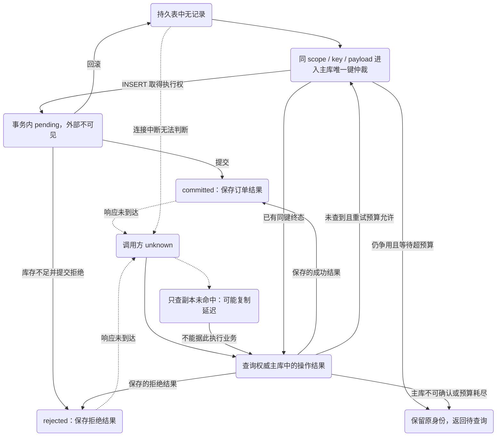
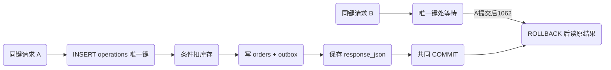
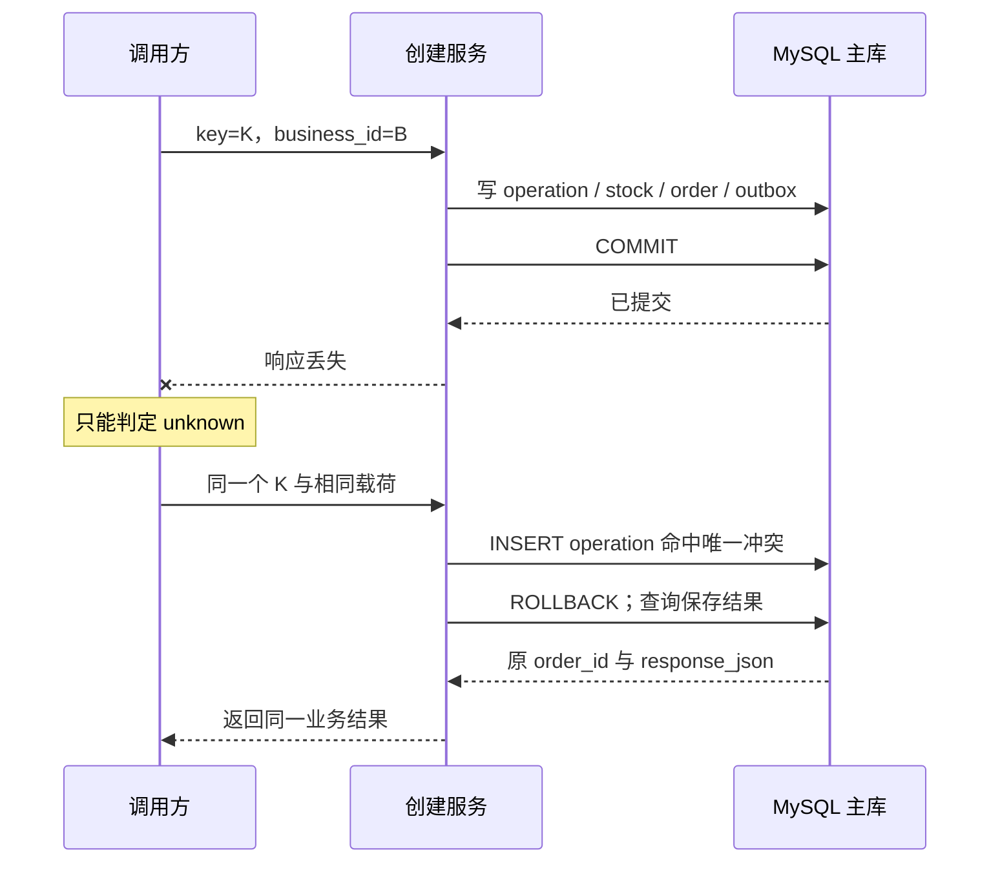

# 未知结果下的幂等：第一次可能已成功，第二次怎么办

订单请求超时以后，用户点了“再试一次”。第一次到底发生了什么？它可能根本没进入业务，也可能事务已回滚，还可能订单、库存和事件全部提交，只是结果没能回到调用方。客户端看到的同一个超时，不能区分这三种持久状态。

库存不变量专题说明一次执行如何维护库存不变量；本章决定什么时候允许再次执行。这里的幂等不是“重复调用都返回 200”，而是：**在约定身份和保留边界内，重复操作复用一个已裁决的业务结果，不产生第二份业务副作用。**

## 先修、实验与本文承诺

先读[并发不变量与隔离](/knowledge/data/transactions/inventory-invariants.html)，理解唯一约束、条件扣减和事务边界。请求取消与数据库提交不是同一个事件，可从 [Go context 的取消边界](/knowledge/go/concurrency/context-cancellation.html)衔接；本章不重讲网络或框架取消机制。

[共同实验项目](/examples/data-consistency.zip)使用 MySQL 8.4.7，运行 `bash run.sh d2`。六个用例覆盖并发同键、不同载荷、提交前连接中断、提交后丢弃响应、记录清理和终态拒绝。提交后丢响应由调用适配器受控丢弃结果实现，不声称测试了真实 HTTP/TCP 故障。

本节实验已在文中所列范围运行；源码下载及历史验证记录见文末附录。

本文只承诺本地数据库中的订单与库存副作用，不包含外部支付、发货或跨库写入；那些动作不能因为共享了一个请求头就自动加入本地原子边界。

## 1. 未知是观察状态，不是数据库里的第三种提交

数据库事务会进入提交或回滚的结果，但调用方未必及时知道。把 `unknown` 直接保存成订单状态，容易把“观察不到结果”和“业务仍在执行”混在一起。我们需要两张不同的图：业务操作的持久状态，以及调用方对它的认识。



本实验的 `pending` 只在未提交事务里短暂存在，不会作为可见的异步任务记录先提交。若进程在提交前断开，pending 与扣减一起回滚；若需要长时异步操作，则必须另外设计持久 pending 的租约、接管者、超期判定与状态查询，不能拿本章的短事务代码直接冒充可靠任务系统。

也不要从查询“暂时没找到记录”推出第一次一定没成功：可能查询了延迟副本、scope 错了，或者第一次仍持有未提交的唯一键锁。本章裁决与查询都访问同一权威主库；生产 API 必须明确这个读取前提。主库未查到记录，也只允许在重试预算内，用相同作用域、键和载荷重新进入唯一键 INSERT 的裁决入口：它仍可能等待尚未提交的原事务，或读回对方已提交的结果，只有取得执行权才继续扣库存。预算耗尽或无法确认主库时，保留原身份并返回待查询状态，不换键、不绕过约束，也不无限循环。

## 2. 操作身份必须先由协议定义

建议的创建接口可表达为 `POST /orders`，调用方提供 `Idempotency-Key` 和稳定 `business_id`。这里是本项目的接口合同，不是所有服务通用的标准：

| 输入 / 情况 | 本文合同 |
| --- | --- |
| 作用域 | 认证得到的店铺身份 + 操作种类 + 合同版本，例如 `shop-a/create-order:v1` |
| 幂等键 | 调用方为同一次逻辑操作生成，网络重试不得换键 |
| 载荷指纹 | 规范化后的业务字段；同键不同指纹拒绝，不能覆盖原记录 |
| 已成功 | 返回保存的订单标识、数量与结果，不重新扣库存 |
| 已拒绝 | 返回保存的终态拒绝；库存后来补回也不偷偷重算 |
| 正在争用 | 有界等待或返回可重试的处理中结果；不能换键绕过等待 |
| 查询 | 校验同一授权作用域，再读取保存结果；不允许跨租户枚举 |

作用域不能直接信任调用方随意提供的租户字符串。实验用固定 `shop-a` 省略认证，不代表生产接口能把 header 当权限边界。幂等键也不是访问令牌；知道一个键，不应就有权读到别人的订单。

规范化要服从业务语义。实验只含 SKU、正整数 quantity 和 business_id，用排序后的 JSON 序列化计算 SHA-256。生产接口若含金额、时区、可选字段或默认值，要先定义“缺失”和“显式默认值”是否等价。不要直接散列任意原始 JSON 字节，使空白、字段顺序造成伪冲突；也不要忽略会改变业务意义的字段。

当前实验身份值全部是规范化的小写 ASCII，VARCHAR 继承 MySQL 默认排序规则，没有测试任意 Unicode 或大小写敏感的键。如果生产定义 `KeyA` 与 `keya` 是不同操作，schema 必须明确选用相应的二进制或大小写敏感比较，并补索引冲突测试；如果选择统一规范化，API 与存储必须使用同一规则。随机字符串的熵再高，也不能修复比较规则不一致。

`business_id` 与临时幂等键各有责任：前者约束长期业务对象身份，后者保存某次调用的结果和冲突规则。它们可以关联，但不应把幂等表清理后仍存在的唯一订单约束一起删除。

## 3. 让唯一索引裁决，让事务保存裁决结果

实验先在 `operations` 插入 `(scope, idem_key, request_hash, pending)`，主键是 `(scope, idem_key)`。成功插入的事务才有资格继续条件扣库存、插订单、写 outbox，并把操作状态更新为 committed。失败则整笔回滚。库存不足是明确业务拒绝，保存 rejected 后提交，但没有订单和库存副作用。



B 不能“先查没有记录，再插入”就认为自己拿到了执行权。最终仲裁者是唯一约束；两个连接都查不到未提交记录并不矛盾。实际插入的等待、错误与回滚边界要遵守 [MySQL 的唯一约束处理](https://dev.mysql.com/doc/refman/8.4/en/constraint-primary-key.html)和 [InnoDB 错误处理](https://dev.mysql.com/doc/refman/8.4/en/innodb-error-handling.html)。

下载项目在重复键分支先回滚，再读取操作结果，避免沿用旧事务快照。尤其要限定错误类型：只有操作唯一键的预期 `1062` 可以走“可能已执行”的分支；死锁、语法错误、连接丢失不是重复成功。代码不靠字符串里偶然出现“duplicate”就吞掉全部错误。

```python steps
# !step(1:3) 先结束失败的插入事务；只有单个预期重复键错误可以转入结果读取。
# !step(4:5) 从同一主库读取保存的指纹与结果，不能重新调用扣减逻辑。
# !step(6:8) 同键不同载荷是协议冲突；同载荷才返回已保存结果。
session.query("ROLLBACK")
if not only_sql_error(error.lines, 1062):
    raise error
saved = session.query(f"SELECT request_hash,response_json FROM operations WHERE scope={q(SCOPE)} AND idem_key={q(key)}")
digest, response = saved[0].split("\t", 1)
if digest != canonical_hash(business_id, quantity):
    raise Conflict("Same idempotency scope/key, different canonical payload")
return json.loads(response)
```

这是 `create` 重复键分支的聚焦摘录；完整代码还检查查询恰有一行，并在所有路径记录和关闭连接。项目用显式 `require`/异常检查，拒绝 Python 优化模式，避免测试语句被优化跳过后仍报告成功。

## 4. 提交前与提交后，重试走同一扇门



`D2.before_commit_disconnect` 在全部写入后、COMMIT 前终止那条服务连接。预期订单和操作记录都不存在、库存回到十；同键再试可以重新执行。`D2.after_commit_response_lost` 则在 COMMIT 返回后丢弃调用结果，再试必须找到原订单，最终只剩一张订单、库存九。

这两个用例使用相同业务入口是关键。如果提交后恢复走另一条“紧急补单”代码，绕过幂等表与稳定业务约束，就破坏了协议。若客户端换一个新键但保留稳定 business_id，业务唯一索引仍可能阻止第二单；服务需要把这种约束冲突转换成明确的领域结果，而不能假称本项目已经给出了完整 HTTP 映射。

HTTP 方法名也不能替代业务协议。一个 POST 可以借助操作身份安全恢复，一次任意超时后的非幂等操作则不能盲目自动重试。[RFC 9110 的幂等方法与自动重试说明](https://www.rfc-editor.org/rfc/rfc9110.html#section-9.2.2)讨论的是方法语义与客户端重试前提，本章额外给出了订单级身份和持久化机制。

## 5. 保留期不是清理脚本的小参数

若每天创建数百万操作记录，永久保存完整 response_json 有存储、索引、备份与隐私成本。但清理记录会改变承诺：一个很久以前的请求带旧键回来，系统可能再也无法区分它和新操作。

`D2.retention_boundary` 做两个实验。先删除操作记录，再用相同 business_id 重放，订单唯一索引应阻止重复，整笔事务回滚，库存仍为九。然后用同一个已清理键搭配新生成的 business_id，系统会把它当作新操作，订单变两张。这不是哈希碰撞，而是身份信息已经不够。

因此 API 文档要写清幂等保证窗口，以及超过窗口后的查询/人工处理方式。清理前应考虑最长客户端离线期、异步队列重放期、灾备恢复窗口与业务争议期。可以长期保留轻量 tombstone 和订单身份，把大响应体归档；也可以拒绝过旧操作时间窗，而非把不存在的键默认当新请求。每种方案都要说明误拒绝、存储成本与恢复成本。

实验的 rejected 是终态。如果库存补回后还想购买，调用方必须明确创建一次新的逻辑操作；悄悄复用旧键重算，可能让用户已经理解为失败的操作在稍后意外成功。相反，网络错误、数据库暂时不可用等技术故障一般不该未经设计就永久记录为业务 rejected。

## 6. 如何定位“明明有幂等表还是重复了”

先查同一业务订单是否使用相同 scope、key、规范化指纹和 business_id。如果不同，问题在身份协议，而不在数据库锁。若四者相同，再查唯一约束是否真实存在，记录与副作用是否共同提交，是否有人绕过正常入口写订单。

若记录存在但响应不一致，要比较保存结果与第二次返回值：重新生成时间、再次调用下游、把最新订单状态当首次结果，都可能改变接口含义。幂等创建结果和实时订单查询应分开定义，不能因为状态后来变化就重写历史响应。

若所有请求卡在同键，检查持锁事务是否夹带慢调用、连接是否长期存活，以及等待超时后是否完整回滚。单纯延长等待不增加系统处理能力。监控应区分重复命中、载荷冲突、同键等待时长、未知结果恢复成功率和记录清理量；避免记录完整客户载荷来定位问题。

## 7. 练习与设计答辩

**修复练习。** 先单独提交幂等记录，再扣库存；在两步之间注入中断。预测旧键重试为什么可能永远无法创建订单。参考答案需要指出：唯一键已经占用，却没有可返回的完成结果，且没有可靠接管机制。修复可以是本章单事务，也可以是真正持久 pending 的状态机；只补一个超时字段却没有原子接管条件不合格。

**评审练习。** 设计一个支持离线七天、服务端只保留一天响应体的下单 API。交付作用域、payload 等价规则、终态表、清理策略与三条恢复查询，并比较长期 business_id 唯一约束和短期幂等结果缓存。评分重点是承诺是否自洽、身份能否穿过代理和队列、旧请求是否可能意外变新、错误是否可观测；“UUID 足够随机”只能回答碰撞概率，不能回答生命周期。

完成本章后，你应能说明第二次调用为什么没有第二次扣库存，以及这条保证何时失效。但订单提交并不等于其他系统已经知道它存在；[相关机制](/knowledge/distributed/events/transactional-outbox.html)将把恢复责任延伸到事件交接。


<details class="verification-appendix">
<summary>实验附录：运行方法、历史记录与未覆盖范围</summary>

本章六个真实 MySQL 用例已通过，覆盖同键裁决、载荷冲突、提交前后断点、保留期与终态拒绝。提交后丢响应仍是调用适配器故障注入，不是 HTTP/TCP 实测。 绑定 [CI run 36991587537](https://github.com/weilhuang/wiki/actions/runs/36991587537)，精确源码、镜像身份、二十三项结果与已核验警告见[持久验证摘要](/examples/data-consistency-verification.json)。这是一次有界实验通过，不是压力、复制、故障切换或外部副作用认证。

下载包保留源码冻结时的 `README` / `RESULT-CONTRACT`，其中的 **NOT_RUN 是历史状态**。冻结源码随后完成了这次 CI；包内文件与 ZIP 没有因状态更新而修改。请结合本摘要阅读，不要把包内旧说明当作当前结果，也不要把真实 CI 的结果外推到未测范围。

</details>
