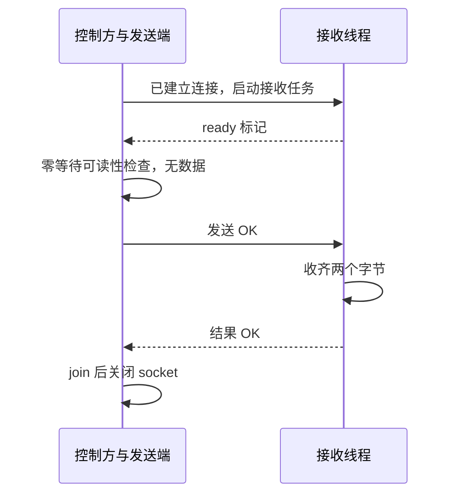

# 进程、线程与阻塞 I/O：请求在等什么

一个“生成回执”的请求花了 300 毫秒，服务器 CPU 却不高。把工作线程从 20 个加到 100 个，会变快吗？

仅凭这两个数字还不能回答。请求可能在做计算，也可能排队等工作线程、等数据库连接、等另一段代码释放锁，或等对端发回字节。**先找到推进请求所缺的条件，再看谁负责改变这个条件**。线程数说明有多少条执行路径；CPU 时间说明实际消耗了多少处理器时间；请求延迟记录从进入到返回经过了多久。它们不是彼此的替代指标。

下面用单进程、有限工作量说明这几种关系。回执服务是教学情境；下载中的 TCP 确实使用本机 loopback，既没有数据库，也没有生产服务。

## 1. 先把请求、进程、线程和资源分开 {#process-thread-resource}

请求是业务工作单位，不是操作系统调度单位。一个请求可以依次由不同线程处理，一个线程也可以处理许多请求。进程承载地址空间和一组进程级资源；线程是其中的执行路径，有自己的调用栈和执行位置。

在 POSIX 线程模型下，同一进程内的线程共享全局/堆内存和打开的文件描述符等属性，同时各有栈和线程标识。自己的栈不意味着栈中对象天然不能被别的线程访问：把引用交出去以后，仍需管理访问和存活时间。[Linux pthreads(7)](https://man7.org/linux/man-pages/man7/pthreads.7.html)

| 对象 | 本例是什么 | 容易误判的地方 |
| --- | --- | --- |
| 请求 | 为 job-7 生成一次回执 | 请求还在排队，不代表已有线程替它执行 |
| 进程 | 装载代码、对象及 socket 的程序实例 | 一个线程退出，不等于整个进程或所有描述符被关闭 |
| 线程 | 取任务、读数据、写回执的执行路径 | 线程存活，不等于正在使用 CPU |
| 资源 | socket、连接额度、锁保护的数据 | 能从多线程访问，不等于每个线程都有释放权 |
| 所有权 | 谁创建、谁借用、谁最终释放的程序约定 | 可共享的句柄和负责关闭它的人，是两个问题 |

跨进程也不能简单记成“全部不共享”。例如 `fork` 后，父子地址空间分别变化，但继承的文件描述符可以引用同一个内核 open file description；显式共享内存又是另一种安排。本文不执行 `fork` 或共享内存实验。[Linux fork(2)](https://man7.org/linux/man-pages/man2/fork.2.html)

为回执请求规定一个清晰生命周期：入口把任务放入有界队列；工作线程取走任务后负责归还所借额度；连接的创建者负责关闭；控制线程负责发结束信号并确认工作线程已经结束。改变其中一个角色，就必须检查异常和取消时的释放责任是否一起转移。

## 2. 相同的“慢”，等待的条件不同 {#waiting-conditions}

先假设请求按顺序通过下图。它只画一条串行路径；真实请求若并行访问多个依赖，不能把所有并行段耗时直接相加。


文字版：工作线程只能减少“尚未取任务”的等待；它不能凭空制造连接、释放别人的锁或使对端更快返回。排障时要沿每一条等待边找出负责推进的一方。

| 当前状态 | 能继续的条件 | 应找的证据 | 直接加线程的结果可能是什么 |
| --- | --- | --- | --- |
| CPU 执行 | 当前指令完成 | 线程 CPU 时间增量、热点栈 | 同样的计算竞争 CPU，吞吐不一定增加 |
| 可运行但未获 CPU | 调度器给它执行机会 | 调度/运行队列证据及 CPU 竞争 | 竞争者增加，等待可能更久 |
| 阻塞 I/O | 有数据、EOF、错误或超时 | socket 操作、依赖耗时、返回错误 | 可重叠更多等待，也可能压垮依赖 |
| 锁等待 | 持锁者释放，随后获取成功 | 等待者与持有者的调用路径 | 临界区容量没变，竞争可能增加 |
| 空队列等工作 | 生产者放入元素或结束信号 | 队列交接、生产者状态 | 更多空闲消费者 |
| 满队列等空间 | 消费者取走元素 | 队列上限、处理速率、拒绝数 | 若下游仍慢，未必解决积压 |

阻塞描述调用暂时不能返回，**不意味着整台机器被阻塞**。Linux 阻塞式接收在没有数据时等待；非阻塞接收则可返回 `EAGAIN`/`EWOULDBLOCK`。后者只把“何时再试”的责任交给调用方，并没有让远端结果提前产生。[Linux recv(2)](https://man7.org/linux/man-pages/man2/recv.2.html)

同样，不应把业务等待种类直接映射为某个操作系统状态字母。`/proc/pid/stat` 提供状态与累计 CPU 字段，却没有“正在等 job-7 的数据库连接”这样的业务标签。单次快照只能说明采样时可见的状态；归因仍需调用路径和资源上下文。本文未采集内核调度轨迹，也未验证公平性、抢占顺序或特定内核的等待状态。[Linux proc_pid_stat(5)](https://man7.org/linux/man-pages/man5/proc_pid_stat.5.html)

## 3. CPU 时间和经过时间在回答不同问题 {#cpu-and-elapsed}

假设一个串行请求的教学分解是：排队 100 毫秒、计算 10 毫秒、等依赖 190 毫秒。它的经过时间是 300 毫秒，计算需求却不是 300 毫秒。反过来，一个请求并行调用多个计算工作方，累计 CPU 时间可能与它的墙钟延迟明显不同。

这组数字是解释模型，不是本次测量结果。CPU 利用率还与观测窗口、核数及进程范围有关，不能拿某一时刻的全机平均 CPU 去解释某个请求的尾延迟。

实验 `cpu_work()` 用固定 100000 项平方和做工作，核对闭式公式，同时记录当前线程的 `thread_time_ns()` 和 `perf_counter_ns()` 增量。前者记录线程的用户态和系统态 CPU 时间，不包括睡眠；后者适合记录经过时间。两者只取差值，不比较不同进程的原始起点。没有设“低于多少毫秒才算正确”的断言。[Python time API](https://docs.python.org/3.12/library/time.html#time.thread_time) · [固定 v3.12.14 文档源码](https://github.com/python/cpython/blob/v3.12.14/Doc/library/time.rst)

在本篇使用的 CPython 3.12 实现里，GIL 还限制同一时刻执行 Python 代码的线程数。这个实现条件不能推广成“所有语言多线程都不能并行”，也不能据此否认释放 GIL 的原生扩展和 I/O 的并发价值。[Python threading 的 CPython 说明](https://docs.python.org/3.12/library/threading.html)

## 4. 不靠睡眠猜测，安排一次锁交接 {#controlled-lock}

“启动线程，睡 100 毫秒，再看它是否等锁”有一个漏洞：机器繁忙时，工作线程可能还没有开始。通过一次失败的非阻塞获取可以知道锁确实不可用；再让控制线程释放它，才有明确的推进条件。

下面是下载中 `waiting.py` 的完整 `lock_wait()` 函数，属于原创教学应用代码。它使用同文件的 `Worker`、`wait` 和 `require`：工作线程异常会交给控制方，事件和 join 都有上限。复制这个函数时应放回同一实验文件，完整可运行环境在下载包中。

<!-- snippet: foundations.lock-wait -->
```python steps
# !step(2:4) 控制线程先持锁；工作线程尚未启动时，就建立了不能成功获取的条件。
# !step(5:12) 工作线程先观察非阻塞获取失败，再等待；成功获取后负责自己的释放。
# !step(13:16) 控制方等到真实的竞争观察。此时它仍持锁，所以 acquired 不能已经置位。
# !step(17:22) 释放使条件成立；有界 join 确认线程结束，并检查锁没有遗留。
def lock_wait():
    lock = threading.Lock()
    contended, acquired = threading.Event(), threading.Event()
    lock.acquire()
    def use_lock():
        require(not lock.acquire(blocking=False), 'SETUP:lock-must-be-held')
        contended.set()
        require(lock.acquire(timeout=LIMIT), 'HARNESS_TIMEOUT:lock-acquire')
        try:
            acquired.set()
        finally:
            lock.release()
    worker = Worker(use_lock)
    try:
        wait(contended, 'observed-lock-contention')
        require(not acquired.is_set(), 'ORDER:acquired-before-release')
    finally:
        lock.release()
        worker.join()
    require(acquired.is_set() and not lock.locked(), 'CLEANUP:lock')
    return {'kind': 'lock', 'failed_nonblocking_acquire': True,
            'acquired_after_release': True, 'worker_alive': False, 'lock_held': False}
```

这里要谨慎解释 `contended`。它证明工作线程已经做过一次失败的获取，不证明后面的阻塞式 `acquire` 此刻已进入内核休眠。控制线程可能在这两条语句之间释放锁；实验仍正确，因为它检验的是“释放前不可获取，释放后最终完成”的依赖关系，不是调度器的精确轨迹。

Python 原始 `Lock` 不把所有权绑定给特定线程，API 允许其他线程释放；这不意味着应用可以随意释放别人的锁。本例控制方只释放自己先取的那次，工作方只释放自己后来取的那次。`RLock` 则有持有线程和递归层数要求，不能混用这两套规则。竞争者哪个先得到锁也不是此 API 承诺的公平顺序。[固定 threading 文档](https://github.com/python/cpython/blob/v3.12.14/Doc/library/threading.rst)

## 5. 队列等待和网络等待：条件相似，证据不同 {#queue-and-io}

空队列实验先由消费者执行 `get_nowait()`，确认得到 `Empty`；控制方收到这个观察后放入 `job-7`，消费者再由带超时的 `get()` 取得它。最后核对值恰好一次、队列为空和线程已结束。`Queue.empty()` 在一般并发程序中不能保证下一步 `get()` 不阻塞；本实验只在生产消费都已结束的静止点检查它。[Python queue API](https://docs.python.org/3.12/library/queue.html) · [固定 queue 文档](https://github.com/python/cpython/blob/v3.12.14/Doc/library/queue.rst)

TCP 实验则建立监听 socket、发送端和接收端。发送端由控制方独占，在观察完成前不会发送。控制方看到“读者已开始”和接收端暂不可读后，才发送 `OK`；读取方按累计截止时间接收完整的两字节消息。



文字版：发出字节的控制方是推进者，接收线程是等待者。实验还检查三个 socket 对象的 `fileno()` 均为 -1，线程不再存活。它没有测远端网络、丢包、TLS 或服务吞吐。

`recv(2)` 可能只返回当前可用的一部分字节；TCP 不保留一次 `send` 对应一次 `recv` 的消息边界。实验的 `recv_exact` 因此循环累计长度，遇到 EOF 立即失败，并让多次接收共享一个总截止时间。若每次重试都重新给完整超时，一个不断只发一点数据的对端就可能无限延长整体等待。[Python socket.recv](https://docs.python.org/3.12/library/socket.html#socket.socket.recv) · [固定 socket 文档](https://github.com/python/cpython/blob/v3.12.14/Doc/library/socket.rst)

`select` 的零超时检查只是那一刻的可读性观察。真实多读者程序里，别的线程可能抢先消费数据；本实验把接收权限定给一个读者，并且控制方是唯一发送者。这些条件才使实验观察容易解释。[Python select](https://docs.python.org/3.12/library/select.html#select.select)

## 6. 取消、唤醒、完成与释放是四个动作 {#ownership-and-completion}

给线程发取消标记，只改变了程序能够观察的状态。工作方还需要走到检查点，结束必要步骤，释放自己拥有的资源，最后报告结束。等待线程结束的 `join(timeout)` 返回后，也必须检查 `is_alive()`，因为返回值本身不能区分“已结束”和“等到了超时”。[Python Thread.join](https://docs.python.org/3.12/library/threading.html#threading.Thread.join)

更危险的是“我把 socket 从另一个线程 close 了，所以阻塞的读已经结束”。Linux 手册专门提示：一个线程关闭描述符，而另一个线程仍在 I/O 中，行为存在系统差异；Linux 中阻塞调用可能持有底层 open file description 的引用，并在 close 后仍然成功。描述符编号也可能被复用。应按具体 API 设计停止协议，验证结束，再管理资源，不能把 close 当成跨平台取消原语。[Linux close(2)](https://man7.org/linux/man-pages/man2/close.2.html)

实验在失败路径尝试 `shutdown` 辅助唤醒，所有 socket 操作本身仍有超时，随后有界 join；这只是有限实验的退出保护，不声称它能停止任意第三方调用。教学任务中的资源布尔值也不能替代真实描述符的关闭证据。下一篇会故意提前发 `done`、漏释放资源，让断言分别抓到两种错误。

## 7. 怎样据此选择改动 {#choose-a-change}

如果工作线程大量等连接，先看连接持有者正在做什么。假设池里只有 8 个额度，已有 8 个请求拿着连接等待同一个慢依赖，再增加 80 个线程只会制造更多等待者。若确有可用连接且入站队列很长，才有理由进一步评估工作线程是否限制了处理能力。这是条件推理，不是建议把池一律开大。[连接预算与持有范围](/knowledge/frameworks/data-access/connection-budget.html)

| 方案 | 能改变什么 | 需要付出的代价或前提 |
| --- | --- | --- |
| 缩短持锁/持连接范围 | 减少有限资源被占用的时间 | 要保持数据不变量，不能把应原子的步骤任意拆开 |
| 有界队列加拒绝/背压 | 限制积压和内存，暴露过载 | 调用方必须理解拒绝并限制重试 |
| 增加工作线程 | 重叠部分独立等待 | 栈、调度、共享资源及下游容量都有预算 |
| 非阻塞 I/O 或异步运行时 | 用更少线程管理许多等待 | 仍需连接、缓冲和在途请求上限；CPU 长任务仍会占执行机会 |
| 拆分或优化 CPU 工作 | 减少每个请求的计算需求 | 需要热点与正确性证据，不能从低 CPU 一概排除局部热点 |

这也是为什么不能用“线程少”直接推导“服务更快”，或用“异步”直接推导“没有资源等待”。线程占用、逻辑并发、依赖容量是不同预算。

## 8. 练习：改变条件以后会发生什么 {#exercises}

1. 控制方先把 `job-7` 放入队列，再启动消费者，原来的空队列实验应如何变化？

   参考推理：这时 `get_nowait()` 应直接得到任务，`Empty` 不应出现。被改变的是输入时序，不能继续把 `Empty` 当成必须成立的事实。要测试等待路径，就必须保证“观察空”先于“放入”。

2. 网络接收已经返回 `OK`，线程尚未退出。可以释放它仍可能使用的共享缓冲吗？

   参考推理：返回业务结果不自动证明工作方不再引用缓冲。需要明确结果发布是不是所有权转移点；若它仍做收尾，应等结束信号或交接协议。`join` 确认的是线程终止，不替你定义对象可见性以外的业务承诺。

3. CPU 不高、队列很长、连接已全部借出，连接持有者又在等外部 HTTP。把连接池从 8 改为 80 是否必然改善？

   参考推理：先问 HTTP 容量和连接为什么跨 HTTP 调用持有。更大池可能重叠更多请求，也可能让同一依赖积压更严重。应先画持有范围，核对一致性要求，考虑是否能先归还连接及限制在途请求。

4. `contended` 已置位但工作线程还没有真正调用带超时的 `acquire`，是否推翻锁实验？

   参考推理：不会。实验主张是因果条件，不是内核停驻瞬间。若要证明操作系统的调度状态，必须另收集匹配线程、时间和内核版本的证据，不能把事件名字当作观测结果。

<details class="verification-appendix">
<summary>验证范围、源码与复跑</summary>

[下载有限标准库实验](/examples/foundations-service-lab.zip) · [查看本次完整运行结果](/examples/foundations-service-results.json)

解压后进入 `foundations-service-lab` 目录，运行 `python3 -B verify.py`。`waiting.py` 的执行单独核对固定计算结果、锁释放、单项队列交接、loopback 完整字节及线程/socket 清理。运行环境是 CPython 3.12.14 / Linux；CPU 时间数值只作为本进程测量，没有用来给延迟设阈值或作性能排名。

Python API 以 v3.12.14 文档源码为固定参考；在线 3.12 页面查阅时展示 3.12.15，本文只采用两者一致的上述接口语义。Linux 手册于 2026-10-03 实际核对；没有复制或运行 Linux 源码。Code Hike 片段与下载源码按字节校对，编译/图语法检查属于静态证据，浏览器和整站发布验收由集成流程另做。

没有验证：生产连接池、跨进程内存、远端故障、CPU 调度公平性、线程优先级、所有平台的取消语义。官方描述、解释模型和实际 Python 观察在这里分别列出，不能互相替代。

</details>
