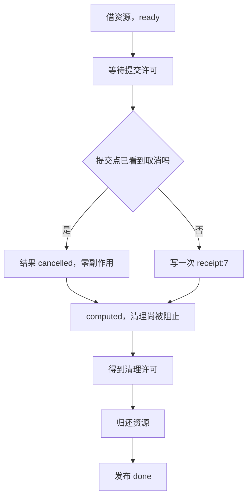
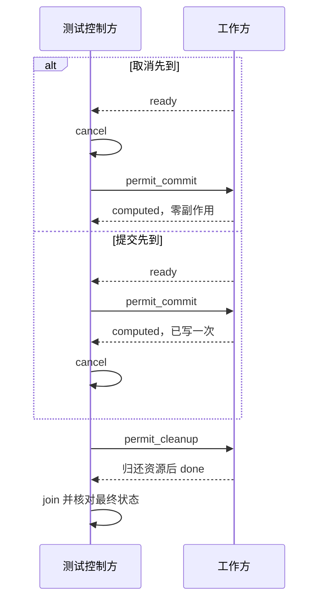

# 用反例检验断言：结果、时序与失败归因

一个函数返回 `receipt:7`，测试就通过了。但实现可能已经写了两次回执；也可能在取消以后仍然写入，或返回后留下工作线程和资源。只核对返回值，无法排除这些错误。

更有用的问题是：**我关心的错误发生时，哪条断言一定会反对它？** 如果想不出具体的错误实现，往往也还没说清楚测试在证明什么。

本篇从一个极小的回执任务出发。任务和存储都是原创内存模型，便于把顺序固定下来；随后故意修改实现，逐项检查断言是否因正确原因失败。这个过程用于理解业务承诺，不要求先搭建 CI 或复杂测试框架。

## 1. 先写可被推翻的承诺 {#falsifiable-promises}

输入固定为 job-7。工作方借用一个资源额度，在提交点决定是否生成回执，最后归还额度并宣布完成。`effects` 是测试可见的回执记录列表，`resource_open` 是资源仍被借用的布尔模型。

取消规则必须先说清：**取消被提交点观察到时，不产生回执；提交已经发生后到来的取消，不撤回已有回执**。这是一种合理的语义选择，不是所有系统的取消规则。若产品要求“取消成功必定撤回”，就需要另外定义撤回/补偿和失败结果，不能换个断言就得到它。

| 业务承诺 | 本例精确观察 | 能推翻它的错误 |
| --- | --- | --- |
| 未取消的成功结果属于这次请求 | `result == 'receipt:7'` | 返回另一请求的回执 |
| 一次提交只产生一次记录 | `effects == ['receipt:7']` | 返回正确，但追加两次 |
| 取消先到时不再提交 | `result == 'cancelled'` 且 `effects == []` | 忽略取消仍然写入 |
| `done` 表示资源已归还 | 每次发布 `done` 前同步观察 `resource_open == False`，并保留门闩前快照 | 先宣布完成再清理 |
| 本次工作实际结束 | join 后线程不活、资源已关闭、done 已置位 | 漏释放或只发通知不结束 |

这里没有用 `result is not None` 代替精确值，也没有从实现返回的值反推出期望列表。预期来自上面的业务定义。如果实现和测试共用同一个错误映射来生成回执，两边相等也可能一起错。

测试断言的价值还依赖观察面。真实服务里，记录可能要从数据库、发件箱或接收端读取；mock 的“被调用一次”不能单独证明远端成功写入。本例只能证明列表中的模拟副作用，不声称有持久化或真实事务。

## 2. 一张状态图，先找到真正的检查点 {#state-boundaries}

`ready`、`computed` 和 `done` 不是同一个事件：

- `ready`：借用资源已发生，工作方可以接受提交许可
- `computed`：提交分支已走完，结果和副作用可检查，但尚未允许清理
- `done`：被测实现对外声称完成；正确的正常路径应先释放资源再设置它



文字版：测试在两处控制条件，一处决定取消和提交谁先发生，另一处把“计算结束”和“资源结束”拆开。门闩前的观察能发现清理许可尚未发出就提前发布的情况；但许可发出以后，仍可能先发布再关闭。因此验证器还包装 `done.set`：工作线程真正调用它时，先同步保存资源状态，再调用原来的事件设置。主线程 join 后检查所有发布快照，而不是只比较门闩前和结束后的两张照片。观察器只用于这个教学对象的测试接缝，不是操作系统调度轨迹。

这些门闩是测试接缝。它们不会让真实系统自动拥有同样的状态转换，也不应凭空插在不真实的业务边界上。真实代码若没有可控制的提交点，应通过可替换依赖、协议应答或明确同步原语暴露它，而不是编造一个已执行的时刻。

Python `Event` 维护一个标记：设置之后，当前及后续等待者都可继续；它不会像一次消息那样被某个等待者消费。本例为每个任务新建事件，避免反复 clear/set 带来的额外代际问题。事件超时返回 false 必须被检查。[固定 v3.12.14 Event 文档](https://github.com/python/cpython/blob/v3.12.14/Doc/library/threading.rst) · [在线 threading](https://docs.python.org/3.12/library/threading.html#event-objects)

## 3. 安排两种交错，而不是赌机器快慢 {#two-interleavings}

本例用同一个锁保护取消标记、提交分支和快照。控制方操作事件来保证顺序；锁保证一次提交决策与取消修改不会同时改写模型状态。它不是把数据库或网络提交变成原子的通用方法。

### 交错 A：取消先于提交

1. 等 `ready`，确认工作方已启动到指定阶段
2. 调用 `cancel()`，写入取消状态
3. 放行提交门闩，等 `computed`
4. 核对取消结果和零副作用；此时资源仍开着而 `done` 必须为 false
5. 放行清理，join 后核对资源关闭、线程结束

### 交错 B：提交先于取消

1. 等 `ready`，先放行提交
2. 等 `computed`，确认提交已经执行
3. 此时才发取消
4. 放行清理并等待结束；结果仍是 `receipt:7`，副作用恰好一条



文字版：两种交错相反的不是“谁睡得更久”，而是取消与提交之间的因果先后。它们覆盖两个明确边界，不代表枚举了所有并发程序的可能执行。

以下是包内可直接运行的 `causal_walkthrough.py` 全文。它导入同目录的 `ControlledJob`，所以请从下载包运行。代码中的条件检查使用显式异常，不依赖可在优化模式下被移除的 Python `assert` 语句。[Python assert 语义](https://docs.python.org/3.12/reference/simple_stmts.html#the-assert-statement)

<!-- snippet: foundations.causal-walkthrough -->
```python steps
# !step(3:10) 先安装同步发布观察器，再启动工作；每次 done 被设置前都会保存真实资源状态。
# !step(12:20) 等到借用资源，再取消并放行提交；事件返回后仍要检查工作线程异常。
# !step(21:24) 在清理被阻止时核对精确取消结果、零副作用和资源状态，不能只等最终结果。
# !step(25:38) 有界等待工作结束，并同时检查最终清理和每次实际发布时的状态。
from service import ControlledJob

job = ControlledJob()
publications = []
publish_done = job.done.set
def observe_done():
    publications.append(job.snapshot())
    publish_done()
job.done.set = observe_done
job.thread.start()
try:
    if not job.ready.wait(4):
        raise TimeoutError('ready')
    job.cancel()
    job.permit_commit.set()
    if not job.computed.wait(4):
        raise TimeoutError('computed')
    state = job.snapshot()
    if state['worker_error'] is not None:
        raise RuntimeError(state['worker_error'])
    if state['result'] != 'cancelled' or state['effects']:
        raise AssertionError('CANCEL_EFFECT')
    if state['done'] or not state['resource_open']:
        raise AssertionError('PUBLISH_ORDER')
finally:
    job.permit_commit.set()
    job.permit_cleanup.set()
    job.thread.join(4)
    if job.thread.is_alive():
        raise AssertionError('CLEANUP_THREAD')
state = job.snapshot()
if state['worker_error'] is not None:
    raise RuntimeError(state['worker_error'])
if state['resource_open'] or not state['done']:
    raise AssertionError('CLEANUP_RESOURCE')
if not publications or any(state['resource_open'] for state in publications):
    raise AssertionError('PUBLISH_ORDER')
print('cancelled; zero effects; resource closed; worker joined')
```

4 秒是等待实验推进的保护预算，不是业务承诺的性能阈值。若事件超时，含义是实验没有建立检查所需的状态；不能把它归类成“成功检出了重复回执”。机器被严重挤占时，即使逻辑正确也可能触及保护预算，需要保留错误并查明原因。

## 4. 故意做错，逐项检查断言能否反对 {#bad-implementations}

只运行正确版本，无法知道断言有没有漏掉关键行为。本实验的坏版本每次只改变一个责任，其余步骤保持一致。下表是本次已执行并记录的结果；命中的是应用层断言，启动和语法错误不算命中。

| 变体 | 改坏哪里 | 为什么较弱的测试会漏掉 | 预期并实际命中的原因 |
| --- | --- | --- | --- |
| `wrong-result` | 返回 `receipt:8`，仍写 `receipt:7` | 只检查非空或状态成功 | `RESULT` |
| `duplicate` | 追加两条相同回执，返回值正确 | 只看返回值，或把列表转成集合 | `SIDE_EFFECT` |
| `ignore-cancel` | 取消先到仍执行写入 | 只测提交先到的正常路径 | `CANCEL_EFFECT` |
| `early-done` | 清理许可前就设置 done | 只在全部结束后看资源关闭 | `PUBLISH_ORDER` |
| `leak` | 跳过资源归还，再设置 done | 只看线程结束或 done | `PUBLISH_ORDER` 与 `RESOURCE` |

以 `duplicate` 为例，正确的检查是列表恰好等于 `['receipt:7']`，而不是 `set(effects) == {'receipt:7'}`。集合比较会抹掉次数，恰好把我们要发现的错误丢掉。若领域真的允许重复投递，应改变领域断言，例如允许投递重复但要求实际扣款只一次，不能把所有地方统一改成集合。

`early-done` 更能说明时序断言的价值：最终 `resource_open == False` 仍然成立，错误只存在于“已经宣布完成，却还持有资源”的窗口。测试先收到 `computed`，而清理许可仍未发出，于是窗口被固定下来，任何一次执行都应能观察目标违约。这里没有断言“10 毫秒以内不应完成”，也没有把一次瞬间采样冒充整个时间区间。r2 还会故意把 `done` 放到清理许可之后、资源关闭之前，验证同步发布快照仍能拒绝它；另一项变异在 `computed` 时给出错误结果、清理时再恢复，用来证明中间阶段确实核对了精确结果和副作用。

不同层的清理也要分开看：线程已经退出，只能证明它不会继续执行；连接、文件、任务额度等是否归还，仍需要各自的可观察状态。反过来，资源关闭也不证明线程没有卡在后续收尾中。

## 5. 失败必须归因，否则坏实现仍能假绿 {#failure-attribution}

一个常见的反例执行器是：“运行坏版本，只要退出码非零就通过。”假如 Python 文件拼错导致无法导入，这个执行器同样会变绿，然而目标代码根本没跑。

本实验让每个子进程输出结构化结果。目标实现错误的状态是 `rejected`、退出码 1、且 `violations` 恰好等于预先约定的原因列表（某个错误可以同时违反两项承诺）；实验故障是 `error`、退出码 2。验证器同时要求线程已回收、兜底清理完成、没有捕获到基础设施异常。

下面是 `verify.py` 的完整判定函数，属于教学验证器的原文节选。它核对一次具体试验是否符合预期，不把“某处失败”当作足够的证据。

<!-- snippet: foundations.accepted -->
```python steps
# !step(2:4) 把单个或多个目标原因规范为列表，分别约定正例和反例的状态与退出码。
# !step(5:6) 原因列表必须恰好相等，不能把其他失败或缺失原因当作命中。
# !step(7:9) 异常与残留线程、资源另外核对，避免业务断言命中却留下未结束的工作。
def accepted(returncode, report, target):
    expected = [] if target is None else ([target] if isinstance(target, str) else target)
    wanted_status = 'pass' if target is None else 'rejected'
    wanted_code = 0 if target is None else 1
    return (returncode == wanted_code and report.get('status') == wanted_status
            and report.get('violations') == expected
            and report.get('harness_error') is None
            and report.get('cleanup', {}).get('thread_alive') is False
            and report.get('cleanup', {}).get('resource_open_after_rescue') is False)
```

验证器还实际启动 `startup-error` 变体，让工作线程在业务开始前抛出 `RuntimeError('injected startup failure')`。它必须得到 `error`/退出 2，快照中的工作线程异常类型和消息也必须精确匹配该注入，并且 `accepted(..., 'RESULT')` 必须拒绝它。除此之外，验证器把错误退出码、错误原因和缺字段报告交给判定函数，确认它们不能冒认命中。

测试框架也有相同原则：只捕获异常，不足以表明捕获的是期望异常；可以进一步核对异常类型、消息或有意义的领域字段。Python `unittest` 提供 `assertRaises`/`assertRaisesRegex` 这类能力。本实验没有引入框架，而是显式保存异常类型、消息、业务快照和退出码，便于阅读完整归因。[Python unittest 异常断言](https://docs.python.org/3.12/library/unittest.html#unittest.TestCase.assertRaises)

子线程异常尤其容易被忽略：不能因为主线程走到了文件结尾就说工作成功。`ControlledJob._guarded` 把错误带回报告，控制方在阶段快照和 join 后核对。唤醒等待者的事件也可能来自错误收尾，因此“等到事件”为真仍不等于业务成功。Python 的未捕获线程异常由 `threading.excepthook` 处理，调用方需要设计自己的结果传递方式。[Python threading.excepthook](https://docs.python.org/3.12/library/threading.html#threading.excepthook)

## 6. 正确性断言和实验退出保护各负其责 {#cleanup-without-masking}

有意测试资源泄漏时，测试本身也要把环境收拾好，否则后续观察会被污染。但如果先清理再检查，就会把错误擦掉。

因此 `run_case` 按以下顺序保存证据：

1. join 后保存 `after_join`，这是被测实现完成后的状态
2. 若资源仍开着，记录 `RESOURCE`
3. 在 `finally` 打开全部门闩，再有界 join
4. 保存 `leaked_before_rescue`，之后执行实验自己的救援清理
5. 最后报告 `resource_open_after_rescue == False`

对 `leak` 变体，正确的报告同时包含“被测实现泄漏”为真和“实验退出时已清理”为真。两者不矛盾，分别评价不同责任方。最终退出状态变干净，不能反过来抹掉前面的失败。

资源布尔值便于表达这种区别，却不能证明真实资源已经释放。若换成 socket，至少要确认句柄、对端和未结束 I/O；若换成数据库，可能还要核对事务和连接池归还。有关线程和资源关系，可回看[请求在等什么](/knowledge/foundations/operating-systems/blocking-waiting.html#ownership-and-completion)。

所有实验等待有边界：线程事件通常 3 秒，控制方/join 4 秒，外层子进程 15 秒。`subprocess.run(timeout=...)` 提供子进程级保护；超时会产生 `TimeoutExpired`，而不是目标反例成功。它不能保证操作系统在任意负载下都精确按这个时刻返回，也不能代替线程内部的停止协议。[Python subprocess.run](https://docs.python.org/3.12/library/subprocess.html#subprocess.run)

本包中的 `correct` 名称只指本模型两个正常受控交错。教学实现并未提供生产级异常恢复：例如提交门闩超时会被当作实验错误，资源由外层救援释放。因此不能把本实验通过解释成“任意业务异常下都能正确归还真实连接”。若要增加这项承诺，就应先增加异常路径设计、再增加相应目标坏实现和断言。

## 7. 这些实验能支持怎样的结论 {#evidence-boundary}

已经支持的结论是：在指定 CPython 版本、这些源文件和两种事件顺序下，正常版本得到精确预期；五种局部错误分别被预定原因拒绝；启动错误被单独识别；有限线程和子进程都结束。

没有支持的结论包括：所有交错都正确、没有数据竞争、取消一定及时响应、真实写入恰好一次、操作系统调度公平，或压力上来仍能满足延迟目标。

原因并不神秘：测试只走有限输入，模型故意使用锁和门闩缩小可能执行集合。它尤其适合验证“这个边界定义是否自洽”和“这个反例是否能被发现”。需要验证真实实现时，保留同样的业务断言，换上真实适配器并重新获取证据；不能只换文章标题。

这里也有代价：精确的阶段接缝会让测试与内部结构产生一定联系。如果重构只改变内部步骤、不改变对外承诺，应优先保留外部结果/副作用断言，重新确认哪些阶段仍是有意义的业务边界。不要把某个私有方法的调用顺序无理由地固定成永久接口。

## 8. 练习：先预测哪条断言会失败 {#exercises}

1. 把 `effects` 断言改成“包含 receipt:7”，哪个坏实现会漏掉？

   参考推理：`duplicate` 会漏掉，错误结果可能依然被 `RESULT` 抓到，但不能弥补调用次数断言的丢失。可接受的结果集合要保留领域需要的数量、顺序和身份信息。

2. 把取消先到实验改成“启动后 sleep 0.1，再 cancel”，是否仍保证零副作用？

   参考推理：不保证。工作可能已提交，也可能尚未启动。`sleep` 只让调用线程等待经过时间，不建立取消先于提交的关系；应保留提交门闩。

3. 验证器捕获所有异常，输出一行“反例失败，正确”，会漏掉什么？

   参考推理：语法、导入、超时和启动异常都可能假扮目标失败。必须核对目标阶段已建立、具体错误类别和应用快照，至少要让实际启动错误不能被当成目标命中。

4. 泄漏变体在 `finally` 被测试清理了，最终资源为关闭。为什么还应判失败？

   参考推理：责任是被测实现自己在宣布完成前释放资源。救援清理用于保护实验环境，不能替实现兑现承诺。先保存 `after_join` 才能保留这个区别。

5. 需求改成“已经提交的回执也必须可取消”，现有 commit-first 测试应怎么变？

   参考推理：先定义取消结果和可撤回边界，可能需要补偿记录和失败处理。不能直接把现有预期改成空列表，因为删除内存列表并不等于撤销真实外部副作用。正确的替代方案可能是返回“已完成，无法取消”，也可能是显式进入补偿状态，取决于业务要求。

<details class="verification-appendix">
<summary>运行与源码核对</summary>

[下载源码包](/examples/foundations-service-lab.zip) · [查看本次完整运行结果](/examples/foundations-service-results.json)

在解压目录运行 `python3 -B verify.py`。查看单个坏实现时，可运行 `python3 -B assertions.py duplicate commit-first`：预期退出码为 1，原因只能是 `SIDE_EFFECT`，报告仍包含完整前后状态和清理结果。`python3 -B causal_walkthrough.py` 则运行上面的完整步骤示例。

执行器为每个试验记录命令、退出码、目标原因、运行解释器版本、各 Python 文件 SHA256。发布源码包只包含源文件和说明、版本与许可，没有私有路径或二进制。本文的 Code Hike 节选与具体函数/文件字节绑定，不把简化代码冒认标准库源码。

本次实验在 CPython 3.12.14 / Linux 执行，不安装测试框架。全文 Mermaid 与 Code Hike 编译是静态检查；整站链接、交互、窄屏、部署与独立复核尚由集成者验收，本文保留 review 状态。


r2 修订保留原任务实现，增强了中间结果与同步发布观察，并严格核对启动异常身份。原 r1 对这三个变更存在验证遗漏；新增 `verify_regressions.py` 在独立副本里实际修改任务源码，再检查目标业务断言或精确启动归因失败。它不是对所有并发时序的穷尽证明。

</details>
