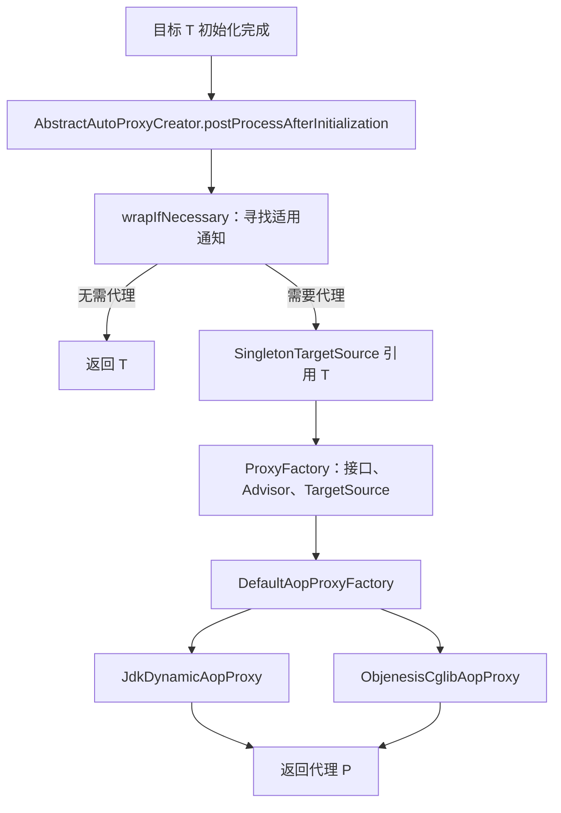
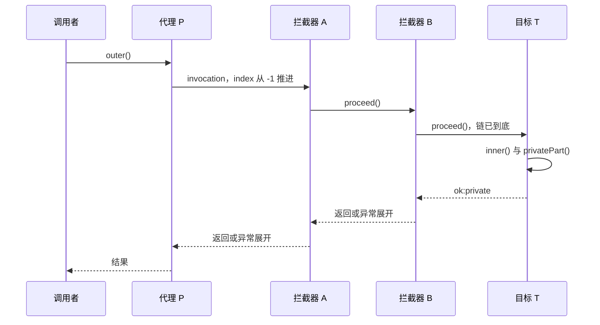

# AOP 的接收者是谁：JDK、CGLIB 与拦截器分派

同一个 `inner()`，从容器拿到的对象上调用会进入切面，从 `outer()` 里面调用却没有进入。换成 CGLIB 后仍然如此。原因不是“注解偶尔失效”，而是两次调用的接收者不同：一次先到代理，另一次已经在目标对象里。

先记住两个具体对象：**P 是调用者拿到的代理，T 是保存业务状态的目标**。在本篇普通单例代理场景中，P 和 T 不是同一个对象。拦截器决定一次从 P 进入的调用是否继续到 T、何时继续、怎样处理结果。代理机制并不自动把 T 内部的每一次方法调用重新接回 P。

本文固定 Spring Framework 6.2.19。默认文档入口可能指向 7.x；这里的源码、分支与实验都按固定版本核对。只需会读 Java 引用和接口，不要求先读整个 Java 并发或 JVM 诊断系列。

## 1. 容器什么时候把 T 换成 P {#creation}

BeanDefinition 描述“怎样创建对象”，真正的 Bean 是创建出来的实例。容器对一个普通 Bean 执行初始化后，还会让 BeanPostProcessor 处理它；自动代理创建器可以在这个位置返回包装后的对象。此后注入给其他 Bean、或从容器取得的引用便可能是 P。**容器里有对象，不等于这个对象必然是代理。**

常规路径如下，省略循环依赖的早期引用、作用域代理与自定义 TargetSource：



文字版：代理创建发生在对象创建过程的一环；代理的创建与每次业务调用是两个阶段。`wrapIfNecessary` 找到通知后创建 `SingletonTargetSource(bean)`，再把 Advisor、接口和配置送到 `ProxyFactory`。[创建分支](https://github.com/spring-projects/spring-framework/blob/v6.2.19/spring-aop/src/main/java/org/springframework/aop/framework/autoproxy/AbstractAutoProxyCreator.java#L349-L384) · [组装代理工厂](https://github.com/spring-projects/spring-framework/blob/v6.2.19/spring-aop/src/main/java/org/springframework/aop/framework/autoproxy/AbstractAutoProxyCreator.java#L475-L524)

几个名字各有责任：

| 对象 | 回答的问题 |
| --- | --- |
| Advice / MethodInterceptor | 匹配后执行什么，例如计时、缓存、事务 |
| Pointcut | 哪些类和方法适用；动态匹配还可检查本次参数 |
| Advisor | 将通知与适用条件放在一起 |
| TargetSource | 此次从哪里取得 T，是否需要归还；单例只是其中一种实现 |
| ProxyFactory / AopProxy | 按配置创建 P，并提供调用入口 |

本包用 `BeanNameAutoProxyCreator` 明确选择名为 `gateway` 的 Bean，并依次配置 A、B 两个拦截器，使“是否匹配”与“怎样分派”可以分开观察。常见基于 Advisor 的自动代理创建器还会寻找候选 Advisor、筛出适用项并排序，不是扫描到任何切面就包装所有 Bean。[Advisor 筛选入口](https://github.com/spring-projects/spring-framework/blob/v6.2.19/spring-aop/src/main/java/org/springframework/aop/framework/autoproxy/AbstractAdvisorAutoProxyCreator.java#L87-L110)

## 2. 有接口为什么还可能得到 CGLIB {#selection}

接口是否存在是一项输入，配置是否要求类代理是另一项。下面是固定版本 `DefaultAopProxyFactory.createAopProxy` 的原样方法节选，仅去掉统一缩进；完整源文件、SHA-256 与 Apache-2.0 许可在下载包中。

<!-- snippet: spring-mechanisms.factory -->
```java steps
// !step(3:8) 先看显式配置与用户接口；没有任何目标或接口时，代理创建在这里失败。
// !step(9:13) 进入类代理方向后仍检查接口、已有代理与 lambda；普通具体类才使用 CGLIB。
// !step(15:17) 具有用户接口且没有强制类代理时，选择 JDK 入口。
@Override
public AopProxy createAopProxy(AdvisedSupport config) throws AopConfigException {
	if (config.isOptimize() || config.isProxyTargetClass() || !config.hasUserSuppliedInterfaces()) {
		Class<?> targetClass = config.getTargetClass();
		if (targetClass == null && config.getProxiedInterfaces().length == 0) {
			throw new AopConfigException("TargetSource cannot determine target class: " +
					"Either an interface or a target is required for proxy creation.");
		}
		if (targetClass == null || targetClass.isInterface() ||
				Proxy.isProxyClass(targetClass) || ClassUtils.isLambdaClass(targetClass)) {
			return new JdkDynamicAopProxy(config);
		}
		return new ObjenesisCglibAopProxy(config);
	}
	else {
		return new JdkDynamicAopProxy(config);
	}
}
```

`ProxyFactory(target)` 会识别目标接口；没有强制类代理且有用户接口时，通常进入 JDK 分支。`proxyTargetClass=true`、`optimize=true` 或未配置用户接口会进入另一组判断；对普通具体类创建 CGLIB 子类代理，但接口型目标、已有 JDK 代理及 lambda 等仍有 JDK 回退。不能把工厂概括成“只要有接口就一定 JDK”。[完整选择分支](https://github.com/spring-projects/spring-framework/blob/v6.2.19/spring-aop/src/main/java/org/springframework/aop/framework/DefaultAopProxyFactory.java#L58-L77)

Spring Boot 3.5.16 的 AOP 自动配置又增加了一层默认值：它自己的类代理配置分支以 `spring.aop.proxy-target-class=true` 或属性缺省为条件。设置为 false 选择接口代理方向，仍需结合目标是否具备合适接口。**Boot 的默认配置不是原始 ProxyFactory 的默认规则。**[固定 Boot AOP 配置](https://github.com/spring-projects/spring-boot/blob/v3.5.16/spring-boot-project/spring-boot-autoconfigure/src/main/java/org/springframework/boot/autoconfigure/aop/AopAutoConfiguration.java#L46-L99)

| 选择 | P 暴露的类型 | 成立条件和代价 |
| --- | --- | --- |
| JDK 动态代理 | 配置的接口及框架接口，P 不是 T 的具体实现类 | 调用者依赖接口；不能把 P 强转成实现类，类上独有的方法没有该接口入口 |
| CGLIB 类代理 | T 所属类的子类 | 类必须可继承，需要拦截的方法必须可覆盖，还受可见性与模块访问限制 |
| 显式装饰器 | 自己声明的接口或包装 API | 没有隐含的代理选择，调用关系更直观；要维护转发代码，覆盖面由显式入口决定 |

选择应跟着 API 边界，而不是为了一个自调用问题盲目切换实现。

## 3. 从 P 到 T，两条入口在哪里汇合 {#dispatch}

JDK 代理的方法调用进入 `JdkDynamicAopProxy.invoke`；CGLIB 普通动态通知路径进入 `CglibAopProxy.DynamicAdvisedInterceptor.intercept`。两者都会取得 T，按方法与目标类得到拦截器链，再构造 `ReflectiveMethodInvocation`。链为空时可以直接调用目标，少建一个调用对象。[JDK 入口](https://github.com/spring-projects/spring-framework/blob/v6.2.19/spring-aop/src/main/java/org/springframework/aop/framework/JdkDynamicAopProxy.java#L201-L224) · [CGLIB 入口](https://github.com/spring-projects/spring-framework/blob/v6.2.19/spring-aop/src/main/java/org/springframework/aop/framework/CglibAopProxy.java#L700-L740)

这个版本的 CGLIB 上述路径也使用 `ReflectiveMethodInvocation`，最终经 `AopUtils.invokeJoinpointUsingReflection` 调用 T。不能把其他版本的 `MethodProxy.invoke` 示意当作这里的逐行源码。CGLIB 还存在固定链和未通知方法等不同 callback；下面只画本例会走的动态通知链。



文字版：进入顺序是 A → B → 业务，返回顺序是业务 → B → A。T 内部的调用没有经过 P，因此不会另开一轮 A/B。此时拦截器里的 `getThis()` 是 T；`ProxyMethodInvocation.getProxy()` 才是 P。

### proceed 并不是“直接调用业务”

下面是 `ReflectiveMethodInvocation.proceed` 的完整方法节选，去掉统一缩进。它保存一个游标：初始为 -1，每前进一步取出下一个拦截器；只有链到底才进入目标。

<!-- snippet: spring-mechanisms.proceed -->
```java steps
// !step(5:7) 游标已到链尾才调用目标；最初为 -1，因此非空链第一次还不会到业务。
// !step(9:11) 先增加游标，再取得本次要运行的拦截器，invocation 保存着这次调用的进度。
// !step(14:22) 动态条件使用本次参数；不匹配时继续推进到下一项。
// !step(24:28) 普通拦截器收到同一个 invocation，由它决定是否继续。
@Override
@Nullable
public Object proceed() throws Throwable {
	// We start with an index of -1 and increment early.
	if (this.currentInterceptorIndex == this.interceptorsAndDynamicMethodMatchers.size() - 1) {
		return invokeJoinpoint();
	}

	Object interceptorOrInterceptionAdvice =
			this.interceptorsAndDynamicMethodMatchers.get(++this.currentInterceptorIndex);
	if (interceptorOrInterceptionAdvice instanceof InterceptorAndDynamicMethodMatcher dm) {
		// Evaluate dynamic method matcher here: static part will already have
		// been evaluated and found to match.
		Class<?> targetClass = (this.targetClass != null ? this.targetClass : this.method.getDeclaringClass());
		if (dm.matcher().matches(this.method, targetClass, this.arguments)) {
			return dm.interceptor().invoke(this);
		}
		else {
			// Dynamic matching failed.
			// Skip this interceptor and invoke the next in the chain.
			return proceed();
		}
	}
	else {
		// It's an interceptor, so we just invoke it: The pointcut will have
		// been evaluated statically before this object was constructed.
		return ((MethodInterceptor) interceptorOrInterceptionAdvice).invoke(this);
	}
}
```

静态匹配由 `DefaultAdvisorChainFactory` 根据 Advisor、类与方法筛选；需要本次参数的动态匹配会留在调用链里，到 `proceed` 时再判断。动态条件不满足只跳过该项，不代表整次调用失败。[链构造](https://github.com/spring-projects/spring-framework/blob/v6.2.19/spring-aop/src/main/java/org/springframework/aop/framework/DefaultAdvisorChainFactory.java#L58-L108)

通知可以完全不调用 `proceed()`，例如缓存命中直接返回；也可以抛出异常结束调用。“代理成功调用”因此不能推出“业务执行了一次”。若希望重试，不应随意在同一个有状态 invocation 上多次调用 `proceed` 并假定整条链每次重放；还要明确链克隆、幂等性与副作用。本篇不实现重试通知。[游标与调用终点](https://github.com/spring-projects/spring-framework/blob/v6.2.19/spring-aop/src/main/java/org/springframework/aop/framework/ReflectiveMethodInvocation.java#L158-L197)

本例的计时式通知用 finally 记录退出，因此业务抛出异常时仍能观察 B、A 的退出顺序。它不吞异常，也不把错误改成成功。

<!-- snippet: spring-mechanisms.trace -->
```java steps
// !step(3:4) 先区分目标 T 与代理 P 的身份，不能由代理类名推断 this。
// !step(5:6) 记录进入的方法；外层 A 先于 B 进入。
// !step(7:8) proceed 把控制权交给后续链；finally 在结果或异常返回时记录退出。
static MethodInterceptor trace(String name, List<String> events, Service target) {
    return invocation -> {
        require(invocation.getThis() == target, "advice receiver is target");
        require(((ProxyMethodInvocation) invocation).getProxy() != target, "proxy differs from target");
        String method = invocation.getMethod().getName();
        events.add(name + ">" + method);
        try { return invocation.proceed(); }
        finally { events.add("<" + name + ":" + method); }
    };
}
```

这是实验的教学代码节选。断言明确区分 P/T；`finally` 只追加本地列表记录。真实通知若在清理时也可能抛异常，应保留原始业务失败，避免退出逻辑覆盖根因。

## 4. 自调用、private、final 是三种不同限制 {#boundaries}

先把“没有经过代理”与“无法覆盖这个方法”分开：

| 调用变化 | 本例结果 | 原因 |
| --- | --- | --- |
| `P.outer()` 内部调用 `this.inner()` | outer 经过 A/B；inner 执行业务但没有新的一轮 A/B | outer 的业务接收者已经是 T，this 就是 T |
| 直接调用 `P.inner()` | A/B 与 inner 各进入一次 | 接收者先是 P |
| 直接持有 T 调用 `inner()` | 只有业务 | 绕过代理入口，与是否写注解无关 |
| T 内部调用 private 方法 | private 逻辑执行，没有独立通知 | 内部直接调用，且 private 不能由子类覆盖 |
| CGLIB 代理外部调用继承的 final 方法 | 不进入通知；本例方法体的 this 是 P | final 不能覆盖，该方法在代理自身执行，没有转发到 T |
| JDK 接口调用，T 的实现方法是 final | 仍可进入通知 | 代理实现的是接口，并不需要覆盖 T 的方法 |
| final 类被强制创建 CGLIB 代理 | 创建失败 | 不能生成其子类 |

最后三行常被压缩成一句错误口诀“final 不能 AOP”。准确问题是：**用哪种代理，经哪个可拦截入口，接收者是谁？** 实验用一个 final 类的 final 接口实现方法证明 JDK 仍可通知，再强制类代理，断言 `AopConfigException` 的根因确为 `IllegalArgumentException: Cannot subclass final class...`，保留完整 cause。

CGLIB 的 final 方法还有实际风险：T 的字段初始化不等于 P 上同名继承字段也携带相同状态；本例通过通常的 Objenesis 路径创建 P，final 方法如果直接读实例字段，可能读到 P 的默认值。实验的 `finalIdentity()` 刻意只返回 this，并通过独立计数确认它确实进入一次，不利用空字段制造偶然异常。[不可覆盖方法约束](https://docs.spring.io/spring-framework/reference/6.2/core/aop/proxying.html)

### 返回 this 为什么有时又拿到 P？

这不否定上述模型。T 的 `self()` 确实返回 T，但代理入口会在特定条件下将返回值替换为 P。JDK 路径要求返回值就是目标、声明返回类型不是 Object、类型兼容代理，且不是 RawTargetAccess；它不能递归修复包装对象里藏着的 T。本例接口返回 `Gateway`，因此 `P.self() == P`。不要由这个等式推断业务执行时 this 也是 P。[返回值处理条件](https://github.com/spring-projects/spring-framework/blob/v6.2.19/spring-aop/src/main/java/org/springframework/aop/framework/JdkDynamicAopProxy.java#L226-L239)

## 5. 需要跨边界时，怎样选择 {#alternatives}

- 若 inner 是另一项有独立事务、授权或缓存语义的操作，把它移到另一个协作 Bean，通过那个 Bean 的代理调用。代价是显式拆分职责与依赖；收益是从调用关系就能读出边界
- 若只是让某段代码在一组前后操作内执行，可使用明确的程序式 API，例如已有事务页里的事务模板思路。调用点更显式，但业务代码需要认识这项机制
- 自注入代理或 `AopContext.currentProxy()` 可以改变接收者，但必须真的拿到代理；后者还要求暴露代理，并耦合 Spring AOP 与当前线程调用上下文。不应以此掩盖不清晰的职责
- AspectJ 编译期或加载期编织在字节码连接点应用通知，边界不同，也引入构建、加载与调试成本；本包未运行编织实验

这些选择的差异是修改了哪个边界，并非一个功能开关能通吃所有问题。[官方替代讨论](https://docs.spring.io/spring-framework/reference/6.2/core/aop/proxying.html)

本篇只回答代理如何转发。事务中的连接绑定、传播、rollback-only 与最终数据库状态继续读[Spring 事务调用链](../spring-transactions/proxy-call-chain.md)，不能由“切面执行了”推出“事务按预期提交了”。

## 6. 用证据定位“切面没执行” {#diagnosis}

按一次具体调用核对：

1. 调用点持有 P 还是自己 new 出来的 T？先比较身份和对象来源，再查看代理类别
2. 容器是否注册了相应自动代理创建器？这个 Bean 是否被匹配、是否有适用 Advisor？
3. 这个入口是接口方法、可覆盖方法，还是 private/final/不可见方法？
4. 调用是否已经进入 T，再通过 this 调用内部方法？
5. 上游拦截器是否短路、抛异常、改变参数，或根本没有 proceed？

实验同时断言返回值、业务进入次数、A/B 的完整顺序、代理和目标身份、单例 Bean 数量、业务异常的同一引用。仅靠类名含 `Proxy`、控制台多一条日志或“没抛异常”不能完成这些判断。

### 改变条件后自己推一遍

1. outer 内部将 inner 改成调用另一个 Bean 的 inner，会多出哪一组事件？需要先验证那个引用是什么？
2. 一个 final 实现类实现了接口，为什么 JDK 代理可用，而强制 CGLIB 会在业务调用前失败？
3. 缓存命中返回正确字符串，却偷偷执行了一次业务，单看结果能发现吗？应加哪个状态断言？
4. `self()` 的返回类型改成 Object，能否继续依赖 JDK 路径的返回值替换？

<details>
<summary>展开推理</summary>

1. 若另一个 Bean 的引用是有匹配通知的代理，会再经过它的链；只改代码布局而仍持有原始对象并无效果
2. JDK 代理实现接口，不继承 final 实现类；CGLIB 要生成子类，继承限制使创建失败
3. 不能。应断言目标进入次数为 0，以及命中后没有目标副作用；本包错误变体正是这样被拒绝
4. 不能。固定 JDK 代理分支显式排除 Object 返回类型；不要把局部转换当成所有返回值都被保护

</details>

## 可运行包与验证边界 {#verification}

[下载 Spring 机制实验源码](/examples/spring-mechanisms-lab.zip)。包中 `AopLab.java` 和 `BootLab.java` 共用固定依赖锁；README 给出 JDK 21 与离线依赖目录的运行方式。没有 Web 端口、数据库或容器服务。

本次真实运行覆盖两种容器代理、调用与异常展开、final 类拒绝、final 接口方法、短路行为。结果是每种正常容器路径中目标进入 7 次；短路路径为 0 次。三个错误变体中，与本页直接相关的是绕过代理和缓存命中后继续业务，两者都由准确的顶层 AssertionError 与退出码 1 被拒绝。

<details>
<summary>展开源码身份、运行命令与未覆盖项</summary>

- `source-reviewed`：固定 v6.2.19 创建、选择、匹配、JDK/CGLIB 入口与 proceed 源码；Boot 3.5.16 默认 AOP 配置仅作源码对照
- `executed`：Temurin 21.0.12.1+1-LTS；Java/Javac 各限堆 64 MiB，ActiveProcessorCount=2；编译使用 `--release 21`；上下文有界、逐个关闭
- `static-checked`：Code Hike 清洁代码与完整源码逐字绑定；固定依赖哈希、源码快照与许可证、实验记录和公开包检查
- 原始调用栈、每条命令退出码、准确源码 SHA 与失败判定保存在包内 `proof/run-3/`。错误变体是教学代码的具体错误分支，不是声称发现框架缺陷
- 未执行：动态 TargetSource 池、循环依赖早期代理、完整 @Aspect 注解发现、AspectJ、AOT、模块路径、异步、协程、响应式或性能基准；不由本例推出生产吞吐

</details>
