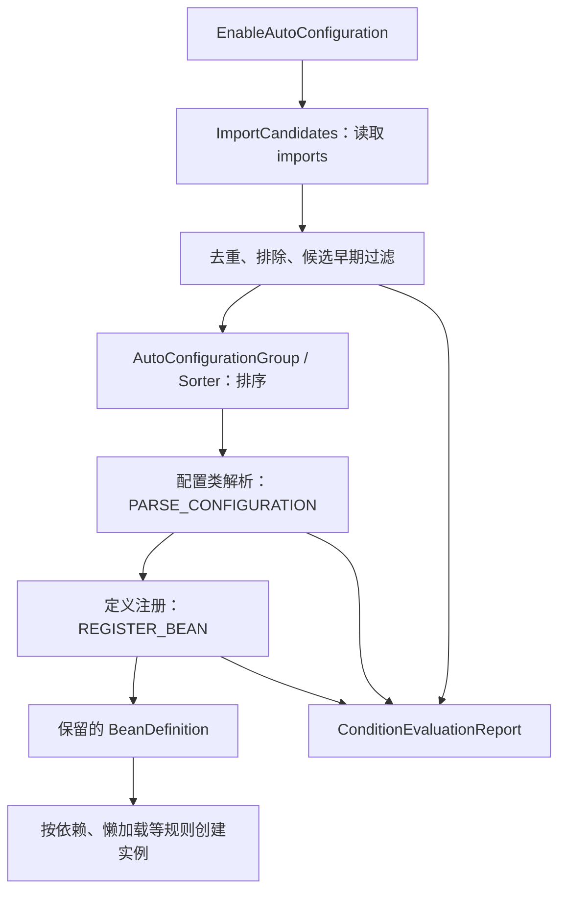
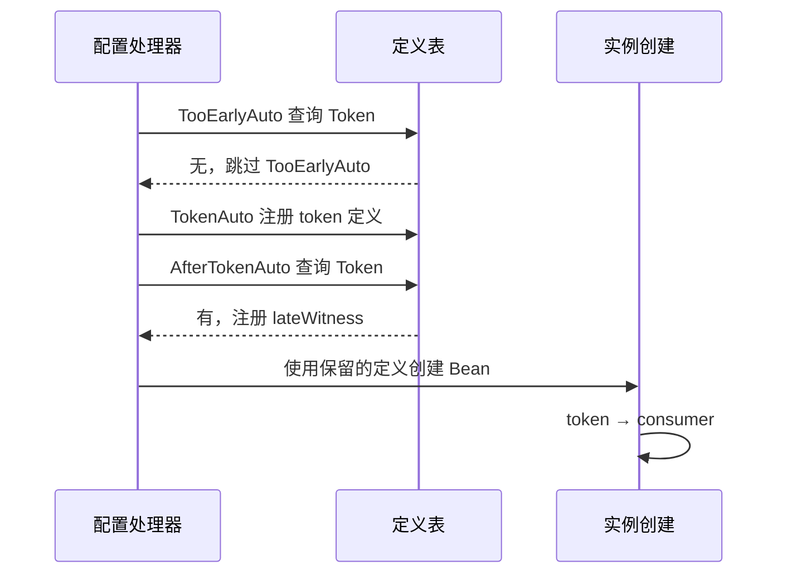

# 自动配置为何生效：条件、顺序与退让

给应用加上一个依赖，容器多出一个默认实现；自己写一个 Bean，默认实现又消失了。这里没有运行中“抢占对象”的过程。Boot 先找到可能适用的配置类，再按当时的类路径、属性和已有定义决定哪些定义应进入容器。

以一个收据存储 `ReceiptStore` 为例：库提供默认 `AutoStore`，应用可以提供自己的 `UserStore`。我们希望可选客户端存在、功能未关闭、用户未提供实现时才安装默认 Bean。读完本篇，应能在改变其中一项后先预测结果，再用具体的条件报告和对象身份核对。

本篇固定 **Boot 3.5.16、Framework 6.2.19、JDK 21**。最小先修只有 Java 工厂方法：BeanDefinition 是对象的创建描述，Bean 是描述被使用后得到的实例。关于定义表的完整链路可按需阅读[BeanDefinition 从哪里来](../spring-container/bean-definition-registration.md)，无需把它当成本篇的强制前置章节。

## 1. 候选配置从哪里来 {#candidates}

`@SpringBootApplication` 包含启用自动配置的入口；本包为了缩小范围，直接使用 `@EnableAutoConfiguration`。它引入 `AutoConfigurationImportSelector`，这是延迟处理的导入选择器，不是“扫描所有带 @Configuration 的类就当成自动配置”。

Boot 3.5.16 使用资源：

```text
META-INF/spring/org.springframework.boot.autoconfigure.AutoConfiguration.imports
```

库在文件中逐行列出候选配置类的全限定名。本包真正随 classpath 放入的文件只有一行：

```text
lab.BootLab$ReceiptAuto
```

`ImportCandidates.load` 根据注解类型拼资源名，枚举类加载器可见的同名资源，再读出候选；`AutoConfigurationImportSelector` 取这些候选去重、排除和过滤。自动配置库应该通过 imports 被发现，不要同时把同一批类纳入应用组件扫描。老版本教程中的 `spring.factories` 自动配置候选写法不能直接替换本版本 imports；本版本仍可能在其他扩展点使用 spring.factories，不代表那个文件整体废弃。[候选加载源码](https://github.com/spring-projects/spring-boot/blob/v3.5.16/spring-boot-project/spring-boot/src/main/java/org/springframework/boot/context/annotation/ImportCandidates.java#L70-L89) · [固定候选入口](https://github.com/spring-projects/spring-boot/blob/v3.5.16/spring-boot-project/spring-boot-autoconfigure/src/main/java/org/springframework/boot/autoconfigure/AutoConfigurationImportSelector.java#L195-L204)



文字版：imports 只让配置进入候选集合。成为候选、通过条件、注册定义、构造成功，是四个不同结果。报告解释条件为何通过或拒绝，并不能证明构造器、依赖连接或业务调用成功。

下面是固定版本 `getAutoConfigurationEntry` 的完整方法节选，只去掉统一缩进。**这段结束时还没有完成自动配置排序，更没有创建其中的业务 Bean。**

<!-- snippet: spring-mechanisms.imports -->
```java steps
// !step(2:4) 未启用自动配置时直接返回空入口，不再读取候选。
// !step(5:7) 读取注解属性和 imports 候选，并去重。
// !step(8:11) 验证排除项，删除显式排除，再执行候选早期过滤。
// !step(12:13) 发出导入事件并交回候选结果；排序和 Bean 创建尚在后续阶段。
protected AutoConfigurationEntry getAutoConfigurationEntry(AnnotationMetadata annotationMetadata) {
	if (!isEnabled(annotationMetadata)) {
		return EMPTY_ENTRY;
	}
	AnnotationAttributes attributes = getAttributes(annotationMetadata);
	List<String> configurations = getCandidateConfigurations(annotationMetadata, attributes);
	configurations = removeDuplicates(configurations);
	Set<String> exclusions = getExclusions(annotationMetadata, attributes);
	checkExcludedClasses(configurations, exclusions);
	configurations.removeAll(exclusions);
	configurations = getConfigurationClassFilter().filter(configurations);
	fireAutoConfigurationImportEvents(configurations, exclusions);
	return new AutoConfigurationEntry(configurations, exclusions);
}
```

之后 `AutoConfigurationGroup.selectImports` 汇总各个入口，合并排除并调用 `AutoConfigurationSorter.getInPriorityOrder`。before/after 关系约束相对处理顺序；无直接关系时还有 order 等规则，不能依赖 imports 文件偶然排列来表达依赖。[分组与排序入口](https://github.com/spring-projects/spring-boot/blob/v3.5.16/spring-boot-project/spring-boot-autoconfigure/src/main/java/org/springframework/boot/autoconfigure/AutoConfigurationImportSelector.java#L478-L507) · [排序实现](https://github.com/spring-projects/spring-boot/blob/v3.5.16/spring-boot-project/spring-boot-autoconfigure/src/main/java/org/springframework/boot/autoconfigure/AutoConfigurationSorter.java)

## 2. 同样叫条件，观察的状态并不相同 {#phases}

| 条件 | 问的具体问题 | 本例控制的输入 |
| --- | --- | --- |
| `@ConditionalOnClass` | 指定类在当前类加载器下是否存在、能否按条件检测 | 可选客户端标记类能否被看到 |
| `@ConditionalOnProperty` | Environment 里属性的值是否满足指定规则 | `receipt.enabled` 缺省或 false |
| `@ConditionalOnMissingBean` | 当前可查询的 Bean 定义中是否缺少所指类型或名称 | 用户是否提前提供 ReceiptStore |

配置类解析时有 `PARSE_CONFIGURATION`，定义注册时有 `REGISTER_BEAN`。实现了 `ConfigurationCondition` 的条件可以声明它需要哪个阶段；其他 Condition 没有这一阶段限定，在框架实际检查到它的阶段进行判断。不能把所有类上的条件一律说成“解析时只判断一次”。`ConditionEvaluator` 会筛选适用阶段，并在第一个不匹配条件处判定跳过。[阶段判断源码](https://github.com/spring-projects/spring-framework/blob/v6.2.19/spring-context/src/main/java/org/springframework/context/annotation/ConditionEvaluator.java#L80-L104)

`OnBeanCondition` 明确选择 `REGISTER_BEAN`。原因是它需要观察容器已经处理的定义；太早判断会把尚未注册的东西误认成不存在。这个阶段选择并不使它拥有“未来完整容器”的视角。条件只看到**当时已经处理的定义**，这是顺序问题的根源。[固定阶段声明](https://github.com/spring-projects/spring-boot/blob/v3.5.16/spring-boot-project/spring-boot-autoconfigure/src/main/java/org/springframework/boot/autoconfigure/condition/OnBeanCondition.java#L84-L90) · [API 对时机的限制](https://docs.spring.io/spring-boot/3.5/api/java/org/springframework/boot/autoconfigure/condition/ConditionalOnMissingBean.html)

配置类级条件拒绝时，该配置下的定义会被跳过；Bean 方法级条件可以只跳过那个工厂方法。`ConfigurationClassParser` 处理解析阶段，`ConfigurationClassBeanDefinitionReader` 在装载配置定义及 Bean 方法时处理注册阶段。[解析入口](https://github.com/spring-projects/spring-framework/blob/v6.2.19/spring-context/src/main/java/org/springframework/context/annotation/ConfigurationClassParser.java#L245-L255) · [Bean 方法注册判断](https://github.com/spring-projects/spring-framework/blob/v6.2.19/spring-context/src/main/java/org/springframework/context/annotation/ConfigurationClassBeanDefinitionReader.java#L180-L203)

### 类不存在时，怎样避免先加载了它？

类级条件的注解元数据可经 ASM 读取，无需先把全部可选业务类型加载进来。Boot 还可使用注解处理器生成的 `spring-autoconfigure-metadata.properties` 提前过滤候选；这是启动优化，不能当作替代后续条件判断的唯一事实来源。

如果在 `@Bean` 方法签名直接引用缺失类型，类加载或方法内省可能先于你期待的条件保护发生。常用做法是把这类 Bean 放进一个单独的嵌套配置，在那个配置类上设置类存在条件，并避免外围类提前引用可选类型。本例使用类名字符串并让返回类型是本实验始终存在的 `AutoStore`；实验用 `FilteredClassLoader` 隐藏 `OptionalClient`，检查的是该类加载器边界，不是声称卸载了整份依赖 JAR。[类条件的签名限制](https://github.com/spring-projects/spring-boot/blob/v3.5.16/spring-boot-project/spring-boot-autoconfigure/src/main/java/org/springframework/boot/autoconfigure/condition/ConditionalOnClass.java#L29-L60)

## 3. 一个可以退让的默认实现 {#backoff}

以下是实验里的完整配置类节选。它是教学应用代码，不是框架源码；`ReceiptStore` 是接口，`AutoStore` 是默认实现。`matchIfMissing=true` 表示缺少开关时启用，不是缺少客户端类也启用。

<!-- snippet: spring-mechanisms.receipt -->
```java steps
// !step(1:4) 配置类要先满足可选类和属性条件；缺省属性按 matchIfMissing=true 处理。
// !step(5:7) 只在尚无 ReceiptStore 时注册默认工厂定义，用户的其他实现也能让它退让。
@AutoConfiguration
@ConditionalOnClass(name = "lab.OptionalClient")
@ConditionalOnProperty(prefix = "receipt", name = "enabled", havingValue = "true", matchIfMissing = true)
public static class ReceiptAuto {
    @Bean
    @ConditionalOnMissingBean(ReceiptStore.class)
    AutoStore receiptStore() { return new AutoStore(); }
}
```

退让条件显式写 `ReceiptStore.class`，使用户的另一种实现也能满足它。若省略类型，方法级 `@ConditionalOnMissingBean` 通常从方法声明返回类型推导；如果这里推导成过窄的 `AutoStore`，另一个 `UserStore` 就不是它要寻找的类型。反过来，工厂方法的返回类型过宽，会减少框架在尚未实例化时能获得的类型信息。选择条件匹配类型与工厂声明类型时，要说明究竟允许谁替换谁。[类型推断与处理时机](https://github.com/spring-projects/spring-boot/blob/v3.5.16/spring-boot-project/spring-boot-autoconfigure/src/main/java/org/springframework/boot/autoconfigure/condition/ConditionalOnMissingBean.java#L35-L65)

默认 Bean 是“缺少时补足”的方案，而不是先实例化、再与用户对象竞争。用户定义先被处理，自动配置的方法条件看到它后便不注册默认方法的定义。默认构造器因此根本没有执行；这比最终只检查一个 Bean 的类名更强。

本例的实际观察如下，每一行都是新建并关闭的独立上下文：

| 输入 | ReceiptStore 结果 | 可观察原因 |
| --- | --- | --- |
| OptionalClient 可见；属性缺省；没有用户 Bean | 1 个 AutoStore，单例查询返回同一对象 | 类条件通过；missing-bean 找不到现有实现 |
| 只把 `receipt.enabled` 改为 false | 0 个 | 属性条件报告值不匹配，配置类被排除 |
| 只在测试类加载器隐藏 OptionalClient | 0 个 | 类条件报告找不到所需类 |
| 注册名为 userReceiptStore 的用户对象 | 1 个，且就是提供的 UserStore 引用 | 方法级条件找到 userReceiptStore，默认构造次数没有增长 |
| 错误变体删掉 missing-bean 条件 | 2 个不同实现，数量断言失败 | 用户对象与默认对象同时存在，不能宣称已经退让 |

这里显式 `havingValue="true"`；如果使用 `@ConditionalOnProperty` 的默认 havingValue，规则通常是“属性存在且值不是 false”，并非“只能为 true”。`matchIfMissing` 只管缺省情况。集合属性也不适合机械地用这个条件判断元素是否存在，复杂结构应使用专门条件或配置绑定后的校验。[属性匹配源码](https://github.com/spring-projects/spring-boot/blob/v3.5.16/spring-boot-project/spring-boot-autoconfigure/src/main/java/org/springframework/boot/autoconfigure/condition/OnPropertyCondition.java)

这些判断发生在上下文构建过程中。运行后修改某个属性值，不会自动撤销已经建立的单例并重新选实现；动态开关与热重载是另外的设计。

## 4. 排在前面，究竟保证了什么 {#ordering}

设有两个自动配置：`ConsumerAuto` 的 Bean 需要 `Token`，`TokenAuto` 提供 Token。我们故意让 ConsumerAuto 在定义处理上排在 TokenAuto 前。

<!-- snippet: spring-mechanisms.order -->
```java steps
// !step(4:7) ConsumerAuto 在定义处理上排前；consumer 工厂参数仍然要求 Token。
// !step(8:11) TokenAuto 提供 token。创建 consumer 时必须先满足该依赖。
static final List<String> CREATION_ORDER = new ArrayList<>();
record Token(String value) {}
record Consumer(Token token) {}
@AutoConfiguration(before = TokenAuto.class)
public static class ConsumerAuto {
    @Bean Consumer consumer(Token token) { CREATION_ORDER.add("consumer"); return new Consumer(token); }
}
@AutoConfiguration
public static class TokenAuto {
    @Bean Token token() { CREATION_ORDER.add("token"); return new Token("ready"); }
}
```

两组定义都可注册。真正创建 Consumer 时，工厂方法参数要求 Token，容器先取得并创建 Token，再调用 consumer 工厂。因此实验记录的**实例创建次序是 token → consumer**，尽管配置处理顺序约束为 ConsumerAuto → TokenAuto。`@AutoConfigureBefore`、`after`、`@AutoConfigureOrder` 调整的是自动配置定义的处理顺序，不决定 Bean 构造顺序；实例化依赖、`@DependsOn` 与懒初始化另有规则。[排序注解 API](https://docs.spring.io/spring-boot/3.5/api/java/org/springframework/boot/autoconfigure/AutoConfigureOrder.html)

再增加两个配置：

- TooEarlyAuto 排在 TokenAuto 前，并标 `@ConditionalOnBean(Token.class)`
- AfterTokenAuto 排在 TokenAuto 后，也标同一条件

结果是前者不注册 witness，后者注册。最终上下文里有 Token，并不能倒推 TooEarlyAuto 判断时也看得见它。被拒绝的配置不会因为后来来了一个 Bean 就自动回头重试。



文字版：条件的查询时刻决定它能看到什么；后续实例化并不会改写已作出的条件选择。所以官方建议将 OnBean/MissingBean 这类条件主要用于自动配置，并在自动配置相互依赖时显式表达顺序。不要在任意普通配置类上靠文件名、扫描顺序或碰巧的执行次序维持正确性。[条件适用建议](https://docs.spring.io/spring-boot/3.5/api/java/org/springframework/boot/autoconfigure/condition/ConditionalOnMissingBean.html)

退让也不是所有场景中的“应用 Bean 永远优先”。父子容器的搜索策略、名称与类型条件、候选资格以及已处理定义的时机都会影响匹配。本例是单个上下文、普通候选 Bean；若引入父容器或特殊 FactoryBean，需要把这些条件单独验证。

## 5. 读条件报告，先定位被拒绝的那一层 {#report}

本包直接读取 `ConditionEvaluationReport.get(beanFactory)`，每条报告按来源配置类或 `配置类#方法` 组织，包含条件类型、是否匹配以及原因。实际原始记录包括：

```text
BootLab$ReceiptAuto / OnClassCondition: match=true
BootLab$ReceiptAuto / OnPropertyCondition: match=false，different value
BootLab$ReceiptAuto#receiptStore / OnBeanCondition: match=false，found beans 'userReceiptStore'
BootLab$TooEarlyAuto / OnBeanCondition: match=false，did not find any beans
BootLab$AfterTokenAuto / OnBeanCondition: match=true，found bean 'token'
```

上面是将包名与条件消息缩短后的阅读摘要，**不是逐字原始日志**；完整输出在实验包 `proof/run-3/boot.txt`。断言要求来源、条件类型、match 值和具体原因片段同时符合，不能只搜索“matched”这个词。

排障可沿结果往前追：

1. 容器里确实缺少所需类型吗？是否只是 Bean 名不同，或者取错了父子上下文？
2. 对应自动配置有没有成为候选？检查 imports 是否随构建制品发布、是否被显式 exclude
3. 类级条件是否被拒绝？缺类与属性关闭分别对应不同输入，不应通过乱加依赖统一处理
4. 类通过了，方法条件是否退让？报告里指出的已有 Bean 是谁，它的声明类型是否符合预期？
5. 定义已经存在却启动失败？继续看构造/注入异常的完整 cause，别把创建失败归因成条件不匹配

实际 Boot 应用还可用 debug 条件报告日志辅助判断；已安全启用 Actuator 时也可查看 conditions 端点。本实验没有启动 Actuator 或 Web 服务，不把日志可读性等同生产端点验证。

## 6. 什么时候用自动配置，什么时候直接写配置 {#tradeoffs}

| 方案 | 适合的变化 | 需要承担的成本 |
| --- | --- | --- |
| 库的自动配置 + 类型明确的退让 | 多个应用共享默认能力，各自可替换实现 | imports 发布、条件组合、定义时机、依赖版本与上下文测试 |
| 应用显式 `@Configuration` / `@Import` | 一个应用明确选择实现，默认推断收益不大 | 应用维护选择，但启动关系更容易直读 |
| 属性开关 | 同一制品在启动时选择启用或禁用能力 | 约定缺省值与错值，验证开关关闭后依赖者如何处理缺失 |
| 自定义 Condition | 多个普通注解无法表达的环境判断 | 自己维护判断、错误说明、阶段与测试；避免在条件里做有副作用的远程调用 |

用户自定义实现应改变业务所依赖的接口；若只能依靠 Bean 同名覆盖压掉库对象，可能还没定义清楚替换边界。缺省安全性、启动失败策略与运行时动态配置都需独立决定，不能让“自动”替你作决定。

### 用四个变化检验理解

1. 条件报告说缺少客户端类，但 imports 已列出配置，哪个阶段的结论发生了变化？
2. 用户实现 ReceiptStore，而 missing-bean 条件只检查 AutoStore，会发生什么？
3. 最终容器有 Token，是否能说明所有 OnBean(Token) 条件都通过？
4. 为 ConsumerAuto 设置 before TokenAuto，能否保证 consumer 构造器先运行？

<details>
<summary>展开参考推理</summary>

1. 候选发现成功，但类条件过滤或解析时的判断拒绝了它；候选不是已经注册的业务 Bean
2. 用户实现不满足过窄的具体类型条件，默认定义可能仍被注册，出现两个 ReceiptStore；应明确替换所依据的接口类型
3. 不能。TooEarlyAuto 已在 Token 定义出现前作出拒绝决定，不自动回溯
4. 不能。依赖参数仍要求先构造 Token；配置定义顺序和对象构造顺序回答不同问题

</details>

## 可运行包与验证边界 {#verification}

[下载 Spring 机制实验源码](/examples/spring-mechanisms-lab.zip)。`ApplicationContextRunner` 用于每种输入的隔离上下文；除了显式传入 AutoConfigurations 的条件矩阵，还有一次真正的 `@EnableAutoConfiguration` 运行，经资源 imports 发现 ReceiptAuto 并注册其默认实现。两种入口的覆盖范围分别记录，不把显式导入假装成资源发现。

本次运行断言 Bean 数量、具体类型、用户对象引用身份、单例身份、构造次数、依赖身份、实例次序与条件拒绝原因。移除 missing-bean 的错误实现会真实构造两个实现，然后由数量和用户身份断言拒绝，不靠“没有异常”证明退让。

<details>
<summary>展开固定来源、运行与未验证范围</summary>

- `source-reviewed`：v3.5.16 的 imports、排序、OnClass/OnProperty/OnBean、条件注解；v6.2.19 的配置解析、注册与阶段分派。官方 3.5/6.2 文档入口可能在该系列内更新，精确源码快照以 source-lock 为准
- `executed`：Temurin 21.0.12.1+1-LTS；真实 Spring/Boot 依赖；逐个构建并关闭非 Web 上下文；无网络请求、服务器、Docker 或数据库
- classpath 对照使用 FilteredClassLoader 隐藏本包的可选标记类型；不代表验证了每个第三方库的所有链接失败方式
- `static-checked`：源码/依赖哈希、许可证、Code Hike 摘录绑定与公开包检查。错误变体须满足准确顶层 AssertionError 和退出码 1；编译或启动失败不能计作反例成功
- 未执行：SpringApplication 完整启动生命周期、Web/Actuator、AOT/native image、父子上下文、FactoryBean 特例、远端配置、运行时热切换及性能测试
- 原始命令、输出与 sourceFiles 在 `proof/run-3/result.json`；本页的说明不扩大其运行范围

</details>
