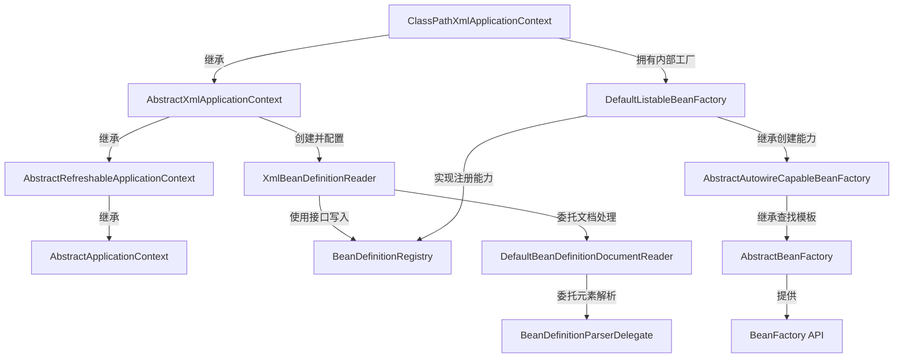
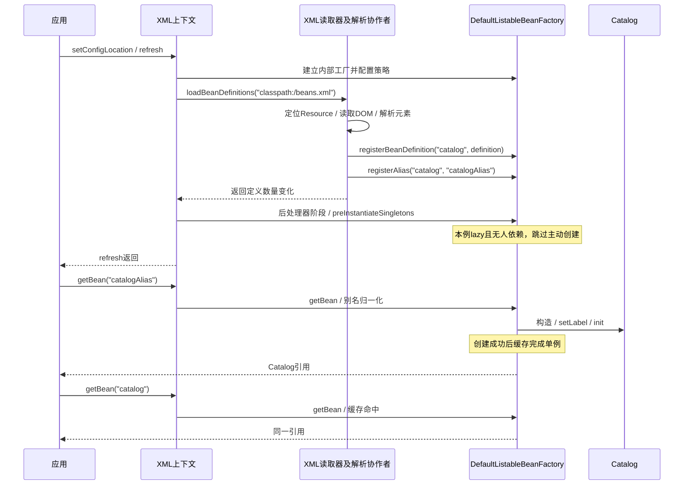
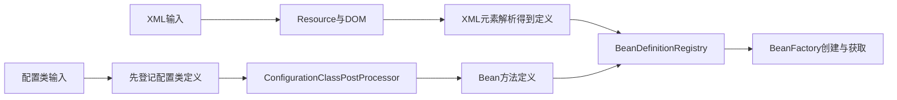

# BeanDefinition 从哪里来：定位、解析、注册与实例化的边界

容器里已经能查到 `catalog` 的定义，为什么它的构造器还没执行？把同一个对象换个名称取出来，是多注册了一份定义，还是创建了第二个对象？配置文件有错误，为什么有些在启动时暴露，有些要到第一次调用才失败？

这三个问题共享一条主线：**资源描述输入在哪里，解析器把输入变成创建元数据，注册表保存元数据，BeanFactory 在需要实例时执行元数据。** `ApplicationContext` 把这些步骤编排成刷新过程，但“刷新”不是一个只做注册的动作。

本页用一份只有一个 Bean 的 XML 跨类跟踪。选择 XML 是为了让“字符串位置 → Resource → DOM → BeanDefinition”都能看见，并不要求新项目采用 XML。后半段会解释注解和 Boot 从哪里汇合。读完应能在真实工程里放对断点，并根据定义表、别名表、实例缓存三个不同状态判断问题停在哪一层。

按你的问题选择入口：

- 想跟调用链：[从定位追到注册](#source-input-path)，先看谁调用谁
- 想解释懒加载：[查看定义跨到对象的边界](#instance-boundary)，对照状态快照
- 想亲自验证：[运行工程并设置断点](#debug-lab)，再用错误变体检验理解

## 1. 先固定输入，别从一张巨大的 refresh 图开始

输入文件 `src/main/resources/beans.xml`：

```xml
<?xml version="1.0" encoding="UTF-8"?>
<beans xmlns="http://www.springframework.org/schema/beans"
       xmlns:xsi="http://www.w3.org/2001/XMLSchema-instance"
       xsi:schemaLocation="http://www.springframework.org/schema/beans
           https://www.springframework.org/schema/beans/spring-beans.xsd">
    <bean id="catalog" name="catalogAlias" class="lab.Catalog"
          lazy-init="true" init-method="init" destroy-method="close">
        <property name="label" value="alpha"/>
    </bean>
</beans>
```

`Catalog` 是普通 Java 类，有无参构造器、`setLabel(String)`、`init()` 和 `close()`。构造、初始化、销毁分别累加计数器，不连接外部服务。这里使用默认 singleton 作用域；没有父容器、循环依赖、自定义命名空间、代理、`FactoryBean` 或后台初始化执行器。

主程序先使用无参构造器创建上下文，再明确设置位置和禁止覆盖，最后手动 `refresh()`。不要换成 `new ClassPathXmlApplicationContext("beans.xml")` 后还假设刷新没有发生：带配置位置的常用构造器会主动刷新。[固定版本的构造器实现](https://github.com/spring-projects/spring-framework/blob/v6.2.19/spring-context/src/main/java/org/springframework/context/support/ClassPathXmlApplicationContext.java)

以下保留完整示例的核心调用，简化观察输出；它是应用代码，不是对上游方法的伪装。

```java steps
// !step(1:4) 输入 classpath:/beans.xml：仅设置上下文与配置位置，尚未开始解析；Catalog 构造次数为 0。
// !step(5:9) refresh 触发回调时，catalog 定义已经注册，containsSingleton(catalog) 仍为 false；回调只观察，不调用 getBean。
// !step(10:10) refresh 返回：本例 lazy-init=true 且无人依赖 catalog，所以仍没有 catalog 实例。
// !step(11:13) 先用别名取对象，再用主名称取：第一次创建，第二次复用；两个变量引用同一个 singleton。
// !focus(5:10)
try (var context = new ClassPathXmlApplicationContext()) {
    context.setAllowBeanDefinitionOverriding(false);
    context.setConfigLocation("classpath:/beans.xml");

    context.addBeanFactoryPostProcessor(factory -> {
        boolean definition = factory.containsBeanDefinition("catalog");
        boolean instance = factory.containsSingleton("catalog");
        System.out.println(definition + "/" + instance);
    });
    context.refresh();
    Catalog first = context.getBean("catalogAlias", Catalog.class);
    Catalog second = context.getBean("catalog", Catalog.class);
    System.out.println(first == second);
}
```

本段观察的是业务 Bean `catalog`。**不要断言回调中整个容器的 singleton 总数为零**：上下文已经准备环境等基础设施单例。完整实验用 `containsSingleton("catalog")` 和它自己的构造计数定位这个对象。

### 阅读中的三种证据

- **接口合同**：`BeanDefinitionRegistry` 提供按名称注册、获取和移除定义的能力；`BeanFactory` 提供对象获取等能力。接口角色不等于某个具体 Map 的永久结构
- **固定实现**：本文方法顺序、内部字段和辅助方法按 Spring Framework `v6.2.19` 读取，不能原样当成 Spring 5.x 或 7.x 的调用栈
- **运行观察**：下载工程用 JDK 21 和实际解析出的 Spring 6.2.19 验证本页的普通同步路径；没有用这个实验证明后台初始化、AOT 或 Boot Web 启动行为

## 2. 类型关系：同一个工厂承担两个接口角色

源码追踪最容易在“类名很多”时失去方向。先回答谁编排流程、谁读配置、谁保存状态。



文字版：`ClassPathXmlApplicationContext` 自己不实现全部工作；刷新模板来自 `AbstractApplicationContext`，重建内部工厂来自 `AbstractRefreshableApplicationContext`，XML 加载来自 `AbstractXmlApplicationContext`。读取器拿到的注册器实际是 `DefaultListableBeanFactory`。后者同时可以“收定义”和“给对象”，但这是两种不同操作。图省略部分接口和中间父类，箭头所标动词才是本页关注的关系。

把 BeanDefinition 暂时理解为“创建配方”很有用：类名、构造参数、属性、scope、lazy-init、初始化方法都属于配方。但这个类比有边界：配方可以被后处理器修改、可以继承并合并父定义，也可能指向工厂方法而非某个无参构造器；它不是对 Java 源文件的一份复制，更不是实例的快照。[BeanDefinition 接口及说明](https://github.com/spring-projects/spring-framework/blob/v6.2.19/spring-beans/src/main/java/org/springframework/beans/factory/config/BeanDefinition.java)

### 三份状态，不能画成一个“容器 Map”

| 状态 | 本例条目 | 回答的问题 |
| --- | --- | --- |
| 定义表 `beanDefinitionMap` | `catalog → GenericBeanDefinition` | 怎样创建、怎样配置 |
| 别名表 `aliasMap` | `catalogAlias → catalog` | 输入名称最终指向哪个主名称 |
| 完成的单例缓存 `singletonObjects` | `catalog → Catalog实例`，创建成功后才有 | 有没有可复用的这个单例 |

前两份已存在，并不意味着第三份也存在。定义数为 1，别名数为 1，对象数仍可为 0。`DefaultListableBeanFactory` 还维护定义名称列表、合并定义缓存等，不止这三份状态；这里只保留足以解释问题的部分。别名实现来自 [SimpleAliasRegistry](https://github.com/spring-projects/spring-framework/blob/v6.2.19/spring-core/src/main/java/org/springframework/core/SimpleAliasRegistry.java#L57-L92)，完成单例缓存来自 [DefaultSingletonBeanRegistry](https://github.com/spring-projects/spring-framework/blob/v6.2.19/spring-beans/src/main/java/org/springframework/beans/factory/support/DefaultSingletonBeanRegistry.java#L159-L176)。

<a id="source-input-path"></a>

## 3. 入口与动态分派：refresh 怎么走到 XML 读取器

以下顺序固定于本例对象类型；“声明在哪个父类”与“实际执行哪个实现”分开写，避免看到抽象方法就误以为链路断了。

| 调用方 → 方法 | 实际执行位置 | 输入、输出和状态变化 |
| --- | --- | --- |
| 应用 → `refresh()` | `AbstractApplicationContext` | 准备上下文，依次编排刷新阶段；成功返回 `void` |
| `refresh` → `obtainFreshBeanFactory()` | `AbstractApplicationContext` | 调用 `refreshBeanFactory()`，然后返回内部工厂 |
| 上一步 → `refreshBeanFactory()` | `AbstractRefreshableApplicationContext` 的 final 实现 | 建立 `DefaultListableBeanFactory`，应用覆盖等配置，然后加载定义 |
| 上一步 → `loadBeanDefinitions(beanFactory)` | `AbstractXmlApplicationContext` 的 override | 建立 `XmlBeanDefinitionReader`，把工厂作为 registry，把上下文作为 ResourceLoader |
| 上一步 → `loadBeanDefinitions(reader)` | `AbstractXmlApplicationContext` 的重载方法 | 读取 `getConfigLocations()` 得到 `String[]`，传给 reader |
| 上一步 → `loadBeanDefinitions(String...)` | `AbstractBeanDefinitionReader` | 遍历位置字符串，汇总各次注册的数量变化 |

注意两个 `loadBeanDefinitions` 既有 override 也有 overload，不能只靠同名认方法。`ClassPathXmlApplicationContext` 在本例中继承 XML 父类的实现；不存在一个需要你继续寻找的同名子类 override。[刷新模板](https://github.com/spring-projects/spring-framework/blob/v6.2.19/spring-context/src/main/java/org/springframework/context/support/AbstractApplicationContext.java#L586-L653)、[工厂重建](https://github.com/spring-projects/spring-framework/blob/v6.2.19/spring-context/src/main/java/org/springframework/context/support/AbstractRefreshableApplicationContext.java#L121-L138)、[XML 加载与读取器配置](https://github.com/spring-projects/spring-framework/blob/v6.2.19/spring-context/src/main/java/org/springframework/context/support/AbstractXmlApplicationContext.java#L82-L131)

这一步还划出了上下文和工厂的边界：`refresh()` 是上下文的生命周期操作；`DefaultListableBeanFactory` 没有替它协调消息源、事件广播和刷新事件。直接使用 `XmlBeanDefinitionReader(factory)` 可以加载定义，却不会自动跑完整个 `ApplicationContext.refresh()`。

## 4. 资源定位：classpath 字符串在哪里变成可读字节

输入是 `classpath:/beans.xml`，不是磁盘绝对路径，也不是 `classpath*:` 扫描表达式。本例的 `ResourceLoader` 就是上下文，它也实现 `ResourcePatternResolver`。所以读取器实际进入 `instanceof ResourcePatternResolver` 分支，先调用 `getResources(location)`，而不是直接走单资源 `else` 分支。

准确路径如下：

1. `AbstractBeanDefinitionReader.loadBeanDefinitions(String, Set<Resource>)` 检查实际 ResourceLoader 能力，调用其 `getResources`
2. `AbstractApplicationContext.getResources` 委托自己的 `PathMatchingResourcePatternResolver`
3. `PathMatchingResourcePatternResolver.getResources` 发现既非 `classpath*:`，也没有通配符，构造单元素 `Resource[]`
4. resolver 的 `getResource` 委托底层上下文；本例执行继承来的 `DefaultResourceLoader.getResource`，识别 `classpath:`，返回 `ClassPathResource`
5. `loadBeanDefinitions(Resource...)` 逐个调用抽象的单资源重载，动态分派到 `XmlBeanDefinitionReader.loadBeanDefinitions(Resource)`

[读取器分支](https://github.com/spring-projects/spring-framework/blob/v6.2.19/spring-beans/src/main/java/org/springframework/beans/factory/support/AbstractBeanDefinitionReader.java#L209-L254)、[资源模式判断](https://github.com/spring-projects/spring-framework/blob/v6.2.19/spring-core/src/main/java/org/springframework/core/io/support/PathMatchingResourcePatternResolver.java#L359-L404)、[classpath 前缀处理](https://github.com/spring-projects/spring-framework/blob/v6.2.19/spring-core/src/main/java/org/springframework/core/io/DefaultResourceLoader.java#L146-L172)

**拿到 `ClassPathResource` 只是拿到资源描述，并不保证文件已经成功打开。** 真正读取字节发生在 XML 读取器把它包装为 `EncodedResource` 后调用 `getInputStream()`。不存在的文件会在这里失败；因此“位置被识别”与“资源可读”是两个断点。

下面是 `XmlBeanDefinitionReader.loadBeanDefinitions(EncodedResource)` 中的连续执行片段，保留了原执行语句。上下文中还存在循环导入检测、I/O 异常包装和 finally 清理；此处不复制这些分支，完整方法见[固定源码](https://github.com/spring-projects/spring-framework/blob/v6.2.19/spring-beans/src/main/java/org/springframework/beans/factory/xml/XmlBeanDefinitionReader.java#L329-L359)。它不是可单独运行的应用方法。

```java steps
// !step(1:2) 输入 EncodedResource(ClassPathResource)：打开 beans.xml 字节流；此时定义表仍为空，文件不存在就在这里失败。
// !step(3:5) 本例没有另设编码，交给 XML 声明和解析器识别；若 EncodedResource 指定了编码，才设置到 InputSource。
// !step(6:6) 把 InputSource 与原 Resource 交给 XML 加载流程；资源信息保留下来用于错误定位，返回注册数量变化。
// !focus(1:2)
try (InputStream inputStream = encodedResource.getResource().getInputStream()) {
    InputSource inputSource = new InputSource(inputStream);
    if (encodedResource.getEncoding() != null) {
        inputSource.setEncoding(encodedResource.getEncoding());
    }
    return doLoadBeanDefinitions(inputSource, encodedResource.getResource());
}
```

`try` 的自动关闭合同结束这次输入流借用。本文不把 `Resource` 等同于 `File`：配置也可能在 JAR 内，通常应使用流而不是假设 `getFile()` 总能成功。`classpath*:`、通配符、相对 `<import>` 和模块路径会进入不同分支，不在这个单文件例子的调用栈中。

## 5. 解析有两层：DOM 成功，不代表 Bean 能创建

### 5.1 从 XML 字节得到 DOM

`XmlBeanDefinitionReader.doLoadBeanDefinitions` 先调用 `doLoadDocument`，后调用 `registerBeanDefinitions`。前者委托 `DocumentLoader` 的默认实现 `DefaultDocumentLoader`，用 JAXP 生成 `org.w3c.dom.Document`。这里处理 XML 结构、命名空间和校验；还没有把 `catalog` 注册成 Spring 定义。[读取顺序](https://github.com/spring-projects/spring-framework/blob/v6.2.19/spring-beans/src/main/java/org/springframework/beans/factory/xml/XmlBeanDefinitionReader.java#L395-L443)、[DOM 加载器](https://github.com/spring-projects/spring-framework/blob/v6.2.19/spring-beans/src/main/java/org/springframework/beans/factory/xml/DefaultDocumentLoader.java)

本例保留 XML 校验。标准 `spring-beans.xsd` 可通过 Spring JAR 中的 `META-INF/spring.schemas` 映射解析到类路径资源，实验无需联网取得该 XSD；这不代表任何第三方 schema 都不会发网络请求。[PluggableSchemaResolver 的查找与本地资源打开](https://github.com/spring-projects/spring-framework/blob/v6.2.19/spring-beans/src/main/java/org/springframework/beans/factory/xml/PluggableSchemaResolver.java)

### 5.2 从 DOM 元素得到 BeanDefinitionHolder

XML 读取器创建默认 `DefaultBeanDefinitionDocumentReader`，调用其 `registerBeanDefinitions(Document, XmlReaderContext)`。文档读取器处理 `<beans>` 根元素，经 `doRegisterBeanDefinitions`、`parseBeanDefinitions`、`parseDefaultElement`，把普通 `<bean>` 交给 `processBeanDefinition`。解析细节再委托 `BeanDefinitionParserDelegate`。[文档遍历及命名空间分支](https://github.com/spring-projects/spring-framework/blob/v6.2.19/spring-beans/src/main/java/org/springframework/beans/factory/xml/DefaultBeanDefinitionDocumentReader.java#L94-L205)

对本例，`parseBeanDefinitionElement` 先得到主名称 `catalog`、别名列表 `[catalogAlias]`，检查当前 `<beans>` 解析范围内的名称唯一性，再调用另一个重载创建并填充定义：

| XML 输入 | 本次解析出的元数据 | 此时没有发生什么 |
| --- | --- | --- |
| `class="lab.Catalog"` | 普通路径中先保存类名到 `GenericBeanDefinition` | 没有调用 Catalog 构造器 |
| `lazy-init="true"` | lazy-init 标志为 true | 没有安排“延迟注册” |
| 默认作用域 | singleton 语义；定义的 scope 字段可能仍是默认空串 | 没有立即产生 singleton |
| `property label="alpha"` 对应的元素 | `PropertyValue` 保存待转换的值 | 没有调用 `setLabel` |
| `init-method` / `destroy-method` | 保存方法名 | 没有调用 init 或 close |
| `id` 和 `name` | `BeanDefinitionHolder(definition, beanName, aliases)` | 别名还不是另一份定义 |

最后一行容易被忽略：名称和别名随 `BeanDefinitionHolder` 一起交给注册流程，`BeanDefinition` 本身主要描述如何创建和配置对象。[名称解析](https://github.com/spring-projects/spring-framework/blob/v6.2.19/spring-beans/src/main/java/org/springframework/beans/factory/xml/BeanDefinitionParserDelegate.java#L415-L475)、[定义与属性解析](https://github.com/spring-projects/spring-framework/blob/v6.2.19/spring-beans/src/main/java/org/springframework/beans/factory/xml/BeanDefinitionParserDelegate.java#L501-L530)

“先保存类名”也有条件：`BeanDefinitionReaderUtils.createBeanDefinition` 在 reader 提供了 BeanClassLoader 时可以加载 Class，否则保存字符串。本例没有显式配置 reader 的 BeanClassLoader。**加载类与创建实例仍是不同动作**，即使走到加载 Class 的分支，也不能据此认定构造器已运行。[创建 GenericBeanDefinition 的实现](https://github.com/spring-projects/spring-framework/blob/v6.2.19/spring-beans/src/main/java/org/springframework/beans/factory/support/BeanDefinitionReaderUtils.java#L56-L71)

## 6. 注册：把定义和别名交给谁，改变了哪些状态

`processBeanDefinition` 在解析成功后先允许自定义装饰，再调用 `BeanDefinitionReaderUtils.registerBeanDefinition(holder, registry)`。本例没有自定义装饰。下面保留该工具方法的执行语句，删除原说明性注释；`registry` 的实际对象是本次上下文内部的 `DefaultListableBeanFactory`。

```java steps
// !step(1:5) 输入 holder(catalog, [catalogAlias], definition)：先以主名称登记定义，beanDefinitionMap 从空变成一个条目。
// !step(6:11) 同一个 holder 的别名随后单独登记：aliasMap 增加 catalogAlias→catalog，定义数不会加一，也不创建实例。
// !focus(4:5)
public static void registerBeanDefinition(
        BeanDefinitionHolder definitionHolder, BeanDefinitionRegistry registry)
        throws BeanDefinitionStoreException {
    String beanName = definitionHolder.getBeanName();
    registry.registerBeanDefinition(beanName, definitionHolder.getBeanDefinition());
    String[] aliases = definitionHolder.getAliases();
    if (aliases != null) {
        for (String alias : aliases) {
            registry.registerAlias(beanName, alias);
        }
    }
}
```

[完整方法及许可](https://github.com/spring-projects/spring-framework/blob/v6.2.19/spring-beans/src/main/java/org/springframework/beans/factory/support/BeanDefinitionReaderUtils.java#L157-L172)是精确核对入口。上游 Spring 代码以 Apache-2.0 许可发布，下载包保留来源说明。

`DefaultListableBeanFactory.registerBeanDefinition` 先校验定义，检查同名旧定义与覆盖策略，再写入定义表。新名称还会加入 `beanDefinitionNames`；替换旧定义则涉及重置相关缓存等工作。本文的首次注册走“尚未开始 Bean 创建”的普通分支，不能把它压缩为在任意运行阶段都只有一句 `map.put`。[实际注册实现](https://github.com/spring-projects/spring-framework/blob/v6.2.19/spring-beans/src/main/java/org/springframework/beans/factory/support/DefaultListableBeanFactory.java#L1251-L1342)

这时可以查询 `getBeanDefinition("catalog")`，但 `getBeanDefinition("catalogAlias")` 不会自动变成主名称查询。相对地，`getBean("catalogAlias")` 会走名称转换与别名归一化。所以 `containsBean("catalogAlias")` 可为 true，而 `containsBeanDefinition("catalogAlias")` 为 false。实验同时断言这两件事，避免把“容器知道这个名字”误读成“定义表使用这个名字作键”。

### loadBeanDefinitions 返回的数字是什么

XML 读取器在文档注册前后分别读取定义总数，返回两者之差。因此第一次加载本例返回 1；明确允许覆盖时，用第二个 XML 替换同名定义可以返回 0，即使第二份配置确实生效了。它不是构造对象数，也不能简单解释为“读取到几个 `<bean>`”。[计数实现](https://github.com/spring-projects/spring-framework/blob/v6.2.19/spring-beans/src/main/java/org/springframework/beans/factory/xml/XmlBeanDefinitionReader.java#L517-L521)

<a id="instance-boundary"></a>

## 7. 从定义跨到对象：边界在什么地方

### 7.1 注册结束后，refresh 仍有工作

XML 定义加载后，刷新继续准备工厂、执行 BeanFactory 后处理器、注册 Bean 后处理器，再初始化消息源、事件广播器等基础设施。对普通业务 singleton，最后的 `finishBeanFactoryInitialization` 调用 `preInstantiateSingletons()`。这里说的是“剩余非懒加载单例”，不是保证此前没有任何对象被创建。[初始化阶段](https://github.com/spring-projects/spring-framework/blob/v6.2.19/spring-context/src/main/java/org/springframework/context/support/AbstractApplicationContext.java#L939-L992)

Spring 6.2.19 的准确路径是：`preInstantiateSingletons` 遍历名称并取得合并定义，对非 abstract 的 singleton 调用 `preInstantiateSingleton`；在本例未启用后台初始化的路径中，再检查 `!mbd.isLazyInit()`，由 `instantiateSingleton` 对普通 Bean 调用 `getBean(beanName)`。**不要把旧版本中直接在外层循环检查 lazy-init 的代码贴到 6.2.19 标题下。** 此版本还存在后台初始化及其 future 汇合分支，本文只标出其存在，不声称已经运行覆盖。[6.2.19 的预实例化实现](https://github.com/spring-projects/spring-framework/blob/v6.2.19/spring-beans/src/main/java/org/springframework/beans/factory/support/DefaultListableBeanFactory.java#L1111-L1238)

本例 `catalog` 是 lazy，而且没有其他 Bean 需要它，所以刷新返回时仍无实例。如果把 `lazy-init` 改为 false，刷新就会替调用者先取一次对象。**如果一个非懒加载 Bean 依赖它，即便 catalog 标着 lazy，依赖解析仍可在刷新期间触发它。** 延迟的是主动预实例化，不是禁止任何人提前要求该对象。[懒初始化合同及依赖例外](https://docs.spring.io/spring-framework/reference/6.2/core/beans/dependencies/factory-lazy-init.html)

### 7.2 第一次 getBean 触发创建，第二次查缓存

本例第一次请求使用别名 `catalogAlias`：

1. `AbstractApplicationContext.getBean` 校验上下文状态，委托内部 BeanFactory
2. `AbstractBeanFactory.doGetBean` 调用 `transformedBeanName` 得到主名称 `catalog`，先检查单例缓存；此时没有完成的实例
3. 获取并检查合并后的 `RootBeanDefinition`；对 singleton 调用 `getSingleton(beanName, ObjectFactory)`，回调才负责 `createBean`
4. `createBean` 的实现位于 `AbstractAutowireCapableBeanFactory`；本例没有实例化前短路，进入 `doCreateBean`
5. `createBeanInstance` 在没有 Supplier、工厂方法、带参/自动装配构造器等条件时走无参构造路径；现在 `Catalog.constructions` 才从 0 变成 1
6. `populateBean` 执行属性填充，`initializeBean` 执行相关初始化，随后登记适用的销毁责任；创建回调成功返回后，单例注册器发布完成的实例
7. 第二次以主名称获取时命中同一单例；别名不会再创造一个对象

[doGetBean 与 singleton 创建回调](https://github.com/spring-projects/spring-framework/blob/v6.2.19/spring-beans/src/main/java/org/springframework/beans/factory/support/AbstractBeanFactory.java#L242-L345)、[doCreateBean](https://github.com/spring-projects/spring-framework/blob/v6.2.19/spring-beans/src/main/java/org/springframework/beans/factory/support/AbstractAutowireCapableBeanFactory.java#L560-L656)、[实例化策略分支](https://github.com/spring-projects/spring-framework/blob/v6.2.19/spring-beans/src/main/java/org/springframework/beans/factory/support/AbstractAutowireCapableBeanFactory.java#L1186-L1244)

这里有意只解释普通无环对象的“完成后发布”。Spring 还有早期引用和循环依赖路径，不能把 `singletonObjects` 当成它所有缓存的总称。构造成功也不等于初始化成功；如果属性填充失败，本例构造计数已增加，但完成的 singleton 不应留在缓存里。更深入的初始化、代理和资源清理边界见[容器创建与对象所有权](/knowledge/frameworks/spring-container/bean-lifecycle)。

### 跨对象时序：谁在哪一段拥有控制权



文字版：解析协作者负责解释配置，工厂负责保存定义并在后来执行创建；上下文把二者编排起来。图把 Reader 的内部协作者合并为一条生命线，只为了展示阶段边界，不表示这些方法都定义在一个类里。构造、属性和初始化的精细时序以第 7.2 节为准。

### 对照一次运行的状态快照

| 停下来的时刻 | 定义表 | 别名表 | catalog 完成单例 | 构造 / 初始化次数 |
| --- | --- | --- | --- | --- |
| `setConfigLocation` 后、refresh 前 | 尚未建立本次内部工厂 | 尚未建立 | 无 | 0 / 0 |
| 解析器刚返回 Holder、尚未注册 | 暂无 catalog | 暂无 catalogAlias | 无 | 0 / 0 |
| 注册工具方法返回后 | catalog 存在 | catalogAlias → catalog | 无 | 0 / 0 |
| 本例的 BeanFactoryPostProcessor 中 | catalog 存在 | 同上 | 无 | 0 / 0 |
| lazy 的 refresh 返回后 | catalog 存在 | 同上 | 无 | 0 / 0 |
| 首次 getBean 成功返回 | catalog 存在 | 同上 | 有，label=alpha | 1 / 1 |
| 第二次通过主名获取 | 没增加定义 | 没增加别名 | 同一引用 | 1 / 1 |

关闭时，本例 `close()` 回调执行一次；关闭后的上下文不应再继续用于获取 Bean。我们不从“close 已执行”推导所有内部定义结构都立即清空。

## 8. 失败路径：到底在哪一层拒绝了输入

配置错误不是统一在“解析阶段”解决。先区分文件、XML、定义注册和实例创建，再查最内层原因。

| 实验变体 | 失败阶段 | 观察结果与解释 |
| --- | --- | --- |
| 位置改成 `classpath:/not-present.xml` | 打开 Resource 流 | `BeanDefinitionStoreException`，原因链含 `FileNotFoundException`；尚无定义 |
| XML 标签不闭合 | DOM 加载 | XML 读取异常；尚未进入该文档的 Bean 注册 |
| 同一个 `<beans>` 中两个同名顶层 bean | 元素语义解析 | `BeanDefinitionParsingException`；即便工厂允许覆盖，也会被该解析范围的名称唯一性检查拒绝 |
| 两个资源先后注册相同 id，明确 `allowBeanDefinitionOverriding=false` | 工厂注册 | XML 层包装的异常原因链包含 `BeanDefinitionOverrideException`；第一份定义保留 |
| 同样两个资源，明确允许覆盖 | 工厂注册成功 | 后定义生效，定义数仍为 1，第二次加载返回净增量 0 |
| 属性名 `notAProperty` | 首次实例的属性填充 | 加载定义成功；构造后抛 `BeanCreationException`，原因含 `NotWritablePropertyException`；没有完成单例 |
| `ref="missing"` | 首次实例的依赖解析 | 定义先成功保存引用名；创建时原因链含 `NoSuchBeanDefinitionException` |

同文档重复与跨资源替换是两个不同关卡。[名称唯一性检查](https://github.com/spring-projects/spring-framework/blob/v6.2.19/spring-beans/src/main/java/org/springframework/beans/factory/xml/BeanDefinitionParserDelegate.java#L480-L496)由解析器执行；[覆盖检查](https://github.com/spring-projects/spring-framework/blob/v6.2.19/spring-beans/src/main/java/org/springframework/beans/factory/support/DefaultListableBeanFactory.java#L1268-L1281)由工厂执行。设置允许覆盖不代表所有同名输入都能绕过更早的校验。

**读入一组定义也不是事务。** 在裸工厂实验中，同一文档第一项已注册，第二项的同名检查失败后，第一项仍在；两个资源的第二份加载失败，也不撤销第一份。调用者若要“整批校验后替换”，需要设计自己的隔离与切换，而不是依赖 reader 自动回滚。

反过来，也别把所有失败都套成“refresh 会回滚”。在 6.2.19 的 `refresh()` 中，`obtainFreshBeanFactory()` 位于后续销毁已创建 singleton 的内层 catch 之前。只有看清失败发生在哪个阶段，才能判断走到了哪段清理。晚期刷新失败中的销毁同样不等于外部世界的事务回滚。[refresh 的真实 try/catch 边界](https://github.com/spring-projects/spring-framework/blob/v6.2.19/spring-context/src/main/java/org/springframework/context/support/AbstractApplicationContext.java#L586-L653)

## 9. 扩展点：为什么框架要把定义与对象分开

这个分离提供了一个有实际作用的窗口：在普通业务对象创建前，框架可以补注册定义、修改属性值、读取依赖信息，再决定怎样实例化。

| 扩展点 | 工作对象 | 本页可预测的影响 |
| --- | --- | --- |
| `BeanDefinitionRegistryPostProcessor` | 定义注册表 | 可以增加定义；配置类解析本身就依赖这类扩展 |
| `BeanFactoryPostProcessor` | 工厂及其元数据 | 可以修改尚未创建的 BeanDefinition，例如把 label 从 alpha 改成 rewritten |
| `BeanPostProcessor` | 正在初始化的实例 | 可以处理或包装返回对象；这属于实例阶段，不是 XML 语义解析 |
| `NamespaceHandler` / 装饰机制 | 自定义 XML 元素或定义 | 让非默认命名空间产生或调整定义；本例没有配置 |

实验给上下文增加一个 BeanFactoryPostProcessor，在它运行时确认 `Catalog.constructions == 0`，修改 `catalog` 定义的属性，再取对象断言 `label == "rewritten"`。这比仅说“模板方法方便扩展”更具体：**留出元数据窗口，才能在创建业务对象前改变配方。**

后处理器也可能主动调用 `getBean`，提早创建对象并改变正常时机。因此“BeanFactoryPostProcessor 阶段绝不会创建任何 Bean”不是可靠口诀。本例的观察回调只读状态，变更回调只改定义；没有主动获取业务对象。扩展点的顺序由[刷新模板](https://github.com/spring-projects/spring-framework/blob/v6.2.19/spring-context/src/main/java/org/springframework/context/support/AbstractApplicationContext.java#L601-L628)约束，完整的排序、再入注册和代理链不在本页展开。

### BeanFactory 与 FactoryBean 不是两个拼法

`BeanFactory` 是容器提供对象获取能力的接口；`FactoryBean<T>` 是某个 Bean 可以实现的产物工厂接口。后者的普通名称获取通常指向它生产的对象，`&名称` 用于取得工厂 Bean 本身。本文的 Catalog 没有实现 FactoryBean，不能把它的“一个定义、一个普通 singleton”图直接用于产物缓存分析。上游的 `instantiateSingleton` 已明确区分这两条路径。[普通 Bean 与 FactoryBean 的预实例化分支](https://github.com/spring-projects/spring-framework/blob/v6.2.19/spring-beans/src/main/java/org/springframework/beans/factory/support/DefaultListableBeanFactory.java#L1227-L1238)

## 10. 注解和 Boot 从哪里汇合，哪里并不相同

### 10.1 AnnotationConfigApplicationContext 不是先偷偷生成 XML

执行 `context.register(MyConfig.class)` 时，`AnnotatedBeanDefinitionReader` 先把配置类作为定义注册。刷新期间，`ConfigurationClassPostProcessor.postProcessBeanDefinitionRegistry` 解析配置模型；`ConfigurationClassBeanDefinitionReader` 再把 `@Bean` 方法转成带 factoryBeanName / factoryMethodName 等信息的定义并注册。这些定义最后仍交给 BeanFactory 创建对象，但前面的 XML、DOM 和文档读取器都不会因此运行。



文字版：共同点是定义注册与后续实例创建，差异是输入的解释器以及定义何时扩充。注解流程中刷新前已存在部分定义，刷新又会增加更多定义；不能把 XML 上下文“刷新时新建工厂并读文件”的前半段原样套上去。

这个差异与继承体系也一致：`AnnotationConfigApplicationContext` 基于 `GenericApplicationContext`，它持有预先创建的工厂，刷新不采用 `AbstractRefreshableApplicationContext` 的整套重建工厂策略；`GenericApplicationContext` 只允许一次 refresh 尝试。[注解入口](https://github.com/spring-projects/spring-framework/blob/v6.2.19/spring-context/src/main/java/org/springframework/context/annotation/AnnotationConfigApplicationContext.java#L164-L169)、[GenericApplicationContext 的刷新实现](https://github.com/spring-projects/spring-framework/blob/v6.2.19/spring-context/src/main/java/org/springframework/context/support/GenericApplicationContext.java)、[配置后处理器](https://github.com/spring-projects/spring-framework/blob/v6.2.19/spring-context/src/main/java/org/springframework/context/annotation/ConfigurationClassPostProcessor.java#L278-L290)、[Bean 方法定义注册](https://github.com/spring-projects/spring-framework/blob/v6.2.19/spring-context/src/main/java/org/springframework/context/annotation/ConfigurationClassBeanDefinitionReader.java#L178-L306)

可见测试包含一个 `@Configuration(proxyBeanMethods=false)` 和 `@Bean @Lazy`：register 后目标方法的定义尚不存在；refresh 后定义存在但 Catalog 仍未构造；首次取对象才执行该工厂方法。这项测试验证的是此最小输入，不覆盖全部 component scan、条件装配和自动配置。

### 10.2 Boot 加了一层启动编排和默认策略

对照 Boot `v3.5.16` 的普通非 AOT 路径，`SpringApplication.run` 创建并准备上下文；`prepareContext` 应用工厂配置并加载主 sources，之后 `refreshContext` 进入上下文刷新。类类型的 source 在 `BeanDefinitionLoader.load(Class<?>)` 中委托注解读取器登记，再由配置后处理机制继续展开。[SpringApplication 主链](https://github.com/spring-projects/spring-boot/blob/v3.5.16/spring-boot-project/spring-boot/src/main/java/org/springframework/boot/SpringApplication.java#L303-L320)、[prepareContext](https://github.com/spring-projects/spring-boot/blob/v3.5.16/spring-boot-project/spring-boot/src/main/java/org/springframework/boot/SpringApplication.java#L377-L416)、[BeanDefinitionLoader](https://github.com/spring-projects/spring-boot/blob/v3.5.16/spring-boot-project/spring-boot/src/main/java/org/springframework/boot/BeanDefinitionLoader.java#L133-L174)

这不意味着 Boot 所有定义在 `prepareContext` 就完成注册，也不意味着它总选 `ClassPathXmlApplicationContext`。上下文类型、自动配置、Web 生命周期和 AOT 都可能改变前后阶段。尤其不能拿裸 `DefaultListableBeanFactory` 的覆盖默认值推广为“Boot 默认允许覆盖”：Boot 有自己的 `allowBeanDefinitionOverriding` 配置并在准备阶段应用到工厂。本页实验对两种策略都显式赋值，避免依赖任意默认值。Boot 对照仅做了固定 tag 源码复核，没有冒充 Boot 应用运行证据。

<a id="debug-lab"></a>

## 11. 自己跟一次：断点按状态放，而不是每行都停

[下载完整最小工程](/examples/spring-bean-definition-lab.zip)。需要完整 JDK 21 和 Gradle 8.10.2，不需要数据库、Docker、特殊 JVM 开放参数或付费服务。首次构建需从 Maven Central 获取依赖，准备好缓存后可离线运行。

```sh
gradle --no-daemon --max-workers=1 clean check run
# 依赖已有缓存时：
gradle --offline --no-daemon --max-workers=1 clean check run
```

`check` 依赖自定义的 `verify` 任务；它运行 `src/test/java/lab/BeanDefinitionLabTests.java`，失败直接抛 AssertionError，不依赖 `-ea`，也不把打印出 PASS 当作断言。`run` 则运行普通主程序 `lab.Main`。

调试时给 IDE 关联 Spring Framework 6.2.19 对应源码；使用 `lab.Main`，按下表设置方法或行断点。计数器仅为单线程实验观察，不是线程安全监控实现。

| 断点 | 建议观察 | 应当看到的变化 |
| --- | --- | --- |
| `AbstractXmlApplicationContext.loadBeanDefinitions(DefaultListableBeanFactory)` | beanFactory、reader.registry、reader.resourceLoader | registry 是新内部工厂，ResourceLoader 是上下文 |
| `AbstractBeanDefinitionReader.loadBeanDefinitions(String, Set)` | location、resourceLoader 实际类型 | classpath:/beans.xml；进入 ResourcePatternResolver 分支 |
| `XmlBeanDefinitionReader.loadBeanDefinitions(EncodedResource)` 的 getInputStream | resource 具体类型 | ClassPathResource；从描述跨到真实 I/O |
| `DefaultBeanDefinitionDocumentReader.processBeanDefinition`，parse 返回后 | bdHolder、beanName、aliases、propertyValues | holder 含定义、catalog、catalogAlias；构造计数为 0 |
| `DefaultListableBeanFactory.registerBeanDefinition` 返回前 | beanDefinitionMap、beanDefinitionNames | catalog 已登记；此时工具方法中的别名注册还可能没执行 |
| 应用的 BeanFactoryPostProcessor 回调 | containsBeanDefinition / containsSingleton | true / false |
| `DefaultListableBeanFactory.preInstantiateSingleton` | mbd.isLazyInit、mbd.isBackgroundInit | true / false；本例不主动创建 |
| `AbstractBeanFactory.doGetBean` | name、beanName、sharedInstance | 别名变主名，第一次缓存未命中 |
| `Catalog` 构造器、setLabel、init | 计数、label | 构造后再填属性，再初始化 |
| `DefaultSingletonBeanRegistry.addSingleton` | beanName、singletonObject | 条件设为 catalog，忽略基础设施；完成对象进入单例缓存 |

若 IDE 的变量求值会执行表达式，不要在解析阶段的 Watches 中放 `getBean("catalog")`。调试器自己可能触发你正试图证明“尚未发生”的创建。优先看字段、定义与无副作用计数。

主程序预期输出：

```text
registered: definitions=1, aliases=[catalogAlias], singleton=false, constructed=0
refreshed: singleton=false, constructed=0
looked up: label=alpha, same=true, constructed=1, initialized=1
closed: destroyed=1
```

### 改一个条件，先预测再运行

1. 把 `lazy-init="true"` 改为 false：回调仍只观察到定义；刷新返回时对象已创建
2. 恢复 lazy，但增加一个非 lazy 的 Consumer 引用 catalog：为满足 Consumer 依赖，catalog 可在刷新期间被创建
3. 只把主程序改成裸工厂加 XML reader，且读取 eager 配置：加载成功仍不等于主动预实例化；显式取对象后才创建
4. 两份 XML 同名，分别禁止与允许覆盖：预测异常原因、定义总数和最终 label，不能只观察程序是否退出
5. 把 label 属性名改成不存在的 setter：预测“定义注册成功但创建失败”，并检查失败实例没有成为完成 singleton

完整工程已经把这些预测写成可见断言，还覆盖别名身份、同文档重名、非法 XML、缺失资源、缺失引用、元数据修改和注解入口。结果与环境记录放在下面的独立附录，不作为理解机制的前提。

## 12. 带走的模型与未展开边界

遇到一个 Spring 启动或查找问题，先连续问四个问题：输入资源读到了吗？定义解析并登记了吗？请求的名字归一化成哪个主名？工厂是否开始并成功完成了实例创建？这比背诵“定位、加载、注册、初始化”四个词更能缩小故障范围。

本页没有展开：父子容器的查找回退、父定义合并细节、循环依赖与早期引用、prototype 和自定义 scope、FactoryBean 产物缓存、自动代理、XML import/profile/custom namespace 的全部分支、6.2 后台初始化并发、Boot Web/AOT。它们可以复用本页的状态区分，但需要各自的具体输入与调用栈，不能由这一次最小运行直接推定。

下一步可以继续读[Bean 生命周期与资源所有权](/knowledge/frameworks/spring-container/bean-lifecycle)：配方开始执行之后，谁拥有实例、何时完成初始化、失败和关闭时由谁清理。源码阅读的另一种练习是先画类型角色，再自己写出每次动态分派的接收者类型，最后用断点验证，而不是从搜索结果拼接不同版本的方法名。

<details>
<summary>验证附录：完整工程、运行范围与源码身份</summary>

本页工程包含 `settings.gradle`、`build.gradle`、`gradle.properties`、完整 `Main.java` / `Catalog.java`、XML 输入、13 个可见测试场景、预期输出、`VERIFICATION.md` 与原始执行记录。下载包里的说明给出工具链、实际依赖版本、命令与退出码。

- 源码复核：Spring Framework `v6.2.19` 的上述主链，以及 Boot `v3.5.16` 的非 AOT 入口对照
- 执行范围：JDK 21；普通 XML BeanDefinition 注册和创建边界；一个最小注解入口；无外部服务
- 执行结果：本轮 13 个场景、61 条断言通过，主程序输出符合上文；下载包 `VERIFICATION.md` 保留对应记录。未执行分支不因源码阅读而变成“通过”
- 版本差异：6.2.19 的预实例化存在 `preInstantiateSingleton` 与后台初始化分支；本文没有混用历史 Spring 5.x 的外层 lazy 判断源码
- API 与实现：定义注册、按名获取、懒初始化语义与实现字段、辅助方法分开解释；升级后应重新核对调用分派和断点

正文中的上游源码短片段按 Apache-2.0 标注来源。完整上游文件链接锁到 tag；测试是本工程原创，没有复制参考站的叙述、图或项目经历。文章变更日期与最后运行日期分别记录，历史日志不作为新代码通过的证明。

</details>
