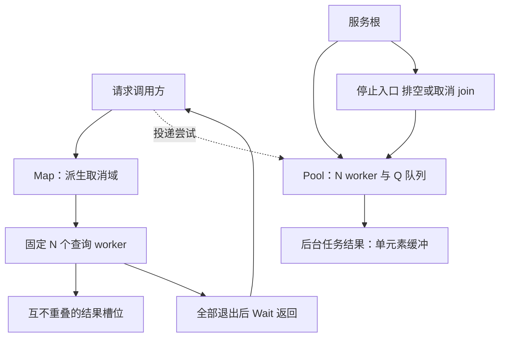
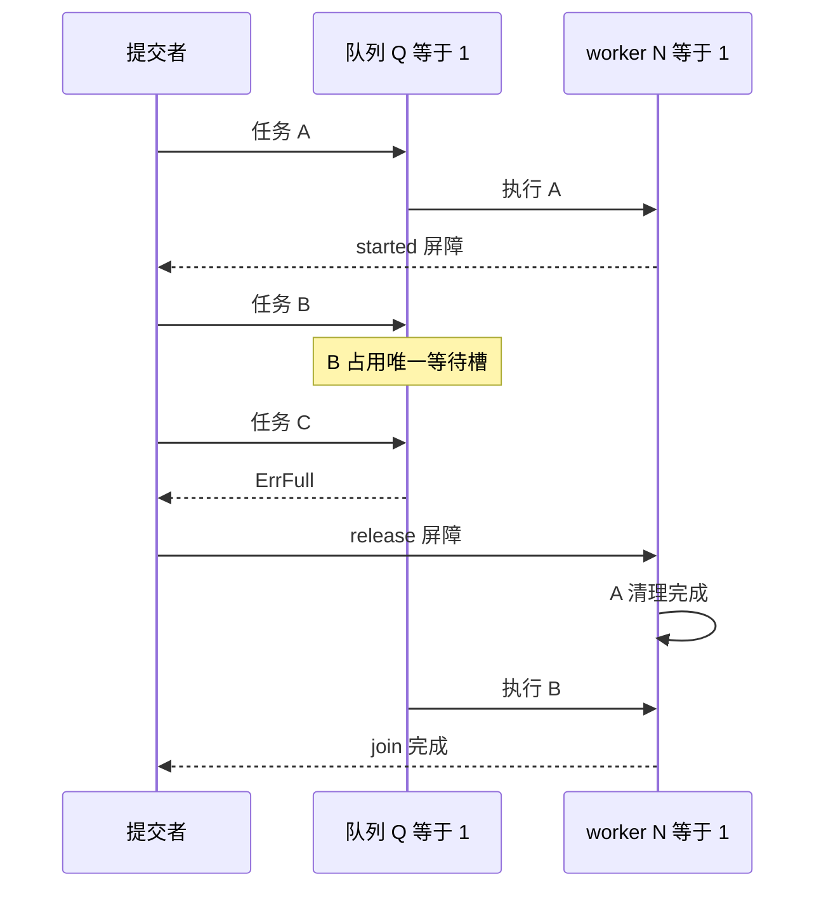
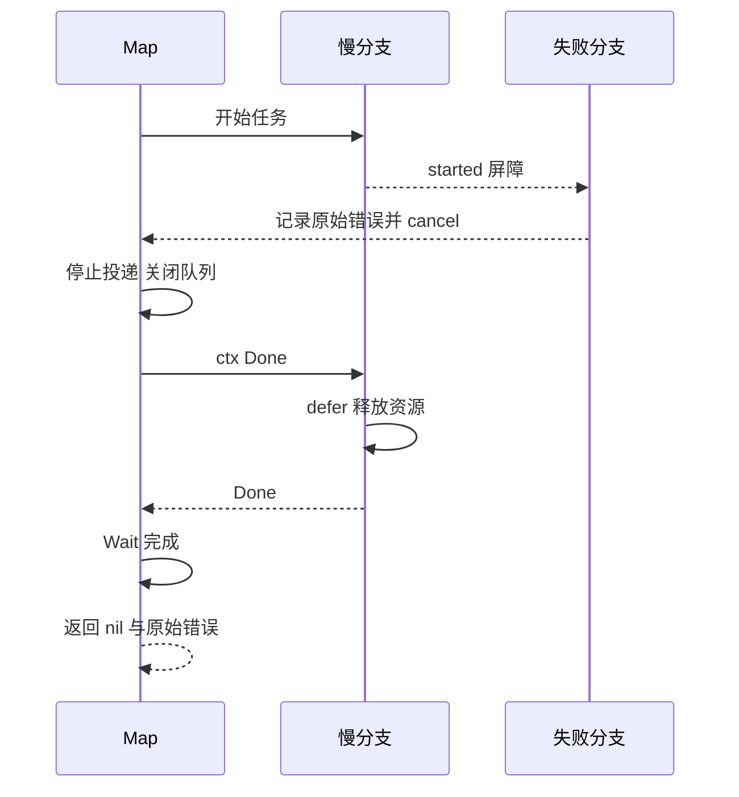

# 有界并发与 goroutine 所有权：启动以后谁等待、谁收尾

给每个商品并发查一次库存，往往只要一行 `go`。困难从第一个分支失败开始：其他分支还在等谁？返回以后谁接收结果？请求取消了，正在排队的十万项输入是否仍然占着十万个 goroutine？

[context 的取消与退出边界](/knowledge/go/concurrency/context-cancellation.html#worker-lifetime)已经说明，取消是协作信号。本章继续提出一个更强的完成条件：**函数返回时，属于它的工作已经收敛；无法收敛时，合同必须公开说明谁继续拥有它。** 发出 cancel 和证明退出之间，差着整个所有权设计。

## 要证明的四件事

先修是 channel、`select`、`defer`、`sync.WaitGroup` 的基本用法，以及取消不会强杀 goroutine。实验固定 Go 1.27.1，只用标准库；不借用 `errgroup` 隐藏排队方式。

有限查询 `Map` 接收一组商品编号，保序返回结果；任一分支失败就放弃整份结果，并取消其他分支，**等待它们退出之后**返回。另一个 `Pool` 用于进程拥有的后台任务：固定 worker 数、固定队列长度、满时立即拒绝、关闭入口后排空。两者共享“任务必须最终返回”的前提，却不能共享请求生命周期。

本章不变量：运行中的业务函数不超过 N；等待队列不超过 Q；停止接单后不再接受新任务；每个被启动的 worker 都有 join 证据。结果数组占用仍随输入长度增长，这也是资源预算，不能因为 goroutine 有界就声称总内存固定。

实验已按固定范围运行，完整命令与下载见文末附录。

## 先画所有者，再写 go



请求拥有的 Map 不创建脱离请求的子任务。后台池则不拿已经返回的请求 context 当自己的生存条件；它使用服务拥有的 context，并且只接收明确转移过所有权的数据。身份和追踪字段可显式复制，不能把整个 request、框架 Context 或 ResponseWriter 塞进闭包让它一直活着。

后台所有权也不等于持久性。进程被杀时内存队列会消失；需要“接受即不丢”的订单、通知或计费任务，应先有持久化接单与恢复协议。这里的池只证明当前进程内的资源管理。

## 并发上限和等待上限是两个数字

常见写法是在 goroutine 里面获取信号量。它最多允许 N 个任务真正执行，却仍然为每一项输入创建 goroutine；如果输入持续到来，阻塞在信号量上的人群没有上限。把获取动作移到 `go` 之前可以限制 goroutine 数，但生产者可能被无限阻塞，HTTP 入站队列照样增长。

本例后台池选择固定 worker 和有界 channel。提交在锁内检查入口状态并做非阻塞发送；队满返回 `ErrFull`，由上层决定 503、降级、稍后重试还是持久化另一路投递。锁不包业务执行，也不等待空位。

```go steps
// !step(1:4) Submit 与关闭入口共用锁，让检查和发送成为同一个原子决策，避免检查后被 close。
// !step(5:5) 每个已接收任务最多回传一个结果，单元素缓冲使调用方放弃接收时 worker 仍能收尾。
// !step(6:11) 满队列立即拒绝；这里既不启动 goroutine，也不把等待转移到另一个隐藏队列。
p.mu.Lock()
defer p.mu.Unlock()
if p.closed { return nil, ErrClosed }

result := make(chan error, 1)
select {
case p.jobs <- job{task, result}:
    return result, nil
default:
    return nil, ErrFull
}
```

代码中的 channel 容量是 Q，执行者是 N，因此已接收、尚未完成的任务至多 N+Q。每个任务的闭包大小和输入大小也必须受控；一项任务捕获 100 MB，Q=10 依然可能很昂贵。创建 Pool 会启动 N 个 worker 和一个固定 join goroutine，与提交次数无关。



`TestPoolBoundedQueueAndAbandonedResult` 按这个时序编排，故意不接收 B 的结果。若结果 channel 改成无缓冲，worker 会卡在回传 B，join 无法完成；这正是反例区分力。测试不是 sleep 一会儿再猜队满，而是等待 A 的 started 事件，确认唯一 worker 已被占住。

## 首错返回以前，先让所有分支归队

`Map` 在调用方 goroutine 中投递任务，只有 N 个 worker。队列容量也是 N；输入全部来自一个有限 slice。调用方是唯一发送者，因而也是唯一关闭者。worker 不关闭公共队列，更不会凭“自己先失败”关闭别人的结果通道。

```go steps
// !step(1:7) 投递者同时监听取消，任务不可能因为没人继续接收就永远卡在普通发送上。
// !step(8:9) 唯一生产者关闭队列；Wait 是收敛边界，不是可删掉的性能负担。
// !step(10:12) 首错丢弃部分结果；只有所有 worker 退出且没有错误，结果才交给调用方。
enqueue:
for i, value := range inputs {
    select {
    case jobs <- indexed{i, value}:
    case <-ctx.Done(): break enqueue
    }
}
close(jobs)
wg.Wait()
if first != nil { return nil, first }
if err := ctx.Err(); err != nil { return nil, err }
return results, nil
```

每个 worker 将结果写入输入编号对应的唯一槽位。没有两个 worker 写同一元素，返回方只在 `Wait` 后读整个结果；不是“多个 goroutine 同时写 slice 都没关系”，而是证明了本例访问地址不重叠及读取发生在 join 之后。[Go 内存模型](https://go.dev/ref/mem)解释可见性，[WaitGroup](https://pkg.go.dev/sync@go1.27.1#WaitGroup)说明等待与完成之间的同步关系。

首个错误由 `sync.Once` 记录，然后触发派生 cancel。调用方被唤醒后停止投递，关闭队列；其他 worker 处理已排入的项时先检查取消，正在执行的函数通过 context 返回。多个失败同时发生时，“首个”指竞争中先被记录的错误，不承诺输入序号最小。若产品需要稳定聚合全部失败，要另外设计结果合同。



取消与“还能否启动一项任务”的边缘竞争需要诚实描述：`select` 的发送和取消可能同时就绪，选中发送并不违反语言规则；worker 的预检查与开始业务之间也没有取消原子屏障。本例保证并发上限和最终 join，不承诺取消时刻之后绝对没有一条业务指令执行。要作这种承诺，需要另一套与业务状态原子协调的协议，而不只是多加一次 `ctx.Err()`。

## panic 清理、Wait 超时与不能兑现的保证

池内 `invoke` 用同一 goroutine 的 `defer/recover` 把隔离任务 panic 转成 `PanicError`。任务自身的 defer 先沿栈执行，再回到恢复点，结果发送后 worker 可处理下一项。`TestPoolPanicCleanupAndContinuedUse` 同时断言清理标志、错误类型和下一项可运行；只断言“不崩溃”不够。

这个策略要求任务失败不破坏共享状态。锁内不变量已损坏、进程级不可恢复问题、`os.Exit`、`runtime.Goexit` 都不在普通 panic 隔离保证内。这里手写 `Add/Done` 使所有权显式；Go 1.27.1 的 `WaitGroup.Go` 要求传入函数不能 panic，不能依赖其内部实现替你吞错。[语言规范的 defer/recover](https://go.dev/ref/spec#Handling_panics)才是恢复范围的依据。

`Pool.Wait(ctx)` 超时只表示等的人不等了，不会自动取消工作。测试在虚拟的一秒后让 Wait 返回超时，断言任务仍在；随后显式 `Cancel()`，并再次 `Wait`，才确认退出。任务若忽略 context 或永远不返回，这个进程内抽象无法保证在期限内 join。把最后一次 Wait 无限挂住和直接结束进程是两种不同的失败策略，[进程停机](/knowledge/go/lifecycle/graceful-shutdown.html)会明确选择。

## 不用 sleep 猜并发，也不用总数猜泄漏

实验的 `testing/synctest` bubble 让可控 channel 与计时器在测试域内同步，只有相关 goroutine 稳定阻塞时虚拟时间才推进。测试因此能准确讨论“一秒预算”，却不用真的等一秒。真实 socket 不属于这种可控阻塞，网络实验放在 bubble 外运行。[synctest 文档](https://pkg.go.dev/testing/synctest@go1.27.1)给出了这条界线。

七项核心测试分别证实：满队列与放弃接收；panic 后清理；等待期限不等于任务取消；最大活跃数为 2 且结果保序；首错以后慢任务已退出；调用方取消后任务已退出；Pool.Done 只在所有 worker 退出后关闭。证明依据是 started/exited、活跃计数与 join，不是 `runtime.NumGoroutine()` 短暂回到某个值。运行时、HTTP transport 等合法后台协程都会影响总数，某个泄漏也可能被另一个协程正常退出抵消。

排查时先看“谁在等什么”：队列满是容量不足还是消费者卡住？结果发送阻塞是调用方退出还是错误分支忘了接收？只增大缓冲可能把发现故障的时间推迟，同时提高内存占用。优先修正退出协议，再根据负载测量决定容量。

## 练习与参考推理

### 修复题：返回首错后直接离开

删除 Map 的 `wg.Wait()`，重新跑首错测试。解释为何即使发送了 cancel，也不能马上读慢分支的清理标志。参考答案必须指出缺少 join，以及 cancel 不建立“子任务已完成”事实。只加 `time.Sleep(10ms)` 得不到稳定修复。

再把 Pool 的结果 channel 改为无缓冲，保留“提交者可以放弃结果”的合同。找出阻塞点，恢复单结果缓冲；如果换成多结果流，则必须改为取消感知发送并指定消费者/关闭所有者，容量 1 不再足够。

### 设计题：最多并发 8，是否足够？

一个查询聚合请求最多 100 个商品，服务同时容纳 200 个请求。分别评审“每请求 8 worker”与“全进程 64 worker、队列 256”两种方案。参考推理：前者可达 1600 个活跃下游操作，后者需处理公平性与请求级取消；还要计入等待输入、结果数组、任务闭包和下游连接等待。合格答案给出过载响应、部分结果政策和观测字段，不能只写一个信号量大小。

如果决定返回部分成功，要同时返回每项状态与失败原因，并说明整体 HTTP 语义。它适合查询聚合，不可未经设计用于要求原子成功的写操作。

## 来源与验证记录

源码关注 [sync/waitgroup.go](https://github.com/golang/go/blob/go1.27.1/src/sync/waitgroup.go)、[runtime/chan.go](https://github.com/golang/go/blob/go1.27.1/src/runtime/chan.go) 的发送/关闭语义，以及前述内存模型；无需通过调度器的偶然顺序解释测试。

七项 worker 合同测试已经用 Go 1.27.1 真实运行通过。所有任务都由测试屏障和退出信号收敛；没有用不受控 sleep 作为正确性证据。全项目 race 与 vet 也已运行通过，结果摘要随下载项目提供；它不承诺任意用户回调都可强制终止，也不提供进程崩溃后的任务恢复。


<details class="verification-appendix">
<summary>实验附录：运行方法、历史记录与未覆盖范围</summary>

[下载完整项目](/examples/go-service-lifecycle.zip)，进入目录运行：

```sh
go test -count=1 -v ./workers
go test -race -count=1 ./workers
```

第一条检查可见行为；第二条检查本次执行中能检测的数据竞争。race 检查不会证明无死锁或业务结果正确，必须与合同断言一起看。

</details>
