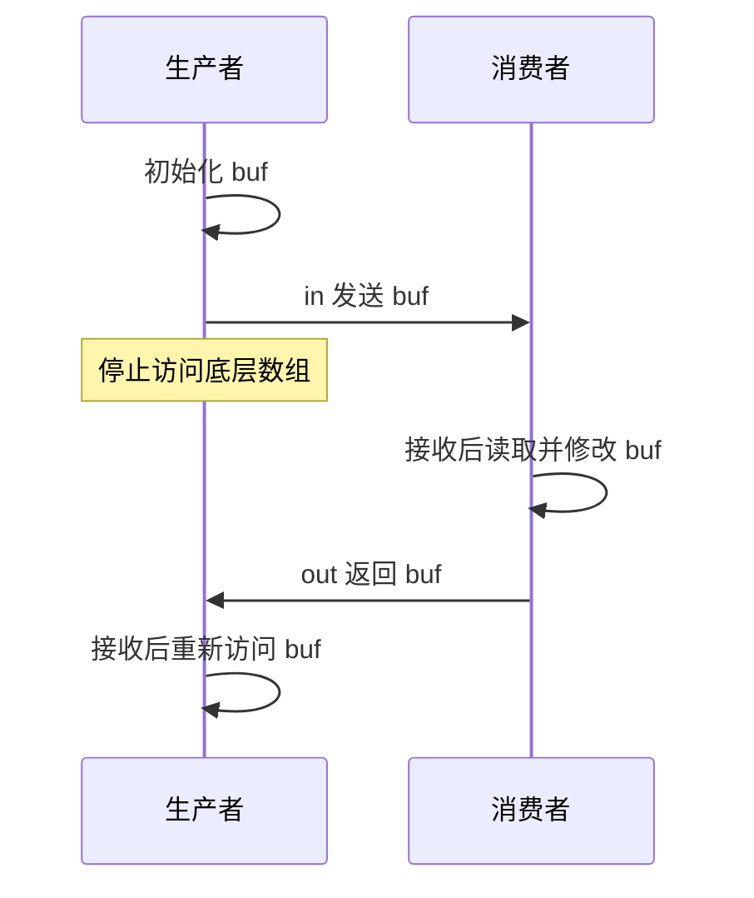

# channel 的同步与关闭：谁交接、谁结束

生产者把 `[]byte("A42")` 送进容量为 1 的 channel，马上把原 slice 改成 `"X42"`。消费者收到的是什么？如果你把“发送成功”理解成“对方已用完一份独立数据”，就很容易在这里出错。

channel 传递元素值，并为特定事件建立同步关系。它没有自动复制 slice 的底层数组，也没有撤销发送者保留的别名。回答这道题，需要同时看清两张图：**哪些动作排在另一些动作之前，以及某段时间谁有权访问同一块可变内存。**

本文用 Go 1.27.1 的有限标准库实验走过这些边界。无需先读完整并发框架；请求取消传播见[context 专题](./context-cancellation.md)，任务数量与退出组织见[有界工作专题](./bounded-work.md)。这里解决的是它们赖以成立的交接规则。

## 1. “已经发送”到底能推出什么 {#synchronization-edges}

先约定三个符号：`W` 是普通内存写，`S` 是发送，`R` 是与它匹配的接收。同一个 goroutine 中有程序规定的先后顺序；跨 goroutine 的同步事件，再把这些局部顺序连起来，形成 happens-before。它不是看墙钟，也不是比较日志时间戳。

发送前先写 `state=42`，另一边在对应接收完成后再读 `state`，可以连出 `W → S → R完成 → 读`。前提是没有其他未受同步约束的写在竞争访问；不能用一条发送规则掩盖整个程序中的数据竞争。[Go 内存模型：同步与 channel](https://go.dev/ref/mem#chan)

四条边应分开使用：

| 条件 | 得到的跨 goroutine 先后关系 | 不能顺手推出的结论 |
| --- | --- | --- |
| 任意 channel 的匹配收发 | 发送同步先于对应接收完成 | 接收后的处理已经完成 |
| 无缓冲 channel | 接收同步先于对应发送完成 | 双方后续代码按固定顺序执行 |
| 容量为 C 的 channel | 第 k 次接收同步先于第 k+C 次发送完成 | 第一次有缓冲发送已经等到接收者 |
| `close(c)` | close 同步先于因关闭而返回零值的接收 | 每次读到缓冲元素都已经观察到 close |



文字版：第一条边发布初始化，第二条边发布处理结果。若删掉返回信号，生产者就失去了“什么时候可以重新访问”的依据。即使用无缓冲 channel，消费者也可能刚完成接收、还没有处理数据。

### 容量从 0 改到 1，会改变证明

设接收方先写 `state=42`，再执行 `<-c`；发送方执行 `c <- token`，发送返回后读 `state`。容量 0 时，接收方的写经无缓冲反向同步边到达发送返回，读取有依据。容量改成 1 后，第一次发送可以只进入空缓冲，原来的证明就断了。

容量 1 并非没有反向同步边：预先放入 `S1` 占满槽位，接收方写入后完成 `R1`，才允许 `S2` 完成。`R1 → S2完成` 因此是 k=1、C=1 的具体实例。实验 `TestCapacityOneSecondSend` 就检查这个条件。**不要把“某次运行恰好先接收”当成修改容量后仍然正确的证明。**

## 2. 一份 slice 怎样交出去又收回来 {#ownership-round-trip}

slice 值包含指向底层数组的引用以及长度、容量。发送 slice 会复制这个值；发送前后的两个 slice 仍可能访问同一数组。指针、map，或含有引用字段的 struct，也需要继续追踪被引用的对象。[Go 规范：表示与 channel 类型](https://go.dev/ref/spec#Representation_of_values)

下面是实验 `ownership.go` 中完整的教学函数。协议规定：发送方交出以后停止访问；接收方修改后通过另一条 channel 归还；调用方还要等待 worker 的结束信号。`buf=nil` 只是提醒，Go 编译器不会替你检查是否还有另一个 `alias`。

<!-- snippet: go-runtime.roundtrip -->
```go steps
// !step(2:4) 两条容量为 1 的 channel 分别发布输入与结果；done 单独表示 worker 已结束。
// !step(5:10) worker 接收后成为数组的访问者，修改首字节，发送结果后结束。
// !step(11:13) 输入是 A42；发送后调用方停止访问底层数组。置 nil 不会使其他别名失效。
// !step(14:16) 收到结果才重新访问数组，再等 done，返回 B42。
func RoundTrip() []byte {
	in := make(chan []byte, 1)
	out := make(chan []byte, 1)
	done := make(chan struct{})
	go func() {
		defer close(done)
		buf := <-in
		buf[0] = 'B'
		out <- buf
	}()
	buf := []byte("A42")
	in <- buf
	buf = nil // A convention: Go does not invalidate other aliases.
	buf = <-out
	<-done
	return buf
}
```

按输入走一遍：`A42` 初始化在第一次发送前；worker 接收后读到它，改成 `B42`；第二次发送发布这个修改；调用方接收后才能恢复访问。两个缓冲各有一项，不能把第一条 channel 的容量当作“最多持有一个业务对象”的系统级保证，其他引用与结果等待仍要计算。

这里可以选择三种不同的协议：

| 选择 | 适用条件 | 代价与易错处 |
| --- | --- | --- |
| 转交独占访问权，再显式归还 | 双方能遵守阶段约束，重复使用大对象值得节省复制 | 所有别名都要服从约束；超时后也不能擅自回收仍被使用的对象 |
| 发送独立副本 | 发送者要马上重用原缓冲，数据规模可控 | 复制成本；`[]byte` 可复制字节，但带指针元素的 slice 浅复制不隔离内部对象 |
| 共享不可变对象或用锁保护可变对象 | 多方需要同时读，或确实需要共享修改 | 不可变要覆盖被引用状态；锁应保护完整不变量，channel 本身不能代替它 |

实验的 `CopyForSend` 使用 `append([]byte(nil), src...)` 为这个字节 slice 建立独立数组。错误变体改成直接返回 `src`，按“先发送、再修改原数组、最后接收”执行，稳定得到 `X42` 并被断言拒绝。**这个反例没有数据竞争**：所有动作在一个 goroutine 中按序发生，却已破坏了“发布内容不会再变”的应用承诺。race 检测器不能替你证明所有权设计。

## 3. 关闭宣布没有更多发送，缓冲还要排空 {#close-and-drain}

`close(c)` 不会抹掉已排入的值。对容量 1 的 `c`，生产者执行“发送 7，写 `state=42`，关闭”，消费者要分两次观察：

1. 第一次接收得到 `(7, true)`。这对应发送 7；仅据这一接收，不能读取后来才写的共享 `state`
2. 第二次接收得到 `(0, false)`。这次因关闭且已排空而返回，才有 close 到该接收的同步边，可在无后续竞争写的条件下读 `state=42`

若生产者发送的是整数 0，第一次也会得到零，但 `ok=true`。所以“读到了零值”不是判断关闭的充分条件。`for v := range c` 在排空后结束，仍不会自动等待消费者另外启动的下游任务。[Go 规范：接收与 close](https://go.dev/ref/spec#Receive_operator)

| 状态 | 接收 | 发送 | close |
| --- | --- | --- | --- |
| nil channel | 永久阻塞 | 永久阻塞 | panic |
| 开放但无可配对操作、缓冲也不满足条件 | 等待 | 等待 | 由协议决定谁可以调用 |
| 已关闭、仍有缓冲值 | 依次得到值和 `ok=true` | panic | 再次关闭会 panic |
| 已关闭、缓冲已空 | 立即得到零值和 `ok=false` | panic | 再次关闭会 panic |

通常让掌握“所有发送都已结束”这一事实的参与者关闭。单生产者经常就是关闭者；多生产者则可以由协调者在所有生产者 join 后关闭。只套一个 `sync.Once` 能避免重复 close，**不能让仍在发送的 goroutine 安全穿过关闭边界**。`chan<- T`、`<-chan T` 限制允许的操作，也没有表达多方的生命周期所有权。

固定版本源码中，`chansend` 在锁下检查关闭、匹配等待接收者、尝试缓冲，必要时登记等待并 park；`chanrecv` 处理关闭后空缓冲、现有发送者和队列；`closechan` 改变关闭状态并唤醒等待者，等待的发送者随后失败。这些分支解释了现场栈，不替代规范保证。[chan.go：发送](https://github.com/golang/go/blob/go1.27.1/src/runtime/chan.go#L176-L310) · [关闭](https://github.com/golang/go/blob/go1.27.1/src/runtime/chan.go#L414-L484) · [接收](https://github.com/golang/go/blob/go1.27.1/src/runtime/chan.go#L524-L697)

## 4. select 在就绪集合中选择，不按书写顺序排优先级 {#select-ready-set}

把 `case <-ctx.Done()` 放在第一行，不代表它一定胜过已经就绪的任务 channel。规范规定：若多个通信都可进行，通过均匀伪随机选择挑一个；没有可进行项且有 default 才走 default，否则阻塞。nil channel 的通信无法就绪，已关闭并排空的接收则始终可以进行。[Go 规范：select](https://go.dev/ref/spec#Select_statements)

这产生三个具体后果。

- 取消和任务同时就绪时，任务分支仍可能被选择。进入分支后再次检查可以减少已知取消后的工作，但不能把“检查取消”和“开始副作用”合成原子操作
- 消费循环发现 `ok=false` 后若继续监听同一已关闭 channel，可能反复读零值。根据协议返回，或将该变量设为 nil，让其他分支继续服务
- 进入 select 时会求值发送表达式的右侧以及各 channel 表达式。把 `expensiveCall()` 写在 `case out <- expensiveCall()` 里，并不意味着只有这条分支最终被选择时才执行该调用

Go 1.27.1 的 `selectgo` 对待检查的 case 构造扰动后的检查顺序；它不是把源码第一行当成最高优先级。[select.go 固定实现](https://github.com/golang/go/blob/go1.27.1/src/runtime/select.go#L167-L202)

实验让两个已关闭 channel 同时就绪，记录 128 次选择，但只断言每次完成恰好一个分支。即使样本中两边都出现，也不能由此证明生产负载下没有饥饿，或每个长度为 128 的窗口都各占一半。业务若需要严格顺序、任务截止后禁止提交或可审计的优先级，需要一个明确的决策状态与同步协议。

## 5. 取消与工作结束要用两件事证明 {#cancel-and-join}

`cancel()` 发出取消信号，不等待工作完成。goroutine 自己退出也不会天然向另一个 goroutine 发布内存写入；需要 done channel、WaitGroup 或其他有明确同步语义的机制。[CancelFunc](https://pkg.go.dev/context@go1.27.1#CancelFunc) · [内存模型：goroutine 结束](https://go.dev/ref/mem#goroutine-destruction)

测试先让 worker 观察取消，再把它停在显式的清理闸门前。此刻取消已发生，而 `exited=false`。释放清理闸门并接收 `done` 后，才检查 `exited=true`。测试域用 `testing/synctest.Wait` 等相关 goroutine 稳定阻塞，不用睡眠猜测它走到哪里；真实网络不放入这个域。[synctest 的等待条件](https://pkg.go.dev/testing/synctest@go1.27.1#Wait)

这一区分会直接影响对象回收：调用方取消以后，如果 worker 还持有转交的缓冲区，就不能立即把它放回池供别人写。可以让调用方等待归还，也可以把最终回收交给拥有 worker 的上层；无论选哪一种，所有权必须延续到最后一次使用结束。完整任务组织参见[有界并发与 goroutine 所有权](./bounded-work.md)。

## 6. 练习：给每个结论补上那条边 {#exercises}

**推理题一：** 生产者先把 7 发入缓冲，再写 `ready=true`，最后 close。消费者收到 7 后打印 `ready`。能否根据“生产者最后总会 close”认为安全？

参考推理：不能。对应发送发生在写之前，而消费这个缓冲元素不要求观察到 close。应等到关闭的接收、另一个明确完成信号，或采用别的同步手段；不能靠重复跑出 true 证明。

**推理题二：** `RoundTrip` 中删掉 `buf=nil`，但发送后到接收结果前完全不访问原数组，是否立即变成错误？

参考推理：不会，nil 赋值不是同步机制。真正必要的是所有别名都遵守访问阶段。反过来，即使写了 nil，只要另一个别名还在并发修改，协议仍被破坏。

**反例题：** 把取消 case 放第一行，再断言“取消后下游调用次数一定为零”。怎样证明或推翻？

参考推理：先区分取消发生在操作开始前，还是与任务就绪同时发生。对同时就绪，规范允许选择任务；对尚未开始的调用，前置检查可以体现应用策略，但检查与副作用之间仍要讨论竞争窗口。给强承诺需要把决策与提交安排到同一受保护状态中。

<details>
<summary>验证附录：源码身份、可运行实验和有限结论</summary>

[下载 source-only 实验包](/examples/go-runtime-boundaries-lab.zip)。其中 `ownership.go`、`ownership_test.go` 可独立阅读；`README.md` 给出精确命令，`proof/` 保存本次已执行观察与拒绝原因。上游原文件保留 Go BSD 许可，教学源采用 MIT 许可。正文函数通过干净源码逐字匹配，不是 runtime 原源码。

规范、API 与固定 tag 源码记为 `source-reviewed`；Code Hike、Mermaid、片段与路径检查记为 `static-checked`；运行记录独立列为 `executed`。本次正确路径的普通测试、race 与 vet 均通过；alias 和 cancel-join 分别被目标断言拒绝，独立 race fixture 产生实际 race 诊断。精确命令、退出码与源哈希在 `proof/result.json`、`proof/commands.json` 及站点验证索引中，来源复核与执行结果分开记录。

正确路径需核对结果与 join；alias、cancel-join 错误变体要因各自的目标断言失败；故意竞争的独立 fixture 要同时有 race 诊断、目标测试失败和工作结束记录。编译失败、启动失败与超时都不算“成功发现目标错误”。正常路径的 race 无报告只覆盖实际执行到的访问和交错，不能证明整个程序没有数据竞争。[race 检测器的覆盖限制](https://go.dev/doc/articles/race_detector)

</details>
