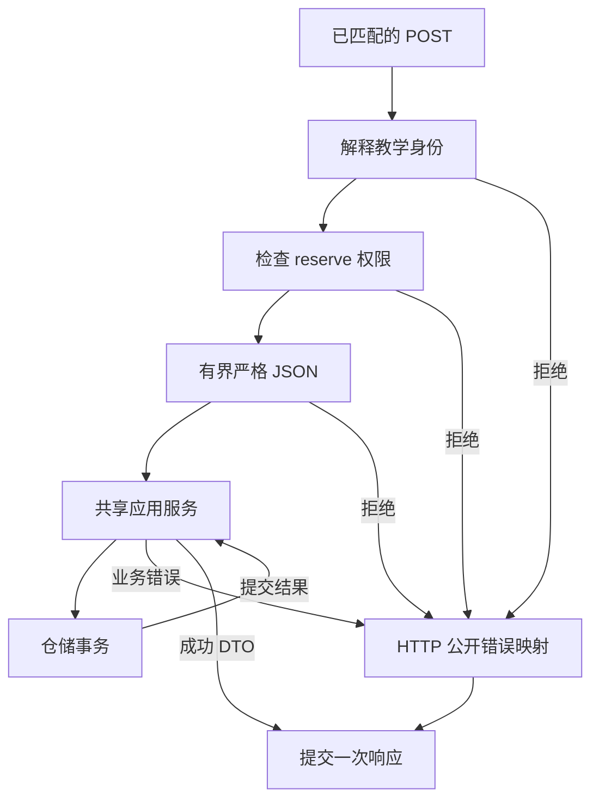

# Gin 服务边界：输入、授权与响应

库存只有一件，接口收到 `{"operation_id":"op-a","sku":"book","quantity":1,"quantity":2}`。客户端以为预约一件，日志里可能记录第一处数量，解码后的结构却可能取最后一处。把参数塞进 struct 并得到 nil error，尚不足以解释服务接受了什么。

再给同一请求加上教学只读身份 `Bearer lesson-reader`。这次应该先返回参数错误，还是权限错误？如果拒绝后库存发生变化，返回 403 本身也不能证明请求真的停了。

本章的完成任务是沿一个真实入口指出四件事：哪条规则先拒绝，应用服务是否进入，客户端收到哪些字节，数据库最终留下什么。共用作品是[库存预约服务源码包](/examples/reservation-service.zip)（[运行范围](/examples/reservation-service-verification.json)），后两篇分别替换持久化实现、增加 gRPC 入口；数量校验和操作身份始终属于同一个应用服务。

## 先给重复请求一个可查询的身份 {#operation-contract}

输入只有 operation_id、sku、quantity。两个字符串匹配 `[a-z0-9][a-z0-9-]{0,47}`，首字符为小写字母或数字，长度为 1–48；quantity 是 1–100 的整数。主体从已经解释过的身份标记取得，正文不能指定 subject。每个主体拥有独立的操作键空间。

成功响应精确为 `{"operation_id":"op-a","sku":"book","quantity":1,"state":"confirmed"}`。服务统一返回 200，重放相同操作不另外发明 201/200 的差别。数据库行还有 subject，但公开 DTO 没有它；把数据库模型直接传给 `c.JSON` 会把内部字段选择权交给持久化模型。

同一主体使用同一 operation_id 和相同参数，必须得到原来的业务结果。换了 quantity 或 sku，就返回 operation_conflict。库存不足也保存 state=rejected，POST 返回 out_of_stock，GET 仍能查询这个操作。补货以后重放原键，结果仍是 rejected；若要提出新的预约，客户端需要表达一个新的操作。这是本服务选择的幂等合同，不是所有使用“幂等键”的接口都会有的默认行为。

未知商品不会保存操作。授权或输入失败也不会占用键。这个差别让读者能预测两种重试：拼错商品后修正请求，与一次已经形成 rejected 事实的预约，需要不同的操作身份判断。

## 拒绝顺序是公开行为的一部分 {#rejection-order}

这里只讨论已经匹配 POST /v1/reservations 的请求。不存在的路由统一返回 not_found，路由选择不进入业务链。

| 已匹配入口的检查 | 失败结果 | 应用入口 | 持久化结果 |
| --- | --- | --- | --- |
| Authorization 恰好一个值，存在于注入映射 | 401 unauthenticated | 0 次 | 无写入 |
| 主体具备 reserve 权限 | 403 permission_denied | 0 次 | 无写入 |
| application/json，可选 UTF-8 charset | 415 unsupported_media_type | 0 次 | 无写入 |
| 正文读取成功且不超过 1024 字节 | 400 body_read_failed 或 413 body_too_large | 0 次 | 无写入 |
| 单对象、三个指定字段各出现一次、类型正确 | 400 invalid_json | 0 次 | 无写入 |
| ID 格式与数量范围 | 400 invalid_argument | 1 次，止于应用校验 | 无写入 |
| 仓储事务 | 200、404、409 或映射后的系统错误 | 1 次 | 按事务最终事实判断 |

身份失败优先于正文错误。H02 同时发送坏身份和坏正文，固定期望 401；H03 给只读身份发送合法与破损正文，都固定期望 403。测试还检查应用入口计数为零，再从独立数据库连接确认库存和操作表未变。顺序不是靠注释宣告的。

本例的三个 Bearer 字符串是公开教学标记，由构造参数传入。它们只让允许与拒绝路径可复现，不验证密码，不验证签名，也不证明客户端现实身份。默认进程绑定 loopback；容器内需要显式允许明文教学网络。生产接入若更换认证来源，应该先得到明确的 Principal，再复用本例的授权与领域合同。

## Abort 停止后续处理，return 停止当前函数 {#middleware-control}

Gin 的 `Next` 推进 handler 链，`Abort` 把链标记为终止。Abort 不会使当前 Go 函数自动返回；错误路径仍需要 return，否则后续语句可以继续调用服务。`AbortWithStatusJSON` 会提交状态和 JSON，此时不能再以“兜底处理”为由写第二份成功响应。[Gin 1.12.0 Context 源码](https://github.com/gin-gonic/gin/blob/v1.12.0/context.go#L170-L224)

<!-- snippet: service.http-auth -->

```go steps
// !step(1:12) 身份恰好一个且命中注入映射；失败写响应并立即返回
// !step(13:20) 权限通过后保存 Principal，再推进后续 handler
func (a *API) auth(write bool) gin.HandlerFunc {
	return func(c *gin.Context) {
		headers := c.Request.Header.Values("Authorization")
		if len(headers) != 1 {
			failure(c, domain.Fail(domain.Unauthenticated, nil))
			return
		}
		p, ok := a.Tokens[headers[0]]
		if !ok {
			failure(c, domain.Fail(domain.Unauthenticated, nil))
			return
		}
		if err := domain.Authorize(p, write); err != nil {
			failure(c, err)
			return
		}
		c.Set("principal", p)
		c.Next()
	}
}
```

摘录自 `internal/httpapi/http.go`，完整上下文见源码包。

中间件只把已验证 Principal 放进当前请求的 Gin Context。应用服务接收普通 context.Context 和显式 Principal，不持有 Gin Context、ResponseWriter 或 HTTP 状态码。业务函数再次检查权限，避免后续加入 gRPC 时漏掉同一规则。M02 故意让共享 Authorize 总是放行，H03 必须在公开 POST 入口以 HTTP_FORBIDDEN_STATUS 断言检出；一个编译失败的“坏版本”不能证明授权测试有效。



文字版：图中的数据库事务不能修复已经提交的 HTTP 响应；HTTP 错误映射也不能推断数据库一定回滚。连接两者的是显式结果与可查询的 operation_id。

## 为什么本例不直接用 ShouldBindJSON {#strict-json}

Gin 的 Bind 系列可以在 binding 失败时自动中止并写入响应；ShouldBind 系列把错误交给调用者。后者便于控制错误体，但“由谁写错误”与“JSON 接受什么”仍是两件事。标准 encoding/json 对重复成员有既定处理行为，`DisallowUnknownFields` 只解决未知字段，不能自动拒绝重复字段。一次 Decode 成功也不表示后面没有第二个 JSON 值。[Gin binding 方法](https://github.com/gin-gonic/gin/blob/v1.12.0/context.go) · [Go 1.27.1 encoding/json](https://pkg.go.dev/encoding/json@go1.27.1)

本例先通过 MaxBytesReader 限制实际读取，再用 io.ReadAll 检查读错误。Content-Length 不是唯一依据，未知长度与分块输入也必须受限。读取结束后才解释 JSON，使 1025 字节的正文明确落到 body_too_large，不会因为前半段已经像合法对象就被提前接受。[MaxBytesReader](https://pkg.go.dev/net/http@go1.27.1#MaxBytesReader)

<!-- snippet: service.http-read -->

```go steps
// !step(1:10) 限制实际读取字节，并分别处理超限和读取失败
// !step(11:15) 严格解码失败时停止，不进入应用服务
// !step(16:17) 读取和解码完成以后，才开始应用预算
	body, err := io.ReadAll(http.MaxBytesReader(c.Writer, c.Request.Body, MaxBody))
	if err != nil {
		var tooBig *http.MaxBytesError
		if errors.As(err, &tooBig) {
			writeError(c, 413, "body_too_large")
		} else {
			writeError(c, 400, "body_read_failed")
		}
		return
	}
	in, err := Decode(body)
	if err != nil {
		writeError(c, 400, "invalid_json")
		return
	}
	ctx, cancel := context.WithTimeout(c.Request.Context(), Budget)
	defer cancel()
```

摘录自 `internal/httpapi/http.go`，完整上下文见源码包。

<!-- snippet: service.http-decode -->

```go steps
// !step(1:8) 只接受对象，为解码后的字段名建立集合
// !step(9:29) 拒绝未知或重复字段以及 null
// !step(30:41) 要求三个字段和最终 EOF，再做强类型解码
func Decode(body []byte) (in domain.Input, err error) {
	invalid := errors.New("invalid JSON contract")
	d := json.NewDecoder(bytes.NewReader(body))
	token, err := d.Token()
	if err != nil || token != json.Delim('{') {
		return in, invalid
	}
	fields := map[string]json.RawMessage{}
	for d.More() {
		token, err = d.Token()
		if err != nil {
			return in, invalid
		}
		key, ok := token.(string)
		if !ok {
			return in, invalid
		}
		if key != "operation_id" && key != "sku" && key != "quantity" {
			return in, invalid
		}
		if _, exists := fields[key]; exists {
			return in, invalid
		}
		var raw json.RawMessage
		if err = d.Decode(&raw); err != nil || bytes.Equal(raw, []byte("null")) {
			return in, invalid
		}
		fields[key] = raw
	}
	token, err = d.Token()
	if err != nil || token != json.Delim('}') || len(fields) != 3 {
		return in, invalid
	}
	if _, err = d.Token(); err != io.EOF {
		return in, invalid
	}
	if json.Unmarshal(fields["operation_id"], &in.OperationID) != nil || json.Unmarshal(fields["sku"], &in.SKU) != nil || json.Unmarshal(fields["quantity"], &in.Quantity) != nil {
		return in, invalid
	}
	return in, nil
}
```

摘录自 `internal/httpapi/http.go`，完整上下文见源码包。

解码器逐个读字段名，字段名已经完成 JSON 转义解释，因此 quantity 与 qu\u0061ntity 会命中同一个 map 键。它拒绝第二次出现的键，再读取完整 RawMessage，最后对三个字段分别做强类型解码。这个顺序同时拒绝 quantity=null、quantity=1.0 和超出 int64 的数值。形状合法但数量为 0，交给应用校验返回 invalid_argument。

读完右花括号以后还必须得到 EOF。空白允许存在，第二个对象、数字或字符串都不允许。若只调用一次 Decode，`{} {}` 的第二个值可能被留在 reader 中，业务却已经执行。

这套策略的代价是拒绝了某些宽容客户端的输入。例如只新增一个服务端尚不认识的字段，也会变成 invalid_json。对需要平滑演进的公开 API，可以选择允许未知字段，但必须明确记录该合同，并调整测试；不能为了“兼容”无意中放开重复字段或多份正文。整个 1024 字节上限也会限制未来字段增长，扩大它应是一次有测试的接口变更。

## 一份应用规则服务两个入口 {#shared-application}

传输层解释不合法 JSON 时，应用还未进入。合法数量为 0 时，应用已经进入但没有调用仓储。这两个计数不应混成“失败请求都没有业务调用”。`Service.OnEntry` 是实验的观察点，不计作生产指标系统。

<!-- snippet: service.domain-reserve -->

```go steps
// !step(1:8) 领域入口再次授权并校验，校验失败不调用仓储
// !step(9:20) 仓储持久结果交给应用解释，rejected 保留操作身份
func (s *Service) Reserve(ctx context.Context, p Principal, in Input) (Operation, error) {
	if err := Authorize(p, true); err != nil {
		return Operation{}, err
	}
	s.enter("reserve")
	if err := Validate(in); err != nil {
		return Operation{}, err
	}
	op, err := s.Repo.Reserve(ctx, p.Subject, in)
	if err != nil {
		return Operation{}, err
	}
	if op.State == "rejected" {
		return op, Fail(OutOfStock, nil)
	}
	if op.State != "confirmed" {
		return Operation{}, Fail(Internal, nil)
	}
	return op, nil
}
```

摘录自 `internal/domain/service.go`，完整上下文见源码包。

Repository 返回一个已保存操作或错误。应用服务把 rejected 映射为 out_of_stock，但没有删除那条操作；Get 能查询它。HTTP 与 gRPC 使用同一个 Service，这使 H09 验证 HTTP 的操作重放，G01 跨入口验证同一业务事实，避免两个 handler 各复制一份库存判断。

不能把校验全放在 HTTP handler 再让 Repository 假定任何调用者都可靠，也不能让仓储偷偷决定 HTTP 409。前者使新入口绕过业务范围，后者把数据库实现与传输协议耦合。这里的接口只表达业务数据与错误，重试和状态码留在相应边界解释。

## 公开错误体不等于底层错误文本 {#public-error}

本适配器写出的 HTTP 错误都使用 `{"error":{"code":"CODE"}}`，Content-Type 精确为 application/json。数据库地址、SQL、用户信息和调用栈都不进入该 DTO。M01 把公开码替换为 err.Error，H10 用一个包含私有细节的受控错误触发真实 HTTP 请求，必须在 HTTP_ERROR_BODY 处失败。

| 应用公开码 | HTTP 状态 | 判断边界 |
| --- | --- | --- |
| not_found | 404 | 当前主体未见操作，或新操作引用未知商品 |
| operation_conflict / out_of_stock | 409 | 分别表示旧键异参数、已保存 rejected |
| canceled / deadline_exceeded | 499 / 504 | 应用观察到取消或期限；连接仍可写时才可能送达 |
| outcome_unknown | 503 | 提交阶段失败，需用原键协调事实 |
| internal | 500 | 保留内部原因，只公开固定码 |

H10 还分别注入取消、deadline 与未知提交错误，核对这些状态和完整 DTO。这里的受控错误映射与 H11 的真实客户端断开是两种验收路径，不能用前者声称断开的客户端收到了响应。

只断言状态码 500 会漏掉这类泄漏；把正文反序列化到 map 后只看 code 非空也会漏掉多余字段。H10 比较完整字节串，H01 还比较成功 DTO 的字段与顺序。字节合同比语义 JSON 合同严格，这是本教学服务为可观察性作出的选择。若产品允许字段顺序变化，测试可以改成严格字段集合与值比较，但仍需拒绝额外敏感字段。

客户端读取响应也属于验收。测试在 `io.ReadAll` 后检查 error，不能拿已经读到的半段正文继续断言业务成功。真实关闭测试会检查已接纳请求的完整响应和子进程退出，UnexpectedEOF 不能被一条“shutdown complete”日志覆盖。

## 请求取消不替你撤销已提交事务 {#cancellation-and-outcome}

HTTP handler 在正文读取、解码完成后，用请求 context 派生 2 秒应用预算，仓储继续把同一个取消关系传给数据库。测试先让另一个会话持有库存行锁，再用数据库实际锁等待记录确认预约已经阻塞，最后取消请求。观察服务端 context 结束、连接池归还、独立会话没有写入，才能把证据限定为“这个提交前取消路径回滚了”。

2 秒应用预算不覆盖此前的正文读取与解码。默认 http.Server 另有 1 秒 ReadHeaderTimeout、3 秒 ReadTimeout 与 4 秒 WriteTimeout；这些边界负责不同阶段，不能把其中任意一个数字说成整条业务的统一超时。

客户端主动断开以后，服务端可能已无可写响应通道。HTTP 映射保留 canceled→499。499 是本实验选择的非标准扩展状态，不是 HTTP、Go 或 Gin 统一规定的取消状态；基础错误篇中的 408 同样是另一份示例政策。H11 不声称已断开的客户端收到了 499。客户端看到的是自己的取消错误；服务端是否停止、数据库是否提交，必须分别观察。

若 COMMIT 已到达 MySQL，响应却在途中丢失，客户端仍可能看到失败。此时 service 返回 outcome_unknown，使用原主体与 operation_id 查询。不要直接生成新键再预约一次。真实 COMMIT 响应丢失的触发点与观察范围放在[SQL 与 GORM 的不确定提交小节](/knowledge/go/engineering/sql-gorm-boundaries.html#uncertain-commit)。

## 从一次练习得到可复核的判断 {#exercises}

1. 只读身份同时提交 quantity=0 和重复 quantity 字段，应该看到什么？先写状态、正文、应用入口次数与持久化变化，再跑 H03。参考推理：权限位于媒体与解码之前，返回 403 permission_denied，入口计数为零，库存和操作表都不变
2. 去掉最后的 EOF 检查，发送合法对象后再接一个对象。参考推理：前半个输入已经足够组装参数，若默认入口继续成功，测试遗漏了尾随值。H05 应以精确 invalid_json 合同拒绝这个语义变体
3. 把库存补到 10，再重放一个原先因缺货保存的操作。参考推理：原键已有最终结果，不再次扣减；Get 返回 rejected，POST 仍为 out_of_stock。改用新键才是新业务动作
4. 让错误映射直接输出 err.Error，编译仍然成功。参考推理：H10 需要在公开正文断言失败；若只因构建错误、服务未启动或测试超时而失败，不能算错误泄漏被检出

## 附录：源码与验证边界 {#lab-evidence}

源码包保留冻结时的待运行说明；同一份源码随后已完成真实 MySQL/TCP 实验。[验证摘要](/examples/reservation-service-verification.json)记录运行身份、两次历史失败和适用范围。解压后从 `reservation-service-lab/labs/reservation-service/README.md` 开始。

入口在 internal/httpapi/http.go，应用在 internal/domain/service.go，完整矩阵在 acceptance-matrix.json。源码包包含 go.mod/go.sum、固定 proto、生成产物、两个真实 MySQL 仓储及独立观察会话测试。Gin 构建显式使用 nomsgpack 标签，只保留本课需要的 JSON 路线；读者命令和提议的 CI 使用同一标签。

依赖解析、proto 生成、适配单元与编译各有独立记录；集成编译没有执行数据库用例。r2 和 r3 的真实运行都在 P04 失败，其余 57 个集成叶通过；两次原始失败保留。r3 释放后没有记录各项计数，不能把缓存机制推测写成已观察到的唯一原因。r4 的第三次运行已独立核验：58 个集成叶、G07 适配单元与六个语义变体全部通过，自有数据库容器和网络清理完成。[分项验证记录](/examples/reservation-service-verification.json)绑定实际被测提交、版本与范围；这份结果不扩展到生产认证、容量或任意故障。

运行前准备独立 MySQL 8.4.7 教学 schema，使用包内 README 与 scripts/reader-commands.sh。迁移只对新 schema 显式执行，服务不会在接收请求时自动改表。默认 /live 表示进程活着，/ready 还检查数据库并在开始关闭时撤下；数据库断开不会被“进程仍在”掩盖。运行记录、清理结果与源文件身份见 service 的 verification 记录。
