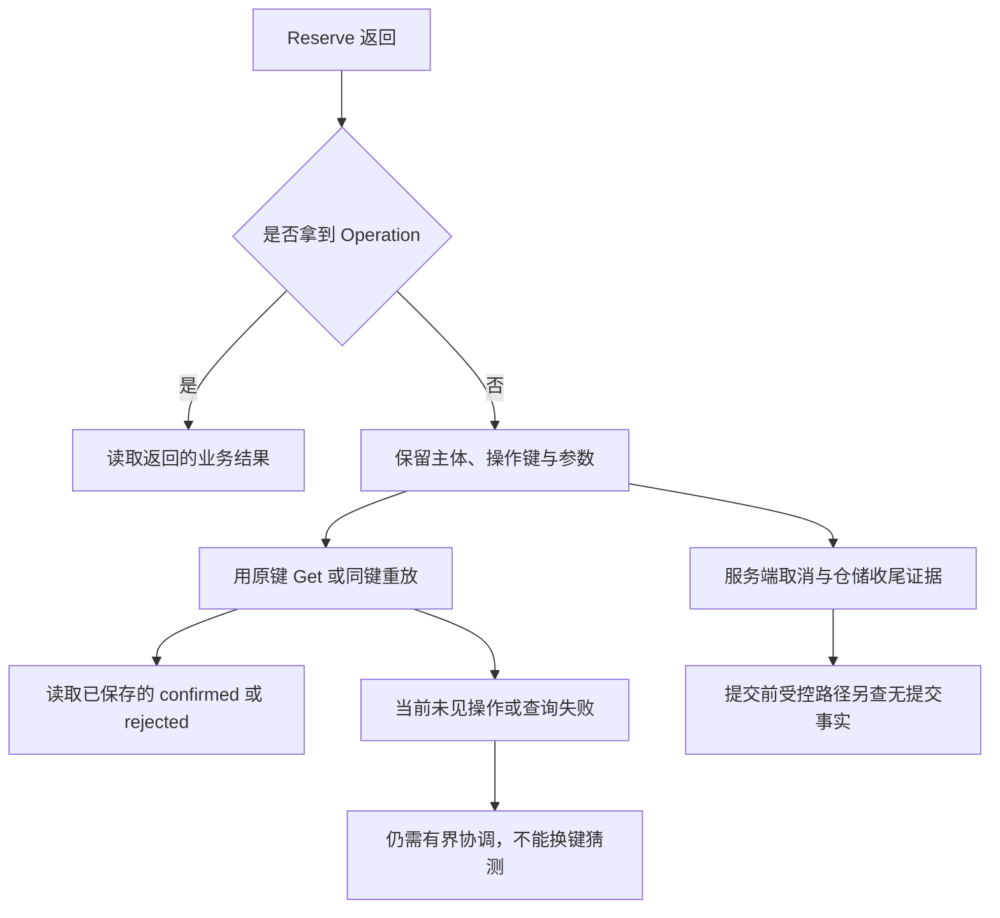
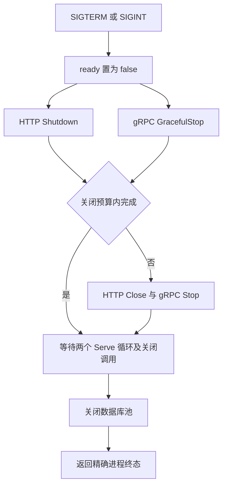

# gRPC 调用：版本、deadline 与流

客户端用 operation_id=op-a 预约一本书，800ms 后收到 DeadlineExceeded。库存有没有扣？如果随后换成 op-b 重试，可能完成第一次预约，也可能多预约一本。RPC 的终态描述这次调用拿到了什么，不足以替数据库回答最后保存了什么。

本章给[库存预约服务](/examples/reservation-service.zip)（[运行范围](/examples/reservation-service-verification.json)）增加 gRPC 入口。HTTP 与 gRPC 调用同一个 domain.Service，同样受参数范围、主体权限和操作身份约束；两种 MySQL 仓储的持久化机制见 [SQL 与 GORM](/knowledge/go/engineering/sql-gorm-boundaries.html#uncertain-commit)。读完后应能给一次失败调用列出客户端状态、服务端是否结束、数据库事实，以及这些观察各自遗漏了什么。

## proto 先表达可长期识别的业务字段 {#proto-contract}

接口只有 Reserve、Get 和 List。Reserve 与 Get 返回一个 Operation，List 返回有限个 Operation。字段没有 subject；主体仍从 metadata 中的教学身份映射取得。ReserveRequest 保留字段编号 4 和名字 subject，Operation 保留编号 5 和相同名字，防止将来误把这些位置拿来承载客户端自报的主体。

<!-- snippet: service.proto -->

```proto
syntax = "proto3";
package reservation.v1;
option go_package = "example.com/reservation-service/api/reservation/v1;reservationv1";

service ReservationService {
 rpc Reserve(ReserveRequest) returns (Operation);
 rpc Get(GetRequest) returns (Operation);
 rpc List(ListRequest) returns (stream Operation);
}
message ReserveRequest {
 string operation_id = 1;
 string sku = 2;
 int64 quantity = 3;
 reserved 4;
 reserved "subject";
}
message GetRequest { string operation_id = 1; }
message ListRequest { int32 limit = 1; }
message Operation {
 string operation_id = 1;
 string sku = 2;
 int64 quantity = 3;
 string state = 4;
 reserved 5;
 reserved "subject";
}
message PublicError { string code = 1; }
```

摘录自 `api/reservation/v1/reservation.proto`，完整上下文见源码包。

Protobuf 的二进制编码使用字段编号识别字段，不能把删除字段的编号随便分给一个新含义。名字还关系到 JSON 表示与开发者阅读，所以本例同时保留编号与名字。新增字段也不等于所有层面都自动兼容：旧客户端能解码，并不保证新业务规则允许旧请求。proto3 中未设置的普通整数读取为 0，本例由应用校验把 quantity=0 和 limit=0 拒绝；不能只因生成代码有 int64 类型，就省掉业务范围检查。[proto3 字段编号、保留字段与默认值](https://protobuf.dev/programming-guides/proto3/)

生成的结构体属于协议边界。适配器从请求 getters 取得值后，显式组装 domain.Input；返回时从 domain.Operation 组装 pb.Operation。应用服务不依赖 protobuf，也不知道 codes.AlreadyExists。这使相同操作可以从 HTTP 创建，再由 gRPC 查询；G01 还要求反方向创建和读取，防止两个入口暗中维护两套事实。

## 生成器、消息 runtime 与 RPC runtime 分别固定 {#generation}

protoc 读取 proto；protoc-gen-go 生成消息类型；protoc-gen-go-grpc 生成服务接口与客户端桩。编译程序还使用 protobuf-go 和 grpc-go runtime。五个组件各有版本，不能把 grpc-go 的 v1.84.0 直接填成 protoc-gen-go-grpc 的版本。后者是独立 Go 模块，本例固定 v1.6.1。

源码包同时提交 proto 和实际生成的两个 Go 文件，生成文件头保留生成器版本，常规编译无需临时安装 protoc。验收用固定 protoc 36.2 和两个插件重新生成，再逐字比较输出。编译时的兼容性检查与这种来源检查回答不同问题：前者检测代码能否和当前 runtime 一起编译，后者确认仓库产物确由指定输入与工具生成。

模块图也需保留实际解析结果。go.mod 的直接要求不等于所有间接模块都被锁成相同版本，go.sum 提供内容校验；不能看到两个文件存在就推导这组工具已经执行过。基础方法见 [可复现 Go 工程](/knowledge/go/engineering/reproducible-testing.html)。完整生成命令随源码包 README 提供。

## 身份、权限和错误详情在入口完成映射 {#status-details}

每次 RPC 只接受一个 authorization metadata 值。没有值、重复值或未登记标记返回 Unauthenticated；只读标记调用 Reserve 返回 PermissionDenied。教学标记是公开测试数据，不是登录凭据。它们不验证客户端现实身份，明文传输也没有提供保密性；默认进程只绑定 loopback。

<!-- snippet: service.grpc-reserve -->

```go steps
// !step(1:7) 身份与权限先于业务，并从 RPC context 派生预算
// !step(8:13) 显式构造领域输入，结果再映射回协议
func (a *API) Reserve(ctx context.Context, in *pb.ReserveRequest) (*pb.Operation, error) {
	p, err := a.auth(ctx, true)
	if err != nil {
		return nil, Failure(err)
	}
	ctx, cancel := context.WithTimeout(ctx, Budget)
	defer cancel()
	op, err := a.Service.Reserve(ctx, p, domain.Input{OperationID: in.GetOperationId(), SKU: in.GetSku(), Quantity: in.GetQuantity()})
	if err != nil {
		return nil, Failure(err)
	}
	return payload(op), nil
}
```

摘录自 `internal/grpcapi/grpc.go`，完整上下文见源码包。

客户端可据公开码处理错误，但不应解析 SQL 或驱动文本。本例应用错误统一映射成 gRPC status，Message 是公开码，Details 恰好包含一个 PublicError，内部 Cause 不进入响应。G02 的合同同时检查 codes、完整 Message、details 数量与实际消息类型，再验证入口计数与数据库事实。

| 应用结果 | gRPC code | 公开 Message 与 PublicError.code | 业务含义 |
| --- | --- | --- | --- |
| 无身份 / 无权限 | Unauthenticated / PermissionDenied | unauthenticated / permission_denied | 不进入应用与仓储 |
| 输入范围错误 | InvalidArgument | invalid_argument | 进入应用校验，不调用仓储 |
| 不存在 | NotFound | not_found | 当前主体查询未见对象 |
| 同操作键异参数 | AlreadyExists | operation_conflict | 旧操作身份不可改写 |
| 库存不足 | FailedPrecondition | out_of_stock | 已保存 rejected，Get 仍可查询 |
| 提交阶段错误 | Unavailable | outcome_unknown | 需要协调原操作的最终事实 |
| 应用观察到取消 / 期限到达 | Canceled / DeadlineExceeded | canceled / deadline_exceeded | 仅在应用状态可送达时包含 PublicError |
| 未分类内部错误 | Internal | internal | 不公开底层错误文本 |

<!-- snippet: service.grpc-failure -->

```go steps
// !step(1:4) 只用公开码构造 status 与唯一 PublicError
// !step(5:7) 详情构造失败也只暴露 internal
// !step(8:9) 返回带有详情的公开状态
func Failure(err error) error {
	code := domain.PublicCode(err)
	s := status.New(Code(code), string(code))
	with, e := s.WithDetails(&pb.PublicError{Code: string(code)})
	if e != nil {
		return status.Error(codes.Internal, "internal")
	}
	return with.Err()
}
```

摘录自 `internal/grpcapi/grpc.go`，完整上下文见源码包。

这里的 AlreadyExists 与 FailedPrecondition 是本服务的错误政策，不能机械地把任何数据库重复键或零行都套上同一状态。尤其 Unavailable 不授权调用方换键重试写入；它只给出本次调用的失败类别，是否重试仍由 operation_id 合同决定。[grpc-go 1.84.0 status API](https://github.com/grpc/grpc-go/blob/v1.84.0/status/status.go)

客户端 deadline 到期或主动取消时，grpc-go 可能直接返回客户端本地状态。G03/G04 针对这一场景要求 Message 分别是 context deadline exceeded、context canceled，details 数量为 0。不能把“应用返回的错误必有一个 PublicError”扩大成“所有 RPC 错误都能读取这个 detail”；网络根本没有把应用错误传回来时，这个假设就不成立。

## deadline 要沿调用传播，写入事实仍需另查 {#deadline-and-outcome}

Reserve 从传入 context 派生最多 2 秒的应用预算。客户端只剩 800ms，派生预算不会把期限延长到 2 秒；换成 Background 则会切断这条关系。没有客户端 deadline 时，服务端应用预算仍保护当前数据库调用，但客户端本身也应明确愿意等待多久。[gRPC deadline 指南](https://grpc.io/docs/guides/deadlines/) 与 [Go context 固定版本源码](https://github.com/golang/go/blob/go1.27.1/src/context/context.go)说明了这两层责任。

G03/G04 先让另一个会话锁住商品，再等待服务端事务进入真实锁等待，然后等客户端到期或发起取消。测试需要看到服务端 context.Done，随后检查连接池归还和独立数据库事实。仅有客户端 DeadlineExceeded 无法证明 handler 已停止，更无法证明数据库一定没有提交。



MySQL 提交响应丢失的 D09 与提交前连接终止的 D10 会形成不同持久事实，却都可能被仓储归为 outcome_unknown。RPC 层应忠实保留这种未知，而不是为了让错误看起来一致，替调用方发明“失败等于未写入”。实际恢复还需要总截止时间与业务处理策略，本服务没有实现后台对账系统。

## List 是一份有界快照，不是变更订阅 {#finite-stream}

List 的 limit 必须在 1–32 之间，查询只读取当前主体，按 operation_id 的 ASCII 顺序返回；confirmed 和 rejected 都属于操作历史。仓储先查询并收集完整结果、关闭 Rows，再进入发送循环。这是一份单次查询得到的有限结果集，后来的预约不会自动加入本次流。

<!-- snippet: service.grpc-send -->

```go steps
// !step(1:6) 可选测试屏障只用来控制交错，默认入口不设置
// !step(7:14) 发送前检查派生 context；Send 错误原样返回并停止
	for i, op := range ops {
		if a.BeforeSend != nil {
			if err = a.BeforeSend(ctx, i); err != nil {
				return Failure(err)
			}
		}
		if err = ctx.Err(); err != nil {
			return Failure(err)
		}
		if err = stream.Send(payload(op)); err != nil {
			return err
		}
	}
	return nil
```

摘录自 `internal/grpcapi/grpc.go`，完整上下文见源码包。

单一 goroutine 顺序发送，不为每个结果创建后台发送者。Send 一旦返回错误就直接返回原错误，不能吞掉它并继续发送，也不能最后返回 nil 把失败流伪装成正常完成。G07 使用假 stream 在第一次 Send 返回一个指定错误，要求相同错误身份与恰好一次调用；M06 故意吞掉该错误，应由 STREAM_SEND_ERROR 唯一断言检出。这个单元结果只说明适配器控制流，不代表真实 HTTP/2 传输已经验收。

G05 的真实 TCP 用例计划分别读取 limit=2 与完整列表，比较每条 Operation 的字段和顺序，再读取到 io.EOF。完整列表包含 rejected 操作，另一个主体的操作不能混入。List 调用创建客户端流成功，也不表示服务端接受了参数；limit=0 或 33 的状态可能要到第一次 Recv 才被看到。

流式客户端只有读到 io.EOF，才能把当前流看作正常完成。先收到两条记录、第三次 Recv 出错，意味着只得到一个前缀；若未来扩展成分页或订阅，需要明确游标和恢复合同。本例没有游标，不能把从头重读说成精确续传。

## 有限条数、发送阻塞与关闭预算是三件事 {#flow-control}

Send 返回 nil 不保证对端应用已经消费消息。gRPC 在传输层管理缓冲与流控，慢读可能让发送等待；不能用“已经调用 Send”当成业务确认。[gRPC 流控指南](https://grpc.io/docs/guides/flow-control/)

本例先装入最多 32 条记录，所以结果集内存与数据库连接持有期有清楚边界。不过派生出的 2 秒 ctx 只传给查询、测试屏障和每次发送前检查。stream.Send 使用 RPC 自己的 context；已经阻塞在 Send 里面时，派生 ctx 到期不会自动替换那个 context。真正中止这次传输仍依赖客户端取消/期限、连接终止或服务端 Stop。[grpc-go 1.84.0 stream.go](https://github.com/grpc/grpc-go/blob/v1.84.0/stream.go)

当前 List 因此不能宣称在所有无 deadline 的慢客户端下都严格 2 秒结束。这里没有用额外 goroutine 包住每次 Send，再在超时时遗弃它，因为那会把发送者的回收责任藏起来。后续若要求独立于客户端的发送硬期限，应把传输取消机制与资源回收作为新合同验证。

G06 用真实 TCP，但在第二条发送前放置受控屏障。客户端收到第一条后取消，测试要求服务端退出、发送尝试数仍是 1，数据库状态不变。它证明受控慢消费点的取消和有限生产路径，没有通过填满真实 HTTP/2 窗口来测出背压阈值，也没有生产吞吐或内存峰值保证。

## 同一个进程同时拥有 HTTP、gRPC 和数据库池 {#process-contract}

reservationd 在接流量前检查 MySQL 连接与显式 schema，分别监听 HTTP 与 gRPC。正常入口默认 HTTP_ADDR=127.0.0.1:8080、GRPC_ADDR=127.0.0.1:9090；STORE 在 sql 与 gorm 中选择。迁移通过独立的 -migrate 模式对新 schema 执行，常规启动不自动迁移。

GET /live 返回进程活性；GET /ready 除了检查 draining 状态，还在 200ms 预算内 Ping 数据库。数据库不可用时，活进程不能自动变成业务就绪。这里没有实现标准 gRPC Health Checking 服务，后续部署可以引用这两个 HTTP 端点，但不能假定已经存在另一份 gRPC 健康 API。



SIGTERM/SIGINT 不直接取消每个业务 context，否则“排空已接纳调用”会在第一步被破坏。默认 SHUTDOWN_GRACE=5s，正常公开配置允许 50ms–30s。HTTP Shutdown 与 gRPC GracefulStop 并行停止接纳并等待在途请求；如果预算到期，Close/Stop 强制中断，进程返回非零。GracefulStop 自身没有 context 参数，必须另有强退路径。[gRPC graceful shutdown 指南](https://grpc.io/docs/guides/server-graceful-stop/)

Runtime 的 WaitGroup 登记的是两个 Serve 循环，httpDone/grpcDone 另等两个关闭调用返回。HTTP Close 会关闭活动连接，但不会为每个 handler 提供 join；即使 Serve 已经返回，也不能据此宣称每个请求函数都已结束。真实子进程的 Wait 终态证明该进程已经退出，远端 MySQL 的线程和事务仍需另查。[Go 1.27.1 HTTP Close 实现](https://github.com/golang/go/blob/go1.27.1/src/net/http/server.go#L3190-L3223)

P01/P02 使用默认 reservationd 子进程检查 HTTP/gRPC 已接纳请求完成、调用结果与正常退出。P03 是同进程 Runtime 加真实 MySQL，检查健康与关闭，不冒充进程信号验收。P04 在真实入口配置 250ms 关闭预算，保持数据库行锁跨过 SIGTERM 与子进程退出，先要求精确 exit=1、固定 stderr、客户端 EOF 和两个端口拒绝连接。

此时服务端数据库线程可能仍等待测试持有的行锁。驱动取消关闭 socket，不同步等待 MySQL 移除线程；锁释放后，数据库还可能继续执行一部分语句再处理连接结束和回滚。P04 先记录释放前的状态，不强迫线程必须存在或必须消失；随后释放本次测试拥有的锁，在同一个 1 秒 context 内检查已捕获的连接与线程、事务、锁等待及 data_locks 全部消失，再从独立会话精确读取 stock=10、operations=0、已提交 pending=0。[mysql-driver 取消路径](https://github.com/go-sql-driver/mysql/blob/v1.10.1/connection.go#L574-L578) · [MySQL 事务结束与回滚](https://dev.mysql.com/doc/refman/8.4/en/innodb-autocommit-commit-rollback.html)

这五项观察不共享同一份时点快照。MySQL 8.4.7 的 INNODB_TRX 使用全局缓存：i_s.cc 先尝试刷新再读取，trx0i_s.cc 仅在距上次读取严格超过 100ms 时允许刷新；每次读完又会推进 last_read。每 5ms 查询一次，可能使缓存一直没有刷新机会。把总超时从一秒改得更长，仍没有修复这条读取时序。[INNODB_TRX 填充入口](https://github.com/mysql/mysql-server/blob/mysql-8.4.7/storage/innobase/handler/i_s.cc#L792-L852) · [缓存刷新条件](https://github.com/mysql/mysql-server/blob/mysql-8.4.7/storage/innobase/trx/trx0i_s.cc#L681-L698) · [读取完成更新 last_read](https://github.com/mysql/mysql-server/blob/mysql-8.4.7/storage/innobase/trx/trx0i_s.cc#L887-L901)

r4 因此把四项即时观察与缓存事务计数拆开。先以最多 200 次采样检查连接、线程和两类锁记录；查询 INNODB_TRX 时，从上一查询完成以后等待 125ms，再作下一次读取，最多 8 次。两阶段仍共用释放锁后的 1 秒截止，查询耗时也占这份预算。缓存事务归零以后，再复查四项即时状态和独立持久事实；每轮都记录各项值，不能用一个复合布尔值隐藏失败维度。

125ms 来自固定源码的刷新条件，不是猜测业务需要多久。这个安排依赖独占 MySQL 和串行夹具，没有其他循环读取 INNODB_TRX；共享实例的其他读者也会推进全局 last_read，不能保证任意监控环境都能得到新快照。七个确定性调度模型检查旧 5ms 饥饿、严格大于 100ms、从查询完成计时、采样上限与总截止，它们只验证模型和源码绑定，仍需真实 MySQL 执行检验 r4。[MySQL 观察一致性说明](https://dev.mysql.com/doc/refman/8.4/en/innodb-information-schema-internal-data.html)

外层测试超时只表示验收未完成，不能充当“服务按合同强退”的证据。P04 验证的是这个固定等待路径，不能推广成任意忽略取消的 handler 都会在 SHUTDOWN_GRACE 后严格退出，也不保证客户端退出瞬间远端数据库已经没有工作。

## 练习：把可观察事实写完整 {#exercises}

1. 客户端剩 100ms，服务端派生 2s context。参考推理：父期限较早，数据库调用不能因子 timeout 获得更长预算；改用 Background 会丢掉原请求的取消关系。预测 G03/G04 应在哪些观察点拒绝这个改动
2. 客户端收到 DeadlineExceeded，却找不到 PublicError。参考推理：先区分客户端本地终态与应用返回的 status；不能据此判定服务漏写 details。对服务端错误映射的 G02，仍必须精确比较一个 PublicError
3. 吞掉第一次 Send 的错误后继续循环，最后返回 nil。参考推理：发送次数与最终错误都错。G07 的假 stream 能验证错误传播；要证明传输端的状态，还需要真实 TCP 用例，二者不能互相替代
4. 客户端不给 deadline，服务器在 Send 中等待。应用派生的 2 秒 ctx 到期能否独自打断它？参考推理：该 ctx 只在 Send 之前检查，实际 Send 使用 stream 的 context；分析客户端取消或服务端 Stop 的退出路径，不能用有限 32 条推导有限时间
5. P04 外层超时杀掉子进程，日志里写了 shutdown。能否判通过？参考推理：不能。必须看到默认进程自己返回精确非零出口、客户端结果与无提交事实，再确认双端口和进程资源回收
6. 子进程已经退出，MySQL 还在等测试持有的行锁。应当立即判泄漏吗？参考推理：先记录真实状态，释放自己控制的外部阻塞条件，再按预先捕获的身份检查数据库收尾与无提交。让数据库清理无限等待也不合格；P04 仍保留释放后 1 秒观察界
7. 每 5ms 查 INNODB_TRX，一秒以后仍非零。能否只把 timeout 改成五秒？参考推理：先查观察工具自己的缓存合同。这个版本每次读取都会更新 last_read，密集查询可能一直阻止刷新；125ms 从查询完成计时，并保留逐项诊断。没有逐轮值的旧日志不能证明残留的只有缓存事务

## 附录：固定源与验证层级 {#lab-evidence}

源码包保留冻结时的待运行说明；同一份源码随后已完成真实 MySQL/TCP 实验。[验证摘要](/examples/reservation-service-verification.json)记录运行身份、两次历史失败和适用范围。解压后从 `reservation-service-lab/labs/reservation-service/README.md` 开始。

proto 位于 api/reservation/v1，适配器位于 internal/grpcapi，默认入口和关闭分别在 cmd/reservationd 与 internal/runtime。生成产物已提交；固定工具重新生成时必须一致。服务限制接收与发送消息 2048 字节，每条 HTTP/2 连接的并发 stream 上限 16；这个设置不等于整个进程只有 16 个调用。

G07 与 M06 的隔离适配单元记录不能扩大到真实 TCP/MySQL 与 P01–P04。r2 首次真实 CI 在持锁等待数据库收尾时失败；r3 释放锁后仍在复合查询的 1 秒期限内失败，释放前记录为 processes=1、threads=1、transactions=1、waits=1、locks=3。r3 没有记录释放后的逐轮值，无法判定哪一项残留；缓存源码只支持修正采样，不证明它是实际唯一原因。r4 的第三次运行已独立核验：58 个集成叶、G07 和六个语义变体通过。P04 释锁后即时四项状态为零，缓存查询前实际空闲 125582 微秒，事务数归零；最终独立事实仍为 stock=10、operations=0、pending=0。[分项验证记录](/examples/reservation-service-verification.json)保留完整身份与边界。源码包提供相同 nomsgpack 构建标签、-buildvcs=false、版本与运行入口。非 loopback 监听需显式 ALLOW_INSECURE_TEACHING_NETWORK=yes，并使用隔离教学网络；本包没有证明 TLS、生产认证或集群部署。
