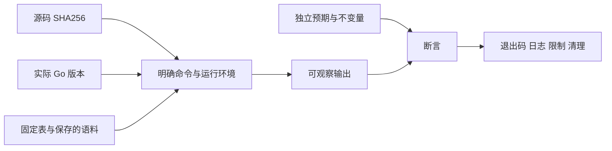

# 可复现 Go 工程：模块、测试与反例

同一段代码在你的机器上通过，换一个目录却拉取了新工具链；报告写“错误实现被拒绝”，原始日志却是语法错误；fuzz 跑了一会没有失败，又被描述成“所有输入正确”。这三种结论都缺少一条关键联系：到底是哪份源码、哪种环境、哪些输入，通过哪条断言得到什么结果？

本章的任务是从空目录复现同一个 [标准库实验包](/examples/go-core-engineering-lab.zip)，保留正向结果和坏实现的精确失败。它接续值/别名与接口/错误问题，但验证方法也用于后续 HTTP/gRPC 服务与控制器。增加真实依赖时需要增加相应证据，不能只沿用这里的绿色测试。

## 1. 最小可复现单位不是一条 go test {#reproducible-unit}

一次可核对的运行至少绑定以下信息：

| 项目 | 本实验选择 | 少了它会怎样 |
| --- | --- | --- |
| 源码身份 | 每个源文件的 SHA256 | 通过结果可能来自修改前的实现 |
| 实际编译器 | 官方 Go 1.27.1，记录 version | 命令名相同不代表执行的是同一工具链 |
| 模块上下文 | 固定 go.mod；GOWORK=off | 外层 workspace 可能改变依赖选择 |
| 输入与预期 | 手写边界表、保存语料、固定 PCG 种子 | 无法重放，或预期随实现一起改变 |
| 命令与环境 | 完整参数、并发上限、只读模块 | 缓存、额外依赖和自动下载可能掩盖变化 |
| 结果与限制 | 退出码、原始日志、对应断言、清理 | 仅“pass”无法分辨通过了什么 |



这里的“可复现”是能重建环境、重放相同输入并检查同一合同。并发调度、微基准耗时和 fuzz 探索过程不因此变成逐字一致。要把可重放的部分与允许变化的部分分别写清。

## 2. go.mod 约定版本，执行环境落实约定 {#module-and-toolchain}

实验的 go.mod 很短：

```go
module example.com/go-core-engineering-lab

go 1.27.1
```

`module` 是导入路径前缀，不意味着访问 example.com。go 指令说明所需 Go 版本与相应语言语义。本实验不添加与 go 行重复的 toolchain 建议行；在一般项目中，toolchain 指令也只是工具链建议，不是“无论在哪里都只能用这一版”的锁。实际运行还要核对 `go version`，并用 `GOTOOLCHAIN=local` 禁止在此过程中自动切换下载。较新本地编译器仍可能满足 go.mod，因此 runner 另检查版本必须为 1.27.1。[go.mod 参考](https://go.dev/doc/modules/gomod-ref)

这是纯标准库模块：没有 require、replace，也没有外部模块校验项。go.sum 有意为空。一般项目中的 go.sum 保存下载内容的校验信息，不是依赖解析的完整锁文件；模块图和版本选择还要看 go.mod 等上下文。增加依赖时，固定 require 后检查实际模块图，不能因为 go.sum 文件很多行就认定环境冻结了。[Go 模块参考](https://go.dev/ref/mod#go-sum-files)

在已安装并校验官方 SDK 的前提下，从解压目录执行：

```sh
export LAB_GO=/absolute/path/to/go1.27.1/bin/go
export GOTOOLCHAIN=local GOMAXPROCS=2 GOWORK=off
export GOFLAGS='-p=1 -mod=readonly -buildvcs=false -trimpath' GOPROXY=off GOENV=off
"$LAB_GO" version
"$LAB_GO" list -m all
"$LAB_GO" mod verify
"$LAB_GO" test -count=1 -timeout=60s ./...
```

本实验模块图应只有 `example.com/go-core-engineering-lab`。`GOPROXY=off` 是这个无外部依赖包的离线保护；有外部模块的新项目若本地缺少下载内容，需要按其下载与校验步骤准备，不能把报错解释成测试逻辑失败。

`-mod=readonly` 防止命令为了满足导入悄悄改 go.mod；它并不独自禁止全部下载，也不校验你手里的源文件。`-count=1` 让本次测试重新执行，不等于清空编译缓存。GOWORK=off 排除外层工作区；明确缓存目录则让资源与清理归属可见。[固定版本 go 命令说明](https://github.com/golang/go/blob/go1.27.1/src/cmd/go/alldocs.go)

不要在每次测试前自动执行 go get 或 go mod tidy。前者会改变依赖，后者用于整理模块声明，应把产生的变化作为待审查源码。复现入口应验证已提交的图，而不是先把它变成“这台机器恰好需要的图”。

## 3. 从可观察任务写表，而不是数断言 {#table-tests}

实验先给三个合同，再挑能区分错误的输入：

- 快照：值相等，nil/空形状相同，输入与输出的可变存储互不影响
- 校验：长度 1–32 字节且满足 ASCII 语法时返回真正 nil error；其他输入可被 Is/As 识别
- 公开错误：状态、媒体类型、Code、Message 精确匹配，内部诊断文本不进入响应

于是测试包含合法最短/最长键、33 字节超界、非法首字符、Unicode、斜线；复制包含 nil/空与共用同一底层数组的两个旧别名。每项来自一个边界，不以“又多一个 case”作为理由。

下面是隔离测试的完整主体。观察值并不是重新调用 CloneSnapshot 生成的“期望”；`A42`、`X42`、`Y42` 与标签值都是独立写下的常量。

<!-- snippet: go-core.clone-isolation -->
```go steps
// !step(2:4) 两个输入 chunk 故意共享一个 A42 数组，再调用公开克隆入口。
// !step(5:9) 修改原 map 与数组，两个输出 chunk 都必须保持 A42。
// !step(10:14) 再改输出第一块，检查原有别名与另一输出块都没有泄漏。
func TestCloneIsolation(t *testing.T) {
	shared := []byte("A42")
	src := corelab.Snapshot{Name: "demo", Labels: map[string]string{"tier": "test"}, Chunks: [][]byte{shared, shared}}
	dst := corelab.CloneSnapshot(src)
	src.Labels["tier"] = "changed-input"
	shared[0] = 'X'
	if dst.Labels["tier"] != "test" || string(dst.Chunks[0]) != "A42" || string(dst.Chunks[1]) != "A42" {
		t.Fatalf("CONTRACT[clone-isolation] input write leaked: dst=%+v chunks=%q", dst, dst.Chunks)
	}
	dst.Labels["tier"] = "changed-output"
	dst.Chunks[0][0] = 'Y'
	if src.Labels["tier"] != "changed-input" || string(src.Chunks[0]) != "X42" || string(src.Chunks[1]) != "X42" || string(dst.Chunks[1]) != "A42" {
		t.Fatalf("CONTRACT[clone-isolation] output write leaked: src=%q dst=%q", src.Chunks, dst.Chunks)
	}
}
```

这个测试能拒绝“初始相等但后续共享”的坏实现。它还刻意检查两个旧别名与两个新 chunk，因此能区分“输入输出隔离”与“输出内部仍共享”的不同合同。若业务需要保留输入的别名拓扑，则应该修改合同与预期，不应把现在的实现视作通用深复制器。

表测试中的子测试名是诊断定位，不是证明强度。报告默认套件通过，与报告“几百个断言通过”并不等价；后者容易把同一个谓词的重复执行当作更多独立证据。这里按验证类型和重要不变量记录，不用循环次数装饰结论。

## 4. 故意写错，检查原测试是否真能拒绝 {#semantic-counterexamples}

四个变体都能合法编译，但分别破坏一个公开合同。它们不藏在另一个演示入口里，而是在临时副本中替换默认入口实际调用的实现。

| 变体 | 精确替换 | 应该失败的位置 |
| --- | --- | --- |
| clone-alias | CloneBytes 的分配+copy 改成 return src | TestCloneIsolation，输入写入泄漏 |
| typed-nil | ValidateKey 成功返回 typed nil | TestValidateKey，合法输入出现非 nil error |
| lost-cause | Load 的 `%w` 改成 `%v` | TestLoadErrorChain，类别与字段提取丢失 |
| public-detail-leak | 固定消息改成 err.Error() | TestWriteError，完整公开 JSON 不符 |

runner 先运行正确实现的默认套件，再为每个变体复制一份源码，确认替换片段唯一，运行 `go test -json -count=1 -timeout=30s ./...`。它先核对固定清单中的测试、子测试和种子身份：每项必须启动一次、完成一次，不能缺失、skip或重复。对坏实现还要求退出码为1、指定测试报告fail、同一测试输出指定的CONTRACT标记；其他失败也必须位于该变体明确允许的测试和标记清单中。编译失败、panic、语法错误、超时都不能算“正确拒绝”。

默认套件中的其他测试也可能被同一个变体破坏，报告保留全部失败名，但不能只凭包最终 fail 就通过变体验收。另一个 harness 阶段故意删掉普通测试、保存语料或匹配的基准：Go 命令应仍退出0，验证器必须报告对应缺项。这样既检查语义错误，也检查“少跑了内容却仍绿”的验收漏洞。

源码必须保持不变。runner 将变体放进自己创建的临时目录，结束后删除这些副本，原实验源码不动。若测试有真实外部写入，这种复制还不足以隔离影响，必须另外控制外部资源身份和清理范围；后续数据库/API server 实验会面对这一层。

## 5. 选择工具：它各自能够观察什么 {#verification-levels}

| 工具/层级 | 本实验实际问题 | 不能从通过推出的结论 |
| --- | --- | --- |
| unit / 默认测试 | 固定输入、错误身份、别名与响应字节 | 所有可能输入、真实网络交付 |
| `go vet` | 可静态发现的可疑使用，例如格式或锁复制 | 没有逻辑错误、没有并发错误 |
| `go test -race` | 已执行并发路径是否报告数据竞争 | 没有遗漏路径、没有死锁、业务隔离正确 |
| fuzz | 在给定输入域继续寻找违反性质的输入 | 穷尽输入空间、复现同一探索顺序 |
| benchmark | 固定大小下的复制时间/分配观察 | 服务吞吐、数据库延迟、所有机器的性能排序 |
| 真依赖集成测试 | 真实服务/API/数据库的行为 | 由内存替身或本章 unit 自动替代 |

`TestConcurrentStore` 的四个 worker 每个运行 32 次，输入归各 worker 所有，Put 返回后才改输入；Get 返回后修改的是私有副本。内部二字节必须保持相等。race 观察这些访问，语义断言观察结果。测试没有依赖固定 sleep 猜另一个 goroutine 是否结束，而是用 WaitGroup 等待有限工作。[Go race 检测器](https://go.dev/doc/articles/race_detector)

race 缺少 C 编译器、环境不支持或超时，应该留下失败/阻塞记录。移除 `-race` 后普通测试通过，不能给 race 项打勾。vet 没有输出通常是正常通过形式，但仍需记录退出码，不能把“没看见消息”当作完整证据。

## 6. 两种随机性：固定生成与探索 fuzz {#fuzz-and-replay}

实验保存两条不同路线。

第一条是确定性生成测试：`rand.NewPCG(20261003,17)` 生成 128 个、长度最多 128 的字节 slice，对 CloneBytes 与 CloneBytesAppend 分别检查值、空值形状和后续修改隔离。保存的 `testdata/deterministic-seed.json` 说明算法、两个种子与边界；相同版本和代码可以重放同一输入序列。

第二条是 Go fuzz。FuzzValidateKey 使用独立的正则语法作为 oracle，避免复制被测函数的字符循环；遇到非法输入还要确认 ErrInvalid 和 FieldError.Value，防止“只是报了任意错”蒙混过关。代码中的七个 f.Add 输入与磁盘上的五个语料文件提供可重放起点，重叠的边界不算不同缺陷。

回放身份与探索预热数量也要分开。默认回放会分别执行12个命名输入；有覆盖率的 fuzz 探索先按语料字节去重，其中32字节与33字节的两个边界各重复一次，因此本包固定语料有10份不同内容。发现缓存可能增加预热项，不能反过来少验一个保存的回放身份。验证器分别核对12个身份、固定语料的10份字节与两组重复关系，再检查探索实际完成预热并达到有界计数。[Go1.27.1 去重与预热源码](https://github.com/golang/go/blob/go1.27.1/src/internal/fuzz/fuzz.go#L434-L458) · [语料编码](https://github.com/golang/go/blob/go1.27.1/src/internal/fuzz/encoding.go#L24-L67)

```sh
"$LAB_GO" test -run='^FuzzValidateKey$' -count=1 -timeout=30s .
"$LAB_GO" test -run='^$' -fuzz='^FuzzValidateKey$' \
  -fuzztime=256x -fuzzminimizetime=0x -parallel=1 -timeout=60s .
```

第一条独立重放12个种子身份，第二条有限探索。本例同时固定 `-fuzzminimizetime=0x`，关闭自动最小化，并要求第二条日志的总 `execs` 恰为256，其中包含覆盖率预热；它不是256个不同或全新的随机输入，第一条命令的12次身份回放也不在这个计数中。缓存发现可能增加预热数量。初始化与进程启动仍受墙钟超时约束。目标函数不使用 Skip；超长键由同一个语法与错误身份性质检查。有限探索仍只覆盖实际产生的输入，不能被表述成“任意长字符串都验证过”。[固定版本测试参数](https://github.com/golang/go/blob/go1.27.1/src/cmd/go/alldocs.go#L3443-L3455) · [Go Fuzzing](https://go.dev/doc/security/fuzz/)

固定版源码中的配置链解释了 `0x` 的含义：解析器允许零并同时清除默认时长；两个零经 testing 原样传到 coordinator，后者只有最小化时长或次数大于零才允许派发最小化任务。普通 worker 每次调用都记数并检查停止条件。本例选择关闭自动最小化来让总量可核对；需要缩减失败输入时，应另设明确预算并保存过程，不能把这里的选择当成通用配置。[参数解析](https://github.com/golang/go/blob/go1.27.1/src/testing/benchmark.go#L51-L69) · [配置传递](https://github.com/golang/go/blob/go1.27.1/src/testing/internal/testdeps/deps.go#L145-L174) · [允许最小化的条件](https://github.com/golang/go/blob/go1.27.1/src/internal/fuzz/fuzz.go#L678-L685)

Go fuzz 没有在这里承诺“设置 PCG 种子就固定探索器”。那两个种子只属于普通生成测试。探索发现失败时，应保存具体语料、源码和命令，再把最小失败输入固定为回归用例。没有失败时可以记录完成的有限探索，不能说已证明没有错误。

runner 保留有界的发现语料缓存（如果本次有产生），并检查源文件是否改变。Go 写入新的失败语料时会触发 sourceUnchanged=false；这是提醒保存并审查新输入，不是要求删掉让结果变绿。失败修复以后另建证据目录，原失败历史仍留下。

## 7. 一个克制的 benchmark {#benchmark-contract}

要比较 make+copy 与 append，先确定二者实现同一合同：保留 nilness、相同字节、可变存储隔离；容量大小不在合同内。否则“少做事的实现更快”并没有回答正确实现之间的代价问题。

<!-- snippet: go-core.benchmark-clone -->
```go steps
// !step(2:7) 计时外准备两个大小，并选择实现相同合同的策略。
// !step(8:10) 分别命名子基准，记录分配和每轮字节量。
// !step(11:13) B.Loop 中只做复制并保留结果。
func BenchmarkCloneBytes(b *testing.B) {
	for _, size := range []int{64, 4096} {
		input := bytes.Repeat([]byte{'a'}, size)
		for _, strategy := range []struct {
			name string
			fn   func([]byte) []byte
		}{{"make-copy", corelab.CloneBytes}, {"append", corelab.CloneBytesAppend}} {
			b.Run(strategy.name+"/"+sizeName(size), func(b *testing.B) {
				b.ReportAllocs()
				b.SetBytes(int64(size))
				for b.Loop() {
					byteSink = strategy.fn(input)
				}
			})
		}
	}
}
```

输入生成放在计时循环外，64 B 与 4 KiB 分开，`b.Loop` 测复制本身，sink 保留结果，ReportAllocs 记录分配，SetBytes 说明每轮处理量。函数变量调用也是此 benchmark 的成本之一；两个策略处于相同调用形态，仍不能据此推断所有内联场景。[testing.B.Loop](https://pkg.go.dev/testing@go1.27.1#B.Loop)

有限示例分成三个独立命令，每次使用 `-benchtime=100x -count=1 -cpu=2 -benchmem`。验证器要求每次都出现四个规定的基准条目，每项只出现一次，且循环次数与全部测量单位完整；删掉基准不能靠退出0过关。这些数字让重跑成本可控，并不具有天然统计充分性。不在正文填一个“快 30%”排名；若要作实际优化决定，需要更长、重复、控制环境的测量与差异分析，并确认热点确实在这里。不要把带 `-race` 的耗时与普通编译耗时直接比较，也不要把一次 ns/op 翻译成 HTTP 请求容量。

## 8. 分阶段跑，失败留在它真正所属的层 {#bounded-runbook}

源码包的 `verify.py` 用 Python 标准库采集证据，每个 phase 单独调用。先把 LAB_GO 与 LAB_CACHE 设为已经授权、校验过的官方 SDK 和独立缓存目录。输出使用源目录之外的新路径。

```sh
python3 verify.py preflight --go "$LAB_GO" --cache-root "$LAB_CACHE" --output ../evidence/preflight-01
python3 verify.py unit --go "$LAB_GO" --cache-root "$LAB_CACHE" --output ../evidence/unit-01
python3 verify.py harness --go "$LAB_GO" --cache-root "$LAB_CACHE" --output ../evidence/harness-01
python3 verify.py mutants --go "$LAB_GO" --cache-root "$LAB_CACHE" --output ../evidence/mutants-01
python3 verify.py race --go "$LAB_GO" --cache-root "$LAB_CACHE" --output ../evidence/race-01
python3 verify.py vet --go "$LAB_GO" --cache-root "$LAB_CACHE" --output ../evidence/vet-01
python3 verify.py fuzz --go "$LAB_GO" --cache-root "$LAB_CACHE" --output ../evidence/fuzz-01
python3 verify.py benchmark --go "$LAB_GO" --cache-root "$LAB_CACHE" --output ../evidence/benchmark-01
```

每阶段内部最多 165 秒墙钟、包并发 1、GOMAXPROCS 2，GOMEMLIMIT 的软目标为384 MiB。验证器采样自己的子进程树，RSS 超过1 GiB或进程数超过16即中止；这是采样中止条件，不是内核硬内存配额。它不自动下载工具链，也不在一次失败后无界重试；失败仍输出 result.json。需要重跑时，先判断失败层：

| 观察 | 先检查 | 不能写成 |
| --- | --- | --- |
| version 不符、模块图多出依赖 | SDK 身份、GOWORK、go.mod | 业务不变量被拒绝 |
| 编译错误或上游源码误被编译 | 文件后缀、目录与包枚举 | 反例成功 |
| 测试超时或进程被终止 | 时限、等待关系、环境资源 | 目标错误被正确处理 |
| 特定 CONTRACT 标记 fail | 对应输入、实际结果、预期常量 | 整个系统都不可用 |
| 单项通过，另一项 NOT_RUN | 原始命令与验证层级 | 完整验收通过 |

本实验不启动数据库、容器、集群或监听服务。变体临时拷贝由 runner 清理，指定缓存保留以供复用，日志与证据保留到审查结束。对后续有外部资源的实验，还要记录创建的身份、范围与实际清理结果，不能用本章的“没有资源”模板套上去。

## 9. 练习与参考推理 {#exercises}

**练习 A：默认测试通过，删除 `-count=1` 后仍通过，能说刚改的代码重新执行了吗？** 参考推理：需要看 Go 的测试缓存条件与输出；不要只凭 pass。复现证据入口用明确参数并绑定源码，避免把一次缓存命中描述成本次实际执行。

**练习 B：给变体故意删掉右括号，runner 应该返回什么？** 参考推理：变体没有形成要验证的语义，属于失败，不是 expected-semantic-rejection。检查 result 与原始构建日志；不要为了得到“4/4 被拒绝”而只看退出非零。

**练习 C：fuzz 发现合法 key 返回 typed nil，怎样留下最小回归？** 参考推理：保存该 key 的原生语料，保留发现时源码与命令；新增清楚命名的普通测试，断言接口本身为 nil；修复后重跑种子、默认套件及受影响反例。探索过程是否能完全重演并不是重放失败输入的必要条件。

**练习 D：将内存 Load 替换成 MySQL 后，哪些证据仍有用，哪些必须补？** 参考推理：公开错误映射和输入合同的 unit 仍有用；事务提交、唯一约束、并发冲突、取消与连接归还必须通过固定版本真实数据库连接观察。一个返回预设错误的 fake 无法证明服务器行为。

**练习 E：为了省分配，CloneBytes 改为返回输入，benchmark 更快了，可以接受吗？** 参考推理：先跑原合同测试会在隔离性上失败，因此不是等价优化。若要引入借用视图，应另外命名、定义生命周期并修改调用方，而不是偷偷改快照的含义。

## 10. 把这套证据带到下一层 {#next-boundary}

本章的完成条件是能从新目录重放正确实现、观察指定坏实现被指定断言拒绝，并分别解释 race、fuzz、benchmark 的范围。执行记录中没跑到的项目保持 NOT_RUN；修改源码以后重新判断旧结果是否过期。

后续服务与控制器仍需要同一条证据链：真实输入 → 实际公共入口 → 稳定不变量 → 原始结果 → 有界清理。不同的是 HTTP/gRPC、MySQL、API server 和 kind 提供了这里没有的真实边界，必须增加那一层执行。更通用的断言设计可继续读 [从不变量设计反例](../../foundations/testing/assertion-counterexamples.md)。
