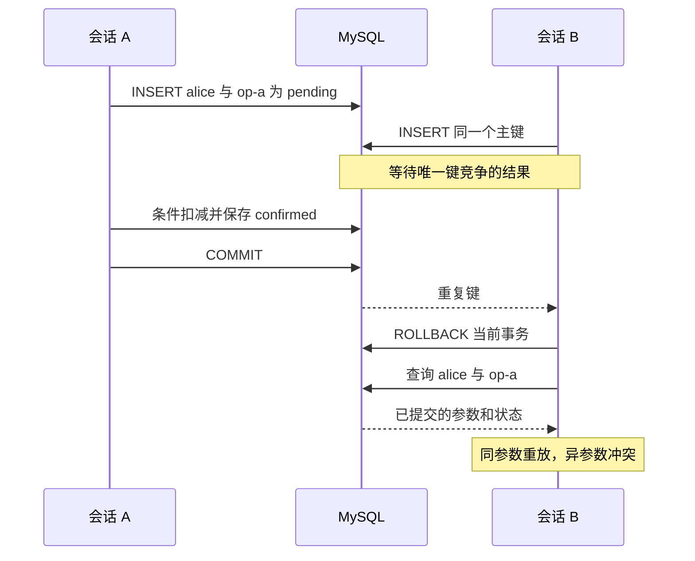
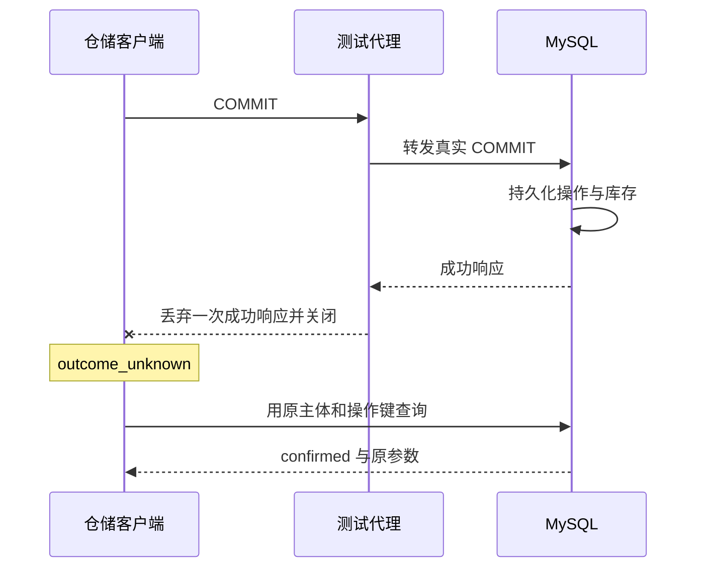

# SQL 与 GORM：事务、连接和数据所有权

商品 book 只剩一件。Alice 用 op-a 预约一件，Bob 几乎同时用 op-b 预约一件。如果两个 handler 都先读到 stock=1，再各自写 stock=0，数据库最后的库存看起来正常，两个人却都可能得到 confirmed。

把 SQL 改成 GORM 链式调用，不会自动消除这段交错。本章沿[同一个预约服务](/examples/reservation-service.zip)（[运行范围](/examples/reservation-service-verification.json)）的两种仓储追踪一次写入，要求读者能解释三种事实：哪次条件更新取得了库存，操作结果何时持久化，函数返回错误以后还能否确定是否提交。HTTP 的严格输入与拒绝顺序见 [Gin 服务边界](/knowledge/go/engineering/gin-service-contract.html#rejection-order)。

## 先冻结两张表之间的不变量 {#invariants}

服务只接受数量 1–100，每次输入带 operation_id 和 sku。数据库以 `(subject, operation_id)` 为操作主键；相同主体重用同一键时，sku 和 quantity 必须与原操作一致。相同参数返回原结果，异参数返回 operation_conflict。主体来自适配器解释的教学身份，不能由正文指定。

每个已提交操作只允许 confirmed 或 rejected。confirmed 对应一次库存扣减，rejected 对应缺货且不扣减；stock 始终非负。pending 仅在事务内占位，任一步骤失败都不能把它留成已提交事实。表定义仍允许 pending，因为事务需要中间状态；“提交后没有 pending”由应用流程与验收共同约束，不能误读为 ENUM 已经完成全部状态机校验。

<!-- snippet: service.schema -->

```sql steps
-- !step(1:5) 商品主键定位库存，CHECK 拒绝负数
-- !step(6:14) 主体和操作键联合唯一；pending 仍需事务流程约束
CREATE TABLE products (
 sku VARCHAR(48) CHARACTER SET ascii COLLATE ascii_bin PRIMARY KEY,
 stock BIGINT NOT NULL,
 CONSTRAINT product_stock_nonnegative CHECK (stock >= 0)
) ENGINE=InnoDB;
CREATE TABLE operations (
 subject VARCHAR(48) CHARACTER SET ascii COLLATE ascii_bin NOT NULL,
 operation_id VARCHAR(48) CHARACTER SET ascii COLLATE ascii_bin NOT NULL,
 sku VARCHAR(48) CHARACTER SET ascii COLLATE ascii_bin NOT NULL,
 quantity BIGINT NOT NULL,
 state ENUM('pending','confirmed','rejected') NOT NULL,
 PRIMARY KEY(subject, operation_id),
 CONSTRAINT operation_quantity_positive CHECK (quantity BETWEEN 1 AND 100)
) ENGINE=InnoDB;
```

摘录自 `migrations/001_init.sql`，完整上下文见源码包。

CHECK 约束为负库存和非法数量提供另一道数据库约束，但它没有表达“这一行 confirmed 必须对应一次扣减”。这个跨表关系需要同一事务。原子提交也只覆盖当前 MySQL 事务，不能顺便保证 HTTP 响应已经到达客户端。

operations.sku 在本例中没有外键。服务没有商品删除 API；创建操作以后才检查商品，再更新库存。若此时加上外键，插入操作会涉及被引用商品的锁，再升级为更新锁可能引入新的竞争与死锁路径。MySQL 文档列出了外键检查与不同语句的锁行为。[MySQL 8.4 InnoDB 锁规则](https://dev.mysql.com/doc/refman/8.4/en/innodb-locks-set.html)

这个选择限定了作品的范围。增加商品删除、外键或其他库存写入口之前，需要重新设计完整性与锁顺序，并补充死锁处理；不能从本章推出“业务库都应去掉外键”。默认迁移是可审查的 SQL 文件，启动时只检查连接和必要列，不会自动修改表。

## 条件 UPDATE 把判断放回持锁的写入 {#conditional-update}

本例先确认商品存在，然后执行 `UPDATE products SET stock = stock - ? WHERE sku = ? AND stock >= ?`。同一条语句把库存判断与扣减结合起来。它使用 sku 主键定位商品；并发更新相同商品需要协调同一记录的写入。仓储显式选择 READ COMMITTED，不依赖数据库实例的默认隔离级别。

两个不同操作争抢最后一件时，正确合同是一条 confirmed、一条 rejected，最终库存 0，操作数 2。哪一个操作成功没有固定答案，测试应比较状态集合与最终事实，不能把 goroutine 启动顺序当成获得数据库锁的顺序。D03 在两个事务都开始后用屏障放行，要求两种仓储分别满足这些断言。

<!-- snippet: service.sql-debit -->

```go steps
// !step(1:4) 判断与扣减放在同一条 UPDATE，使用事务对象
// !step(5:12) 执行成功之后仍要检查行数，并由行数选择结果
	result, err := tx.ExecContext(ctx, "UPDATE products SET stock = stock - ? WHERE sku = ? AND stock >= ?", in.Quantity, in.SKU, in.Quantity)
	if err != nil {
		return op, err
	}
	affected, err := result.RowsAffected()
	if err != nil {
		return op, err
	}
	state, err := finalState(affected)
	if err != nil {
		return op, err
	}
```

摘录自 `internal/store/sql.go`，完整上下文见源码包。

`ExecContext` 没返回 error，只表示语句执行没有报告错误。条件不满足时，影响零行仍是成功执行的 SQL。这里必须读取 RowsAffected：0 形成 rejected，1 形成 confirmed，其他值表明实现或模型假设被破坏。M04 故意忽略这一差别，D03 应在 LAST_ITEM_STATES 处拒绝该版本。

不要把这条 UPDATE 简化成“所有 UPDATE 的 RowsAffected 都能直接表示业务成功”。本例更新主键定位的单行，而且 quantity 总是正数，被修改的值一定变化。换成批量条件、零值更新或其他驱动选项，就要重新定义行数的含义。即使 CHECK 阻止了负库存，返回给用户的 confirmed 与 rejected 也仍需要正确映射。

## 操作键必须先于新的库存动作 {#operation-claim}

事务先插入 pending 操作，取得该主体与操作键的唯一位置，再访问商品。遇到重复键时，当前事务先结束，然后查询已保存操作并比较参数。这样的顺序使“同键改成不存在的商品”仍然得到 operation_conflict；新商品是否存在不能覆盖旧键已经绑定的身份。

<!-- snippet: service.sql-claim -->

```go steps
// !step(1:5) 唯一键冲突先结束本次事务
// !step(6:11) 再查询持久结果，由 replay 比较原参数
// !step(12:14) 其他插入错误仍沿错误路径退出
	_, err = tx.ExecContext(ctx, "INSERT INTO operations (subject, operation_id, sku, quantity, state) VALUES (?, ?, ?, ?, 'pending')", subject, in.OperationID, in.SKU, in.Quantity)
	if duplicate(err) {
		if rollbackErr := tx.Rollback(); rollbackErr != nil && !errors.Is(rollbackErr, sql.ErrTxDone) {
			return op, rollbackErr
		}
		op, err = s.Get(ctx, subject, in.OperationID)
		if err != nil {
			return op, err
		}
		return replay(op, in)
	}
	if err != nil {
		return op, err
	}
```

摘录自 `internal/store/sql.go`，完整上下文见源码包。

第一次操作尚未结束时，另一个相同键的 INSERT 可能等待唯一键冲突的结果。D04 在第一个事务已经占位后启动第二个事务，再通过真实锁等待记录确认第二个会话正在等待，最后释放第一个事务。它要求两次返回相同操作，库存只减少 1，数据库只有一条操作。不同主体可以各自使用 op-a，D05 单独验证这个范围。



图中没有承诺每一种死锁或数据库故障都会自动恢复。当前仓储不做通用事务重试。若新增重试，需要先明确错误阶段、操作键不变、总预算与退避，还要防止嵌套重试放大数据库压力。把所有 error 都重试三次，会把未知提交也混入普通回滚路径。

库存不足会保存 rejected，后续补货不会改变这个历史结果。未知商品则让占位插入回滚，操作不存在。两个结果分别代表“这个请求已经形成缺货决定”和“这次输入没有形成操作”，调用方不能只看到它们都失败就用同一种新键策略。

## 显式事务里，每条语句都要属于同一个 tx {#transaction-owner}

database/sql 的 `DB` 是并发安全的连接池句柄，`BeginTx` 返回占用一条连接的事务。事务内误用 `s.DB.ExecContext` 会从池中取另一条连接，语句便可能在事务之外提交。之后对 tx 执行 Rollback，不能撤销那次池级调用。[Go 1.27.1 database/sql 源码与 API 注释](https://github.com/golang/go/blob/go1.27.1/src/database/sql/sql.go)

本例在 BeginTx 成功后立即登记 `defer tx.Rollback()`，覆盖中途返回；正常路径完成操作状态更新后才 Commit。Commit 成功以后，延迟 Rollback 不会再回滚已经提交的事实。关键检查仍包括最终操作 UPDATE 恰好影响一行、Commit 自身的 error，不能只检查第一次扣库存的错误。

D02 在扣减完成、提交之前注入一个可识别错误。验收不仅用 errors.Is 识别返回原因，还从独立会话读取 stock=10、操作数=0。M03 把扣减改为事务外执行，测试应在 ROLLBACK_STOCK 处失败。若仍只观察被测函数“确实返回错误”，这个缺陷就会漏过。

## GORM 改变表达方式，事务合同不变 {#gorm-comparison}

GORM 版本沿用相同连接池、相同隔离级别和相同 SQL。写入故意使用显式 Exec，便于把差异收敛到事务 API、错误和行数；读取使用私有 operationRow 与查询构造器，展示模型映射。这个对照不主张 GORM 性能更好，也没有把 SQL 仓储包装一下冒称完整 ORM 验收。

<!-- snippet: service.gorm-debit -->

```go steps
// !step(1:4) GORM 的 Exec 仍使用事务句柄，检查结果 Error
// !step(5:8) RowsAffected 进入与 SQL 实现相同的结果判断
	result = tx.Exec("UPDATE products SET stock = stock - ? WHERE sku = ? AND stock >= ?", in.Quantity, in.SKU, in.Quantity)
	if result.Error != nil {
		return op, result.Error
	}
	state, err := finalState(result.RowsAffected)
	if err != nil {
		return op, err
	}
```

摘录自 `internal/store/gorm.go`，完整上下文见源码包。

| 同一责任 | database/sql | 本例 GORM |
| --- | --- | --- |
| 开始事务并传递 context | DB.BeginTx(ctx, options) | DB.WithContext(ctx).Begin(options)，检查 tx.Error |
| 执行写入 | tx.ExecContext 返回 result、error | tx.Exec 返回新的结果句柄，读 Error、RowsAffected |
| 单行缺失 | Scan 返回 sql.ErrNoRows | Take 返回 gorm.ErrRecordNotFound |
| 提交 | tx.Commit() 的 error | tx.Commit().Error |
| 底层池归还 | DB.Stats 观察 | 使用传入 GORM 的同一 sql.DB 观察 |

GORM 的默认单次写事务并不自动把多个业务步骤包成一笔事务。本例显式配置 SkipDefaultTransaction，然后自己控制整个预约事务；不能只删掉事务边界，却保留这项配置。官方文档也要求事务中的操作使用 tx。[GORM 事务说明](https://gorm.io/docs/transactions.html)

<!-- snippet: service.gorm-get -->

```go steps
// !step(1:6) 主体条件进入查询，Take 的缺失错误转换为业务错误
// !step(7:11) 其他错误继续返回，成功时显式构造公开领域数据
func (s *GORM) Get(ctx context.Context, subject, id string) (domain.Operation, error) {
	var row operationRow
	result := s.DB.WithContext(ctx).Where("subject = ? AND operation_id = ?", subject, id).Take(&row)
	if errors.Is(result.Error, gorm.ErrRecordNotFound) {
		return domain.Operation{}, domain.Fail(domain.NotFound, nil)
	}
	if result.Error != nil {
		return domain.Operation{}, result.Error
	}
	return domain.Operation{OperationID: row.OperationID, SKU: row.SKU, Quantity: row.Quantity, State: row.State}, nil
}
```

摘录自 `internal/store/gorm.go`，完整上下文见源码包。

Take 的缺失语义来自该 API，不能把任意查询都当成 ErrRecordNotFound。私有模型只在仓储内部使用，返回时显式组装 domain.Operation，避免 subject 或将来新增的数据库字段自然变成公共响应。固定版本的 Take、Begin、Commit 与 Rollback 实现可从 [GORM 1.31.2 finisher_api.go](https://github.com/go-gorm/gorm/blob/v1.31.2/finisher_api.go) 对照。

自动迁移适合哪些迭代由项目决定；本例用一次性的显式 SQL 迁移，便于审阅精确约束和锁相关设计。启动时检测列存在不等于完整验证索引、约束或迁移历史，因此已有 schema 不能仅凭“服务能启动”就被认定与源码一致。

## Rows、事务与连接池各自在哪归还 {#resource-return}

列表查询拿到 Rows 后要检查 Scan，每轮结束后要检查 Rows.Err，结束使用时 Close。循环自然停止不一定代表成功读到了完整结果。固定代码将查询结果收集成最多 32 条 Operation，关闭 Rows 后才交给 gRPC 发送，避免慢客户端一直占用查询连接。

<!-- snippet: service.sql-list -->

```go steps
// !step(1:6) 查询限定主体和条数，获取 Rows 后登记关闭
// !step(7:15) 逐行检查 Scan，不能把短结果直接当成功
// !step(16:22) 读取结束还检查 Rows.Err 和 Close
func (s *SQL) List(ctx context.Context, subject string, limit int) ([]domain.Operation, error) {
	rows, err := s.DB.QueryContext(ctx, "SELECT operation_id, sku, quantity, state FROM operations WHERE subject = ? ORDER BY operation_id LIMIT ?", subject, limit)
	if err != nil {
		return nil, err
	}
	defer rows.Close()
	out := make([]domain.Operation, 0, limit)
	for rows.Next() {
		var op domain.Operation
		if err = rows.Scan(&op.OperationID, &op.SKU, &op.Quantity, &op.State); err != nil {
			return nil, err
		}
		out = append(out, op)
	}
	if err = rows.Err(); err != nil {
		return nil, err
	}
	if err = rows.Close(); err != nil {
		return nil, err
	}
	return out, nil
}
```

摘录自 `internal/store/sql.go`，完整上下文见源码包。

连接池大小 4、空闲连接上限 4 是实验设置。`OpenDB` 返回池句柄还没有证明数据库可达，默认入口另用 PingContext 检查连接，并在 5 秒启动预算内探测必要列。GORM 复用该池，不另造一套隐蔽的物理连接配置。

D08 将池缩到 1，依次覆盖列表、缺失查询和回滚，再要求 InUse 归零并验证连接仍能使用。这个设置更容易暴露未关闭 Rows 或事务长期占用，但一次通过不能证明任意请求并发下都没有泄漏。增大池也不能修复资源没有归还的原因；它可能只把耗尽推迟。

驱动对 context 取消有自己的连接处置。MySQL 驱动文档明确了 Context 支持及取消时关闭连接的条件；池中的逻辑归还不保证复用原来的物理连接。[mysql-driver 1.10.1 README](https://github.com/go-sql-driver/mysql/blob/v1.10.1/README.md#contextcontext-support)

## 函数返回错误，数据库可能已经提交 {#uncertain-commit}

考虑 COMMIT 已经到达 MySQL，服务器返回成功包，网络却在客户端读取之前断开。驱动只能报告失败；它没有证据证明事务未提交。本例把 Commit 阶段的错误保守映射为 outcome_unknown，调用方保留原主体和 operation_id 查询结果。GET 得到 confirmed 才能确认这次已保存的结果；瞬时 not_found 只是那次读取尚未见到操作，不能独自证明所有在途请求都已结束。



D09 为这一条路径准备真实 MySQL 协议代理。代理转发实际 COM_QUERY COMMIT，在收到服务器成功包后丢弃一次响应；它不模拟数据库执行。用例要求调用返回 outcome_unknown，同时独立会话看见库存 9、confirmed 操作 1 条；用原键重放后，两项事实都不再变化。在拿到通过的实际运行记录前，这些仍是验收条件。

D10 则在 before_commit 屏障处，按实际观察到的 connection ID 终止事务连接，要求独立会话看到库存 10、操作 0 条。同一个公开错误可以对应不同数据库事实。把 D09 的网络错误改写成“已经回滚”，或者把 D10 改写成“必定提交”，都会越过调用方掌握的证据。

提交前取消也需要控制交错。D06/D07 先锁住商品，再等待预约会话进入真实锁等待，才取消或等待 deadline；之后观察错误身份、池状态与独立数据库事实。HTTP 的 H11 额外等待服务端收到取消并观察仓储收尾。这里的时间上限防止用例挂起，屏障和锁等待记录才确定事件顺序。

## 练习：先写最终事实，再运行查询 {#exercises}

1. 把扣库存改成 `s.DB.ExecContext`，其他语句仍用 tx；在 debited 后返回错误。预测错误身份、库存和操作表。参考推理：事务中的操作占位会回滚，事务外扣减可能保留；D02 必须从独立连接发现库存不再是 10
2. op-a 已经预约 book 一件，再用 op-a 预约不存在的 sku。参考推理：先按已存在的操作身份比较参数，返回 operation_conflict，不应被新商品的 not_found 覆盖；这会检验唯一占位和商品查询的顺序
3. 删除 Rows.Err 检查，只留下 for rows.Next。参考推理：中途读取失败可能被当成一份正常短列表；已有 D08 主要检查资源归还，不能声称已经覆盖所有驱动中途读错。补充实验需给出真实失败点与精确错误，不能只把 List 改成返回空切片
4. 观察到 outcome_unknown 后立即换新键重试。参考推理：若原事务已经提交，新键代表另一份合法预约，会再次扣库存。保留原键与参数，通过查询或同键重放协调结果，并设置整体截止时间
5. 给 operations.sku 加外键，同时新增删除商品入口。参考推理：当前“不删除”的前提已经改变；先画出两个写入口的锁顺序，再设计真实 MySQL 竞争测试。不能把已有 D03 通过当成这份新模型的证明

## 附录：相同测试不等于相同实现 {#lab-evidence}

源码包保留冻结时的待运行说明；同一份源码随后已完成真实 MySQL/TCP 实验。[验证摘要](/examples/reservation-service-verification.json)记录运行身份、两次历史失败和适用范围。解压后从 `reservation-service-lab/labs/reservation-service/README.md` 开始。

源码中的 internal/store/sql.go 与 gorm.go 实现同一 Repository，测试在两个独立 backend 分支分别运行 H01–H11、D01–D10、G01–G06。D 组使用真实 MySQL 8.4.7 和独立观察连接，缺少数据库配置会失败，不会跳过或换成 SQLite。编译集成测试仅证明程序可编译。

[分项验证记录](/examples/reservation-service-verification.json) 绑定实际源码和每次运行，保留 r2、r3 两次真实 CI 的 P04 失败及各自 57/58 个叶通过的历史。r3 释放后的具体残留项没有记录，不能认定只有缓存事务未消失；r4 的第三次运行已独立核验，通过全部 58 个集成叶和六个语义变体，其中两个仓储的 D09 真实提交响应丢失与 D10 断线均已执行。P04 在原 1 秒期限内完成逐项收尾和独立持久事实检查；这些实际记录与编译、生成的证明范围分别登记。完整命令、版本与清理边界随源码包 README、scripts/reader-commands.sh 和 acceptance-matrix.json 一起提供。
