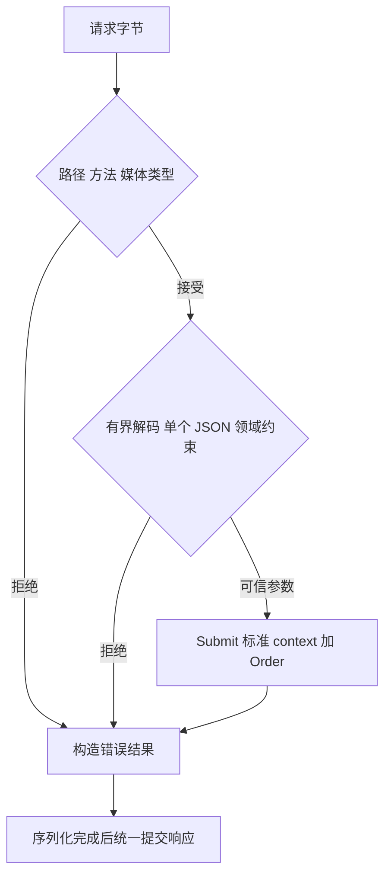
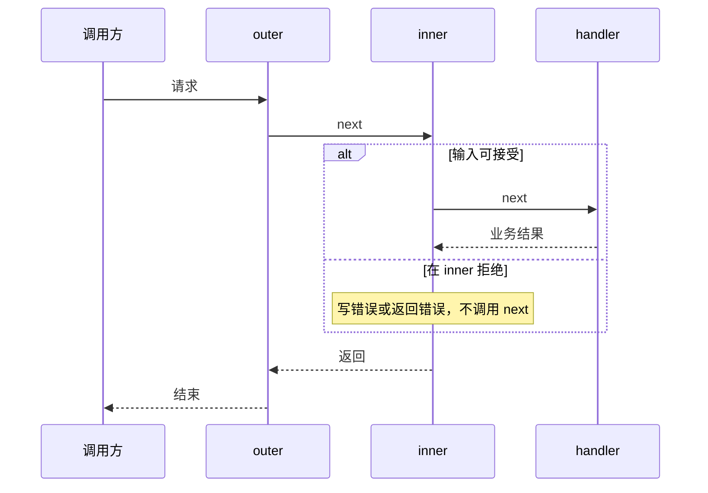
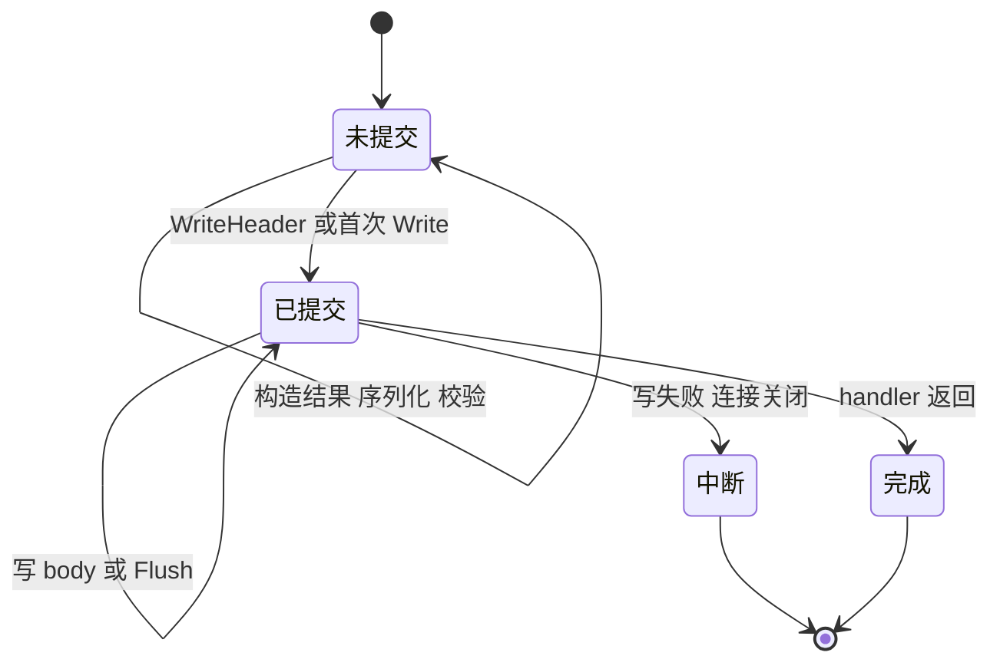

# HTTP 管线与响应合同：谁解析、谁调用、谁写回

一个创建订单的接口收到非法 JSON，却已经调用了库存服务；另一个接口日志里写着“返回 500”，调用方实际看到的仍是 200。两者都可能没有复杂算法错误，只是把三个不同的决定混在了一起：输入何时可信，业务何时允许执行，响应何时已经不可更换。

本章先把这三个决定分开。目标不是实现一套自己的 Web 框架，而是获得一个能迁移到 `net/http`、Gin 或其他框架的判断方法：每条失败路径都能指出**停止位置、业务调用次数、客户端真正收到的状态与内容**。

## 阅读准备与实验边界

需要知道 Go 的 `error`、接口和 `defer`，理解 HTTP 方法、状态码、header 与 body。实验固定 **Go 1.27.1**，只用标准库。Gin 1.12.0 只作控制流源码对照，不引入运行依赖，也不把标准库测试说成 Gin 集成测试。

订单输入是 `{"item":"book","count":2}`。业务接口只接收已校验的 `Order` 和标准 `context.Context`，不持有 `ResponseWriter`。这里的订单服务是可计数的替身，没有数据库；HTTP 201 的实验结果不构成持久化保证。请求取消如何影响真实写入，交给 [context 取消与副作用](/knowledge/go/concurrency/context-cancellation.html) 继续分析。

实验已按固定范围运行，完整命令与下载见文末附录。

## 先约定拒绝顺序，才能解释调用次数

同一个请求可能同时违反多条规则，例如错误路径、错误方法、错误媒体类型。谁先拒绝必须稳定，否则客户端和排障人员会获得互相矛盾的解释。本例按下表顺序处理，不表示所有产品都应采用同一策略。

| 边界 | 例子 | HTTP | 业务调用 |
| --- | --- | --- | --- |
| 路径 | `/missing` | 404 | 0 |
| 方法 | `GET /orders` | 405，`Allow: POST` | 0 |
| 媒体类型 | `text/plain` | 415 | 0 |
| 语法/结构 | 残缺 JSON、未知字段、多个值、null | 400 | 0 |
| 字节上限 | 超过 1024 字节 | 413 | 0 |
| 领域输入 | 空商品、数量不在 1–100 | 400 | 0 |
| 已知业务失败 | 冲突、暂时不可用 | 409 / 503 | 1 |
| 成功 | 规范化后的商品和数量 | 201 | 1 |

每个测试行独立写出期望响应全文，而不是拿实际响应反推预期，或复用生产 DTO 再编码。成功必须带业务回调返回的准确 ID，错误必须是约定的公开 error 值；额外字段、空对象、错误 ID、多余 JSON 和泄露细节都会失败。同时解析 Content-Type，要求 application/json 与 utf-8。输入样本覆盖不同商品、数量上下界和 Unicode 商品，避免实现把所有请求都硬编码成 book、2 而测试仍然通过。

“最多调用一次”是本章不变量。它只限制当前 handler 中的调用，不说明下游内部是否重试，也不说明用户再次发送请求会不会重复下单。



这里的“可信”仅指满足已声明的输入合同。它没有完成身份认证、授权、价格校验或库存校验；把一个演示用 `X-Lab-Key` 比较当成生产鉴权，会把不同信任边界混为一谈。

### 一次 Decode 成功，为什么还不够？

`encoding/json.Decoder` 面向流。一份合法对象后面再跟一份对象，第一次 `Decode` 仍可成功。若接口只接受一个值，就必须继续读一次，并要求结果为 `io.EOF`。这样也会检查合法 JSON 后面过长的空白，而不只检查对象结束以前的字节。

下面摘自完整项目的 `decode`；Code Hike 分步沿“解码→流结束→领域约束”阅读，而不是只高亮一个关键词。

```go steps
// !step(1:3) 解码器拒绝未知字段；指针能区分 JSON null 与一个真实订单对象。
// !step(4:6) 第一次解码只说明读到了一个值；语法错误和大小限制产生的错误都向外传播。
// !step(7:12) 第二次必须得到 EOF，多余 JSON 和尾部错误都不能悄悄通过。
// !step(13:17) 结构正确后才做业务输入约束，并把规范化后的参数交给下层。
dec := json.NewDecoder(body)
dec.DisallowUnknownFields()
var order *Order
if err := dec.Decode(&order); err != nil {
    return Order{}, err
}
var extra any
if err := dec.Decode(&extra); err != io.EOF {
    if err == nil { err = errors.New("multiple JSON values") }
    return Order{}, err
}

if order == nil || strings.TrimSpace(order.Item) == "" || order.Count < 1 || order.Count > 100 {
    return Order{}, errors.New("invalid order")
}
order.Item = strings.TrimSpace(order.Item)
return *order, nil
```

还有两个容易漏掉的条件。第一，`DisallowUnknownFields` 不等于严格拒绝所有歧义：标准解码器仍有重复键、大小写匹配等自己的兼容语义。本例没有把“重复 item 键必须拒绝”加入合同；需要这个安全边界时应另做 token 级检查并增加重复键测试，不能只换个函数名宣称解决。第二，不能仅相信 `Content-Length`，分块传输或未知长度请求未必带它。本例用 `http.MaxBytesReader` 限制**实际读到的字节**，再通过 `errors.As` 识别 `*http.MaxBytesError`。[JSON 解码文档](https://pkg.go.dev/encoding/json@go1.27.1#Decoder.DisallowUnknownFields) 与 [MaxBytesReader](https://pkg.go.dev/net/http@go1.27.1#MaxBytesReader) 给出了准确范围。

## 中间件是调用结构，不是一串标签

`Chain(handler, outer, inner)` 反向包装，运行时正向进入、反向退出。最外层更早获得请求，也更晚获得下层返回后的状态。



`TestMiddlewareOrder` 断言完整序列为 `outer before → inner before → handler → inner after → outer after`。因此，如果外层负责最终访问日志，它可以看到内层完成；如果一个鉴权层先写了错误却继续调用 `next`，业务仍然会运行，日志中“拒绝过”并不证明阻断成功。

Gin 的控制流同样需要看真实实现。固定 [Gin 1.12.0 的 Context.Next/Abort](https://github.com/gin-gonic/gin/blob/v1.12.0/context.go)：`Next` 推进 handler 索引并执行后续链；`Abort` 把索引移到终止位置，但不自动让当前 Go 函数返回。拒绝分支通常需要停止链并 `return`，防止本函数后面的语句继续执行。标准库包装链的“省略 next”与 Gin 的“Abort 后 return”作用相近，不能机械复制代码。

Gin `Context` 还包含路由、writer 和框架内键值等状态，和标准 `context.Context` 不是同一责任。传到 service、数据库或下游客户端的应是 `c.Request.Context()`；不得把请求池化对象长期留给后台 goroutine 使用。是否启用 Context fallback 不应成为领域层偷偷依赖框架对象的理由。这一段是源码比较，完整示例仍是标准库版本。

## 响应提交是一条单向边界

在普通最终响应中，第一次 `WriteHeader(2xx–5xx)` 决定最终状态；未显式调用时，第一次 `Write` 会隐式选择 200。即使内部还有缓冲，也不能据此期待第二次 `WriteHeader` 覆盖前一次。1xx 信息响应和 trailers 是另外的协议能力，不改变这里的最终状态合同。[ResponseWriter 文档](https://pkg.go.dev/net/http@go1.27.1#ResponseWriter) 明确区分了这些情况。



实验中的反例故意写入 `200 + prefix:` 并 `Flush`，再写 500 和 `failure`。真实客户端断言的是 **200，body 为 `prefix:failure`**。服务端还会记录多余 `WriteHeader`，这不是可依赖的统一错误响应。

### 用结构防双写，比到处加判断更容易评审

本例让 `evaluate` 返回状态和固定 DTO。它不接收 writer，无法提前发送半份响应；`ServeHTTP` 只在一个地方提交。

```go steps
// !step(1:2) 字节上限作用于实际读取；evaluate 只能返回结果，不能写网络响应。
// !step(3:7) 在最终状态提交以前序列化，失败时仍有机会选择一份完整的错误结果。
// !step(8:10) 最终写回只有一个所有者；Write 失败只能记录，不能再向同一响应追加另一份 JSON。
r.Body = http.MaxBytesReader(w, r.Body, MaxBody)
status, result := a.evaluate(r)
body, err := json.Marshal(result)
if err != nil {
    status = 500
    body = []byte(`{"error":"internal_error"}`)
}
w.Header().Set("Content-Type", "application/json; charset=utf-8")
w.WriteHeader(status)
_, err = w.Write(append(body, '\n'))
```

文章片段突出所有权；完整代码还设置 405 的 `Allow`，并通过回调记录写失败。`Result` 是固定、可 JSON 编码的结构，若未来加入自定义编码器，必须重新测试序列化错误与 panic。

`evaluate` 的 `recover` 也只能保护同一 goroutine 内、提交以前的计算。它将隔离的业务 panic 记入服务端观测，再给客户端稳定错误，不泄露 panic 内容。它不能回滚已做的副作用，不能拦截另一个 goroutine 的 panic，也不能保证遭到共享状态破坏后继续运行是安全的。网络写入阶段不在这个“重新选择响应”的边界内。`net/http` 自带的 panic 保护也不是业务 JSON 错误协议；对已经开始的响应，通常应让连接/流失败，而不是假装可以重写。

## 怎样从证据定位问题

面对“400 却发生了下单”，先取同一请求关联标识下的三份证据：入口校验结果、业务调用次数与参数、最终响应。若次数为 1，排查拒绝分支是否仍调用下一层，以及中间件顺序；若次数为 0，沿异步任务、另一次重试或关联标识复用继续查，不要先改 JSON 库。

面对“日志 500、客户端 200”，先找第一次写状态或 body 的位置。记录 logger 中的逻辑错误不等于记录实际写回状态；若包 writer 计数，记得覆盖隐式 200，并维护 `Flush`、`Hijack` 等能力或使用支持 `Unwrap` 的适配。随手包一层接口可能悄悄破坏流式输出。最简单的方案仍是尽量让普通 JSON 接口只有一个写回所有者。

响应预编码会占用内存，适合有上限的小型 JSON。大文件、SSE 和持续流不能整体缓冲；它们需要独立合同，例如流内错误事件、客户端检测截断以及重连位置，不能沿用“所有失败都改成 JSON 500”。这也是结构性取舍，不是 recovery 层不够强大。

## 练习与参考推理

### 机制题：删除第二次 Decode 会怎样？

修改项目，只保留第一次 `Decode`，运行 `TestHTTPContract/trailing`。解释为什么一份对象后附加 `{}` 会被误收，以及业务调用次数为何从 0 变成 1。参考答案应同时提到**流式解码只消费一个值**和**业务调用在校验以后**；只写“校验不严”没有给出因果链。

再把 `evaluate` 改为先写 201 再调用业务。用已有双写反例说明，恢复 `recover` 不能补回合同。合格修复是移动提交点或改变流式协议，不是忽略第二次写入的警告。

### 设计题：订单接口应缓存整份响应吗？

提交一页决策：输入/输出大小上限、成功与冲突的语义、错误码与内部日志的映射、业务调用次数以及客户端断开时怎么判断结果。比较预编码 DTO 与流式编码两种方案。参考评分点是：有明确上限；错误细节不外泄；不把 HTTP 失败等同事务回滚；能提出至少一个流式方案更合理的场景。

## 来源与验证记录

重点源码是 Go 1.27.1 [server.go 的 Handler/ResponseWriter 与 conn.serve](https://github.com/golang/go/blob/go1.27.1/src/net/http/server.go)、[JSON stream.go](https://github.com/golang/go/blob/go1.27.1/src/encoding/json/stream.go) 和上述 Gin 固定版本。顺着“谁调用谁、谁持有 writer”读即可，不必逐行背服务器所有实现。

本章标准库测试已在 Go 1.27.1 下真实运行，包含 24 项 HTTP 输入/业务结果子场景、包装顺序与响应已提交反例；均通过。错误实现也需要被具体响应与清理断言拒绝，不能用测试数量代替合同。它不覆盖 TLS、HTTP/2、反向代理、Gin 运行时或持久层。全项目版本、命令、退出码和已通过的 race/进程范围见下载项目的 VERIFICATION.md 与 README，自己复跑时会生成 `evidence`；[进程停机](/knowledge/go/lifecycle/graceful-shutdown.html)使用同一输入合同检查进程退出。


<details class="verification-appendix">
<summary>实验附录：运行方法、历史记录与未覆盖范围</summary>

[下载配套实验项目](/examples/go-service-lifecycle.zip)，解压进入项目目录：

```sh
go version
go test -count=1 -v ./pipeline
```

完整工具链须为 Go 1.27.1。测试自己启动并关闭 `127.0.0.1:0` 回环服务，不占用固定端口，不访问外部服务。`TestHTTPContract` 不是直接调用 handler 的伪 HTTP：请求会走真实 TCP。中间件顺序用 Recorder 单独测试；[进程停机实验](/knowledge/go/lifecycle/graceful-shutdown.html)才验证真实 `main` 子进程，证据层次不要混用。


另把全部响应改成空对象、把响应媒体类型改为 text/plain 两个错误实现放入独立副本：原断言曾错误通过，修订后的明确响应断言均会失败。完整项目记录了这次反例回归；通过数量不能替代合同内容。

</details>
