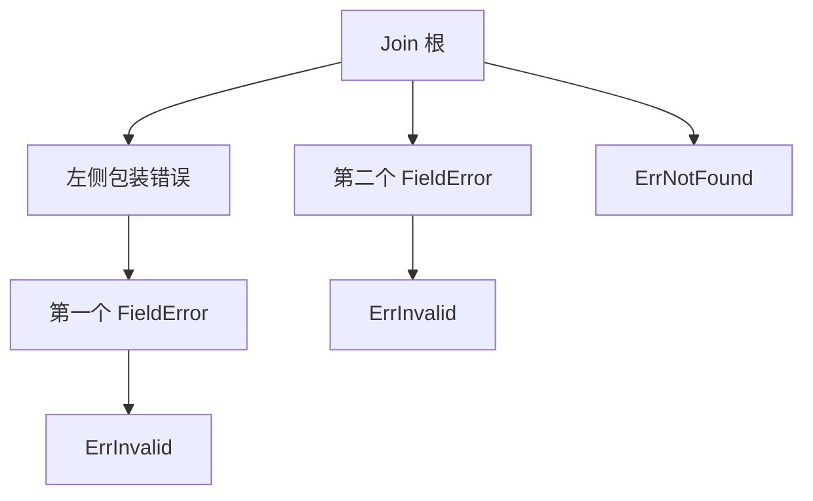

# 接口与错误：方法集、nil 与可恢复合同

校验函数接受 `demo-42`，没有发现错误，却让调用方进入 `if err != nil` 分支。它返回的是一个值为 nil 的 `*FieldError`。指针确实为 nil，转换后的 error 接口却不为 nil。

这类问题的关键并非记一条“Go 有坑”。调用边界同时承载了动态类型、值、方法能力与失败合同。我们用一个只接受 `[a-z][a-z0-9-]*`、长度 1–32 字节的键校验器，把这些维度拆开。读完后应能解释成功结果、保留可识别的错误链，并精确检查公开错误码和响应体。

[共用源码包](/examples/go-core-engineering-lab.zip)中的 `Load` 只是一份固定内存教学数据，没有数据库。`WriteError` 配合 `httptest.ResponseRecorder` 检查输出字节，不启动 HTTP 服务器。这样可以先把接口合同看清，再接上后续服务的协议适配器。

## 1. 方法能调用，不等于值实现了接口 {#method-sets-and-receivers}

实验有两个方法：`func (c Counter) Value() int` 与 `func (c *Counter) Add(n int)`。Value 读取接收者值，Add 通过指针修改 N。关键区别如下：

| 接口/操作 | Counter 值 | *Counter 指针 |
| --- | --- | --- |
| 实现 `interface{ Value() int }` | 是 | 是 |
| 实现 `interface{ Add(int) }` | 否 | 是 |
| 对可取地址局部变量 c 调用 `c.Add(2)` | 可以，按 `(&c).Add(2)` 处理 | 直接调用 |

自动取地址规则帮助调用方法，却没有把 Add 加进 Counter 的方法集。`any(c).(Adder)` 的 `ok` 仍是 false，`any(&c).(Adder)` 才是 true。实验通过类型断言观察差别，没有把一份无法编译的源文件拿来充当语义测试通过。[Go 规范：方法集](https://go.dev/ref/spec#Method_sets) · [方法调用](https://go.dev/ref/spec#Calls)

再预测这个输入：

```go
c := Counter{N: 1}
var copied Valuer = c
var shared Valuer = &c
c.Add(2)
```

copied 保存赋值当时的 Counter 值，所以 `copied.Value()` 为 1；shared 保存指向 c 的指针，所以之后调用 `shared.Value()` 得到 3。接口没有自动冻结对象，也没有统一的“总是引用传递”规则，仍要检查装进去的具体值。

接收者类型的选择也不只是省一次复制：含 mutex 的结构使用后不能复制；改变内部状态通常需要指针；小而不可变的值可能适合值接收者。保持同一类型方法的语义一致，比为了套某条风格口诀来回切换更重要。接口只声明调用能力，不说明线程安全、所有权或生命周期，这些需要另写合同和测试。

## 2. nil 接口与带 nil 指针的接口 {#typed-nil}

用“动态类型 + 动态值”推演足够，不必依赖接口的运行时内存布局：

| 构造 | 动态类型 | 动态值 | 与 nil 比较 |
| --- | --- | --- | --- |
| `var err error` | 无 | 无 | true |
| `var p *FieldError; var err error = p` | `*FieldError` | nil 指针 | false |
| `var err error = &FieldError{...}` | `*FieldError` | 非 nil 指针 | false |

FieldError 的 Error 方法有显式 nil 检查，因此调用带 nil 指针的这个方法得到 `"nil field error"`，不是 panic。但“可以调用”并没有把它变成成功。别的类型若解引用 nil 接收者，行为可能不同；不要将此例推广成“nil 指针方法总安全”。

ValidateKey 成功分支必须返回字面 `nil`。`typed-nil` 变体只把这一行换成 `return (*FieldError)(nil)`，默认的 `TestValidateKey` 就会在合法输入上报 `CONTRACT[nil-success]`。测试输出动态类型 `%T`，定位的是错误的成功合同，而不是一条可能随实现变化的字符串。

不要在所有调用方加反射把“内部值为 nil”的 error 统一吞掉。这样会模糊到底是合法成功还是错误类型构造坏了。优先修复返回 error 的源头，并保留一个合法输入的回归测试。[Go 规范：接口值](https://go.dev/ref/spec#Interface_types) · [比较](https://go.dev/ref/spec#Comparison_operators)

## 3. 错误文本、身份与结构分别给谁用 {#error-identity}

输入 `private/key` 会得到 FieldError，它包含 Field=`key` 与内部诊断 Value。Load 用 `fmt.Errorf("load snapshot: %w", err)` 增加调用上下文。我们保留三种不同观察：

1. `err.Error()` 提供诊断文本，便于内部定位这次失败
2. `errors.Is(err, ErrInvalid)` 判断它是否属于无效输入类别
3. `errors.As(err, &field)` 提取结构化的 FieldError，观察具体字段

`errors.New("invalid input")` 每次得到新的错误值；相同文字不等于同一个哨兵。`fmt.Errorf` 的 `%w` 提供可解包关系，`%v` 只是格式化。将 `%w` 改成 `%v` 后，日志可能看起来没有变，调用方却失去了 Is/As 所需的链。本实验 `lost-cause` 变体要求 `TestLoadErrorChain` 精确失败，不能只比输出文本。[fmt.Errorf API](https://pkg.go.dev/fmt@go1.27.1#Errorf)

包装可识别错误也有 API 代价：一旦公开让调用方依赖某个底层哨兵，就需要考虑更换实现时的兼容性。适配器通常把库的错误转换成自己稳定的类别，同时在适当层保留诊断；不能把“尽可能多地包装”自动当成最优设计。对不存在、输入无效、冲突等情况，先决定调用方允许做什么，再选择可识别的错误合同。

As 的 target 是“保存匹配结果的位置”。若 FieldError 由指针实现 error，常见写法是 `var field *FieldError; errors.As(err, &field)`。`&field` 是 `**FieldError`，这不是多写了一个指针，而是让 As 可以修改 field 变量。类型不合要求的 target 可能 panic，不能用运行时试错代替签名理解。

固定版本 Go 1.27.1 的 errors 文档还提供 `errors.AsType[E error]`，并对多数用法推荐它。这里保留 As，是为了读懂已有代码以及它可匹配任意接口 target 的合同；若只按实现 error 的类型提取，可以写 `field, ok := errors.AsType[*FieldError](err)`。两者都不保证 field 一定非 nil：链中若装的是 typed nil，匹配类型后仍需理解这个值代表什么。[errors API](https://pkg.go.dev/errors@go1.27.1)

## 4. 错误链也可能是一棵树 {#join-tree}

`errors.Join` 可以同时保留主操作失败与清理失败。它忽略真正为 nil 的 error 接口；若全部是 nil，结果为 nil。typed nil 仍是非 nil 接口，不能被这个规则自动滤掉。



本实验中 `errors.Is` 可以同时识别 ErrInvalid 与 ErrNotFound；`errors.As` 按既定遍历找到第一个 FieldError。若你要展示所有字段错误，一个 As 不够，应该设计明确的集合 DTO 或聚合类型。Join 的多原因能力不自动定义公开响应的优先级。

还要区分 `errors.Unwrap` 和 Is/As：Unwrap 只调用 `Unwrap() error`，不会拆 `Unwrap() []error`，所以对 Join 结果调用 `errors.Unwrap` 得到 nil，并不表示它没有子错误。`TestJoinTraversal` 明确检查这一点。[Join API](https://pkg.go.dev/errors@go1.27.1#Join) · [Unwrap API](https://pkg.go.dev/errors@go1.27.1#Unwrap)

### 读真实标准库的遍历分支

下面是固定标签 `src/errors/wrap.go` 的 `is` 函数，54–79 行；完整源与许可证随包保存。读源码时先认直接匹配与自定义 Is，再看单子节点循环与多子节点递归。[Go 1.27.1 源码](https://github.com/golang/go/blob/go1.27.1/src/errors/wrap.go#L54-L79)

<!-- snippet: go-core.errors-is -->
```go steps
// !step(2:8) 先判断直接匹配，再尝试当前节点的自定义 Is。
// !step(9:14) 单一原因沿 Unwrap 链继续循环。
// !step(15:21) 多个原因按顺序深度优先递归，命中即可返回。
// !step(22:24) 没有可走的原因时，返回未匹配。
func is(err, target error, targetComparable bool) bool {
	for {
		if targetComparable && err == target {
			return true
		}
		if x, ok := err.(interface{ Is(error) bool }); ok && x.Is(target) {
			return true
		}
		switch x := err.(type) {
		case interface{ Unwrap() error }:
			err = x.Unwrap()
			if err == nil {
				return false
			}
		case interface{ Unwrap() []error }:
			for _, err := range x.Unwrap() {
				if is(err, target, targetComparable) {
					return true
				}
			}
			return false
		default:
			return false
		}
	}
}
```

这解释了为什么只在最外层做 `err == ErrInvalid` 会漏掉包装后的类别，也解释了为什么 Join 不是拼接文本就能替代的。自定义 `Is(error) bool` 应比较当前节点，不要在里面重复递归整个树。标准库给出遍历合同，并没有替应用决定“遇到多个类别应该返回哪个 HTTP 状态”。

## 5. 公开错误是边界合同，不是 err.Error 的转发 {#public-error-contract}

如果请求带来的非法 key 含内部路径，返回 `err.Error()` 就会把诊断细节放进公开响应。我们的教学映射特意使用稳定的 Code 与 Message，并在未知错误时返回固定 internal 消息。

<!-- snippet: go-core.error-response -->
```go steps
// !step(2:8) 先处理成功、取消与超时类别；优先级是本例的边界政策。
// !step(9:12) 无效输入与不存在映射到固定公开 DTO。
// !step(13:15) 未知原因使用固定消息，不转发诊断文本。
func ErrorResponse(err error) (int, PublicError) {
	switch {
	case err == nil:
		return http.StatusOK, PublicError{}
	case errors.Is(err, context.Canceled):
		return http.StatusRequestTimeout, PublicError{"request_canceled", "request canceled"}
	case errors.Is(err, context.DeadlineExceeded):
		return http.StatusGatewayTimeout, PublicError{"deadline_exceeded", "deadline exceeded"}
	case errors.Is(err, ErrInvalid):
		return http.StatusBadRequest, PublicError{"invalid_argument", "invalid key"}
	case errors.Is(err, ErrNotFound):
		return http.StatusNotFound, PublicError{"not_found", "snapshot not found"}
	default:
		return http.StatusInternalServerError, PublicError{"internal", "internal error"}
	}
}
```

这段函数明确选择了优先级：取消 > deadline > 无效输入 > 不存在 > 未知错误。比如 Join 同时包含 ErrInvalid 与 context.Canceled，返回 408/request_canceled，与 Join 子节点书写顺序无关。408 是本实验在“响应尚可写”条件下选的教学政策，不是 Go 或所有服务通用的取消映射；客户端已断开时不保证它能收到字节。gRPC 状态与取消传播也必须按其协议另定义。

`WriteError` 先设 Content-Type，再写状态和 JSON。`TestWriteError` 比较状态、媒体类型、完整响应体（包含 Encoder 的换行），没有通过“能成功反序列化”放过额外字段或泄漏文字。同时 `TestLoadErrorChain` 继续检查原始错误的 Is/As 身份；公开信息收敛，不等于把内部原因丢掉。

| 输入原因 | 固定公开结果 | 独立保留的内部判断 |
| --- | --- | --- |
| 包装的 FieldError | 400，invalid_argument，invalid key | Is ErrInvalid；As 得到原 Field/Value |
| 包装的 ErrNotFound | 404，not_found | Is ErrNotFound |
| 未知错误含诊断细节 | 500，internal，internal error | 调用层自行按其日志政策处理 |
| ErrInvalid 与取消同时存在 | 408，request_canceled | 两个原因仍在原始树中 |

不能从“错误发生了”直接推出“可以重试”。无效输入通常需要修改请求；不存在可能是稳定结果；取消表示调用方不再等，不说明副作用没有发生；未知存储错误可能需要查询最终状态。重试是否安全还取决于操作幂等、业务去重键、事务提交点和预算，本章没有代替这些判断。

## 6. 用接口、组合还是泛型 {#interfaces-composition-generics}

三者解决的问题不同，可以在同一个程序里共存。

| 需要表达的变化 | 合适工具 | 不能自动得到的保证 |
| --- | --- | --- |
| 同一调用位置可换存储/时钟等行为 | 小接口，按调用方需要定义方法 | 线程安全、事务性、释放责任 |
| 复用字段或把较小部件装成较大对象 | 显式字段与委托；有需要再嵌入 | 嵌入不是继承，不自动定义业务子类型 |
| 同一算法处理多个元素类型 | 类型参数与恰当约束 | 深复制、所有权、任意类型上的操作 |

实验 `CopyValues[T any]` 对 slice 执行 make+copy。T=`byte` 时复制完可变元素；T=`[]byte` 时只复制外层，内层字节仍共享。给函数加 `[T any]` 不会让编译器自动推导“递归复制任意对象”。相反，CloneSnapshot 针对明确的数据结构写出每一层复制，合同更容易检验。

接口也不是越多越好。只有一个本地函数、没有需要替换的行为时，先用具体类型更直接。确实需要适配服务存储或控制器依赖时，再让接口表达读者能解释的最小能力，并写清上下文、错误、所有权和关闭责任。

## 7. 练习与参考推理 {#exercises}

**练习 A：把 `var copied Valuer = c` 改成 `var copied Valuer = &c`，后面 Add 的结果如何变化？** 参考推理：两个接口都持有同一指针；两次 Value 都读取改后的 N=3。若需要固定旧值，应保存独立的数据快照，而不是换一种接口声明。

**练习 B：为了隐藏内部路径，把 Load 的 `%w` 改成 `%v` 对吗？** 参考推理：公开映射本来就不该输出 Error 文本。改 `%v` 破坏内部类别识别，却没有设计好公开 DTO。应保留预期链，在边界写固定响应，并分别测试两者。

**练习 C：把 Join 的两个 FieldError 顺序交换，什么会变、什么不变？** 参考推理：As 返回的第一个匹配会变化；Is ErrInvalid 仍为 true。公开映射的类别优先级写在 switch 中，因此此例不会随子节点顺序变化。若某业务需要汇总全部字段，就换成明确集合。

**练习 D：返回 504 是否保证数据库没有写入？** 参考推理：没有。deadline 是调用等待边界，数据库副作用及可查询结果属于另一合同。只有对真实存储的提交、回滚和查询实验，才能支持更强结论。

## 8. 从默认测试读出边界 {#evidence-and-limits}

默认套件检查方法集、值/指针接收者、typed nil、有效与无效键、包装与 Join、公开 JSON。三个对应坏实现由 mutations 阶段在临时源码拷贝中分别运行；必须命中指定断言标记，编译失败或超时都不是成功拒绝。

本章完成的可观察任务是：合法输入得到 nil error；非法输入可用 Is/As 识别；公开响应只带稳定 DTO；换掉错误实现时原测试按确切语义失败。完整服务还需验证请求解码、权限、响应提交、网络取消与停机，可沿已有 [HTTP 请求/响应合同](../http/request-response-contract.md) 继续。
