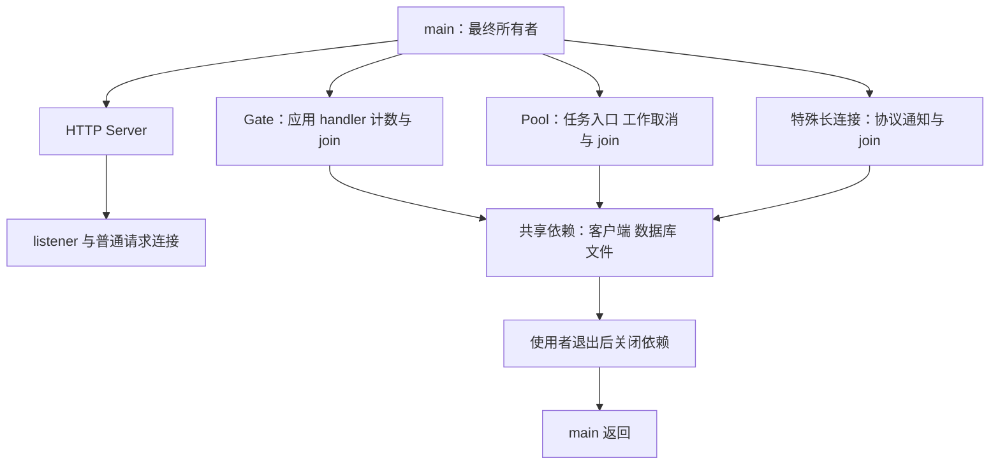
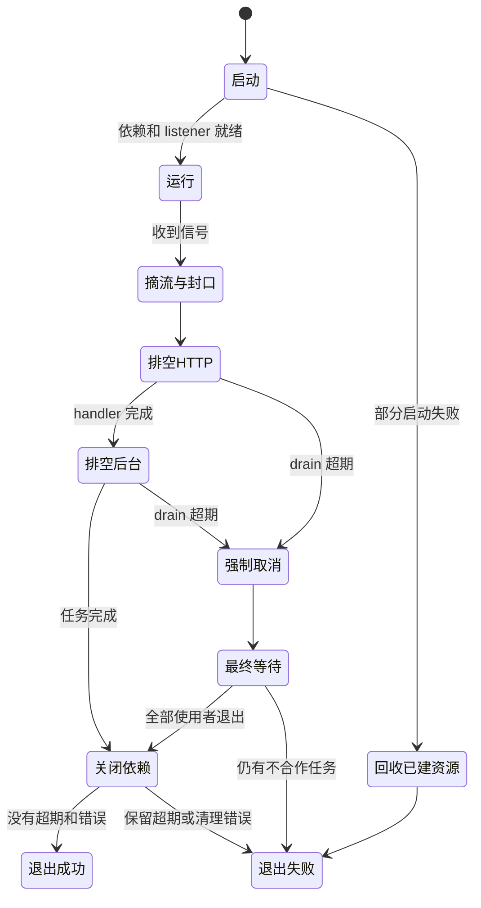
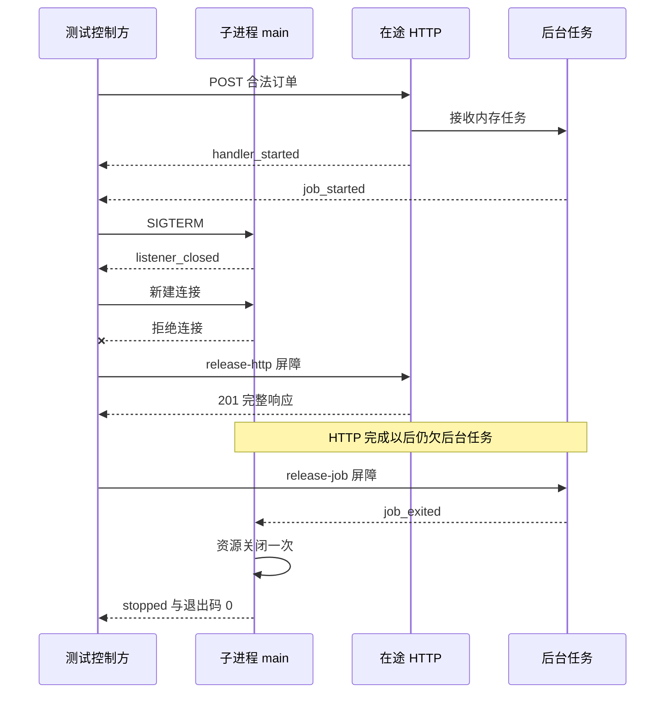

# 优雅停机评审：停止接单以后，哪些工作还欠着

`Shutdown` 返回 nil，是否就能安全结束进程？如果一个 handler 已经返回 202，留下后台 goroutine 继续写数据，HTTP 服务器可能认为自己早已空闲。再看另一个方向：监听已经关闭，`Serve` 已经返回 `ErrServerClosed`，但在途请求仍需要时间写完响应。主函数若跟着返回，宽限时间只是配置文件里的愿望。

停机设计把请求与工作的边界接起来：输入和响应由谁管理，取消如何传递，工作如何有界并被 join，下游连接谁拥有。要交付的是一份能在故障中执行的生命周期合同，而不是在 `main` 尾部补一行函数调用。

## 完成标准与实验范围

需要理解 [HTTP 输入与响应合同](/knowledge/go/http/request-response-contract.html)、 [取消不等于退出](/knowledge/go/concurrency/context-cancellation.html) 和 [工作所有权](/knowledge/go/concurrency/bounded-work.html)。无需引入数据库、Kubernetes 或消息中间件才能完成本章，但必须明确内存任务不提供进程崩溃后的恢复。

本例区分三种结束：

- 正常排空：在途 handler 完成，已接收任务完成，依赖关闭一次，退出码 0
- 宽限期耗尽：停止连接、取消任务并做最后的有界 join；即使最终都退出，也保留超期事实，退出码 1
- 启动失败：不宣称服务 ready，回收已创建的池和演示资源，退出码 2

实验的 `shutdownlab` 只是可控制的生命周期进程：`/orders` 复用 [HTTP 输入与响应合同](/knowledge/go/http/request-response-contract.html) 的 JSON 校验，业务回调由 stdin 屏障控制；返回 `lab-order`，不代表真实订单持久化。后台任务也是明确标记的内存任务。标准输入是测试控制通道，不是生产后台管理接口。

实验已按固定范围运行，完整命令与下载见文末附录。

## Shutdown 管到哪里，所有权就必须画到哪里

Go 1.27.1 的 `Server.Shutdown` 关闭 listener、关闭空闲连接，并等待活跃连接回到可关闭状态；context 超期则返回其错误。它不负责等待你随手启动的 goroutine，也不负责关闭和等待 hijacked 连接。`RegisterOnShutdown` 适合通知协议级长连接开始退出，不是一个自动 join 所有回调的屏障。[官方 Shutdown 合同](https://pkg.go.dev/net/http@go1.27.1#Server.Shutdown)与 [server.go 实现](https://github.com/golang/go/blob/go1.27.1/src/net/http/server.go)都能看到这条边界。



`TestShutdownDoesNotJoinDetachedWork` 是一个直接反例：handler 启动一个被屏障挡住的 goroutine，然后返回 202；Shutdown 成功返回时，退出 channel 仍未关闭。测试最后主动释放屏障并 join，自己不留下泄漏。成功的 Shutdown 证明的是 HTTP 域收敛，不是整个应用收敛。

还有一个容易遗漏的边角：超时后调用 `Server.Close` 会关闭连接，但不能强杀仍在业务函数里运行的 handler。依赖若随即被关闭，这个 handler 可能继续使用已经关闭的资源。因此本例额外用 `Gate` 计数进入应用的 handler，封住入口后再等待其全部退出。这个应用级证据不能用连接数量替代。

## 把停机变成有责任边界的状态机



“摘流”在真实部署里还有负载均衡器和 readiness 的传播延迟。应用可以先把 readiness 置为不就绪，再按已验证的路由收敛策略等待，最后关闭 listener；也可以直接封口并关闭，让新请求失败。两者的用户体验、延迟和平台约束不同，不能用一段固定 sleep 假定流量一定停止。

本机实验没有真实 readiness 控制平面，它直接 `Gate.Seal` 拒绝新业务进入，然后关闭 listener。已经通过 Gate 的请求可以完成。测试观察到的是本机封口和监听关闭，**没有验证集群摘流、滚动发布或外部负载均衡**。

后台任务入口应在什么时候关闭？如果已接收的 HTTP handler 还可能投递任务，先关闭池就会让这些请求的业务合同中途改变。本例先停外部生产者、排空 HTTP，然后关闭池入口并排空。若产品选择收到信号立即拒绝一切后台投递，也可以，但需要给在途请求明确的失败合同，不能让 `send on closed channel` 替你做决定。

## 停机预算不能从已经取消的信号继承

`signal.NotifyContext` 在指定信号到达时取消 context。若用它派生 Shutdown 的超时 context，新 context 一开始就可能已取消，根本得不到新配置的宽限时间。请求的取消域、进程运行域、停机等待域是不同责任。

```go steps
// !step(1:2) 信号只触发开始停机；清理等待不能继续继承已经取消的 signal context。
// !step(3:6) 两个 deadline 从同一开始点计时，总上限是 grace 加清理余量，不是每一步重新领取一份 grace。
// !step(7:9) Stop 返回以后还要处理 Serve 的终态；ErrServerClosed 是预期停机结果。
<-signalCtx.Done()

drain, cancelDrain := context.WithTimeout(context.Background(), grace)
defer cancelDrain()
final, cancelFinal := context.WithTimeout(context.Background(), grace+time.Second)
defer cancelFinal()
err := stopper.Stop(drain, final)
serveErr := <-served
if serveErr != nil && !errors.Is(serveErr, http.ErrServerClosed) { err = errors.Join(err, serveErr) }
```

片段聚焦正常信号分支；完整 main 还处理 Serve 提前失败与启动失败，并将清理结果转成明确退出码。`stopSignals` 的调用用于撤销信号注册；是否让第二次信号恢复默认强制结束，应作为运维合同说明，而不是悄悄吞掉第二次终止请求。第二次强制信号会绕过未完成清理，本项目不把它算成优雅完成的证据。[os/signal 文档](https://pkg.go.dev/os/signal@go1.27.1#NotifyContext)描述注册与恢复的关系。

### 最难的顺序是关闭依赖以前等谁

```go steps
// !step(1:3) HTTP 排空超时才关闭普通连接；Close 并不等于活跃业务函数已经退出。
// !step(4:5) 显式等待应用 handler，避免在其继续使用资源时关闭依赖。
// !step(6:10) 后台入口随后关闭；排空期限耗尽再发取消，最后仍需 join。
httpErr := s.HTTP.Shutdown(drain)
if httpErr != nil { httpErr = errors.Join(httpErr, s.HTTP.Close()) }

handlerErr := s.WaitHandlers(final)
s.Jobs.CloseAdmission()
jobsErr := s.Jobs.Wait(drain)
if jobsErr != nil {
    s.Jobs.Cancel()
    jobsErr = errors.Join(jobsErr, s.Jobs.Wait(final))
}
```

完整 `Stopper` 将错误合并，不丢弃最早的超期；只有 handler 与任务都已退出才调用 `CloseResources`。关闭操作由 `sync.Once` 保护，重复 Stop 返回同一次结果，不重复释放。并发调用者使用第一次 Stop 的 deadline，不是每个调用者都能重开停机流程。

这个设计也有明确限制：`CloseResources` 自身必须可在剩余预算内结束，不能在里面引入无期限网络等待。最终期限到时若回调仍不合作，Stop 返回失败，不在它身下关闭共享资源；main 的非零退出最终由进程边界回收。需要保留的业务数据必须在此前进入可恢复的持久状态。

## 用真实进程区分“没来得及”和“没有等待”



测试有三类进程场景：正常信号排空、50ms 宽限超期、占用监听地址导致启动失败。屏障决定何时发信号和释放工作，超时只用于被测的期限策略及测试自身 watchdog；不靠“先睡 100ms，应该已经启动了”安排事件。

正常场景在收到两条 started 事件后发 SIGTERM，收到 `listener_closed` 后再实际拨号验证拒绝。释放 HTTP 后检查 201、application/json 响应媒体类型、无读取错误及准确的 {"id":"lab-order"} 响应，再释放后台任务。把 Content-Length 故意写成 999 的反例必须因 unexpected EOF 失败，不能丢弃 io.ReadAll 的错误。最终断言 handler/job 各退出一次，并观察实际 Pool.Done 已关闭；其证据必须在资源关闭之前，资源关闭必须在 stopped 之前，进程最终退出 0。强制场景不释放屏障，连接关闭使请求取消，池取消使任务退出；测试明确要求这个尚未发送 header 的受控请求被连接关闭中断，不能接受成功响应或仅靠客户端自己的 watchdog 超时；同时要求这些退出证据、关闭顺序和非零退出，不能因为最后清干净就擦掉超期。

启动失败分支也不能只观察退出码 2。它检查 Pool.Wait 的错误；只有成功 join 且实际 Done channel 已关闭才记录 pool_done 并关闭依赖。测试要求 pool_done、resource_closed、startup_failed 各一次且按此顺序发生。删除 Cancel 与 Wait 的负对照，会立即缺少真实完成证据而失败，不能把进程退出回收线程当成应用已经 join。

单元层还补三种网络进程不易精确编排的情况：重复关闭只生效一次；Gate 封口后拒绝新 handler，但等待旧 handler；不合作任务忽略 context，最终期限耗尽时不提前关闭它仍持有的依赖。最后一种测试会自行释放任务以保证测试进程清洁，却保留服务设计必须面对的风险。

## 把请求、取消、工作与调用预算接成故障矩阵 {#把前四章接成故障矩阵}

| 注入点 | 调用方可能看到 | 需要保存的证据 | 本例的处置 |
| --- | --- | --- | --- |
| 输入不合法 | 400/413/415 | 业务调用为 0 | 入口拒绝，不入任务池 |
| 池已满 | 503 | 已接收量、运行量、队列量 | 不额外启动 goroutine |
| 下游查询超时 | 失败或总预算耗尽 | 尝试数、阶段耗时 | 有限预算，不无限重试 |
| 响应提交后断流 | 网络错误或截断 | 业务结果与已提交响应分别记录 | 不重写已提交状态 |
| SIGTERM 到来 | 在途可完成，新入站被拒绝 | listener、handler、job 分别收敛 | 分域排空 |
| 停机超期 | 部分请求失败 | 尚未完成的所有者与原因 | 取消、最终 join、非零退出 |

矩阵中的“业务结果”在实验里是替身或内存状态。生产订单如果需要在提交成功、响应丢失或进程崩溃后查询结果，要有独立的持久化和幂等设计，不能由 goroutine 池凭空提供。设计可以引用 [数据一致性路径](/paths/data-message-consistency.html)，但评审本章时至少应能明确拒绝不安全重试，而不依赖另一条路径的实现。

## 综合练习：交付一份可反驳的停机方案

### 修复题

将 `Shutdown` 放到新 goroutine，main 在 `Serve` 返回以后立即返回。预测哪条正常排空证据会先丢失，再用真实进程测试验证。参考推理：Serve 返回只证明停止服务入口，不证明 Shutdown 等待结束；main 返回会结束整个进程，不能靠子 goroutine 的 defer 保证运行。合格修复必须让 main 拥有等待流程。

再把 drain context 改为从 signalCtx 派生，解释为什么合法在途请求不再获得 grace。合格答案指出派生关系，而不是把 grace 从三秒增加到三十秒。

### 设计评审

提交四份相互一致的小产物：

1. 所有权图：列出 listener、handler、池、下游 Transport、文件/数据库连接、特殊长连接，每项写创建者、停止条件和完成证据
2. 一页 ADR：比较“尽量排空”与“尽快取消”，说明最大退出时长、过载策略、强制退出可能丢失什么，以及哪些任务必须持久化
3. 失败矩阵：至少包含非法输入、首错取消、池满、响应未知、停机超期与部分启动失败；HTTP 状态不能代替业务状态
4. 运行手册：发起停机后观察哪些字段，何时允许强制终止，怎么识别仍在占用资源的所有者，重启后怎样处理未完成工作

参考评分首先看可验证性：能否复跑反例，是否有 handler/job 的独立 join，是否把总预算分给全部步骤。其次看方案的代价：长宽限有利于完成工作，却延迟发布和容量回收；短宽限减小退出延迟，却增加中断与恢复成本。最后看证据边界：本机进程通过不等于 Kubernetes 发布通过，日志打印“shutdown success”不等于所有工作已经完成。

## 来源与验证记录

机制依据为 Go 1.27.1 的 [Server.Shutdown/Close](https://github.com/golang/go/blob/go1.27.1/src/net/http/server.go)、[signal.NotifyContext](https://github.com/golang/go/blob/go1.27.1/src/os/signal/signal.go) 和 [Go 程序执行规范](https://go.dev/ref/spec#Program_execution)。本文只宣称项目日志明确覆盖的 stdlib、回环网络和 Linux 子进程结果；真实负载均衡、容器终止、特殊协议连接与持久任务恢复均未验证。

本版本完整脚本已在 Go 1.27.1、Linux amd64 上运行并以 exit 0 完成：25 个顶层测试与 26 个子测试通过，真实 main 的正常/超期信号和启动失败均未跳过；race 同时覆盖测试进程和带检测的子进程，vet 无诊断。下载包的 VERIFICATION.md 与 SOURCE-SHA256SUMS 分别记录范围和源码绑定。进程测试还曾发现控制 reader 在打印 stopped 后仍阻止退出的问题；改为拥有可关闭唤醒的独立描述符并 join 后，全套重跑通过。这也是保留真实退出码断言，而不只检查日志的原因。


<details class="verification-appendix">
<summary>实验附录：运行方法、历史记录与未覆盖范围</summary>

[下载项目](/examples/go-service-lifecycle.zip)，完整复跑：

```sh
go version
./verify.sh
```

脚本先构建真正的 `cmd/shutdownlab` 可执行文件，再把路径传给测试。测试通过自己创建的子进程句柄发送 SIGTERM，仅监听系统分配的 loopback 端口；不向其他进程发信号。普通 `go test ./...` 若没有 `LIFECYCLE_BINARY` 会明确跳过真实进程测试，不能拿那份输出宣称 `main` 已验证。


本轮还回放了四个有名字的错误实现：空响应对象、错误媒体类型、声明长度大于实际响应、启动失败跳过池取消与等待。旧测试中的四个假通过已分别复现，修订后的相应断言全部拒绝，且没有依赖测试超时来判失败。它们验证的是具体合同区分力，不意味着任意错误实现都已被穷举。

</details>
