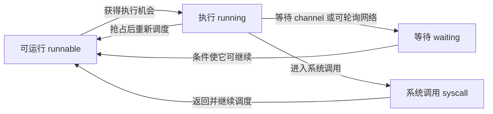

# goroutine 为什么在等：调度、netpoll 与诊断证据

一个服务请求变慢，goroutine 数量不断增加，CPU 却不高。此时增加 `GOMAXPROCS` 可能毫无帮助：多数工作也许在等 channel、等网络，或只是排在少数执行者后面。反过来，goroutine 很少也可能把一个 CPU 执行槽用满。

排查的起点是把“慢”拆成可观察的状态：**正在做计算、已经可以运行但还没得到执行机会、被某个条件阻塞，以及应用尚未完成的任务有多少。** 本篇先建立运行时模型，再让同一套诊断工具观察四个有限进程。它们使用真实 Go runtime 和真实 loopback TCP；输入大小固定，不通过无限压测制造结论。

需要的是基本 goroutine 与 channel 用法。操作系统层面的补充可读[请求在等什么](/knowledge/foundations/operating-systems/blocking-waiting.html)；识别到问题以后，具体并发限制和 HTTP 预算分别回到[有界工作](../concurrency/bounded-work.md)与[下游调用预算](../http/client-budgets.md)。

## 1. G、M、P 负责不同的事 {#gmp-and-state}

在本文固定源码中，G 表示 goroutine，M 表示运行时使用的操作系统线程，P 是执行 Go 代码所需的调度资源。M 需要关联 P 才能执行相应 Go 代码；线程也可能在没有 P 时阻塞或处于系统调用。`GOMAXPROCS` 控制同时执行 Go 代码的相应资源数量，不是 goroutine 数量上限，也不是整个进程的线程数上限。[proc.go：概念说明](https://github.com/golang/go/blob/go1.27.1/src/runtime/proc.go#L25-L34) · [GOMAXPROCS API](https://pkg.go.dev/runtime@go1.27.1#GOMAXPROCS)

一个 G 在不同时间可以经历这些主要状态。下面省略创建、退出、抢占细节与 GC 扫描状态，不能据图复写调度器：



文字版：waiting 需要某个事件发生；runnable 已经可以继续，但仍需被调度。网络就绪把等待者送回可运行状态，**并不保证马上占用 CPU，更不表示整个请求已结束**。[状态定义](https://github.com/golang/go/blob/go1.27.1/src/runtime/runtime2.go#L35-L65)

两个“队列”尤其容易混淆：运行时运行队列里是可以运行的 G；业务 channel、信号量或任务池前面排的是等待某个应用条件的工作。后者可能处在 waiting，而不是占满 runnable 队列。把所有 goroutine 数都叫“调度积压”，会把排查方向带偏。

## 2. 一次 TCP Read 怎样变成网络等待 {#netpoll-path}

假设本机已经建立 TCP 连接，对端保持连接但暂时不发数据。调用方 `Read` 不能立即得到那一个字节。在本文 Linux、可轮询 socket 的路径上，可以沿这些入口追踪：

| 入口 | 本版本中承担的动作 | 应保留的条件 |
| --- | --- | --- |
| `internal/poll.(*FD).Read` | 尝试底层读取；遇到 EAGAIN 且可轮询时等待可读，再重试 | 不是所有文件或所有平台都走同一分支 |
| `pollDesc.waitRead` / `wait` | 把读模式等待交给 runtime 的 poll 接口 | deadline、关闭也可能终止等待 |
| `runtime.netpollblock` | 检查就绪通知或登记等待；必要时 park 当前 G | 处理就绪与错误的竞争，不能等价成单纯 sleep |
| Linux `netpoll` | 使用 epoll 获取相关事件，找到可被唤醒的 G | 事件通知只表示可以重新尝试 I/O |
| `findRunnable` / `schedule` | 从可运行工作及网络事件等来源取工作并安排执行 | 具体检查顺序与实现细节不构成语言级公平保证 |

源码入口：[FD.Read](https://github.com/golang/go/blob/go1.27.1/src/internal/poll/fd_unix.go#L141-L178)、[poll runtime 桥接](https://github.com/golang/go/blob/go1.27.1/src/internal/poll/fd_poll_runtime.go#L72-L94)、[netpollblock](https://github.com/golang/go/blob/go1.27.1/src/runtime/netpoll.go#L546-L583)、[Linux epoll](https://github.com/golang/go/blob/go1.27.1/src/runtime/netpoll_epoll.go#L99-L176)、[调度入口](https://github.com/golang/go/blob/go1.27.1/src/runtime/proc.go#L3404-L3524)。

这解释了为什么一个网络等待不必持续独占一条执行 Go 代码的线程。但不能推广成“所有阻塞都只暂停 G，绝不占线程”：普通系统调用、cgo、其他文件类型与平台实现需要分别观察。netpoll 也没有替应用判断超时应该多长、收到的字节是否构成完整响应、失败后是否安全重试。

## 3. 先选工具，再解释它能证明的事实 {#evidence-types}

不同工具覆盖的是不同时间范围。将它们拼在一起，比从一个百分比直接宣布根因可靠。

| 证据 | 它回答的问题 | 常见误读 |
| --- | --- | --- |
| goroutine 栈快照 | 采集时哪些调用栈处于什么状态 | 一张快照说明整个事故期间的耗时比例 |
| CPU profile | 采样窗口中 CPU 执行时间集中在哪些栈 | 没有出现在 CPU top 的函数一定没有拖慢请求 |
| block profile | 按配置采样的同步阻塞，在解除后归因到相关栈 | 它包含所有 socket 的网络等待，或能列出尚未结束的每次阻塞 |
| execution trace | 记录窗口里的运行、阻塞、唤醒和调度等事件 | 一个有限 trace 能证明生产调度公平或容量上限 |
| 应用计数与结束信号 | 接受、活跃、等待、完成与 join 是否对应 | runtime 的 goroutine 总数回到某个值就足以证明没有泄漏 |

CPU profile 是样本；短窗口可能没有捕捉某个执行者。block profile 需先启用，`SetBlockProfileRate(1)` 尝试记录每次相关阻塞事件，会带来额外成本。trace 可以导出 `net`、`sync`、`syscall`、`sched` 等不同视角；`sched` 看可运行后的调度延迟，`net` 看网络阻塞，不能混成同一个“等待时间”。[pprof API](https://pkg.go.dev/runtime/pprof@go1.27.1) · [采样设置](https://pkg.go.dev/runtime@go1.27.1#SetBlockProfileRate) · [trace 导出类型](https://pkg.go.dev/cmd/trace@go1.27.1)

有限进程统一启用 profile 与 trace 方便教学对照。数字因此包含探针开销，不能拿 CPU 百分比给业务算法排性能名次。生产排查应先确定请求窗口、采集成本和权限，再选择足够回答问题的证据。

## 4. 四份输入，对应四种可以区分的观察 {#four-scenarios}

实验模块固定 Go 1.27.1、`GOMAXPROCS=2`，每种场景单独启动进程。所有应用 worker 都有显式结束等待；全局超时、TCP deadline 与外层进程超时是故障兜底，成功必须有完成计数。下面的“等到状态”是采集真实栈，匹配目标函数与状态后才继续；并非睡一段时间就假定已阻塞。

### 输入 A：一个计算 worker

`cpuWork` 在有限采样窗口内执行整数运算，定期检查原子停止标记，把结果校验值交回调用方。450 ms 是本实验的采样窗口，不是线程调度保证，也不是计算完成的延迟目标。释放停止标记并 join 后，检查 `started=joined=completed=1`。

应看 CPU profile 是否真的记录到 `main.cpuWork`。如果样本为空或没有目标栈，记录不足，而不能自行填入“CPU 忙”。主 goroutine 可能同时停在计时器等待；只截到它的栈会遗漏真正执行计算的那个 G。

### 输入 B：一个等 channel 的 worker

`channelWait` 进入 `<-release`，主 goroutine 持有唯一释放权。确认它的栈出现 `[chan receive]` 后采集，再关闭 release，等待它结束。此处没有业务计算可供增加 P 加速；继续条件就是 channel 事件。

解除等待后，block profile 与 trace 的 `sync` 视角能够把这段等待与目标函数联系起来。它们也会包含主 goroutine 的等待以及 profiling 自身的辅助栈，因此不能把 `runtime.chanrecv1` 的总占比全算到业务函数上。需要看累积栈归属。

### 输入 C：一条真实 TCP 连接等一个字节

程序只建立一个 loopback TCP 对：临时监听器在 accept 后关闭，peer 暂不发送。`networkWait` 用 `io.ReadFull` 读取一个字节；确认它处在 `[IO wait]`，再由 peer 发送 `K`。读到 `K`、完成计数为 1、worker 已 join 且两端连接已关闭，才算这段有限流程结束。

这不是用 channel 假装网络。栈要包含 `internal/poll` 和目标读取函数，trace 的 `net` 视角要有目标栈，结果必须真的读到那个字节。它支持“本次 TCP read 曾经等待网络就绪”的判断；无法证明远端服务器为何慢、跨机 RTT、网络拥塞或内核里发生过哪些包级事件。

### 输入 D：24 项工作争两个名额

本例故意采用“每个输入先创建 goroutine，再在 goroutine 里获取名额”的布局。总输入固定 24，不运行无限流量。前两项获得名额后停在显式 release，剩余 22 项在获取名额的发送处等待。

下面是 `cmd/diagnose/main.go` 的完整教学函数；调用方提供容量为 2 的 permit、固定 24 个输入和只关闭一次的 release。`entered` 仅报告已到达尝试获取名额之前，最终 blocked 数还要用真实栈确认。

<!-- snippet: go-runtime.queued-work -->
```go steps
// !step(2:3) 先报告到达，再发送 token 获取名额；permit 已满时，这个 goroutine 等在发送处。
// !step(4:5) 只有拿到 token 的工作计入 active；本例把它停在显式 release 上。
// !step(6:8) release 后减少 active、归还 token，并登记完成；调用方仍需 join。
func queuedWork(permit chan struct{}, release <-chan struct{}, entered chan<- struct{}, active, complete *atomic.Int64) {
	entered <- struct{}{}
	permit <- struct{}{}
	active.Add(1)
	activeWork(release)
	active.Add(-1)
	<-permit
	complete.Add(1)
}
```

观察时 `active=2` 与 22 个目标 `[chan send]` 可以同时成立。它说明限制实际执行数，不等于限制已创建的等待工作数。释放后应看到 24 项全部完成并 join；有限样本本身不证明内存会无限增长。若把“为每项输入先 go”的入口开放给持续输入，等待者数量就还取决于输入速率、接纳和拒绝策略，这才是要回到[有界工作](../concurrency/bounded-work.md)修正的设计问题。

### 本次真实观察怎样落到判断上

下表摘自 2026-10-03 的运行输出。延迟为工具对目标栈的累积归因，不是四类场景的性能比较；并发 worker 的阻塞时间可以相加，不能当成请求墙钟时长。

| 输入 | 本次证据 | 本次可支持的判断 |
| --- | --- | --- |
| A 计算 | CPU profile 总样本 450 ms，`main.cpuWork` 记录 450 ms；1 项完成并 join | 该采样窗口的 CPU 工作集中于计算函数 |
| B channel | 目标栈为 `[chan receive]`；trace sync 对 `main.channelWait` 累积 459.78 µs；1 项完成并 join | 本次 worker 等待 channel 事件后恢复 |
| C TCP | 目标栈为 `[IO wait]`，含 `internal/poll.runtime_pollWait`；trace net 对 `main.networkWait` 累积 133.63 µs；读到 1 字节并 join | 真实 TCP 读取经过网络等待，而非纯内存模型 |
| D 积压 | 快照 active=2、等待发送=22；trace sync 对 `main.queuedWork` 累积 22.77 ms；24 项全部完成并 join | 两个名额没有限制在名额之外创建的等待工作数量 |

例如 C 的 trace 还记录了连接建立的 `WaitWrite`。因此即使同属 net profile，也要沿调用栈区分“建连接”等待和“读字节”等待。本次四类场景的采集窗口很短；微秒数字主要帮助找到对应证据，不能外推成稳定网络时延。完整文本在下载包 `proof/` 中。

## 5. 按证据排除错误结论 {#diagnostic-decisions}

**“CPU 不高，所以服务没压力。”** 输入 D 已给出反例方向：等待者没有持续用 CPU，但仍占用栈、被引用的输入以及请求预算。应核对接受与完成速率、等待数量与等待时长，而不只看进程 CPU。此实验未测量每个任务的真实内存占用，不能从 24 个 G 换算生产容量。

**“都是 chan receive，就是 channel 实现有问题。”** 输入 B 是正确的等待协议；主 goroutine、profiling helper 也可能正常等待 channel。先找到应用调用点和负责唤醒的对象，再检查释放事件是否应已发生。栈提供位置，不负责决定业务是否按时。

**“IO wait 证明下游服务慢。”** 它仅告诉你此刻这个读取者在等 I/O；可能尚无数据、读完整消息还缺字节，或其他路径在等连接。本文由本进程的 peer 控制延迟，所以知道原因；生产上还要结合目标地址、请求阶段、deadline 与对端证据，不能凭状态名定责。

**“增加 GOMAXPROCS 能解决所有积压。”** 对 CPU 可运行工作也许值得实验，但对仍在等 channel 或字节的任务，它不创造释放事件；还可能提高竞争成本。先分辨 runnable 延迟与条件等待，再决定扩大执行资源、限制输入、修复阻塞协议还是调整 I/O 预算。

**“主进程退出 0，所有工作都成功了。”** 独立错误场景在确认 TCP read 等待后关闭 peer，要求真实 worker 返回 EOF。验证器必须看到 `WORKER_ERROR`、`completed=0`、`joined=1` 且进程退出 1。任何在 goroutine 中只打印错误、不回传给主流程的实现，都不满足结果约束。

## 6. 练习：下一份证据应该补在哪里 {#exercises}

**场景一：** 一张栈显示 400 个 G 在某个结果 channel 上发送，CPU profile 主要是别的函数。能否立刻增加该 channel 的容量？

参考推理：先查结果接收者是否仍存在，是否有取消分支提前返回，以及谁保证生产者最终退出。扩大缓冲可能暂时掩盖已经不存在的接收者。需要同一时间窗的任务计数、生产/接收事件与多份栈；不能由单张栈确定增长趋势。

**场景二：** TCP 栈出现 IO wait，但 CPU top 没有 `networkWait`。两份证据是否矛盾？

参考推理：不矛盾。CPU profile 观察执行时间，等待字节时目标 G 通常没有执行相应 Go 代码。用 trace 的 net 视角与读操作的开始/完成状态连接起来；CPU 样本空缺不等于该读取没有影响延迟。

**场景三：** 把积压输入从 24 降到 2，两个 worker 都活跃且没有 `[chan send]`。是否证明布局有界？

参考推理：只证明本次有限输入没有额外等待者。结构性上限需要说明接纳发生在哪里、创建 goroutine 在预算检查之前还是之后、超限如何拒绝，以及每个任务保留多少数据。改变输入是找反例的方法，不能替代这些不变量。

<details>
<summary>验证附录：复现命令、实际观察与未覆盖范围</summary>

[下载 source-only 实验包](/examples/go-runtime-boundaries-lab.zip)。`README.md` 说明有界执行；`proof/result.json`、`proof/commands.json` 记录最终执行及逐阶段退出码，`proof/*-goroutines.txt`、`proof/*-cpu-top.txt`、`proof/*-trace-top.txt` 是由真实进程产物派生的文本。原始 profile/trace 的 SHA-256 也保留，下载包不包含可执行二进制、工具链或缓存。

一次正常执行按以下顺序：固定版本检查；单元与 race/vet；明确原因的错误变体；构建诊断程序；分别启动 CPU/channel/network/backlog；使用 `go tool pprof -top` 阅读 CPU 与 block 文件；使用 `go tool trace -pprof=net` 或 `-pprof=sync` 提取 profile，再交给 pprof。工具调用不启动 HTTP 诊断服务。

首轮诊断构建遇到 VCS stamping 查询失败，退出 1；当时测试已完成，但四类诊断进程尚未启动。原命令、源码和失败输出留在 `attempts/attempt-1/`，它不计作成功拒绝某个目标坏实现。独立 staging 的构建显式使用 `-buildvcs=false`；第二轮构建与四类诊断均完成；EOF 错误场景以目标错误退出 1，正确路径退出 0。两次记录分别保留，未覆盖项见下段。

源码来源复核与运行结果分开：固定 `go1.27.1` 的 runtime、poll 和规范文件已与安装版随附文件逐字节比较，逐文件 SHA-256 在 `source-review.json`；这不是整个编译器构建可复现性的断言。实验只覆盖 Linux amd64、一个 TCP 对与有限工作。没有运行外部服务、HTTP 压测、磁盘 I/O、cgo、容器 CPU 限额、多机网络或长期泄漏实验，也不据这次 profile 计算生产吞吐。

</details>
