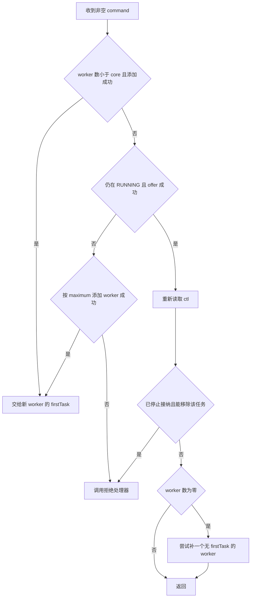
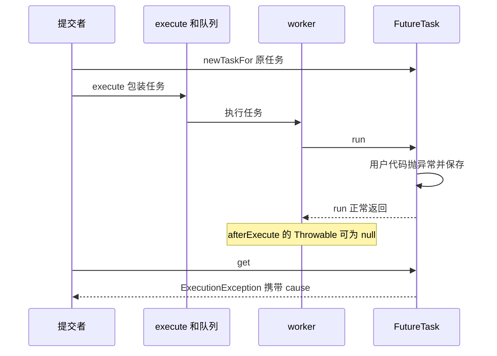

# 线程池如何接纳任务：线程、队列与拒绝

一个池设置 `corePoolSize=1`、`maximumPoolSize=2`，队列只能放 1 个任务。A 正在运行且被门闩挡住，此时依次提交 B、C、D，会发生什么？

B 先进入队列，C 交给第二个工作线程，D 被拒绝。若以为“先把线程开到 maximum，再排队”，就会把 B 的归宿判断错，也会误解为什么某些池设置很大的 maximum 却始终只有少数线程。问题的核心是接纳顺序及每一步失败后谁承担责任。[ThreadPoolExecutor API](https://docs.oracle.com/en/java/javase/21/docs/api/java.base/java/util/concurrent/ThreadPoolExecutor.html)

## 把线程、任务和队列分开计数

线程池保存的不只有一个“大小”。固定源码用原子整数 `ctl` 编码运行状态与 worker 数；worker 数不是此刻正在执行业务的任务数。空闲 worker 也计入其中，线程创建还可能失败。队列长度则表示已经排队、尚未被 worker 取走的任务。`getActiveCount()` 是近似统计，不应拿来作为无锁的业务准入判定。[源码 ctl 与状态说明](https://github.com/openjdk/jdk/blob/jdk-21%2B35/src/java.base/share/classes/java/util/concurrent/ThreadPoolExecutor.java#L381-L430)

本篇用固定输入说明机制：队列是 `ArrayBlockingQueue<>(1)`，策略为 `AbortPolicy`，A/C 开始后先报告门闩，再等待共同放行。测试主线程等到报告后才提交下一步，因此不靠 sleep 猜任务有没有开始。

| 提交时刻 | 池里已知状态 | 分支 | 提交后的状态 |
| --- | --- | --- | --- |
| A | worker=0，队列空 | 小于 core，`addWorker(A,true)` | 一个 worker 执行 A |
| B | A 未结束，worker=1 | `offer(B)` 成功 | B 排队，仍一个 worker |
| C | A 未结束，B 在队列 | offer 失败，`addWorker(C,false)` | 第二个 worker 执行 C |
| D | A/C 未结束，B 仍排队 | offer 失败，无法再加 worker | AbortPolicy 向提交者抛异常 |

C 可能在 B 之前完成，即使队列本身是 FIFO。队列的取出顺序不能约束绕过队列成为新 worker 首任务的 C，更不保证任务完成顺序。

## 沿真实 execute 走一次

下段是 `jdk-21+35` 的 `ThreadPoolExecutor.java` **1339–1377 行完整方法**，仅去掉统一的四格缩进，保留原注释。它不是伪代码。下载包保留完整文件、版权头、GPLv2 与 Classpath exception，源文件 SHA256 为 `c95cd4ef67c936350fb6b85db3f7858a1185ddeac62bf00f4236efe6b5fd2427`。[固定上游方法](https://github.com/openjdk/jdk/blob/jdk-21%2B35/src/java.base/share/classes/java/util/concurrent/ThreadPoolExecutor.java#L1339-L1377)

<!-- snippet: java-mechanisms.execute -->
```java steps
// !step(24:29) A 看到 worker 数小于 core，成功创建首个 worker 并把自己作为 firstTask；B 的输入则越过这一分支。
// !step(30:31) B 入队成功后必须重新读取状态，因为 offer 与关闭不是同一个原子动作。
// !step(32:35) 若已经关闭且还能移除任务，就拒绝；否则零 worker 时尝试补一个取队列的线程。
// !step(37:38) C 入队失败但可按 maximum 增加 worker；D 两者都失败，责任交给拒绝策略。
public void execute(Runnable command) {
    if (command == null)
        throw new NullPointerException();
    /*
     * Proceed in 3 steps:
     *
     * 1. If fewer than corePoolSize threads are running, try to
     * start a new thread with the given command as its first
     * task.  The call to addWorker atomically checks runState and
     * workerCount, and so prevents false alarms that would add
     * threads when it shouldn't, by returning false.
     *
     * 2. If a task can be successfully queued, then we still need
     * to double-check whether we should have added a thread
     * (because existing ones died since last checking) or that
     * the pool shut down since entry into this method. So we
     * recheck state and if necessary roll back the enqueuing if
     * stopped, or start a new thread if there are none.
     *
     * 3. If we cannot queue task, then we try to add a new
     * thread.  If it fails, we know we are shut down or saturated
     * and so reject the task.
     */
    int c = ctl.get();
    if (workerCountOf(c) < corePoolSize) {
        if (addWorker(command, true))
            return;
        c = ctl.get();
    }
    if (isRunning(c) && workQueue.offer(command)) {
        int recheck = ctl.get();
        if (! isRunning(recheck) && remove(command))
            reject(command);
        else if (workerCountOf(recheck) == 0)
            addWorker(null, false);
    }
    else if (!addWorker(command, false))
        reject(command);
}
```

先看 `addWorker` 的第二个参数。true 的意思是用 core 作为上限，false 用 maximum；不是“守护线程开关”。它内部再次读取状态并用 CAS 申请 worker 数，随后在主锁内校验、登记 worker、启动线程；失败时回滚登记和计数。外面取到的 c 只是当时快照，因此不能只看外层 if 就推断一定创建成功。[addWorker 901–994 行](https://github.com/openjdk/jdk/blob/jdk-21%2B35/src/java.base/share/classes/java/util/concurrent/ThreadPoolExecutor.java#L901-L994)



图里“offer 成功”后仍需复查，不是多余的防御。接纳和关闭可以交错，池也不能让有任务的队列因为没有 worker 而永远无人处理。补 worker 使用 `firstTask=null`，让它从队列取任务；并不代表提交了一个 null 任务。

### 入队以后刚好关闭怎么办

设 core=0，主线程在 `offer` 已放入任务、execute 尚未复查的缝隙调用 `shutdown()`。此时任务仍可能被从队列移除并拒绝。入队成功不是已经开始执行的承诺，也不是与 shutdown 不可分割的事务。

实验用只用于教学的 `PausingQueue` 在 `super.offer` 后暂停提交线程，主线程关闭池，再放行提交线程。此路径会发现非 RUNNING，成功 remove，然后抛 `RejectedExecutionException`；断言同时确认任务体没运行、队列为空、池终止。若已经被 worker 取走，remove 可能失败，不能据此推断任务被拒绝或可以重投。没有控制所有者和副作用就自动重试，可能重复执行。

## 排队策略改变哪条分支

| 选择 | 交接特点 | 换来的代价 |
| --- | --- | --- |
| 有界阻塞队列 | 先吸收一小段积压，再扩容或拒绝 | 队列中的请求已消耗等待时间和内存，必须有预算 |
| 无界队列 | 通常总能 offer，core 之外扩容路径难以触发 | maximum 无法替代队列边界；积压可吞噬内存并让任务过期 |
| `SynchronousQueue` | 没有存储容量；要直接找到接收者，否则尝试加线程 | maximum 太大时压力会表现为线程增长，太小时更早拒绝 |
| 调用者执行 | 满载时由提交线程运行任务，可能减慢继续提交 | 提交调用可能阻塞；可能占住事件循环、请求线程或其持有的锁 |

这些选择来自 API 的队列与拒绝策略说明，不能脱离业务上下文选择某个“最佳默认”。如果调用者正持有一个 worker 完成所需的锁，CallerRuns 会改变执行上下文并放大耦合；用它前要检查任务是否允许在任意提交线程执行。

`AbortPolicy` 让提交者明确收到拒绝；`DiscardPolicy` 不执行也不报告；`DiscardOldestPolicy` 会丢队列头部再重试；`CallerRunsPolicy` 在池未 shutdown 时直接调用任务。特别是后者在 shutdown 后不会帮你执行。默认策略不是业务重试策略，拒绝处理器返回也不代表任务完成。[策略实现 2041–2143 行](https://github.com/openjdk/jdk/blob/jdk-21%2B35/src/java.base/share/classes/java/util/concurrent/ThreadPoolExecutor.java#L2041-L2143)

如果用 submit 加静默丢弃策略，创建出来的 Future 可能一直没有被执行也没有被取消。同步层说“没抛异常”，并不等于结果层有一个最终状态。要求每个任务都有确定结果时，需要明确拒绝异常或显式完成/取消 Future 的方案。

## execute 与 submit：异常被谁接住

在本实验的 AbortPolicy 与 worker 执行路径里，执行线程与提交线程不是同一个调用栈。`execute(() -> { throw ...; })` 的业务异常发生在 worker 内，不会穿越线程重新抛回已经返回的 execute 调用者。若饱和时采用 CallerRunsPolicy，任务可能在提交线程同步运行并向它抛异常，需另外按这个调用栈处理。固定版本 `runWorker` 先把异常交给 `afterExecute(task, ex)`，再抛出并结束该 worker；未捕获异常处理器可观察它，池根据状态决定是否补 worker。[runWorker 1123–1159 行](https://github.com/openjdk/jdk/blob/jdk-21%2B35/src/java.base/share/classes/java/util/concurrent/ThreadPoolExecutor.java#L1123-L1159)

`submit` 多了一层结果包装。下段是固定版本 `AbstractExecutorService.java` 的 120–126 行，完整方法、仅去统一缩进。`newTaskFor` 默认创建 FutureTask，传给 execute 的已经不是原 Runnable。[submit 与 newTaskFor](https://github.com/openjdk/jdk/blob/jdk-21%2B35/src/java.base/share/classes/java/util/concurrent/AbstractExecutorService.java#L97-L126)

<!-- snippet: java-mechanisms.submit -->
```java steps
// !step(1:3) 输入原 Runnable，先创建一个记录完成结果的 RunnableFuture；空任务同步报错。
// !step(4:6) execute 接收包装任务；只有接纳调用返回，submit 才把 Future 交给调用者。
public Future<?> submit(Runnable task) {
    if (task == null) throw new NullPointerException();
    RunnableFuture<Void> ftask = newTaskFor(task, null);
    execute(ftask);
    return ftask;
}

```

进入 `FutureTask.run()` 后，用户 Callable 抛出的 Throwable 被捕获并存为失败结果，run 正常返回。于是外层 `afterExecute` 的 Throwable 参数可能为 null，而 `Future.get()` 抛出 `ExecutionException`，其 cause 才是业务异常。忽略 Future，就可能忽略真正的失败。反过来，执行器接纳失败时，异常可以在 submit 尚未返回 Future 前同步抛给提交者。[FutureTask 307–337 行](https://github.com/openjdk/jdk/blob/jdk-21%2B35/src/java.base/share/classes/java/util/concurrent/FutureTask.java#L307-L337)、[Future.get](https://docs.oracle.com/en/java/javase/21/docs/api/java.base/java/util/concurrent/Future.html#get())



实验同时检查 execute 的未捕获异常类型/消息、两个 afterExecute 结果，以及 submit 的 cause，避免只观察“线程还活着”或“调用返回”就误报成功。生产代码还要决定谁消费结果、谁记录一次错误以及谁处理重试，避免多个层重复报错或重试。

## 关闭改变的是任务所有权和进展

固定实现的运行状态可以这样理解：RUNNING 接新任务并取队列；SHUTDOWN 拒绝新任务但继续取已有队列；STOP 拒绝新任务、不再取队列并中断 worker；任务与 worker 都结束后，进入 TIDYING，执行终止钩子，最后 TERMINATED。[状态定义与转换](https://github.com/openjdk/jdk/blob/jdk-21%2B35/src/java.base/share/classes/java/util/concurrent/ThreadPoolExecutor.java#L381-L430)

`shutdown()` 发起有序结束，调用返回时 A 仍可能运行、B 仍可能排队。`awaitTermination` 返回 true 才代表这次等待观察到池终止；返回 false 是期限到了。`shutdownNow()` 只是尽力中断正在执行的任务，并返回尚未开始的任务，不是把线程强制杀掉；忽略中断或在不可中断操作中等待的任务可能继续运行。[ExecutorService 关闭语义](https://docs.oracle.com/en/java/javase/21/docs/api/java.base/java/util/concurrent/ExecutorService.html)

一个容易漏掉的细节是：固定 TPE 的 `shutdownNow` 会 drain 队列，但没有替调用者逐个 cancel 取出的 FutureTask。实验把 A 挡住，把 `submit(B)` 的包装放进队列，然后 shutdownNow；返回列表中的对象与 B 的 Future 是同一个对象，B 没运行，Future 仍未完成。调用者随后显式 `cancel(false)`，才让等结果的人获得取消结局。[shutdownNow 1421–1437 行](https://github.com/openjdk/jdk/blob/jdk-21%2B35/src/java.base/share/classes/java/util/concurrent/ThreadPoolExecutor.java#L1421-L1437)

实际系统还要处理这些取出任务：取消并通知等待者、把业务工作交还可靠队列，或在确定幂等边界后重新安排。不能因为 API 返回了 Runnable 列表就把原请求的承诺忘掉。

## 用预算解释参数，而不是抄数字

若下游只有 8 个数据库连接，让 100 个线程同时进入借连接只会把等待搬到连接池。线程池限制 CPU 或并发工作；连接池限制数据库会话；队列限制允许等待的工作。它们需要共享同一个请求期限与拒绝策略。[连接预算](../../frameworks/data-access/connection-budget.md)

在一个仅作估算的均匀模型里，8 个 worker、每项服务耗时 50ms，前面排 16 项意味着新任务可能多等约 100ms 才开始。真实任务时长、调度、外部等待不均匀，这不是最大延迟保证。队列预算应由能接受的等待、单任务保留内存和下游资源共同限制，并通过真实流量验证。增大队列不能增加下游处理速率，只能延后看到过载。

<details>
<summary>源码身份、实际运行与复现</summary>

下载 [java-service-mechanisms-lab.zip](/examples/java-service-mechanisms-lab.zip)。`ExecutorLab` 使用门闩固定 A/C、offer/关闭交错，所有等待有上限，离开场景时先放行任务，再 shutdown 并有界等待；只有真实等待超时才 shutdownNow，并把强制清理记为失败。`python3 run.py --output proof/local-run` 运行正例与严格类型的负例。

`wrong-max-first` 必须以目标 AssertionError 拒绝“先开到 maximum”，`wrong-drain-cancels` 必须以目标 AssertionError 拒绝“drain 自动 cancel”。编译失败、启动失败或相同文字的其他异常不算反例成功。普通 worker 的失败和已完成 Future 的失败都由实验的收集器传回主线程；专门演示 execute 异常的那一例仅允许一次指定类型/消息，其余异常仍失败。所有注册线程 join 后才输出最终成功标记。countDown 只让条件满足，不代表 worker 已离开 await；放行后立即 shutdownNow 仍可能制造意外中断。实验保留原主异常，独立的清理/子线程错误追加为 suppressed，并按 Throwable 身份去重，避免同一次异常同时成为 cause 和 suppressed。另有源码变体在 A 完成副作用后抛异常、把 Future 的 cause 换错，验证它们不会因业务结果已出现而假绿。完整输出、精确被测文件哈希在 proof 与 verification 记录中。

源码固定于 jdk-21+35；实际执行 Temurin 21.0.12.1+1-LTS。运行工具链 src.zip 的 ThreadPoolExecutor、AbstractExecutorService、FutureTask 三个文件与本包 GA 源快照字节相同；这只证明三个文件一致，不等于整个 JDK 构建一致。未覆盖自定义 ThreadFactory 返回 null、全部策略组合、SecurityManager、虚拟线程、生产吞吐或网络服务。

</details>

## 练习：跟踪下一位负责人

1. 把队列容量从 1 改成 100，仍只提交 A/B/C/D，maximum=2 会触发吗？参考推理：A 阻塞时 B/C/D 均可入队，通常仍只有 core 的一个 worker；maximum 不是预启动目标。
2. C 比 B 先完成，是不是 ArrayBlockingQueue 破坏 FIFO？参考推理：C 是新 worker 的 firstTask，没经过队列；即使都出自 FIFO，完成顺序也不受 FIFO 保证。
3. submit 返回的 Future 没人 get，afterExecute 也只有 null，怎样知道业务失败？参考推理：明确结果消费责任，按完成状态检查 Future 或使用集中完成通道；null 只说明包装任务没向 worker 抛异常。
4. shutdownNow 返回 B 后又手动运行 B，是否安全？参考推理：先确认返回的是哪个包装、取消状态、业务副作用与原请求期限；不能只凭任务名重新构建并执行副作用。返回列表限定本次尚未开始的对象，不替应用决定重试协议。
