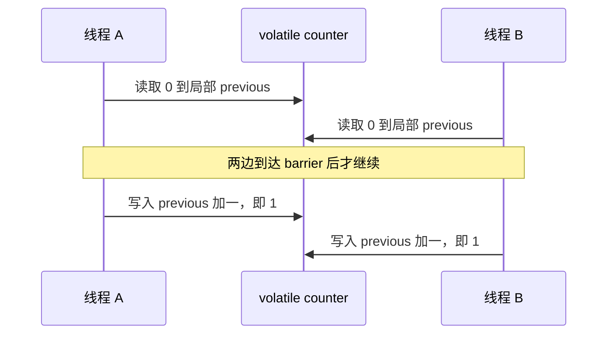

# JMM 与安全发布：什么先于什么

配置加载线程先写 `value = 42`，再写 `ready = true`。请求线程看到 `ready` 为真后读取 `value`。它一定读到 42 吗？

先别用“写入主内存”“CPU 很快就会同步”回答。要把问题拆成三件事：两个线程究竟访问哪些变量、两个动作间有没有规范定义的顺序、这个顺序是否覆盖业务要保持的一整组状态。JMM（Java Memory Model）给出允许的读写行为；它不要求 JVM 按某个固定的缓存刷新流程实现。[JLS 17.4](https://docs.oracle.com/javase/specs/jls/se21/html/jls-17.html#jls-17.4)

## 从一次读能证明什么开始

设 `Box` 刚创建，`value` 为 0，`ready` 为 false。只有一个写者发布一次；发布后不再修改 `value`。下面是本实验的完整教学类，源码在下载包 `src/Publication.java`，不是 JDK 原源码。

<!-- snippet: java-mechanisms.publication -->
```java steps
// !step(2:5) 初始输入是 value=0、ready=false；只有 ready 是 volatile，value 是普通字段。
// !step(6:9) 写线程先构造数据，再把 ready 写成 true；这次 volatile 写是发布边界。
// !step(10:12) 读线程只有读到 ready=true 才访问 value；同一个 volatile 变量连接写线程与读线程。
// !step(13:15) 读到 false 只返回尚未就绪；方法没有承诺一次调用必定赶上发布。
public final class Publication {
    static final class Box {
        int value;
        volatile boolean ready;
    }
    public static void publish(Box box) {
        box.value = 42;
        box.ready = true;
    }
    public static int readOnce(Box box) {
        if (box.ready) {
            return box.value;
        }
        return -1;
    }
}
```

这里的证明不是“value 也被 volatile 修饰了”。证明是一条可传递的 happens-before 链。JLS 中同一线程的程序顺序、同步动作，以及传递性共同构成这条链。[JLS 17.4.5](https://docs.oracle.com/javase/specs/jls/se21/html/jls-17.html#jls-17.4.5)


箭头表示规范中的先于关系，不是测得的物理时刻。成立条件包括：同一个 `Box`、同一个 `ready`、数据先写、读者先检查标志、没有其他写者继续修改数据。程序没有数据竞争不代表任意多步业务动作已经不可分割。

改变一个条件就能检验理解：若把写者两行交换，先 `ready = true` 再 `value = 42`，同步边只能把 ready 写入之前的动作带给读者，覆盖不到后面的 value 写入。若读者先把 `value` 读进局部变量，再检查 `ready`，后一次检查不会把已经读到的局部值“补刷新”。这两个变体都破坏了原证明；它们不是保证每次必然出错。

## happens-before 是偏序，不是全局时间表

两个线程都打印了日志，日志先后不一定就是想研究的内存顺序；日志库内部的锁甚至可能给实验增加原程序没有的同步。不能把“我看见它先运行”“加了 sleep 以后没出错”当成同步规则。`sleep` 和 `yield` 本身没有同步语义。[JLS 17.3](https://docs.oracle.com/javase/specs/jls/se21/html/jls-17.html#jls-17.3)

| 可用的边界 | 能推导的关系 | 常见漏掉的条件 |
| --- | --- | --- |
| 同一 monitor 解锁，再加锁 | 解锁前的写可被后续持有该锁的代码看到 | 两边必须用同一把锁；仅一边加锁不够 |
| volatile 写，再读这个变量 | 写前的状态可沿同步边发布 | 不会自动保护读改写或多个字段的一致更新 |
| `Thread.start()` | 启动前的动作先于新线程的动作 | 不是新线程完成的证明；完成结果可用成功 join 接回 |
| 提交任务、`Future.get()` | 提交前 → 任务动作 → 成功取回结果 | 提交之后继续改共享对象不在提交前边界内 |
| `CountDownLatch.countDown()` 与成功 await | 放行前动作先于越过门闩后的动作 | 初始计数未归零、超时返回不能当成成功越过 |

前三项来自 JLS；后两项是类库 API 的 memory consistency 保证，别只凭底层“可能用了 volatile”推断。[ExecutorService](https://docs.oracle.com/en/java/javase/21/docs/api/java.base/java/util/concurrent/ExecutorService.html)、[CountDownLatch](https://docs.oracle.com/en/java/javase/21/docs/api/java.base/java/util/concurrent/CountDownLatch.html)

可以把两类顺序分开画：业务想要的顺序是“配置完整构造之后才允许使用”；实现必须提供能够覆盖它的同步链。业务箭头存在于需求中，不会自动变成 JMM 箭头。

## 可见性不等于复合动作原子性

把计数器声明为 `volatile int counter`，`counter++` 仍需要读、加一、写三个逻辑动作。即使每个读写都可见，两个线程也能都读到 0，再各写入 1。

本实验用 barrier 固定这次交错。为了明确分隔“读”和“写”，代码把自增拆开；它演示的是读改写不是一个原子操作，**不是声称捕获了 `counter++` 编译后的某条机器指令**。



最后写入哪一个 1 不重要，关键是两次业务操作只产生一次增量。实验 `JmmLab.splitIncrement` 的正确断言是结果 1；错误主张模式 `wrong-volatile-is-atomic` 却断言 2，应被 `VOLATILE_COMPOUND_CLAIM` 拒绝。barrier、线程结束、异常传播均有期限，失败时不能把屏障超时冒认成反例成立。

`AtomicInteger.incrementAndGet()` 把这个单变量读改写变成原子动作。如果要同时满足“库存减少”和“已售增加”，两个 AtomicInteger 分别原子仍可能被读者看见一半更新。此时可以用同一锁维护不变量，或把多字段状态封装为一个不可变值，以一个原子引用比较并替换。CAS 失败需要重试，更新函数还应避免把外部副作用放进可重试部分。[atomic 包保证](https://docs.oracle.com/en/java/javase/21/docs/api/java.base/java/util/concurrent/atomic/package-summary.html)

## 安全发布的是对象状态，不只是地址

请求线程拿到一个非 null 引用，并不单凭这一点就知道构造写入与它之间有顺序。常见的可靠办法是：在启动使用者线程之前构造、用同一个锁交接、通过 volatile 引用发布完整快照，或交给承诺了内存一致性的并发容器/执行器。

发布与后续修改是两次不同的问题。例如 `volatile Config current` 能发布 `current = new Config(...)` 之前的构造状态；随后偷偷修改 `current.rules` 中的普通可变列表，不会因为引用字段是 volatile 就让列表操作变成原子、线程安全或一致快照。最好在构造时复制输入，并避免泄漏内部可变对象。

这也解释了为何[HashMap 的正确查找规则](../collections/hashmap.md)不能替代并发设计：`equals/hashCode`、桶位置和扩容的单线程正确性，与如何跨线程交接和修改 Map 是不同的责任。

### final 帮到哪一步

`final` 字段有额外的初始化安全语义：对象被正确构造，构造期间没有让 `this` 提前逃逸，则读者一旦拿到该对象，其 final 字段及规则覆盖的构造时可达状态得到专门保护。它不等于给每次普通引用赋值都补上一条常规 happens-before 边，也不保证读者何时能看到引用本身。规范对 final 的处理在独立的 17.5 节，不应混同于 volatile。[JLS 17.5](https://docs.oracle.com/javase/specs/jls/se21/html/jls-17.html#jls-17.5)

| 写法 | 为什么还要判断 |
| --- | --- |
| `final int limit` 在构造函数赋值 | 正确构造时得到 final 初始化保证 |
| `final int[] limits` 在构造时填充 | 引用不能重赋值；构造时数组内容有相应保护，之后元素依然可变 |
| 构造函数把 `this` 注册到监听器 | 其他线程可能在构造完成前调用对象，失去“正确构造”的前提 |
| 普通静态字段保存一个不可变对象 | final 字段规则有帮助，但普通引用的可见进展不能靠“它不可变”推断 |
| 双重检查延迟初始化的引用为 volatile | 读到实例的线程可沿该引用建立发布边界；只给内部字段加 final 不应替代整个算法证明 |

若对象创建便宜，直接在类初始化或所有者初始化阶段构造，常比双重检查更容易推理。若每次更新少、读取多，不可变快照能用分配和复制成本换取简单读路径；若状态大且写多，同一锁下小范围修改可能更合适。不要为省一把锁引入无法说明的生命周期。

## 把证明、实验和未知分开放

本包 [java-service-mechanisms-lab.zip](/examples/java-service-mechanisms-lab.zip) 包含完整源码、命令、原始输出与文件哈希。正确发布的运行只说明本次在指定 JDK 上读取了 42；所有合法执行的保证来自 JLS。有限压力实验中没看到 0、没卡住、没丢增量，都不能证明没有数据竞争。

这里没有把删除 volatile 后的失败设为必须通过的测试：没有同步的版本可能恰好每次都得到 42，甚至加入某个“帮助观察”的同步后不再测试原来的问题。可控丢更新则不同：它是一个由 barrier 安排出的合法交错，反驳“volatile 能使任意读改写整体原子”的断言，不需要寄希望于竞态撞中。

<details>
<summary>复现实验与证据边界</summary>

解压后设置本机 JDK21 的 `JAVA_HOME`，在包目录运行 `python3 run.py --output proof/local-run`。输出目录必须不存在，避免覆盖失败证据。脚本使用标准库，编译产物放入临时目录并清理；每个进程有期限。

`proof/run-r4/jmm.txt` 是正确路径，`negative-volatile.txt` 是被拒绝的错误主张。精确命令、状态与源码哈希见 `verification.json` 和 `proof/run-r4/result.json`。源码审阅、静态片段校验、实际运行是不同记录。线程成功 join 只说明它已结束，不能说明任务成功。实验用 ChildFailures 把普通子线程异常连同原始 cause 交回主线程，所有线程 join 后再决定成功；已有主异常仍为主因，不同的子失败追加为 suppressed，同一个 Throwable 只记录一次。runner 同时要求完整结果和成功标记。原子加一完成后再抛异常的故障注入也必须被拒绝。运行 JDK 是 Temurin 21.0.12.1+1-LTS；没有执行所有 CPU 架构，也没有做性能排名或 JMM 穷举。

</details>

## 换一个条件再推一次

1. 把 `ready = true` 提前到 `value = 42` 之前，哪条边缺了？参考推理：value 写入不再位于发布写之前，传递链无法到达它；“读到 ready 为真”不足以排除 value 仍为 0。
2. 用两个 volatile 字段存余额与账本版本，读者先后各读一次，能否保证来自同次更新？参考推理：单字段可见性不提供跨字段快照；要定义锁边界或不可变聚合值的单次发布。
3. 任务提交后，调用者修改传入的 List，再调用 `Future.get()`，List 就安全吗？参考推理：提交前保证不能覆盖提交后与任务并发的修改；get 接回任务结果，不逆向修复发生过的数据竞争。
4. 某错误版本连续一百万次未失败，可以删锁吗？参考推理：需要覆盖该不变量的规范推导；观察集合不等于所有合法执行集合，增加循环次数不能补齐缺失的顺序边。
