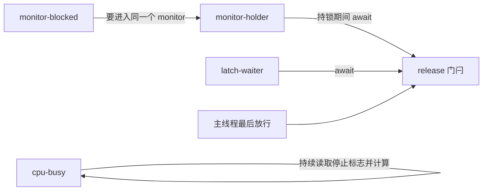

# 从线程与 GC 证据区分慢请求

同样是“一个请求迟迟没返回”，可能正在算，也可能在排队、抢锁、等数据库，或不断分配对象让 GC 频繁介入。线程数、CPU 使用率和 GC 次数各看见一个侧面，没有一个数能独自给出根因。

先把问题限定为可检查的窗口：哪一类请求、哪个进程、什么时间段变慢，耗时是在进入执行器前、任务体内，还是外部调用之后？然后才决定采什么证据。把不同时段的高 CPU、某一张线程快照和另一次请求的超时拼在一起，可能得到一个听起来完整、却从未真正发生过的故事。

## 一个能改变条件的实验现场

本包创建四个有名字的平台线程，主线程负责分阶段采样与分配：

| 线程或阶段 | 实际代码做什么 | 首先要找的证据 |
| --- | --- | --- |
| `lab-cpu-busy` | 在 volatile 停止标志之前做有依赖的整数计算 | 业务栈和该线程 CPU 时间增量 |
| `lab-monitor-holder` | 持有 monitor，在 CountDownLatch 上等待 | 已持有的 monitor 与等待栈 |
| `lab-monitor-blocked` | 试图进入同一个 synchronized 块 | BLOCKED、monitor 身份及 owner |
| `lab-latch-waiter` | 在同一门闩上等待，不持有该 monitor | WAITING、park/await 调用链 |
| 主线程分配阶段 | 分配 2048 个 128KiB 数组，只保留最近 16 个 | 分配源码、真实 GC 日志及清理完成 |

门闩保证持锁线程先获得 monitor，再启动争用线程。主线程有期限地观察到 BLOCKED/WAITING 后，才发出 READY 并接受采样命令。两张快照之间的 250ms 是观察窗口，不是用 sleep 碰运气安排锁交错。



从 blocked 追到 holder 后不能停：holder 的栈告诉我们它为什么还不放锁。这次 holder 自己是 WAITING，说明“WAITING 的线程不占用任何资源”也是错误的。`CountDownLatch.await()` 不会像 `Object.wait()` 那样释放任意外层 synchronized monitor；后者只释放所调用对象的 monitor，也不是释放线程持有的所有锁。

## 状态是入口，栈与时间才让结论变具体

Java 的 Thread.State 是 JVM 的线程状态分类，不是操作系统调度器全部状态的直接映射。RUNNABLE 可能正在执行，也可能在等待处理器等系统资源；BLOCKED 特指等待进入或重新进入 monitor；WAITING/TIMED_WAITING 要继续看是在 join、park、wait 还是其他同步操作。[Java SE21 Thread.State](https://docs.oracle.com/en/java/javase/21/docs/api/java.base/java/lang/Thread.State.html)

本次保存两份同进程 `ThreadMXBean.dumpAllThreads(true, true)` 的实际结果：`threads-before.txt` 与 `threads-after.txt`。输出格式是教学程序根据 ThreadInfo 字段写出的文本，不是模仿 jcmd 的伪日志；其中的线程状态、栈、锁和 owner 均来自 JVM，未用预期值填充。只保留 `lab-` 命名的实验线程，不能拿它判断整个 JVM 的所有线程。

下面两行是 run-r4 第一张快照的原样节选。两个相同的锁身份把等待者与持有者连起来；这一身份只在本次进程内有意义，不应跨重跑比对。

```text
    locked monitor java.lang.Object@1d81eb93 at app//DiagnosticLab.lambda$main$0(DiagnosticLab.java:49)
SNAPSHOT name=lab-monitor-blocked state=BLOCKED lock=java.lang.Object@1d81eb93 owner=lab-monitor-holder
```

完整快照还显示 busy 位于 `DiagnosticLab.busy`，waiter 位于 `Unsafe.park → LockSupport.park → AbstractQueuedSynchronizer → CountDownLatch.await → DiagnosticLab.awaitRelease`。这给出“正在什么代码里等”的证据，但单张快照仍不能给出等待时长或在整个请求中的占比。

### 对同一线程比较 CPU 增量

在采样窗口前后读取 `getThreadCpuTime(threadId)`，减去基线，比“线程是 RUNNABLE”多了一份时间证据。该 API 的单位是纳秒，但精度单位不等于保证纳秒准确度；不支持、未启用或线程已不存活时需要按 API 返回值处理。实验先验证支持并启用测量，在线程结束之前取值。[ThreadMXBean](https://docs.oracle.com/en/java/javase/21/docs/api/java.management/java/lang/management/ThreadMXBean.html)

本次 run-r4 观察如下，数值可在 `diagnostic.txt` 核对：

| 线程 | 采样时状态 | CPU 增量（ns） | 本窗口支持的判断 |
| --- | --- | ---: | --- |
| cpu-busy | RUNNABLE | 291709471 | 栈在计算且消耗 CPU，符合本次计算循环 |
| monitor-holder | WAITING | 0 | 本窗口几乎没有执行，仍持有 monitor |
| monitor-blocked | BLOCKED | 23024 | 很小的执行增量，主要证据是等待同一 monitor |
| latch-waiter | WAITING | 0 | 栈显示等待放行，并未在忙轮询 |

这些不是吞吐排名，也不是“一个 CPU 核心 100%”的计算。窗口包含采样与主线程分配，JIT、调度、宿主机其他工作都会影响数字；`ActiveProcessorCount=2` 影响 JVM 对可用处理器的判断，并非操作系统的硬 CPU 配额。单线程 CPU 增量也不能代表整个进程的 GC、编译线程或其他线程开销。

若实际服务显示 RUNNABLE 但此线程 CPU 增量很小，下一步应检查栈是否在 native I/O、是否被调度延迟，并结合系统线程/进程工具；本实验没有运行网络等待，所以不能把这种可能性说成这次已验证的行为。

## 有 GC 记录，不等于找到内存泄漏

下面是诊断程序实际执行的完整 `allocate` 方法，教学应用代码，原文件 `src/DiagnosticLab.java`。数组逐项写入环形引用表，因此最新 16 个保留，旧引用被覆盖。payload 分配总量是 `2048 × 128KiB = 256MiB`，最终数组 payload 只保留约 `16 × 128KiB = 2MiB`，另有对象头、引用表和整个 JVM 的其他内存。

<!-- snippet: java-mechanisms.allocate -->
```java steps
// !step(2:3) 固定输入为 2048 轮、16 个保留槽；分配总量和最终保留量是不同的数。
// !step(4:7) 每轮新建 128KiB 并写入环形槽，旧数组引用被覆盖，成为可回收对象。
// !step(8:10) 把最后一轮的环形表保留在静态字段，输出的是源码计算的 payload 总量，GC 次数由日志另行观察。
static void allocate() {
    byte[][] ring = new byte[16][];
    for (int i = 0; i < 2048; i++) {
        byte[] block = new byte[128 * 1024];
        block[0] = (byte) i;
        ring[i % ring.length] = block;
    }
    retained = ring;
    System.out.println("ALLOCATED payloadBytes=268435456 retainedSlots=16");
}
```

实验显式选择 SerialGC、初始堆 32MiB、最大堆 64MiB，启用 `-Xlog:gc*`。堆上限不等于整个进程 RSS 上限；线程栈、元空间、代码缓存等在这个数字之外。选择 SerialGC 是为了一个小而可解释的实验，不是生产收集器建议。[java 命令的堆与日志参数](https://docs.oracle.com/en/java/javase/21/docs/specs/man/java.html)、[GC 指南](https://docs.oracle.com/en/java/javase/21/gctuning/introduction-garbage-collection-tuning.html)

run-r4 的一条真实暂停记录为：

```text
[0.080s][info][gc          ] GC(0) Pause Young (Allocation Failure) 9M->3M(30M) 1.879ms
```

应按下面顺序读：`0.080s` 是这个 JVM 的启动后时间；GC(0) 是这次收集的标识；Pause Young 给出事件类别；Allocation Failure 在这里说明分配触发了年轻代回收，不等于发生 OutOfMemoryError；9M→3M 是此事件前后的堆使用概况，30M 是日志报告的当前容量，不能和 `-Xmx64m` 混为一谈；1.879ms 是这次暂停的观察值。

本次记录里共有 30 个年轻代暂停结束事件，回收发生且程序最终完成。这个数量能反驳“只保留 2MiB 就不会触发 GC”，但不能证明有内存泄漏、不能证明请求慢由这些暂停造成，更不能据此比较 G1 与 Serial。要怀疑泄漏，需看可比负载下跨回收周期的存活量、增长持续性以及保留路径；要关联请求尾延迟，需让请求时间线与 JVM 事件处于可对应的时钟窗口。

## 用反向判断避免一见关键字就下结论

`check_evidence.py` 不再启动 Java，它读取本次真实证据检查三条错误主张是否会被拒绝：

- “holder 在 WAITING，所以没有持有 monitor”：实际快照有 locked monitor 行，且 blocked 指向它
- “业务只保留 2MiB，所以不会有 GC”：实际日志有对应分配阶段的暂停记录
- “jcmd 已成功采集”：公开失败摘要明确第一次 attach 命令超时，成功证据路径实际是应用内 ThreadMXBean

这不是一个能自动给生产事故定根因的分类器。它只是防止文章或分析把证据没有支持的结论说满。尤其是“GC 造成这次请求超时”需要请求级事件，而本包没有真实请求流量，所以应保留未知。

## 到实际服务里如何推进

1. 先固定请求类型与时间窗，把客户端排队、服务端队列、业务执行、下游调用分开。尚未被 worker 取出的任务没有自己的执行栈；线程 dump 不能代替队列长度、入队时刻和任务年龄。
2. 同窗口看进程/容器 CPU、请求延迟和错误，再看有代表性的多张线程快照。对同一线程比较时间变化，对锁等待追 owner，再追 owner 的外部资源。
3. 若证据指向分配或暂停，再读匹配时间的 GC 日志，必要时用有边界的 JFR 录制补充 CPU/分配/锁事件。JFR 是可选下一步，本包没有把它标为已执行。
4. 改变一个有依据的条件，例如缩短持锁区间、减少重复对象分配、缩小过载队列，再用同一业务结果和时间窗验证。只看“线程少了”或“GC 次数少了”，可能只是吞吐下降。

对于[连接等待](../../../troubleshooting/connection-waiting.md)，常见追踪链是请求线程 → 连接池借用等待 → 持有连接的工作 → 数据库或外部服务；增加前端线程不一定缩短这条链。对于[线程池接纳](../juc-execution/executor-admission.md)，需要把拒绝、过期、取消和队列等待都计入请求结果，不能只统计已经执行的任务。

<details>
<summary>复现方式、失败记录与诊断边界</summary>

下载 [java-service-mechanisms-lab.zip](/examples/java-service-mechanisms-lab.zip)，设置本机 JDK21 的 JAVA_HOME，运行 `python3 run.py --output proof/local-run`。需要 Python3 标准库和完整 JDK；不联网、不启动服务端口、不安装依赖。编译目录自动清理，四个工作线程与 watchdog join 后才输出 CLEANUP；普通子线程异常由 ChildFailures 保留并交回主线程，CLEANUP 只说明资源结束，之后还需没有子线程失败才能输出 DIAGNOSTIC_OK。源码回归在 busy 最后一次写入后故意抛异常，要求保留清理证据但让整次运行失败。12秒 watchdog 作为异常路径的硬期限。

成功证据在 `proof/run-r4`，Java/Javac 版本、被测源码哈希、退出码和输出均保留。首次 jcmd Thread.print 在 READY 后 8秒超时，记录在 `proof/jcmd-attempt.json`，不把失败理由推断成已证实的某个系统配置。之后采用同进程、显式插桩的标准 ThreadMXBean，记录真实线程和锁信息。这不等价于能够对未经修改的服务做外部 attach，也不声称 jcmd 或 JFR 已验证可用。

未覆盖虚拟线程（该 ThreadMXBean 方法返回平台线程）、真实网络/磁盘等待、真实请求负载、堆转储保留路径、生产内存泄漏、GC 收集器性能比较。ThreadInfo 数据只是一张快照，采样本身也会扰动进程。

</details>

## 练习：哪一份缺失证据会改变结论

1. 一个 RUNNABLE 栈在两张快照相同，是否足以判定死循环？参考推理：先看 CPU 时间是否增加、业务是否有进展；重复采到长计算或 native 调用也会同栈，有限采样不能直接证明无限循环。
2. blocked 的 owner 自己 WAITING，是否就是死锁？参考推理：还缺等待依赖是否形成无法由外部事件解除的环。本实验由主线程 countDown 放行，随后全部线程 join，不能叫死锁。
3. GC 后使用量从 9M 降到 3M，是否证明没有泄漏？参考推理：只能说明这次有可回收对象；某条缓慢增长的保留链可以与大量短命对象同时存在。
4. 关闭池后延迟下降，是否说明参数更好？参考推理：必须同时检查被拒绝/丢弃请求和完成业务量；少处理请求也会让剩余请求看起来更快。
