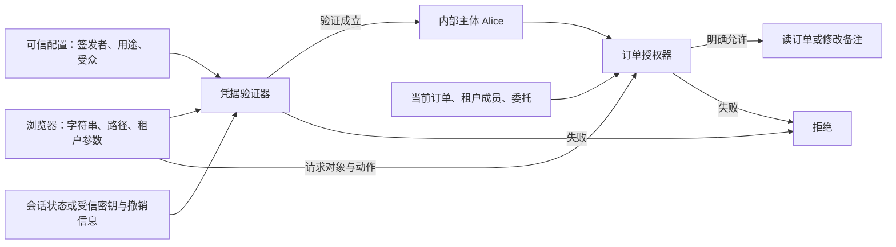
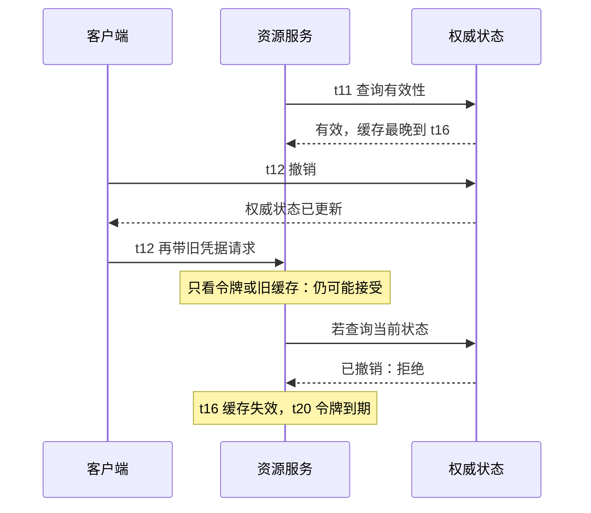

# 身份从哪里可信：会话、令牌与撤销边界

Alice 打开订单页面。浏览器带着一个字符串请求 `/orders/o1`，服务端应该回答三件不同的事：

1. 这个字符串能否作为本服务接受的身份凭据？
2. 它现在还有效吗，还是已经过期、被撤销或失去使用条件？
3. 确定是 Alice 后，她此刻能读订单 `o1` 吗？

“能解出用户名”“签名正确”“登录成功过”都没有独自回答完这些问题。尤其是用户点击退出以后，浏览器忘掉凭据和服务器拒绝旧凭据，是两个状态变化。

本文把请求放在这些边界上走一遍。用户名、订单和时间均为虚构教学输入；下载实验只研究**验证之后的决策**，没有账号、密钥、登录接口或真实身份供应商。

## 1. 可信的是哪一条判断 {#trust-boundaries}

**主体**（subject）是系统认定正在代表的身份。**凭据**（credential）是请求拿来支持身份判断的材料。**认证**（authentication）建立身份判断；**授权**（authorization）决定该身份对具体资源能做什么。已经有会话的请求通常不再重新输入密码，而是验证承接此前认证结果的会话凭据。

对 bearer 凭据，服务看到的是持有者拿出了可接受的凭据，不等于它又核实了键盘前坐着原来的那个人。泄露的 bearer 凭据可能被别人使用，因此传输、存储与日志暴露同样属于威胁面。[RFC 6750 §1.2：Bearer Token](https://www.rfc-editor.org/rfc/rfc6750.html#section-1.2)



文字版：请求中的 `user=alice` 只是声明。凭据验证层先把外来材料转成受信的内部身份；授权层仍要读取当前业务事实。两者都不能因为“上游应该已经检查过”就省掉自己的责任。

网关转发 `X-User-Id: alice` 也不会天然可信。如果资源服务还能被外部直接访问，或者网关保留了客户端同名头，攻击者就可能进入内部身份通道。架构上应明确谁能创建该头、谁必须清除外来同名值、服务之间如何认证，以及旁路入口是否受同样控制。这是从信任边界推导出的部署问题，本实验未搭建网关来验证它。

## 2. 不透明会话：字符串指向服务器里的状态 {#opaque-session}

一种设计是给浏览器一个难以预测的不透明会话标识。标识自身不携带“管理员”“Alice”等业务意义，服务器用它找到会话记录，再得到主体与有效期。客户端可以保存和重发标识，但不能靠修改它来修改服务器记录。[OWASP Session Management：Session ID Content](https://cheatsheetseries.owasp.org/cheatsheets/Session_Management_Cheat_Sheet.html#session-id-content-or-value)

设会话库有这条概念记录：

| 记录字段 | 教学值 | 此字段由谁解释 |
| --- | --- | --- |
| 内部主体 | Alice | 服务端身份映射 |
| 到期时刻 | 20 | 每次验证会话的服务 |
| 撤销状态 | 否 | 会话状态管理方 |
| 浏览器保存的引用 | 一个不透明值 | 会话查找与凭据验证层 |

时刻 12 退出时，服务器将记录撤销。如果下一次请求查询的就是最新权威状态，它会被拒绝。若应用节点缓存了“此会话有效”，实际拒绝时间取决于缓存与失效传播；“有服务端状态”不等于“所有节点立即看到更新”。

会话还有两个常见的生命周期问题。第一，登录或权限提升后应更新会话标识，避免把攻击者预先知道的标识继续绑定给用户。第二，退出需要让服务端旧会话失效，只删除浏览器 Cookie 不够。框架提供的会话管理通常比自行设计随机数与传输细节更合适，但仍要检查配置与失效路径。[OWASP：会话标识更新](https://cheatsheetseries.owasp.org/cheatsheets/Session_Management_Cheat_Sheet.html#renew-the-session-id-after-any-privilege-level-change) · [服务端会话过期](https://cheatsheetseries.owasp.org/cheatsheets/Session_Management_Cheat_Sheet.html#session-expiration)

Cookie 是传输方式，不是会话设计本身：Cookie 可以装不透明引用，也可以装自包含令牌。使用 Cookie 时，`Secure`、`HttpOnly` 和合适的 `SameSite` 分别限制传输、脚本读取和跨站携带；它们不替代服务端身份与权限验证，也不能单独解决所有 CSRF/XSS 问题。[OWASP：Cookies](https://cheatsheetseries.owasp.org/cheatsheets/Session_Management_Cheat_Sheet.html#cookies)

## 3. 自包含令牌：签名保护一个声明快照 {#self-contained-token}

另一种设计让令牌携带主体、签发者、受众与有效期。资源服务依据受信配置验证令牌，可能不必为每次请求访问签发服务。这降低了在线耦合，却把“现在能知道什么”变成关键问题。

以采用签名 JWT 的某个 API 配置为例，接收层至少要按所采用的协议和令牌配置文件明确以下问题。它们不是一段 `decode()` 的返回值能代替的：

| 检查 | 改变一个输入会发生什么 |
| --- | --- |
| 允许的算法与受信密钥 | 令牌自报 `alg` 或密钥位置不能扩大接收方的信任；验签需与配置相符 |
| 签发者 `iss` 与主体 `sub` | 同样写着 `alice` 的另一签发者，不自动对应本系统的 Alice |
| 受众 `aud` | 给报告服务的令牌，不能因为签名正确就拿来访问订单服务 |
| 令牌用途与配置文件 | 用于证明登录事件的材料，不能随便当订单 API 的访问凭据 |
| 时间及必需字段 | 缺字段、过早或已过期必须按所采用配置拒绝，不能用便利默认值掩盖缺失 |

接收方约束算法、核对密钥与签发者关系、验证受众、区分 JWT 用途，是 [RFC 8725 §§3.1、3.8–3.12](https://www.rfc-editor.org/rfc/rfc8725.html#section-3) 的核心建议。不要按令牌里的任意 URL 动态抓取“验证它的密钥”；这会把不可信输入带入网络与密钥信任选择。

JWT 基础规范中一些声明是可选的，具体 API 配置可以要求它们必填。本文模型**自行约定**必须有 `issuer`、`subject`、`audience`、用途和时间边界，不把这个教学配置说成所有 JWT 的统一字段要求。采用零时钟宽限时，`nbf <= now < exp` 才满足时间条件；在 `now == exp` 已经到期。实际系统若配置小幅时钟宽限，应把它计入过期与撤销窗口，而不是无限延长。[RFC 7519 §§4.1.4–4.1.5](https://www.rfc-editor.org/rfc/rfc7519.html#section-4.1.4)

签名的职责是保护声明来源与完整性，并不让声明自动保持最新。令牌里写“属于 red 租户”，最多说明签发时作出过这个声明；是否接受这一快照作为当前成员资格，需要业务明确新鲜度规则。后文的订单策略选择查询当前成员关系。

### ID Token 为什么不能只换个名字就使用

OpenID Connect 的 ID Token 向客户端描述一次用户认证及相关声明，受众包含相应客户端 ID；访问资源使用的 access token 有自己的接收与验证规则。资源 API 应只接受为它定义的访问凭据，不能看到“也是 JWT”就混用。[OpenID Connect Core 1.0 errata 2 §2](https://openid.net/specs/openid-connect-core-1_0.html#IDToken)

这里只用这一区分解释令牌用途边界。授权码、PKCE、重定向 URI、nonce、刷新令牌轮换和完整 OIDC 校验流程需要独立研究；本页没有将它们压缩成一套可上线的登录实现。

## 4. 退出以后，谁能看到撤销 {#revocation-visibility}

固定一个例子：令牌在时刻 10 生效，20 到期；时刻 12 用户退出。资源服务有三种不同的信息来源：

- 只读令牌快照：它看见的签名、字段和到期时刻都没有改变，因此在 12 仍可能接受
- 每次访问权威状态：它读到已撤销，因此在 12 拒绝
- 11 时缓存了“有效”，缓存到 16：它在 12 仍可能依据旧结果接受，到 16 必须重新求证或拒绝



文字版：撤销不是修改已经发出去的字符串，而是改变后续接受它的依据。资源服务只有拿到新状态，或等到自身认可的有效期结束，才会改变判断。

RFC 7009 说明自包含与引用型令牌在撤销设计上的区别；希望即时影响资源服务，就需要相应状态或通信机制，短有效期则限制残留使用窗口。[RFC 7009 §3](https://www.rfc-editor.org/rfc/rfc7009.html#section-3) 使用 introspection 获取 `active` 等信息时，缓存会延迟对撤销的观察；若响应含 `exp`，缓存不能越过该时间。[RFC 7662 §4](https://www.rfc-editor.org/rfc/rfc7662.html#section-4)

因此不能把“退出成功”“刷新令牌已撤销”“某个 access token 被资源服务拒绝”“所有设备都退出”写成同一个结果。它们对应不同对象、状态与传播范围。撤销签名密钥通常会影响一批令牌，并要求接收方更新密钥状态，不能当作廉价的单用户退出按钮。

### 跟着模型走一次

下面是下载包 `walk_session.py` 的完整教学调用代码；导入的 `model.py` 也包含在包内。`VerifiedClaims` 是人为构造的**已通过可信密码学验证后的夹具**，不是运行时可信性的保证。这里没有 base64 解码、验签、会话标识生成或真实 introspection 请求。

<!-- snippet: security.session-walk -->
```python steps
# !step(5:8) 固定令牌从 10 到 20 有效；11 时读到的有效状态只缓存至 16。这些输入已经过受信适配层，模型不验证密码学。
# !step(10:11) 在 12 之前撤销会话及令牌记录。令牌快照保持原样，因为外部状态更新不能改写已发出的内容。
# !step(12:15) 同一个 t12 输入分别查询当前会话、离线快照、当前撤销集与旧缓存，返回的真假对应四种可见范围。
# !step(16:17) 到 16 旧缓存不能继续使用；到 20 即使没有新的撤销信息，快照也因到期而拒绝。
from dataclasses import replace
from model import (ActiveCache, SessionRecord, VerifiedClaims, cache_accepts,
                   online_accepts, session_accepts, snapshot_accepts)

claims = VerifiedClaims("issuer-A", "alice", frozenset({"orders-api"}),
                        "access", 10, 20, "fixture-t1")
session = SessionRecord("alice", 20)
cache = ActiveCache(True, 11, min(11 + 5, claims.expires))

session = replace(session, revoked=True)
revoked = {claims.token_id}
print("t12 session:", session_accepts(session, 12))
print("t12 offline:", snapshot_accepts(claims, 12))
print("t12 online:", online_accepts(claims, 12, revoked))
print("t12 cached:", cache_accepts(claims, cache, 12))
print("t16 cached:", cache_accepts(claims, cache, 16))
print("t20 offline:", snapshot_accepts(claims, 20))
```

返回依次是 `False, True, False, True, False, False`。这里的时间是显式整数输入，没有睡眠、真实服务器或网络延迟，因此它证明的是给定信息下的模型判断，不是某个身份供应商的撤销时效。

## 5. 选择什么状态，承担什么代价 {#alternatives}

| 设计 | 适合优先考虑的条件 | 必须承担的代价或限制 |
| --- | --- | --- |
| 不透明服务端会话 | 一个受控应用，需要集中结束会话 | 会话存储的可用性、容量和多节点一致性；缓存仍有失效问题 |
| 短期自包含访问令牌 | 多个资源服务需要本地验证，容许明确的短暂陈旧窗口 | 密钥分发、配置一致性、到期续期；单凭快照无法知晓提前撤销 |
| 令牌加在线状态检查 | 撤销必须尽快影响高风险操作 | 在线依赖与延迟，缓存策略，状态查询失败时的拒绝或降级规则 |
| 按操作混合 | 普通读取可容忍短缓存，关键修改要求更近的状态 | 同一身份在不同操作下有不同新鲜度要求，必须能解释与测试 |

这不是“JWT 比 session 高级”的排序。若关键约束是“管理员移除成员后不能再修改订单”，先确定允许的陈旧窗口以及写入时检查什么，再选择凭据形式。即使选择纯本地令牌验证，也仍可让资源授权查询当前业务权限。

## 6. 练习：改变一个条件 {#exercises}

**问题一：令牌签名通过，`aud` 是 `reports-api`；订单服务也信任同一个签发者，能放行吗？**

参考推理：不能只因为签发者相同就放行。相同签发者可面向多个接收方；本订单配置需要 `orders-api` 在受众集合中。下载模型对错误受众、错误签发者、空主体及错误用途分别断言拒绝，但没有实测任何 JWT 库。

**问题二：把缓存从 5 个时间单位改成 30，令牌仍在 20 到期，能一直接受到 41 吗？**

参考推理：不能。缓存自身窗口与令牌有效期是两个上界；本例最晚到 20，且在 20 已拒绝。测试还故意传入一个到 50 的错误缓存边界，检查外层令牌有效期仍会阻止使用。

**问题三：会话库短暂不可用，要为了可用性直接相信客户端的 `userId` 吗？**

参考推理：这会把请求字段提升为身份证明。应根据已定义策略拒绝或使用明确受限、仍可验证的有效缓存；如果采用缓存，必须承认它保留了旧权限窗口。不能把访问失败时的“临时放行”藏在异常处理默认分支里。

**问题四：用户仍有一个未过期令牌，但 red 租户刚移除了她，谁来阻止读订单？**

参考推理：身份仍可能是 Alice，但订单权限不再成立。把当前成员关系放进[订单对象授权](../authorization/object-tenant-authorization.md)的输入，检查主体、租户、对象与动作；不要把“认证成功”缓存成“所有请求允许”。

<details class="verification-appendix">
<summary>验证范围、下载与复跑</summary>

r2 补充了六项验证器回归：空委托动作、在线声明配置、缓存 inactive/未来观察时刻，以及同主体的陈旧准备与重复提交。原模型在这些输入下拒绝正确，但 r1 的断言没有抓住相应源码破坏；现在会核对拒绝正文、保留的新备注、修订号和事件数量，并逐项运行真实源变异。该修订加强有限模型的检查，不新增真实身份供应商或数据库证据。

[下载源码与脱敏记录](/examples/security-boundaries-lab.zip)。在解压后的 `security-boundaries-lab/` 中执行：

```sh
python3 -B walk_session.py
python3 -B verify.py
python3 -B verify_mutants.py
```

运行环境为 Python 3.12.14，仅标准库，无依赖安装。`records/` 保存固定输入下的可复查结果。`verify.py` 同时检查时间边界、令牌配置、撤销信息的可见范围以及下一篇的业务权限矩阵；`verify_mutants.py` 要求错误授权变体在指定业务断言失败，不能把崩溃当成安全验证成功。

规范与指南的网页核对单独记录为 `source-reviewed`；有限 Python 决策单独记录为 `executed`。未运行 TLS、浏览器 Cookie/CSRF、防重放协议、签名库、密钥轮换、真实会话存储、IdP、OAuth/OIDC 流程或多节点撤销传播。因此没有“完整认证系统已测试”的结论。

</details>
