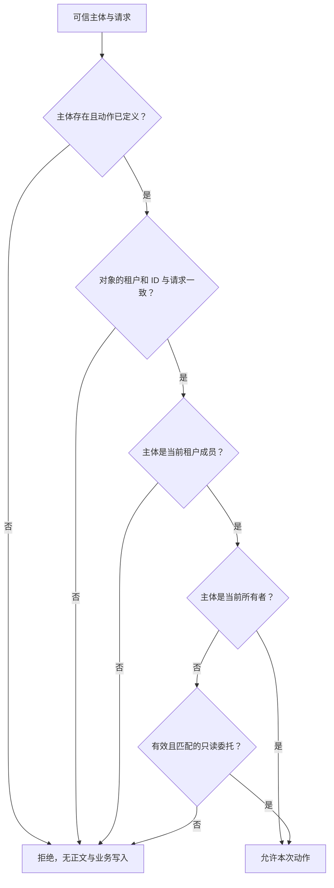
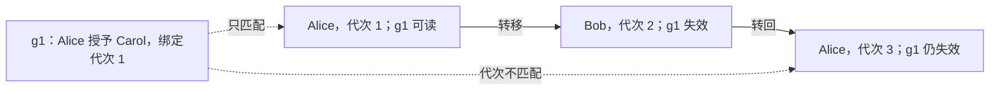

# 授权到哪一个对象：租户、主体与动作

Bob 能打开“订单详情”这个接口，不代表他能打开接口里每一个订单。假设请求是 `/tenants/red/orders/o1`，服务端已经可信地确定当前主体是 Bob：还缺少哪一条事实，才能返回正文？

本例 `red/o1` 属于 Alice，`red/o2` 属于 Bob，`blue/o1` 属于 Mallory。Bob 是 red 的成员。于是“已登录”和“属于 red”都是真的，但 **Bob 读取 red/o1 仍被拒绝**。接口权限、租户成员关系和具体对象权限分别回答不同问题。

OWASP API1:2023 将这种对具体对象缺少检查的问题称为 Broken Object Level Authorization（BOLA）。对象 ID 即使用 UUID，也仍需逐对象检查；难以猜测只是降低发现概率，并没有给发现它的人访问权。[OWASP API1:2023](https://api-security.owasp.org/editions/2023/en/0xa1-broken-object-level-authorization/)

## 1. 先写出本例的允许条件 {#business-policy}

**租户**（tenant）是应用划定的业务隔离范围，例如一家公司。用户可以属于多个租户，但每次请求必须明确目标范围。这里不是说租户一定对应独立数据库，而是在定义“哪些业务数据和成员关系一起被解释”。

本页采用一个刻意有限的订单策略：

- 当前租户成员且是当前订单所有者，可以读订单、修改备注
- 所有者可以给同租户成员一项指定订单的只读委托，委托有截止时间并可撤销
- 委托不能修改备注、不能转授；所有者变更后旧委托失效
- 没有身份、未知动作、对象不存在或任一条件不成立，一律拒绝

这些是**本例业务选择**，不是 OWASP 规定的电商通用规则。真实业务若要求客服操作、审批者、法务留存或跨组织协作，应分别定义新允许条件，不能把现有判断最后的 `False` 改成 `True`。

| 可信主体 | 目标 | 动作 | 当前业务事实 | 决策 |
| --- | --- | --- | --- | --- |
| Alice | red/o1 | 读、改备注 | red 成员，当前所有者 | 允许 |
| Bob | red/o1 | 读、改备注 | red 成员，拥有另一张订单 o2 | 拒绝 |
| Carol | red/o1 | 读 | 有 Alice 授予且仍有效的只读委托 | 允许 |
| Carol | red/o1 | 改备注 | 仍只有只读委托 | 拒绝 |
| Mallory | red/o1 | 读 | 只属于 blue，自己在 blue 也有 o1 | 拒绝 |
| 缺失身份 | 任意订单 | 任意动作 | 无可信主体 | 拒绝 |
| Alice | red/o1 | 删除 | 本模型未定义删除权限 | 拒绝 |

这张表比“有 user 角色即可调用订单接口”多了对象与动作两个维度。默认拒绝的意义是：只有能指出具体成立规则的请求才被允许。OWASP 建议默认拒绝并检查每次请求；本例将建议落实成上述可反驳的业务表。[OWASP：Deny by Default](https://cheatsheetseries.owasp.org/cheatsheets/Authorization_Cheat_Sheet.html#deny-by-default) · [Validate the Permissions on Every Request](https://cheatsheetseries.owasp.org/cheatsheets/Authorization_Cheat_Sheet.html#validate-the-permissions-on-every-request)

## 2. 哪些输入能相信，哪些只是选择器 {#four-dimensions}

把授权看成一个依赖当前事实的函数：

`decision = policy(主体, 租户, 当前对象, 动作, 成员关系, 委托, 时间)`

函数签名里的每个值都要有来源。否则多几个参数只是把不可信信息包装得更正式。

| 输入 | 本例的可信来源 | 不能替代它的东西 |
| --- | --- | --- |
| 主体 | 身份验证适配层映射出的内部 actor ID | 请求正文里的 `userId`、任意上游头 |
| 目标租户 | 请求选择一个范围，再与服务端成员关系及对象事实核对 | “客户端说是 red”本身 |
| 当前对象 | 按租户和对象键读取的服务端订单记录 | 客户端同时提交的 `owner=alice` |
| 动作 | 服务端把具体处理器映射为 `read` 或 `update-note` | 客户端任意提供的“权限名” |
| 成员、委托、时间 | 服务端当前状态及服务端时钟 | 老页面里的权限按钮、客户端时间 |

租户 claim 即使受签名保护，也还要回答：谁有权签发它、它表示成员资格还是当前选择、允许陈旧多久。本例把请求租户只当选择器，把成员关系存放在服务端当前状态。它既允许成员合法切换租户，也不会让非成员通过改参数加入租户。



文字版：前半段保证请求在正确的身份、动作和对象范围内，后半段寻找具体允许理由。成为成员只是进入后半段的条件，不是所有订单的通行证。

本模型故意同时保存 `red/o1` 与 `blue/o1`。如果数据层只按 `o1` 查找，就可能取错对象。模型除了按复合键查找，还在策略入口核对实际读到的对象与请求是否匹配，用来拒绝错误装载。生产系统可将租户过滤下推到查询和数据库策略，但仍需确认列表、单项、导出、附件和后台任务走的是同一套边界。

## 3. 委托保留“谁在操作”和“替谁操作” {#delegation}

Alice 委托 Carol 读 red/o1，并不意味着 Carol 的身份变成 Alice。审计至少要能回答当前操作者是谁、允许来自哪个委托、涉及哪个租户和对象。RFC 8693 的 `act` 声明也是为了表达当前 actor 与主体之间的委托语义；它没有替应用定义所有业务权限。[RFC 8693 §4.1](https://www.rfc-editor.org/rfc/rfc8693.html#section-4.1)

本模型的委托记录包含：`grantor`、`delegate`、`tenant`、`order_id`、动作集合、到期时刻、撤销状态、`ownership_epoch`。检查时还要求授予者仍是当前所有者、双方仍是租户成员。把这些条件连起来，才得到“Carol 此刻能读这一张订单”。

为什么还需要 `ownership_epoch`，只比较授予者和当前 owner 不够吗？考虑下面三步：

1. Alice 拥有订单，代次为 1；她给 Carol 委托 g1，记录代次 1
2. 订单转给 Bob，代次变成 2；g1 不再有效
3. 订单又转回 Alice，代次变成 3；Alice 的名字重新相同，但 g1 仍属于旧的授权背景

如果业务选择“所有权每次变更都终止旧委托”，代次能阻止 g1 在第三步意外复活。这是本例明确的业务语义。另一个合理设计是迁移时撤销全部旧委托；如果希望某些委托跨所有者保留，就必须单独设计授予者权力与迁移规则。



文字版：权限取决于当前关系及它的历史分界，不能只比较两个时刻恰好相同的用户名。本实验只支持一跳只读委托，不支持委托链、管理员绕过或 token exchange 协议。

## 4. 检查通过后，对象还可能变化 {#check-and-use}

Alice 在时刻 10 获准改备注；真正写入之前，订单转给 Bob。若写入层只接受一个缓存的 `allowed=True`，就会让旧所有者改新所有者的订单。

本模型将修改分成准备和提交，便于显式安排变化：准备记录主体、请求与对象修订号；提交重新读取当前对象，修订号改变就拒绝，并再次核对当前成员关系与策略。拒绝时既没有备注变化，也没有“备注已更新”业务事件。

**修订号不能替代全部重查。** 成员关系可能在对象没改动时撤销，因此只比较订单 revision 仍不够。准备结果也绑定原主体与 `update-note` 动作，不能让 Carol 拿到一次读取允许以后换进修改处理器。

下面是 `walk_authorization.py` 的完整教学调用代码。`TrustedIdentity` 只表示夹具的前置假设；普通 Python 代码当然可以构造这个对象，所以不能让它接收网络输入就宣称“已认证”。

<!-- snippet: security.authorization-walk -->
```python steps
# !step(3:7) Carol 带着自己的可信身份请求读取；服务端 g1 只授权 red/o1 的 read，结果带 delegated-read 理由与正文。
# !step(9:12) Alice 先获准准备改备注，随后可信测试事件把订单转给 Bob；这一步使对象修订号和归属代次同时前进。
# !step(13:14) 提交读取当前对象，因修订号不同返回 stale-object，业务副作用列表仍为空。
# !step(16:19) 再分别用 Carol 与 Bob 请求同一订单：旧委托失效，新所有者得到正文，身份没有被替换。
from model import Request, TrustedIdentity, fixture

store = fixture()
carol = TrustedIdentity("carol")
read = Request("red", "o1", "read")
decision, payload = store.read(carol, read, now=10)
print("delegate read:", decision.reason, payload)

alice = TrustedIdentity("alice")
update = Request("red", "o1", "update-note")
prepared = store.prepare_update(alice, update, "new-note", now=10)
store.transfer_fixture("red", "o1", "bob")
result = store.commit_update(alice, prepared, now=11)
print("old approval:", result.reason, store.effects)

decision, payload = store.read(carol, read, now=11)
print("old grant:", decision.reason, payload)
decision, payload = store.read(TrustedIdentity("bob"), read, now=11)
print("new owner:", decision.reason, payload)
```

可观察结果是：Carol 初始读到 `original`；旧修改返回 `stale-object` 且副作用为 `[]`；Carol 后续得到 `no-object-permission` 和空正文；Bob 读到仍未修改的 `original`。

模型假定“提交中的重查与实际写入”是不可分割的一步，**没有实现数据库事务或锁**。接到真实存储时，要保证权限相关状态的读取与写入受到适当的锁、条件写入或其他一致性方案保护，并对授权状态横跨不同存储的情况重新分析。在一个事务里执行几条语句，不自动说明它们排除了中间的并发变化。可以结合已有的[库存不变量](../../data/transactions/inventory-invariants.md)思考最终业务状态如何被保护，但本页的运行结果不能证明某数据库隔离级别足够。

## 5. 用错误允许来检验策略 {#negative-tests}

下载包先使用一份独立写出的允许集合做判定：五种主体状态、两个租户、三个对象选择和三种动作一共形成 90 个固定组合。这里只检查这组有限输入，并不声称穷尽所有可能策略。

判断不仅看 `allowed`。读取被拒绝时正文必须为空；写入被拒绝时订单集合与业务副作用列表必须保持不变；允许修改时恰好改目标订单并留下对应事件。随后再单独安排撤销成员关系、归属转移和旧委托复活等状态变化。

为确认测试不是“什么实现都能过”，实验还真正运行故意错误的变体：

| 错误变体 | 专门让它暴露的反例 | 应被哪条事实否定 |
| --- | --- | --- |
| 信任请求里的租户 | Alice 已被移出 red，但仍提交 red | 请求不能恢复成员资格 |
| 成员等于所有者 | Bob 读取 Alice 的 o1 | 同租户不代表同对象权限 |
| 默认允许或允许缺失身份 | 未知删除动作、匿名读取 | 无明确允许理由必须拒绝 |
| 委托扩大动作、忽略接收者 | Carol 改备注；Bob 使用 g1 | 动作与实际操作者必须匹配 |
| 忽略有效期、撤销或代次 | 到期、显式撤销、Alice→Bob→Alice | 旧委托不能继续或再次生效 |
| 忽略实际对象 ID | 请求 o2 却装入 Alice 的 o1 | 实际对象必须等于请求对象 |
| 重用归属转移前的允许 | Alice 获准后，订单已归 Bob | 提交必须面对当前事实 |

错误变体子进程需要以退出码 3 结束，并给出精确的 `WRONG_ALLOW:<变体名>` 断言。父验证器逐一核对退出码、错误归因和无额外错误输出；语法错误、超时、进程崩溃或错误 JSON 都让父验证器失败。这样，拒绝坏实现的证据来自预定业务反例，不能拿“程序没运行起来”冒充安全。

这些测试没有覆盖 SQL 注入、框架过滤器是否漏挂、真正的数据库并发、日志系统、缓存集群或身份验证本身。它们的用途是使**策略允许了什么**成为可审核的输入输出关系，随后真实集成还要检查每个入口是否执行了这项策略。

## 6. 合理的替代方案与边界 {#alternatives}

| 方案 | 能简化什么 | 仍需回答什么 |
| --- | --- | --- |
| 角色规则 RBAC | 粗粒度功能分组，例如允许进入订单管理模块 | 某角色在这个租户、这一订单上是否有权，角色何时失效 |
| 属性与关系规则 | 按成员、所有者、委托、订单状态表达细节 | 属性来源、新鲜度、冲突规则与查询成本 |
| 集中策略服务 | 统一规则和版本，便于多个服务复用 | 当前对象事实如何传入，调用失败或缓存旧决策怎么办 |
| 数据库行级策略或租户过滤 | 对遗漏租户条件增加防线 | 应用动作、委托与业务状态是否也被覆盖，后台连接能否绕过 |
| 每租户独立存储 | 降低部分跨租户误查范围 | 同租户越权、身份路由、运维成本与跨租户协作 |

OWASP 将属性与关系规则作为复杂业务授权的重要选择；这不意味着每个小应用都必须引入独立策略引擎。[OWASP：Attribute and Relationship Based Access Control](https://cheatsheetseries.owasp.org/cheatsheets/Authorization_Cheat_Sheet.html#prefer-attribute-and-relationship-based-access-control-over-rbac)

本例的 `reason` 用于测试解释，不是建议直接返回所有内部细节给客户端。实际接口可以按约定将不存在与不允许统一成不暴露对象存在性的响应，同时在受控审计中保留足够原因。避免泄露不应变成“跳过检查”；统一错误正文也不能修复已经发生的数据读取或写入。

## 7. 练习：先预测，再运行 {#exercises}

**问题一：Alice 同时属于 red 和 blue，能否因为 red/o1 属于她，就读取 blue/o1？**

参考推理：不能。成员关系允许选择租户，但对象所有权按 `(tenant, order_id)` 解释。必须读取 blue/o1 的当前事实并重新判定；不得把 red 的允许跨租户复用。

**问题二：准备修改后没有改订单，只撤销 Alice 的 red 成员资格，比较 revision 能否保护写入？**

参考推理：不能。订单 revision 没变。提交还要检查当前成员关系，模型应返回 `tenant-membership`，订单和业务事件不变。权限变化所依赖的状态若分布在多个服务，需要定义写入所需的一致性条件。

**问题三：Bob 把订单还给 Alice，Carol 说自己原来的 g1 应该自动恢复。应该恢复吗？**

参考推理：依据本例明确的业务规则，不应恢复；代次从 1 变成 3。若产品希望恢复，这是一项新的业务决定，应重新定义委托存续条件及审计，不能静默删掉代次比较。

**问题四：读取接口加了对象授权，导出接口只检查“能登录”，这套策略算完成了吗？**

参考推理：没有。导出同样会读取对象，属于另一条执行入口。需要对每个对象或可证明等价的受限查询进行授权，还要检查批量返回、关联附件与缓存键是否保留相同边界。

<details class="verification-appendix">
<summary>源码、验证命令与尚未验证的范围</summary>

r2 补充了六项验证器回归：空委托动作、在线声明配置、缓存 inactive/未来观察时刻，以及同主体的陈旧准备与重复提交。原模型在这些输入下拒绝正确，但 r1 的断言没有抓住相应源码破坏；现在会核对拒绝正文、保留的新备注、修订号和事件数量，并逐项运行真实源变异。该修订加强有限模型的检查，不新增真实身份供应商或数据库证据。

[下载完整教学模型](/examples/security-boundaries-lab.zip)。模型源代码及 MIT 许可与正文片段绑定，无第三方实现摘录。解压进入 `security-boundaries-lab/`：

```sh
python3 -B walk_authorization.py
python3 -B verify.py
python3 -B verify_mutants.py
```

模型只使用 Python 3.12.14 标准库，输入、时间和状态变化均固定，无网络、数据库、账号或依赖安装。`records/model-results.json` 列出精确允许集合与状态变化结果；`records/mutant-results.json` 保留每个错误变体的实际退出码与失败断言。

官方指南与 RFC 已网页核对，记录为 `source-reviewed`；策略模型与错误变体为 `executed`。真实认证适配层、委托创建/撤销接口的权限、对象迁移接口的权限、持久化审计、HTTP 状态、数据库原子性与多节点缓存均未运行。`transfer_fixture` 是测试直接改变可信状态的事件，不是公开的“任何人可转移订单”接口。

</details>
