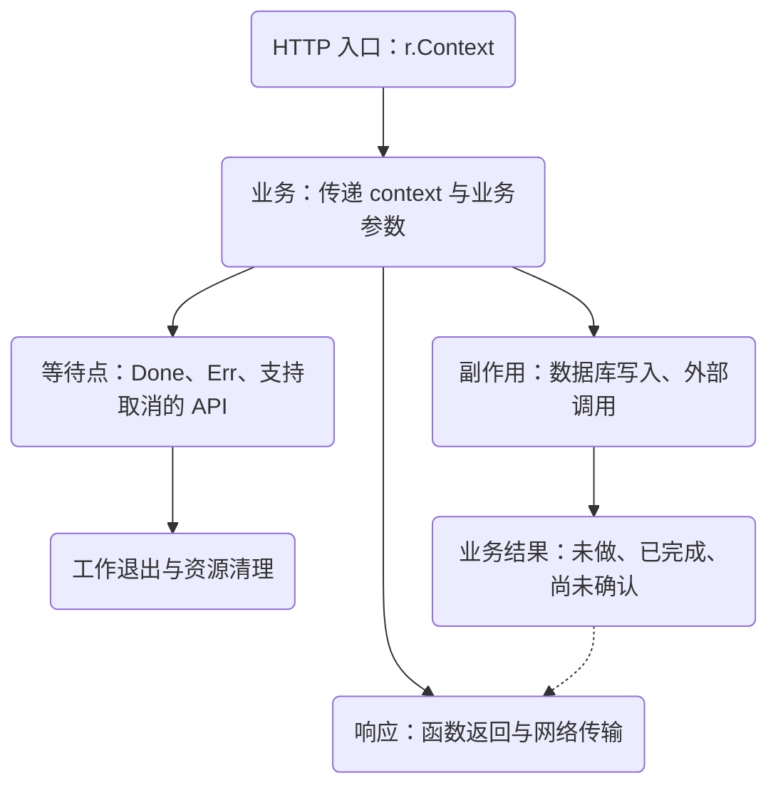
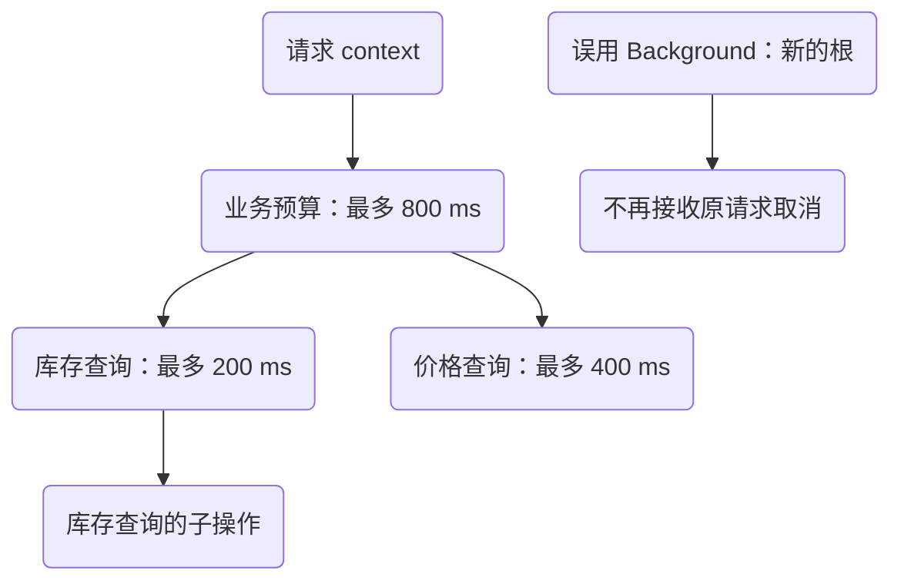
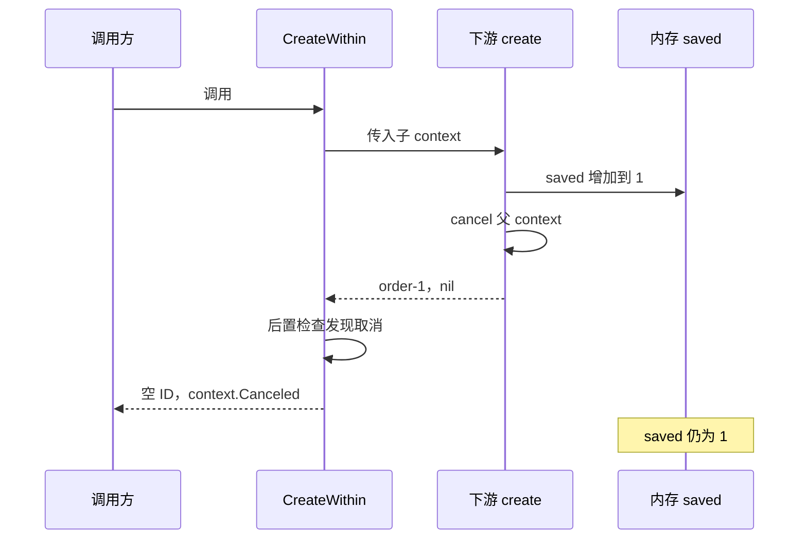
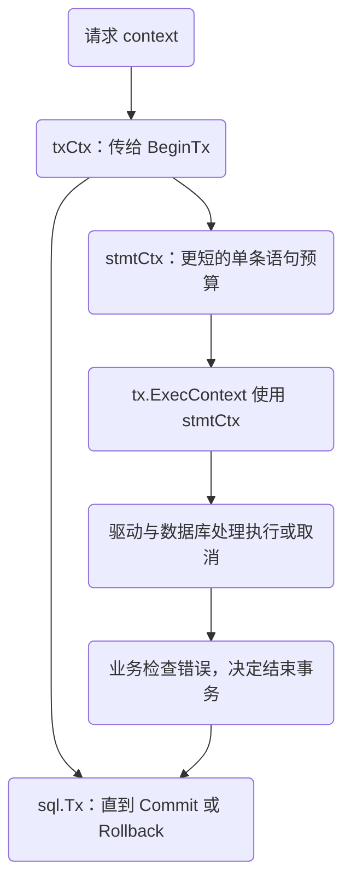
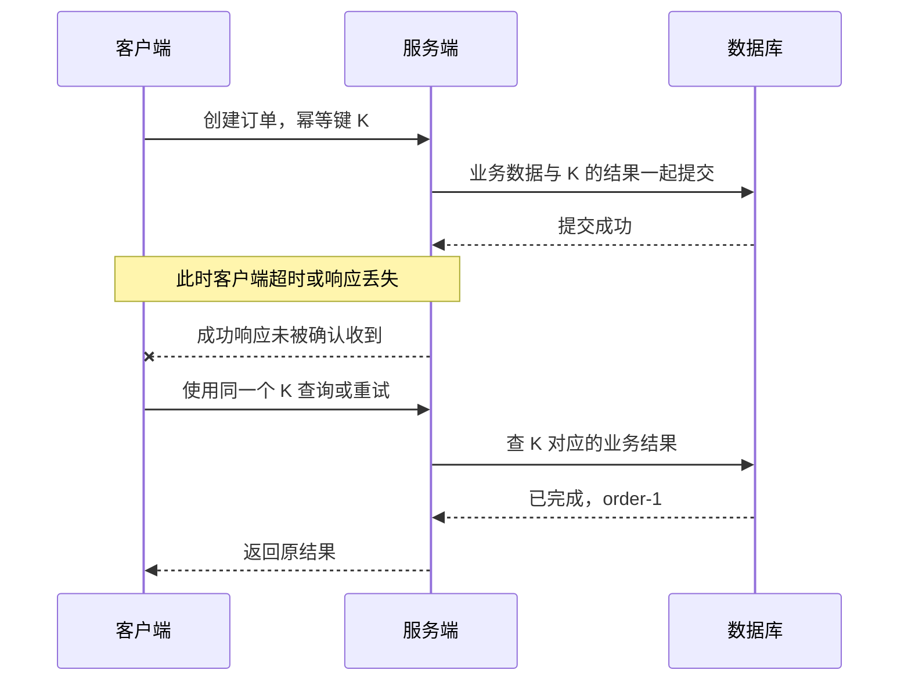

<span id="go-context-取消以后-写入会怎样"></span>

# Go 请求取消：从 context 传播到提交结果

一个创建订单的请求超时了。客户端没有收到成功响应，服务端日志出现 `context deadline exceeded`，订单却可能已经写入数据库。三条记录并不矛盾：它们观察的是不同层面，也可能发生在不同时间。

理解这类问题，要沿三条线分别追踪：**请求还能等多久，工作是否真正结束，业务结果有没有确定。** 本章先用纯标准库实验把时序固定下来，再走到 HTTP 与数据库的边界。

## 阅读准备与学习目标

本章属于“Go 服务生命周期”学习路径。前一章 [HTTP 请求与响应合同](/learn/go-service-lifecycle/http-request-contract.html) 确定了入口与响应的责任，这一章接着追踪请求失去等待能力以后，工作与数据会怎样。需要知道函数返回、`error`、`defer`、channel 收发和 goroutine；数据库部分只要求理解提交与回滚，不要求熟悉具体驱动。

读完应能完成四件事：画出父子 context 的传播方向；判断一次取消是否真的让工作退出；解释错误返回与已完成写入如何同时出现；给提交结果未知的请求设计查询和重试路径。

实验固定 **Go 1.27.1**，只用标准库。内存计数用于观察副作用，不模拟数据库事务。`database/sql` 部分核对该版本 API 与源码；驱动能否中断 SQL、数据库如何处理取消，需要另做目标环境集成测试。

<span id="cancel-发出了信号-工作什么时候停"></span>

## 1. 先把取消、工作和数据分开

`Context` 携带 deadline、取消信号与请求范围的值。传入一个 context，并不会替函数创建线程，也不会替它添加退出代码。



`cancel()` 的职责是发出取消信号。函数需要检查 `ctx.Err()`，或在阻塞点等待 `ctx.Done()`，才能合作退出。它若正在执行一个不检查 context 的函数，仍会继续；`cancel()` 也不会等待它结束。[CancelFunc 文档](https://pkg.go.dev/context@go1.27.1#CancelFunc)明确区分了这两个动作。

这意味着“日志里已经打印取消”只能证明信号发生过。要证明资源已经释放，还要观察连接归还、循环返回、goroutine 清理等对应事件。

<span id="测试里至少安排这三种时序"></span>

## 2. 跑实验：不要只断言一个 error

[下载完整实验项目](/examples/go-context-cancellation.zip)，解压后在项目目录运行：

```sh
go version
go run ./cmd/demo
go test -count=1 -v ./...
go test -race -count=1 ./...
go vet ./...
```

项目包含 16 个顶层测试和 3 个带输出断言的例子；上述运行、测试、竞态检测与静态检查已在 Go 1.27.1 下通过。没有第三方依赖、数据库或网络服务；`-race` 需要所在平台支持竞态检测和相应的 C 工具链。主要结果如下，详细对应关系见压缩包 README。

| 安排的时序 | 调用方结果 | 要同时检查的事实 |
| --- | --- | --- |
| 调用前父 context 已取消 | `context.Canceled` | 下游调用次数为 0 |
| 下游已经进入等待，再取消父 context | `context.Canceled` | 下游退出信号已收到 |
| 下游改了内存，再取消并返回成功 | 包装函数返回取消 | `saved` 仍为 1 |
| 包装函数成功返回后再取消 | 之前返回的成功不变 | `saved` 仍为 1 |
| 子预算 5 秒到期 | `DeadlineExceeded` | 虚拟时间经过 5 秒 |
| 父预算 2 秒、子预算 1 小时 | 2 秒时到期 | 子预算没有延长父预算 |
| 下游另用 `Background` | 下游未被父取消 | 父 deadline、值也不再继承 |
| 无人接收 channel 时取消生产者 | 生产者退出 | 输出 channel 关闭，清理信号到达 |

测试用 channel 确认“已经进入”与“已经退出”，不靠 `Sleep` 猜时序。deadline 场景使用 [`testing/synctest`](https://pkg.go.dev/testing/synctest@go1.27.1) 的虚拟时间：所有相关 goroutine 都进入可确定的阻塞后，时钟推进到下一次唤醒。这里的 5 秒不需要等待 5 秒墙钟时间；网络 I/O、数据库进程不属于这个实验环境。

## 3. 取消沿树向下走，预算不会被下游延长 {#cancellation-tree}

从 `r.Context()` 派生业务 context，再派生查询、外部请求等子 context，得到一棵生命周期树。



父节点取消会传播到后代；取消库存子节点，不会反过来取消业务节点或价格查询。`WithTimeout(parent, d)` 从调用时刻计算自己的期限，再受父期限约束。父节点只剩 100 ms，下游给自己 1 秒也不能多拿 900 ms。

预算从哪一行开始同样重要。若先读取并解析请求体，再调用 `WithTimeout`，前面的耗时没有计入新预算；如果每层都重新从 `Background()` 计时，各层预算就可能与原请求脱节。

### 从源码看信号如何到达

Go 1.27.1 的 `cancelCtx.propagateCancel` 先检查父节点是否已取消；对于标准取消节点，会把子节点登记到父节点的集合中。取消时保存错误及原因、关闭 `Done`，再传播到子节点。定时取消由 `timerCtx` 接入；调用方主动 `cancel` 会清理关联及计时器。自定义 context 还可能经 `AfterFunc` 或辅助 goroutine 传播，因此不能把“每个 context 都创建一个 goroutine”当作实现模型。源码入口见 [context.go](https://github.com/golang/go/blob/go1.27.1/src/context/context.go)。

`defer cancel()` 应在成功和失败路径都执行。操作提前完成也需要释放子 context 相关资源；取消子节点不会取消父节点。这个 `defer` 还带来一个调试细节：函数成功返回以后，保存下来的子 context 也可能已经是取消状态，不能拿它反推刚才的操作失败。

### Err 与 Cause 分别回答什么

`Err()` 用稳定的类别告诉调用方是取消还是到期；`Cause()` 可以保留更具体的原因。下面例子在项目的 `example_test.go` 中有输出断言：

```go steps
// !step(2:4) 创建带原因的取消函数：defer 保证所有返回路径都清理；nil 不会覆盖已记录的原因。
// !step(5:5) 首次取消确定原因：后续 cancel 调用不能改写它。
// !step(6:7) 分别观察类别与原因：Err 是 context canceled，Cause 是 caller stopped waiting。
func Example_withCancelCause() {
	cause := errors.New("caller stopped waiting")
	ctx, cancel := context.WithCancelCause(context.Background())
	defer cancel(nil)
	cancel(cause)
	fmt.Println(ctx.Err())
	fmt.Println(context.Cause(ctx))
}
```

对一个子节点，先发生的取消决定它的原因：父节点先取消，子节点继承父原因；子节点先自行取消，后来父取消不会覆盖它。另一个容易混淆的 API 是 `WithTimeoutCause`：自定义原因用于**期限到达**，如果此前还未被父节点或期限取消，主动调用返回的普通 `CancelFunc` 得到的是 `Canceled`，不会自动套用“预算耗尽”的原因。[Cause 与取消函数文档](https://pkg.go.dev/context@go1.27.1#CancelCauseFunc)给出了先后顺序规则。

## 4. 前后检查是一种应用策略，不是提交保证 {#return-policy}

下面是实验里的同步包装函数。它先拒绝已取消的调用，保留下游已有错误；下游返回成功时，再检查一次取消。

```go steps
// !step(4:5) 从父 context 派生预算，并在所有退出路径清理子 context。
// !step(6:8) 前置检查：已知请求失效时，不再启动下游。
// !step(9:12) 同步调用下游：它自己返回前，这个包装函数也不会返回；已有错误保留优先级。
// !step(13:16) 后置策略：下游成功时若已取消，对调用方返回取消；这不会撤销副作用。
func CreateWithin(parent context.Context, budget time.Duration,
	create func(context.Context) (string, error),
) (string, error) {
	ctx, cancel := context.WithTimeout(parent, budget)
	defer cancel()
	if err := ctx.Err(); err != nil {
		return "", err
	}
	id, err := create(ctx)
	if err != nil {
		return "", err
	}
	if err := ctx.Err(); err != nil {
		return "", err
	}
	return id, nil
}
```

前置检查与开始操作之间，后置检查与写响应之间，都有时间间隙。context 可以在任意间隙取消。这段代码没有把检查、写入和响应变成一个原子动作，也没有保证“预算一到函数就返回”。

看完整调用方 `cmd/demo/main.go` 的主体；导入与可运行入口都在下载项目中：

```go steps
// !step(2:4) 创建父 context 与内存计数，固定一个可观察的副作用。
// !step(5:10) 严格安排顺序：先改计数，再取消父 context，最后让下游返回成功。
// !step(11:11) 同时打印调用结果与数据状态：错误和 saved=1 可以共存。
func main() {
	parent, cancel := context.WithCancel(context.Background())
	defer cancel()
	saved := 0
	id, err := contextlab.CreateWithin(parent, time.Minute,
		func(ctx context.Context) (string, error) {
			saved++ // An in-memory side effect, not a database commit.
			cancel()
			return "order-1", nil
		})
	fmt.Printf("id=%q err=%v saved=%d\n", id, err, saved)
}
```

输出为 `id="" err=context canceled saved=1`。这里没有并发，也没有真正的数据库；反例只用来证明取消不会自动恢复已完成的 Go 操作。



因此，这个包装函数适合研究返回策略，不能直接推广成所有写接口的模板。已经明确提交成功时，应用可以选择保留成功结果；尚未确认提交时，应保留“结果未知”的状态与查询入口。无论怎样选，都应记录业务结果，避免为了统一错误分类而抹掉已经确认的事实。

<span id="在-http-入口保留取消链"></span>

## 5. HTTP context 的生命周期到哪里结束

服务端的请求 context 在客户端连接关闭、HTTP/2 请求取消，或 `ServeHTTP` 返回后取消。调用业务时应从 `r.Context()` 往下传；出站 HTTP 请求用 `NewRequestWithContext` 才能把本次调用的取消交给 HTTP 客户端。这个客户端 context 覆盖获取连接、发送请求、读取响应头和响应体。[Request.Context](https://pkg.go.dev/net/http@go1.27.1#Request.Context) 与 [NewRequestWithContext](https://pkg.go.dev/net/http@go1.27.1#NewRequestWithContext)描述了两边的范围。

客户端已经离开时，服务端就算决定返回一个错误，也不保证这个响应能送达。服务端调用了 `Write`、业务函数正常返回、客户端完整收到响应，是三件事。HTTP 客户端的 context 对象也不会自动跨网络变成服务端同一个 context；跨服务预算还需要明确的协议与接收端处理。

如果工作必须在请求结束后继续，需要给它独立的任务归属、结果存储和停止条件。`Background()` 会丢掉父链；`WithoutCancel(parent)` 保留值，但移除父取消与 deadline，`Done()` 为 nil。它们都不会自动持久化任务，进程退出后也没有恢复保证。更可靠的异步业务通常需要先持久记录任务，再由受控 worker 执行。

`http.Server.WriteTimeout` 约束响应写入的 I/O 时间，不会强制终止任意业务函数。另开 goroutine 等结果，也只是改变处理器的等待方式；它返回后，后台代码不能继续使用 `ResponseWriter`。[Server 与 ResponseWriter 文档](https://pkg.go.dev/net/http@go1.27.1#ResponseWriter)是检查这些边界的起点。

<span id="数据库事务有自己的取消约定"></span>

## 6. database/sql：事务 context 与语句 context 要分开 {#transaction-scope}

`DB.BeginTx(ctx, opts)` 的 context 持续覆盖这笔事务，直到提交或回滚。取消时，`database/sql` 会安排回滚仍在进行中的事务；API 也说明取消的事务 context 会使相应提交返回错误。已经成功结束的事务不会被后来取消重新打开。[BeginTx 文档](https://pkg.go.dev/database/sql@go1.27.1#DB.BeginTx)



这里有一个重要反例：`BeginTx(txCtx)` 后，给某条 `ExecContext` 单独传一个更短的 `stmtCtx`。后者取消不会向上取消 `txCtx`，所以不能仅据此认定整笔事务已被标准库回滚。语句失败后，数据库可能把事务标为不可继续，驱动也可能弃用连接；能否继续由具体实现决定。业务通常应立即返回错误并结束事务，不能无条件接着提交。

在 Go 1.27.1 [sql.go](https://github.com/golang/go/blob/go1.27.1/src/database/sql/sql.go) 中，`beginDC` 为事务派生取消 context，`Tx.awaitDone` 等待它后尝试回滚；`Commit` 与 `rollback` 通过状态竞争保证一次结束路径。读到这里要继续看驱动：`driver.Tx.Commit()` 本身没有 context 参数。提交一旦进入驱动，不能假定父取消总能抢先终止它。

因此，三种情况要分别处理：提交前明确因取消拒绝执行；提交成功后才发生请求取消；提交已经发出，但返回途中遇到网络或驱动错误。最后一种可能需要重新查询业务结果，不能把所有 `Commit` 错误统一翻译成“订单一定不存在”。也别固定期待一种取消错误：与自动回滚的先后顺序不同，可能观察到 context 错误或 `sql.ErrTxDone`。

驱动支持程度也是边界的一部分。带 `Context` 的方法把取消要求交给相应路径，不保证所有数据库都能即时中断正在运行的语句。应结合具体驱动版本、数据库版本、锁等待与连接状态测试；本章的内存实验没有覆盖这些行为。

## 7. 超时后的重试，需要一个稳定的业务身份

数据库提交与客户端确认之间隔着响应传输。两边无法通过多加一次 `ctx.Err()` 检查合并为一个动作。



这里的设计推论是：客户端重试应复用稳定的业务键，服务端用持久化唯一约束处理并发竞争。只在写入前“查一下有没有”会有检查与插入之间的竞态；只放内存 map 则无法跨实例或重启保持约束。

同键同参数返回原结果或明确的处理中状态；同键不同参数需要拒绝，通常保存规范化请求摘要以便比较。业务写入与幂等结果应放进合适的同一事务，过期清理也要考虑最迟重试窗口。幂等键不是删除订单的开关，更不意味着任何错误都可以无限重试。

事务外的支付、发信、消息发送不会随本地回滚自动撤销。幂等约束覆盖哪一步、结果未知如何核对、外部副作用如何补偿，都需要分别设计。这里先把边界列清楚，不把一个键包装成跨系统“恰好一次”的保证。完整的持久化状态与并发裁决在 [未知结果下的幂等](/learn/data-consistency/idempotency-unknown-outcomes.html) 中继续展开；读懂本章实验不依赖那一章的实现。

<span id="再套一层-goroutine-能不能准时返回"></span>

## 8. 请求返回后，谁负责 goroutine 收尾 {#worker-lifetime}

常见写法是开一个 goroutine 执行业务，再用 `select` 等结果或取消。选中取消分支，只证明等待方退出。业务 goroutine 可能继续占连接、继续写入，或卡在无人接收的结果 channel 上。容量为 1 的 channel 能避免一次结果发送无人接收时阻塞，不能终止业务本身。

下面的生产者把发送与取消放到同一个 `select`，并提供明确的清理完成信号。完整调用方在 `ExampleCount`：取一个值后 `cancel()`，再接收 `exited`。

```go steps
// !step(2:6) 分开数据与生命周期信号：清理时先关闭 out，再关闭 exited。
// !step(7:13) 阻塞发送也能观察取消；接收与取消同时就绪时，select 不保证取消优先。
// !step(15:16) 调用方负责取消与汇合；只停止读 out 不会自动让生产者结束。
func Count(ctx context.Context) (<-chan int, <-chan struct{}) {
	out := make(chan int)
	exited := make(chan struct{})
	go func() {
		defer close(exited)
		defer close(out)
		for n := 0; ; n++ {
			select {
			case <-ctx.Done():
				return
			case out <- n:
			}
		}
	}()
	return out, exited
}
```

这种退出依赖函数愿意合作；无法取消的外部调用仍可能阻塞。请求返回时必须汇合所有子工作，还是转交有界后台任务，需要按业务选择。前者可能延迟响应，后者需要并发上限、停机等待与结果回收。两边都不能只靠“已经调用 cancel”作为完成证据。

## 9. 排查顺序：从超时日志追到业务结果

先用同一个不含业务隐私的关联 ID 串起入口、下游、提交和响应。记录调用开始时剩余预算、实际耗时、`ctx.Err()` 类别、下游返回与子工作清理完成事件；有事务时，另外记录是否进入提交、提交返回结果。耗时在同一进程内用开始时刻到结束时刻的差值度量，跨服务时间戳只用于辅助排序。

| 当前证据 | 还不能断言什么 | 下一项观察 |
| --- | --- | --- |
| 子调用期限晚于父预算，或父取消后子节点仍有效 | 下游已经“抗住了超时” | 核对派生时的 parent、剩余预算，找 `Background` 或脱离取消的入口 |
| `Done` 已关闭，下游仍没有返回 | goroutine 已停止、连接已归还 | 查看最后一个阻塞点及其取消接口，再找下游返回、清理与汇合事件 |
| 下游返回成功，包装函数返回取消 | 业务没有完成 | 对照后置检查的时序，查业务结果和提交记录，而非只看 HTTP 错误 |
| `Commit` 返回 nil，成功响应未被客户端确认 | 应重新执行写入 | 用原业务标识查询并返回已有结果；检查客户端是否完整读到响应 |
| `Commit` 返回网络错误，或缺少最终记录 | 已回滚，或已成功 | 保留未知状态，按原业务标识做权威查询或恢复核对；查询不可用时不要盲目重做 |

日志字段应有白名单：错误类别、依赖名称和不透明操作标识通常已足够。不要记录令牌、请求正文或原始幂等键；自定义 `Cause` 和驱动错误也可能带参数，应转换为受控原因码，必要详情只进入受限诊断渠道。服务端写响应没有报错，仍不能代替客户端完整接收的证据。

## 10. 设计练习：把未知结果放进接口里

先独立写出预测与时序，再对照下面的参考推理。实验修改请在项目副本中完成；本章已通过的测试结果对应下载的原始实现，不代表练习变体也已经验证。

### 练习一：保留已经确认的成功

把 `CreateWithin` 改成“下游确认成功就保留成功”，分别预测并重跑副作用前后取消的测试。哪条返回策略变了？哪条数据状态没有变？

**参考推理：** 只移除下游成功后的 `ctx.Err()` 检查，保留前置检查、下游错误处理和 `defer cancel()`。`TestSideEffectBeforeCancellation` 应改为断言 `id == "order-1"`、`err == nil`、`saved == 1`；`ExampleCreateWithin` 的输出预期也要对应改变。`TestParentCanceledAfterSuccessfulReturn` 仍保持成功且 `saved == 1`。副作用没有回退，变化发生在包装函数的返回策略。调用前取消仍由 `TestParentCanceledBeforeCall` 拒绝；下游主动返回取消错误时仍应保留它。

**评分：** 正确指出并修改返回结果与例子预期，1 分；保留副作用断言、前置拒绝和清理机制，并说明这些事实没有改变，1 分。

### 练习二：预算从哪里丢掉了

请求总预算为 800 ms，查库存已耗时 650 ms，价格查询配置 400 ms。它实际最多还能等多久？把包装函数中的派生调用改成 `context.WithTimeout(context.Background(), budget)`，哪两个现有测试能暴露问题？

**参考推理：** 在没有其他开销的理想时点最多剩 150 ms，实际还要扣除后续本地处理；400 ms 子预算不能延长父期限。这是等待预算，不保证不合作的函数届时一定返回。上述修改切断父链：`TestEarlierParentDeadlineWins` 会发现子 deadline 与更早的父 deadline 不同；`TestParentCanceledBeforeCall` 会发现父已取消却仍调用下游。`TestBackgroundLosesParent` 本来就在验证错误写法的后果，它继续通过并不能证明修改正确。

**评分：** 得出至多 150 ms 并区分预算与强制停止，1 分；指出准确的变更位置、上述两个测试和各自失败的观察，1 分。

### 练习三：让幂等键有明确的范围

设计订单幂等记录的键、请求摘要、状态与结果字段。两个实例同时收到相同键时，唯一约束冲突之后如何取得原结果？同键不同参数如何处理？

**参考推理：** 先定义键的业务作用域，例如租户、操作类型与客户端键的组合；在持久层建立唯一约束，将规范化请求摘要、操作状态与业务结果关联。相同键与相同参数返回已确定结果，未完成时报告明确状态；相同键与不同参数拒绝。并发冲突的一方需按数据库事务规则结束或重试自己的事务，再读取权威状态，不能从一份滞后副本的“查不到”推断第一次没有执行。说明幂等记录与业务写入的共同提交边界，以及保留期限、清理后重放和恢复方式。内存计数实验没有证明这些持久化能力。

**评分：** 覆盖作用域、同参复用、异参冲突与并发唯一约束，1 分；交代共同提交、查询一致性及记录清理后的保证退化，1 分。进一步的实现和评审可接 [幂等与未知结果章节](/learn/data-consistency/idempotency-unknown-outcomes.html)。

### 练习四：提交错误后的决策树

假设 `Commit` 返回网络错误。写出处理流程：如何查询原业务键、什么时候可重试、查询暂不可用时返回什么。不要默认“错误”等于“没有提交”。

**参考推理：** 先保存操作关联与“结果未知”，用原业务键到权威结果源查询。确认已提交就返回原结果；确认未提交且协议允许重试时，复用同一个键重试；仍在进行、查询失败或证据不完整时，继续保留未知或处理中状态，并提供查询入口或有界恢复流程。若原请求 context 已取消，后续核对需要一个有明确所有者和短预算的新调用，不能无限留在请求 goroutine 里。单次“查不到”也要排除未完成事务和读延迟。外部支付、发信等副作用必须核对各自结果，不能随数据库重试一起无条件重复。

**评分：** 区分已提交、确认未提交与未知三类结果，1 分；给出查询不可用时的保留状态、有界恢复与避免重复副作用的路径，1 分。

四题共 8 分，只评估本章的解释、验证与设计产物。任一题不足 2 分，就回到对应的时序或测试补证据；得分不代表已经通过真实数据库、完整服务或架构能力评审。

下一章 [有界并发与 goroutine 所有权](/learn/go-service-lifecycle/bounded-concurrency-ownership.html) 把这里的取消信号扩展为并发上限、工作汇合与资源收尾。需要回看入口，读 [HTTP 请求与响应合同](/learn/go-service-lifecycle/http-request-contract.html)；跨路径比较可读 [Spring 事务调用链](/learn/spring-service-boundaries/transaction-proxy.html)，或回到 [知识地图](/guide/knowledge-map.html)。

<span id="源码与延伸阅读"></span>

## 源码阅读顺序

- [context.go，go1.27.1](https://github.com/golang/go/blob/go1.27.1/src/context/context.go)：`WithTimeout` → `WithDeadlineCause` → `propagateCancel` → `cancel`
- [request.go，go1.27.1](https://github.com/golang/go/blob/go1.27.1/src/net/http/request.go)：请求 context 的入口与传递
- [sql.go，go1.27.1](https://github.com/golang/go/blob/go1.27.1/src/database/sql/sql.go)：`BeginTx` → `beginDC` → `awaitDone` → `Commit` / `rollback`
- [ctxutil.go，go1.27.1](https://github.com/golang/go/blob/go1.27.1/src/database/sql/ctxutil.go)：标准库如何进入驱动的 context 接口及兼容路径
- [Go 官方事务指南](https://go.dev/doc/database/execute-transactions)：事务中的语句应通过 `Tx` 执行，提交错误时不能把之前的查询与执行结果当成已确认结果
