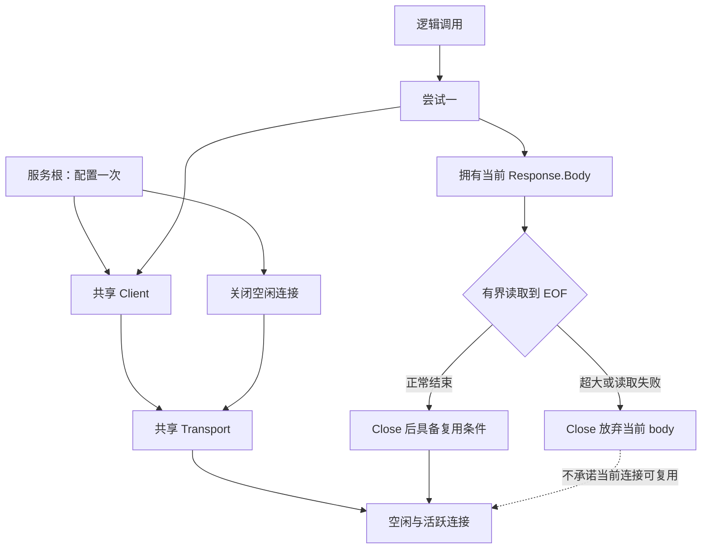
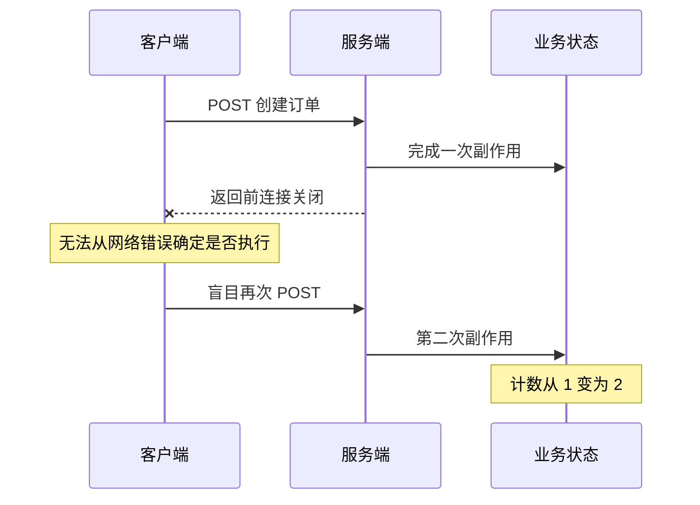

# 下游 HTTP 调用：连接复用、超时预算与有限重试

下游慢了以后，先把 timeout 从一秒改成五秒，再加三次重试，很可能让一次请求占用更久，并把原来的故障放大三倍。另一种更隐蔽的失败是：订单服务已经写入成功，响应在网络上断了；调用方把“没拿到成功响应”解释成“没有执行”，于是再写一次。

本章围绕一个有界的读取客户端展开。它只为受控查询接口提供有限状态码重试；写操作保留结果未知的事实，不能偷渡进同一策略。贯穿全文的三个问题是：**谁归还连接相关资源，总预算从哪里扣，下一次尝试凭什么安全？**

## 先修、范围与运行入口

需要读过 [HTTP 响应合同](/learn/go-service-lifecycle/http-request-contract.html) 和 [context 的取消边界](/learn/go-service-lifecycle/context-cancellation.html)，理解 `io.Reader` 与 `defer`。实验固定 Go 1.27.1，标准库、回环 HTTP/1.1；不把本机的复用观测推广为 TLS、HTTP/2、多代理环境的完整验证。

[下载项目](/examples/go-service-lifecycle.zip)，运行：

```sh
go test -count=1 -v ./outbound
```

`outbound.Getter` 要求调用方给出总 deadline；每次尝试还有自己的期限、最多响应字节数和应用层尝试数。它只重试 502/503/504，不自动重试网络错误、body 截断、过大响应或写请求。这个保守选择是实验合同，不是适合所有服务的万能策略。

## Client 应共享，Body 必须逐次管理

Client 负责较高层的重定向、cookie、总超时等行为；Transport 维护连接与协议状态；每个成功取得的 Response 带来一个必须释放的 Body。共享 Client 但每次创建新 Transport，仍然破坏连接池的连续性；每次创建零值 Client 则可能仍共享默认 Transport，不能仅凭 Client 数量推断物理连接数。



本例通过 `http.DefaultTransport.(*http.Transport).Clone()` 保留默认配置，再设置拨号、TLS handshake、响应头期限和连接数。配置应在共享前完成，不要并发修改已经使用中的 Transport。`MaxIdleConnsPerHost` 限制保留的空闲连接，`MaxConnsPerHost` 才限制拨号、活跃与空闲的总连接数；后者满时等待，并不等价于限制所有 HTTP 请求或 HTTP/2 stream 数。[Transport API](https://pkg.go.dev/net/http@go1.27.1#Transport) 是字段语义的准确依据。

### 关闭不是一张无条件复用保证书

对于实验中的 HTTP/1.1 小响应，读到 EOF 并关闭 Body 后，第二次顺序请求的 `httptrace.GotConnInfo.Reused` 为真。这是实际观察到的连接复用，不是仅凭“我写了 defer Close”猜测。

连接是否能复用还受协议、服务端关闭、响应完整性、取消等条件影响。只调用 Close、尚有响应体未读完时，不能保证 HTTP/1.1 连接仍可回到池。HTTP/2 又有 stream 与连接两层状态，因此不能把这一 HTTP/1.1 实验写成所有协议的绝对规律。[Client.Do](https://pkg.go.dev/net/http@go1.27.1#Client.Do) 与 [httptrace](https://pkg.go.dev/net/http/httptrace@go1.27.1)明确了观测接口和调用方责任。

也不要为了复用写出无上限的 `io.Copy(io.Discard, body)`。错误服务器可能一直发送，或者返回几 GB 错误页。字节上限只限制量，不能防止“每分钟发一个字节”；读取还必须处在可取消、有限时长的请求上下文中。本例读取最多 MaxBody+1 字节，超过就报告错误并关闭；它宁可放弃一条可能的复用连接，也不无限消耗时间和内存。

```go steps
// !step(1:2) 单次预算从逻辑调用派生；defer 在本次读取结束后才取消，不能 Do 返回就提前 cancel。
// !step(3:6) 请求携带尝试 context；只有拿到响应后才持有需要关闭的 Body。
// !step(7:10) 读取上限多一字节用于区分恰好等于上限与确实超出；错误响应也受相同上限约束。
ctx, cancel := context.WithTimeout(parent, g.AttemptTimeout)
defer cancel()
req, err := http.NewRequestWithContext(ctx, http.MethodGet, url, nil)
if err != nil { return nil, err }
response, err := g.Client.Do(req)
if err != nil { return nil, err }
defer response.Body.Close()
data, err := io.ReadAll(io.LimitReader(response.Body, g.MaxBody+1))
if err != nil { return nil, err }
if int64(len(data)) > g.MaxBody { return nil, ErrResponseTooLarge }
```

特别留意 defer 的逆序：Body.Close 先执行，再 cancel。若一个辅助函数返回 Response 给外部读取，却在返回时执行 `defer cancel()`，外部还没读 body，预算就已被撤掉。可选修复是让调用方拥有 cancel，或者像本例一样在内部完整消费响应、只返回有界数据。

## 预算不是几个互不相关的 timeout

连接等待、DNS/拨号、TLS、写请求、等响应头、读响应体都需要时间。一次逻辑调用还包括多次尝试之间的退避。`ResponseHeaderTimeout` 从请求写完以后开始计算，不覆盖后面的 body；`Client.Timeout` 覆盖一次 Client 调用中的连接、重定向和 body 读取，且在 Do 返回后仍可作用于 body。它不会自动覆盖外层循环额外做的三次 Do。[Client.Timeout 文档](https://pkg.go.dev/net/http@go1.27.1#Client)与 [Transport 源码](https://github.com/golang/go/blob/go1.27.1/src/net/http/transport.go)可逐项对照。

```mermaid
gantt
    accTitle: 一次逻辑调用中的预算与退避
    accDescr: 总预算覆盖连接等待、两次尝试及中间退避，单次预算只能缩短不能延长父调用期限；图中的时长是设计示意而非性能测量。
    dateFormat X
    axisFormat %S
    section 总预算示意
    逻辑调用上限 :a, 0, 10s
    section 第一次尝试
    连接等待与拨号 :b, 0, 1s
    请求及响应头 :c, after b, 2s
    有界读取 :d, after c, 1s
    section 重试
    可取消退避 :e, after d, 2s
    第二次尝试剩余预算 :f, after e, 4s
```



图示不是建议统一使用十秒。实际应从上游 SLO 倒推：给本服务解析、排队、下游、编码及网络留出余量。父请求只剩 100ms 时，新建一个 2s 的子 timeout 不会凭空多出 2s；但如果错误地从 Background 派生，就会脱离这个限制。

并发查询也不意味着每个分支都能独占完整资源预算。[有界并发章](/learn/go-service-lifecycle/bounded-concurrency-ownership.html)限制了活跃任务；Transport 还可能让它们等待连接。如果 N=64 而单主机连接上限为 8，额外等待在哪里、算不算总 deadline，必须在 trace 中看清。增大连接池也可能直接把压力转给下游。

## 三次重试，到底是哪一种三次？

本例配置 `Attempts: 3`，表示应用最多调用三次 `Client.Do`，不是“失败以后再重试三次”，后者总共是四次。重定向被显式关闭，避免一次 Do 隐藏一串跨地址请求。

但标准 Transport 自己还可能对特定连接错误作内部重放。固定 Go 1.27.1 的 `persistConn.shouldRetryRequest` 和 `Request.isReplayable` 包含复用连接、未写入、body 可重建与方法/幂等标记等条件。因此**应用层尝试上限不是普遍的 wire-attempt 上限**。实验中的 503 服务会完整返回，每次被测试服务器观察到的请求恰为一次 Do，所以能严格断言该场景三次；遇到连接级故障时，应另外记录传输尝试与服务端操作计数，不能拿这一断言覆盖所有网络分支。

```go steps
// !step(1:4) 每次尝试开始前检查父预算；一次成功立刻返回，不再继续放大流量。
// !step(5:8) 只允许约定的读取失败状态，且最后一次无论如何都不继续。
// !step(9:13) 退避也受父 context 约束，预算耗尽时不启动下一次调用。
for attempt := 1; attempt <= g.Attempts; attempt++ {
    if err := ctx.Err(); err != nil { return nil, err }
    data, err := g.once(ctx, url)
    if err == nil { return data, nil }
    var status *StatusError
    retry := errors.As(err, &status) && (status.Status == 502 || status.Status == 503 || status.Status == 504)
    if !retry || attempt == g.Attempts { return nil, err }

    timer := time.NewTimer(max(0, delay(attempt)))
    select {
    case <-ctx.Done(): timer.Stop(); return nil, ctx.Err()
    case <-timer.C:
    }
}
```

生产默认退避使用带上限的 full jitter；测试注入固定 delay，才能精确验证边界。`TestBudgetIncludesBackoff` 的总预算为一秒，第一份 503 后退避两秒，实际在虚拟一秒处返回，只调用一次下游。它证明的正是“退避算在总预算里”，而不只是尝试循环有个计数器。

不要层层重试。入口、聚合服务和依赖 SDK 如果各做三次，最坏业务请求放大可能达到 27 倍，还没计入代理或传输层行为。重试应集中在知道操作语义的一层，并配套整体重试额度、熔断/过载控制和指标。429 与 `Retry-After` 需要额外预算及服务合同，本例没有擅自把它们加入策略。

## 写入结果未知时，网络错误不是业务回滚



`TestPOSTUnknownResult` 在服务端读完请求后增加副作用计数，再 hijack 并关闭连接。第一次客户端失败时计数已经是 1；测试随后故意再次 POST，计数变为 2。这是负对照，不是建议实现的重试逻辑。它用内存计数证明 HTTP 不确定性，没有声称数据库事务或幂等系统已经完成。

同样不能通过给任意 POST 添加 `Idempotency-Key` 就获得幂等性。这个 header 会影响标准 Transport 对可重放性的判断，但服务端是否原子绑定键、payload、业务写入和历史结果，是另一份合同。`Request.GetBody` 也只说明客户端能重建字节，不证明业务可安全再执行。需要重复写入的设计，见 [未知结果下的幂等](/learn/data-consistency/idempotency-unknown-outcomes.html)；本章终章练习不依赖那份实现即可选择“写失败后不盲重试”。

## 故障定位与八条实际证据

实验分两层：回环 HTTP 验证 503 尝试次数、连接复用、超大响应、body 截断、响应头未发出时取消、POST 未知结果；可控 RoundTripper 配合 synctest 验证单次期限和退避预算。替身计时测试不代表真实 DNS/TLS 时延测试。

若连接增长，先看 Body 是否被消费/关闭，再看 transport 是否反复重建、服务端是否主动关连接。若超时增多，区分连接等待、首字节和 body 阶段，而不是只看一个总耗时直方图。若调用数暴涨，同时记录逻辑调用数、应用尝试数、下游看到的请求数和业务副作用次数；只有最后一项能回答“重复做了什么”。日志不要收集完整授权头或业务 body。

## 练习与参考推理

### 预测题：删掉父 deadline 会怎样？

本例 Getter 会立即拒绝无 deadline 的调用，避免外层退避没有总上限。若取消这项约束，并在每一轮都从 Background 创建一秒 context，三次尝试加退避会超过一秒。参考答案应画出整个逻辑调用区间，并区分 Client.Timeout、单次 timeout 与父预算，而不是任选一个字段变小。

### 设计题：为订单查询选择重试合同

给查询总预算 600ms、下游正常 p99 为 120ms，设计最多两次尝试、连接/响应头/body 上限和退避策略。没有唯一正确的数值；评分看总预算是否覆盖排队与退避、第二次还剩多少、过载时是否应直接失败，以及两次失败怎样观察。

再评审“订单创建 POST 超时就重试两次”。合格答案必须说明首次可能已执行、幂等键不能靠客户端单方面发明、没有已验证协议时应保留未知状态并查询或交由业务恢复。所谓可靠性不能只以 HTTP 成功率衡量。

## 来源与验证记录

实现敏感分支对应 Go 1.27.1 [client.go](https://github.com/golang/go/blob/go1.27.1/src/net/http/client.go)、[transport.go](https://github.com/golang/go/blob/go1.27.1/src/net/http/transport.go) 和 [request.go 的 isReplayable](https://github.com/golang/go/blob/go1.27.1/src/net/http/request.go)。本文八项客户端测试已真实运行通过；下载项目保留命令、结果摘要和源码指纹，复跑会生成新输出。未覆盖 TLS handshake 实测、HTTP/2、多代理、真实存储幂等和大规模压测；所有容量数值都是可运行的演示配置，不是生产调优结论。
