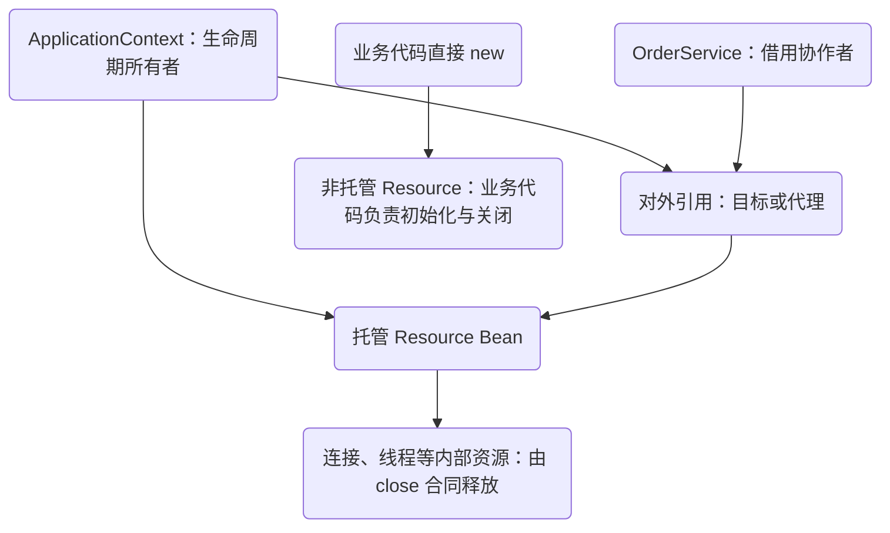
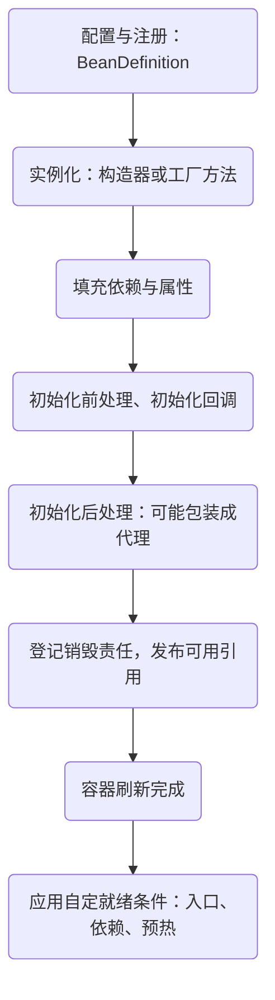
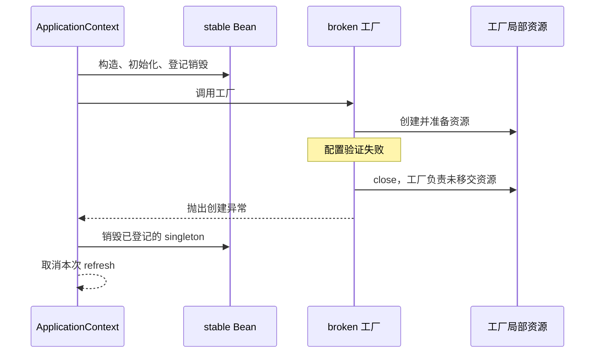

# 容器创建与对象所有权：Bean 何时可用，谁负责关闭

一个客户端已经执行了构造器，为什么调用时仍然提示“未初始化”？一个对象明明标着 `@Bean`，为什么启动失败后它的连接没有关闭？这些问题都不能只用“交给 Spring 管理”回答。需要先说清楚：**管理的是哪个实例，从哪个时刻开始，结束时负责哪一层资源。**

这一章以订单服务依赖的资源客户端为例。资源用可计数的本地对象代替，不连接外部系统；重点是所有权和生命周期，不是客户端协议。学完需要交付一张对象图和一组失败清理断言，而不只是背出 Bean 的创建步骤。

## 先修、范围与实验入口

需要知道 Java 构造器、异常、接口与 `try/finally`。本路径使用 JDK 21、Spring Framework 6.2.19；涉及 Boot 配置时固定到 3.5.16。这里走普通、非懒加载 singleton 的创建路径，不把循环引用的提前暴露、`FactoryBean`、自定义 scope 全部压进同一张图。事务代理的调用机制留给[事务调用链](/learn/spring-service-boundaries/transaction-proxy)。

[下载本路径的完整实验](/examples/spring-service-boundaries.zip)，在解压目录运行：

```sh
java -version
gradle --version
gradle run --args=lifecycle
```

需要完整 JDK 21 与 Gradle 8.10.2。入口是 `lab.AllLabs`，本章对应 `LifecycleLab`；首次需要下载依赖，准备好缓存后可以加 `--offline`。程序不使用 Java 的可关闭断言开关，失败直接抛 `AssertionError`。本轮四组生命周期实验已编译运行通过；实际日志、环境和源文件指纹见下载包 `VERIFICATION.md`。以下结果表与这些断言对应。

## 1. 先画“谁拿着谁”，再谈注解

订单应用服务持有的是容器提供的协作者引用。这个引用可能直接指向目标实例，也可能指向代理。资源客户端内部还可能持有连接池、线程或文件句柄；容器不会沿着任意 Java 字段无限递归，替我们关闭所有成员。



“引用了一个对象”和“拥有它的关闭权”是两件事。应用服务借用共享连接池，不应在每次请求结束时把池关闭；池借出的 `Connection` 则需要在合适的范围归还。判断方法是给每条边写一个动词：创建、借用、归还、关闭。写不出来的边，往往就是泄漏或误关闭发生的地方。

Spring 的 singleton 是**每个容器、每个 Bean 定义**的共享实例，不是整个 JVM 中这个 Java 类只能有一个对象。两个容器可以各建一个同类实例；直接 `new` 也能再建一个。并且，singleton 不等于线程安全：容器安全发布初始化状态，不会自动让后续的 `ArrayList` 修改或“先检查再写入”变成原子操作。[作用域文档](https://docs.spring.io/spring-framework/reference/6.2/core/beans/factory-scopes.html)与[生命周期中的线程安全说明](https://docs.spring.io/spring-framework/reference/6.2/core/beans/factory-nature.html)需要一起读。

## 2. 创建过程是一组有前提的阶段

`BeanDefinition` 保存创建配方：类型或工厂方法、依赖、作用域、初始化与销毁元数据。它不是已经可用的实例。`refresh()` 会准备 BeanFactory、执行容器扩展点、注册后处理器，再完成剩余非懒加载 singleton 的初始化，最后进入刷新完成阶段。



图中的“可能”很重要。并不是每个 Bean 都有代理；扩展点也可以改变普通路径。排查本例只需对照 `AbstractAutowireCapableBeanFactory.doCreateBean` 的 `populateBean`、`initializeBean`、`registerDisposableBeanIfNecessary`。初始化后返回给外部的对象可能与刚构造出的目标不同。自动代理常在 `AbstractAutoProxyCreator.postProcessAfterInitialization` 参与，这足以解释“注入引用”和“自己创建的实例”为什么不等价；不必在这里展开事务传播。

另一个容易混淆的词是“启动完成”。构造器返回，只能说明构造器的工作完成；初始化回调返回，才能继续发布该 Bean；容器刷新成功，也不意味着你自己的后台消费、索引预热或外部依赖都满足接流量要求。应用就绪需要可检查的条件，不能用某条日志的先后代替。

### 初始化适合做什么

初始化适合验证配置、自身数据结构等有界工作。把无限重试、长网络等待、依赖任意其他 Bean 的异步预热塞进初始化回调，会把启动失败和等待路径纠缠在一起。需要在全部普通 singleton 准备好后执行的工作，可以考虑 `SmartInitializingSingleton`；需要启动、停止、阶段顺序和有界排空的组件，再研究 `SmartLifecycle`。这不是把回调换个名字就能获得可靠后台任务：失败策略、重试上限和关闭责任仍属于应用设计。

## 3. 用事件证明顺序，不靠日志看起来差不多

实验中的资源暴露三个动作：`init()`、`use()`、`close()`。如果没有初始化，或者已经关闭，`use()` 会拒绝；关闭通过 CAS 保证幂等。幂等是这个资源自己实现的合同，不能推导成“任何第三方客户端重复 close 都安全”。

```java steps
// !step(1:4) 定义生命周期：容器调用工厂取得实例，并依据元数据调用 init 与 close；直接 new 不会自动读取这些元数据。
// !step(6:10) 注入的是容器准备好的依赖：Consumer 的注入日志应晚于 Resource 的初始化日志。
// !focus(1:4)
@Bean(initMethod = "init", destroyMethod = "close")
Resource resource() {
    return new Resource("managed");
}

@Autowired
void inject(Resource resource) {
    this.resource = resource;
    events.add("consumer:inject");
}
```

不要要求所有无依赖 Bean 都按一个全局顺序创建。实验先要求相关事件确实存在且各出现一次，再断言有意义的偏序：资源初始化早于消费者注入；消费者注入早于自己的初始化；托管资源使用时已经准备好；关闭消费者早于关闭其依赖资源。不能直接比较两个 `indexOf`，因为缺失事件的 -1 也可能满足“小于”；安全的顺序检查先验证存在与次数。测试还把遗漏、重复、反序三种日志交给同一个检查器，要求全部被拒绝。消费者的构造器可能先执行，再触发依赖解析，因此“所有依赖构造完成后消费者构造器才会执行”对本例的 setter 注入并不成立。

| 观察点 | 应看到的结果 | 能证明什么 |
| --- | --- | --- |
| 从容器两次取得同一定义 | 同一 Resource；Consumer 持有它 | 本容器此定义的 singleton 身份 |
| 直接 `new Resource` 后 `use` | 拒绝使用 | 普通 Java 构造未触发容器初始化 |
| 关闭 context | managed 的关闭计数为 1；manual 为 0 | 托管范围没有扩展到手动对象 |
| 再次关闭 context、再关闭资源 | 本实验计数不增加 | context 与本例资源的幂等行为分别成立 |
| 两次取得 prototype | 两个已初始化实例 | 每次解析获得新实例 |
| 关闭 prototype 所在 context | 两个实例关闭计数仍为 0 | 调用方仍欠清理责任；自行清理后还要逐个断言计数为 1 |

prototype 特别适合揭穿“容器创建就会负责到底”的误解。容器完成构造与初始化后将它交出去，不自动跟踪所有 prototype 实例的销毁。singleton 构造时直接注入一个 prototype，也不会让它每次方法调用都变新。需要按次获取可用 `ObjectProvider`，但调用方必须给每次得到的资源定义结束点；延迟查找不是资源回收方案。

## 4. 启动失败时，清理分成两条路径

成功注册为可销毁 singleton 的资源，和工厂方法尚未返回的局部资源，不处于同一种状态。实验先成功创建 `stable`，再进入失败工厂。工厂创建了本地资源，验证配置时抛异常，于是自己关闭；刷新失败路径再销毁已经登记的 singleton。断言不仅看有无 close，还核对失败根因确为指定的配置拒绝、两条清理路径均恰好一次，并验证局部资源先清理、已登记资源后清理。



```java steps
// !step(1:2) 此时创建方仍拥有资源：工厂尚未成功返回，不能假定容器已经登记它的销毁回调。
// !step(3:5) 初始化或校验失败也要考虑已经取得的资源。
// !step(6:9) 原异常继续向上传播；清理资源不等于吞掉启动失败。
// !mark(7:7)
Resource local = new Resource("factory-local");
failedFactoryResource = local;
try {
    local.init();
    throw new IllegalArgumentException("configuration rejected");
} catch (RuntimeException failure) {
    local.close();
    throw failure;
}
```

真实客户端如果 `close()` 也可能抛异常，还要保留原始失败，可用 try-with-resources 的 suppressed exception 语义，或显式将清理失败附加到原异常。正常关闭和启动半途失败必须分别测试；单测只覆盖成功启动再关闭，无法发现“还没交接就失败”的窗口。

本例的 `@DependsOn` 只是稳定安排故障实验先后，不应成为项目里随意控制初始化顺序的工具。如果 A 确实使用 B，应让依赖关系出现在构造器或工厂参数中，这样类型检查、测试和销毁顺序才有共同依据。

## 5. 配置和依赖注入也有边界

配置值最终要进入对象，但“配置来自哪里”和“对象怎样产生”是两层问题。Boot 的配置源存在优先级；同一个键可以被命令行、环境或配置文件覆盖。定位时记录**最终有效值、单位、来源类别**，敏感值只记录是否存在或不可逆摘要，不打印密码和令牌。再用带校验的 `@ConfigurationProperties` 把散落字符串收束成有约束的配置对象。[Boot 外部配置文档](https://docs.spring.io/spring-boot/3.5/reference/features/external-config.html)解释覆盖规则；固定版本源码见文末。

构造器注入让“没有依赖就不能创建”的要求直接体现在类型上。对于 `@Configuration(proxyBeanMethods = false)`，不要把同类的 `@Bean` 方法直接互相调用当成容器查找；那是普通 Java 调用，可能创建额外对象。显式工厂参数如 `orderService(Client client)` 更清楚，也不依赖配置类方法增强。

依赖环也必须按创建条件分析。A 的构造器需要 B，B 的构造器又需要 A，在任何一边实例尚未产生时都无法交付依赖。“三级缓存”不能凭空提供构造完成的对象。实验断言根因为 `BeanCurrentlyInCreationException`，不是要求所有启动失败都长成同一种顶层异常。

修复优先比较两个方案：抽出共同能力 C，使 A、B 各依赖 C；或者在确有延迟语义时注入 provider。前者增加一个明确职责，通常更易测；后者推迟对象查找与失败时机，调用期间可能再触发创建，也容易隐藏原有耦合。若初始化阶段立即 `getObject()`，环通常只是换了位置，并没有消失。

## 6. 从现象收敛到证据

出现“启动后偶发不可用”，先找实例身份和创建入口，不先加 `@Lazy`。若调用来自手动对象，检查是否绕过了配置、初始化和代理；若是托管对象，比较注入、初始化、发布与使用事件；若只在停机时出现，核对谁先拒绝新工作、谁仍持有共享资源。每次只改一个边界，再重跑原反例。

资源增长也要分清“对象还活着”和“底层句柄没释放”：heap 上对象数量只是线索；关闭次数、连接/线程数量和实际使用者才能接近结论。看到 prototype 数量增加时，先问每个获取点由谁关闭，而不是把所有 Bean 改成 singleton。

### 练习一：预测并修复

把 prototype 注入 singleton 消费者的普通字段，然后连续调用消费者两次。预测资源身份和 context 关闭后的计数，再改为按次获取并在每次工作结束时关闭。

参考推理：直接注入只发生一次，所以两次调用仍用同一 prototype；容器不承担它的销毁。修复需同时改变获取范围与关闭范围。评分看三项：是否实际断言身份；失败时是否也关闭；是否误把共享 singleton 关闭了。

### 练习二：设计评审

你要接入一个创建时占用线程、初始化时可能访问网络的客户端。提交：所有权图、初始化失败测试、正常关闭测试，以及依赖不可用时“阻止接流量”与“降级启动”两个方案的取舍。

参考答案不是统一选项：强依赖订单写入能力不能偷偷降级为假成功；可选推荐功能可以有清晰降级。两者都必须限制启动等待、暴露状态、保留失败原因，并明确哪一层最终关闭线程。能说出关闭顺序但没有失败注入测试，只完成了一半。

## 源码阅读路线与验证边界

- [AbstractApplicationContext，v6.2.19](https://github.com/spring-projects/spring-framework/blob/v6.2.19/spring-context/src/main/java/org/springframework/context/support/AbstractApplicationContext.java)：`refresh`、失败后的 `destroyBeans`、`finishBeanFactoryInitialization`、`doClose`
- [AbstractAutowireCapableBeanFactory，v6.2.19](https://github.com/spring-projects/spring-framework/blob/v6.2.19/spring-beans/src/main/java/org/springframework/beans/factory/support/AbstractAutowireCapableBeanFactory.java)：`doCreateBean`、`populateBean`、`initializeBean`
- [AbstractAutoProxyCreator，v6.2.19](https://github.com/spring-projects/spring-framework/blob/v6.2.19/spring-aop/src/main/java/org/springframework/aop/framework/autoproxy/AbstractAutoProxyCreator.java)：普通初始化后包装与提前引用分支应分开读
- [Boot ConfigDataEnvironment，v3.5.16](https://github.com/spring-projects/spring-boot/blob/v3.5.16/spring-boot-project/spring-boot/src/main/java/org/springframework/boot/context/config/ConfigDataEnvironment.java)：配置数据处理，不等同于 Bean 实例化

本地资源实验覆盖容器回调、身份和清理路径，不证明真实连接池、消息客户端或操作系统进程都已正确排空。带外部资源的适配器仍需自己的生命周期合同测试。下一章把同一种边界思路用到[一次 HTTP 请求的完成链](/learn/spring-service-boundaries/mvc-request-completion)。
