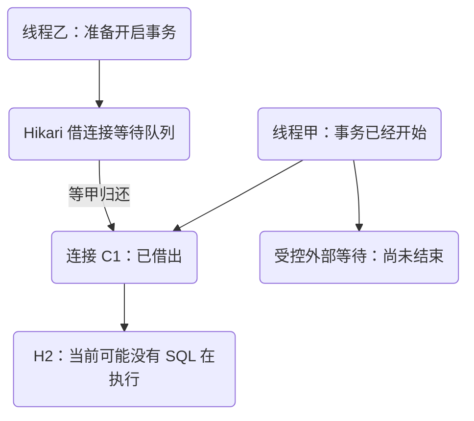
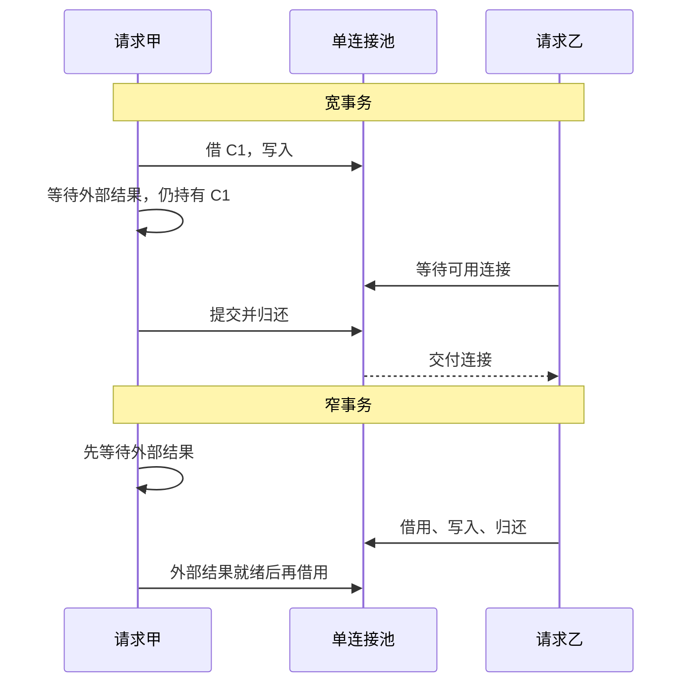
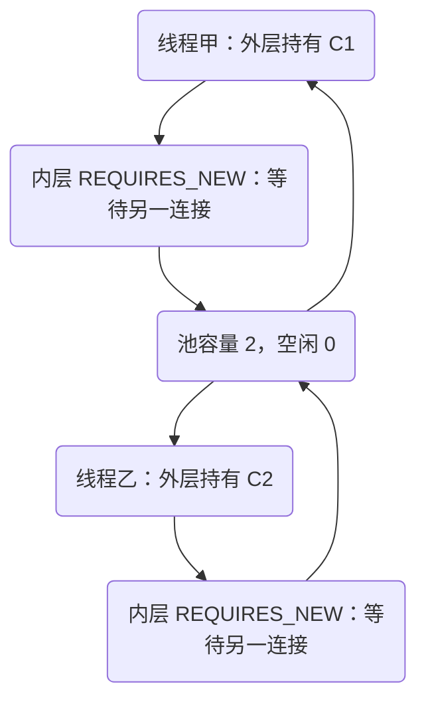

# 连接池与事务预算：请求卡住时，资源被谁占住

接口忽然变慢，线程池还有空位，数据库 CPU 也不高。把请求超时从一秒改成十秒后，错误少了一会儿，排队却越来越长。此时首先要找的不是“哪个 SQL 最慢”，而是：**谁占住连接，等待它的人有多少，占用期间到底在做什么。**

本章接着[事务调用链](/learn/spring-service-boundaries/transaction-proxy)向资源层走。代理、传播和 rollback-only 不再重讲；我们用它们预测连接被借出和归还的时刻，再用受控实验验证。

## 先修、范围与运行

需要会区分 Java 线程、数据库连接和事务。实验固定 JDK 21、Spring 6.2.19、HikariCP 6.3.3、H2 2.3.232。Hikari 版本在实验构建中显式固定；它是这个实验的依赖合同，不替换其他项目的连接池版本。

[完整实验下载](/examples/spring-service-boundaries.zip)中运行：

```sh
gradle run --args=pool
```

`PoolLab` 创建独立内存库和受控工作线程，不依赖外部 HTTP 服务。所谓“远程等待”由 latch 代替，只证明**等待期间连接是否被占用**，不声称测试了真实网络取消。每条 Future 与 latch 都有结束上限，finally 会释放实验闸门。本轮五组资源场景已编译运行通过，环境、实际日志与指纹见 `VERIFICATION.md`。

## 1. 先把池中的三种数量分开

活跃连接是已借出的连接，空闲连接是池中可借的连接，等待线程是正在等待获取连接的调用者。活跃不等于正在执行 SQL：线程可能持有事务连接，却在等待 HTTP、睡眠、锁或另一个 Future。只看数据库当前语句会漏掉这部分占用。



实验的“宽事务”先插入 `holder`，然后在同一个事务内部等待 latch。确认它已进入等待后，才启动第二个事务。待 Hikari 的 `threadsAwaitingConnection` 达到 1，读取 MXBean 的实际 active、idle、pending、total 值，要求本次稳定状态为 `1/0/1/1`，并分别抓取已命名 holder 与 waiter 的线程栈。输出中的数字全部来自采样，不把预期常量伪装成观测。这种安排依赖事件关系，不用“睡 100 毫秒，大概已经开始了”猜测。

```java steps
// !step(1:3) 等到指定状态后读取实际池值，断言与打印使用同一份快照，不能把 idle=0 写成输出常量。
// !step(4:5) 栈分别来自本次实验保留的两个命名线程，检查持有者在 latch、等待者在借连接。
// !step(6:8) 连接观察来自持有者事务内部的 unwrap，日志把线程角色、物理标识和池值绑定在一起。
// !focus(4:8)
eventually(() -> pool.getHikariPoolMXBean().getThreadsAwaitingConnection() == 1);
PoolSnapshot actual = snapshot(pool);
AllLabs.check(actual.equals(new PoolSnapshot(1, 0, 1, 1)), "actual held pool values: " + actual);
String holderStack = stackEvidence(holderThread.get(), "java.util.concurrent.CountDownLatch", "await");
String waiterStack = stackEvidence(waiterThread.get(), "com.zaxxer.hikari.util.ConcurrentBag", "borrow");
ConnectionObservation held = connections.get("holder");
System.out.println("OBSERVE wide " + actual + " heldBy=" + held.thread()
        + " connection=" + held.h2Id() + " identity=" + held.identity());
```

指标是采样值，不是数据库事务快照。实验通过闸门维持稳定状态，让这些值具有可比较性；生产系统不能把不同时刻采集的 active、idle 和 total 硬凑成绝对不变量。`stackEvidence` 对本次命名线程的栈逐一断言：waiter 包含 Hikari `ConcurrentBag.borrow`，holder 包含 `CountDownLatch.await`。两个端点都写入日志，不是从全进程随便找到一个池栈就算完成。持有者在自己的事务中将回调连接 unwrap 为 H2 物理连接，记录本地 id 与对象身份；闸门释放后，等待者也记录自己的物理连接。池容量为 1 时，最终还断言两次使用的是同一个底层实例，以及实际池值回到 `0/1/0/1`。这些身份值只用于本实验，不输出生产连接串或凭据。

## 2. 缩小持有范围，与单纯延长耐心不同

“窄事务”先完成受控外部等待，再进入本地事务。第一个请求仍在外部等待时，第二个请求已经能借连接、插入并完成；池里不再有第一个请求占用的连接。两种程序最后都写入两行，但资源占用路径不同。窄事务还检查 holder 等待期间尚无连接观察记录，contender 已完成并归还，实际采样为 active=0、idle=1、pending=0；之后 holder 才取得同一底层连接。



| 场景 | 闸门未释放时 | 最终数据 | 结论 |
| --- | --- | --- | --- |
| 宽事务 | active=1，pending=1 | 两行 | SQL 不忙也可能耗尽池 |
| 窄事务 | 乙已完成，active=0 | 两行 | 外部等待没有占住事务连接 |
| 借连接等待从 1 秒增至 3 秒 | 持有者仍不归还，pending 仍为 1 | 是否成功仍取决于持有者结束 | 更长等待不修复资源依赖 |
| 原线程事务失败、工作线程独立写 | 子线程无原事务绑定 | 只保留 child | 跨线程改变了原子边界 |
| 事务预算到期后再执行 JDBC | Java 代码曾继续，下一次访问失败 | 无记录 | 事务超时不是线程终止器 |

窄事务不是无条件正确。若“读取本地价格—调用外部计算—写订单”期间价格可能变化，移出事务后必须定义重新校验或版本条件。把连接占用压短，不能以破坏业务不变量为代价。相反，若外部调用本来就在事务之外、瓶颈是数据库锁，缩短 Java 方法里的空白代码不会解决锁等待。

只调长超时会改变失败时间和排队长度，没有改变资源图；只增加工作线程也可能增加更多等待者。合理修复通常组合：有界入口、缩短持有期、减少不必要嵌套、为慢依赖设置独立预算。增加池大小是容量决策，需要证明数据库承受得住额外并发，而不是看到等待就翻倍。

## 3. 嵌套独立事务为什么可能索要第二条连接

外层持有连接时调用独立事务，外层资源被挂起，不等于连接已归还池；内层需要新的物理事务资源。若所有工作线程都已各持有一条外层连接，又同时等待内层连接，就可能出现“所有连接都有人持有，但没人能先结束”的等待关系。



这张图是根据第三章传播合同推导的风险图，本章基础程序不声称已执行这一嵌套故障。不要把“线程数加一”写成所有递归深度、并发控制和公平性条件下的通用容量保证。评审应先数同时持有资源的执行单元、每层新增需求和等待顺序；更深嵌套、旁路查询、异步任务都会改变前提。[Spring 对 REQUIRES_NEW 的资源警告](https://docs.spring.io/spring-framework/reference/6.2/data-access/transaction/declarative/tx-propagation.html#tx-propagation-requires-new)值得与实际池配置一起读。

更稳妥的替代方案可能是取消不必要的独立事务、把可延后工作移出请求、用独立限额保护必须保留的路径。若审计必须独立持久化，先明确丢失和延迟能否接受，再讨论另一个池或异步交接；单独建池也会增加数据库总连接数，不是免费隔离。

## 4. 五种超时，作用点各不相同

| 预算 | 主要限制什么 | 不能据此断言什么 |
| --- | --- | --- |
| HTTP 调用方截止时间 | 调用方愿意等待完整结果的时间 | 服务器已回滚、停止执行 |
| 连接池 connectionTimeout | 等待借到连接 | 已借连接里的 SQL 会被中断 |
| JDBC statement/query timeout | 驱动与数据库支持的语句执行限制 | 任意 Java 代码会被终止 |
| Spring 本地事务 timeout | 事务资源预算及参与调用的超时检查 | 有后台闹钟到点强杀线程 |
| 外部 HTTP 客户端超时 | 具体客户端覆盖的网络阶段 | 本地事务自动撤销所有远程副作用 |

Spring JDBC 的事务超时会通过 `DataSourceUtils.applyTimeout` 等路径用于语句；代码若绕过这一资源接入方式，不能假定它享受相同的检查。本例先写一条记录，再等待明确的 1500 毫秒计时事件，事务预算为 1 秒。Java 在计时事件后继续设置标志，下一次 `JdbcTemplate` 操作才检测到期限已过并抛 `TransactionTimedOutException`；外层因此回滚。这个用时是故意让预算过期的输入，不是用 sleep 猜并发顺序。

它证明两件事：事务 timeout 没有强制中断 Java 等待；参与 Spring JDBC 的后续访问可以发现过期。它不证明所有驱动取消行为一致，也不证明“预算到期但之后不再访问数据库”一定会在相同位置抛异常。必须把触发检查的位置写进结论。


假设接口总预算 800 毫秒，可以从“入口 50、借连接 100、SQL 300、序列化与网络 150、余量 200”开始做实验，但这些数字只是示例分配，不是默认推荐。并行调用看关键路径，重试还要计算所有尝试和退避；实际配置应受剩余预算约束。服务已接近截止时间时，继续花整段默认连接等待预算，常常只是制造更晚的失败。

## 5. 跨线程时，移动任务不会搬走原连接

`TransactionSynchronizationManager` 的资源绑定以当前线程为边界。把 Runnable 交给 `ExecutorService`，不会把原线程的事务连接自动移过去。实验让原线程开启事务并插入 parent；工作线程检查没有事务绑定，独立插入 child；随后原线程抛异常回滚。最终只留下 child，且采集到不同的 H2 连接标识。

```java steps
// !step(1:2) 原线程检查自己确实位于事务中，并执行 parent 写入。
// !step(3:6) 子任务在另一个线程查询绑定状态；同一个 JdbcTemplate 对象不代表同一条事务连接。
// !step(7:7) 回滚原线程边界时，已经独立提交的 child 不会被撤销。
// !mark(4:4)
AllLabs.check(TransactionSynchronizationManager.isActualTransactionActive(), "parent tx");
jdbc.update("insert into events values ('parent')");
worker.submit(() -> {
    AllLabs.check(!TransactionSynchronizationManager.isActualTransactionActive(), "child has no inherited tx");
    jdbc.update("insert into events values ('child')");
}).get(3, TimeUnit.SECONDS);
throw new IllegalStateException("rollback parent");
```

不能通过复制 ThreadLocal 或把同一 JDBC Connection 交给多个并发线程来“修复”。正确选择由业务合同决定：必须原子完成的本地写入留在同一明确事务内；可独立完成的后台工作定义自己的事务、失败结果和关闭责任；必须可靠跨越进程的任务需要持久化交接。普通线程池不是可靠消息队列。

## 6. 把观察结果变成定位树

请求变慢时先问：等待发生在借连接之前、池内部，还是拿到连接之后？

1. pending 高、active 贴近上限：抓等待者栈，确认在池借用；再找持有者的事务持续时间和调用栈
2. pending 低、SQL 慢：查数据库执行与锁证据，不先扩应用线程池
3. 事务持续时间长但 SQL 总时长短：寻找远程调用、Future 等待、序列化或应用锁是否落在持有区间
4. 调用方超时后 active 仍持续：核对取消信号能到哪层，以及何时实际归还连接
5. 一次方法调用用了不同连接：同时记录线程、数据源身份、事务状态和借还时间，不只比较包装对象地址

连接标识用于排查，不应含用户名、密码或完整连接串。记录 operation ID、线程名、池名、等待耗时、持有耗时、事务结果与故障注入点即可；高基数标识适合日志/追踪，不适合作为无限展开的指标标签。

### 练习一：修复并保留反例

在宽事务实验中增加等待预算，再重复观察 pending。参考结论：只要闸门未释放，连接仍由甲占有；预算变长只是允许乙等更久。接着把外部等待移出事务，要求乙在甲的闸门释放前已完成，并断言两行最终都存在。评分看是否同时保留行为与资源证据，不能只比较一次总用时。

### 练习二：做一张容量评审表

为 100 个并发入口、池容量 10 的服务列出：允许同时进入数据库的工作量、最大排队数、排队拒绝合同、每次连接持有的上界、独立事务额外需求、超时后的清理责任。至少比较“入口限流 + 短事务”和“增大池”两个方案。

参考推理：不能从 100/10 直接推出吞吐；还缺持有时间分布、数据库承载能力和下游依赖。优秀答案会说明高分位长尾怎样占满池、拒绝如何返回给调用方，以及如何防止失败重试把流量再放大。若业务必须长时间持锁，应明确吞吐成本，并提出另一种保持不变量的设计。

## 固定源码与未覆盖项

- [DataSourceUtils，v6.2.19](https://github.com/spring-projects/spring-framework/blob/v6.2.19/spring-jdbc/src/main/java/org/springframework/jdbc/datasource/DataSourceUtils.java)：`doGetConnection`、`applyTimeout`、`doReleaseConnection`
- [TransactionSynchronizationManager，v6.2.19](https://github.com/spring-projects/spring-framework/blob/v6.2.19/spring-tx/src/main/java/org/springframework/transaction/support/TransactionSynchronizationManager.java)：线程绑定资源容器
- [HikariPool，HikariCP-6.3.3](https://github.com/brettwooldridge/HikariCP/blob/HikariCP-6.3.3/src/main/java/com/zaxxer/hikari/pool/HikariPool.java)：`getConnection` 的借用与超时路径
- [ProxyConnection，HikariCP-6.3.3](https://github.com/brettwooldridge/HikariCP/blob/HikariCP-6.3.3/src/main/java/com/zaxxer/hikari/pool/ProxyConnection.java)：`close` 的状态清理和归还，不等同于每次物理断连

H2 结果不证明 MySQL 的锁、死锁、statement cancel 或网络断连行为。基础实验也不是容量压测，不据此推荐生产池大小。下一章把这些边界汇成一份[订单服务评审](/learn/spring-service-boundaries/service-boundary-review)，要求所有失败同时说明 HTTP、数据库和资源的结果。
