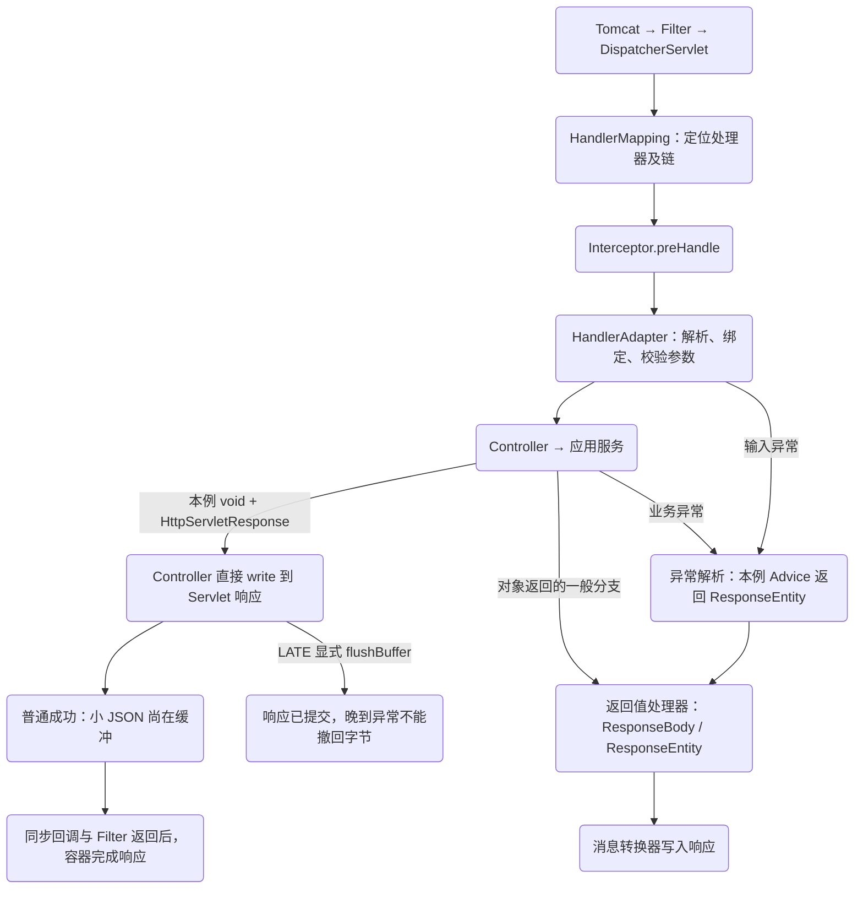
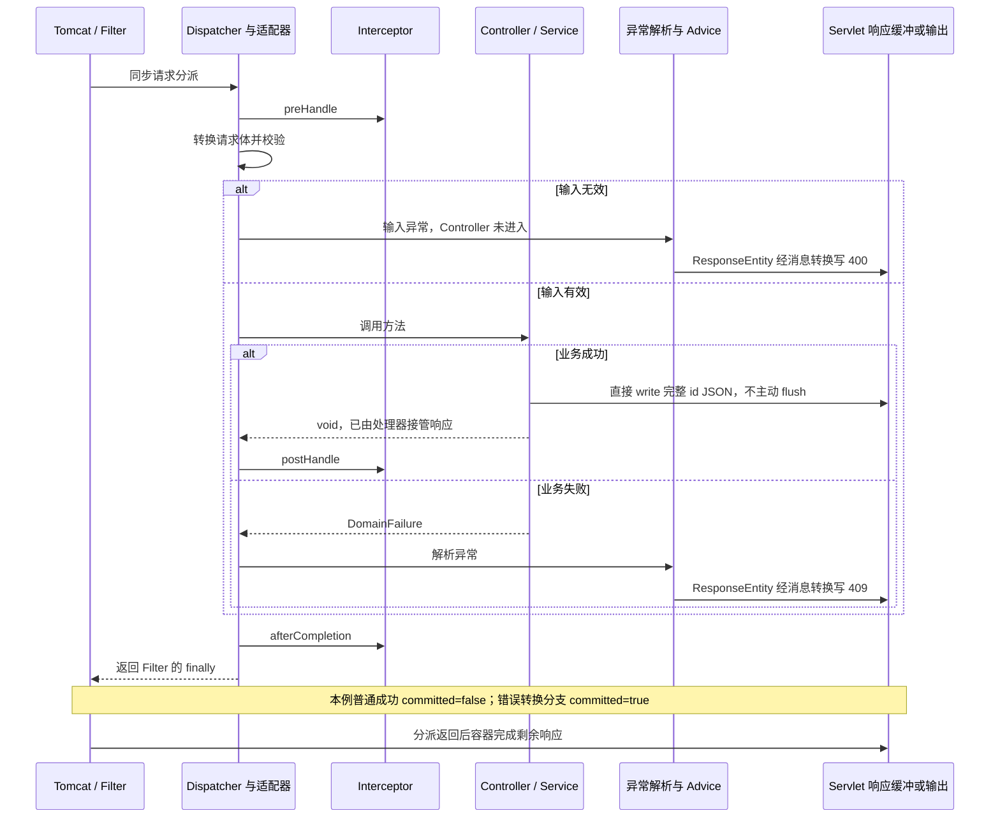
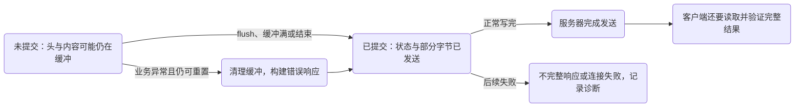
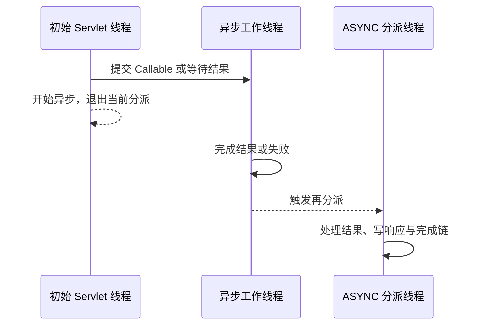

# 请求完成链：MVC 在哪里选择处理器、转换异常和提交响应

监控里是一条 400，业务日志里却没有订单号；另一条请求返回了 201，客户端仍然无法解析响应。这两种情况都可能合理。HTTP 状态、Controller 是否进入、数据库是否提交、响应体是否完整，是四个不同的观察点。

本章跟踪同一个 `POST /orders`。目标不是给每个框架类背一段介绍，而是能回答：**在哪一层失败，谁有机会处理，调用方最后还能相信什么。**

## 先修与固定环境

需要理解 HTTP 方法、状态码、JSON，以及上一章的 Bean 与协作者关系。实验固定 JDK 21、Boot 3.5.16、Spring 6.2.19、嵌入式 Tomcat 10.1.55、Servlet 6.0。这里只讨论 Servlet MVC，同步返回路径是主线；WebFlux 的订阅与 Reactor context 不属于这个线程模型。

[完整实验下载](/examples/spring-service-boundaries.zip)包含真实服务器和 JDK HTTP 客户端。运行：

```sh
gradle run --args=http
```

程序监听 `127.0.0.1` 的随机空闲端口，发出真实 TCP HTTP 请求，最后关闭客户端、应用上下文与池；无需外部数据库或 Docker。`HttpLab` 内的 H2 只用来观察最终记录数，不验证 MySQL 隔离。各行输出含状态、响应体、Controller 进入次数、数据库前后行数和处理链事件。本轮八条真实 HTTP 请求断言已运行通过，实际记录见包内 `VERIFICATION.md`；不能拿直接调用 Controller 或 MockMvc 的结果替代本章的网络验证。

## 1. 找到处理器，不等于已经执行处理器

Servlet 容器先处理 Filter 链，再进入 `DispatcherServlet`。Dispatcher 使用 HandlerMapping 找到处理器及拦截器链，选择能调用该处理器的 HandlerAdapter。对注解控制器，`RequestMappingHandlerAdapter` 准备参数解析器、数据绑定、校验和返回值处理。



本例成功方法返回 `void`，并通过 `HttpServletResponse.getWriter()` 直接写 JSON；它没有返回一个等待 Jackson 序列化的订单 DTO。适配器识别响应已被处理后，不再把这个 void 返回值走一遍对象序列化。相对地，本例 Advice 返回 `ResponseEntity`，才经过对应返回值处理与消息转换。

因此，拦截器的 `preHandle` 已经执行，也不能证明 Controller 方法体进入了。参数解析失败发生在方法体前面。我们的 `handlerEntries` 放在 Controller 第一行，持久化行数由请求结束后独立查询得到，它们才是进入业务和留下副作用的证据。

Filter、Interceptor、AOP 不应互相当作替代品。Filter 在 Servlet 边界，适合入口拒绝、关联信息、请求/响应包装；Interceptor 已知道映射到哪个处理器，适合与处理器相关的观测；服务 AOP 作用于被代理的 Java 调用，同一服务还可能由定时任务调用。安全校验应在明确的信任边界完成，不能因为加了业务拦截器就宣称完成鉴权。[HandlerInterceptor 官方说明](https://docs.spring.io/spring-framework/docs/6.2.19/javadoc-api/org/springframework/web/servlet/HandlerInterceptor.html)也提醒路径匹配差异使拦截器不适合单独承担安全层。

## 2. 输入合同必须在业务调用前说清楚

实验请求体只有两个字段，`sku` 不能为空，`quantity` 至少为 1。它们是输入形状与局部约束；库存够不够、商品是否允许购买等依赖实时业务状态的规则，仍由应用服务和数据库合同处理。

```java steps
// !step(1:1) DTO 约束描述输入合同，不能代替数据库不变量或权限校验。
// !step(3:5) consumes 约束媒体类型；RequestBody 先转换，再对参数执行 Valid 校验。
// !step(6:7) 进入计数放在方法体第一行。非法 JSON 或本例校验失败不应增加它。
// !focus(4:7)
public record CreateOrder(@NotBlank String sku, @Min(1) int quantity) { }

@PostMapping(path = "/orders", consumes = "application/json")
public void create(@Valid @RequestBody CreateOrder command,
        HttpServletRequest request, HttpServletResponse response) throws IOException {
    state.handlerEntries.incrementAndGet();
    trace(request).add("controller:enter");
}
```

这段是入口节选，完整方法在下载包中。不能把不同失败都称为“参数校验失败”：非法 JSON 在消息转换时失败；对象转换成功但违反 Bean Validation 约束，是另一条路径；在 6.2 的 MVC 内建方法校验下，方法参数或返回值上的直接约束还可能触发 `HandlerMethodValidationException`。本例只覆盖 DTO `@Valid` 与反序列化，不假称已经测试所有方法校验分支。[MVC Validation](https://docs.spring.io/spring-framework/reference/6.2/web/webmvc/mvc-controller/ann-validation.html)说明了这些异常类型及类级 `@Validated` 与内建支持的关系。

校验器也不能被当成无限制业务调用入口。远程查库式校验可能在正式服务调用前消耗连接与时间，且校验通过后状态仍可能变化。能静态判断的输入提前拒绝；依赖并发状态的条件在声明的事务边界重新检查。

## 3. 三条失败路径，业务进入次数不同



这张图只约束服务器调用链，不把 `write()`、提交头/字节、客户端收齐响应画成同一个时刻。普通成功的基线事件依次是 `controller:enter → service:committed → interceptor:post → interceptor:after:null → filter:exit:201:committed=false`；此时小 JSON 仍可在缓冲区，容器随后完成响应。错误 Advice 的基线在 Filter 退出时已经提交。真实客户端只有在 `send(...ofString())` 收齐响应后，才运行自己的解析与断言；它与服务器回调不是一条共享 Java 调用栈。

本例业务失败故意安排在 H2 插入后、事务提交前，然后抛出运行时异常。结果应是 409 且数据库行数不增加；这是服务事务合同和异常映射共同产生的结果，**不是 409 自动让数据库回滚**。若服务已经独立提交，再返回同一个错误码，也不会撤销记录。事务细节统一见[代理到数据库连接](/learn/spring-service-boundaries/transaction-proxy)。

| 请求 | Controller 增量 | HTTP 结果 | 订单行数增量 |
| --- | ---: | --- | ---: |
| `BOOK, 1` | 1 | 201，完整 id JSON | 1 |
| 空 sku、数量 0 | 0 | 400，invalid_input | 0 |
| 非法 JSON `{` | 0 | 400，invalid_input | 0 |
| `FAIL, 1` | 1 | 409，order_rejected | 0 |
| 持有池内唯一连接后请求 | 1 | 503，capacity_unavailable | 0 |
| `LATE, 1` | 1 | 201，但只收到不完整 JSON | 1 |

上表最后一行是必须保留的反例：客户端“拿到了成功状态码”仍不等于“拿到了可用的完整业务结果”。测试对正常和排空中的成功都严格解析完整 JSON（拒绝尾随内容与重复键），检查 Content-Type、仅含 id 的 DTO、合法 UUID，并把响应 id 与独立查询所得的唯一新增行及 sku、quantity 对齐。错误分支逐一检查精确 code；八种场景的进入增量和 trace 的存在、缺失、次数与顺序都实际断言。非法 JSON 等早期拒绝还比较完整行快照。只有标明的 LATE 故障允许指定的不完整响应。

## 4. 异常解析是响应合同，不是统一 catch 魔法

`DispatcherServlet.doDispatch` 捕获处理阶段异常，`processDispatchResult` 再进入异常解析。解析器可以表示：已处理并生成结果、已处理但无需视图，或没有处理并交给后续解析器。`@ExceptionHandler` 与 `@RestControllerAdvice` 通过对应的异常解析器参与，不是包围整个 Servlet 容器的万能 `try/catch`。

如果入口 Filter 在进入 Dispatcher 之前抛异常，不能默认它会被 ControllerAdvice 捕获；容器错误分派可能另走一条路径。反过来，Resolver 已经处理的异常也不会原样出现在 `afterCompletion` 的 `ex` 参数里。本实验故意断言业务失败时存在 `interceptor:after:null`：`null` 只说明没有未处理异常传到这个回调，不能推出业务成功或 HTTP 2xx。

`postHandle` 同样不是最后补写响应的通用位置。对于 `@ResponseBody`/`ResponseEntity`，返回值处理可能已在适配器内写入响应；真正需要统一响应内容时，应研究相应的消息转换扩展点，而不是无条件在 `postHandle` 再写一份 JSON。同步链中 `afterCompletion` 只对 `preHandle` 成功返回 `true` 的拦截器保证执行，顺序为逆序；某个拦截器自己拒绝请求时，还要负责自己已经取得的资源。

### 错误合同至少包含三种可区分结果

本例用 `invalid_input` 表示输入问题，`order_rejected` 表示明确的业务拒绝，`capacity_unavailable` 表示本地资源暂时不可用。生产接口还应明确：调用方能否修正请求重试、是否需要查询原操作状态、是否有可安全显示的信息。不要把 SQL 文本、连接串、堆栈直接放进响应；关联 ID 帮助查日志，不应变成泄露内部异常的替代方式。

“所有异常都返回 200，加一个 success=false”并非天然不可实现，但会改变整个调用生态的合同：网关、通用客户端、监控与重试组件不能再仅依赖状态码。若没有全链路一致的处理，很容易把明确失败统计成成功。评审应要求证明每个调用方都遵守新合同，不能只说“前端知道”。

## 5. 响应提交是一条不可倒退的边界

Servlet 缓冲区存在时，某些头和内容还没有发送。`flushBuffer()` 会强制提交；缓冲区写满、正常完成等也可能导致提交。提交后不能通过 `reset()` 把已经发送的字节撤回，`sendError()` 也不能重启一份干净响应。[ServletResponse 6.0 API](https://jakarta.ee/specifications/servlet/6.0/apidocs/jakarta.servlet/jakarta/servlet/servletresponse)定义了 `isCommitted`、`flushBuffer` 与 reset 的关系。



```java steps
// !step(1:1) 数据库提交在此调用返回前已经完成；后续 HTTP 故障不能把这个提交撤销。
// !step(2:4) 显式 flush 让状态和前缀进入提交态，不靠缓冲区大小碰运气。
// !step(5:5) 注入晚到异常，测试要求保留既有状态和前缀，同时证明订单确实已落库。
// !mark(4:4)
String id = orders.create(command);
response.setStatus(201);
response.getWriter().write("{\"id\":");
response.flushBuffer();
throw new CommittedFailure();
```

实验专用 Resolver 检查 `isCommitted()` 后记录故障，不尝试写第二份错误体，因此客户端收到 201 与不完整 JSON。这里没有制造内核断网或模拟所有代理行为，也不承诺不同容器在未处理异常下发出相同字节；它证明的是**已提交的响应不能被应用回滚**。真实客户端还需要在读流、解析、超时和协议失败时保存“结果未知”的分类，不能立刻再创建一次订单。

## 6. 异步请求为什么要换一张图

Servlet MVC 返回 `Callable` 或 `DeferredResult` 时，入口线程可能先退出，稍后进行 ASYNC 分派。初始调用返回不等于整个请求完成；普通 `postHandle`、`afterCompletion` 的同步直觉不能直接套用。Filter 是否参与后续分派取决于注册的 dispatcher types 与过滤器实现。



本章没有运行异步分派实验，这张图用来划清同步证据的适用范围。若扩展下载项目，应记录 dispatcher type、每次进入次数、异步超时与完成事件，而不是简单把 ThreadLocal 留着不清理。事务连接的跨线程问题将在[连接预算](/learn/spring-service-boundaries/connection-budget-timeouts)验证。[MVC 异步官方文档](https://docs.spring.io/spring-framework/reference/6.2/web/webmvc/mvc-ann-async.html)是进入这条分支的起点。

## 7. 故障定位与练习

先看 Filter 是否进入，判断是否到达应用；再看映射与 `preHandle`，判断是否找到处理器；再看 Controller 计数，区分转换校验与业务异常；最后对照 `response.isCommitted`、字节和数据库状态。若客户端超时而服务器已提交，继续查持久结果，不用一条超时日志推断回滚。

练习一：把错误处理改成在 `afterCompletion` 中写 JSON，预测非法输入、业务拒绝、晚到失败三种结果。参考答案：完成回调不是可靠改写入口；部分路径早已提交，且异常可能已被解析。合格修复应在明确的异常解析位置处理未提交响应，并让晚到失败保留诊断，不重复写体。

练习二：为订单接口写一页错误合同。至少说明输入错误、明确业务拒绝、本地容量不足、提交后响应缺失四类结果；每类给调用方下一步和验证方法。评分看是否区分“没有创建”和“可能已经创建”，是否同时断言 HTTP、业务进入次数和数据库。幂等重试的完整方案见[未知结果下的幂等](/learn/data-consistency/idempotency-unknown-outcomes)，这里不靠一个异常码假装解决它。

## 固定源码路线

- [DispatcherServlet，v6.2.19](https://github.com/spring-projects/spring-framework/blob/v6.2.19/spring-webmvc/src/main/java/org/springframework/web/servlet/DispatcherServlet.java)：`doDispatch`、`processDispatchResult`、`processHandlerException`
- [RequestMappingHandlerAdapter，v6.2.19](https://github.com/spring-projects/spring-framework/blob/v6.2.19/spring-webmvc/src/main/java/org/springframework/web/servlet/mvc/method/annotation/RequestMappingHandlerAdapter.java)：`invokeHandlerMethod`
- [ServletInvocableHandlerMethod，v6.2.19](https://github.com/spring-projects/spring-framework/blob/v6.2.19/spring-webmvc/src/main/java/org/springframework/web/servlet/mvc/method/annotation/ServletInvocableHandlerMethod.java)：`invokeAndHandle` 对 void / requestHandled 的提前返回，是本例直接写响应的分支
- [RequestResponseBodyMethodProcessor，v6.2.19](https://github.com/spring-projects/spring-framework/blob/v6.2.19/spring-webmvc/src/main/java/org/springframework/web/servlet/mvc/method/annotation/RequestResponseBodyMethodProcessor.java)：转换、校验与响应写入
- [Tomcat Response，10.1.55](https://github.com/apache/tomcat/blob/10.1.55/java/org/apache/catalina/connector/Response.java)：提交态与响应重置；不要用其他容器的表现替代

基本实验故意限制为本机 HTTP/1.1、同步 MVC、单进程与 H2。TLS、反向代理、浏览器断连、流式下载及异步超时需要另补端到端证据，不能由一次回环通过推导出来。
