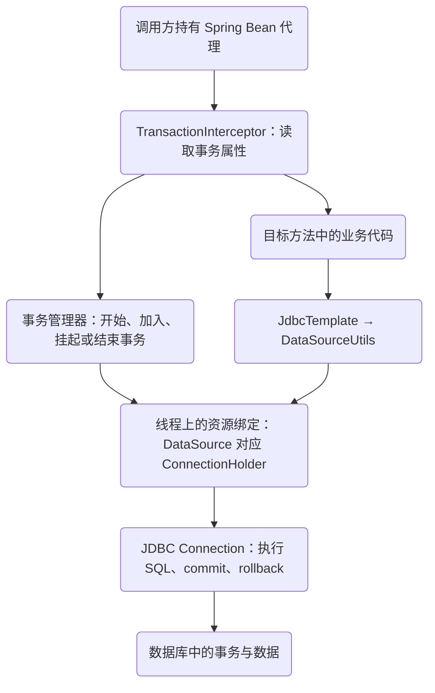
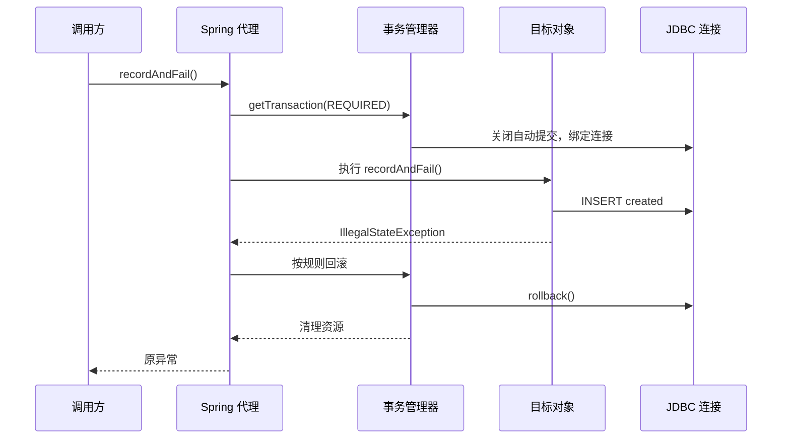
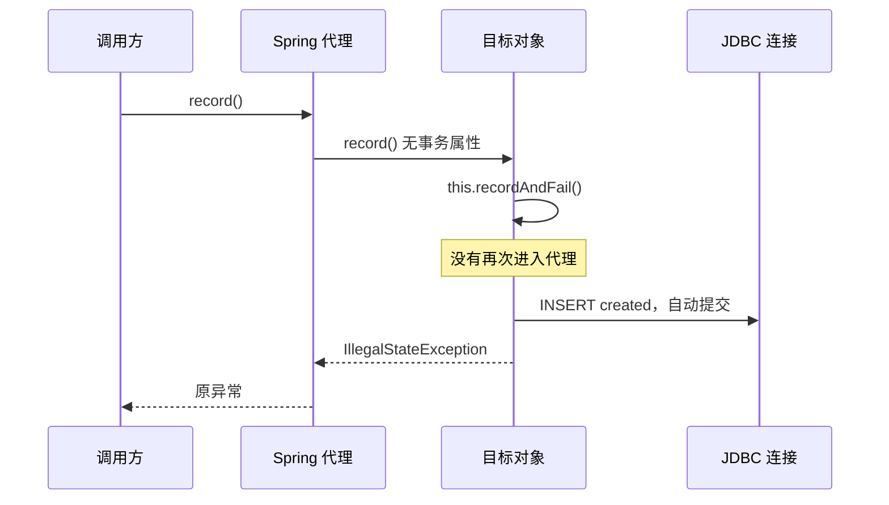
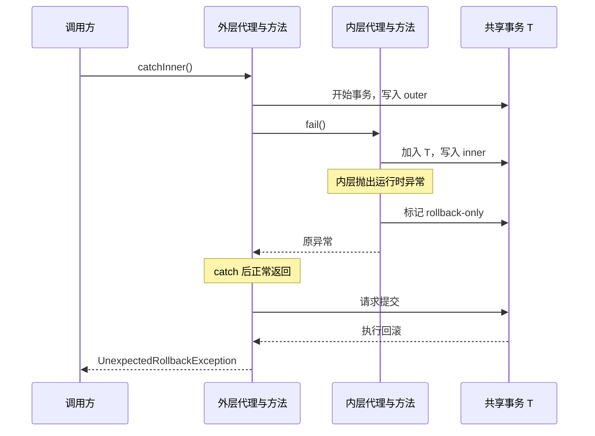
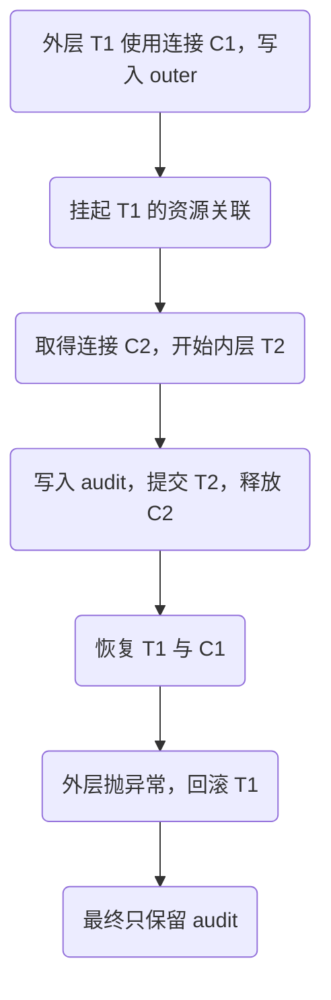
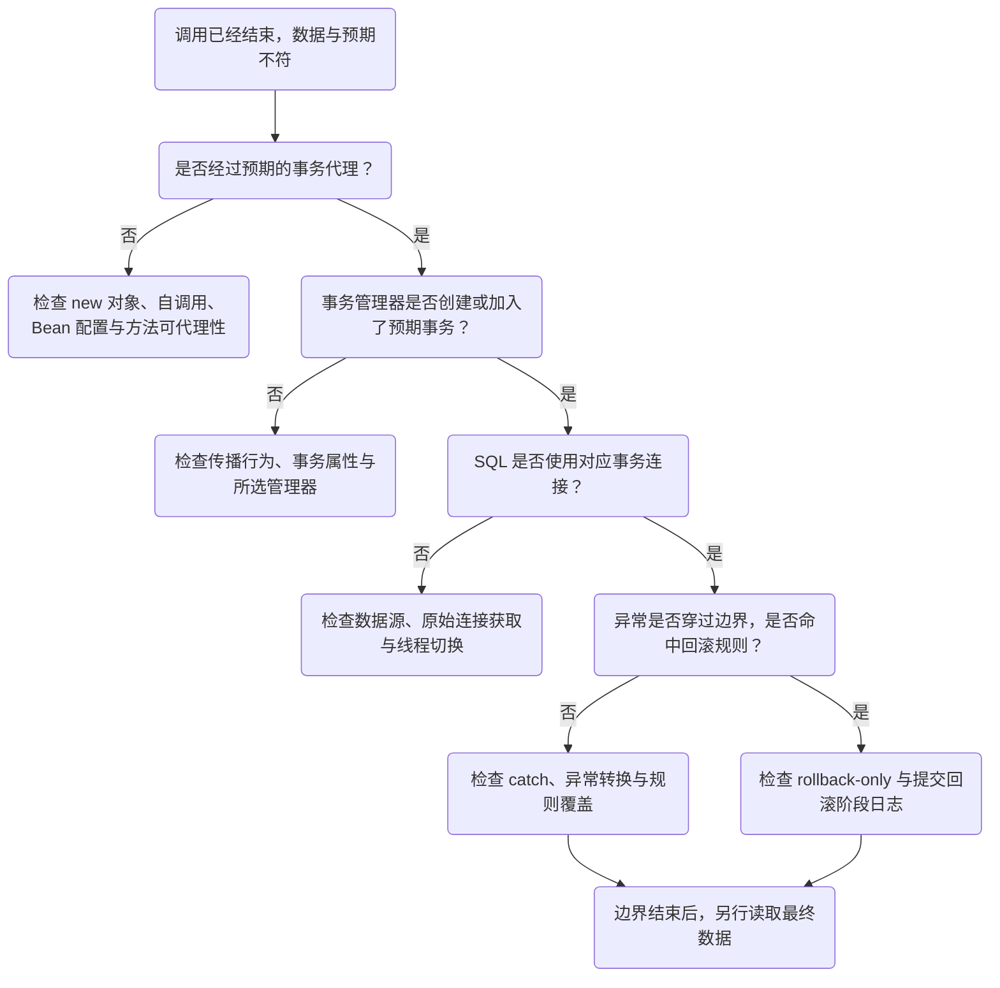

# Spring 事务调用链：从代理入口到数据库连接

同一条插入语句，同一个异常，只换一下调用入口，数据库里留下的记录就不一样了。再换一种写法，把异常 `catch` 住，方法明明走到了最后，调用方反而收到 `UnexpectedRollbackException`。

这两个现象容易被一起归为“事务失效”，实际发生的事差得很远。前者可能从来没有建立事务边界；后者往往已经建立了事务，而且 Spring 正在阻止一次不应成功的提交。

这一章沿着一次方法调用向下走到 JDBC 连接，再沿异常返回的方向走回来。读完应该能回答三个问题：**谁开启了事务，哪些 SQL 用了同一条连接，最终由谁决定提交或回滚？**

## 阅读准备与实验范围

这是“请求失败以后，数据怎么样了”系列的第一章。后面可以接着读 [Go context 取消以后，写入会怎样？](/learn/go-service-lifecycle/context-cancellation)，比较请求生命周期与提交时机；幂等重试与消息一致性还在规划中，阅读顺序见 [知识地图](/guide/knowledge-map)。

先修不多：知道 Java 对象调用、运行时异常与受检异常的区别；用过 Spring Bean；知道数据库可以提交或回滚。如果只记得 `@Transactional` 的名字，也可以先跑实验，再回来看调用链。

本文固定使用 **JDK 21、Spring Framework 6.2.19、H2 2.3.232**，研究默认代理模式下，`DataSourceTransactionManager` 管理的单数据源 JDBC 本地事务。它不覆盖 AspectJ 编织、响应式事务、JPA 持久化上下文或跨数据库事务。H2 用来验证代理与连接使用，不能替代目标数据库上的锁和隔离测试。

## 1. 先跑一次，保留数据库结果

[下载完整实验项目](/examples/spring-transaction-proxy.zip)。解压后，在项目目录运行：

```sh
java -version
gradle --version
gradle run
```

需要完整 JDK 21 和 Gradle 8.10.2，首次执行需要下载依赖。项目只有一个 Java 入口和少量 Gradle 配置，没有 Web 服务，也不需要 Docker。程序创建独立内存数据库，每个场景开始前清空 `events`，检查异常类型与最终的 `label` 列；全部通过时输出 `ALL 10 SCENARIOS PASSED`。本文的十个场景已用上述版本编译运行；依赖准备好后也可用 `gradle --offline run` 重跑。

先看结果，再猜原因。下面“保留记录”指一次调用**完全离开代理边界之后**查到的数据，不是事务进行中暂时能读到的数据。

| 场景 | 调用方看到什么 | 保留记录 |
| --- | --- | --- |
| 直接调用事务方法 `direct` | `IllegalStateException` | 无 |
| 无外层事务的自调用 `self` | 同一个异常 | `created` |
| 显式模板 `template` | 同一个异常 | 无 |
| 外层捕获跨 Bean 的 REQUIRED 异常 `required-catch` | `UnexpectedRollbackException` | 无 |
| 内层独立提交、外层失败 `requires-new` | 外层异常 | `audit` |
| 有事务的外层捕获自调用异常 `self-catch` | 正常返回 | `created` |
| 自调用 REQUIRES_NEW、外层失败 `self-requires-new` | 外层异常 | 无 |
| 默认规则下的受检异常 `checked-default` | 受检异常 | `checked` |
| 明确要求受检异常回滚 `checked-rollback` | 同一个受检异常 | 无 |
| 连接观察 `connection-bound` | 正常返回 | 无；同时验证连接复用及自动提交状态 |

实验使用显式检查，失败就抛 `AssertionError`，不依赖 `-ea`。读表时尤其留意第四行和第六行：两处都写了 `catch`，结果却不同。区别藏在异常经过的路径里。

## 2. 注解下面，至少有这四层

先把“Spring 事务”拆开看。注解只是配置；代理与拦截器负责让配置参与一次调用；事务管理器处理传播与资源状态；数据库连接执行真正的提交和回滚。



图中有两条路径汇合到同一条连接：事务管理器准备并绑定资源，`JdbcTemplate` 执行业务 SQL 时找到它。只有注解，没有正确的调用入口和资源接入，这两条路径就不一定连得起来。

### 从自动提交开始理解

JDBC 连接通常以自动提交模式开始工作。在这个模式下，语句完成后会自动提交；这里的“完成”遵循 JDBC 对不同语句及结果集的定义。对实验中的简单 `INSERT`，没有外层事务时，随后在 Java 中抛一个异常，并不会把已经完成的插入撤销。[JDK 21 的 Connection 文档](https://docs.oracle.com/en/java/javase/21/docs/api/java.sql/java/sql/Connection.html)说明了自动提交与显式提交的关系。

新建本地事务时，`DataSourceTransactionManager.doBegin` 获取连接，按需要设置隔离级别、只读等属性；发现自动提交开启时，将它关闭，并记录之后需要恢复。随后，连接资源被绑定到当前线程。正常结束时提交；需要回滚时回滚；最后解除绑定、恢复必要状态并释放连接。连接池场景中的“释放”通常意味着归还连接池，不是每次关闭物理连接。

这也解释了一个常见问题：方法里调用两次 `JdbcTemplate.update`，为什么能一起回滚？因为 `JdbcTemplate` 经由 `DataSourceUtils` 获取连接，可以复用当前线程上为这个数据源绑定的连接，而不是每次都独立拿一条连接。实验的 `verifyConnection()` 会验证事务内 `autoCommit` 为 `false`，并用 `DataSourceUtils.getTargetConnection` 解开回调连接的代理，再比较底层连接是否相同。这个细节不能省：`JdbcTemplate` 会为回调创建抑制直接关闭操作的连接代理，两个回调参数的对象地址不同，不足以证明底层用了两条连接。可对照 [JdbcTemplate 的 createConnectionProxy](https://docs.spring.io/spring-framework/docs/6.2.19/javadoc-api/org/springframework/jdbc/core/JdbcTemplate.html)。

这不是“一个线程永远一条连接”。绑定取决于当前事务、数据源和传播行为；新开线程不会自动继承这种线程绑定。直接向原始 `DataSource` 要一条新连接，也不应假定它会自动加入当前事务；兼容旧代码的 `TransactionAwareDataSourceProxy` 是另一种有明确条件的接入方式。[DataSourceTransactionManager API](https://docs.spring.io/spring-framework/docs/6.2.19/javadoc-api/org/springframework/jdbc/datasource/DataSourceTransactionManager.html)与 [DataSourceUtils API](https://docs.spring.io/spring-framework/docs/6.2.19/javadoc-api/org/springframework/jdbc/datasource/DataSourceUtils.html)描述了这些资源约定。

## 3. 直接调用和自调用，差在哪里？ {#call-paths}

实验中的两个方法属于同一个 Bean：

```java steps
// !step(1:1) 看入口：record 自己没有事务配置，下一次调用使用 this；从这里进入不会自动穿过内层事务代理。
// !step(3:4) 找事务属性：外部通过代理调用 recordAndFail 时，这个事务属性才进入拦截器的处理路径。
// !step(5:5) 定位写入：SQL 使用哪条连接取决于当前资源绑定。直接代理调用时使用事务连接；无外层事务的自调用走自动提交。
// !step(6:6) 沿异常返回：异常是同一个，回滚结果不同。关键是返回途中有没有一个已经建立的事务边界来处理它。
public void record() { recordAndFail(); }

@Transactional
public void recordAndFail() {
    jdbc.update("insert into events(label) values (?)", "created");
    throw new IllegalStateException("写入后失败");
}
```

先从容器取得 Bean，直接调用 `recordAndFail()`。下面时序省略事务同步回调，只保留影响本例结果的步骤。



拦截器先进入，目标方法后执行。异常离开目标方法时，拦截器有机会根据回滚规则处理它，最终表中没有记录。

再调用 `record()`：



这次 `record()` 本身没有事务属性，`this.recordAndFail()` 又是对象内部调用。内层注解没有机会参与执行。补上 `rollbackFor` 解决不了入口问题；改成 CGLIB 类代理也不会让 `this` 重新穿过代理。[Spring AOP 文档](https://docs.spring.io/spring-framework/reference/6.2/core/aop/proxying.html)把自调用和代理调用分得很清楚。

这里的前提是**调用前没有事务、连接启用自动提交**。完整实验会先验证这个前提，再检查写入结果，避免把环境假设藏起来。

### 外层已有事务时，自调用并不会让 SQL 跑到事务外

换成下面的入口，外部调用它时会先开启事务：

```java steps
// !step(1:4) 外层先开始：外部从代理进入 outerSelfRequiresNew，先建立外层事务。selfAudit 是对象内部调用。
// !step(8:11) 注解没有被重新处理：自调用绕过了这个 REQUIRES_NEW 配置，但 JdbcTemplate 仍然能找到外层线程绑定的连接。
// !step(5:5) 外层统一回滚：外层异常穿过外层代理，outer 与 self-audit 两次插入一起回滚。
@Transactional
public void outerSelfRequiresNew() {
    jdbc.update("insert into events(label) values (?)", "outer");
    selfAudit();
    throw new IllegalStateException("外层失败");
}

@Transactional(propagation = Propagation.REQUIRES_NEW)
public void selfAudit() {
    jdbc.update("insert into events(label) values (?)", "self-audit");
}
```

`selfAudit()` 的注解仍然被绕过，但它使用的 `JdbcTemplate` 能找到外层绑定的连接。因此两次插入都在外层事务中，外层失败后一起回滚。结果既不是“审计独立保留”，也不是“自调用所以完全没有事务”。判断必须带上原来是否存在事务这一条件。

## 4. getTransaction 不等于每次新建事务

沿源码读到 `TransactionAspectSupport.invokeWithinTransaction`，会看到业务调用前准备事务、异常后处理事务的骨架。继续进入 `AbstractPlatformTransactionManager.getTransaction`，重要的问题已经变成：当前资源上有没有现成事务？本次传播行为要求怎么处理？

在本文的普通 `REQUIRED` 路径上：

- 没有现成事务：创建新的事务状态，进入 `doBegin`
- 已有事务：为当前调用建立参与状态，使用已有的物理事务；不会为每个注解各开一条数据库事务
- 正常返回：进入提交处理，但“请求提交”仍可能变成回滚
- 异常返回：先判断异常是否匹配回滚规则，再调用相应的完成路径

一个 `@Transactional` 方法可以看作一个逻辑边界，多层逻辑边界可能共享同一条连接上的物理事务。所以数注解的数量，数不出实际数据库事务的数量。

排查源码时，可以按下面的符号走，别急着从头读完整个类：

1. `TransactionInterceptor.invoke`：这次调用有没有来到事务拦截器？
2. `TransactionAspectSupport.invokeWithinTransaction`：解析到了哪些属性，目标方法从哪里被调用？
3. `AbstractPlatformTransactionManager.getTransaction`：新建还是参与？
4. `DataSourceTransactionManager.doBegin`：连接从哪里来，是否关闭了自动提交？
5. `commit` / `processRollback`：本次结束的是新事务，还是一个参与者？

源码链接固定在文末的 `v6.2.19`。这里概括的是本例路径，其他传播行为、保存点和事务同步回调需要另看分支。

## 5. catch 住异常，为什么还是 UnexpectedRollback？ {#shared-rollback}

`Outer.catchInner()` 调用另一个 Bean 的 `Inner.fail()`。两边都是 `REQUIRED`，异常会先穿过内层代理，再到外层的 `catch`。

```java steps
// !step(1:3) 建立外层事务：外层代理开启事务并写入 outer。
// !step(4:4) 通过另一个 Bean 调用：inner 是容器注入的代理。内层 REQUIRED 加入外层事务，异常先被内层事务拦截器看到。
// !step(4:5) 正常返回仍不能提交：catch 恢复了 Java 控制流，共享事务的回滚标记却仍然存在，外层最终收到 UnexpectedRollbackException。
@Transactional
public void catchInner() {
    jdbc.update("insert into events(label) values (?)", "outer");
    try { inner.fail(); } catch (IllegalStateException ignored) { }
}
```

异常传播顺序决定了谁先看到它：



默认配置下，内层参与事务失败，会把共享事务标记为只能回滚。外层 `catch` 只是恢复了 Java 方法的正常控制流，没有清除这个标记。最后外层代理尝试提交，发现无法提交，于是回滚并通知调用方：你以为成功结束的事务没有提交成功。

### rollback-only 不是一条已经执行完的 ROLLBACK

标记状态和数据库动作发生在不同时间。内层只是参与者，通常不能擅自提交整个外层事务；它可以先把共享资源标为只能回滚。外层仍可能执行一些代码，最终到了拥有该物理事务的结束边界，才执行数据库回滚。

源码中还会遇到两个名字：当前 `TransactionStatus` 自己的本地回滚标记，以及从底层共享事务读到的全局回滚标记。这里的“全局”是相对当前逻辑边界而言，并不是说系统启动了分布式事务。`DataSourceTransactionManager` 的共享标记会落到连接资源的状态上。

本文使用默认的 `globalRollbackOnParticipationFailure=true` 和默认的延迟报告行为。不要为了消掉 `UnexpectedRollbackException` 就直接关闭这个配置：有些数据库错误发生后，底层事务本来就不能继续可靠提交；业务语义也未必允许保留剩余操作。[传播行为文档](https://docs.spring.io/spring-framework/reference/6.2/data-access/transaction/declarative/tx-propagation.html)解释了为什么外层必须知道最终发生了回滚。

### 同一个类里 catch，为什么又提交了？

实验的 `catchSelf()` 已有外层事务，但它直接调用自己的 `recordAndFail()`，并在外层方法内部接住异常。内层代理没有被调用，自然也没机会因这个异常设置回滚标记；外层代理最后只看到正常返回。在本例这个人为抛出的 Java 异常下，记录会提交。

如果真实 SQL 已把数据库事务置为错误状态，或者其他代码主动标记了回滚，结果又可能不同。因此，“catch 会导致事务失效”和“catch 后一定 UnexpectedRollback”都不够准确。先把异常与代理的相对位置画出来。

## 6. REQUIRES_NEW 多出来的，是一笔独立事务

现在让 `Outer.failAfterAudit()` 通过另一个 Bean 的代理调用 `Inner.audit()`。内层设置 `REQUIRES_NEW`，这次注解确实会生效：



“挂起”不等于外层已经提交，也不等于外层占用的资源全部释放。外层连接可能仍被持有，内层再申请一条连接。连接池满时，多个外层事务可能一起等待内层连接；即便拿到了连接，内层 SQL 也可能等待外层持有的数据库锁。本例写不同记录，避开了这种锁争用，不能用它证明线上不会阻塞。

选择这种传播行为之前，先问一句：**这条记录是否应该在主业务失败后仍然存在？** 如果是在记录失败尝试，独立事务可能合适；如果记录表达的是“订单已成功”，单独提交就可能产生错误事实。异常消失了不代表修改正确。

`NESTED` 也不要和它混记。本文使用的 JDBC 事务管理器支持基于保存点的嵌套事务，前提是驱动支持；保存点仍在同一个物理事务中，不能提供“外层回滚后内层提交仍保留”的效果。

## 7. 回滚规则，要在边界成立以后讨论

确认已经经过代理、SQL 已经加入对应资源之后，才轮到 `rollbackFor`。默认情况下，运行时异常和 `Error` 触发回滚，普通受检异常不触发。实验里的 `checkedDefault()` 会把 `checked` 提交，然后把受检异常交给调用方；`checkedRollback()` 指定该异常类型后，记录才回滚。

Spring 6.2 支持通过 `@EnableTransactionManagement(rollbackOn = ALL_EXCEPTIONS)` 调整全局默认规则，项目可能已经这么配了；方法级规则也会参与最终判断。因此不要把“受检异常不回滚”脱离版本和配置当成永恒结论。[注解事务说明](https://docs.spring.io/spring-framework/reference/6.2/data-access/transaction/declarative/annotations.html)给出了默认值与覆盖方式。

还要避免另一个推断：代理方法正常返回，就一定提交成功。提交阶段仍可能失败，而共享事务也可能早已被标记回滚。业务方法的最后一条日志，通常早于事务完成。

## 8. 修复方式跟着业务边界选

**整个入口必须共同成败**，就把事务放到外部实际调用的入口。**编排和独立写入有不同边界**，可以拆为两个 Bean，通过注入后的代理调用。两种做法都先表达业务范围，再选择注解位置。

对于一个很短的局部边界，`TransactionTemplate` 往往更直接：

```java steps
// !step(2:2) 显式进入事务管理：模板调用事务管理器，边界在回调外建立，不依赖方法自调用经过代理。
// !step(3:4) 写入与异常都在边界内：异常离开回调，模板按规则回滚，created 不会保留。
// !step(2:5) 仍需判断传播：模板默认仍是 REQUIRED；如果已有事务，它可能参与原事务，不能把显式边界误认成独立事务。
public void record() {
    tx.executeWithoutResult(status -> {
        jdbc.update("insert into events(label) values (?)", "created");
        throw new IllegalStateException("写入后失败");
    });
}
```

它显式调用事务管理器，不依赖这次内部方法调用经过代理。但默认仍是 `REQUIRED`，可能加入已有事务；回调里的异常被自己吞掉，也可能改变结果。使用模板并不免除传播和异常路径的判断。

几种看似方便的修改，最好停一下再决定：

| 修改 | 为什么可能没有解决问题 |
| --- | --- |
| 每个方法都加 `rollbackFor = Exception.class` | 自调用仍然没有经过拦截器；真正的业务边界仍不清楚 |
| 把 JDK 代理切成 CGLIB | 自调用路径没变；类代理还受 final、private 等限制 |
| 统一改成 `REQUIRES_NEW` | 拆开了原本的共同成败关系，也增加连接和锁等待压力 |
| 通过 `AopContext.currentProxy()` 绕回自己 | 需要暴露代理，使业务代码依赖 AOP 配置；重构调用关系通常更清楚 |
| 只给测试加事务，再看数据会不会回滚 | 测试提供了生产入口可能没有的事务，掩盖边界问题 |

方法可见性也要按版本判断：Spring 6.0 起，类代理默认可支持部分非 public 方法；接口代理的事务方法需要是 public 且属于代理接口。不要用旧版“只能 public”的口诀覆盖所有配置。本章所有业务入口都用 public，先排除这类干扰。

## 9. 遇到“不回滚”，沿这张图收集证据

排查的终点应该是确定哪一层与预期不一致，而不是试到某个注解组合“好像有效”。



可以用 `AopUtils.isAopProxy(bean)` 确认对象是否代理，也可以在目标方法内查看 `TransactionSynchronizationManager.isActualTransactionActive()`。但这两个布尔值只回答局部问题：有代理，不代表每一次内部调用都受拦截；有事务，也不代表某条另取连接的 SQL 已加入它。需要进一步看连接来源、异常路径与最终记录。

复现测试不要给自身再套一层事务。先从容器取得 Bean，调用公开入口，捕获预期异常，然后查询表中内容。对 `REQUIRES_NEW`，还要检查具体是哪条记录留下，不能只断言数量等于一。完整项目中的断言就是按这个顺序写的。

## 10. 用四个改动检查自己是否真的看懂了

不急着改代码，先写下预测，再运行实验：

1. 把 `record()` 本身加上 `@Transactional`，其他代码不动。原来的 `created` 还会留下吗？哪个代理处理了最后的异常？
2. 把 `inner.fail()` 改成同类里的普通调用，并保留外层 `catch`。哪个回滚标记设置步骤消失了？
3. 把 `Inner.audit()` 从 `REQUIRES_NEW` 改为 `REQUIRED`。外层失败以后，`audit` 还应存在吗？
4. 在事务方法里启动新线程执行 `JdbcTemplate.update`。仅把 Java 代码放进这个方法体，为什么不能证明新线程加入了事务？

前面三题可以在这个小项目里直接比较最终行。第四题涉及线程生命周期与资源归属，先补上明确的等待和异常收集，再设计测试；不要靠打印顺序猜提交顺序。

下一章[连接池与事务预算](/learn/spring-service-boundaries/connection-budget-timeouts)继续沿这条调用链观察资源：事务还没有结束时，连接由谁占用，等待又怎样消耗请求预算。

跨路径延伸可读[Go 请求取消与提交结果](/learn/go-service-lifecycle/context-cancellation)：调用方不再等待时，已经完成的操作该怎样判断。比较两章时，保留这里找到的提交边界。

## 固定版本源码与资料

- [TransactionInterceptor · v6.2.19](https://github.com/spring-projects/spring-framework/blob/v6.2.19/spring-tx/src/main/java/org/springframework/transaction/interceptor/TransactionInterceptor.java)：代理拦截入口
- [TransactionAspectSupport · v6.2.19](https://github.com/spring-projects/spring-framework/blob/v6.2.19/spring-tx/src/main/java/org/springframework/transaction/interceptor/TransactionAspectSupport.java)：事务属性、业务调用与异常完成路径
- [AbstractPlatformTransactionManager · v6.2.19](https://github.com/spring-projects/spring-framework/blob/v6.2.19/spring-tx/src/main/java/org/springframework/transaction/support/AbstractPlatformTransactionManager.java)：传播判断、提交与回滚状态
- [DataSourceTransactionManager · v6.2.19](https://github.com/spring-projects/spring-framework/blob/v6.2.19/spring-jdbc/src/main/java/org/springframework/jdbc/datasource/DataSourceTransactionManager.java)：连接获取、绑定、物理提交与回滚
- [Spring 6.2 事务传播](https://docs.spring.io/spring-framework/reference/6.2/data-access/transaction/declarative/tx-propagation.html)与[注解事务配置](https://docs.spring.io/spring-framework/reference/6.2/data-access/transaction/declarative/annotations.html)
- [Spring 6.2 编程式事务](https://docs.spring.io/spring-framework/reference/6.2/data-access/transaction/programmatic.html)与[JDK 21 Connection](https://docs.oracle.com/en/java/javase/21/docs/api/java.sql/java/sql/Connection.html)
