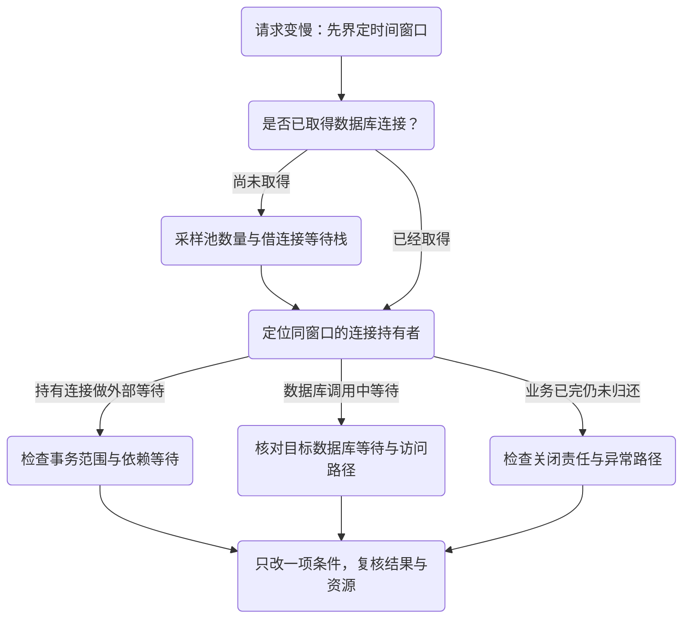

# 接口慢而数据库 CPU 不高：先查连接等待

请求已经变慢，数据库却不忙。延长超时之后，错误暂时少了，等待请求却继续增加。此时“SQL 慢”和“连接不够”都只是候选解释。第一步要定位等待发生在借连接之前、持有连接期间，还是数据库执行内部。

本文用既有受控例子说明取证顺序，没有虚构线上事故。池状态、线程和连接观察必须来自同一时间窗口；把几张不同时间的截图拼起来，可能得到不存在的因果关系。

## 三种相似症状，三条不同路径

| 观察到的现象 | 还不能下的结论 | 下一项区分证据 |
| --- | --- | --- |
| 调用线程在获取连接处等待 | 数据库一定慢、池一定太小 | 同时刻 active、idle、pending、total，及已有持有者在做什么 |
| active 很高但 SQL 不多 | 连接必然泄漏 | 持有者栈、事务开始/结束、外部等待与归还事件 |
| SQL 已进入数据库但迟迟不返 | 加连接就会更快 | 目标数据库当前等待、锁与执行计划；这需要另行数据库证据 |

`active` 表示连接已经借出，不等于正在执行 SQL。线程可能在事务里等待下游、锁或另一个 Future。数据库 CPU 低只能排除一部分计算型瓶颈，不能排除资源等待。

## 先确定谁在等谁

图里的分支是证据选择，不是看到一个数字就自动执行修复。持有者栈也只是采样：需要结合重复观察和开始/归还事件，判断它是短暂经过还是持续占用。

既有实验先确认持有者进入 latch 等待，再启动第二个事务。稳定窗口中池值为 active/idle/pending/total=`1/0/1/1`，并同时确认持有者在 latch、等待者在借连接。这里的 latch 模拟外部等待，**没有验证真实 HTTP 取消**。对应代码与观察方法在[连接预算的第一节](/knowledge/frameworks/data-access/connection-budget.html#_1-先把池中的三种数量分开)。

## 为什么“加池”和“加超时”都不能先选

如果同一事务把连接握在手里等待外部调用，扩大池会允许更多这样的持有者；它可能暂时减少借连接等待，也可能把更多负载送到下游。是否合理取决于数据库、下游容量和事务需要，不能从一条超时日志得出。

延长借连接超时改变的是等待耐心，不会自动缩短持有期。缩小事务范围则可能提前归还连接，但必须确认移出事务的业务动作是否仍符合原子性要求。两个方案改变不同条件，不能只比较错误数量。

先写出不允许被破坏的业务结果，再做一项受控对照：把无需参与本地提交的等待移到事务外，保留原例和同一采样方式。观察连接是否按预期归还，同时检查数据结果。既有对照见[缩小持有范围](/knowledge/frameworks/data-access/connection-budget.html#_2-缩小持有范围-与单纯延长耐心不同)。

## 两个容易误判的分支

**嵌套独立事务。** 外层挂起不等于归还外层连接；内层可能再索要一条。不能仅凭“单个请求通常一条连接”估算池需求。这里的机制推理不意味着已做真实大规模池耗尽压测，详见[REQUIRES_NEW 的连接需求](/knowledge/frameworks/data-access/connection-budget.html#_3-嵌套独立事务为什么可能索要第二条连接)。

**超时以后仍在执行。** 借连接超时、语句超时、事务超时与请求超时有不同作用点。超时错误到达调用方，不证明底层工作已经终止，也不能直接裁决业务是否提交。应继续查资源收尾与业务事实，而非无限重试。

## 复核与停止条件

修复之后至少回看三个结果：业务合同没有改变；等待与持有关系按预测变化；正常和失败路径的资源都收尾。恢复一段时间后没有再出现症状，仍不能证明所有输入都被覆盖，需要记录本次负载和未触达分支。

线程栈、SQL、请求关联信息可能带出路径、参数或个人数据。线上取证应遵守已有权限和采样预算，先收集能区分假设的最小信息；不要为了示例把完整生产日志上传到公开问题单。

**练习：** 如果 active 已下降而请求仍慢，下一步还应查什么？先判断等待是否已经转移到下游、响应写入或应用队列，再选择证据。连接池指标只能解释它所属的那一段。

来源与历史实验边界

本文复用[连接预算主文](/knowledge/frameworks/data-access/connection-budget.html)及[服务边界实验源码](/examples/spring-service-boundaries.zip)中已经核验的资源观察，没有新运行、新用例或生产性能记录。

固定实现入口：[HikariPool 6.3.3](https://github.com/brettwooldridge/HikariCP/blob/HikariCP-6.3.3/src/main/java/com/zaxxer/hikari/pool/HikariPool.java)、[ProxyConnection 6.3.3](https://github.com/brettwooldridge/HikariCP/blob/HikariCP-6.3.3/src/main/java/com/zaxxer/hikari/pool/ProxyConnection.java)。H2/latch 实验不覆盖目标数据库锁、驱动取消、真实外部网络或生产池大小。完整下载身份和历史范围见[实验与验证](/resources/experiments.html)。

