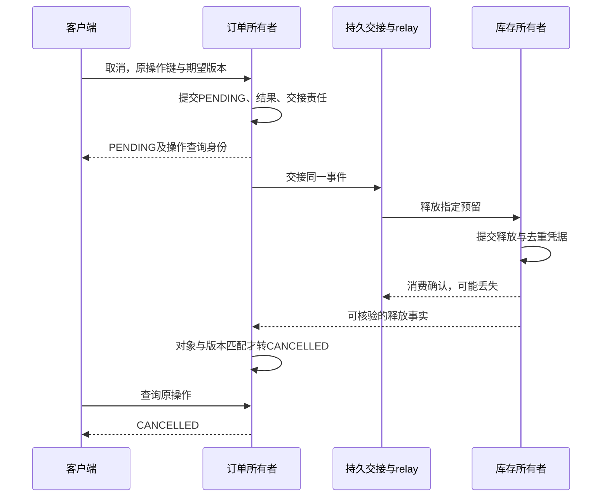

# 订单取消：已填写评审样板

状态：教学候选，无真实上线批准。日期：2026-10-03。数字均是设计输入，待真实证据替换。以下字段构成可复用评审卡；请保留硬约束、反驳条件与停止点，按你的项目更新。

## 1. 变更评审卡 {#change-card}

| 项目 | 本次决定或假设 | 仍需要的证据 |
| --- | --- | --- |
| 目标 | 客户与受限客服取消指定订单；导出与发布不能使交接责任丢失 | 产品确认返回语义和完成期限 |
| 基线 | 单团队共享部署、订单库存同库、可加入同一本地事务 | 实际调用/连接/事务边界和失败注入 |
| 范围 | 未履约订单的取消与预留释放；订单ID在租户内唯一 | 所有入口使用完整对象范围 |
| 不变量 | 无权限不改状态；CANCELLED对应已释放；同身份不重复释放 | 权限表、事务事实、重试和对账 |
| 候选语义 | 本地方案返回最终结果；异步方案只能先返回PENDING及查询身份 | 旧客户端理解待完成，不能把202当完成 |
| 非目标 | 付款退款、已发货撤回、跨仓和跨地域容灾 | 这些条件出现就重开评审 |
| 未知量 | 峰值、延迟、故障率、发布等待归因与运维成本 | 实测替换假设，不能借模型背书 |

“CANCELLED必须已释放”是正确性约束，不能用更好的p99或更低费用抵销。慢但没有损坏数据，与快速返回错误事实是不同问题。

版本冲突、幂等键冲突和正常权限拒绝可以是确定结果。响应超时却可能是未提交，也可能是提交后回复丢失；客户端须保留原操作身份查询或重试，不生成新键赌它没成功。

## 2. 权限矩阵延伸到工作者与重放 {#permission-matrix}

tenant与order ID只是选择器。可信主体来自已验证的会话/令牌边界，当前成员、订单归属和客服授权来自服务端事实。高风险操作要求及时撤销时，旧令牌成员快照不足以代表现在；在线检查或缓存也要写清陈旧窗口及依赖失败行为。[RFC7662 §4](https://datatracker.ietf.org/doc/html/rfc7662#section-4)

本例owner可读、可取消；客服仅凭未到期、绑定该订单归属代次的取消授权执行取消，不额外获得完整读取与任意修改能力。这是明确的业务选择，不是电商通用标准。

| 主体与依据 | red/o1读取 | red/o1取消 | 库存释放 | 核验内容 |
| --- | --- | --- | --- | --- |
| 当前owner Alice、仍是red成员 | 允许 | 状态CONFIRMED且版本相符才允许 | 不直接允许写库存 | 当前成员、对象、动作、版本 |
| red成员Bob，拥有另一订单 | 拒绝 | 拒绝 | 拒绝 | 成员不等于所有者 |
| blue成员Mallory，在blue也有o1 | 拒绝 | 拒绝 | 拒绝 | red/o1与blue/o1不同 |
| support，持red/o1限时取消授权 | 本授权不允许 | 未到期且归属代次相符才允许 | 不直接允许 | 保留实际操作者support和授权依据 |
| 缺失或无法验证身份 | 拒绝 | 拒绝 | 拒绝 | 身份系统故障不临时放行 |
| relay服务身份 | 无用户读取权 | 不能任意发起取消 | 只能交接自己负责的任务 | 来源、租户、事件及预留身份 |
| 库存worker身份 | 无用户读取权 | 不能替客户发命令 | 处理获授权释放任务 | 资源范围、事件版本、可信代次 |
| 恢复操作者 | 专门最小权限 | 不绕过不变量直接改状态 | 按获准修复步骤 | 原身份、原因、操作者、前后事实 |

[OWASP授权指南](https://cheatsheetseries.owasp.org/cheatsheets/Authorization_Cheat_Sheet.html)要求默认拒绝和逐请求检查。本例将其落实到结果：拒绝时订单、库存、操作结果及业务事件都不变。安全日志可记录拒绝，但不是“取消已接受”的业务事件。

检查与写入之间仍可能变化。Alice读完订单后成员被撤销，或其他操作已更新版本，提交就要重新裁决当前事实并用适当锁/条件写入；不能把旧allowed布尔值带到最后。普通RR快照不保证当前事实；订单version也不一定随成员记录改变。[MySQL锁定读](https://dev.mysql.com/doc/refman/8.4/en/innodb-locking-reads.html)需要结合事务条件验证。

幂等结果也不能越权泄漏。模型先重查权限，再按 `(tenant, actor, operation_id)` 查结果；同键而订单、理由或模式不同返回KEY_CONFLICT。这是一种明示作用域，代理调用若更换actor或租户，应设计身份映射，不能隐式跨范围复用。

## 3. 两个合理方案，由关键条件分岔 {#two-options}

### L：本地完成

原题面先选L。用例经订单与库存公开能力，在一个事务中写最终取消、释放、操作结果及必要事件责任。CANCELLED响应意味着相应事实共同成立。

优势是没有新增跨服务中间状态，失败可共同回滚；代价是共享事务、数据库和发布故障域。慢SQL仍会延长连接占用。必须通过实际适配器证明共同提交，并证明调用经过正确代理；方法有注解不够，self invocation会绕过代理通知。[Spring6.2代理机制](https://docs.spring.io/spring-framework/reference/6.2/core/aop/proxying.html)

### E：先受理，再由独立库存释放

现在改变关键条件：**库存已经独立运行，不能加入订单事务；产品接受取消先受理、随后完成。** E于是成为合理候选。它不必再拆订单服务，但要承认两方分别提交。

订单共同保存CANCEL_PENDING、操作结果PENDING和交接责任；库存共同提交释放与去重凭据；订单收到匹配释放事实才转CANCELLED。最终事实、消息交接和broker确认不同。[Outbox](https://microservices.io/patterns/data/transactional-outbox.html) · [RabbitMQ4.1确认边界](https://www.rabbitmq.com/docs/4.1/confirms)

回传释放事实也需要可靠路径，例如库存Outbox或按原身份查询；画一条回箭头不代表问题解决。模型将这些接口压成显式步骤，没有真实持久化或消息回传。

| 条件 | L接受的代价 | E接受的代价 |
| --- | --- | --- |
| 必须当次完成、可共同事务 | 短本地事务与共享故障域 | 无等价最终结果就不符合要求 |
| 库存独立、允许待完成 | 共享事务前提不成立，需要改结构或需求 | 持久流程、查询、重试、积压处理 |
| 只需缓解导出干扰 | 先限流、查询和预算 | 不能因有消息“更先进”而引入E |
| 独立发布确有收益且有人运维 | 接受共享发布或重开评审 | 承担兼容、容量、告警、恢复责任 |

不为扩展性打9分、简单性打7分来求“客观最优”。如果库存不能共同提交，而产品也不接受PENDING，就存在未解决的需求冲突；评分不能替它作决定。

## 4. 目标与预算围绕同一条用户路径 {#slo-budget}

本节数值都是**可替换的设计输入**，不是执行保证，也不是Python测得的吞吐。

### 及时回应与最终完成分开

候选目标一：滚动28天内，取消入口99.9%的合格尝试在300ms内得到正确决定。合格事件在入口预定义：语法有效的业务请求；预先标记的探针/负载生成流量排除，已证实的无效凭据与正常权限拒绝另计安全结果。身份后端不可用、过载拒绝、发布失败或超时不能事后删除；误拒合法用户更不能算“正常鉴权失败”。

好事件不是HTTP2xx的同义词。L只有共同提交后才可返回CANCELLED，E只有PENDING与交接责任已共同保存才算正确受理。正确且及时的版本冲突可事先约定为有效决定，但要另报冲突量，防止正常功能不可用时只剩快速冲突。

候选目标二仅针对E：已受理的唯一取消操作99%在30秒内完成。按原操作键去重、按受理时刻组成队列；只有度过30秒观察期限的操作进入完成率分母，到期仍PENDING算未及时完成。另报未成熟操作量、最老待办年龄和未知状态，不能删掉永远没完成的操作。

用户操作可以产生多次外部尝试；两份指标的单位不同。内部relay重试不加入外部尝试分母，用户重试会加入。PENDING很快不证明释放很快。[Google SRE的SLO方法](https://sre.google/workbook/implementing-slos/)用于定义用户事件和决策目标，阈值由本例另设。

固定演算：10,000合格尝试，9,994好事件，4次服务错误和2次过载拒绝；预算允许10个坏事件，已经用6，剩4。删掉2次拒绝后，分母会错成9,998，预算余量错成5.998。服务没有变好，是漏算了；模型用精确分数拒绝这个变体。

候选政策：任何权限越界、重复释放或责任丢失，都停止扩大变更；剩余预算耗尽时暂停非修复发布。小范围验证另设“归因于本变更的2个新增坏事件就暂停扩大”的保守门槛，归因不明也暂停。这是本题政策，不是Google规定的通用阈值。[错误预算政策示例](https://sre.google/workbook/error-budget-policy/)强调把预算连接到实际行动。

零流量没有可计算比例，遥测缺失表示不知道。下一阶段需要预定观察窗口和场景覆盖，不以一次绿色请求证明达标。正确性硬约束也不以0.1%预算容忍。

### 发布峰值也要算进总额

设计数据库总连接120，留20给维护恢复，应用可用100。取消应用4个副本，每副本池16；两个worker各4。发布额外1副本时上限 `(4+1)×16+2×4=88`；额外2副本时104，超过100。

88不证明足够快，104也不说明必然同时打开；它检查配置允许的最坏占用。必须包括新旧重叠、其他同库应用及临时修复工具。本例只给表中组件分配了100，如果再有报表组件，要先重新分配，不能漏掉后还称总额。

进一步为每副本入口设8个执行名额、16个等待名额和排队截止；满了明确拒绝，不能返回已受理。若E已持久受理、只是即时唤醒worker失败，持久任务仍欠着完成责任。[ThreadPoolExecutor SE21](https://docs.oracle.com/en/java/javase/21/docs/api/java.base/java/util/concurrent/ThreadPoolExecutor.html)解释有界队列、线程增长与拒绝职责；名额不是吞吐结论，仍需测连接持有、热点锁、CPU和下游时间。

待交接任务可能按租户、状态、重试时间取批次，索引要跟完整过滤、排序和数据分布一起验证。[MySQL8.4组合索引](https://dev.mysql.com/doc/refman/8.4/en/multiple-column-indexes.html)解释前缀，但“有索引”不保证扫描足够少。真实计划、结果与锁行为仍not-run。

## 5. 失败矩阵：谁还欠什么 {#failure-matrix}

| 失败位置 | 调用者可能看到 | 必须保留的事实 | 下一步与停止条件 |
| --- | --- | --- | --- |
| 撤销或授权到期 | 拒绝 | 业务状态不变，安全记录另计 | 不扩大权限；越权写入即停并查影响 |
| 检查后版本变化 | STALE_VERSION | 新版本不被旧结果覆盖 | 重读并重授权，不重用旧allowed |
| L写订单后、释放前失败 | 存储失败 | 两者及操作结果共同回滚 | 对账全部状态；半提交即停写修复 |
| 提交后响应丢失 | 超时、未知 | 原操作身份有确定结果 | 原键恢复，不换新键 |
| E受理后尚未交接 | PENDING | Outbox责任仍可查 | 有界重试与年龄告警；缺责任即停 |
| 释放后消费确认丢失 | 重投 | 释放与去重凭据共同成立 | 返回原结果、再确认、不再次加库存 |
| 旧worker迟到 | 资源拒旧代次 | 已见新水位与业务状态不退回 | 新代次未被资源见过时不能声称已生效 |
| 新载荷旧消费者不识别 | 明确不兼容/毒消息 | 原身份、错误和待修责任 | 有界隔离告警，不热重试或直接丢弃 |
| 查询投影落后 | 列表显示旧状态 | 权威版本不倒退 | 操作查询回权威入口，不重做取消 |
| 发布摘流尚未传播 | 请求仍到旧实例 | 闸门、在途与持久责任分开 | 拒新工作，等待或保留恢复责任 |
| 旧二进制遇到PENDING | 不识别新状态 | 新写入与交接账仍在 | 兼容回退或前向修复，不能直接旧镜像 |

fencing只限制资源已接受高代次之后的旧写。资源还未见新代次时，旧请求仍可能被接受。可信分配、传递、比较与写入原子性都需要实证；[etcd3.6 revision保证](https://etcd.io/docs/v3.6/learning/api_guarantees/#revision)不会自动保护任意SQL或HTTP资源。

发布时readiness提供信息，应用仍要停止接纳、等存量工作、最后释放依赖。Kubernetes1.34的外层终止宽限包含preStop，不在hook返回后重新赠送一整段时间。[终止流程](https://v1-34.docs.kubernetes.io/docs/concepts/workloads/pods/pod-lifecycle/#pod-termination)。Go worker的close通知也不等于join或远端副作用完成；[Go内存模型](https://go.dev/ref/mem)说明的是特定同步关系。

## 6. 回退代码与修复事实分开决定 {#rollback-forward}

旧镜像只回答能否换回代码，不回答它能否解释新事实。按最近写入的状态分三段：

1. 尚无新格式写入：可以停开关、退路由，但要查已提交未回应的操作，不能只看流量数
2. 已有新状态、旧版明确兼容：先停新增E，等待或接管存量责任，对账订单、操作结果、释放凭据、原事件身份及水位；旧版必须认识PENDING且不会跳过新权限或吞掉新任务
3. 旧版不认识新状态/责任：保留兼容读取与唯一写入权，前向修复消费者或转换器，完成已经接受的取消；停新流量只能限制损失，不能取消既有责任

释放后库存可能被别单占用，不能直接把订单改回CONFIRMED。补偿不是抹掉历史；重新建立订单要重新校验并形成新操作。支付和发货不在本模型可逆范围内。

切换写入者要有唯一权威入口、资源端代次或等价的权威事务保护，并完整交接待办。只比较订单行数不够：订单相同但操作结果或事件责任丢了，下一次重试仍会失败。

模型故意采用保守回退条件：v1不懂PENDING与新Outbox责任，只要还存在该账或待完成订单就拒绝直接回退。即使已CANCELLED，账未完成兼容迁移也不放行。它不实现归档、反向同步或实际回退。

## 7. 可停止、也可推翻的决定样板 {#decision-record}

下表是填好的教学候选，不冒充真实团队批准；下载的decision-record可按实际项目替换证据。

| 栏位 | 本题填写 |
| --- | --- |
| 决定 | 原约束选L，先在模块化单体内共同提交取消与释放 |
| 依据 | 本地事务可用，产品尚未批准PENDING，缺少独立运行收益实测 |
| 接受的代价 | 共享发布与数据库故障域，用接纳/查询/连接预算限制竞争 |
| 暂缓选项 | E在库存独立且产品接受待完成时重新评审 |
| 不得破坏 | 默认拒绝、租户对象范围、最终事实、一次有效释放、待办可发现 |
| 责任角色 | 产品管语义，订单管命令结果，库存管释放，平台管容量发布，安全管委托 |
| 能推翻什么 | 不能共同事务就推翻L前提；真实隔离收益与运维能力具备则重开E |
| 当前证据 | 来源阅读、有限模型及静态检查；真实外部系统not-run |
| 允许继续 | 设计与隔离测试准备；仅凭模型不能批准真实流量 |

以下检查点适用于**从仍能共同本地提交的L评审是否进入E**。如果库存已经独立、共同事务前提已消失，L不再是可行退路；此时若PENDING也未获接受，应停止该变更并重新协商需求或结构，不能声称“保留L”解决冲突。

| 检查点 | 继续需要 | 不满足停在哪里 |
| --- | --- | --- |
| 语义与权限明确 | 产品认可PENDING与期限；全部入口有权限裁决；无不明写入者 | L前提仍成立时保留L；已不能共同提交时停止并重开需求/结构 |
| 适配器与兼容 | 真实事务失败注入、同键重放、旧新载荷、撤销与资源代次通过 | 保持写路径，修接口与存储 |
| 小范围与观测 | 完整分母、预定窗口/场景、峰值预算、新增坏事件未达暂停线 | 停扩大，保留兼容读，完成既有责任 |
| 收敛与停止 | 达目标、无未知积压、有人能恢复、无更多独立收益 | 可停在L或局部E，不顺带拆整个订单 |

任何已知越权或重复释放都要调查影响并修复事实，不按0.1%预算容忍。更改池、最大副本、消息版本或权限来源，应重新核验相关条件。质量达标也不是永久发布通行证。

