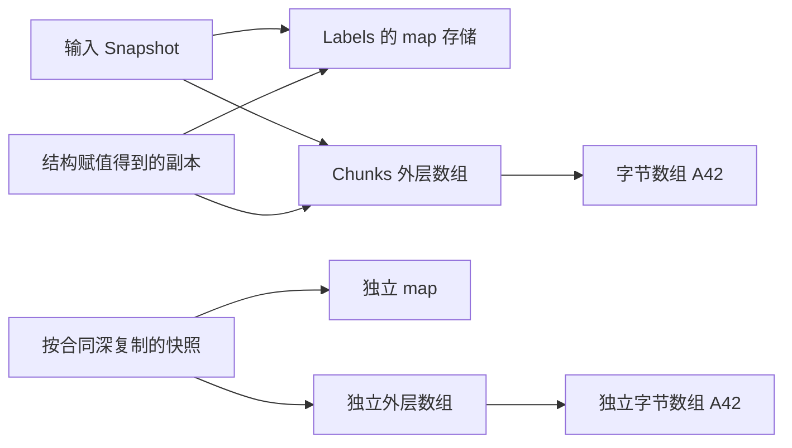

# 值与容器：slice、map 和别名

一个函数收到 `[]byte("A42")`，把它保存成“请求快照”，随后调用方为了复用缓冲把首字节改成 `X`。快照应该还是 `A42`，实际却变成了 `X42`。这不一定涉及 goroutine：单线程里顺序执行，也能破坏“保存后不再改变”的合同。

先回答两个具体问题：函数调用复制了什么？副本仍能到达哪些可变存储？本章的完成任务是：给一份含 map 与嵌套 slice 的结构定义复制边界，预测修改两侧别名的结果，然后让默认测试同时检查原输入、返回值和旧别名。

共用实验下载：[Go 工程基础源码包](/examples/go-core-engineering-lab.zip)。它是进程内教学项目，后续可把同一判断方法带到 HTTP 输入、数据库返回值和控制器缓存对象；这里不依赖那些系统。

## 1. 赋值复制值，不自动复制可达对象 {#value-and-reachable-storage}

`b := a` 的结果取决于 `a` 的类型。整数值的副本互不影响；数组赋值复制所有元素；struct 赋值复制所有字段。如果元素或字段本身含引用，继续沿引用追踪，不能在“数组/struct 已复制”处停下。

| 值 | 赋值后独立的部分 | 仍可能共享的部分 |
| --- | --- | --- |
| `[2]int` | 两个整数元素 | 没有来自这些元素的可变引用 |
| `[2][]byte` | 两个 slice 值 | 各 slice 所指的字节数组 |
| `struct{ N int; Tags map[string]string }` | `N` 与 map 值所在的字段 | map 的键值存储 |
| `[]byte` | slice 的长度、容量与引用组成的值 | 可达的底层字节数组 |
| `map[string][]byte` | map 值 | map 条目和条目里的字节数组 |

“slice 由指针、长度、容量组成”适合推演操作，不能因此依赖其内存布局或用 `unsafe` 猜 ABI。规范给出的是可观察语义：同一底层数组上的 slice 共享元素，数组值本身则是完整的值。[Go 规范：值的表示](https://go.dev/ref/spec#Representation_of_values)



文字版：`dst := src` 只走到图中第二个结构值。要允许输入与输出各自修改，图中每个可变存储节点都必须有明确归属，或改为有同步约束的共享。

## 2. append 改变哪个值，覆盖哪个元素 {#append-and-capacity}

先不运行，手算这段代码的三份观察值：

```go
base := []int{10, 20, 30, 40}
view := base[:2]
grown := append(view, 99)
```

`view` 的长度是 2、容量是 4。空间足够时 append 复用底层数组，写入数组的索引 2。`grown` 因此是 `[10 20 99]`，`base` 是 `[10 20 99 40]`，`view` 仍然只有 `[10 20]`。append 返回的新 slice 值不会回头改变旧变量的长度。[Go 规范：append](https://go.dev/ref/spec#Appending_to_and_copying_slices)

现在只改一处：`view := base[:2:2]`。容量被限制为 2，append 第三个元素需要新数组。结果 `grown` 仍是 `[10 20 99]`，但 `base` 保持 `[10 20 30 40]`。接着执行 `grown[0]=77`，前一种情况会改到 `base[0]` 和 `view[0]`，后一种不会。

| 条件 | append 后旧数组 | 再写 `grown[0]=77` 后旧别名 |
| --- | --- | --- |
| `base[:2]`，容量足够 | `[10 20 99 40]` | `base[0]`、`view[0]` 都是 77 |
| `base[:2:2]`，容量不足 | `[10 20 30 40]` | 两个旧别名的首元素仍是 10 |

三下标切片只限制通过这个 slice 追加时可利用的容量。它没有复制前两个元素：在 append 之前写 `view[0]`，两种写法都能改到 `base[0]`。若元素类型是 `*Item` 或 `[]byte`，扩容复制元素值以后，元素内部引用还可能共享。

`TestAppendAliasing` 检查表中两个分支及所有旧别名，不断言新容量是 4、8 或“总是翻倍”。增长算法与分配粒度是具体实现细节，语言合同没有承诺一个通用倍数。

`copy` 也不等于递归复制。`copy(dst, src)` 只复制两者长度较小的元素数，允许源与目标重叠。本实验从 `[1 2 3 4]` 执行 `copy(x[1:], x[:3])`，固定预期为 `[1 1 2 3]`。手写正向循环却可能反复读到自己刚覆盖的 1；有“都是复制”这个相似名称，不代表操作合同相同。

## 3. map、nil 与空值是三个不同问题 {#map-and-container-shape}

`alias := labels` 不会创建第二张 map。通过 alias 新增、覆盖或删除键，labels 也能观察到。把 alias 变量重新赋成一张新 map，才改变 alias 的指向，labels 本身不跟着换。`maps.Clone` 创建新 map，但键和值仍按普通赋值复制；如果值为 `[]byte`，新旧条目里的字节数组仍共享。[maps.Clone API](https://pkg.go.dev/maps@go1.27.1#Clone)

不要用迭代顺序推导业务顺序，也不要把“没有看到 concurrent map 报错”当成可并发读写的证明。输出需要稳定顺序时，先显式排序键；共同修改需要同步或独占协议。map 的内部桶布局不在本章合同中。

对 nil map 的查找返回元素零值和 `ok=false`，delete 安全；给 nil map 新增条目会 panic。`m["zero"]==0` 无法分辨缺失与存在的零值，要读 `v, ok`。这是 `TestCopyOverlapAndNil` 的语言行为检查；它捕获写 nil map 的 panic，并不拿 panic 充当“业务正确拒绝输入”。

对 slice，nil 与已分配的空 slice 都有 `len==0`，但并非在所有边界等价：

| 检查/操作 | `var s []int` | `s := []int{}` |
| --- | --- | --- |
| `len(s)` / 可追加 | 0 / 是 | 0 / 是 |
| `s == nil` | true | false |
| `encoding/json.Marshal(s)` | `null` | `[]` |

这里刻意用 `[]int`：`[]byte` 在 `encoding/json` 中有特殊的 base64 编码规则，不能把上表直接换成字节 slice。字段的 `omitempty` 等标签又是另一层选择。[encoding/json.Marshal](https://pkg.go.dev/encoding/json@go1.27.1#Marshal)

应用可以决定“无值”和“空集合”是否等价，但决定后要在复制、序列化与测试里一致。本实验选择保留 nil/空形状，故不能用 `append([]byte(nil), src...)` 处理所有输入：非 nil 的空输入会变成 nil。对于非空 `[]byte`，这写法仍能完成独立字节复制。

## 4. 沿一段真实源码找出浅复制的边界 {#clone-source-walkthrough}

下面是 Go `go1.27.1` 标签的 `slices.Clone` 完整函数，保留原注释，逐字对应 `src/slices/slices.go` 的 355–363 行。它是标准库真实实现，不是我们虚构的伪代码；BSD-3-Clause 许可证与完整源文件随实验保存。[固定版本源码](https://github.com/golang/go/blob/go1.27.1/src/slices/slices.go#L355-L363)

<!-- snippet: go-core.slices-clone -->
```go steps
// !step(2:5) nil 输入直接返回 nil。
// !step(6:8) 非 nil 输入从空值开始追加元素；注释说明避免保留原大数组。
func Clone[S ~[]E, E any](s S) S {
	// Preserve nilness in case it matters.
	if s == nil {
		return nil
	}
	// Avoid s[:0:0] as it leads to unwanted liveness when cloning a
	// zero-length slice of a large array; see https://go.dev/issue/68488.
	return append(S{}, s...)
}
```

分三步读：nil 输入直接返回 nil；非 nil 空输入从 `S{}` 开始，保留非 nil 形状；append 复制的是 `E` 类型元素的值。对 `[][]byte`，E 是 `[]byte`，所以只复制外层元素。源码注释还解释了为什么不使用引用原大数组的 `s[:0:0]`；这是当前实现避免零长度克隆继续保持原数组存活的选择。

API 明确允许返回值有额外容量，所以调用方不能根据源码中的短写法断言 `cap(result)==len(result)`。同理，源码复核能解释今天的实现，应用真正依赖的应是 API 的浅复制、保留 nilness 等合同。[slices.Clone API](https://pkg.go.dev/slices@go1.27.1#Clone)

## 5. 为一个有限数据结构定义完整快照 {#snapshot-contract}

实验的 `Snapshot` 只有字符串、`map[string]string` 和 `[][]byte`。它的复制合同是：值相等，nil/空形状相同，输入与输出的可变存储互不影响。输入中两个 chunk 即使原先指向同一数组，复制后也各有自己的数组；保留内部别名拓扑不属于这个合同。

<!-- snippet: go-core.clone-snapshot -->
```go steps
// !step(2:8) 字符串值直接复制，非 nil 标签 map 逐项复制。
// !step(9:14) 外层 slice 分配后，每一块字节还要独立复制。
// !step(15:15) 返回的可变成员只属于这份快照。
func CloneSnapshot(src Snapshot) Snapshot {
	dst := Snapshot{Name: src.Name}
	if src.Labels != nil {
		dst.Labels = make(map[string]string, len(src.Labels))
		for k, v := range src.Labels {
			dst.Labels[k] = v
		}
	}
	if src.Chunks != nil {
		dst.Chunks = make([][]byte, len(src.Chunks))
		for i, chunk := range src.Chunks {
			dst.Chunks[i] = CloneBytes(chunk)
		}
	}
	return dst
}
```

`Name` 是字符串值，可以直接赋值；Labels 中的键和值也是字符串，因此复制 map 条目足够。Chunks 必须复制外层，再调用 CloneBytes 复制每层字节。若未来把标签值改成指针，或新增 `*Config` 字段，这个实现需要重新审查，不能继续使用“深复制已完成”的旧结论。

`TestCloneIsolation` 的输入将同一 `A42` 数组放入两个 chunk。测试按以下顺序观察：

1. 克隆以后改原 map 与原字节：两个输出 chunk 都必须还是 `A42`
2. 改输出的第一块为 `Y42`：原来两个别名必须仍为 `X42`，输出第二块仍为 `A42`
3. 分开检查 nil、空 map、空外层 slice、nil 内层 slice、空内层 slice 的形状

只检查 `reflect.DeepEqual(src,dst)` 的初始结果看不出共享。坏实现直接返回 src，初始值完全相等，直到后续修改才暴露问题。默认测试的 `CONTRACT[clone-isolation]` 就是这个反例的定位标记。

## 6. 复制和锁各保护哪一段时间 {#store-boundaries}

`Store.Put` 先复制调用方输入，再持锁替换内部值；`Store.Get` 在读锁期间复制内部值，返回私有副本。这使“Put 返回后调用方可以复用输入”和“Get 返回后调用方可以独立修改输出”成为可测试的边界。锁不能保护调用方自己在另一个 goroutine 中同时修改 Put 正在读取的输入，那仍然违反入口合同。

Store 含有 `sync.RWMutex`，第一次使用后不能按值复制。接口应持有 `*Store`；不能为了返回“快照”把整个带锁 Store 复制出去。`TestConcurrentStore` 让四个 worker 有限地写入两字节相等的快照并读取，检查不变量与返回副本，再由 `-race` 观察这些实际执行到的访问路径。通过只能说明这组路径未报告竞争，不构成任意调用顺序的全局证明。

进入后续服务或控制器时，先问三个问题：数据是谁分配的；拿到它是否表示拥有修改权；修改后靠什么动作发布？控制器缓存里读出的对象、共享响应模板、池化字节缓冲都需要回答这些问题。具体客户端提供什么 DeepCopy 合同，要按它的 API 单独验证。

## 7. 改一个条件，再用实验复核 {#exercises}

**练习 A：把 `base[:2:2]` 换成 `base[:2:3]`，预测 append 和之后写首元素。** 参考推理：容量 3 能容纳第一个新增元素，因此仍共享旧数组，索引 2 变成 99，之后所有旧别名的首元素变为 77。用 `TestAppendAliasing` 加一行明确预期复核，不比较运行时增长倍数。

**练习 B：将 Labels 改成 `map[string][]byte`，只用 maps.Clone 是否足够？** 参考推理：map 条目独立，但条目值的 slice 仍引用原字节。新增测试应先改旧值字节，再换掉整个旧键，分别区分“条目独立”和“嵌套数组独立”。

**练习 C：为什么 race 通过不能证明浅复制快照正确？** 参考推理：按“先克隆、再改输入、最后读输出”的顺序执行，没有并发访问也会泄漏修改。要分别保留语义断言与 race 检查，两者回答不同问题。

**练习 D：只有长度为 0 的大 slice 还需要隔离吗？** 参考推理：先确定容量是否允许再切片或 append，以及是否有内存保留需求。不能仅凭长度推断没有可达数组；也不能把“减少保留”混成“已有元素的深复制”。

## 8. 怎样核对本章的结论 {#evidence-and-limits}

下载包中 `snapshot.go`、`snapshot_test.go` 是本章主线。先运行默认测试，再查看 mutations 阶段对 `clone-alias` 的精确拒绝；并发部分另看 race 阶段。源码阅读、静态片段校验、实际 Go 执行是独立记录；当前发布包的状态以 verification 记录为准，不用文字预期替代实际运行。

这一组例子证明的是约定数据结构与有限调用的结果。它没有测网络、数据库、真实 API server，也没有给出复制开销的通用上限。下一步适合阅读已有的 [channel 所有权交接](../concurrency/channel-memory-ownership.md)，把“哪些对象仍共享”接到“什么时候允许访问”。
