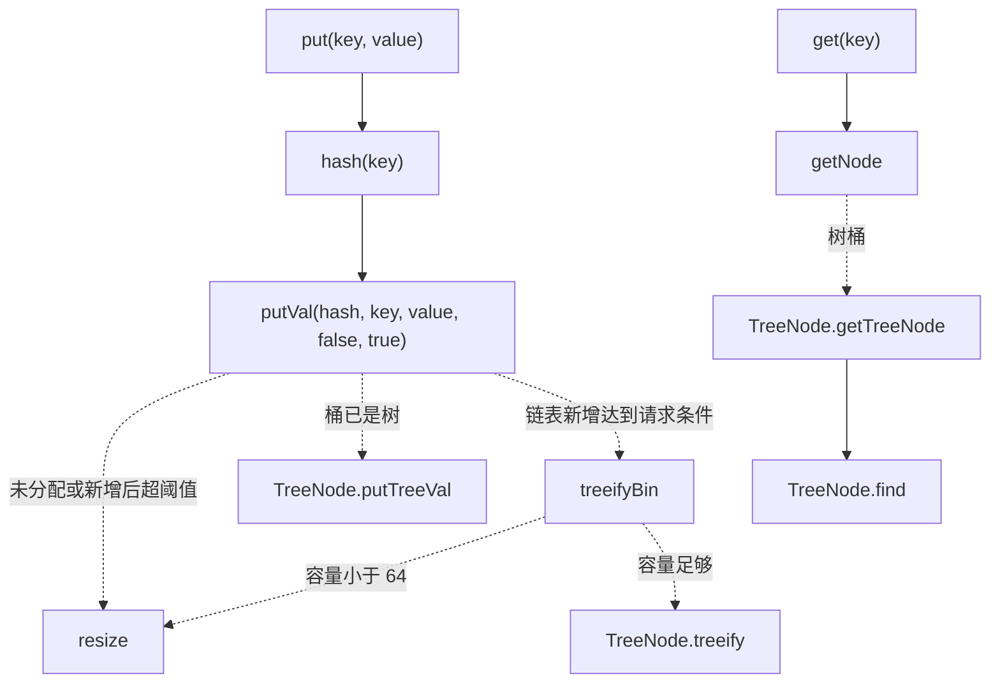
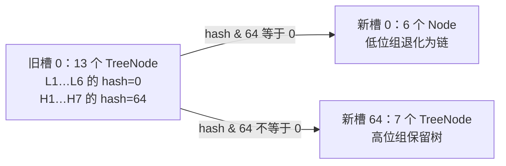

# 沿 OpenJDK 21 源码追踪 HashMap 的状态变化

读这份源码时，最有用的问题不是“下一行做了什么”，而是：**这个分支守住了哪个不变量，走完后哪些状态应该改变，哪些不能改变？**

继续使用[机制主篇](./hashmap.md)的 A/B/C/D：原始散列分别为 1、5、9、13，构造 `new HashMap<>(4)`，先放 A，再用相等的 A' 更新，随后依次放 B、C、D。这样每读一个条件，都能用确定的输入判断它走哪边。

源码固定为 [OpenJDK jdk-21+35 / HashMap.java](https://github.com/openjdk/jdk/blob/jdk-21%2B35/src/java.base/share/classes/java/util/HashMap.java)。以下标为“原源码摘录”的片段保留原表达式，只去除统一缩进，Code Hike 注解单独添加；版权归 Oracle 及其他上游贡献者，许可为 GPL v2 with Classpath Exception，[原始许可](https://github.com/openjdk/jdk/blob/jdk-21%2B35/LICENSE)随实验包保留。片段依赖所在类上下文，不能单独当作应用程序编译。

## 1. 先找入口、状态与不变量 {#reading-map}

先读这几段，再去看平衡树旋转；不要被两千多行文件长度决定阅读顺序。

| 位置 | 要回答的问题 |
| --- | --- |
| [Node / TreeNode](https://github.com/openjdk/jdk/blob/jdk-21%2B35/src/java.base/share/classes/java/util/HashMap.java#L277-L316) · [树字段](https://github.com/openjdk/jdk/blob/jdk-21%2B35/src/java.base/share/classes/java/util/HashMap.java#L1961-L1974) | 每条映射保存什么，桶的链与树各负责什么 |
| [字段与构造器](https://github.com/openjdk/jdk/blob/jdk-21%2B35/src/java.base/share/classes/java/util/HashMap.java#L382-L479) | table 什么时候实际分配，threshold 何时转换含义 |
| [hash](https://github.com/openjdk/jdk/blob/jdk-21%2B35/src/java.base/share/classes/java/util/HashMap.java#L320-L339) | 调用方传给 putVal 的 int 从哪里来 |
| [put / putVal](https://github.com/openjdk/jdk/blob/jdk-21%2B35/src/java.base/share/classes/java/util/HashMap.java#L617-L672) | 新增、更新、碰撞分别在哪里完成 |
| [resize / treeifyBin](https://github.com/openjdk/jdk/blob/jdk-21%2B35/src/java.base/share/classes/java/util/HashMap.java#L683-L780) | 容量与桶形态什么时候改变 |
| [get / getNode](https://github.com/openjdk/jdk/blob/jdk-21%2B35/src/java.base/share/classes/java/util/HashMap.java#L562-L603) | 写入与读取是否使用同一套匹配规则 |

阅读中持续检查四件事：

1. 有效键契约下，一个相等键只能对应一条映射；不能因为碰撞就覆盖不相等的键
2. 每个节点在当前容量下应从正确的桶被找到；扩容改变索引掩码时必须迁移
3. 新增才增加 `size`，覆盖已有值不增加；返回值应反映此前的映射
4. 链表和树形是桶的实现细节；切换形态必须保留键值关系

HashMap 的 `key` 字段是 final 引用，**不是对键对象的深冻结**；`Node.hash` 也是 final，保存的是当次插入使用的 hash。这个组合正是可变键反例的实现基础。

### 主调用链有分支，不是流水线



文字版：实线是该分支的直接调用顺序，虚线是有条件才发生的调用。`putVal` 不会每次既扩容又树化；`getNode` 也不会为了普通链表进入树查找。

## 2. putVal：关键是两个返回区间 {#putval}

公开 `put` 只有一个核心调用：`putVal(hash(key), key, value, false, true)`。`onlyIfAbsent=false` 允许覆盖旧值；`evict=true` 传给插入后钩子，服务于子类行为，不要把它解释成普通 HashMap 自带缓存淘汰。

下面是 [631–672 行原源码](https://github.com/openjdk/jdk/blob/jdk-21%2B35/src/java.base/share/classes/java/util/HashMap.java#L631-L672)。它保留完整方法，避免截断返回路径造成“更新也会 size++”的错觉。

<!-- snippet: hashmap.putval -->
```java steps
// !step(4:7) A 首次写入时 table 为 null，resize 先初始化；选中槽 1 为空，于是创建节点，稍后才增加 size。
// !step(10:14) A' 的 hash 与首节点一致且键相等，e 指向旧节点；如果桶已是树，才转交 putTreeVal。
// !step(16:27) B、C、D 与已存键都不同，沿 next 找尾部追加。binCount 只属于这条链表新增路径；treeifyBin 是有条件请求。
// !step(29:35) 命中已有键时在这里覆盖并返回旧值。A' 返回 a1，不经过后面的 size 和 modCount 增量。
// !step(37:41) 新增才到这里。D 是第 4 条映射，4 大于 threshold 3，于是再次调用 resize；返回 null 表示此前没有该键。
final V putVal(int hash, K key, V value, boolean onlyIfAbsent,
               boolean evict) {
    Node<K,V>[] tab; Node<K,V> p; int n, i;
    if ((tab = table) == null || (n = tab.length) == 0)
        n = (tab = resize()).length;
    if ((p = tab[i = (n - 1) & hash]) == null)
        tab[i] = newNode(hash, key, value, null);
    else {
        Node<K,V> e; K k;
        if (p.hash == hash &&
            ((k = p.key) == key || (key != null && key.equals(k))))
            e = p;
        else if (p instanceof TreeNode)
            e = ((TreeNode<K,V>)p).putTreeVal(this, tab, hash, key, value);
        else {
            for (int binCount = 0; ; ++binCount) {
                if ((e = p.next) == null) {
                    p.next = newNode(hash, key, value, null);
                    if (binCount >= TREEIFY_THRESHOLD - 1) // -1 for 1st
                        treeifyBin(tab, hash);
                    break;
                }
                if (e.hash == hash &&
                    ((k = e.key) == key || (key != null && key.equals(k))))
                    break;
                p = e;
            }
        }
        if (e != null) { // existing mapping for key
            V oldValue = e.value;
            if (!onlyIfAbsent || oldValue == null)
                e.value = value;
            afterNodeAccess(e);
            return oldValue;
        }
    }
    ++modCount;
    if (++size > threshold)
        resize();
    afterNodeInsertion(evict);
    return null;
}
```

这里的 `e` 不只有一种含义。遍历时它是下一个节点；找到相等键时它是被更新的节点；链尾追加时它仍为 null，所以跳过旧映射返回区间，进入新增计数区间。若只看局部截图，很容易把这三种状态混在一起。

`afterNodeAccess`、`afterNodeInsertion` 在 HashMap 本体中没有实际动作，是给 LinkedHashMap 等子类的衔接点。源码中的可扩展结构不等于调用者正在使用那个子类的顺序或淘汰策略。[钩子定义](https://github.com/openjdk/jdk/blob/jdk-21%2B35/src/java.base/share/classes/java/util/HashMap.java#L1935-L1960)

### 更新到底替换了什么？

A' 命中之后修改的是 `e.value`。已有节点的 `key` 引用没有在这段代码里换成 A'，`size` 和这次调用的结构修改计数也不增加。这个实现观察不应变成依赖“Map 永远保留某个具体键对象”的通用业务契约；业务应依赖键的相等性。

`put` 返回 null 还存在“旧值本来就是 null”的可能，因此不能只靠返回值判断新增了映射。公开 `containsKey` 能判断键是否存在，但在有并发写入时分开的两个调用不是原子检查。

## 3. resize：先定容量，再迁移，别把初始化当搬家 {#resize-source}

[resize 的前半段](https://github.com/openjdk/jdk/blob/jdk-21%2B35/src/java.base/share/classes/java/util/HashMap.java#L683-L711)有三种状态：

| 调用前状态 | 如何确定新容量 | 本例 |
| --- | --- | --- |
| 已有数组 `oldCap > 0` | 通常翻倍，达到最大容量时走饱和分支 | D 插入后 4 → 8 |
| 数组未分配，但 `oldThr > 0` | 将 threshold 中暂存的目标容量作为新容量 | A 首次写入，目标为 4 |
| 两者都为 0 | 使用默认容量与默认阈值 | 无参构造器首次写入 |

“通常”不能删掉：`MAXIMUM_CAPACITY = 1 << 30`；到达上限时把阈值设为 `Integer.MAX_VALUE` 并返回旧表，不再无限翻倍。并且非常小的容量、自定义负载因子、整数截断和饱和分支，都不能用“阈值永远精确等于 0.75 × 容量”一笔带过。

确定新容量和阈值、分配新数组后，才扫描旧表。每个非空旧桶分三类处理：

- 只有一个节点：直接用保存的 hash 与新掩码计算目标槽
- 树桶：调用 `TreeNode.split`，还要处理分组后的树/链形态
- 普通链：拆成低位链和高位链，再分别放到 `j` 与 `j + oldCap`

### 普通链拆分：为什么要保存 next，又要把尾部置空？

下面是 [722–749 行原源码](https://github.com/openjdk/jdk/blob/jdk-21%2B35/src/java.base/share/classes/java/util/HashMap.java#L722-L749)，上下文是容量 4 → 8、旧槽 1 的 A → B → C → D。上游已有局部变量 `e`、`j`、`oldCap`、`newTab`，此处是内部片段。

<!-- snippet: hashmap.resize-split -->
```java steps
// !step(1:6) 两组头尾从空开始。先保存 e.next，随后重接节点时仍能继续访问旧链的下一个节点。
// !step(6:12) A 和 C 的 hash & 4 为 0，按旧链遇到它们的顺序接到低位链；新索引保持 j=1。
// !step(14:19) B 和 D 的新增索引位为 1，接到高位链；它们的目标是 j+oldCap=5。
// !step(21:28) 关闭两条新链尾部并写回新表，防止尾节点仍沿旧 next 连到另一组。结果是 A→C 与 B→D。
Node<K,V> loHead = null, loTail = null;
Node<K,V> hiHead = null, hiTail = null;
Node<K,V> next;
do {
    next = e.next;
    if ((e.hash & oldCap) == 0) {
        if (loTail == null)
            loHead = e;
        else
            loTail.next = e;
        loTail = e;
    }
    else {
        if (hiTail == null)
            hiHead = e;
        else
            hiTail.next = e;
        hiTail = e;
    }
} while ((e = next) != null);
if (loTail != null) {
    loTail.next = null;
    newTab[j] = loHead;
}
if (hiTail != null) {
    hiTail.next = null;
    newTab[j + oldCap] = hiHead;
}
```

以 C 为例：原来的 `C.next` 指向 D。如果低位链最后不做 `loTail.next = null`，逻辑上的低位链会继续串到高位组的节点。先保存 next、重接每组、最后断开尾部，是这个原地重连过程的三个配套动作。

这里说的“保留顺序”只是每个拆分组内部的链上相对次序；不保证跨桶遍历顺序，也不把 HashMap 变成 LinkedHashMap。扩容沿用已保存的 hash，所以不重新求业务键的散列，也不会修复插入后改变身份的键。

## 4. 树化要从调用点读，不能只看常量 {#treeify-paths}

[常量定义](https://github.com/openjdk/jdk/blob/jdk-21%2B35/src/java.base/share/classes/java/util/HashMap.java#L252-L275)给出 8、6、64，但数字对应不同操作：请求把链变树、扩容拆分时把小组变链、允许树化的最小表容量。它们不是一个统一的“桶大小状态机阈值表”。

### 为什么普通 put 是追加第 9 个节点时请求？

在 `putVal` 中，首次进入 `for` 时 `binCount=0`、`p` 指向首节点。每前进一步，`binCount` 才加 1。旧链长度为 m，走到尾部时 `binCount=m-1`。

| 旧链节点数 m | 到尾部时 binCount | 追加后节点数 | 是否满足 `binCount >= 8 - 1` |
| --- | --- | --- | --- |
| 1 | 0 | 2 | 否 |
| 7 | 6 | 8 | 否 |
| 8 | 7 | 9 | 是 |

这是控制流推导，不是根据常量名字猜数字。必须先找到“检查发生在追加之后，但计数按旧链尾部的位置计算”。已有键更新会从别处返回，不走这个追加条件。

### 为什么 computeIfAbsent 的第 8 个可能请求树化？

[computeIfAbsent 1195–1248 行](https://github.com/openjdk/jdk/blob/jdk-21%2B35/src/java.base/share/classes/java/util/HashMap.java#L1195-L1248)并不只是 `get` 后调用上面的 `putVal`。其链表路径从首节点开始循环，每个不匹配的旧节点都会令 `binCount` 加 1。完整走过 m 个旧节点后，计数是 m，而不是 m-1。

如果旧链有 7 个不同键，回调产生非 null 值，新节点插在桶头，然后检查 `binCount >= 8 - 1`。因此第 8 个节点即可请求树化。表容量仍须经过 `treeifyBin` 的检查。`compute` 与 `merge` 的对应分支也有各自的遍历和插入代码，不能把一个 API 的序号作为全类定律。

读这种代码时，不要只搜到同名常量就认为语义完全相同：**计数从哪开始、在哪里增加、判断在插入前还是后、方法是否复用了 putVal，都要一起看**。实验分别运行两条入口，避免一个跑通的 `put` 用例被当成全部 API 的证据。

### treeifyBin：名字是请求，分支才决定结果

下面是 [761–780 行原源码](https://github.com/openjdk/jdk/blob/jdk-21%2B35/src/java.base/share/classes/java/util/HashMap.java#L761-L780)。

<!-- snippet: hashmap.treeifybin -->
```java steps
// !step(3:4) 长链也可能来自表太小。容量低于 64 时只请求 resize，本次并未转换 TreeNode。
// !step(5:16) 容量足够才替换节点类型，并维护 next/prev 链；键值关系必须保持。
// !step(17:18) 链已经准备好后才构建树形关系。下一次操作再按 TreeNode 分支处理该桶。
final void treeifyBin(Node<K,V>[] tab, int hash) {
    int n, index; Node<K,V> e;
    if (tab == null || (n = tab.length) < MIN_TREEIFY_CAPACITY)
        resize();
    else if ((e = tab[index = (n - 1) & hash]) != null) {
        TreeNode<K,V> hd = null, tl = null;
        do {
            TreeNode<K,V> p = replacementTreeNode(e, null);
            if (tl == null)
                hd = p;
            else {
                p.prev = tl;
                tl.next = p;
            }
            tl = p;
        } while ((e = e.next) != null);
        if ((tab[index] = hd) != null)
            hd.treeify(tab);
    }
}
```

为何用 `replacementTreeNode`，而不简单给旧 Node 挂一个“树化”标志？树节点需要额外的父、左、右、前驱和颜色字段，节点表示本身变了。这个替换还经过可覆盖的工厂方法，以兼容子类的节点布局。

## 5. 树查找仍要回答“键是否相等” {#tree-search}

[TreeNode.find](https://github.com/openjdk/jdk/blob/jdk-21%2B35/src/java.base/share/classes/java/util/HashMap.java#L2017-L2042)大致依次处理：

1. 目标 hash 小于/大于当前节点 hash，选择左/右子树
2. hash 相同且引用或 equals 相等，返回当前节点
3. hash 相同但键不等，若可用比较次序能分开它们，沿对应方向找
4. 比较次序仍不能区分，搜索一边，未找到再找另一边

这解释了为什么“树高 O(log n)”不足以推出“任意输入的查找必为 O(log n)”：最后一种情况可能遍历多个分支。上游实现说明也限定在散列可区分或键可排序的条件下讨论对数级路径。[实现说明](https://github.com/openjdk/jdk/blob/jdk-21%2B35/src/java.base/share/classes/java/util/HashMap.java#L154-L174)

插入时，`tieBreakOrder` 可以用类名和身份散列决定放哪边，帮助维护结构；但查询方可能传入另一个 equals 相等的新对象。不能把“有一个插入次序”误认为“可以始终用查询对象身份一路找到旧节点”。[tieBreakOrder](https://github.com/openjdk/jdk/blob/jdk-21%2B35/src/java.base/share/classes/java/util/HashMap.java#L2051-L2066) · [putTreeVal](https://github.com/openjdk/jdk/blob/jdk-21%2B35/src/java.base/share/classes/java/util/HashMap.java#L2130-L2177)

本文只追踪树桶与 HashMap 外层的接口，以及与正确性/复杂度相关的分支，不提供完整红黑树旋转证明。读者若要验证红黑性质，应另行围绕颜色、黑高、父子关系建立测试，而不能拿本文的“查询都返回正确值”当成树结构证明。

## 6. 退化回链表：拆分与删除是两条路径 {#untreeify}

### resize 中的 split：按两组分别计数

[TreeNode.split 2289–2342 行](https://github.com/openjdk/jdk/blob/jdk-21%2B35/src/java.base/share/classes/java/util/HashMap.java#L2289-L2342)也用 `hash & oldCap` 分成低位组和高位组，但会分别计数 `lc` 与 `hc`：

- 某组不为空且数量 `<= UNTREEIFY_THRESHOLD`，调用 `untreeify`
- 某组超过 6，继续使用树节点；如果另一组也存在，需要为该组重建树形关系
- 只有一组存在时，已有树可能直接保留，不必为没有发生的分裂重复建树



文字版：树化不是整个 Map 的属性；甚至同一个旧树桶拆开后，两组也可以采用不同节点形态。

实验先构建这 13 个键，再加入 36 个落在其他桶的键，映射数达到 49，超过 `64 × 0.75 = 48`；随后观察 L 组的 Entry 类名为 Node、H 组为 TreeNode，并逐个校验 49 条映射。这里容量变化依据固定源码推导，节点类型是运行观察，两类证据分开记录。

### removeTreeNode：不是检查 size <= 6

[removeTreeNode 2189–2214 行](https://github.com/openjdk/jdk/blob/jdk-21%2B35/src/java.base/share/classes/java/util/HashMap.java#L2189-L2214)先从桶链中移除目标节点，再检查是否为空、根与树形等信息；当 `movable` 为 true 且右子树、左子树或左侧第二层节点缺失等条件满足，会转回链表。

这个分支不直接写 `桶节点数 <= 6`。上游注释把它描述为依树形在很小规模时触发。迭代器移除还会传 `movable=false`，与普通 `remove` 不完全相同。因此别把 `UNTREEIFY_THRESHOLD=6` 从 split 粘到所有删除场景。[迭代器 remove 的调用参数](https://github.com/openjdk/jdk/blob/jdk-21%2B35/src/java.base/share/classes/java/util/HashMap.java#L1601-L1623)

本文没有对不同删除顺序下的精确退化节点数做运行枚举；上述结论是源码分支复核，不冒充删除实验结论。

## 7. 读路径与迭代器，如何与写路径对上 {#get-and-iterator}

`getNode` 先检查表存在且非空，按本次 hash 选桶，再先试首节点；没有匹配且后面有节点时，才区分树与链。普通链遍历的匹配条件与 `putVal` 一致：保存 hash 相同，并且引用相同或键相等。

因此主篇的三个现象可以从同一组条件推出：

- 新建一个与 A 相等且 hash 一致的对象能读到 A 的更新值
- X 与 A 的完整 hash 相同而键不等，查找继续，不会把两条映射认成一条
- 修改键的身份字段导致本次 hash 改变，即便引用相同，也可能在引用比较之前就失败

迭代器则有不同任务：它沿桶数组和 `next` 枚举节点，不是对每个键重新调用一次 get。[HashIterator](https://github.com/openjdk/jdk/blob/jdk-21%2B35/src/java.base/share/classes/java/util/HashMap.java#L1581-L1623)保存创建时的 `expectedModCount`，在 `nextNode` 比较当前 `modCount`；迭代器自己的 remove 会同步更新预期计数。

这解释了“可变键 get 失败，但 entrySet 仍看得见那条记录”为什么可能同时成立；也解释了同线程错误新增在下一次迭代时可以抛异常。**它们都不构成并发可见性、互斥或事务保证。** API 对 fail-fast 明确只承诺尽力检测错误。[HashMap 并发与 fail-fast 说明](https://docs.oracle.com/en/java/javase/21/docs/api/java.base/java/util/HashMap.html)

## 8. 历史差异：先问哪个版本，再讲那张图 {#jdk7-boundary}

很多扩容文章的箭头来自旧 `transfer`。本文核对的历史对照是 [OpenJDK jdk7u80-b15 / HashMap.java 589–603 行](https://github.com/openjdk/jdk7u/blob/jdk7u80-b15/jdk/src/share/classes/java/util/HashMap.java#L589-L603)：它在目标桶前端接入节点，`e.next = newTable[i]`，再将 `newTable[i]` 指向 e。与 JDK 21 的低/高位两链尾部追加，不是同一段迁移算法。

| 比较点 | jdk7u80-b15 对照片段 | 本文 jdk-21+35 主线 |
| --- | --- | --- |
| 桶结构 | Entry 链 | Node 链与 TreeNode 树桶 |
| 普通迁移 | 在目标桶头部接入 | 用新增位拆成两组，各组保留链上相对次序 |
| 树化相关分支 | 该实现没有本文树桶机制 | putVal、treeifyBin、TreeNode 分支 |
| 并发使用结论 | 不能据旧迁移过程的某个现象建立正确性 | 也不因迁移实现改变而获得线程安全 |

这张表的范围是两个固定源码版本，不把“所有 JDK 7 更新版”“所有 JDK 8 以后”抹成一个版本。本文没有执行历史并发环链复现，也不将旧版本的复现图作为 JDK 21 的证据。

## 9. 怎样复核，而不是相信这篇解释 {#review-evidence}

先用同一输入沿调用条件手推，然后运行[实验包](/examples/hashmap-jdk21-lab.zip)。如果观察与模型不同，应依次核对 API 入口、键的 equals/hashCode、构造参数和实际 JDK，而不是先改常量来让断言通过。

<details>
<summary>展开源码、执行与未验证范围</summary>

- 固定源码 `jdk-21+35` 的 `HashMap.java` SHA256：`71c8d82247c2736e9fbe3769f366e9bd250bc73ecf390749998e830201aaabf2`
- 本次实际执行为 Temurin `21.0.12.1+1-LTS`。其 `src.zip` 对应文件与上述源码字节相同，仍不代表执行过 GA 二进制
- 三处内部 Code Hike 片段分别精确摘自 631–672、722–749、761–780 行；配套静态检查移除讲解注解、规范化统一缩进后逐字比对，不只检查符号是否出现
- `bash run.sh verify` 执行公共 API 场景、可选 Entry 类型观察和明确的反向断言。Node/TreeNode 通过 Entry 实例类名观察，不访问私有字段，不使用任何开放模块参数
- `computeIfAbsent` 树化场景除类型外，还独立断言返回值为 8、size 为 8，并逐个核对全部 8 项预期值；反向断言按主异常类型和命题精确核对，另有隔离变异回归检测验证器假绿
- 实现观察证明的是该输入下观察到的节点类型和映射结果；没有证明实际树高度、所有删除路径、所有并发交错或任何性能数字
- GA 源文件、运行工具链的同文件副本、历史源码、来源台账、许可、编译参数和原始日志均保留在交付包中，供独立复核

</details>
