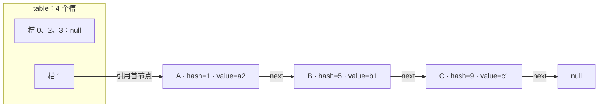
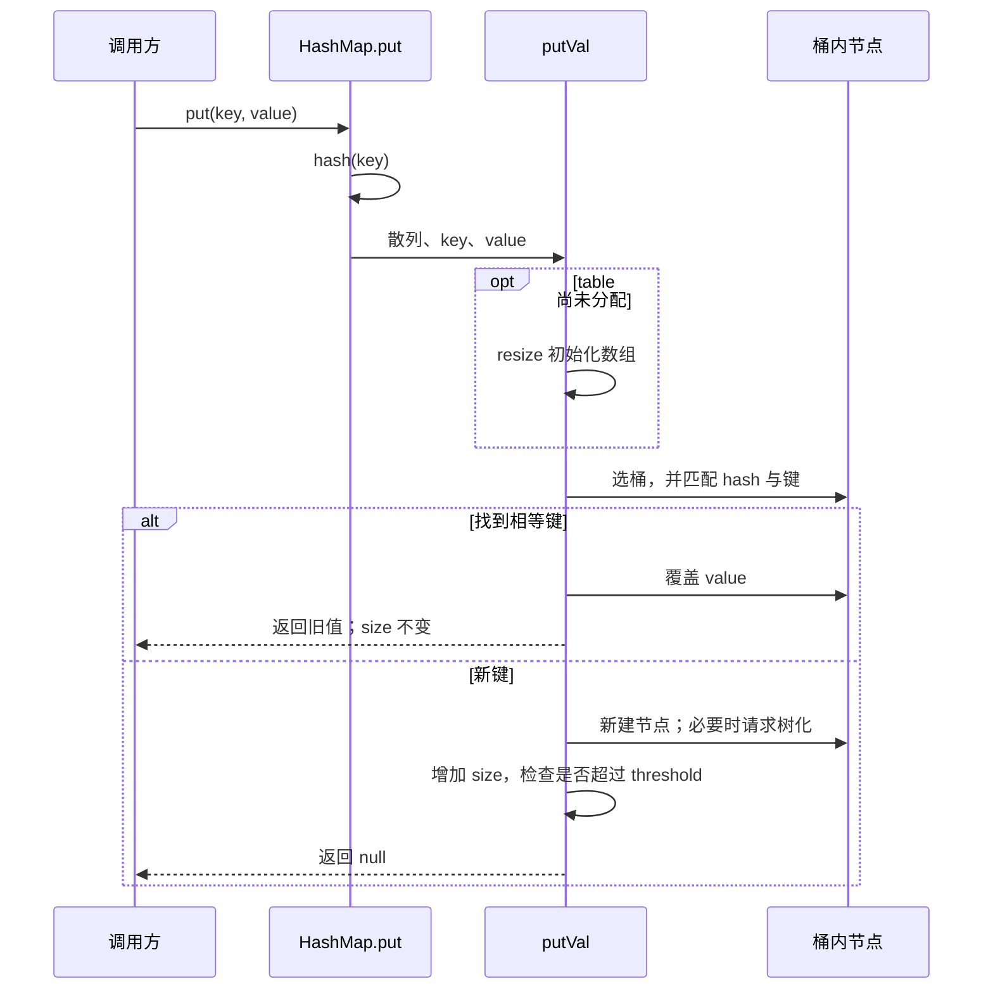
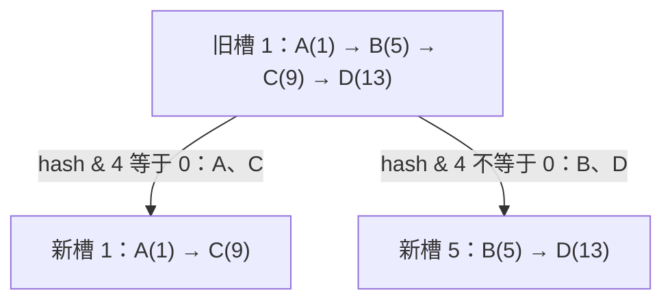
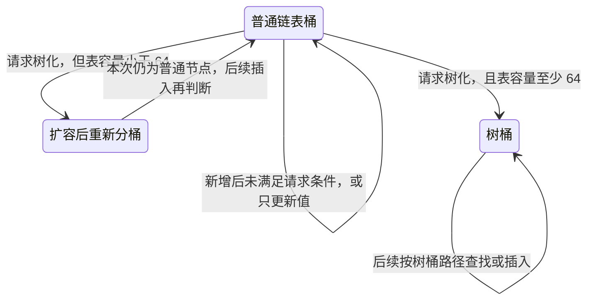

# HashMap 的查找、冲突与扩容

往 Map 放入两个不同对象，`size` 可能只增加一次；把已放进去的键改一个字段，甚至用原来的对象引用，也可能查不到它。

这两件事都与“键的身份”有关。HashMap 先用散列缩小查找范围，再在候选节点中判断键是否相等。理解这两层，比先背默认容量和树化阈值更有用。

本篇先建立这个模型，再用同一组输入追踪 `put`、查找和扩容。需要逐分支核对时，转到[源码深读](./hashmap-source.md)。本文的内部布局限定 **OpenJDK jdk-21+35**，接口行为依据 **Java SE 21**；不要把实现数字当成 `Map` 接口的永久约定。

## 1. 先约定什么叫同一个键 {#key-identity}

业务里可用不可变的用户 ID 作为键。例如两个 `new UserId(42)`，只要相等性按 ID 定义，就应找到同一份资料，而不是取决于对象是否在同一内存位置。

这里需要分清四种关系：

| 关系 | 判断的问题 | 对 HashMap 意味着什么 |
| --- | --- | --- |
| `a == b` | 是不是同一个对象引用 | 是一个快速匹配条件，但查找仍先定位桶和比对保存的 hash |
| `a.equals(b)` | 按这个类型的规则，是否代表同一个键 | 契约正确时，应定位同一条映射 |
| `a.hashCode() == b.hashCode()` | 原始散列值是否相同 | 不证明键相等；不同键可以碰撞 |
| 两个索引相同 | 本次表容量下是否落在同一个桶 | 范围更宽：不同完整散列也可能共用一个桶 |

相等性要求是单向的：**相等对象必须有相同的 `hashCode`，相同 `hashCode` 不要求对象相等**。参与相等性的状态没变时，散列结果也应保持一致。重写 `equals` 却让 `hashCode` 仍按对象身份计算，常会破坏这个契约。[Object 的相等性与散列契约](https://docs.oracle.com/en/java/javase/21/docs/api/java.base/java/lang/Object.html#hashCode())

不要把“冲突”都理解成同一件事。下面 A、B 的完整散列不同，但在小表中索引相同；另一个 X 可以与 A 的完整散列相同而仍不相等。两种情形都需要桶内匹配。

### 一组可以手算的键

为了看到位置变化，例子人为控制散列值。`Key` 的两个分量都参与 record 自动生成的 `equals`，`hashCode` 则返回 `rawHash`。因此新建 `Key("A", 1)` 与旧 A 相等；`Key("X", 1)` 与 A 不相等，但散列相同。它是教学输入，**不是建议业务把散列值作为 ID 的一部分**。

下面是完整可运行的调用代码。每一步先看新增还是更新，再看它可能触发什么内部变化。

<!-- snippet: hashmap.walkthrough -->
```java steps
// !step(6:8) Key 的身份由 id 与 rawHash 共同决定；相等的 Key 必须返回同一个散列值。
// !step(11:13) 第一次放入 A。构造器只记录容量意图，首次 put 才初始化 table；新增后 size 为 1。
// !step(14:15) A' 是另一个对象但与 A 相等，返回旧值 a1、写入 a2，size 仍为 1。
// !step(16:18) B、C、D 都是不同键。它们先落在容量 4 的同一桶；D 插入后 size 超过阈值，触发扩容。
// !step(19:21) 用同一组键读回映射。扩容改变的是查找位置，A 的更新值和其余映射都应保留。
import java.util.HashMap;
import java.util.Map;

public class HashMapWalkthrough {
    // 人为控制散列值；两个分量都参与 record 的 equals。
    record Key(String id, int rawHash) {
        @Override public int hashCode() { return rawHash; }
    }

    public static void main(String[] args) {
        Map<Key, String> map = new HashMap<>(4);
        Key a = new Key("A", 1);
        System.out.println("put A -> " + map.put(a, "a1"));
        System.out.println("put A' -> " + map.put(new Key("A", 1), "a2"));
        System.out.println("size after update -> " + map.size());
        map.put(new Key("B", 5), "b1");
        map.put(new Key("C", 9), "c1");
        map.put(new Key("D", 13), "d1");
        System.out.println("size after inserts -> " + map.size());
        for (Key key : new Key[]{a, new Key("B", 5), new Key("C", 9), new Key("D", 13)}) {
            System.out.println(key.id() + " -> " + map.get(key));
        }
    }
}
```

预期输出如下。最后四行按显式数组顺序读取，**不是 HashMap 的遍历顺序承诺**。

```text
put A -> null
put A' -> a1
size after update -> 1
size after inserts -> 4
A -> a2
B -> b1
C -> c1
D -> d1
```

## 2. 一条映射如何放进 table {#table-and-bins}

把 HashMap 看成两层索引：第一层是 `table` 数组，用索引选择桶；第二层是桶内节点，通过保存的 hash 和键相等性找到映射。桶本身是数组槽位，不是每个槽里另有一个“桶对象”。

普通节点 `Node` 保存四项：`hash`、`key`、`value`、`next`。`hash` 是插入时算出的扰动后散列，`key` 是对象引用，`value` 可以被覆盖，`next` 串起同桶节点。树桶节点额外维护父子关系等字段，但仍保留用于遍历的链。[Node 字段](https://github.com/openjdk/jdk/blob/jdk-21%2B35/src/java.base/share/classes/java/util/HashMap.java#L277-L316) · [TreeNode 字段](https://github.com/openjdk/jdk/blob/jdk-21%2B35/src/java.base/share/classes/java/util/HashMap.java#L1961-L1974)

下面画的是 A 已更新、B 和 C 刚插入、D 尚未插入的状态；为了聚焦引用，空槽合并显示。



文字版：容量为 4 的数组只有槽 1 非空，它连接 A → B → C。**`size=3` 表示三条映射，不表示三个非空桶**。

几个容易混淆的量：

| 名称 | 本例此刻的值 | 负责什么 |
| --- | --- | --- |
| `size` | 3 | 当前键值映射数 |
| `capacity` | 4 | 已分配 `table` 的长度；没有公开的 `capacity()` 方法 |
| `loadFactor` | 0.75 | 空间开销与桶内查找成本之间的配置参数 |
| `threshold` | 3 | 此刻新增映射后，超过它会触发规模扩容 |
| `modCount` | 本例已发生三次新增 | 记录结构修改，供迭代器等检测部分错误用法；不是锁 |

表还没分配时，`threshold` 有另一种临时含义：带容量构造器将目标桶数存进它，供首次初始化使用。因此 `new HashMap<>(4)` 刚返回时不是“已经分配四个桶、扩容阈值等于三”。这些是字段生命周期的不同阶段。[字段与构造器](https://github.com/openjdk/jdk/blob/jdk-21%2B35/src/java.base/share/classes/java/util/HashMap.java#L382-L479)

## 3. 从 hashCode 到桶索引 {#hash-and-index}

本版本对非 null 键先做：

```java
int h = key.hashCode();
int spread = h ^ (h >>> 16);
int index = spread & (capacity - 1);
```

这是将上游两处表达式拆开后的**计算示意**，不是额外调用的一套哈希库。`hash(null)` 为 0。非空表长度是 2 的幂，所以 `capacity - 1` 的低位全是 1，按位与就能选出这些低位。[hash](https://github.com/openjdk/jdk/blob/jdk-21%2B35/src/java.base/share/classes/java/util/HashMap.java#L320-L339) · [putVal 选桶](https://github.com/openjdk/jdk/blob/jdk-21%2B35/src/java.base/share/classes/java/util/HashMap.java#L631-L641)

为什么先扰动？如果仅低位参加索引，一批“只在高位不同”的散列会浪费已有信息。无符号右移 16 位，再异或，使原来高 16 位也影响低 16 位。它成本小，却不是加密，也不能消灭碰撞：原始 `hashCode` 全一样，扰动结果依然全一样。

<details>
<summary>补先修：与、异或、无符号右移怎么手算？</summary>

- `&`：对应位都为 1，结果才为 1；可用作“只留下这些位”的掩码
- `^`：对应位不同才为 1；把高位信息混入低位时，已有低位也保留影响
- `>>>`：向右移动，左边补 0；这里处理的是 32 位 `int` 的位模式

容量 4 的掩码是二进制 `0011`。B 的散列 5 是 `0101`，所以 `0101 & 0011 = 0001`，索引为 1。

再看一个高位参与的例子：原始值 `0x00010001`，右移得到 `0x00000001`，异或得到 `0x00010000`。容量 16 时，直接取原始值低四位会得到 1；实际扰动后低四位为 0，索引为 0。

散列可以是负数。掩码只留下合法索引位，不需要先 `Math.abs`；后者还要面对 `Integer.MIN_VALUE` 取绝对值仍是负数的问题。

</details>

A、B、C、D 的原始值都小于 65536，右移结果为 0，因此本例的扰动后散列与原始值相同：

| 键 | 扰动后散列，低四位 | 容量 4：与 `0011` | 容量 8：与 `0111` |
| --- | --- | --- | --- |
| A | 1，`0001` | 1 | 1 |
| B | 5，`0101` | 1 | 5 |
| C | 9，`1001` | 1 | 1 |
| D | 13，`1101` | 1 | 5 |

因此，“同桶”是当前容量下的关系。A 和 B 今天共用槽 1，扩容后就可能分开。

## 4. 一次 put 做了哪些决定 {#put-path}

入口是 `put(key, value)`，先调用 `hash(key)`，再将散列、键和值交给 `putVal`。后者根据状态选择路径，而不是依次把所有内部方法都调用一遍。



文字版：**更新和新增在结构计数之前分开返回**。链表过长触发的扩容与 `size` 超阈值触发的扩容，也是两个不同入口。

将调用代码的状态逐步展开：

| 操作完成后 | 这次发生什么 | `size` / 容量 / 阈值 |
| --- | --- | --- |
| 构造 `new HashMap<>(4)` | 记录初始目标，`table` 仍为 null | 0 / 尚未分配 / 4，此时为初始容量提示 |
| `put(A, a1)` | 初始化数组；槽 1 为空，新建 A | 1 / 4 / 3 |
| `put(A', a2)` | hash 相同且键相等；覆盖 A 的值 | 1 / 4 / 3 |
| `put(B, b1)` | 同桶但完整 hash 不同，追加 B | 2 / 4 / 3 |
| `put(C, c1)` | 追加 C；`size == threshold` 不触发这里的扩容 | 3 / 4 / 3 |
| `put(D, d1)` | 先追加 D，再发现 4 > 3，扩为 8 桶 | 4 / 8 / 6 |

表中容量与阈值来自固定源码的推演；基础实验通过公共 API 检查映射和返回值，**没有把推演表伪装成内部字段测量结果**。

桶内匹配为何既检查 hash 又检查 equals？完整 hash 不同可以快速排除；完整 hash 相同仍可能是不同键，需要引用相同或 `key.equals(已存键)` 才能确认。若 `equals` 很昂贵，桶查找的真实成本也会随之增加。

## 5. 扩容不是把数组复制大一点 {#resize}

D 插入后，旧链是 A → B → C → D，旧索引都是 1。如果只是把这条链复制到新数组槽 1，B 的下一次 `get` 会按容量 8 算到槽 5，从而找不到它。**新的索引规则要求重新组织节点位置**。

本版本普通翻倍扩容利用一个性质：旧容量为 `oldCap = 2^k` 时，新掩码比旧掩码只多一个位。旧索引 `j` 已经确定，新增位只有两种情况：

- `(保存的 hash & oldCap) == 0`：新索引仍为 `j`
- 否则：新索引为 `j + oldCap`

本例 `oldCap=4`，检查的就是二进制 `0100` 位。A、C 这一位是 0，留在 1；B、D 这一位是 1，移动到 5。迁移使用节点保存的 hash，**不会为这次普通扩容再次调用每个键的 `hashCode()`**。[resize 的链表拆分](https://github.com/openjdk/jdk/blob/jdk-21%2B35/src/java.base/share/classes/java/util/HashMap.java#L683-L755)



文字版：一个旧桶拆成低位组和高位组，两组内部的链上相对次序各自保留。它不表示整个 Map 保证插入顺序；后续树化、不同容量和不同操作都不应被当作业务排序规则。

### 为什么扩容不该被当成免费操作？

迁移要扫描旧表、处理节点，还要分配新数组。单次触发扩容的 `put` 不具有与普通空桶插入相同的成本。散列分布良好、采用通常的增长方式时，可以用摊还分析理解一系列插入的平均成本；不能据此保证某一次请求的尾延迟。

如果已知大致映射数，在 Java 21 可优先表达这个意图：

```java
Map<String, Integer> counts = HashMap.newHashMap(13);
```

这里 13 是预期映射数；`new HashMap<>(13)` 的参数则是初始**容量**。在本实现、默认负载因子下，后者会向上取到 16 桶，规模阈值为 12，第 13 个不同键的普通 `put` 就会触发扩容。`newHashMap(13)` 会按预期映射数计算更合适的初始容量，但也不能承诺极端碰撞不触发其他扩容路径。[工厂方法 API](https://docs.oracle.com/en/java/javase/21/docs/api/java.base/java/util/HashMap.html#newHashMap(int))

预分配也有代价：很多空槽占空间，迭代还需扫描它们。别为了“永不扩容”按不可实现的最大业务规模分配；先估计同时存活的映射量和遍历频率，再测实际负载。

## 6. 什么时候链表变树，为什么先扩容 {#treeify}

大量节点挤在同桶时，链式匹配会越来越长。树桶尝试降低这部分搜索成本，但节点更复杂，也需要维护平衡。因此实现没有让所有桶一开始都是树。

**固定版本、固定入口：以下第 8/9 个的推导只讨论 `put → putVal` 的普通链表新增路径。**

1. 原桶已有至少 8 个节点，追加第 9 个不同键时，`putVal` 才请求 `treeifyBin`
2. `treeifyBin` 发现表容量小于 64，会调用 `resize`，而不是树化
3. 表容量至少 64，且目标桶非空，才将链表节点转换为树节点
4. 覆盖已有键不会因为桶里恰好有 8 个节点而自动进入这条新增分支

`TREEIFY_THRESHOLD=8`、`MIN_TREEIFY_CAPACITY=64` 是这里的实现常量；**“长度达到 8 就必定树化”丢失了调用位置、计数方式和容量条件**。[putVal 的计数条件](https://github.com/openjdk/jdk/blob/jdk-21%2B35/src/java.base/share/classes/java/util/HashMap.java#L645-L656) · [treeifyBin](https://github.com/openjdk/jdk/blob/jdk-21%2B35/src/java.base/share/classes/java/util/HashMap.java#L757-L780)

下面是这个受限路径的形态转换图，省略查找、树内平衡和删除：



文字版：树化请求不是树化结果。小表先扩容，是因为增加一个索引位有机会把拥挤桶拆开；但若所有键的完整 hash 都相同，增大表也分不开它们，最终还需要树桶。

一个容易检查的对照：初始容量请求为 64、所有键 hash 为 0 时，普通 `put` 的第 8 次插入后仍是 Node，第 9 次后为 TreeNode。无参构造器从默认容量开始，相同输入的第 9、10 次先促使扩容，第 11 次才成为树桶。后一个结论也依赖这组输入、默认参数和这条调用路径。

**不要把这个插入序号外推到所有 API。** 本版本 `computeIfAbsent` 在遍历完已有 7 个不等键后，计数已是 7；加入第 8 个键时便会请求树化。源码深页单独[比较这两条路径](./hashmap-source.md#treeify-paths)，实验也做了对照。

退化回链表同样不能只背数字：扩容拆分树桶时，某一组节点数不大于 6，会转回普通链表；删除树节点的路径则还检查树形和 `movable`，不是每次统一计算“剩 6 个就退化”。[树拆分与删除的区别](./hashmap-source.md#untreeify)

### 树桶是否保证任意键查找都为 O(log n)？

红黑树的高度受约束，不等于键总能告诉查找应该走哪一边。散列可区分，或相同散列下键有可用的比较次序时，树化能有效控制搜索路径；**完整 hash 都相同，又缺少可用比较次序时，查找可能搜索两边子树**。因此不能无条件写“树化以后任何输入都保证 O(log n)”。[TreeNode.find 的回退分支](https://github.com/openjdk/jdk/blob/jdk-21%2B35/src/java.base/share/classes/java/util/HashMap.java#L2012-L2042)

也别为了触发快路径，随意让业务键实现与相等性不协调的比较规则。首先保持键契约、避免病态散列，再在真实输入下验证性能。本文没有做性能基准或声称某个实现总是更快。

## 7. 读、改、遍历时，哪些边界最容易踩错 {#usage-boundaries}

### 读取：get 的 null 不一定表示没有键

`get` 与 `put` 使用相同的定位原则，只是匹配后返回节点的值，不做插入。HashMap 允许 null 键和 null 值，因此 `get("present") == null` 可能是未映射，也可能是确实保存了 null；需要区分时再用 `containsKey`。不要把“当前查找没有找到”直接变成一个跨线程检查后再写的原子协议。[get 与 containsKey](https://docs.oracle.com/en/java/javase/21/docs/api/java.base/java/util/HashMap.html#get(java.lang.Object))

### 更新：方便方法不自动带来线程安全

`put` 返回旧值；`putIfAbsent` 对未映射或映射为 null 的键写入；`computeIfAbsent` 可用于按需构造值，它也会处理现值为 null 的情形，回调返回 null 则不新增映射。回调里不要修改同一个 Map。[computeIfAbsent](https://docs.oracle.com/en/java/javase/21/docs/api/java.base/java/util/HashMap.html#computeIfAbsent(K,java.util.function.Function))

HashMap 上的一次 `computeIfAbsent` 不会因此变成并发安全的“初始化一次”。共享可变结构仍要明确同步与所有权；换成并发容器后，也需继续检查回调、值对象和多键业务不变量。

### 可变键：原对象引用也救不了改掉的身份

下面是反例，`id` 同时参与 `equals` 与 `hashCode`。它不是有效键设计。

```java
final class MutableKey {
    int id;
    MutableKey(int id) { this.id = id; }
    @Override public int hashCode() { return id; }
    @Override public boolean equals(Object other) {
        return other instanceof MutableKey key && id == key.id;
    }
}
```

```java
Map<MutableKey, String> map = new HashMap<>();
MutableKey key = new MutableKey(1);
map.put(key, "saved");
key.id = 2;
System.out.println(map.get(key)); // 本文固定输入/实现观察：null
System.out.println(map.size());   // 1：节点没有因此被删除
```

插入时节点保存 hash 1；修改之后，本次查找计算 hash 2。对象引用虽然一样，查找先去了另一个位置，也无法通过保存 hash 的检查。扩容使用旧 hash，并不是修复这种错误的手段。

Map 的文档明确不规定这种影响相等性的键修改所产生的行为，所以 **本例输出不能外推成所有可变键、所有 Map 的必然结果**。有些修改可能碰巧仍能查到，这不使设计安全。[可变键约束](https://docs.oracle.com/en/java/javase/21/docs/api/java.base/java/util/Map.html)

工程上优先使用不可变业务 ID；如果必须改变键身份，先按旧身份移除，再更改并重新插入，而且要确认没有其他别名在容器内部时修改它。record 也只是组件引用不可重新赋值；如果组件指向可变对象，仍需检查其相等性是否会变。

### 遍历：视图不是快照，fail-fast 不是并发控制

同时需要键和值时，用 `entrySet()` 直接访问映射。需要在遍历中删除，使用该迭代器的 `remove`；需要改当前项的值，可使用迭代返回项的 `setValue`。不要一边增强 for，一边调用 `map.put` 新增结构，并指望它总能继续。

`keySet`、`values`、`entrySet` 是关联到底层 Map 的视图。HashMap 迭代成本与 **容量加映射数** 有关，空槽过多也会增加扫描工作。fail-fast 尽力报告结构修改，不能作为同步机制，也不能以“没抛 ConcurrentModificationException”证明没有竞态。[HashMap API 与 entrySet](https://docs.oracle.com/en/java/javase/21/docs/api/java.base/java/util/HashMap.html#entrySet())

## 8. 怎么选，与怎么继续学 {#selection}

先问需要的语义，再问平均查找成本：

| 需求 | 候选 | 再确认的边界 |
| --- | --- | --- |
| 单线程、无需顺序的键值关联 | HashMap | 稳定相等性、散列分布、容量和内存 |
| 确定的插入顺序，或访问顺序 | LinkedHashMap | 顺序模式及更新语义；访问顺序模式下读取也可能调整结构 |
| 按键排序、前驱后继或范围查询 | TreeMap | 比较器/自然顺序应与相等性一致；get/put/remove 等按键操作为对数级 |
| 多线程共享键值状态 | ConcurrentHashMap | 单键原子方法的语义、值对象是否线程安全；不提供任意多键事务，且不接受 null 键和值 |
| 希望对整个普通 Map 加同一把锁 | Collections.synchronizedMap | 组合操作与遍历仍要按其文档持有正确的锁 |
| 有容量上限、过期与淘汰策略的缓存 | 明确提供这些机制的缓存实现 | 普通 Map 没有自动完成这些资源管理工作 |

官方入口：[LinkedHashMap](https://docs.oracle.com/en/java/javase/21/docs/api/java.base/java/util/LinkedHashMap.html)、[TreeMap](https://docs.oracle.com/en/java/javase/21/docs/api/java.base/java/util/TreeMap.html)、[ConcurrentHashMap](https://docs.oracle.com/en/java/javase/21/docs/api/java.base/java/util/concurrent/ConcurrentHashMap.html)、[synchronizedMap](https://docs.oracle.com/en/java/javase/21/docs/api/java.base/java/util/Collections.html#synchronizedMap(java.util.Map))。

“只覆盖已有值不算结构修改”是迭代器相关的区分，**不代表多线程覆盖值就安全**。如果构建完成后只共享读取，也仍需安全发布，并保证后续没有未经同步的修改。

### 用三个变化检验理解

1. 把 A' 改为 `Key("X", 1)`：`size` 会如何变化？完整 hash 相同，为什么不是覆盖？
2. 保持 A/B/C/D 的 hash 不变，把容量从 4 换成 8：哪些节点还同桶？若所有 hash 都为 1，扩容是否还分得开？
3. 原来由一个线程独占的 Map 改为多个请求线程共享：是否只要增加 `computeIfAbsent` 就足够？还有哪些不变量要保护？

<details>
<summary>展开推理答案与面试复习入口</summary>

1. X 与 A 不相等，会新增映射；完整 hash 只是候选过滤，不是业务身份。回看[键身份](#key-identity)
2. A/C 在索引 1，B/D 在索引 5；完整 hash 全相同就分不开。回看[新增索引位](#resize)
3. 不够。HashMap 不提供所需同步；还要考虑值的可变性、复合读写、多键关系和生命周期。回看[选型](#selection)

如果被问“HashMap 为什么用 2 的幂”：解释掩码寻址和翻倍时只增加一位，而不是只答“因为位运算快”。如果被问“什么时候树化”：先说明版本和入口，再解释数量检查、容量分支、更新与新增差别。如果被问“JDK 7 扩容问题”：先分清历史实现，再讨论并发约束，不把旧 `transfer` 图套给 JDK 21。[继续源码深读](./hashmap-source.md)

</details>

## 验证与可运行示例 {#verification}

[下载 JDK 21 最小实验包](/examples/hashmap-jdk21-lab.zip)。先运行 `JAVA_HOME=/你的/JDK21 bash run.sh api`；只有想对照固定实现的树桶变化时，再运行 `impl` 或完整 `verify`。无需 Maven、网络依赖、反射、代理、`--add-opens` 或额外服务。

本次已在 Temurin 21.0.12.1+1-LTS 执行：键覆盖与碰撞、位运算推演配合映射保留、违约键与可变键反例、null 语义、同线程迭代误用和容量工厂；另有明确标为实现观察的树化/拆分检查。完整说明、可见断言和原始日志均在包内。

<details>
<summary>展开验证范围、反向断言与版本差异</summary>

- 运行环境：Linux x86_64，Temurin 21.0.12.1+1-LTS，`javac 21.0.12.1`，`--release 21`；每个实验 JVM 限堆 64 MiB、1 个活动处理器
- 源码讲解基线：OpenJDK `jdk-21+35`。所用运行工具链 `src.zip` 中的 `HashMap.java` 与该基线文件字节相同；这只说明这个源文件一致，不把两个 JDK 整体视作同一构建
- 公共 API 模式：7 个场景通过；基础调用示例输出与全文展示一致。破坏键契约的两个场景记录的是该固定输入下的反例，不能升级为 API 保证
- 可选实现模式：通过公开 `entrySet()` 拿到 `Map.Entry`，只读取 `getClass().getName()`，观察 Node/TreeNode。未读取私有 `table`、`threshold`，没有测量容量、树高度或红黑树颜色
- 观察结果：容量请求 64 时第 8 次普通 put 后仍是 Node，第 9 次为 TreeNode；无参构造的同 hash 键第 11 次为 TreeNode；`computeIfAbsent` 在已有 7 个碰撞键时加入第 8 个可树化；扩容拆分后的 6 节点组为 Node、7 节点组为 TreeNode
- 5 个反向断言分别故意假设“相等键新增”“碰撞覆盖”“可变键仍可读”“第 8 个 put 必树化”“扩容索引全不变”，均由主异常首行的 `java.lang.AssertionError` 类型、对应命题文本和退出码 1 被验证器识别。验证器整体退出 0，不把编译错误、仅包含同一文本的其他异常或意外成功当作反例成功
- 验证器回归：另在隔离副本中运行 7 个变异，包括把 AssertionError 换成携带相同文本的 IllegalStateException、把 compute 回调的值 8 改成 800、丢失旧映射与污染旧值；验证器均拒绝。这是对教学验证器的检验，不是对 JDK 做变异测试
- 未执行：JDK 21 GA 二进制运行、JDK 7 历史并发复现、性能基准、并发安全证明、GC/内存占用测量、私有字段或树平衡结构检查
- 详细命令、源文件与证据哈希位于包内 `verification.json` 和 `proof/`；它们用于复核，不是正文的学习顺序

</details>
